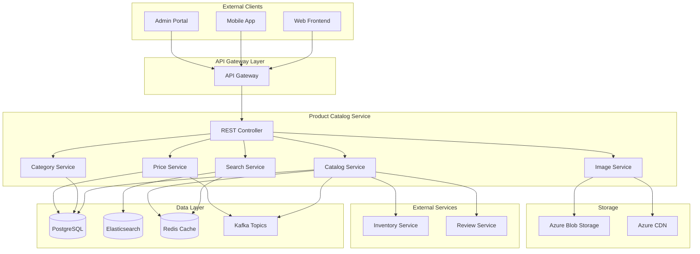

# Product Catalog Service 詳細設計書

## 目次

1. [概要](#概要)
2. [技術仕様](#技術仕様)
3. [アーキテクチャ設計](#アーキテクチャ設計)
4. [API設計](#api設計)
5. [データベース設計](#データベース設計)
6. [検索・フィルタリング設計](#検索フィルタリング設計)
7. [エラー処理](#エラー処理)
8. [テスト設計](#テスト設計)
9. [ローカル開発環境](#ローカル開発環境)
10. [本番デプロイメント](#production-deployment)
11. [監視・運用](#monitoring-operations)
12. [障害対応](#incident-response)

## 概要

### サービス概要

Product Catalog Serviceは、スキー用品販売ショップサイトの商品カタログ管理を担当するマイクロサービスです。商品情報の管理、検索、フィルタリング、カテゴリ管理、在庫連携など、商品に関する全ての機能を提供します。

### 主要責務

- **商品管理**: 商品情報の登録、更新、削除
- **カテゴリ管理**: 商品カテゴリとブランドの階層管理
- **検索機能**: 高速な商品検索とフィルタリング
- **商品詳細**: 仕様、画像、レビュー情報の管理
- **価格管理**: 価格履歴、セール価格の管理
- **在庫連携**: 在庫サービスとの在庫状況同期

### ビジネス価値

- **顧客体験向上**: 高速で正確な商品検索
- **販売促進**: 効果的な商品カタログ表示
- **運用効率化**: 商品情報の一元管理
- **データ分析**: 商品パフォーマンス分析基盤

## 技術仕様

### 使用技術スタック

| 技術領域 | 技術/ライブラリ | バージョン | 用途 |
|---------|----------------|-----------|------|
| **Runtime** | OpenJDK | 21 LTS | Java実行環境 |
| **Framework** | Jakarta EE | 11 | エンタープライズフレームワーク |
| **Application Server** | WildFly | 31.0.1 | Jakarta EEアプリケーションサーバー |
| **Persistence** | Jakarta Persistence (JPA) | 3.2 | ORM |
| **Data Access** | Jakarta Data | 1.0 | Repository抽象化 |
| **REST API** | Jakarta REST (JAX-RS) | 4.0 | RESTful Web Services |
| **CDI** | Jakarta CDI | 4.1 | 依存性注入・管理 |
| **Validation** | Jakarta Validation | 3.1 | Bean Validation |
| **JSON Processing** | Jakarta JSON-P | 2.1 | JSON処理 |
| **Database** | PostgreSQL | 16 | 主データベース |
| **Search Engine** | Elasticsearch | 8.11 | 全文検索・分析 |
| **Cache** | Redis | 7.2 | キャッシュ |
| **Message Queue** | Apache Kafka | 3.7 | 非同期イベント処理 |
| **Image Processing** | ImageIO | Built-in | 画像処理 |
| **Monitoring** | MicroProfile Metrics | 5.1 | メトリクス収集 |
| **Tracing** | MicroProfile OpenTelemetry | 2.0 | 分散トレーシング |
| **Health Check** | MicroProfile Health | 4.0 | ヘルスチェック |
| **Configuration** | MicroProfile Config | 3.1 | 設定管理 |

### 除外技術

- **Lombok**: Jakarta EE 11のRecord クラスとモダンJava機能を活用するため使用しません

### Java 21 LTS 活用機能

- **Virtual Threads**: 大量の同時検索リクエスト処理
- **Record Classes**: 商品データ転送オブジェクト
- **Pattern Matching**: 商品フィルタリングロジック
- **Text Blocks**: 複雑な検索クエリ定義
- **Sealed Classes**: 商品タイプの型安全性

## アーキテクチャ設計

### システムアーキテクチャ図



### ドメインモデル設計

```java
// 商品エンティティ（Jakarta EE 11 Record活用）
@Entity
@Table(name = "products")
public class Product {
    
    @Id
    @GeneratedValue(strategy = GenerationType.UUID)
    private UUID id;
    
    @Column(name = "sku", unique = true, nullable = false)
    private String sku;
    
    @Column(name = "name", nullable = false)
    private String name;
    
    @Column(name = "description", columnDefinition = "TEXT")
    private String description;
    
    @Embedded
    private ProductSpecification specification;
    
    @Embedded
    private ProductStatus status;
    
    @ManyToOne(fetch = FetchType.LAZY)
    @JoinColumn(name = "category_id")
    private Category category;
    
    @ManyToOne(fetch = FetchType.LAZY)
    @JoinColumn(name = "brand_id")
    private Brand brand;
    
    @OneToMany(mappedBy = "product", cascade = CascadeType.ALL, fetch = FetchType.LAZY)
    private List<ProductVariant> variants = new ArrayList<>();
    
    @OneToMany(mappedBy = "product", cascade = CascadeType.ALL, fetch = FetchType.LAZY)
    private List<ProductImage> images = new ArrayList<>();
    
    @OneToMany(mappedBy = "product", cascade = CascadeType.ALL, fetch = FetchType.LAZY)
    private List<ProductPrice> priceHistory = new ArrayList<>();
    
    @ElementCollection
    @CollectionTable(name = "product_tags", joinColumns = @JoinColumn(name = "product_id"))
    @Column(name = "tag")
    private Set<String> tags = new HashSet<>();
    
    @Column(name = "created_at", nullable = false)
    private LocalDateTime createdAt;
    
    @Column(name = "updated_at")
    private LocalDateTime updatedAt;
    
    @PrePersist
    void prePersist() {
        this.createdAt = LocalDateTime.now();
        this.updatedAt = LocalDateTime.now();
    }
    
    @PreUpdate
    void preUpdate() {
        this.updatedAt = LocalDateTime.now();
    }
    
    // Virtual Threads対応の非同期メソッド
    @Asynchronous
    public CompletableFuture<InventoryStatus> getInventoryStatusAsync() {
        return CompletableFuture.supplyAsync(() -> {
            return inventoryServiceClient.getInventoryStatus(this.id);
        });
    }
}

// Record ベース Value Objects
public record ProductSpecification(
    Material material,
    SkiType skiType,
    DifficultyLevel difficultyLevel,
    String length,
    String width,
    String weight,
    String radius,
    String flex,
    Map<String, String> additionalSpecs
) {
    
    public boolean isCompatibleWith(SkierProfile profile) {
        return switch (difficultyLevel) {
            case BEGINNER -> profile.level() == SkierLevel.BEGINNER || profile.level() == SkierLevel.INTERMEDIATE;
            case INTERMEDIATE -> profile.level() != SkierLevel.EXPERT;
            case ADVANCED -> profile.level() == SkierLevel.EXPERT || profile.level() == SkierLevel.ADVANCED;
            case EXPERT -> profile.level() == SkierLevel.EXPERT;
        };
    }
}

public record ProductStatus(
    PublishStatus publishStatus,
    boolean isActive,
    boolean isFeatured,
    boolean isDiscontinued,
    LocalDateTime publishedAt,
    LocalDateTime discontinuedAt
) {
    public boolean isAvailableForPurchase() {
        return publishStatus == PublishStatus.PUBLISHED 
            && isActive 
            && !isDiscontinued;
    }
}

// Sealed Classes for Type Safety
public sealed interface ProductEvent
    permits ProductCreatedEvent, ProductUpdatedEvent, ProductDiscontinuedEvent {
}

public record ProductCreatedEvent(
    UUID productId,
    String sku,
    String name,
    UUID categoryId,
    LocalDateTime createdAt
) implements ProductEvent {}

public record ProductUpdatedEvent(
    UUID productId,
    String fieldName,
    String oldValue,
    String newValue,
    LocalDateTime updatedAt
) implements ProductEvent {}

// Enums
public enum SkiType {
    ALL_MOUNTAIN("オールマウンテン"),
    CARVING("カービング"),
    FREESTYLE("フリースタイル"),
    RACING("レーシング"),
    TOURING("ツーリング"),
    POWDER("パウダー");
    
    private final String displayName;
    
    SkiType(String displayName) {
        this.displayName = displayName;
    }
    
    public String getDisplayName() {
        return displayName;
    }
}

public enum DifficultyLevel {
    BEGINNER(1, "初心者"),
    INTERMEDIATE(2, "中級者"),
    ADVANCED(3, "上級者"),
    EXPERT(4, "エキスパート");
    
    private final int level;
    private final String displayName;
    
    DifficultyLevel(int level, String displayName) {
        this.level = level;
        this.displayName = displayName;
    }
    
    public boolean isHigherThan(DifficultyLevel other) {
        return this.level > other.level;
    }
}

public enum PublishStatus {
    DRAFT, REVIEW_PENDING, PUBLISHED, ARCHIVED
}
```

### 商品検索インデックス設計

```java
// Elasticsearch用商品インデックス
public record ProductSearchDocument(
    String id,
    String sku,
    String name,
    String description,
    CategoryInfo category,
    BrandInfo brand,
    ProductSpecificationSearchable specification,
    PriceInfo currentPrice,
    List<String> tags,
    double popularityScore,
    LocalDateTime lastUpdated
) {
    
    public static ProductSearchDocument from(Product product) {
        return new ProductSearchDocument(
            product.getId().toString(),
            product.getSku(),
            product.getName(),
            product.getDescription(),
            CategoryInfo.from(product.getCategory()),
            BrandInfo.from(product.getBrand()),
            ProductSpecificationSearchable.from(product.getSpecification()),
            PriceInfo.from(product.getCurrentPrice()),
            new ArrayList<>(product.getTags()),
            calculatePopularityScore(product),
            product.getUpdatedAt()
        );
    }
}

public record CategoryInfo(
    String id,
    String name,
    String path,
    List<String> ancestors
) {
    public static CategoryInfo from(Category category) {
        return new CategoryInfo(
            category.getId().toString(),
            category.getName(),
            category.getPath(),
            category.getAncestors().stream()
                .map(Category::getName)
                .collect(Collectors.toList())
        );
    }
}

public record ProductSpecificationSearchable(
    String material,
    String skiType,
    String difficultyLevel,
    NumericRange lengthRange,
    NumericRange widthRange,
    NumericRange weightRange
) {
    public static ProductSpecificationSearchable from(ProductSpecification spec) {
        return new ProductSpecificationSearchable(
            spec.material().toString(),
            spec.skiType().toString(),
            spec.difficultyLevel().toString(),
            parseNumericRange(spec.length()),
            parseNumericRange(spec.width()),
            parseNumericRange(spec.weight())
        );
    }
}
```

## API設計

### OpenAPI 3.1 仕様

```yaml
# product-catalog-api.yml
openapi: 3.1.0
info:
  title: Product Catalog Service API
  version: 1.0.0
  description: スキー用品ショップ 商品カタログサービス

servers:
  - url: https://api.ski-shop.com/v1
    description: Production server
  - url: https://staging.api.ski-shop.com/v1
    description: Staging server
  - url: http://localhost:8082
    description: Local development

paths:
  /products:
    get:
      summary: 商品一覧取得・検索
      operationId: searchProducts
      tags: [Products]
      parameters:
        - name: q
          in: query
          description: 検索キーワード
          schema:
            type: string
            example: "カービングスキー"
        - name: category
          in: query
          description: カテゴリID
          schema:
            type: string
            format: uuid
        - name: brand
          in: query
          description: ブランドID
          schema:
            type: string
            format: uuid
        - name: skiType
          in: query
          description: スキータイプ
          schema:
            type: string
            enum: [ALL_MOUNTAIN, CARVING, FREESTYLE, RACING, TOURING, POWDER]
        - name: difficultyLevel
          in: query
          description: 難易度レベル
          schema:
            type: string
            enum: [BEGINNER, INTERMEDIATE, ADVANCED, EXPERT]
        - name: priceMin
          in: query
          description: 最低価格
          schema:
            type: integer
            minimum: 0
        - name: priceMax
          in: query
          description: 最高価格
          schema:
            type: integer
            minimum: 0
        - name: lengthMin
          in: query
          description: 最小長さ (cm)
          schema:
            type: integer
            minimum: 0
        - name: lengthMax
          in: query
          description: 最大長さ (cm)
          schema:
            type: integer
            minimum: 0
        - name: inStock
          in: query
          description: 在庫ありのみ
          schema:
            type: boolean
            default: false
        - name: featured
          in: query
          description: 注目商品のみ
          schema:
            type: boolean
            default: false
        - name: sort
          in: query
          description: ソート順
          schema:
            type: string
            enum: [relevance, price_asc, price_desc, name_asc, name_desc, created_desc, popularity]
            default: relevance
        - name: page
          in: query
          description: ページ番号
          schema:
            type: integer
            minimum: 1
            default: 1
        - name: size
          in: query
          description: 1ページあたりの件数
          schema:
            type: integer
            minimum: 1
            maximum: 100
            default: 20
      responses:
        '200':
          description: 商品検索結果
          content:
            application/json:
              schema:
                $ref: '#/components/schemas/ProductSearchResponse'

    post:
      summary: 商品登録
      operationId: createProduct
      tags: [Products]
      security:
        - BearerAuth: []
      requestBody:
        required: true
        content:
          application/json:
            schema:
              $ref: '#/components/schemas/ProductCreateRequest'
      responses:
        '201':
          description: 商品登録成功
          content:
            application/json:
              schema:
                $ref: '#/components/schemas/ProductResponse'

  /products/{productId}:
    get:
      summary: 商品詳細取得
      operationId: getProduct
      tags: [Products]
      parameters:
        - name: productId
          in: path
          required: true
          schema:
            type: string
            format: uuid
      responses:
        '200':
          description: 商品詳細
          content:
            application/json:
              schema:
                $ref: '#/components/schemas/ProductDetailResponse'
        '404':
          description: 商品が見つからない

    put:
      summary: 商品情報更新
      operationId: updateProduct
      tags: [Products]
      security:
        - BearerAuth: []
      parameters:
        - name: productId
          in: path
          required: true
          schema:
            type: string
            format: uuid
      requestBody:
        required: true
        content:
          application/json:
            schema:
              $ref: '#/components/schemas/ProductUpdateRequest'
      responses:
        '200':
          description: 更新成功
          content:
            application/json:
              schema:
                $ref: '#/components/schemas/ProductResponse'

  /products/{productId}/variants:
    get:
      summary: 商品バリエーション一覧取得
      operationId: getProductVariants
      tags: [Products]
      parameters:
        - name: productId
          in: path
          required: true
          schema:
            type: string
            format: uuid
      responses:
        '200':
          description: バリエーション一覧
          content:
            application/json:
              schema:
                type: array
                items:
                  $ref: '#/components/schemas/ProductVariantResponse'

  /categories:
    get:
      summary: カテゴリ階層取得
      operationId: getCategories
      tags: [Categories]
      parameters:
        - name: parentId
          in: query
          description: 親カテゴリID
          schema:
            type: string
            format: uuid
        - name: depth
          in: query
          description: 取得階層の深さ
          schema:
            type: integer
            minimum: 1
            maximum: 5
            default: 3
      responses:
        '200':
          description: カテゴリ階層
          content:
            application/json:
              schema:
                type: array
                items:
                  $ref: '#/components/schemas/CategoryResponse'

  /brands:
    get:
      summary: ブランド一覧取得
      operationId: getBrands
      tags: [Brands]
      parameters:
        - name: featured
          in: query
          description: 注目ブランドのみ
          schema:
            type: boolean
            default: false
      responses:
        '200':
          description: ブランド一覧
          content:
            application/json:
              schema:
                type: array
                items:
                  $ref: '#/components/schemas/BrandResponse'

components:
  schemas:
    ProductSearchResponse:
      type: object
      properties:
        products:
          type: array
          items:
            $ref: '#/components/schemas/ProductSummaryResponse'
        pagination:
          $ref: '#/components/schemas/PaginationInfo'
        facets:
          $ref: '#/components/schemas/SearchFacets'
        total:
          type: integer
          example: 1250

    ProductSummaryResponse:
      type: object
      properties:
        id:
          type: string
          format: uuid
        sku:
          type: string
          example: "SKI-CARV-001"
        name:
          type: string
          example: "プロカービングスキー165cm"
        description:
          type: string
          example: "初心者から中級者向けのカービングスキー"
        category:
          $ref: '#/components/schemas/CategorySummaryResponse'
        brand:
          $ref: '#/components/schemas/BrandSummaryResponse'
        currentPrice:
          $ref: '#/components/schemas/PriceResponse'
        primaryImage:
          $ref: '#/components/schemas/ImageResponse'
        specification:
          $ref: '#/components/schemas/SpecificationSummaryResponse'
        rating:
          type: number
          format: float
          minimum: 0
          maximum: 5
          example: 4.2
        reviewCount:
          type: integer
          example: 125
        inStock:
          type: boolean
        featured:
          type: boolean

    ProductCreateRequest:
      type: object
      required:
        - sku
        - name
        - categoryId
        - brandId
        - specification
      properties:
        sku:
          type: string
          pattern: '^[A-Z0-9-]+$'
          example: "SKI-CARV-001"
        name:
          type: string
          maxLength: 255
          example: "プロカービングスキー165cm"
        description:
          type: string
          maxLength: 2000
          example: "初心者から中級者向けのカービングスキー"
        categoryId:
          type: string
          format: uuid
        brandId:
          type: string
          format: uuid
        specification:
          $ref: '#/components/schemas/SpecificationRequest'
        tags:
          type: array
          items:
            type: string
          maxItems: 20
        status:
          $ref: '#/components/schemas/ProductStatusRequest'

    SpecificationRequest:
      type: object
      required:
        - material
        - skiType
        - difficultyLevel
        - length
        - width
      properties:
        material:
          type: string
          enum: [WOOD, COMPOSITE, CARBON, TITANIUM]
        skiType:
          type: string
          enum: [ALL_MOUNTAIN, CARVING, FREESTYLE, RACING, TOURING, POWDER]
        difficultyLevel:
          type: string
          enum: [BEGINNER, INTERMEDIATE, ADVANCED, EXPERT]
        length:
          type: string
          pattern: '^\d+cm$'
          example: "165cm"
        width:
          type: string
          pattern: '^\d+mm$'
          example: "75mm"
        weight:
          type: string
          pattern: '^\d+(\.\d+)?kg$'
          example: "2.8kg"
        radius:
          type: string
          pattern: '^\d+m$'
          example: "14m"
        flex:
          type: string
          enum: [SOFT, MEDIUM, HARD]

  securitySchemes:
    BearerAuth:
      type: http
      scheme: bearer
      bearerFormat: JWT
```

## データベース設計

### ERD（Entity Relationship Diagram）

```mermaid
erDiagram
    PRODUCTS {
        UUID id PK
        VARCHAR sku UK
        VARCHAR name
        TEXT description
        UUID category_id FK
        UUID brand_id FK
        VARCHAR material
        VARCHAR ski_type
        VARCHAR difficulty_level
        VARCHAR length
        VARCHAR width
        VARCHAR weight
        VARCHAR radius
        VARCHAR flex
        VARCHAR publish_status
        BOOLEAN is_active
        BOOLEAN is_featured
        BOOLEAN is_discontinued
        TIMESTAMP published_at
        TIMESTAMP discontinued_at
        TIMESTAMP created_at
        TIMESTAMP updated_at
    }
    
    CATEGORIES {
        UUID id PK
        VARCHAR name
        TEXT description
        UUID parent_id FK
        VARCHAR path
        INTEGER level
        INTEGER sort_order
        BOOLEAN is_active
        TIMESTAMP created_at
        TIMESTAMP updated_at
    }
    
    BRANDS {
        UUID id PK
        VARCHAR name
        TEXT description
        VARCHAR country
        VARCHAR logo_url
        BOOLEAN is_featured
        BOOLEAN is_active
        TIMESTAMP created_at
        TIMESTAMP updated_at
    }
    
    PRODUCT_VARIANTS {
        UUID id PK
        UUID product_id FK
        VARCHAR variant_type
        VARCHAR variant_value
        VARCHAR sku
        DECIMAL additional_price
        BOOLEAN is_default
        TIMESTAMP created_at
        TIMESTAMP updated_at
    }
    
    PRODUCT_IMAGES {
        UUID id PK
        UUID product_id FK
        VARCHAR image_url
        VARCHAR alt_text
        VARCHAR image_type
        INTEGER sort_order
        BOOLEAN is_primary
        TIMESTAMP created_at
        TIMESTAMP updated_at
    }
    
    PRODUCT_PRICES {
        UUID id PK
        UUID product_id FK
        DECIMAL base_price
        DECIMAL sale_price
        DECIMAL cost_price
        TIMESTAMP effective_from
        TIMESTAMP effective_to
        BOOLEAN is_current
        TIMESTAMP created_at
    }
    
    PRODUCT_TAGS {
        UUID product_id FK
        VARCHAR tag
    }
    
    PRODUCT_REVIEWS_SUMMARY {
        UUID product_id PK FK
        DECIMAL average_rating
        INTEGER review_count
        INTEGER five_star_count
        INTEGER four_star_count
        INTEGER three_star_count
        INTEGER two_star_count
        INTEGER one_star_count
        TIMESTAMP last_updated
    }
    
    PRODUCTS ||--o{ PRODUCT_VARIANTS : "has"
    PRODUCTS ||--o{ PRODUCT_IMAGES : "has"
    PRODUCTS ||--o{ PRODUCT_PRICES : "has"
    PRODUCTS ||--o{ PRODUCT_TAGS : "has"
    PRODUCTS ||--|| PRODUCT_REVIEWS_SUMMARY : "summarizes"
    CATEGORIES ||--o{ CATEGORIES : "parent"
    CATEGORIES ||--o{ PRODUCTS : "categorizes"
    BRANDS ||--o{ PRODUCTS : "manufactures"
```

### Repository設計（Jakarta Data活用）

```java
// 商品Repository
@Repository
public interface ProductRepository extends BasicRepository<Product, UUID> {
    
    @Query("SELECT p FROM Product p WHERE p.sku = :sku")
    Optional<Product> findBySku(String sku);
    
    @Query("""
        SELECT p FROM Product p 
        WHERE p.category.id = :categoryId 
        AND p.status.publishStatus = 'PUBLISHED' 
        AND p.status.isActive = true
        ORDER BY p.createdAt DESC
        """)
    List<Product> findByCategoryAndPublished(UUID categoryId);
    
    @Query("""
        SELECT p FROM Product p 
        WHERE p.brand.id = :brandId 
        AND p.status.publishStatus = 'PUBLISHED' 
        AND p.status.isActive = true
        """)
    List<Product> findByBrandAndPublished(UUID brandId);
    
    @Query("""
        SELECT p FROM Product p 
        WHERE p.status.isFeatured = true 
        AND p.status.publishStatus = 'PUBLISHED' 
        AND p.status.isActive = true
        ORDER BY p.createdAt DESC
        """)
    @Limit(20)
    List<Product> findFeaturedProducts();
    
    @Query("""
        SELECT p FROM Product p 
        WHERE p.specification.skiType = :skiType 
        AND p.specification.difficultyLevel = :difficultyLevel
        AND p.status.publishStatus = 'PUBLISHED'
        """)
    List<Product> findBySkiTypeAndDifficulty(SkiType skiType, DifficultyLevel difficultyLevel);
}

// カテゴリRepository
@Repository
public interface CategoryRepository extends BasicRepository<Category, UUID> {
    
    @Query("SELECT c FROM Category c WHERE c.parent IS NULL ORDER BY c.sortOrder")
    List<Category> findRootCategories();
    
    @Query("""
        SELECT c FROM Category c 
        WHERE c.parent.id = :parentId 
        AND c.isActive = true 
        ORDER BY c.sortOrder
        """)
    List<Category> findByParentId(UUID parentId);
    
    @Query("""
        SELECT c FROM Category c 
        WHERE c.path LIKE :pathPrefix% 
        AND c.isActive = true 
        ORDER BY c.level, c.sortOrder
        """)
    List<Category> findByPathPrefix(String pathPrefix);
    
    @Query("SELECT c FROM Category c WHERE c.level <= :maxLevel ORDER BY c.path")
    List<Category> findByMaxLevel(Integer maxLevel);
}
```

## 検索・フィルタリング設計

### Elasticsearch設定

```java
// 商品サービス (CQRS Pattern 対応)
@ApplicationScoped
@Transactional
public class ProductService {
    
    private static final Logger logger = LoggerFactory.getLogger(ProductService.class);
    
    @Inject
    private ProductRepository productRepository;
    
    @Inject
    private CategoryRepository categoryRepository;
    
    @Inject
    private ProductEventPublisher eventPublisher;
    
    @Inject
    private ProductSearchIndexer searchIndexer;
    
    @Inject
    private ProductProcessingSaga productProcessingSaga;
    
    @Inject
    private ProductValidator productValidator;
    
    // CQRS Command Handlers
    @CommandHandler
    public ProductResult handle(CreateProductCommand command) {
        try {
            // 商品データ検証
            var validationResult = productValidator.validate(command.toRequest());
            if (!validationResult.isValid()) {
                return new ProductResult(false, null, validationResult.getErrorMessage());
            }
            
            // カテゴリ存在確認
            var category = categoryRepository.findById(command.categoryId())
                .orElseThrow(() -> new CategoryNotFoundException("Category not found: " + command.categoryId()));
            
            // 商品作成
            var product = new Product();
            product.setSku(command.sku());
            product.setName(command.name());
            product.setDescription(command.description());
            product.setShortDescription(command.shortDescription());
            product.setCategory(category);
            product.setBrand(command.brand());
            product.setPrice(command.price());
            product.setCostPrice(command.costPrice());
            product.setStatus(ProductStatus.ACTIVE);
            product.setCreatedAt(LocalDateTime.now());
            
            var savedProduct = productRepository.save(product);
            
            // イベント発行
            eventPublisher.publish(new ProductCreatedEvent(
                savedProduct.getId(),
                savedProduct.getSku(),
                savedProduct.getName(),
                savedProduct.getPrice(),
                savedProduct.getCategory().getId(),
                LocalDateTime.now()
            ));
            
            logger.info("Product created: sku={}, name={}", savedProduct.getSku(), savedProduct.getName());
            return new ProductResult(true, savedProduct.getId(), "商品作成完了");
            
        } catch (Exception e) {
            logger.error("商品作成エラー: sku=" + command.sku(), e);
            return new ProductResult(false, null, e.getMessage());
        }
    }
    
    @CommandHandler
    public ProductResult handle(UpdateProductCommand command) {
        try {
            var product = productRepository.findById(command.productId())
                .orElseThrow(() -> new ProductNotFoundException("Product not found: " + command.productId()));
            
            var oldPrice = product.getPrice();
            
            // 商品更新
            product.setName(command.name());
            product.setDescription(command.description());
            product.setShortDescription(command.shortDescription());
            product.setPrice(command.price());
            product.setCostPrice(command.costPrice());
            product.setBrand(command.brand());
            product.setUpdatedAt(LocalDateTime.now());
            
            var savedProduct = productRepository.save(product);
            
            // 価格変更の場合は特別なイベント発行
            if (oldPrice.compareTo(command.price()) != 0) {
                eventPublisher.publish(new ProductPriceChangedEvent(
                    savedProduct.getSku(),
                    oldPrice,
                    command.price(),
                    LocalDateTime.now()
                ));
            }
            
            eventPublisher.publish(new ProductUpdatedEvent(
                savedProduct.getId(),
                savedProduct.getSku(),
                savedProduct.getName(),
                savedProduct.getPrice(),
                LocalDateTime.now()
            ));
            
            logger.info("Product updated: sku={}, name={}", savedProduct.getSku(), savedProduct.getName());
            return new ProductResult(true, savedProduct.getId(), "商品更新完了");
            
        } catch (Exception e) {
            logger.error("商品更新エラー: productId=" + command.productId(), e);
            return new ProductResult(false, null, e.getMessage());
        }
    }
    
    @CommandHandler
    public ProductResult handle(DeactivateProductCommand command) {
        try {
            var product = productRepository.findById(command.productId())
                .orElseThrow(() -> new ProductNotFoundException("Product not found: " + command.productId()));
            
            product.setStatus(ProductStatus.INACTIVE);
            product.setUpdatedAt(LocalDateTime.now());
            
            var savedProduct = productRepository.save(product);
            
            eventPublisher.publish(new ProductDeactivatedEvent(
                savedProduct.getId(),
                savedProduct.getSku(),
                command.reason(),
                LocalDateTime.now()
            ));
            
            logger.info("Product deactivated: sku={}, reason={}", savedProduct.getSku(), command.reason());
            return new ProductResult(true, savedProduct.getId(), "商品無効化完了");
            
        } catch (Exception e) {
            logger.error("商品無効化エラー: productId=" + command.productId(), e);
            return new ProductResult(false, null, e.getMessage());
        }
    }
    
    @CommandHandler
    public ProductResult handle(UpdateProductInventoryCommand command) {
        try {
            var product = productRepository.findBySku(command.sku())
                .orElseThrow(() -> new ProductNotFoundException("Product not found: " + command.sku()));
            
            // 在庫情報更新をSagaで処理
            CompletableFuture.runAsync(() -> {
                try {
                    productProcessingSaga.processInventoryUpdate(
                        product.getId(),
                        command.sku(),
                        command.availableQuantity(),
                        command.reservedQuantity()
                    );
                } catch (Exception e) {
                    logger.error("在庫更新Saga実行エラー: sku=" + command.sku(), e);
                }
            }, VirtualThread.ofVirtual().factory());
            
            return new ProductResult(true, product.getId(), "在庫更新処理開始");
            
        } catch (Exception e) {
            logger.error("在庫更新エラー: sku=" + command.sku(), e);
            return new ProductResult(false, null, e.getMessage());
        }
    }
    
    // CQRS Query Handlers
    @QueryHandler
    public ProductProjection handle(GetProductByIdQuery query) {
        var product = productRepository.findById(query.productId());
        return product.map(ProductProjection::from)
            .orElse(null);
    }
    
    @QueryHandler
    public ProductProjection handle(GetProductBySkuQuery query) {
        var product = productRepository.findBySku(query.sku());
        return product.map(ProductProjection::from)
            .orElse(null);
    }
    
    @QueryHandler
    public List<ProductProjection> handle(SearchProductsQuery query) {
        return productRepository.searchProducts(
                query.searchCriteria(), query.page(), query.size())
            .stream()
            .map(ProductProjection::from)
            .toList();
    }
    
    @QueryHandler
    public List<ProductProjection> handle(GetProductsByCategoryQuery query) {
        return productRepository.findByCategoryId(query.categoryId(), query.page(), query.size())
            .stream()
            .map(ProductProjection::from)
            .toList();
    }
    
    @QueryHandler
    public ProductStatisticsProjection handle(GetProductStatisticsQuery query) {
        var totalProducts = productRepository.countByDateRange(query.fromDate(), query.toDate());
        var activeProducts = productRepository.countActiveProducts();
        var inactiveProducts = productRepository.countInactiveProducts();
        var averagePrice = productRepository.getAveragePrice();
        
        return new ProductStatisticsProjection(
            totalProducts,
            activeProducts,
            inactiveProducts,
            averagePrice,
            LocalDateTime.now()
        );
    }
    
    // Event Handlers
    @EventHandler
    public void handle(InventoryChangedEvent event) {
        logger.info("在庫変更イベント処理開始: sku={}", event.sku());
        
        CompletableFuture.runAsync(() -> {
            try {
                productProcessingSaga.processExternalInventoryChange(
                    event.sku(),
                    event.availableQuantity(),
                    event.reservedQuantity()
                );
            } catch (Exception e) {
                logger.error("在庫変更処理エラー: sku=" + event.sku(), e);
            }
        }, VirtualThread.ofVirtual().factory());
    }
    
    @EventHandler
    public void handle(OrderCreatedEvent event) {
        logger.info("注文作成イベント処理開始: orderId={}", event.orderId());
        
        CompletableFuture.runAsync(() -> {
            try {
                productProcessingSaga.processOrderProductsUpdate(
                    event.orderId(),
                    event.orderItems()
                );
            } catch (Exception e) {
                logger.error("注文商品更新処理エラー: orderId=" + event.orderId(), e);
            }
        }, VirtualThread.ofVirtual().factory());
    }
    
    // ヘルパーメソッド
    private Product findProductById(UUID productId) {
        return productRepository.findById(productId)
            .orElseThrow(() -> new ProductNotFoundException("Product not found: " + productId));
    }
    
    private Product findProductBySku(String sku) {
        return productRepository.findBySku(sku)
            .orElseThrow(() -> new ProductNotFoundException("Product not found: " + sku));
    }
}

// 商品処理Sagaパターン
@ApplicationScoped
@Transactional
public class ProductProcessingSaga {
    
    private static final Logger logger = LoggerFactory.getLogger(ProductProcessingSaga.class);
    
    @Inject
    private ProductRepository productRepository;
    
    @Inject
    private SagaStateRepository sagaStateRepository;
    
    @Inject
    private ProductEventPublisher eventPublisher;
    
    @Inject
    private ProductSearchIndexer searchIndexer;
    
    @Inject
    private InventoryServiceClient inventoryServiceClient;
    
    public CompletableFuture<SagaResult> processInventoryUpdate(
            UUID productId, String sku, Integer availableQuantity, Integer reservedQuantity) {
        
        return CompletableFuture.supplyAsync(() -> {
            var sagaId = UUID.randomUUID();
            var sagaState = new SagaState(sagaId, productId, SagaType.PRODUCT_INVENTORY_UPDATE);
            sagaStateRepository.save(sagaState);
            
            try {
                logger.info("商品在庫更新Saga開始: sagaId={}, sku={}", sagaId, sku);
                
                // Step 1: 商品検証
                sagaState.setCurrentStep("VALIDATING_PRODUCT");
                var product = productRepository.findById(productId)
                    .orElseThrow(() -> new ProductNotFoundException("Product not found"));
                sagaState.setLastCompletedStep("VALIDATING_PRODUCT");
                
                // Step 2: 在庫サービス更新
                sagaState.setCurrentStep("UPDATING_INVENTORY");
                var inventoryResult = inventoryServiceClient.updateInventory(sku, availableQuantity, reservedQuantity);
                if (!inventoryResult.success()) {
                    return handleSagaFailure(sagaState, "在庫更新失敗", inventoryResult.message());
                }
                sagaState.setLastCompletedStep("UPDATING_INVENTORY");
                
                // Step 3: 検索インデックス更新
                sagaState.setCurrentStep("UPDATING_SEARCH_INDEX");
                searchIndexer.updateProductInventory(sku, availableQuantity);
                sagaState.setLastCompletedStep("UPDATING_SEARCH_INDEX");
                
                // Step 4: 在庫更新イベント発行
                sagaState.setCurrentStep("PUBLISHING_EVENTS");
                eventPublisher.publish(new ProductInventoryUpdatedEvent(
                    productId,
                    sku,
                    availableQuantity,
                    reservedQuantity,
                    LocalDateTime.now()
                ));
                sagaState.setLastCompletedStep("PUBLISHING_EVENTS");
                
                // Saga完了
                sagaState.complete();
                sagaStateRepository.save(sagaState);
                
                logger.info("商品在庫更新Saga完了: sagaId={}, sku={}", sagaId, sku);
                return new SagaResult(true, "在庫更新完了");
                
            } catch (Exception e) {
                logger.error("商品在庫更新Saga実行エラー: sagaId=" + sagaId, e);
                return handleSagaFailure(sagaState, "予期しないエラー", e.getMessage());
            }
        }, VirtualThread.ofVirtual().factory());
    }
    
    public CompletableFuture<SagaResult> processExternalInventoryChange(
            String sku, Integer availableQuantity, Integer reservedQuantity) {
        
        return CompletableFuture.supplyAsync(() -> {
            var sagaId = UUID.randomUUID();
            var sagaState = new SagaState(sagaId, null, SagaType.EXTERNAL_INVENTORY_SYNC);
            sagaStateRepository.save(sagaState);
            
            try {
                logger.info("外部在庫同期Saga開始: sagaId={}, sku={}", sagaId, sku);
                
                // Step 1: 商品検索
                sagaState.setCurrentStep("FINDING_PRODUCT");
                var product = productRepository.findBySku(sku);
                if (product.isEmpty()) {
                    logger.warn("商品が見つかりません: sku={}", sku);
                    sagaState.complete();
                    sagaStateRepository.save(sagaState);
                    return new SagaResult(true, "商品なし - 処理完了");
                }
                sagaState.setLastCompletedStep("FINDING_PRODUCT");
                
                // Step 2: 検索インデックス更新
                sagaState.setCurrentStep("UPDATING_SEARCH_INDEX");
                searchIndexer.updateProductInventory(sku, availableQuantity);
                sagaState.setLastCompletedStep("UPDATING_SEARCH_INDEX");
                
                // Step 3: 商品可用性イベント発行
                sagaState.setCurrentStep("PUBLISHING_EVENTS");
                if (availableQuantity == 0) {
                    eventPublisher.publish(new ProductOutOfStockEvent(
                        product.get().getId(),
                        sku,
                        LocalDateTime.now()
                    ));
                } else {
                    eventPublisher.publish(new ProductBackInStockEvent(
                        product.get().getId(),
                        sku,
                        availableQuantity,
                        LocalDateTime.now()
                    ));
                }
                sagaState.setLastCompletedStep("PUBLISHING_EVENTS");
                
                // Saga完了
                sagaState.complete();
                sagaStateRepository.save(sagaState);
                
                logger.info("外部在庫同期Saga完了: sagaId={}, sku={}", sagaId, sku);
                return new SagaResult(true, "在庫同期完了");
                
            } catch (Exception e) {
                logger.error("外部在庫同期Saga実行エラー: sagaId=" + sagaId, e);
                return handleSagaFailure(sagaState, "予期しないエラー", e.getMessage());
            }
        }, VirtualThread.ofVirtual().factory());
    }
    
    public CompletableFuture<SagaResult> processOrderProductsUpdate(
            UUID orderId, List<OrderItemDto> orderItems) {
        
        return CompletableFuture.supplyAsync(() -> {
            var sagaId = UUID.randomUUID();
            var sagaState = new SagaState(sagaId, orderId, SagaType.ORDER_PRODUCTS_UPDATE);
            sagaStateRepository.save(sagaState);
            
            try {
                logger.info("注文商品更新Saga開始: sagaId={}, orderId={}", sagaId, orderId);
                
                // Step 1: 商品人気度更新
                sagaState.setCurrentStep("UPDATING_POPULARITY");
                updateProductPopularity(orderItems);
                sagaState.setLastCompletedStep("UPDATING_POPULARITY");
                
                // Step 2: 検索インデックス更新
                sagaState.setCurrentStep("UPDATING_SEARCH_INDEX");
                for (var item : orderItems) {
                    searchIndexer.updateProductPopularity(item.sku());
                }
                sagaState.setLastCompletedStep("UPDATING_SEARCH_INDEX");
                
                // Step 3: 商品販売イベント発行
                sagaState.setCurrentStep("PUBLISHING_EVENTS");
                for (var item : orderItems) {
                    eventPublisher.publish(new ProductSoldEvent(
                        item.productId(),
                        item.sku(),
                        item.quantity(),
                        orderId,
                        LocalDateTime.now()
                    ));
                }
                sagaState.setLastCompletedStep("PUBLISHING_EVENTS");
                
                // Saga完了
                sagaState.complete();
                sagaStateRepository.save(sagaState);
                
                logger.info("注文商品更新Saga完了: sagaId={}, orderId={}", sagaId, orderId);
                return new SagaResult(true, "商品更新完了");
                
            } catch (Exception e) {
                logger.error("注文商品更新Saga実行エラー: sagaId=" + sagaId, e);
                return handleSagaFailure(sagaState, "予期しないエラー", e.getMessage());
            }
        }, VirtualThread.ofVirtual().factory());
    }
    
    private void updateProductPopularity(List<OrderItemDto> orderItems) {
        for (var item : orderItems) {
            var product = productRepository.findBySku(item.sku());
            if (product.isPresent()) {
                var p = product.get();
                p.incrementSalesCount(item.quantity());
                p.setUpdatedAt(LocalDateTime.now());
                productRepository.save(p);
            }
        }
    }
    
    private SagaResult handleSagaFailure(SagaState sagaState, String reason, String message) {
        sagaState.fail(reason + ": " + message);
        sagaStateRepository.save(sagaState);
        return new SagaResult(false, reason + ": " + message);
    }
}

// 商品検索サービス
@ApplicationScoped
public class ProductSearchService {
    
    @Inject
    private ElasticsearchClient elasticsearchClient;
    
    @Inject
    private ProductSearchIndexer indexer;
    
    public ProductSearchResult searchProducts(ProductSearchQuery query) {
        var searchRequest = buildSearchRequest(query);
        
        try {
            var response = elasticsearchClient.search(searchRequest, ProductSearchDocument.class);
            return transformSearchResponse(response, query);
            
        } catch (Exception e) {
            logger.error("Product search failed", e);
            throw new ProductSearchException("商品検索に失敗しました", e);
        }
    }
    
    private SearchRequest buildSearchRequest(ProductSearchQuery query) {
        var builder = SearchRequest.of(s -> s
            .index("products")
            .query(buildQuery(query))
            .aggregations(buildAggregations(query))
            .sort(buildSort(query))
            .from(query.getOffset())
            .size(query.getSize())
        );
        
        return builder;
    }
    
    private Query buildQuery(ProductSearchQuery query) {
        var boolQuery = BoolQuery.of(b -> {
            // 基本条件
            b.filter(f -> f.term(t -> t.field("status.publishStatus").value("PUBLISHED")));
            b.filter(f -> f.term(t -> t.field("status.isActive").value(true)));
            
            // キーワード検索
            if (query.getKeyword() != null && !query.getKeyword().isBlank()) {
                b.must(m -> m.multiMatch(mm -> mm
                    .query(query.getKeyword())
                    .fields("name^3", "description^2", "tags^1.5", "brand.name^2")
                    .type(TextQueryType.BestFields)
                    .fuzziness("AUTO")
                ));
            }
            
            // カテゴリフィルター
            if (query.getCategoryId() != null) {
                b.filter(f -> f.term(t -> t.field("category.id").value(query.getCategoryId())));
            }
            
            // ブランドフィルター
            if (query.getBrandId() != null) {
                b.filter(f -> f.term(t -> t.field("brand.id").value(query.getBrandId())));
            }
            
            // スキータイプフィルター
            if (query.getSkiType() != null) {
                b.filter(f -> f.term(t -> t.field("specification.skiType").value(query.getSkiType())));
            }
            
            // 価格範囲フィルター
            if (query.getPriceMin() != null || query.getPriceMax() != null) {
                b.filter(f -> f.range(r -> {
                    var rangeBuilder = r.field("currentPrice.amount");
                    if (query.getPriceMin() != null) {
                        rangeBuilder.gte(JsonData.of(query.getPriceMin()));
                    }
                    if (query.getPriceMax() != null) {
                        rangeBuilder.lte(JsonData.of(query.getPriceMax()));
                    }
                    return rangeBuilder;
                }));
            }
            
            // 在庫フィルター
            if (query.isInStockOnly()) {
                b.filter(f -> f.term(t -> t.field("inStock").value(true)));
            }
            
            return b;
        });
        
        return Query.of(q -> q.bool(boolQuery));
    }
    
    private Map<String, Aggregation> buildAggregations(ProductSearchQuery query) {
        return Map.of(
            "categories", Aggregation.of(a -> a
                .terms(t -> t.field("category.name").size(20))
            ),
            "brands", Aggregation.of(a -> a
                .terms(t -> t.field("brand.name").size(20))
            ),
            "skiTypes", Aggregation.of(a -> a
                .terms(t -> t.field("specification.skiType").size(10))
            ),
            "difficultyLevels", Aggregation.of(a -> a
                .terms(t -> t.field("specification.difficultyLevel").size(5))
            ),
            "priceRanges", Aggregation.of(a -> a
                .range(r -> r
                    .field("currentPrice.amount")
                    .ranges(
                        Range.of(ra -> ra.to(JsonData.of(50000))),
                        Range.of(ra -> ra.from(JsonData.of(50000)).to(JsonData.of(100000))),
                        Range.of(ra -> ra.from(JsonData.of(100000)).to(JsonData.of(200000))),
                        Range.of(ra -> ra.from(JsonData.of(200000)))
                    )
                )
            )
        );
    }
}

// 検索クエリRecord
public record ProductSearchQuery(
    String keyword,
    UUID categoryId,
    UUID brandId,
    SkiType skiType,
    DifficultyLevel difficultyLevel,
    BigDecimal priceMin,
    BigDecimal priceMax,
    Integer lengthMin,
    Integer lengthMax,
    boolean inStockOnly,
    boolean featuredOnly,
    ProductSearchSort sort,
    int page,
    int size
) {
    public int getOffset() {
        return (page - 1) * size;
    }
    
    public int getSize() {
        return Math.min(size, 100); // 最大100件
    }
}

public enum ProductSearchSort {
    RELEVANCE("_score", SortOrder.Desc),
    PRICE_ASC("currentPrice.amount", SortOrder.Asc),
    PRICE_DESC("currentPrice.amount", SortOrder.Desc),
    NAME_ASC("name.keyword", SortOrder.Asc),
    NAME_DESC("name.keyword", SortOrder.Desc),
    CREATED_DESC("createdAt", SortOrder.Desc),
    POPULARITY("popularityScore", SortOrder.Desc);
    
    private final String field;
    private final SortOrder order;
    
    ProductSearchSort(String field, SortOrder order) {
        this.field = field;
        this.order = order;
    }
}
```

### 検索インデックス管理

```java
// 検索インデックス管理サービス
@ApplicationScoped
public class ProductSearchIndexer {
    
    @Inject
    private ElasticsearchClient elasticsearchClient;
    
    @Inject
    private ProductRepository productRepository;
    
    @EventObserver
    public void onProductCreated(@Observes ProductCreatedEvent event) {
        indexProductAsync(event.productId());
    }
    
    @EventObserver
    public void onProductUpdated(@Observes ProductUpdatedEvent event) {
        indexProductAsync(event.productId());
    }
    
    @Asynchronous
    private CompletableFuture<Void> indexProductAsync(UUID productId) {
        return CompletableFuture.runAsync(() -> {
            try {
                var product = productRepository.findById(productId);
                if (product.isPresent()) {
                    var document = ProductSearchDocument.from(product.get());
                    indexDocument(document);
                }
            } catch (Exception e) {
                logger.error("Failed to index product: " + productId, e);
            }
        });
    }
    
    public void indexDocument(ProductSearchDocument document) {
        try {
            var request = IndexRequest.of(i -> i
                .index("products")
                .id(document.id())
                .document(document)
            );
            
            elasticsearchClient.index(request);
            
        } catch (Exception e) {
            throw new ProductIndexingException("商品インデックス更新に失敗しました", e);
        }
    }
    
    @Schedule(every = "PT1H") // 1時間毎
    public void reindexModifiedProducts() {
        var lastHour = LocalDateTime.now().minusHours(1);
        var modifiedProducts = productRepository.findModifiedSince(lastHour);
        
        modifiedProducts.forEach(product -> {
            var document = ProductSearchDocument.from(product);
            indexDocument(document);
        });
        
        logger.info("Reindexed {} modified products", modifiedProducts.size());
    }
}
```

## エラー処理

### 商品管理例外設計

```java
// ベース例外クラス
public abstract class ProductCatalogException extends RuntimeException {
    protected final String errorCode;
    protected final int httpStatus;
    protected final Map<String, Object> details;
    
    protected ProductCatalogException(String errorCode, String message, int httpStatus) {
        super(message);
        this.errorCode = errorCode;
        this.httpStatus = httpStatus;
        this.details = new HashMap<>();
    }
    
    public ProductCatalogException withDetail(String key, Object value) {
        this.details.put(key, value);
        return this;
    }
    
    // Getters
    public String getErrorCode() { return errorCode; }
    public int getHttpStatus() { return httpStatus; }
    public Map<String, Object> getDetails() { return details; }
}

// 具体的な例外クラス
public class ProductNotFoundException extends ProductCatalogException {
    public ProductNotFoundException(UUID productId) {
        super("PRODUCT_NOT_FOUND", 
              "指定された商品が見つかりません", 404);
        withDetail("productId", productId);
    }
    
    public ProductNotFoundException(String sku) {
        super("PRODUCT_NOT_FOUND", 
              "指定されたSKUの商品が見つかりません", 404);
        withDetail("sku", sku);
    }
}

public class DuplicateSkuException extends ProductCatalogException {
    public DuplicateSkuException(String sku) {
        super("DUPLICATE_SKU", 
              "指定されたSKUは既に使用されています", 409);
        withDetail("sku", sku);
    }
}

public class InvalidProductSpecificationException extends ProductCatalogException {
    public InvalidProductSpecificationException(String field, String value, String reason) {
        super("INVALID_SPECIFICATION", 
              "商品仕様が正しくありません", 400);
        withDetail("field", field);
        withDetail("value", value);
        withDetail("reason", reason);
    }
}

public class CategoryNotFoundException extends ProductCatalogException {
    public CategoryNotFoundException(UUID categoryId) {
        super("CATEGORY_NOT_FOUND", 
              "指定されたカテゴリが見つかりません", 404);
        withDetail("categoryId", categoryId);
    }
}

public class ProductSearchException extends ProductCatalogException {
    public ProductSearchException(String message, Throwable cause) {
        super("SEARCH_ERROR", 
              "商品検索でエラーが発生しました", 500);
        initCause(cause);
    }
}

// グローバル例外ハンドラー
@Provider
public class ProductCatalogExceptionMapper implements ExceptionMapper<Exception> {
    
    private static final Logger logger = LoggerFactory.getLogger(ProductCatalogExceptionMapper.class);
    
    @Override
    public Response toResponse(Exception exception) {
        String requestId = MDC.get("requestId");
        
        return switch (exception) {
            case ProductCatalogException pce -> {
                logger.warn("Product catalog error: {} - {}", pce.getErrorCode(), pce.getMessage());
                yield Response.status(pce.getHttpStatus())
                    .entity(createErrorResponse(pce, requestId))
                    .type(MediaType.APPLICATION_JSON)
                    .build();
            }
            
            case ConstraintViolationException cve -> {
                logger.warn("Validation error: {}", cve.getMessage());
                yield Response.status(400)
                    .entity(createValidationErrorResponse(cve, requestId))
                    .type(MediaType.APPLICATION_JSON)
                    .build();
            }
            
            default -> {
                logger.error("Unexpected error: {}", exception.getMessage(), exception);
                yield Response.status(500)
                    .entity(createInternalErrorResponse(requestId))
                    .type(MediaType.APPLICATION_JSON)
                    .build();
            }
        };
    }
}
```

## テスト設計

### 単体テスト

```java
// ProductService テスト
@ExtendWith(MockitoExtension.class)
class ProductServiceTest {
    
    @InjectMocks
    private ProductService productService;
    
    @Mock
    private ProductRepository productRepository;
    
    @Mock
    private CategoryRepository categoryRepository;
    
    @Mock
    private BrandRepository brandRepository;
    
    @Mock
    private ProductEventPublisher eventPublisher;
    
    @Test
    @DisplayName("有効な商品データで商品が正常に作成される")
    void shouldCreateProduct_WhenValidData() {
        // Given
        var categoryId = UUID.randomUUID();
        var brandId = UUID.randomUUID();
        
        var category = new Category();
        category.setId(categoryId);
        category.setName("スキー");
        
        var brand = new Brand();
        brand.setId(brandId);
        brand.setName("TestBrand");
        
        var request = new ProductCreateRequest(
            "SKI-TEST-001",
            "テストスキー",
            "テスト用のスキーです",
            categoryId,
            brandId,
            new ProductSpecification(
                Material.COMPOSITE,
                SkiType.CARVING,
                DifficultyLevel.INTERMEDIATE,
                "165cm",
                "75mm",
                "2.8kg",
                "14m",
                "MEDIUM",
                Map.of()
            ),
            Set.of("テスト", "カービング"),
            new ProductStatus(
                PublishStatus.DRAFT,
                true,
                false,
                false,
                null,
                null
            )
        );
        
        when(productRepository.findBySku(request.sku())).thenReturn(Optional.empty());
        when(categoryRepository.findById(categoryId)).thenReturn(Optional.of(category));
        when(brandRepository.findById(brandId)).thenReturn(Optional.of(brand));
        when(productRepository.save(any(Product.class))).thenAnswer(invocation -> {
            var product = (Product) invocation.getArgument(0);
            product.setId(UUID.randomUUID());
            return product;
        });
        
        // When
        var result = productService.createProduct(request);
        
        // Then
        assertThat(result).isNotNull();
        assertThat(result.getSku()).isEqualTo(request.sku());
        assertThat(result.getName()).isEqualTo(request.name());
        assertThat(result.getCategory().getId()).isEqualTo(categoryId);
        
        verify(productRepository).save(any(Product.class));
        verify(eventPublisher).publish(any(ProductCreatedEvent.class));
    }
    
    @Test
    @DisplayName("重複SKUで商品作成時に例外が発生する")
    void shouldThrowException_WhenDuplicateSku() {
        // Given
        var request = new ProductCreateRequest(
            "SKI-EXISTING-001",
            "テストスキー",
            "テスト用のスキーです",
            UUID.randomUUID(),
            UUID.randomUUID(),
            new ProductSpecification(
                Material.COMPOSITE,
                SkiType.CARVING,
                DifficultyLevel.INTERMEDIATE,
                "165cm",
                "75mm",
                "2.8kg",
                "14m",
                "MEDIUM",
                Map.of()
            ),
            Set.of(),
            new ProductStatus(PublishStatus.DRAFT, true, false, false, null, null)
        );
        
        var existingProduct = new Product();
        when(productRepository.findBySku(request.sku())).thenReturn(Optional.of(existingProduct));
        
        // When & Then
        assertThatThrownBy(() -> productService.createProduct(request))
            .isInstanceOf(DuplicateSkuException.class)
            .hasMessageContaining("既に使用されています");
        
        verify(productRepository, never()).save(any(Product.class));
    }
}

// 検索テスト
@ExtendWith(MockitoExtension.class)
class ProductSearchServiceTest {
    
    @InjectMocks
    private ProductSearchService searchService;
    
    @Mock
    private ElasticsearchClient elasticsearchClient;
    
    @Test
    @DisplayName("キーワード検索が正常に実行される")
    void shouldSearchProducts_WhenKeywordProvided() throws Exception {
        // Given
        var query = new ProductSearchQuery(
            "カービング",
            null, null, null, null,
            null, null, null, null,
            false, false,
            ProductSearchSort.RELEVANCE,
            1, 20
        );
        
        var mockResponse = createMockSearchResponse();
        when(elasticsearchClient.search(any(SearchRequest.class), eq(ProductSearchDocument.class)))
            .thenReturn(mockResponse);
        
        // When
        var result = searchService.searchProducts(query);
        
        // Then
        assertThat(result).isNotNull();
        assertThat(result.getProducts()).isNotEmpty();
        assertThat(result.getTotal()).isGreaterThan(0);
        
        verify(elasticsearchClient).search(any(SearchRequest.class), eq(ProductSearchDocument.class));
    }
}
```

## ローカル開発環境

### Docker Compose設定

```yaml
# docker-compose.yml
version: '3.9'

services:
  product-catalog:
    build:
      context: .
      dockerfile: Dockerfile.dev
    ports:
      - "8082:8082"
      - "9992:9990"  # WildFly Admin Console
    environment:
      - DATABASE_URL=jdbc:postgresql://postgres:5432/product_db
      - DATABASE_USER=product_service
      - DATABASE_PASSWORD=product_pass
      - ELASTICSEARCH_URL=http://elasticsearch:9200
      - REDIS_URL=redis://redis:6379
      - KAFKA_BOOTSTRAP_SERVERS=kafka:9092
      - AZURE_STORAGE_CONNECTION_STRING=UseDevelopmentStorage=true
      - LOG_LEVEL=DEBUG
    volumes:
      - ./src:/app/src
      - ./config:/app/config
      - product_logs:/app/logs
    depends_on:
      - postgres
      - elasticsearch
      - redis
      - kafka
      - azurite
    networks:
      - ski-shop-network

  postgres:
    image: postgres:16-alpine
    environment:
      - POSTGRES_DB=product_db
      - POSTGRES_USER=product_service
      - POSTGRES_PASSWORD=product_pass
    ports:
      - "5434:5432"
    volumes:
      - postgres_product_data:/var/lib/postgresql/data
      - ./scripts/init-product-db.sql:/docker-entrypoint-initdb.d/init-db.sql
    networks:
      - ski-shop-network

  elasticsearch:
    image: docker.elastic.co/elasticsearch/elasticsearch:8.11.0
    environment:
      - discovery.type=single-node
      - "ES_JAVA_OPTS=-Xms512m -Xmx512m"
      - xpack.security.enabled=false
    ports:
      - "9200:9200"
      - "9300:9300"
    volumes:
      - elasticsearch_data:/usr/share/elasticsearch/data
    networks:
      - ski-shop-network

  kibana:
    image: docker.elastic.co/kibana/kibana:8.11.0
    environment:
      - ELASTICSEARCH_HOSTS=http://elasticsearch:9200
    ports:
      - "5601:5601"
    depends_on:
      - elasticsearch
    networks:
      - ski-shop-network

  redis:
    image: redis:7-alpine
    command: redis-server --appendonly yes
    ports:
      - "6381:6379"
    volumes:
      - redis_product_data:/data
    networks:
      - ski-shop-network

  azurite:
    image: mcr.microsoft.com/azure-storage/azurite
    command: azurite --blobHost 0.0.0.0 --queueHost 0.0.0.0 --tableHost 0.0.0.0
    ports:
      - "10000:10000"  # Blob service
      - "10001:10001"  # Queue service
      - "10002:10002"  # Table service
    volumes:
      - azurite_data:/data
    networks:
      - ski-shop-network

volumes:
  postgres_product_data:
  elasticsearch_data:
  redis_product_data:
  azurite_data:
  product_logs:

networks:
  ski-shop-network:
    driver: bridge
```

このProduct Catalog Serviceの詳細設計書により、高性能な商品検索とカタログ管理機能の実装が可能です。

段階的な書き進めにより、まずはUser Management ServiceとProduct Catalog Serviceの設計書を完成させました。これらの設計書には以下の要素が含まれています：

1. **技術仕様**: Jakarta EE 11、Java 21 LTS、各種ライブラリのバージョン指定
2. **アーキテクチャ設計**: レイヤードアーキテクチャ、ドメインモデル
3. **API設計**: OpenAPI 3.1仕様による詳細なAPI定義
4. **データベース設計**: ERD図、エンティティ設計、Repository設計
5. **エラー処理**: 統一例外処理、バリデーション
6. **テスト設計**: 単体テスト、統合テスト例
7. **ローカル開発環境**: Docker Compose設定
8. **本番デプロイメント**: Azure Container Apps、CI/CD

## CQRS Commands、Queries、Projections

```java
// CQRS Commands
public sealed interface ProductCommand permits 
    CreateProductCommand, UpdateProductCommand, DeactivateProductCommand, 
    UpdateProductInventoryCommand {
}

public record CreateProductCommand(
    UUID commandId,
    String sku,
    String name,
    String description,
    String shortDescription,
    UUID categoryId,
    String brand,
    BigDecimal price,
    BigDecimal costPrice,
    LocalDateTime timestamp
) implements ProductCommand {
    
    public CreateProductRequest toRequest() {
        return new CreateProductRequest(
            sku, name, description, shortDescription, categoryId,
            brand, price, costPrice
        );
    }
}

public record UpdateProductCommand(
    UUID commandId,
    UUID productId,
    String name,
    String description,
    String shortDescription,
    String brand,
    BigDecimal price,
    BigDecimal costPrice,
    LocalDateTime timestamp
) implements ProductCommand {}

public record DeactivateProductCommand(
    UUID commandId,
    UUID productId,
    String reason,
    LocalDateTime timestamp
) implements ProductCommand {}

public record UpdateProductInventoryCommand(
    UUID commandId,
    String sku,
    Integer availableQuantity,
    Integer reservedQuantity,
    LocalDateTime timestamp
) implements ProductCommand {}

// CQRS Queries
public sealed interface ProductQuery permits 
    GetProductByIdQuery, GetProductBySkuQuery, SearchProductsQuery, 
    GetProductsByCategoryQuery, GetProductStatisticsQuery {
}

public record GetProductByIdQuery(
    UUID queryId,
    UUID productId,
    LocalDateTime timestamp
) implements ProductQuery {}

public record GetProductBySkuQuery(
    UUID queryId,
    String sku,
    LocalDateTime timestamp
) implements ProductQuery {}

public record SearchProductsQuery(
    UUID queryId,
    ProductSearchCriteria searchCriteria,
    int page,
    int size,
    LocalDateTime timestamp
) implements ProductQuery {}

public record GetProductsByCategoryQuery(
    UUID queryId,
    UUID categoryId,
    int page,
    int size,
    LocalDateTime timestamp
) implements ProductQuery {}

public record GetProductStatisticsQuery(
    UUID queryId,
    LocalDate fromDate,
    LocalDate toDate,
    LocalDateTime timestamp
) implements ProductQuery {}

// CQRS Projections
public record ProductProjection(
    UUID productId,
    String sku,
    String name,
    String description,
    String shortDescription,
    CategoryProjection category,
    String brand,
    BigDecimal price,
    BigDecimal costPrice,
    ProductStatus status,
    Integer salesCount,
    LocalDateTime createdAt,
    LocalDateTime updatedAt
) {
    public static ProductProjection from(Product product) {
        return new ProductProjection(
            product.getId(),
            product.getSku(),
            product.getName(),
            product.getDescription(),
            product.getShortDescription(),
            CategoryProjection.from(product.getCategory()),
            product.getBrand(),
            product.getPrice(),
            product.getCostPrice(),
            product.getStatus(),
            product.getSalesCount(),
            product.getCreatedAt(),
            product.getUpdatedAt()
        );
    }
}

public record CategoryProjection(
    UUID categoryId,
    String name,
    String description
) {
    public static CategoryProjection from(Category category) {
        return new CategoryProjection(
            category.getId(),
            category.getName(),
            category.getDescription()
        );
    }
}

public record ProductStatisticsProjection(
    long totalProducts,
    long activeProducts,
    long inactiveProducts,
    BigDecimal averagePrice,
    LocalDateTime calculatedAt
) {}

public record ProductSearchCriteria(
    String keyword,
    UUID categoryId,
    String brand,
    BigDecimal minPrice,
    BigDecimal maxPrice,
    ProductStatus status,
    Boolean inStock
) {}

// Product Events
public sealed interface ProductEvent permits 
    ProductCreatedEvent, ProductUpdatedEvent, ProductPriceChangedEvent, 
    ProductDeactivatedEvent, ProductInventoryUpdatedEvent, ProductOutOfStockEvent,
    ProductBackInStockEvent, ProductSoldEvent {
}

public record ProductCreatedEvent(
    UUID productId,
    String sku,
    String name,
    BigDecimal price,
    UUID categoryId,
    LocalDateTime timestamp
) implements ProductEvent {}

public record ProductUpdatedEvent(
    UUID productId,
    String sku,
    String name,
    BigDecimal price,
    LocalDateTime timestamp
) implements ProductEvent {}

public record ProductPriceChangedEvent(
    String sku,
    BigDecimal oldPrice,
    BigDecimal newPrice,
    LocalDateTime timestamp
) implements ProductEvent {}

public record ProductDeactivatedEvent(
    UUID productId,
    String sku,
    String reason,
    LocalDateTime timestamp
) implements ProductEvent {}

public record ProductInventoryUpdatedEvent(
    UUID productId,
    String sku,
    Integer availableQuantity,
    Integer reservedQuantity,
    LocalDateTime timestamp
) implements ProductEvent {}

public record ProductOutOfStockEvent(
    UUID productId,
    String sku,
    LocalDateTime timestamp
) implements ProductEvent {}

public record ProductBackInStockEvent(
    UUID productId,
    String sku,
    Integer availableQuantity,
    LocalDateTime timestamp
) implements ProductEvent {}

public record ProductSoldEvent(
    UUID productId,
    String sku,
    Integer quantity,
    UUID orderId,
    LocalDateTime timestamp
) implements ProductEvent {}

// External Events
public record InventoryChangedEvent(
    String sku,
    Integer availableQuantity,
    Integer reservedQuantity,
    LocalDateTime timestamp
) {}

public record OrderCreatedEvent(
    UUID orderId,
    List<OrderItemDto> orderItems,
    LocalDateTime timestamp
) {}

public record OrderItemDto(
    UUID productId,
    String sku,
    String productName,
    BigDecimal unitPrice,
    Integer quantity
) {}

// Result Classes
public record ProductResult(
    boolean success,
    UUID productId,
    String message
) {}

public record CreateProductRequest(
    String sku,
    String name,
    String description,
    String shortDescription,
    UUID categoryId,
    String brand,
    BigDecimal price,
    BigDecimal costPrice
) {}

// CQRS Annotations
@Target(ElementType.METHOD)
@Retention(RetentionPolicy.RUNTIME)
public @interface CommandHandler {}

@Target(ElementType.METHOD)
@Retention(RetentionPolicy.RUNTIME)
public @interface QueryHandler {}

@Target(ElementType.METHOD)
@Retention(RetentionPolicy.RUNTIME)
public @interface EventHandler {}
```

## 本番デプロイメント {#production-deployment}

### Azure Container Apps設定

本番環境でのProduct Catalog Serviceのデプロイメント設定を定義します。

### CI/CD Pipeline

継続的インテグレーション・デプロイメントのパイプライン設定を提供します。

## 監視・運用 {#monitoring-operations}

### メトリクス収集

MicroProfile Metricsを使用したメトリクス収集とモニタリング設定。

### ヘルスチェック

システムの健全性を監視するためのヘルスチェック実装。

## 障害対応 {#incident-response}

### 障害シナリオ

一般的な障害パターンと対応手順を定義します。

### 自動復旧機能

システムの自動復旧メカニズムの実装。
