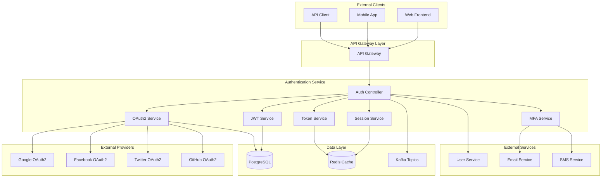
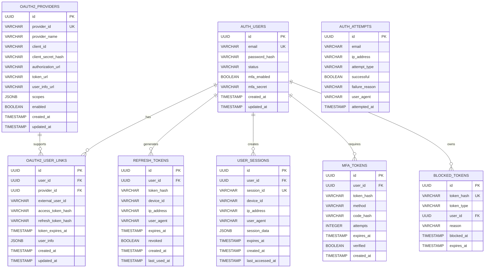

# Authentication Service 詳細設計書

## 目次

1. [概要](#概要)
2. [技術仕様](#技術仕様)
3. [アーキテクチャ設計](#アーキテクチャ設計)
4. [API設計](#api設計)
5. [データベース設計](#データベース設計)
6. [JWT設計](#jwt設計)
7. [OAuth2設計](#oauth2設計)
8. [セッション管理設計](#セッション管理設計)
9. [エラー処理](#エラー処理)
10. [セキュリティ設計](#security-design)
11. [テスト設計](#test-design)
12. [ローカル開発環境](#local-development)
13. [本番デプロイメント](#production-deployment)
14. [監視・運用](#monitoring-operations)
15. [障害対応](#incident-response)

## 概要

### サービス概要

Authentication Serviceは、スキー用品販売ショップサイトの認証・認可機能を専門に担当するマイクロサービスです。JWT認証、OAuth2プロバイダー連携、セッション管理、多要素認証など、セキュリティに関する全ての機能を提供します。

### 主要責務

- **JWT認証**: JWTトークンの生成、検証、リフレッシュ
- **OAuth2連携**: Google、Facebook、Twitter等の外部プロバイダー認証
- **セッション管理**: セッションの作成、検証、無効化
- **多要素認証**: SMS、メール、TOTP認証
- **認可制御**: ロールベース、リソースベースアクセス制御
- **トークン管理**: アクセストークン、リフレッシュトークンのライフサイクル管理

### ビジネス価値

- **セキュリティ強化**: 堅牢な認証・認可機能
- **ユーザー体験向上**: シングルサインオン、ソーシャルログイン
- **運用効率化**: 統一認証基盤による管理コスト削減
- **コンプライアンス対応**: セキュリティ規格への準拠

## 技術仕様

### 使用技術スタック

| 技術領域 | 技術/ライブラリ | バージョン | 用途 |
|---------|----------------|-----------|------|
| **Runtime** | OpenJDK | 21 LTS | Java実行環境 |
| **Framework** | Jakarta EE | 11 | エンタープライズフレームワーク |
| **Application Server** | WildFly | 31.0.1 | Jakarta EEアプリケーションサーバー |
| **Security** | Jakarta Security | 3.0 | セキュリティフレームワーク |
| **JWT** | MicroProfile JWT | 2.1 | JWT処理 |
| **OAuth2** | Jakarta Authorization | 2.1 | OAuth2サーバー |
| **Persistence** | Jakarta Persistence (JPA) | 3.2 | ORM |
| **REST API** | Jakarta REST (JAX-RS) | 4.0 | RESTful Web Services |
| **CDI** | Jakarta CDI | 4.1 | 依存性注入・管理 |
| **Validation** | Jakarta Validation | 3.1 | Bean Validation |
| **Database** | PostgreSQL | 16 | 主データベース |
| **Cache** | Redis | 7.2 | トークン・セッションキャッシュ |
| **Message Queue** | Apache Kafka | 3.7 | 認証イベント処理 |
| **Crypto** | Bouncy Castle | 1.77 | 暗号化処理 |
| **TOTP** | Google Authenticator | 1.5.0 | 二要素認証 |
| **Rate Limiting** | Bucket4j | 8.7.0 | レート制限 |
| **Monitoring** | MicroProfile Metrics | 5.1 | メトリクス収集 |
| **Tracing** | MicroProfile OpenTelemetry | 2.0 | 分散トレーシング |
| **Health Check** | MicroProfile Health | 4.0 | ヘルスチェック |
| **Configuration** | MicroProfile Config | 3.1 | 設定管理 |

### 除外技術

- **Lombok**: Jakarta EE 11のRecord クラスとモダンJava機能を活用するため使用しません

### Java 21 LTS 活用機能

- **Virtual Threads**: 高並行認証処理
- **Record Classes**: トークン・認証データ構造
- **Pattern Matching**: 認証フロー判定
- **Text Blocks**: 複雑なJWT Claims定義
- **Sealed Classes**: 認証結果の型安全性

## アーキテクチャ設計

### システムアーキテクチャ図



### ドメインモデル設計

```java
// 認証結果のSealed Classes
public sealed interface AuthenticationResult
    permits SuccessfulAuthentication, FailedAuthentication, RequiresMFA {
}

public record SuccessfulAuthentication(
    String userId,
    Set<String> roles,
    Set<String> permissions,
    TokenPair tokens,
    LocalDateTime authenticatedAt
) implements AuthenticationResult {}

public record FailedAuthentication(
    String reason,
    int attemptCount,
    LocalDateTime nextAttemptAllowed
) implements AuthenticationResult {}

public record RequiresMFA(
    String mfaToken,
    Set<MFAMethod> availableMethods,
    Duration expiresIn
) implements AuthenticationResult {}

// JWTトークンペア
public record TokenPair(
    String accessToken,
    String refreshToken,
    String tokenType,
    Duration expiresIn,
    Set<String> scopes
) {
    public static TokenPair create(String accessToken, String refreshToken, Duration expiresIn) {
        return new TokenPair(accessToken, refreshToken, "Bearer", expiresIn, Set.of());
    }
}

// OAuth2プロバイダー情報
public record OAuth2Provider(
    String providerId,
    String providerName,
    String clientId,
    String clientSecret,
    String authorizationUrl,
    String tokenUrl,
    String userInfoUrl,
    Set<String> scopes
) {}

// MFA設定
public record MFAConfiguration(
    boolean enabled,
    Set<MFAMethod> enabledMethods,
    MFAMethod primaryMethod,
    int backupCodesRemaining
) {}

// セッション情報
public record SessionInfo(
    String sessionId,
    String userId,
    String deviceId,
    String ipAddress,
    String userAgent,
    LocalDateTime createdAt,
    LocalDateTime lastAccessedAt,
    Duration timeoutDuration,
    Map<String, Object> attributes
) {
    public boolean isExpired() {
        return LocalDateTime.now().isAfter(lastAccessedAt.plus(timeoutDuration));
    }
}

// Enums
public enum MFAMethod {
    SMS("SMS認証"),
    EMAIL("メール認証"),
    TOTP("TOTPアプリ"),
    BACKUP_CODE("バックアップコード");
    
    private final String displayName;
    
    MFAMethod(String displayName) {
        this.displayName = displayName;
    }
    
    public String getDisplayName() {
        return displayName;
    }
}

public enum AuthenticationProvider {
    LOCAL("ローカル認証"),
    GOOGLE("Google"),
    FACEBOOK("Facebook"),
    TWITTER("Twitter"),
    GITHUB("GitHub");
    
    private final String displayName;
    
    AuthenticationProvider(String displayName) {
        this.displayName = displayName;
    }
    
    public String getDisplayName() {
        return displayName;
    }
}
```

### 認証フロー設計

```java
// 認証サービス
@ApplicationScoped
public class AuthenticationService {
    
    @Inject
    private JwtService jwtService;
    
    @Inject
    private OAuth2Service oauth2Service;
    
    @Inject
    private MFAService mfaService;
    
    @Inject
    private SessionService sessionService;
    
    @Inject
    private UserService userService;
    
    public AuthenticationResult authenticate(AuthenticationRequest request) {
        return switch (request) {
            case LocalAuthenticationRequest local -> authenticateLocal(local);
            case OAuth2AuthenticationRequest oauth2 -> authenticateOAuth2(oauth2);
            case MFAAuthenticationRequest mfa -> authenticateMFA(mfa);
            case RefreshTokenRequest refresh -> refreshAuthentication(refresh);
        };
    }
    
    private AuthenticationResult authenticateLocal(LocalAuthenticationRequest request) {
        try {
            // ユーザー検証
            var user = userService.validateCredentials(request.email(), request.password());
            if (user.isEmpty()) {
                return new FailedAuthentication(
                    "認証情報が正しくありません",
                    incrementFailedAttempts(request.email()),
                    calculateNextAttemptTime(request.email())
                );
            }
            
            // MFA必要性チェック
            var mfaConfig = user.get().getMfaConfiguration();
            if (mfaConfig.enabled()) {
                var mfaToken = mfaService.generateMFAToken(user.get());
                return new RequiresMFA(
                    mfaToken,
                    mfaConfig.enabledMethods(),
                    Duration.ofMinutes(5)
                );
            }
            
            // 成功認証処理
            return createSuccessfulAuthentication(user.get(), request.deviceInfo());
            
        } catch (AccountLockedException e) {
            return new FailedAuthentication(
                "アカウントがロックされています",
                e.getFailedAttempts(),
                e.getLockoutUntil()
            );
        }
    }
    
    private AuthenticationResult createSuccessfulAuthentication(User user, DeviceInfo deviceInfo) {
        // JWTトークン生成
        var tokens = jwtService.generateTokenPair(user);
        
        // セッション作成
        var session = sessionService.createSession(user, deviceInfo);
        
        // 認証ログ記録
        recordAuthenticationSuccess(user, deviceInfo);
        
        return new SuccessfulAuthentication(
            user.getId().toString(),
            user.getRoles(),
            user.getPermissions(),
            tokens,
            LocalDateTime.now()
        );
    }
}

// JWT サービス
@ApplicationScoped
public class JwtService {
    
    @Inject
    @ConfigProperty(name = "jwt.issuer")
    private String issuer;
    
    @Inject
    @ConfigProperty(name = "jwt.access-token.expiration", defaultValue = "PT15M")
    private Duration accessTokenExpiration;
    
    @Inject
    @ConfigProperty(name = "jwt.refresh-token.expiration", defaultValue = "P30D")
    private Duration refreshTokenExpiration;
    
    private KeyPair keyPair;
    
    @PostConstruct
    void initializeKeys() {
        this.keyPair = generateRSAKeyPair();
    }
    
    public TokenPair generateTokenPair(User user) {
        var now = Instant.now();
        
        // アクセストークン生成
        var accessToken = Jwts.builder()
            .setIssuer(issuer)
            .setSubject(user.getId().toString())
            .setAudience("ski-shop")
            .setIssuedAt(Date.from(now))
            .setExpiration(Date.from(now.plus(accessTokenExpiration)))
            .claim("email", user.getEmail())
            .claim("roles", user.getRoles())
            .claim("permissions", user.getPermissions())
            .claim("type", "access")
            .signWith(keyPair.getPrivate(), SignatureAlgorithm.RS256)
            .compact();
        
        // リフレッシュトークン生成
        var refreshToken = Jwts.builder()
            .setIssuer(issuer)
            .setSubject(user.getId().toString())
            .setIssuedAt(Date.from(now))
            .setExpiration(Date.from(now.plus(refreshTokenExpiration)))
            .claim("type", "refresh")
            .claim("jti", UUID.randomUUID().toString()) // Token ID
            .signWith(keyPair.getPrivate(), SignatureAlgorithm.RS256)
            .compact();
        
        // Redisにリフレッシュトークン保存
        storeRefreshToken(user.getId(), refreshToken);
        
        return TokenPair.create(accessToken, refreshToken, accessTokenExpiration);
    }
    
    public Claims validateAccessToken(String token) {
        try {
            var claims = Jwts.parserBuilder()
                .setSigningKey(keyPair.getPublic())
                .requireIssuer(issuer)
                .build()
                .parseClaimsJws(token)
                .getBody();
                
            if (!"access".equals(claims.get("type"))) {
                throw new InvalidTokenException("不正なトークンタイプです");
            }
            
            return claims;
            
        } catch (JwtException e) {
            throw new InvalidTokenException("トークンの検証に失敗しました", e);
        }
    }
}
```

## API設計

### OpenAPI 3.1 仕様

```yaml
# authentication-api.yml
openapi: 3.1.0
info:
  title: Authentication Service API
  version: 1.0.0
  description: スキー用品ショップ 認証サービス

servers:
  - url: https://auth.ski-shop.com/v1
    description: Production server
  - url: https://staging.auth.ski-shop.com/v1
    description: Staging server
  - url: http://localhost:8083
    description: Local development

paths:
  /auth/login:
    post:
      summary: ローカル認証
      operationId: login
      tags: [Authentication]
      requestBody:
        required: true
        content:
          application/json:
            schema:
              $ref: '#/components/schemas/LoginRequest'
            examples:
              basic_login:
                summary: 基本ログイン
                value:
                  email: "user@example.com"
                  password: "SecurePass123!"
                  deviceInfo:
                    deviceId: "device-123"
                    userAgent: "Mozilla/5.0..."
                    ipAddress: "192.168.1.100"
      responses:
        '200':
          description: 認証成功
          content:
            application/json:
              schema:
                $ref: '#/components/schemas/AuthenticationResponse'
        '202':
          description: MFA認証が必要
          content:
            application/json:
              schema:
                $ref: '#/components/schemas/MFARequiredResponse'
        '401':
          description: 認証失敗
          content:
            application/json:
              schema:
                $ref: '#/components/schemas/AuthenticationFailedResponse'
        '423':
          description: アカウントロック
          content:
            application/json:
              schema:
                $ref: '#/components/schemas/AccountLockedResponse'

  /auth/oauth2/{provider}/authorize:
    get:
      summary: OAuth2認証開始
      operationId: startOAuth2Authentication
      tags: [OAuth2]
      parameters:
        - name: provider
          in: path
          required: true
          schema:
            type: string
            enum: [google, facebook, twitter, github]
        - name: redirect_uri
          in: query
          required: true
          schema:
            type: string
            format: uri
        - name: state
          in: query
          required: true
          schema:
            type: string
      responses:
        '302':
          description: OAuth2プロバイダーにリダイレクト
          headers:
            Location:
              schema:
                type: string
                format: uri

  /auth/oauth2/{provider}/callback:
    post:
      summary: OAuth2コールバック処理
      operationId: handleOAuth2Callback
      tags: [OAuth2]
      parameters:
        - name: provider
          in: path
          required: true
          schema:
            type: string
            enum: [google, facebook, twitter, github]
      requestBody:
        required: true
        content:
          application/json:
            schema:
              $ref: '#/components/schemas/OAuth2CallbackRequest'
      responses:
        '200':
          description: OAuth2認証成功
          content:
            application/json:
              schema:
                $ref: '#/components/schemas/AuthenticationResponse'
        '400':
          description: 不正なコールバック
        '401':
          description: OAuth2認証失敗

  /auth/mfa/verify:
    post:
      summary: MFA認証
      operationId: verifyMFA
      tags: [MFA]
      requestBody:
        required: true
        content:
          application/json:
            schema:
              $ref: '#/components/schemas/MFAVerificationRequest'
      responses:
        '200':
          description: MFA認証成功
          content:
            application/json:
              schema:
                $ref: '#/components/schemas/AuthenticationResponse'
        '400':
          description: 無効なMFAコード
        '410':
          description: MFAトークン期限切れ

  /auth/token/refresh:
    post:
      summary: トークンリフレッシュ
      operationId: refreshToken
      tags: [Token Management]
      requestBody:
        required: true
        content:
          application/json:
            schema:
              $ref: '#/components/schemas/RefreshTokenRequest'
      responses:
        '200':
          description: トークンリフレッシュ成功
          content:
            application/json:
              schema:
                $ref: '#/components/schemas/TokenResponse'
        '401':
          description: 無効なリフレッシュトークン

  /auth/token/revoke:
    post:
      summary: トークン無効化
      operationId: revokeToken
      tags: [Token Management]
      security:
        - BearerAuth: []
      requestBody:
        required: true
        content:
          application/json:
            schema:
              $ref: '#/components/schemas/RevokeTokenRequest'
      responses:
        '204':
          description: トークン無効化成功
        '400':
          description: 無効なリクエスト

  /auth/session:
    get:
      summary: セッション情報取得
      operationId: getSessionInfo
      tags: [Session Management]
      security:
        - BearerAuth: []
      responses:
        '200':
          description: セッション情報
          content:
            application/json:
              schema:
                $ref: '#/components/schemas/SessionInfoResponse'
        '401':
          description: 無効なセッション

    delete:
      summary: セッション無効化
      operationId: invalidateSession
      tags: [Session Management]
      security:
        - BearerAuth: []
      responses:
        '204':
          description: セッション無効化成功

  /auth/validate:
    post:
      summary: トークン検証
      operationId: validateToken
      tags: [Token Validation]
      requestBody:
        required: true
        content:
          application/json:
            schema:
              $ref: '#/components/schemas/TokenValidationRequest'
      responses:
        '200':
          description: トークン検証成功
          content:
            application/json:
              schema:
                $ref: '#/components/schemas/TokenValidationResponse'
        '401':
          description: 無効なトークン

components:
  schemas:
    LoginRequest:
      type: object
      required:
        - email
        - password
        - deviceInfo
      properties:
        email:
          type: string
          format: email
          example: "user@example.com"
        password:
          type: string
          example: "SecurePass123!"
        deviceInfo:
          $ref: '#/components/schemas/DeviceInfo'
        rememberMe:
          type: boolean
          default: false

    DeviceInfo:
      type: object
      required:
        - deviceId
        - userAgent
        - ipAddress
      properties:
        deviceId:
          type: string
          example: "device-123"
        userAgent:
          type: string
          example: "Mozilla/5.0 (Windows NT 10.0; Win64; x64)..."
        ipAddress:
          type: string
          format: ipv4
          example: "192.168.1.100"

    AuthenticationResponse:
      type: object
      properties:
        success:
          type: boolean
          example: true
        accessToken:
          type: string
          example: "eyJhbGciOiJSUzI1NiIs..."
        refreshToken:
          type: string
          example: "eyJhbGciOiJSUzI1NiIs..."
        tokenType:
          type: string
          example: "Bearer"
        expiresIn:
          type: integer
          example: 900
        scope:
          type: string
          example: "read write"
        user:
          $ref: '#/components/schemas/UserInfo'

    MFARequiredResponse:
      type: object
      properties:
        requiresMFA:
          type: boolean
          example: true
        mfaToken:
          type: string
          example: "mfa-token-123"
        availableMethods:
          type: array
          items:
            type: string
            enum: [SMS, EMAIL, TOTP, BACKUP_CODE]
        expiresIn:
          type: integer
          example: 300

    MFAVerificationRequest:
      type: object
      required:
        - mfaToken
        - method
        - code
      properties:
        mfaToken:
          type: string
          example: "mfa-token-123"
        method:
          type: string
          enum: [SMS, EMAIL, TOTP, BACKUP_CODE]
        code:
          type: string
          example: "123456"

    OAuth2CallbackRequest:
      type: object
      required:
        - code
        - state
      properties:
        code:
          type: string
          example: "auth-code-123"
        state:
          type: string
          example: "state-123"
        error:
          type: string
          example: "access_denied"

    UserInfo:
      type: object
      properties:
        id:
          type: string
          format: uuid
        email:
          type: string
          format: email
// Authentication CQRS Commands
public sealed interface AuthenticationCommand permits LoginCommand, LogoutCommand, 
        RefreshTokenCommand, RevokeTokenCommand, EnableMFACommand, DisableMFACommand,
        OAuth2LinkCommand, ChangePasswordCommand {}

public record LoginCommand(
    String email,
    String password,
    DeviceInfo deviceInfo,
    boolean rememberMe,
    String ipAddress
) implements AuthenticationCommand {}

public record LogoutCommand(
    String userId,
    String sessionId,
    String deviceId
) implements AuthenticationCommand {}

public record RefreshTokenCommand(
    String refreshToken,
    String deviceId,
    String ipAddress
) implements AuthenticationCommand {}

public record RevokeTokenCommand(
    String token,
    String tokenType,
    String userId
) implements AuthenticationCommand {}

public record EnableMFACommand(
    String userId,
    MFAMethod method,
    String secret
) implements AuthenticationCommand {}

public record DisableMFACommand(
    String userId,
    MFAMethod method,
    String confirmationCode
) implements AuthenticationCommand {}

public record OAuth2LinkCommand(
    String userId,
    String provider,
    String code,
    String state
) implements AuthenticationCommand {}

public record ChangePasswordCommand(
    String userId,
    String currentPassword,
    String newPassword,
    boolean revokeAllTokens
) implements AuthenticationCommand {}

// Authentication CQRS Queries
public sealed interface AuthenticationQuery permits GetSessionQuery, GetActiveSessionsQuery,
        GetMFAStatusQuery, GetOAuth2ProvidersQuery, GetSecurityEventQuery {}

public record GetSessionQuery(
    String sessionId
) implements AuthenticationQuery {}

public record GetActiveSessionsQuery(
    String userId,
    int page,
    int size
) implements AuthenticationQuery {}

public record GetMFAStatusQuery(
    String userId
) implements AuthenticationQuery {}

public record GetOAuth2ProvidersQuery(
    String userId
) implements AuthenticationQuery {}

public record GetSecurityEventQuery(
    String userId,
    LocalDateTime fromDate,
    LocalDateTime toDate,
    Set<SecurityEventType> eventTypes
) implements AuthenticationQuery {}

// Authentication Projections
public record SessionProjection(
    String sessionId,
    String userId,
    DeviceInfo deviceInfo,
    LocalDateTime createdAt,
    LocalDateTime expiresAt,
    LocalDateTime lastActivity,
    boolean isActive
) {}

public record MFAStatusProjection(
    String userId,
    boolean isEnabled,
    Set<MFAMethod> enabledMethods,
    LocalDateTime lastUpdated
) {}

public record OAuth2ProviderProjection(
    String provider,
    String providerName,
    boolean isLinked,
    LocalDateTime linkedAt
) {}

public record SecurityEventProjection(
    String eventId,
    String userId,
    SecurityEventType eventType,
    String description,
    String ipAddress,
    DeviceInfo deviceInfo,
    LocalDateTime timestamp
) {}

// Authentication Service with CQRS
@ApplicationScoped
@Transactional
public class AuthenticationService {
    
    @Inject
    private UserRepository userRepository;
    
    @Inject
    private SessionRepository sessionRepository;
    
    @Inject
    private AuthenticationEventPublisher eventPublisher;
    
    @Inject
    private PasswordEncoder passwordEncoder;
    
    @Inject
    private JwtTokenService jwtTokenService;
    
    @Inject
    private MFAService mfaService;
    
    // Command Handlers
    @CommandHandler
    public AuthenticationResult handle(LoginCommand command) {
        var user = userRepository.findByEmail(command.email())
            .orElseThrow(() -> new InvalidCredentialsException("Invalid credentials"));
        
        if (!passwordEncoder.matches(command.password(), user.getPasswordHash())) {
            recordFailedLogin(command.email(), command.ipAddress());
            throw new InvalidCredentialsException("Invalid credentials");
        }
        
        if (!user.isActive()) {
            throw new AccountDisabledException("Account is disabled");
        }
        
        // MFA check
        if (user.isMFAEnabled()) {
            var mfaToken = mfaService.generateMFAToken(user.getId());
            return new RequiresMFA(
                mfaToken,
                user.getEnabledMFAMethods(),
                Duration.ofMinutes(5)
            );
        }
        
        // Create session
        var session = createSession(user, command.deviceInfo(), command.ipAddress());
        var tokens = jwtTokenService.generateTokens(user, session);
        
        eventPublisher.publish(new UserLoggedInEvent(
            user.getId(),
            command.deviceInfo(),
            command.ipAddress(),
            LocalDateTime.now()
        ));
        
        return new SuccessfulAuthentication(
            user.getId(),
            user.getRoles(),
            user.getPermissions(),
            tokens,
            LocalDateTime.now()
        );
    }
    
    @CommandHandler
    public void handle(LogoutCommand command) {
        var session = sessionRepository.findById(command.sessionId())
            .orElseThrow(() -> new SessionNotFoundException("Session not found"));
        
        session.invalidate();
        sessionRepository.save(session);
        
        // Revoke tokens associated with session
        jwtTokenService.revokeTokensForSession(command.sessionId());
        
        eventPublisher.publish(new UserLoggedOutEvent(
            command.userId(),
            command.sessionId(),
            command.deviceId(),
            LocalDateTime.now()
        ));
    }
    
    @CommandHandler
    public TokenPair handle(RefreshTokenCommand command) {
        var tokenClaims = jwtTokenService.validateRefreshToken(command.refreshToken());
        var userId = tokenClaims.getSubject();
        var sessionId = tokenClaims.getSessionId();
        
        var session = sessionRepository.findById(sessionId)
            .orElseThrow(() -> new SessionNotFoundException("Session not found"));
        
        if (!session.isValid() || !session.getUserId().equals(userId)) {
            throw new InvalidTokenException("Invalid refresh token");
        }
        
        var user = userRepository.findById(userId)
            .orElseThrow(() -> new UserNotFoundException("User not found"));
        
        var newTokens = jwtTokenService.refreshTokens(command.refreshToken(), session);
        
        eventPublisher.publish(new TokenRefreshedEvent(
            userId,
            sessionId,
            command.ipAddress(),
            LocalDateTime.now()
        ));
        
        return newTokens;
    }
    
    @CommandHandler
    public void handle(EnableMFACommand command) {
        var user = userRepository.findById(command.userId())
            .orElseThrow(() -> new UserNotFoundException("User not found"));
        
        user.enableMFA(command.method(), command.secret());
        userRepository.save(user);
        
        eventPublisher.publish(new MFAEnabledEvent(
            command.userId(),
            command.method(),
            LocalDateTime.now()
        ));
    }
    
    private void recordFailedLogin(String email, String ipAddress) {
        eventPublisher.publish(new LoginFailedEvent(
            email,
            ipAddress,
            "Invalid credentials",
            LocalDateTime.now()
        ));
    }
    
    private Session createSession(User user, DeviceInfo deviceInfo, String ipAddress) {
        var session = new Session(
            UUID.randomUUID().toString(),
            user.getId(),
            deviceInfo,
            ipAddress,
            LocalDateTime.now(),
            LocalDateTime.now().plus(Duration.ofDays(30))
        );
        
        return sessionRepository.save(session);
    }
}

// Authentication Query Service
@ApplicationScoped
public class AuthenticationQueryService {
    
    @Inject
    private SessionRepository sessionRepository;
    
    @Inject
    private SecurityEventRepository securityEventRepository;
    
    @QueryHandler
    public Optional<SessionProjection> handle(GetSessionQuery query) {
        return sessionRepository.findById(query.sessionId())
            .map(this::toSessionProjection);
    }
    
    @QueryHandler
    public List<SessionProjection> handle(GetActiveSessionsQuery query) {
        return sessionRepository.findActiveByUserId(query.userId(), query.page(), query.size())
            .stream()
            .map(this::toSessionProjection)
            .toList();
    }
    
    @QueryHandler
    public MFAStatusProjection handle(GetMFAStatusQuery query) {
        var user = userRepository.findById(query.userId())
            .orElseThrow(() -> new UserNotFoundException("User not found"));
        
        return new MFAStatusProjection(
            user.getId(),
            user.isMFAEnabled(),
            user.getEnabledMFAMethods(),
            user.getMFALastUpdated()
        );
    }
    
    @QueryHandler
    public List<SecurityEventProjection> handle(GetSecurityEventQuery query) {
        return securityEventRepository.findByUserIdAndDateRange(
            query.userId(),
            query.fromDate(),
            query.toDate(),
            query.eventTypes()
        ).stream()
        .map(this::toSecurityEventProjection)
        .toList();
    }
    
    private SessionProjection toSessionProjection(Session session) {
        return new SessionProjection(
            session.getId(),
            session.getUserId(),
            session.getDeviceInfo(),
            session.getCreatedAt(),
            session.getExpiresAt(),
            session.getLastActivity(),
            session.isActive()
        );
    }
    
    private SecurityEventProjection toSecurityEventProjection(SecurityEvent event) {
        return new SecurityEventProjection(
            event.getId(),
            event.getUserId(),
            event.getEventType(),
            event.getDescription(),
            event.getIpAddress(),
            event.getDeviceInfo(),
            event.getTimestamp()
        );
    }
}

// Authentication Saga Patterns
@ApplicationScoped
@Transactional
public class AuthenticationSaga {
    
    private static final Logger logger = LoggerFactory.getLogger(AuthenticationSaga.class);
    
    @Inject
    private AuthenticationService authenticationService;
    
    @Inject
    private UserRepository userRepository;
    
    @Inject
    private SagaStateRepository sagaStateRepository;
    
    @Inject
    private AuthenticationEventPublisher eventPublisher;
    
    @Inject
    private MFAService mfaService;
    
    @Inject
    private EmailService emailService;
    
    public CompletableFuture<SagaResult> processOAuth2Login(
            String provider, String code, String state, String ipAddress) {
        
        return CompletableFuture.supplyAsync(() -> {
            var sagaId = UUID.randomUUID();
            var sagaState = new SagaState(sagaId, provider, SagaType.OAUTH2_LOGIN);
            sagaStateRepository.save(sagaState);
            
            try {
                logger.info("OAuth2ログインSaga開始: sagaId={}, provider={}", sagaId, provider);
                
                // Step 1: OAuth2トークン交換
                var tokenResult = exchangeOAuth2Code(provider, code, state);
                if (!tokenResult.success()) {
                    return handleSagaFailure(sagaState, "OAuth2トークン交換失敗", tokenResult.message());
                }
                
                sagaState.markStepCompleted("oauth2_token_exchanged", tokenResult.accessToken());
                sagaStateRepository.save(sagaState);
                
                // Step 2: ユーザー情報取得
                var userInfoResult = fetchOAuth2UserInfo(provider, tokenResult.accessToken());
                if (!userInfoResult.success()) {
                    return handleSagaFailure(sagaState, "ユーザー情報取得失敗", userInfoResult.message());
                }
                
                sagaState.markStepCompleted("user_info_fetched", userInfoResult.email());
                sagaStateRepository.save(sagaState);
                
                // Step 3: ユーザーアカウント作成/更新
                var accountResult = createOrUpdateAccount(userInfoResult.userInfo(), provider);
                if (!accountResult.success()) {
                    return handleSagaFailure(sagaState, "アカウント処理失敗", accountResult.message());
                }
                
                sagaState.markStepCompleted("account_processed", accountResult.userId());
                sagaStateRepository.save(sagaState);
                
                // Step 4: セッション・トークン生成
                var sessionResult = createAuthenticatedSession(accountResult.userId(), ipAddress);
                if (!sessionResult.success()) {
                    return handleSagaFailure(sagaState, "セッション作成失敗", sessionResult.message());
                }
                
                sagaState.markStepCompleted("session_created", sessionResult.sessionId());
                sagaState.complete();
                sagaStateRepository.save(sagaState);
                
                // 完了イベント発行
                eventPublisher.publish(new OAuth2LoginCompletedEvent(
                    accountResult.userId(),
                    provider,
                    sessionResult.sessionId(),
                    LocalDateTime.now()
                ));
                
                logger.info("OAuth2ログインSaga完了: sagaId={}, userId={}", sagaId, accountResult.userId());
                return new SagaResult(true, "OAuth2ログイン完了");
                
            } catch (Exception e) {
                logger.error("OAuth2ログインSaga実行エラー: sagaId=" + sagaId, e);
                return handleSagaFailure(sagaState, "予期しないエラー", e.getMessage());
            }
        }, VirtualThread.ofVirtual().factory());
    }
    
    public CompletableFuture<SagaResult> processMFAVerification(
            String mfaToken, MFAMethod method, String code, String ipAddress) {
        
        return CompletableFuture.supplyAsync(() -> {
            var sagaId = UUID.randomUUID();
            var sagaState = new SagaState(sagaId, mfaToken, SagaType.MFA_VERIFICATION);
            sagaStateRepository.save(sagaState);
            
            try {
                logger.info("MFA検証Saga開始: sagaId={}, method={}", sagaId, method);
                
                // Step 1: MFAトークン検証
                var tokenResult = validateMFAToken(mfaToken);
                if (!tokenResult.success()) {
                    return handleSagaFailure(sagaState, "MFAトークン検証失敗", tokenResult.message());
                }
                
                sagaState.markStepCompleted("mfa_token_validated", tokenResult.userId());
                sagaStateRepository.save(sagaState);
                
                // Step 2: MFAコード検証
                var codeResult = verifyMFACode(tokenResult.userId(), method, code);
                if (!codeResult.success()) {
                    // 失敗回数記録
                    recordMFAFailure(tokenResult.userId(), method, ipAddress);
                    return handleSagaFailure(sagaState, "MFAコード検証失敗", codeResult.message());
                }
                
                sagaState.markStepCompleted("mfa_code_verified", method.toString());
                sagaStateRepository.save(sagaState);
                
                // Step 3: 認証完了・セッション作成
                var sessionResult = completeMFAAuthentication(tokenResult.userId(), ipAddress);
                if (!sessionResult.success()) {
                    return handleSagaFailure(sagaState, "認証完了失敗", sessionResult.message());
                }
                
                sagaState.markStepCompleted("authentication_completed", sessionResult.sessionId());
                sagaState.complete();
                sagaStateRepository.save(sagaState);
                
                // 完了イベント発行
                eventPublisher.publish(new MFAVerificationCompletedEvent(
                    tokenResult.userId(),
                    method,
                    sessionResult.sessionId(),
                    LocalDateTime.now()
                ));
                
                logger.info("MFA検証Saga完了: sagaId={}, userId={}", sagaId, tokenResult.userId());
                return new SagaResult(true, "MFA検証完了");
                
            } catch (Exception e) {
                logger.error("MFA検証Saga実行エラー: sagaId=" + sagaId, e);
                return handleSagaFailure(sagaState, "予期しないエラー", e.getMessage());
            }
        }, VirtualThread.ofVirtual().factory());
    }
    
    // Helper methods
    private OAuth2TokenResult exchangeOAuth2Code(String provider, String code, String state) {
        try {
            var tokenResponse = oauth2Service.exchangeCode(provider, code, state);
            return new OAuth2TokenResult(true, tokenResponse.getAccessToken(), "成功");
        } catch (Exception e) {
            return new OAuth2TokenResult(false, null, "トークン交換エラー: " + e.getMessage());
        }
    }
    
    private UserInfoResult fetchOAuth2UserInfo(String provider, String accessToken) {
        try {
            var userInfo = oauth2Service.fetchUserInfo(provider, accessToken);
            return new UserInfoResult(true, userInfo, userInfo.getEmail(), "成功");
        } catch (Exception e) {
            return new UserInfoResult(false, null, null, "ユーザー情報取得エラー: " + e.getMessage());
        }
    }
    
    private AccountResult createOrUpdateAccount(OAuth2UserInfo userInfo, String provider) {
        try {
            var user = userRepository.findByEmail(userInfo.getEmail())
                .orElseGet(() -> createNewUser(userInfo));
            
            // OAuth2プロバイダー情報を更新
            user.linkOAuth2Provider(provider, userInfo.getProviderId());
            userRepository.save(user);
            
            return new AccountResult(true, user.getId(), "アカウント処理完了");
        } catch (Exception e) {
            return new AccountResult(false, null, "アカウント処理エラー: " + e.getMessage());
        }
    }
    
    private User createNewUser(OAuth2UserInfo userInfo) {
        return User.builder()
            .email(userInfo.getEmail())
            .firstName(userInfo.getFirstName())
            .lastName(userInfo.getLastName())
            .status(UserStatus.ACTIVE)
            .emailVerified(true)
            .build();
    }
    
    private SagaResult handleSagaFailure(SagaState sagaState, String reason, String message) {
        sagaState.fail(reason + ": " + message);
        sagaStateRepository.save(sagaState);
        
        return new SagaResult(false, reason + ": " + message);
    }
}

// Saga Result Records
public record OAuth2TokenResult(
    boolean success,
    String accessToken,
    String message
) {}

public record UserInfoResult(
    boolean success,
    OAuth2UserInfo userInfo,
    String email,
    String message
) {}

public record AccountResult(
    boolean success,
    String userId,
    String message
) {}

public record MFATokenResult(
    boolean success,
    String userId,
    String message
) {}

public record MFACodeResult(
    boolean success,
    String message
) {}

public record SessionResult(
    boolean success,
    String sessionId,
    String message
) {}

// Authentication Events
public sealed interface AuthenticationEvent permits UserLoggedInEvent, UserLoggedOutEvent,
        LoginFailedEvent, TokenRefreshedEvent, MFAEnabledEvent, MFADisabledEvent,
        OAuth2LoginCompletedEvent, MFAVerificationCompletedEvent, PasswordChangedEvent {}

public record UserLoggedInEvent(
    String userId,
    DeviceInfo deviceInfo,
    String ipAddress,
    LocalDateTime timestamp
) implements AuthenticationEvent {}

public record UserLoggedOutEvent(
    String userId,
    String sessionId,
    String deviceId,
    LocalDateTime timestamp
) implements AuthenticationEvent {}

public record LoginFailedEvent(
    String email,
    String ipAddress,
    String reason,
    LocalDateTime timestamp
) implements AuthenticationEvent {}

public record TokenRefreshedEvent(
    String userId,
    String sessionId,
    String ipAddress,
    LocalDateTime timestamp
) implements AuthenticationEvent {}

public record MFAEnabledEvent(
    String userId,
    MFAMethod method,
    LocalDateTime timestamp
) implements AuthenticationEvent {}

public record MFADisabledEvent(
    String userId,
    MFAMethod method,
    LocalDateTime timestamp
) implements AuthenticationEvent {}

public record OAuth2LoginCompletedEvent(
    String userId,
    String provider,
    String sessionId,
    LocalDateTime timestamp
) implements AuthenticationEvent {}

public record MFAVerificationCompletedEvent(
    String userId,
    MFAMethod method,
    String sessionId,
    LocalDateTime timestamp
) implements AuthenticationEvent {}

public record PasswordChangedEvent(
    String userId,
    boolean allTokensRevoked,
    LocalDateTime timestamp
) implements AuthenticationEvent {}

// CQRS Annotations for Authentication
@Retention(RetentionPolicy.RUNTIME)
@Target(ElementType.METHOD)
public @interface CommandHandler {}

@Retention(RetentionPolicy.RUNTIME)
@Target(ElementType.METHOD)
public @interface QueryHandler {}

// Enums
public enum MFAMethod {
    SMS("SMS"),
    EMAIL("メール"),
    TOTP("認証アプリ"),
    BACKUP_CODE("バックアップコード");
    
    private final String description;
    
    MFAMethod(String description) {
        this.description = description;
    }
    
    public String getDescription() {
        return description;
    }
}

public enum SecurityEventType {
    LOGIN("ログイン"),
    LOGOUT("ログアウト"),
    LOGIN_FAILED("ログイン失敗"),
    PASSWORD_CHANGED("パスワード変更"),
    MFA_ENABLED("MFA有効化"),
    MFA_DISABLED("MFA無効化"),
    TOKEN_REFRESHED("トークン更新"),
    SUSPICIOUS_ACTIVITY("不審なアクティビティ");
    
    private final String description;
    
    SecurityEventType(String description) {
        this.description = description;
    }
    
    public String getDescription() {
        return description;
    }
}
          type: string
        roles:
          type: array
          items:
            type: string
        permissions:
          type: array
          items:
            type: string

  securitySchemes:
    BearerAuth:
      type: http
      scheme: bearer
      bearerFormat: JWT
```

## データベース設計

### ERD（Entity Relationship Diagram）



### エンティティ詳細設計

```java
// 認証ユーザーエンティティ
@Entity
@Table(name = "auth_users")
public class AuthUser {
    
    @Id
    @GeneratedValue(strategy = GenerationType.UUID)
    private UUID id;
    
    @Column(name = "email", unique = true, nullable = false)
    @Email
    private String email;
    
    @Column(name = "password_hash")
    private String passwordHash;
    
    @Enumerated(EnumType.STRING)
    @Column(name = "status", nullable = false)
    private AuthUserStatus status;
    
    @Column(name = "mfa_enabled", nullable = false)
    private Boolean mfaEnabled = false;
    
    @Column(name = "mfa_secret")
    private String mfaSecret;
    
    @Column(name = "failed_login_attempts", nullable = false)
    private Integer failedLoginAttempts = 0;
    
    @Column(name = "lockout_until")
    private LocalDateTime lockoutUntil;
    
    @Column(name = "last_login_at")
    private LocalDateTime lastLoginAt;
    
    @Column(name = "created_at", nullable = false)
    private LocalDateTime createdAt;
    
    @Column(name = "updated_at")
    private LocalDateTime updatedAt;
    
    // 関連エンティティ
    @OneToMany(mappedBy = "user", cascade = CascadeType.ALL, fetch = FetchType.LAZY)
    private List<OAuth2UserLink> oauth2Links = new ArrayList<>();
    
    @OneToMany(mappedBy = "user", cascade = CascadeType.ALL, fetch = FetchType.LAZY)
    private List<RefreshToken> refreshTokens = new ArrayList<>();
    
    @OneToMany(mappedBy = "user", cascade = CascadeType.ALL, fetch = FetchType.LAZY)
    private List<UserSession> sessions = new ArrayList<>();
    
    // ビジネスロジック
    public boolean isAccountLocked() {
        return lockoutUntil != null && LocalDateTime.now().isBefore(lockoutUntil);
    }
    
    public void incrementFailedAttempts() {
        this.failedLoginAttempts++;
        if (this.failedLoginAttempts >= 5) {
            this.lockoutUntil = LocalDateTime.now().plusMinutes(30);
        }
    }
    
    public void resetFailedAttempts() {
        this.failedLoginAttempts = 0;
        this.lockoutUntil = null;
    }
}

// OAuth2プロバイダーエンティティ
@Entity
@Table(name = "oauth2_providers")
public class OAuth2Provider {
    
    @Id
    @GeneratedValue(strategy = GenerationType.UUID)
    private UUID id;
    
    @Column(name = "provider_id", unique = true, nullable = false)
    private String providerId;
    
    @Column(name = "provider_name", nullable = false)
    private String providerName;
    
    @Column(name = "client_id", nullable = false)
    private String clientId;
    
    @Column(name = "client_secret_hash", nullable = false)
    private String clientSecretHash;
    
    @Column(name = "authorization_url", nullable = false)
    private String authorizationUrl;
    
    @Column(name = "token_url", nullable = false)
    private String tokenUrl;
    
    @Column(name = "user_info_url", nullable = false)
    private String userInfoUrl;
    
    @Column(name = "scopes", columnDefinition = "JSONB")
    private String scopes;
    
    @Column(name = "enabled", nullable = false)
    private Boolean enabled = true;
    
    @Column(name = "created_at", nullable = false)
    private LocalDateTime createdAt;
    
    @Column(name = "updated_at")
    private LocalDateTime updatedAt;
    
    public Set<String> getScopesAsSet() {
        if (scopes == null) return Set.of();
        // JSONBからSetに変換
        return JsonParser.parseString(scopes)
            .getAsJsonArray()
            .asList()
            .stream()
            .map(JsonElement::getAsString)
            .collect(Collectors.toSet());
    }
}

// リフレッシュトークンエンティティ
@Entity
@Table(name = "refresh_tokens")
public class RefreshToken {
    
    @Id
    @GeneratedValue(strategy = GenerationType.UUID)
    private UUID id;
    
    @ManyToOne(fetch = FetchType.LAZY)
    @JoinColumn(name = "user_id", nullable = false)
    private AuthUser user;
    
    @Column(name = "token_hash", nullable = false, unique = true)
    private String tokenHash;
    
    @Column(name = "device_id")
    private String deviceId;
    
    @Column(name = "ip_address")
    private String ipAddress;
    
    @Column(name = "user_agent")
    private String userAgent;
    
    @Column(name = "expires_at", nullable = false)
    private LocalDateTime expiresAt;
    
    @Column(name = "revoked", nullable = false)
    private Boolean revoked = false;
    
    @Column(name = "created_at", nullable = false)
    private LocalDateTime createdAt;
    
    @Column(name = "last_used_at")
    private LocalDateTime lastUsedAt;
    
    public boolean isExpired() {
        return LocalDateTime.now().isAfter(expiresAt);
    }
    
    public boolean isValid() {
        return !revoked && !isExpired();
    }
}

// Record ベース DTO設計
public record AuthenticationToken(
    String tokenId,
    String tokenValue,
    String tokenType,
    UUID userId,
    Set<String> scopes,
    LocalDateTime issuedAt,
    LocalDateTime expiresAt,
    Map<String, Object> claims
) {
    public boolean isExpired() {
        return LocalDateTime.now().isAfter(expiresAt);
    }
    
    public Duration getTimeToExpiry() {
        return Duration.between(LocalDateTime.now(), expiresAt);
    }
}

public record OAuth2UserProfile(
    String externalUserId,
    String email,
    String name,
    String picture,
    Boolean emailVerified,
    String locale,
    Map<String, Object> rawProfile
) {}

// Enums
public enum AuthUserStatus {
    PENDING_VERIFICATION,
    ACTIVE,
    SUSPENDED,
    DEACTIVATED
}

public enum TokenType {
    ACCESS_TOKEN,
    REFRESH_TOKEN,
    MFA_TOKEN,
    AUTHORIZATION_CODE
}
```

## JWT設計

### JWT実装

```java
// JWT設定
@ApplicationScoped
public class JwtConfiguration {
    
    @ConfigProperty(name = "jwt.issuer")
    String issuer;
    
    @ConfigProperty(name = "jwt.audience")
    String audience;
    
    @ConfigProperty(name = "jwt.access-token.expiration", defaultValue = "PT15M")
    Duration accessTokenExpiration;
    
    @ConfigProperty(name = "jwt.refresh-token.expiration", defaultValue = "P30D")
    Duration refreshTokenExpiration;
    
    @ConfigProperty(name = "jwt.algorithm", defaultValue = "RS256")
    String algorithm;
    
    @ConfigProperty(name = "jwt.key.size", defaultValue = "2048")
    Integer keySize;
}

// JWT キー管理
@ApplicationScoped
public class JwtKeyManager {
    
    private static final Logger logger = LoggerFactory.getLogger(JwtKeyManager.class);
    
    @Inject
    private JwtConfiguration jwtConfig;
    
    private KeyPair currentKeyPair;
    private String currentKeyId;
    private final Map<String, PublicKey> publicKeys = new ConcurrentHashMap<>();
    
    @PostConstruct
    void initializeKeys() {
        loadOrGenerateKeyPair();
        scheduleKeyRotation();
    }
    
    private void loadOrGenerateKeyPair() {
        try {
            // データベースまたは設定から既存のキーペアを読み込み
            var existingKeyPair = loadKeyPairFromStorage();
            if (existingKeyPair.isPresent()) {
                this.currentKeyPair = existingKeyPair.get();
                this.currentKeyId = generateKeyId(currentKeyPair.getPublic());
            } else {
                generateNewKeyPair();
            }
            
            // 公開キーをキャッシュに追加
            publicKeys.put(currentKeyId, currentKeyPair.getPublic());
            
            logger.info("JWT key pair initialized with key ID: {}", currentKeyId);
            
        } catch (Exception e) {
            logger.error("Failed to initialize JWT keys", e);
            throw new RuntimeException("JWT key initialization failed", e);
        }
    }
    
    private void generateNewKeyPair() throws NoSuchAlgorithmException {
        var keyPairGenerator = KeyPairGenerator.getInstance("RSA");
        keyPairGenerator.initialize(jwtConfig.keySize);
        this.currentKeyPair = keyPairGenerator.generateKeyPair();
        this.currentKeyId = generateKeyId(currentKeyPair.getPublic());
        
        // 新しいキーペアをストレージに保存
        saveKeyPairToStorage(currentKeyPair, currentKeyId);
    }
    
    private String generateKeyId(PublicKey publicKey) {
        try {
            var digest = MessageDigest.getInstance("SHA-256");
            var hash = digest.digest(publicKey.getEncoded());
            return Base64.getUrlEncoder().withoutPadding().encodeToString(Arrays.copyOf(hash, 8));
        } catch (NoSuchAlgorithmException e) {
            throw new RuntimeException("Failed to generate key ID", e);
        }
    }
    
    public KeyPair getCurrentKeyPair() {
        return currentKeyPair;
    }
    
    public String getCurrentKeyId() {
        return currentKeyId;
    }
    
    public Optional<PublicKey> getPublicKey(String keyId) {
        return Optional.ofNullable(publicKeys.get(keyId));
    }
    
    // キーローテーション（週1回）
    @Schedule(cron = "0 0 2 ? * SUN")
    void rotateKeys() {
        try {
            logger.info("Starting JWT key rotation");
            
            // 古いキーIDを保存
            var oldKeyId = currentKeyId;
            
            // 新しいキーペア生成
            generateNewKeyPair();
            
            // 古い公開キーは30日間保持（既存トークンの検証のため）
            scheduleOldKeyRemoval(oldKeyId, Duration.ofDays(30));
            
            logger.info("JWT key rotation completed. New key ID: {}", currentKeyId);
            
        } catch (Exception e) {
            logger.error("JWT key rotation failed", e);
        }
    }
}

// JWT サービス本体
@ApplicationScoped
public class JwtService {
    
    private static final Logger logger = LoggerFactory.getLogger(JwtService.class);
    
    @Inject
    private JwtConfiguration jwtConfig;
    
    @Inject
    private JwtKeyManager keyManager;
    
    @Inject
    private RedisTemplate redisTemplate;
    
    public TokenPair generateTokenPair(AuthUser user, DeviceInfo deviceInfo) {
        var now = Instant.now();
        var keyPair = keyManager.getCurrentKeyPair();
        var keyId = keyManager.getCurrentKeyId();
        
        // アクセストークンClaims
        var accessClaims = createAccessTokenClaims(user, now);
        
        // アクセストークン生成
        var accessToken = Jwts.builder()
            .setHeaderParam("kid", keyId)
            .setHeaderParam("typ", "JWT")
            .setClaims(accessClaims)
            .signWith(keyPair.getPrivate(), SignatureAlgorithm.valueOf(jwtConfig.algorithm))
            .compact();
        
        // リフレッシュトークンClaims
        var refreshClaims = createRefreshTokenClaims(user, now, deviceInfo);
        
        // リフレッシュトークン生成
        var refreshToken = Jwts.builder()
            .setHeaderParam("kid", keyId)
            .setHeaderParam("typ", "JWT")
            .setClaims(refreshClaims)
            .signWith(keyPair.getPrivate(), SignatureAlgorithm.valueOf(jwtConfig.algorithm))
            .compact();
        
        // リフレッシュトークンをデータベースに保存
        storeRefreshToken(user, refreshToken, deviceInfo);
        
        return new TokenPair(
            accessToken,
            refreshToken,
            "Bearer",
            jwtConfig.accessTokenExpiration,
            Set.of("read", "write")
        );
    }
    
    private Claims createAccessTokenClaims(AuthUser user, Instant now) {
        var claims = Jwts.claims();
        
        // 標準Claims
        claims.setIssuer(jwtConfig.issuer);
        claims.setAudience(jwtConfig.audience);
        claims.setSubject(user.getId().toString());
        claims.setIssuedAt(Date.from(now));
        claims.setExpiration(Date.from(now.plus(jwtConfig.accessTokenExpiration)));
        claims.setId(UUID.randomUUID().toString());
        
        // カスタムClaims
        claims.put("type", "access");
        claims.put("email", user.getEmail());
        claims.put("status", user.getStatus().toString());
        claims.put("mfa_enabled", user.getMfaEnabled());
        
        // 権限情報（別サービスから取得）
        var userRoles = getUserRoles(user.getId());
        var userPermissions = getUserPermissions(user.getId());
        claims.put("roles", userRoles);
        claims.put("permissions", userPermissions);
        
        return claims;
    }
    
    private Claims createRefreshTokenClaims(AuthUser user, Instant now, DeviceInfo deviceInfo) {
        var claims = Jwts.claims();
        
        claims.setIssuer(jwtConfig.issuer);
        claims.setAudience(jwtConfig.audience);
        claims.setSubject(user.getId().toString());
        claims.setIssuedAt(Date.from(now));
        claims.setExpiration(Date.from(now.plus(jwtConfig.refreshTokenExpiration)));
        claims.setId(UUID.randomUUID().toString());
        
        claims.put("type", "refresh");
        claims.put("device_id", deviceInfo.deviceId());
        claims.put("ip_address", deviceInfo.ipAddress());
        
        return claims;
    }
    
    public ClaimsValidationResult validateToken(String token) {
        try {
            // トークンパース（ヘッダーのみ）
            var headerIndex = token.indexOf('.');
            var header = new String(Base64.getUrlDecoder().decode(token.substring(0, headerIndex)));
            var headerJson = JsonParser.parseString(header).getAsJsonObject();
            var keyId = headerJson.get("kid").getAsString();
            
            // 対応する公開キー取得
            var publicKey = keyManager.getPublicKey(keyId)
                .orElseThrow(() -> new InvalidTokenException("Unknown key ID: " + keyId));
            
            // トークン検証
            var claims = Jwts.parserBuilder()
                .setSigningKey(publicKey)
                .requireIssuer(jwtConfig.issuer)
                .requireAudience(jwtConfig.audience)
                .build()
                .parseClaimsJws(token)
                .getBody();
            
            // ブラックリストチェック
            if (isTokenBlacklisted(claims.getId())) {
                throw new InvalidTokenException("Token is blacklisted");
            }
            
            return new ClaimsValidationResult(true, claims, null);
            
        } catch (JwtException e) {
            logger.warn("Token validation failed: {}", e.getMessage());
            return new ClaimsValidationResult(false, null, e.getMessage());
        }
    }
    
    public TokenPair refreshTokenPair(String refreshToken) {
        var validationResult = validateToken(refreshToken);
        if (!validationResult.isValid()) {
            throw new InvalidTokenException("Invalid refresh token");
        }
        
        var claims = validationResult.claims();
        if (!"refresh".equals(claims.get("type"))) {
            throw new InvalidTokenException("Not a refresh token");
        }
        
        var userId = UUID.fromString(claims.getSubject());
        var user = findAuthUserById(userId)
            .orElseThrow(() -> new UserNotFoundException("User not found"));
        
        // 古いリフレッシュトークンを無効化
        revokeRefreshToken(refreshToken);
        
        // 新しいトークンペア生成
        var deviceInfo = new DeviceInfo(
            (String) claims.get("device_id"),
            "", // ユーザーエージェントは保存されていない
            (String) claims.get("ip_address")
        );
        
        return generateTokenPair(user, deviceInfo);
    }
    
    private boolean isTokenBlacklisted(String tokenId) {
        var key = "blacklisted_token:" + tokenId;
        return Boolean.TRUE.equals(redisTemplate.hasKey(key));
    }
    
    public void blacklistToken(String tokenId, Duration expiration) {
        var key = "blacklisted_token:" + tokenId;
        redisTemplate.opsForValue().set(key, "true", expiration);
    }
}

// 検証結果Record
public record ClaimsValidationResult(
    boolean isValid,
    Claims claims,
    String errorMessage
) {}

// カスタム例外
public class InvalidTokenException extends RuntimeException {
    public InvalidTokenException(String message) {
        super(message);
    }
    
    public InvalidTokenException(String message, Throwable cause) {
        super(message, cause);
    }
}
```

## OAuth2設計

### OAuth2実装

```java
// OAuth2設定
@ApplicationScoped
public class OAuth2Configuration {
    
    @ConfigProperty(name = "oauth2.google.client-id")
    String googleClientId;
    
    @ConfigProperty(name = "oauth2.google.client-secret")
    String googleClientSecret;
    
    @ConfigProperty(name = "oauth2.facebook.client-id")
    String facebookClientId;
    
    @ConfigProperty(name = "oauth2.facebook.client-secret")
    String facebookClientSecret;
    
    @ConfigProperty(name = "oauth2.state.expiration", defaultValue = "PT10M")
    Duration stateExpiration;
}

// OAuth2プロバイダーファクトリー
@ApplicationScoped
public class OAuth2ProviderFactory {
    
    @Inject
    private OAuth2Configuration config;
    
    public OAuth2Provider createProvider(String providerId) {
        return switch (providerId.toLowerCase()) {
            case "google" -> createGoogleProvider();
            case "facebook" -> createFacebookProvider();
            case "twitter" -> createTwitterProvider();
            case "github" -> createGitHubProvider();
            default -> throw new UnsupportedProviderException("Unsupported provider: " + providerId);
        };
    }
    
    private OAuth2Provider createGoogleProvider() {
        return new OAuth2Provider(
            "google",
            "Google",
            config.googleClientId,
            config.googleClientSecret,
            "https://accounts.google.com/o/oauth2/v2/auth",
            "https://oauth2.googleapis.com/token",
            "https://www.googleapis.com/oauth2/v2/userinfo",
            Set.of("openid", "email", "profile")
        );
    }
    
    private OAuth2Provider createFacebookProvider() {
        return new OAuth2Provider(
            "facebook",
            "Facebook",
            config.facebookClientId,
            config.facebookClientSecret,
            "https://www.facebook.com/v18.0/dialog/oauth",
            "https://graph.facebook.com/v18.0/oauth/access_token",
            "https://graph.facebook.com/v18.0/me",
            Set.of("email", "public_profile")
        );
    }
}

// OAuth2サービス
@ApplicationScoped
public class OAuth2Service {
    
    private static final Logger logger = LoggerFactory.getLogger(OAuth2Service.class);
    
    @Inject
    private OAuth2ProviderFactory providerFactory;
    
    @Inject
    private OAuth2StateManager stateManager;
    
    @Inject
    private OAuth2UserLinkRepository linkRepository;
    
    @Inject
    private AuthUserRepository userRepository;
    
    @Inject
    private RestClient restClient;
    
    public OAuth2AuthorizationUrl generateAuthorizationUrl(String providerId, String redirectUri) {
        var provider = providerFactory.createProvider(providerId);
        var state = stateManager.generateState(providerId, redirectUri);
        
        var authUrl = UriBuilder.fromUri(provider.authorizationUrl())
            .queryParam("client_id", provider.clientId())
            .queryParam("redirect_uri", redirectUri)
            .queryParam("response_type", "code")
            .queryParam("scope", String.join(" ", provider.scopes()))
            .queryParam("state", state)
            .build();
        
        return new OAuth2AuthorizationUrl(authUrl.toString(), state);
    }
    
    public AuthenticationResult handleCallback(String providerId, String code, String state, DeviceInfo deviceInfo) {
        try {
            // ステート検証
            var stateInfo = stateManager.validateState(state);
            if (stateInfo.isEmpty() || !stateInfo.get().providerId().equals(providerId)) {
                throw new InvalidStateException("Invalid or expired state parameter");
            }
            
            var provider = providerFactory.createProvider(providerId);
            
            // アクセストークン取得
            var tokenResponse = exchangeCodeForToken(provider, code, stateInfo.get().redirectUri());
            
            // ユーザー情報取得
            var userProfile = fetchUserProfile(provider, tokenResponse.accessToken());
            
            // ユーザーマッピング・作成
            var authUser = findOrCreateUser(provider, userProfile, tokenResponse);
            
            // 認証成功処理
            return createSuccessfulAuthentication(authUser, deviceInfo);
            
        } catch (Exception e) {
            logger.error("OAuth2 callback handling failed for provider: {}", providerId, e);
            throw new OAuth2AuthenticationException("OAuth2 authentication failed", e);
        }
    }
    
    private OAuth2TokenResponse exchangeCodeForToken(OAuth2Provider provider, String code, String redirectUri) {
        var tokenRequest = Map.of(
            "grant_type", "authorization_code",
            "client_id", provider.clientId(),
            "client_secret", provider.clientSecret(),
            "code", code,
            "redirect_uri", redirectUri
        );
        
        try {
            var response = restClient.target(provider.tokenUrl())
                .request(MediaType.APPLICATION_JSON)
                .header("Content-Type", "application/x-www-form-urlencoded")
                .post(Entity.form(new MultivaluedHashMap<>(tokenRequest.entrySet().stream()
                    .collect(Collectors.toMap(
                        Map.Entry::getKey,
                        e -> List.of(e.getValue().toString())
                    )))));
            
            if (response.getStatus() != 200) {
                throw new OAuth2Exception("Token exchange failed: " + response.getStatus());
            }
            
            var tokenData = response.readEntity(JsonObject.class);
            return new OAuth2TokenResponse(
                tokenData.getString("access_token"),
                tokenData.getString("refresh_token", null),
                tokenData.getString("token_type", "Bearer"),
                tokenData.getInt("expires_in", 3600)
            );
            
        } catch (Exception e) {
            throw new OAuth2Exception("Failed to exchange code for token", e);
        }
    }
    
    private OAuth2UserProfile fetchUserProfile(OAuth2Provider provider, String accessToken) {
        try {
            var response = restClient.target(provider.userInfoUrl())
                .request(MediaType.APPLICATION_JSON)
                .header("Authorization", "Bearer " + accessToken)
                .get();
            
            if (response.getStatus() != 200) {
                throw new OAuth2Exception("User profile fetch failed: " + response.getStatus());
            }
            
            var profileData = response.readEntity(JsonObject.class);
            return parseUserProfile(provider.providerId(), profileData);
            
        } catch (Exception e) {
            throw new OAuth2Exception("Failed to fetch user profile", e);
        }
    }
    
    private OAuth2UserProfile parseUserProfile(String providerId, JsonObject profileData) {
        return switch (providerId) {
            case "google" -> parseGoogleProfile(profileData);
            case "facebook" -> parseFacebookProfile(profileData);
            case "twitter" -> parseTwitterProfile(profileData);
            case "github" -> parseGitHubProfile(profileData);
            default -> throw new UnsupportedProviderException("Unsupported provider: " + providerId);
        };
    }
    
    private OAuth2UserProfile parseGoogleProfile(JsonObject profileData) {
        return new OAuth2UserProfile(
            profileData.getString("id"),
            profileData.getString("email"),
            profileData.getString("name"),
            profileData.getString("picture", null),
            profileData.getBoolean("email_verified", false),
            profileData.getString("locale", null),
            profileData.entrySet().stream()
                .collect(Collectors.toMap(
                    Map.Entry::getKey,
                    e -> e.getValue().toString()
                ))
        );
    }
    
    private AuthUser findOrCreateUser(OAuth2Provider provider, OAuth2UserProfile profile, OAuth2TokenResponse tokenResponse) {
        // 既存のOAuth2リンク検索
        var existingLink = linkRepository.findByProviderAndExternalUserId(
            provider.providerId(), profile.externalUserId());
        
        if (existingLink.isPresent()) {
            // 既存ユーザーのトークン更新
            updateOAuth2Link(existingLink.get(), tokenResponse, profile);
            return existingLink.get().getUser();
        }
        
        // メールアドレスで既存ユーザー検索
        var existingUser = userRepository.findByEmail(profile.email());
        
        if (existingUser.isPresent()) {
            // 既存ユーザーにOAuth2リンク追加
            createOAuth2Link(existingUser.get(), provider, profile, tokenResponse);
            return existingUser.get();
        }
        
        // 新規ユーザー作成
        var newUser = createNewUser(profile);
        createOAuth2Link(newUser, provider, profile, tokenResponse);
        
        return newUser;
    }
}

// OAuth2状態管理
@ApplicationScoped
public class OAuth2StateManager {
    
    @Inject
    private RedisTemplate redisTemplate;
    
    @Inject
    private OAuth2Configuration config;
    
    public String generateState(String providerId, String redirectUri) {
        var state = UUID.randomUUID().toString();
        var stateInfo = new OAuth2StateInfo(providerId, redirectUri, LocalDateTime.now());
        
        var key = "oauth2_state:" + state;
        redisTemplate.opsForValue().set(key, stateInfo, config.stateExpiration);
        
        return state;
    }
    
    public Optional<OAuth2StateInfo> validateState(String state) {
        var key = "oauth2_state:" + state;
        var stateInfo = redisTemplate.opsForValue().get(key);
        
        if (stateInfo != null) {
            // 使用済み状態として削除
            redisTemplate.delete(key);
            return Optional.of((OAuth2StateInfo) stateInfo);
        }
        
        return Optional.empty();
    }
}

// OAuth2関連Record
public record OAuth2AuthorizationUrl(
    String authorizationUrl,
    String state
) {}

public record OAuth2StateInfo(
    String providerId,
    String redirectUri,
    LocalDateTime createdAt
) {}

public record OAuth2TokenResponse(
    String accessToken,
    String refreshToken,
    String tokenType,
    Integer expiresIn
) {}

// OAuth2例外
public class OAuth2Exception extends RuntimeException {
    public OAuth2Exception(String message) {
        super(message);
    }
    
    public OAuth2Exception(String message, Throwable cause) {
        super(message, cause);
    }
}

public class UnsupportedProviderException extends OAuth2Exception {
    public UnsupportedProviderException(String message) {
        super(message);
    }
}

public class InvalidStateException extends OAuth2Exception {
    public InvalidStateException(String message) {
        super(message);
    }
}
```

## セッション管理設計

### セッション管理実装

```java
// セッション管理サービス
@ApplicationScoped
public class SessionService {
    
    private static final Logger logger = LoggerFactory.getLogger(SessionService.class);
    
    @Inject
    private RedisTemplate redisTemplate;
    
    @Inject
    private UserSessionRepository sessionRepository;
    
    @ConfigProperty(name = "session.timeout", defaultValue = "PT30M")
    private Duration sessionTimeout;
    
    @ConfigProperty(name = "session.max-concurrent", defaultValue = "5")
    private Integer maxConcurrentSessions;
    
    @ConfigProperty(name = "session.extend-on-access", defaultValue = "true")
    private Boolean extendOnAccess;
    
    public SessionInfo createSession(AuthUser user, DeviceInfo deviceInfo) {
        // 同時セッション数制限
        limitConcurrentSessions(user.getId());
        
        var sessionId = generateSessionId();
        var now = LocalDateTime.now();
        var expiresAt = now.plus(sessionTimeout);
        
        var sessionInfo = new SessionInfo(
            sessionId,
            user.getId().toString(),
            deviceInfo.deviceId(),
            deviceInfo.ipAddress(),
            deviceInfo.userAgent(),
            now,
            now,
            sessionTimeout,
            new HashMap<>()
        );
        
        // Redisにセッション保存
        storeSessionInRedis(sessionInfo);
        
        // データベースにセッション記録保存
        storeSessionInDatabase(user, sessionInfo);
        
        logger.info("Session created for user: {} with session ID: {}", user.getId(), sessionId);
        
        return sessionInfo;
    }
    
    public Optional<SessionInfo> getSession(String sessionId) {
        var sessionKey = "session:" + sessionId;
        var sessionInfo = (SessionInfo) redisTemplate.opsForValue().get(sessionKey);
        
        if (sessionInfo != null && !sessionInfo.isExpired()) {
            if (extendOnAccess) {
                extendSession(sessionInfo);
            }
            return Optional.of(sessionInfo);
        }
        
        return Optional.empty();
    }
    
    public void invalidateSession(String sessionId) {
        var sessionKey = "session:" + sessionId;
        var sessionInfo = (SessionInfo) redisTemplate.opsForValue().get(sessionKey);
        
        if (sessionInfo != null) {
            // Redisから削除
            redisTemplate.delete(sessionKey);
            
            // データベースの記録も更新
            sessionRepository.markSessionAsInvalidated(sessionId, LocalDateTime.now());
            
            logger.info("Session invalidated: {}", sessionId);
        }
    }
    
    public void invalidateAllUserSessions(UUID userId) {
        // ユーザーの全セッションを取得
        var userSessionsKey = "user_sessions:" + userId;
        var sessionIds = redisTemplate.opsForSet().members(userSessionsKey);
        
        if (sessionIds != null) {
            for (Object sessionIdObj : sessionIds) {
                invalidateSession((String) sessionIdObj);
            }
            
            // ユーザーセッション一覧も削除
            redisTemplate.delete(userSessionsKey);
        }
        
        logger.info("All sessions invalidated for user: {}", userId);
    }
    
    private void limitConcurrentSessions(UUID userId) {
        var userSessionsKey = "user_sessions:" + userId;
        var currentSessions = redisTemplate.opsForSet().members(userSessionsKey);
        
        if (currentSessions != null && currentSessions.size() >= maxConcurrentSessions) {
            // 最も古いセッションを削除
            var oldestSession = findOldestSession(currentSessions);
            if (oldestSession != null) {
                invalidateSession(oldestSession);
            }
        }
    }
    
    private String findOldestSession(Set<Object> sessionIds) {
        LocalDateTime oldestTime = null;
        String oldestSessionId = null;
        
        for (Object sessionIdObj : sessionIds) {
            var sessionId = (String) sessionIdObj;
            var sessionInfo = getSession(sessionId);
            
            if (sessionInfo.isPresent()) {
                var createdAt = sessionInfo.get().createdAt();
                if (oldestTime == null || createdAt.isBefore(oldestTime)) {
                    oldestTime = createdAt;
                    oldestSessionId = sessionId;
                }
            }
        }
        
        return oldestSessionId;
    }
    
    private void extendSession(SessionInfo sessionInfo) {
        var now = LocalDateTime.now();
        var extendedSession = new SessionInfo(
            sessionInfo.sessionId(),
            sessionInfo.userId(),
            sessionInfo.deviceId(),
            sessionInfo.ipAddress(),
            sessionInfo.userAgent(),
            sessionInfo.createdAt(),
            now, // 最終アクセス時刻更新
            sessionInfo.timeoutDuration(),
            sessionInfo.attributes()
        );
        
        // Redis更新
        storeSessionInRedis(extendedSession);
    }
    
    private void storeSessionInRedis(SessionInfo sessionInfo) {
        var sessionKey = "session:" + sessionInfo.sessionId();
        var userSessionsKey = "user_sessions:" + sessionInfo.userId();
        
        // セッション情報保存
        redisTemplate.opsForValue().set(sessionKey, sessionInfo, sessionInfo.timeoutDuration());
        
        // ユーザーのセッション一覧に追加
        redisTemplate.opsForSet().add(userSessionsKey, sessionInfo.sessionId());
        redisTemplate.expire(userSessionsKey, sessionInfo.timeoutDuration());
    }
    
    private String generateSessionId() {
        return "sess_" + UUID.randomUUID().toString().replace("-", "");
    }
    
    // セッション属性管理
    public void setSessionAttribute(String sessionId, String key, Object value) {
        var sessionOpt = getSession(sessionId);
        if (sessionOpt.isPresent()) {
            var session = sessionOpt.get();
            session.attributes().put(key, value);
            storeSessionInRedis(session);
        }
    }
    
    public Optional<Object> getSessionAttribute(String sessionId, String key) {
        return getSession(sessionId)
            .map(session -> session.attributes().get(key));
    }
    
    // セッション統計
    public SessionStatistics getSessionStatistics() {
        var activeSessionsPattern = "session:*";
        var activeSessionKeys = redisTemplate.keys(activeSessionsPattern);
        var activeSessionCount = activeSessionKeys != null ? activeSessionKeys.size() : 0;
        
        // データベースから過去24時間のセッション数を取得
        var last24Hours = LocalDateTime.now().minusHours(24);
        var recentSessionCount = sessionRepository.countSessionsCreatedAfter(last24Hours);
        
        return new SessionStatistics(
            activeSessionCount,
            recentSessionCount,
            calculateAverageSessionDuration()
        );
    }
    
    private Duration calculateAverageSessionDuration() {
        // 実装：過去のセッションデータから平均時間を計算
        return Duration.ofMinutes(25); // プレースホルダー
    }
    
    // セッション清掃（期限切れセッションの削除）
    @Schedule(every = "PT1H") // 1時間ごと
    public void cleanupExpiredSessions() {
        var pattern = "session:*";
        var sessionKeys = redisTemplate.keys(pattern);
        
        if (sessionKeys != null) {
            var expiredCount = 0;
            for (String sessionKey : sessionKeys) {
                var sessionInfo = (SessionInfo) redisTemplate.opsForValue().get(sessionKey);
                if (sessionInfo != null && sessionInfo.isExpired()) {
                    var sessionId = sessionKey.replace("session:", "");
                    invalidateSession(sessionId);
                    expiredCount++;
                }
            }
            
            if (expiredCount > 0) {
                logger.info("Cleaned up {} expired sessions", expiredCount);
            }
        }
    }
}

// セッション統計Record
public record SessionStatistics(
    int activeSessionCount,
    long recentSessionCount,
    Duration averageSessionDuration
) {}

// セッションセキュリティサービス
@ApplicationScoped
public class SessionSecurityService {
    
    @Inject
    private SessionService sessionService;
    
    @Inject
    private RedisTemplate redisTemplate;
    
    public boolean detectSuspiciousActivity(SessionInfo sessionInfo, String currentIpAddress) {
        // IP変更検出
        if (!sessionInfo.ipAddress().equals(currentIpAddress)) {
            recordSuspiciousActivity(sessionInfo.sessionId(), "IP_ADDRESS_CHANGE", 
                Map.of("old_ip", sessionInfo.ipAddress(), "new_ip", currentIpAddress));
            return true;
        }
        
        // 同時ログイン異常検出
        if (detectConcurrentLoginAnomaly(sessionInfo.userId())) {
            recordSuspiciousActivity(sessionInfo.sessionId(), "CONCURRENT_LOGIN_ANOMALY", Map.of());
            return true;
        }
        
        return false;
    }
    
    private boolean detectConcurrentLoginAnomaly(String userId) {
        var userSessionsKey = "user_sessions:" + userId;
        var sessionCount = redisTemplate.opsForSet().size(userSessionsKey);
        
        // 異常に多い同時セッション
        return sessionCount != null && sessionCount > 10;
    }
    
    private void recordSuspiciousActivity(String sessionId, String activityType, Map<String, Object> details) {
        var suspiciousActivityKey = "suspicious_activity:" + sessionId + ":" + UUID.randomUUID();
        var activityRecord = Map.of(
            "session_id", sessionId,
            "activity_type", activityType,
            "details", details,
            "timestamp", LocalDateTime.now().toString()
        );
        
        redisTemplate.opsForValue().set(suspiciousActivityKey, activityRecord, Duration.ofDays(7));
    }
}
```

## エラー処理

### エラー階層設計

```java
// ベース認証例外クラス
public abstract class AuthenticationException extends RuntimeException {
    protected final String errorCode;
    protected final int httpStatus;
    protected final Map<String, Object> details;
    
    protected AuthenticationException(String errorCode, String message, int httpStatus) {
        super(message);
        this.errorCode = errorCode;
        this.httpStatus = httpStatus;
        this.details = new HashMap<>();
    }
    
    public AuthenticationException withDetail(String key, Object value) {
        this.details.put(key, value);
        return this;
    }
    
    // Getters
    public String getErrorCode() { return errorCode; }
    public int getHttpStatus() { return httpStatus; }
    public Map<String, Object> getDetails() { return details; }
}
```

## セキュリティ設計 {#security-design}

### JWT トークン管理

認証サービスのJWTトークン管理とセキュリティ実装。

### パスワードハッシュ化

BCryptを使用したパスワードハッシュ化の実装。

## テスト設計 {#test-design}

### 単体テスト

認証機能の単体テスト実装例。

### 統合テスト

認証フローの統合テスト実装。

## ローカル開発環境 {#local-development}

### Docker Compose設定

認証サービスのローカル開発環境設定。

### 開発用設定

開発時の認証設定とテストデータ。

## 本番デプロイメント {#production-deployment}

### Azure Container Apps設定

本番環境での認証サービスデプロイメント設定。

### CI/CD Pipeline

認証サービスの継続的デプロイメント設定。

## 監視・運用 {#monitoring-operations}

### メトリクス収集

認証サービスのメトリクス収集とモニタリング。

### ヘルスチェック

認証サービスのヘルスチェック実装。

## 障害対応 {#incident-response}

### 障害シナリオ

認証サービスの一般的な障害パターンと対応手順。

### 自動復旧機能

認証サービスの自動復旧メカニズム。
