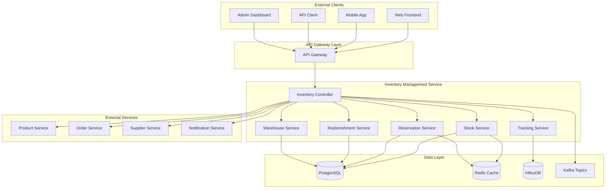
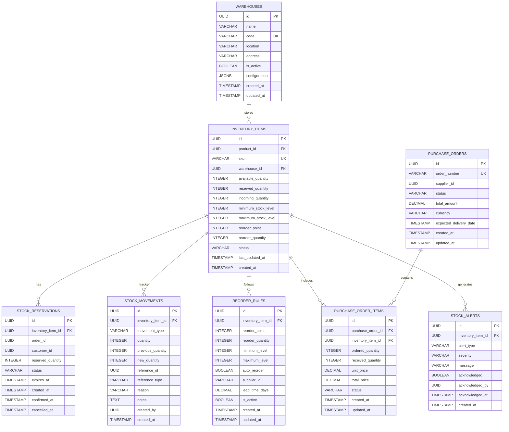

# Inventory Management Service 詳細設計書

## 目次

1. [概要](#概要)
2. [技術仕様](#技術仕様)
3. [アーキテクチャ設計](#アーキテクチャ設計)
4. [API設計](#api設計)
5. [データベース設計](#データベース設計)
6. [在庫管理設計](#inventory-management-design)
7. [在庫追跡設計](#inventory-tracking-design)
8. [エラー処理](#error-handling)
9. [テスト設計](#test-design)
10. [ローカル開発環境](#local-development)
11. [本番デプロイメント](#production-deployment)
12. [監視・運用](#monitoring-operations)
13. [障害対応](#incident-response)

## 概要

### サービス概要

Inventory Management Serviceは、スキー用品販売ショップサイトの在庫管理機能を担当するマイクロサービスです。在庫の追跡、予約、更新、補充、および在庫レベルの監視など、在庫に関する全ての機能を提供します。

### 主要責務

- **在庫管理**: 商品在庫数の管理、更新、追跡
- **在庫予約**: 注文時の在庫引当、予約管理
- **在庫補充**: 自動補充、発注点管理
- **在庫監視**: 在庫レベル監視、アラート送信
- **在庫履歴**: 在庫変動履歴、監査ログ
- **倉庫管理**: 複数倉庫での在庫管理

### ビジネス価値

- **販売機会最大化**: 適切な在庫レベルの維持
- **コスト最適化**: 過剰在庫・欠品の防止
- **顧客満足度向上**: 正確な在庫情報の提供
- **運用効率化**: 自動化された在庫管理

## 技術仕様

### 使用技術スタック

| 技術領域 | 技術/ライブラリ | バージョン | 用途 |
|---------|----------------|-----------|------|
| **Runtime** | OpenJDK | 21 LTS | Java実行環境 |
| **Framework** | Jakarta EE | 11 | エンタープライズフレームワーク |
| **Application Server** | WildFly | 31.0.1 | Jakarta EEアプリケーションサーバー |
| **Persistence** | Jakarta Persistence (JPA) | 3.2 | ORM |
| **Data Access** | Jakarta Data | 1.0 | Repository抽象化 |
| **REST API** | Jakarta REST (JAX-RS) | 4.0 | RESTful Web Services |
| **CDI** | Jakarta CDI | 4.1 | 依存性注入・管理 |
| **Validation** | Jakarta Validation | 3.1 | Bean Validation |
| **JSON Processing** | Jakarta JSON-P | 2.1 | JSON処理 |
| **Database** | PostgreSQL | 16 | 主データベース |
| **Cache** | Redis | 7.2 | 在庫キャッシュ |
| **Message Queue** | Apache Kafka | 3.7 | 在庫イベント処理 |
| **Time Series DB** | InfluxDB | 2.7 | 在庫履歴データ |
| **Monitoring** | MicroProfile Metrics | 5.1 | メトリクス収集 |
| **Tracing** | MicroProfile OpenTelemetry | 2.0 | 分散トレーシング |
| **Health Check** | MicroProfile Health | 4.0 | ヘルスチェック |
| **Configuration** | MicroProfile Config | 3.1 | 設定管理 |

### 除外技術

- **Lombok**: Jakarta EE 11のRecord クラスとモダンJava機能を活用するため使用しません

### Java 21 LTS 活用機能

- **Virtual Threads**: 高並行在庫処理
- **Record Classes**: 在庫データ構造
- **Pattern Matching**: 在庫状態判定
- **Text Blocks**: 複雑なSQL定義
- **Sealed Classes**: 在庫イベントの型安全性

## アーキテクチャ設計

### システムアーキテクチャ図



### ドメインモデル設計

```java
// 在庫アイテム
@Entity
@Table(name = "inventory_items")
public class InventoryItem {
    
    @Id
    @GeneratedValue(strategy = GenerationType.UUID)
    private UUID id;
    
    @Column(name = "product_id", nullable = false)
    private UUID productId;
    
    @Column(name = "sku", unique = true, nullable = false)
    private String sku;
    
    @Column(name = "warehouse_id", nullable = false)
    private UUID warehouseId;
    
    @Column(name = "available_quantity", nullable = false)
    private Integer availableQuantity;
    
    @Column(name = "reserved_quantity", nullable = false)
    private Integer reservedQuantity = 0;
    
    @Column(name = "incoming_quantity", nullable = false)
    private Integer incomingQuantity = 0;
    
    @Column(name = "minimum_stock_level", nullable = false)
    private Integer minimumStockLevel;
    
    @Column(name = "maximum_stock_level", nullable = false)
    private Integer maximumStockLevel;
    
    @Column(name = "reorder_point", nullable = false)
    private Integer reorderPoint;
    
    @Column(name = "reorder_quantity", nullable = false)
    private Integer reorderQuantity;
    
    @Enumerated(EnumType.STRING)
    @Column(name = "status", nullable = false)
    private InventoryStatus status;
    
    @Column(name = "last_updated_at", nullable = false)
    private LocalDateTime lastUpdatedAt;
    
    @Column(name = "created_at", nullable = false)
    private LocalDateTime createdAt;
    
    // 関連エンティティ
    @OneToMany(mappedBy = "inventoryItem", cascade = CascadeType.ALL, fetch = FetchType.LAZY)
    private List<StockMovement> stockMovements = new ArrayList<>();
    
    @OneToMany(mappedBy = "inventoryItem", cascade = CascadeType.ALL, fetch = FetchType.LAZY)
    private List<StockReservation> reservations = new ArrayList<>();
    
    // ビジネスロジック
    public Integer getTotalQuantity() {
        return availableQuantity + reservedQuantity;
    }
    
    public boolean isLowStock() {
        return availableQuantity <= reorderPoint;
    }
    
    public boolean isOutOfStock() {
        return availableQuantity <= 0;
    }
    
    public boolean canReserve(Integer quantity) {
        return availableQuantity >= quantity;
    }
    
    public void reserveStock(Integer quantity) {
        if (!canReserve(quantity)) {
            throw new InsufficientStockException("在庫不足です");
        }
        this.availableQuantity -= quantity;
        this.reservedQuantity += quantity;
        this.lastUpdatedAt = LocalDateTime.now();
    }
    
    public void releaseReservation(Integer quantity) {
        this.reservedQuantity = Math.max(0, this.reservedQuantity - quantity);
        this.availableQuantity += quantity;
        this.lastUpdatedAt = LocalDateTime.now();
    }
    
    public void confirmReservation(Integer quantity) {
        this.reservedQuantity = Math.max(0, this.reservedQuantity - quantity);
        this.lastUpdatedAt = LocalDateTime.now();
    }
}

// 在庫予約
@Entity
@Table(name = "stock_reservations")
public class StockReservation {
    
    @Id
    @GeneratedValue(strategy = GenerationType.UUID)
    private UUID id;
    
    @ManyToOne(fetch = FetchType.LAZY)
    @JoinColumn(name = "inventory_item_id", nullable = false)
    private InventoryItem inventoryItem;
    
    @Column(name = "order_id")
    private UUID orderId;
    
    @Column(name = "customer_id")
    private UUID customerId;
    
    @Column(name = "reserved_quantity", nullable = false)
    private Integer reservedQuantity;
    
    @Enumerated(EnumType.STRING)
    @Column(name = "status", nullable = false)
    private ReservationStatus status;
    
    @Column(name = "expires_at", nullable = false)
    private LocalDateTime expiresAt;
    
    @Column(name = "created_at", nullable = false)
    private LocalDateTime createdAt;
    
    @Column(name = "confirmed_at")
    private LocalDateTime confirmedAt;
    
    public boolean isExpired() {
        return LocalDateTime.now().isAfter(expiresAt);
    }
    
    public boolean canConfirm() {
        return status == ReservationStatus.ACTIVE && !isExpired();
    }
}

// 在庫移動履歴
@Entity
@Table(name = "stock_movements")
public class StockMovement {
    
    @Id
    @GeneratedValue(strategy = GenerationType.UUID)
    private UUID id;
    
    @ManyToOne(fetch = FetchType.LAZY)
    @JoinColumn(name = "inventory_item_id", nullable = false)
    private InventoryItem inventoryItem;
    
    @Enumerated(EnumType.STRING)
    @Column(name = "movement_type", nullable = false)
    private MovementType movementType;
    
    @Column(name = "quantity", nullable = false)
    private Integer quantity;
    
    @Column(name = "reference_id")
    private UUID referenceId;
    
    @Column(name = "reference_type")
    private String referenceType;
    
    @Column(name = "reason")
    private String reason;
    
    @Column(name = "notes")
    private String notes;
    
    @Column(name = "created_by")
    private UUID createdBy;
    
    @Column(name = "created_at", nullable = false)
    private LocalDateTime createdAt;
}

// Record ベース Value Objects
public record StockLevel(
    Integer available,
    Integer reserved,
    Integer incoming,
    Integer total
) {
    public static StockLevel from(InventoryItem item) {
        return new StockLevel(
            item.getAvailableQuantity(),
            item.getReservedQuantity(),
            item.getIncomingQuantity(),
            item.getTotalQuantity()
        );
    }
    
    public boolean isLow(Integer reorderPoint) {
        return available <= reorderPoint;
    }
    
    public boolean isOutOfStock() {
        return available <= 0;
    }
}

public record ReorderInfo(
    Integer reorderPoint,
    Integer reorderQuantity,
    Integer minimumLevel,
    Integer maximumLevel,
    boolean autoReorder
) {
    public boolean shouldReorder(Integer currentLevel) {
        return currentLevel <= reorderPoint;
    }
}

public record WarehouseInfo(
    UUID warehouseId,
    String warehouseName,
    String location,
    boolean isActive
) {}

// Sealed Classes for Events
public sealed interface InventoryEvent
    permits StockUpdatedEvent, StockReservedEvent, StockConfirmedEvent, 
            LowStockEvent, OutOfStockEvent, ReorderTriggeredEvent {
}

public record StockUpdatedEvent(
    UUID inventoryItemId,
    String sku,
    Integer previousQuantity,
    Integer newQuantity,
    MovementType movementType,
    String reason,
    LocalDateTime timestamp
) implements InventoryEvent {}

public record StockReservedEvent(
    UUID reservationId,
    UUID inventoryItemId,
    String sku,
    Integer quantity,
    UUID orderId,
    LocalDateTime expiresAt,
    LocalDateTime timestamp
) implements InventoryEvent {}

public record LowStockEvent(
    UUID inventoryItemId,
    String sku,
    Integer currentQuantity,
    Integer reorderPoint,
    LocalDateTime timestamp
) implements InventoryEvent {}

// Enums
public enum InventoryStatus {
    ACTIVE("有効"),
    INACTIVE("無効"),
    DISCONTINUED("生産終了");
    
    private final String description;
    
    InventoryStatus(String description) {
        this.description = description;
    }
    
    public String getDescription() {
        return description;
    }
}

public enum ReservationStatus {
    ACTIVE("有効"),
    CONFIRMED("確定"),
    CANCELLED("取消"),
    EXPIRED("期限切れ");
    
    private final String description;
    
    ReservationStatus(String description) {
        this.description = description;
    }
    
    public String getDescription() {
        return description;
    }
}

public enum MovementType {
    INBOUND("入荷"),
    OUTBOUND("出荷"),
    ADJUSTMENT("調整"),
    TRANSFER("移動"),
    RETURN("返品"),
    DAMAGE("損傷"),
    THEFT("紛失");
    
    private final String description;
    
    MovementType(String description) {
        this.description = description;
    }
    
    public String getDescription() {
        return description;
    }
}
```

### サービス層設計

```java
// 在庫サービス (CQRS Pattern 対応)
@ApplicationScoped
@Transactional
public class InventoryService {
    
    private static final Logger logger = LoggerFactory.getLogger(InventoryService.class);
    
    @Inject
    private InventoryItemRepository inventoryRepository;
    
    @Inject
    private StockMovementRepository movementRepository;
    
    @Inject
    private InventoryEventPublisher eventPublisher;
    
    @Inject
    private InventoryCacheService cacheService;
    
    @Inject
    private InventoryProcessingSaga inventoryProcessingSaga;
    
    // CQRS Command Handlers
    @CommandHandler
    public InventoryResult handle(ReserveInventoryCommand command) {
        try {
            var reservationId = UUID.randomUUID();
            var result = reserveStock(command.sku(), command.quantity(), 
                command.orderId(), command.customerId(), reservationId);
            
            if (result.success()) {
                eventPublisher.publish(new InventoryReservedEvent(
                    command.orderId(),
                    command.sku(),
                    command.quantity(),
                    reservationId,
                    LocalDateTime.now()
                ));
                
                logger.info("在庫予約完了: SKU={}, quantity={}, orderId={}, reservationId={}", 
                    command.sku(), command.quantity(), command.orderId(), reservationId);
            }
            
            return result;
        } catch (Exception e) {
            logger.error("在庫予約エラー: SKU=" + command.sku(), e);
            eventPublisher.publish(new InventoryReservationFailedEvent(
                command.orderId(),
                command.sku(),
                command.quantity(),
                e.getMessage(),
                LocalDateTime.now()
            ));
            
            return new InventoryResult(false, null, e.getMessage());
        }
    }
    
    @CommandHandler
    public InventoryResult handle(ReleaseInventoryCommand command) {
        try {
            var result = releaseReservation(command.reservationId(), command.reason());
            
            if (result.success()) {
                eventPublisher.publish(new InventoryReleasedEvent(
                    command.orderId(),
                    command.reservationId(),
                    command.reason(),
                    LocalDateTime.now()
                ));
                
                logger.info("在庫予約解除完了: reservationId={}, orderId={}", 
                    command.reservationId(), command.orderId());
            }
            
            return result;
        } catch (Exception e) {
            logger.error("在庫予約解除エラー: reservationId=" + command.reservationId(), e);
            return new InventoryResult(false, null, e.getMessage());
        }
    }
    
    @CommandHandler
    public InventoryResult handle(ConfirmInventoryCommand command) {
        try {
            var result = confirmReservation(command.reservationId());
            
            if (result.success()) {
                eventPublisher.publish(new InventoryConfirmedEvent(
                    command.orderId(),
                    command.reservationId(),
                    LocalDateTime.now()
                ));
                
                logger.info("在庫確定完了: reservationId={}, orderId={}", 
                    command.reservationId(), command.orderId());
            }
            
            return result;
        } catch (Exception e) {
            logger.error("在庫確定エラー: reservationId=" + command.reservationId(), e);
            return new InventoryResult(false, null, e.getMessage());
        }
    }
    
    @CommandHandler
    public InventoryResult handle(AdjustInventoryCommand command) {
        try {
            var result = adjustStock(command.sku(), command.newQuantity(), command.reason());
            
            if (result.success()) {
                eventPublisher.publish(new InventoryAdjustedEvent(
                    command.sku(),
                    command.previousQuantity(),
                    command.newQuantity(),
                    command.reason(),
                    LocalDateTime.now()
                ));
                
                logger.info("在庫調整完了: SKU={}, oldQuantity={}, newQuantity={}", 
                    command.sku(), command.previousQuantity(), command.newQuantity());
            }
            
            return result;
        } catch (Exception e) {
            logger.error("在庫調整エラー: SKU=" + command.sku(), e);
            return new InventoryResult(false, null, e.getMessage());
        }
    }
    
    // CQRS Query Handlers
    @QueryHandler
    public InventoryProjection handle(GetInventoryBySkuQuery query) {
        var item = findBySku(query.sku());
        return item.map(InventoryProjection::from)
            .orElse(null);
    }
    
    @QueryHandler
    public List<InventoryProjection> handle(GetLowStockItemsQuery query) {
        return inventoryRepository.findLowStockItems(query.threshold())
            .stream()
            .map(InventoryProjection::from)
            .toList();
    }
    
    @QueryHandler
    public List<StockMovementProjection> handle(GetStockMovementHistoryQuery query) {
        return movementRepository.findBySkuAndDateRange(
                query.sku(), query.fromDate(), query.toDate())
            .stream()
            .map(StockMovementProjection::from)
            .toList();
    }
    
    @QueryHandler
    public InventoryStatisticsProjection handle(GetInventoryStatisticsQuery query) {
        var totalItems = inventoryRepository.countAll();
        var lowStockItems = inventoryRepository.countLowStockItems(query.lowStockThreshold());
        var outOfStockItems = inventoryRepository.countOutOfStockItems();
        var totalValue = inventoryRepository.calculateTotalValue();
        
        return new InventoryStatisticsProjection(
            totalItems,
            lowStockItems,
            outOfStockItems,
            totalValue,
            LocalDateTime.now()
        );
    }
    
    // Event Handlers
    @EventHandler
    public void handle(OrderCreatedEvent event) {
        logger.info("注文作成イベント処理開始: orderId={}", event.orderId());
        
        CompletableFuture.runAsync(() -> {
            try {
                inventoryProcessingSaga.processOrderInventoryReservation(
                    event.orderId(),
                    event.orderItems()
                );
            } catch (Exception e) {
                logger.error("在庫予約Saga実行エラー: orderId=" + event.orderId(), e);
            }
        }, VirtualThread.ofVirtual().factory());
    }
    
    @EventHandler
    public void handle(OrderCancelledEvent event) {
        logger.info("注文キャンセルイベント処理開始: orderId={}", event.orderId());
        
        CompletableFuture.runAsync(() -> {
            try {
                inventoryProcessingSaga.processOrderInventoryRelease(
                    event.orderId(),
                    event.reason()
                );
            } catch (Exception e) {
                logger.error("在庫解除Saga実行エラー: orderId=" + event.orderId(), e);
            }
        }, VirtualThread.ofVirtual().factory());
    }
    
    public Optional<InventoryItem> findBySku(String sku) {
        // キャッシュから取得を試行
        var cached = cacheService.getInventoryItem(sku);
        if (cached.isPresent()) {
            return cached;
        }
        
        // データベースから取得
        var item = inventoryRepository.findBySku(sku);
        if (item.isPresent()) {
            cacheService.cacheInventoryItem(item.get());
        }
        
        return item;
    }
    
    public StockLevel getStockLevel(String sku) {
        var item = findBySku(sku)
            .orElseThrow(() -> new InventoryNotFoundException("SKU not found: " + sku));
        
        return StockLevel.from(item);
    }
    
    public void updateStock(String sku, Integer quantity, MovementType movementType, String reason) {
        var item = findBySku(sku)
            .orElseThrow(() -> new InventoryNotFoundException("SKU not found: " + sku));
        
        var previousQuantity = item.getAvailableQuantity();
        
        // 在庫更新
        switch (movementType) {
            case INBOUND -> item.setAvailableQuantity(item.getAvailableQuantity() + quantity);
            case OUTBOUND -> {
                if (item.getAvailableQuantity() < quantity) {
                    throw new InsufficientStockException("在庫不足です");
                }
                item.setAvailableQuantity(item.getAvailableQuantity() - quantity);
            }
            case ADJUSTMENT -> item.setAvailableQuantity(quantity);
            default -> throw new UnsupportedOperationException("未対応の移動タイプ: " + movementType);
        }
        
        item.setLastUpdatedAt(LocalDateTime.now());
        
        // 在庫移動履歴記録
        var movement = new StockMovement();
        movement.setInventoryItem(item);
        movement.setMovementType(movementType);
        movement.setQuantity(quantity);
        movement.setReason(reason);
        movement.setCreatedAt(LocalDateTime.now());
        
        movementRepository.save(movement);
        inventoryRepository.save(item);
        
        // キャッシュ更新
        cacheService.updateInventoryItem(item);
        
        // イベント発行
        eventPublisher.publish(new StockUpdatedEvent(
            item.getId(),
            item.getSku(),
            previousQuantity,
            item.getAvailableQuantity(),
            movementType,
            reason,
            LocalDateTime.now()
        ));
        
        // 低在庫チェック
        checkLowStock(item);
        
        logger.info("Stock updated for SKU: {}, Movement: {}, Quantity: {}", 
            sku, movementType, quantity);
    }
    
    private void checkLowStock(InventoryItem item) {
        if (item.isLowStock()) {
            eventPublisher.publish(new LowStockEvent(
                item.getId(),
                item.getSku(),
                item.getAvailableQuantity(),
                item.getReorderPoint(),
                LocalDateTime.now()
            ));
        }
        
        if (item.isOutOfStock()) {
            eventPublisher.publish(new OutOfStockEvent(
                item.getId(),
                item.getSku(),
                LocalDateTime.now()
            ));
        }
    }
    
    public List<InventoryItem> findLowStockItems() {
        return inventoryRepository.findLowStockItems();
    }
    
    public List<InventoryItem> findByWarehouse(UUID warehouseId) {
        return inventoryRepository.findByWarehouseId(warehouseId);
    }
    
    public InventoryStatistics getInventoryStatistics() {
        var totalItems = inventoryRepository.count();
        var lowStockCount = inventoryRepository.countLowStockItems();
        var outOfStockCount = inventoryRepository.countOutOfStockItems();
        var totalValue = inventoryRepository.calculateTotalInventoryValue();
        
        return new InventoryStatistics(
            totalItems,
            lowStockCount,
            outOfStockCount,
            totalValue
        );
    }
}

// 在庫処理Sagaパターン
@ApplicationScoped
@Transactional
public class InventoryProcessingSaga {
    
    private static final Logger logger = LoggerFactory.getLogger(InventoryProcessingSaga.class);
    
    @Inject
    private InventoryItemRepository inventoryRepository;
    
    @Inject
    private StockReservationRepository reservationRepository;
    
    @Inject
    private SagaStateRepository sagaStateRepository;
    
    @Inject
    private InventoryEventPublisher eventPublisher;
    
    public CompletableFuture<SagaResult> processOrderInventoryReservation(
            UUID orderId, List<OrderItemDto> orderItems) {
        
        return CompletableFuture.supplyAsync(() -> {
            var sagaId = UUID.randomUUID();
            var sagaState = new SagaState(sagaId, orderId, SagaType.INVENTORY_RESERVATION);
            sagaStateRepository.save(sagaState);
            
            try {
                logger.info("在庫予約Saga開始: sagaId={}, orderId={}", sagaId, orderId);
                sagaState.setCurrentStep("VALIDATING_INVENTORY");
                
                // Step 1: 在庫チェック
                var validationResult = validateInventoryAvailability(orderItems);
                if (!validationResult.success()) {
                    return handleSagaFailure(sagaState, "在庫チェック失敗", validationResult.message());
                }
                sagaState.setLastCompletedStep("VALIDATING_INVENTORY");
                
                // Step 2: 在庫予約
                sagaState.setCurrentStep("RESERVING_INVENTORY");
                var reservationResult = reserveInventoryItems(orderId, orderItems);
                if (!reservationResult.success()) {
                    return handleSagaFailure(sagaState, "在庫予約失敗", reservationResult.message());
                }
                sagaState.setLastCompletedStep("RESERVING_INVENTORY");
                
                // Step 3: 予約確認イベント送信
                sagaState.setCurrentStep("PUBLISHING_EVENTS");
                publishInventoryReservedEvents(orderId, orderItems, reservationResult.reservationIds());
                sagaState.setLastCompletedStep("PUBLISHING_EVENTS");
                
                // Saga完了
                sagaState.complete();
                sagaStateRepository.save(sagaState);
                
                logger.info("在庫予約Saga完了: sagaId={}, orderId={}", sagaId, orderId);
                return new SagaResult(true, "在庫予約完了");
                
            } catch (Exception e) {
                logger.error("在庫予約Saga実行エラー: sagaId=" + sagaId, e);
                return handleSagaFailure(sagaState, "予期しないエラー", e.getMessage());
            }
        }, VirtualThread.ofVirtual().factory());
    }
    
    public CompletableFuture<SagaResult> processOrderInventoryRelease(
            UUID orderId, String reason) {
        
        return CompletableFuture.supplyAsync(() -> {
            var sagaId = UUID.randomUUID();
            var sagaState = new SagaState(sagaId, orderId, SagaType.INVENTORY_RELEASE);
            sagaStateRepository.save(sagaState);
            
            try {
                logger.info("在庫解除Saga開始: sagaId={}, orderId={}", sagaId, orderId);
                
                // Step 1: 予約検索
                sagaState.setCurrentStep("FINDING_RESERVATIONS");
                var reservations = reservationRepository.findByOrderId(orderId);
                if (reservations.isEmpty()) {
                    logger.warn("予約が見つかりません: orderId={}", orderId);
                    sagaState.complete();
                    sagaStateRepository.save(sagaState);
                    return new SagaResult(true, "予約なし - 処理完了");
                }
                sagaState.setLastCompletedStep("FINDING_RESERVATIONS");
                
                // Step 2: 予約解除
                sagaState.setCurrentStep("RELEASING_RESERVATIONS");
                var releaseResult = releaseInventoryReservations(reservations, reason);
                if (!releaseResult.success()) {
                    return handleSagaFailure(sagaState, "予約解除失敗", releaseResult.message());
                }
                sagaState.setLastCompletedStep("RELEASING_RESERVATIONS");
                
                // Step 3: 解除イベント送信
                sagaState.setCurrentStep("PUBLISHING_EVENTS");
                publishInventoryReleasedEvents(orderId, reservations, reason);
                sagaState.setLastCompletedStep("PUBLISHING_EVENTS");
                
                // Saga完了
                sagaState.complete();
                sagaStateRepository.save(sagaState);
                
                logger.info("在庫解除Saga完了: sagaId={}, orderId={}", sagaId, orderId);
                return new SagaResult(true, "在庫解除完了");
                
            } catch (Exception e) {
                logger.error("在庫解除Saga実行エラー: sagaId=" + sagaId, e);
                return handleSagaFailure(sagaState, "予期しないエラー", e.getMessage());
            }
        }, VirtualThread.ofVirtual().factory());
    }
    
    // Saga補償処理
    public CompletableFuture<SagaResult> compensateInventoryReservation(UUID sagaId) {
        return CompletableFuture.supplyAsync(() -> {
            try {
                var sagaState = sagaStateRepository.findById(sagaId)
                    .orElseThrow(() -> new IllegalArgumentException("Saga not found: " + sagaId));
                
                logger.info("在庫予約補償開始: sagaId={}, orderId={}", sagaId, sagaState.getOrderId());
                sagaState.setStatus(SagaStatus.COMPENSATING);
                
                var lastCompletedStep = sagaState.getLastCompletedStep();
                
                // 逆順で補償実行
                if ("PUBLISHING_EVENTS".equals(lastCompletedStep)) {
                    // イベント補償は通常不要（冪等性によりハンドリング）
                }
                
                if ("RESERVING_INVENTORY".equals(lastCompletedStep) || 
                    "PUBLISHING_EVENTS".equals(lastCompletedStep)) {
                    // 在庫予約解除
                    var reservations = reservationRepository.findByOrderId(sagaState.getOrderId());
                    if (!reservations.isEmpty()) {
                        releaseInventoryReservations(reservations, "Saga補償による解除");
                        logger.info("在庫予約補償完了: sagaId={}", sagaId);
                    }
                }
                
                sagaState.setStatus(SagaStatus.COMPENSATED);
                sagaStateRepository.save(sagaState);
                
                return new SagaResult(true, "補償完了");
                
            } catch (Exception e) {
                logger.error("在庫予約補償エラー: sagaId=" + sagaId, e);
                return new SagaResult(false, "補償失敗: " + e.getMessage());
            }
        }, VirtualThread.ofVirtual().factory());
    }
    
    // プライベートヘルパーメソッド
    private SagaStepResult validateInventoryAvailability(List<OrderItemDto> orderItems) {
        for (var item : orderItems) {
            var inventoryItem = inventoryRepository.findBySku(item.sku());
            if (inventoryItem.isEmpty()) {
                return new SagaStepResult(false, "商品が見つかりません: " + item.sku());
            }
            
            if (!inventoryItem.get().canReserve(item.quantity())) {
                return new SagaStepResult(false, "在庫不足です: " + item.sku());
            }
        }
        
        return new SagaStepResult(true, "在庫チェック完了");
    }
    
    private InventoryReservationResult reserveInventoryItems(UUID orderId, List<OrderItemDto> orderItems) {
        var reservationIds = new ArrayList<UUID>();
        
        try {
            for (var item : orderItems) {
                var inventoryItem = inventoryRepository.findBySku(item.sku())
                    .orElseThrow(() -> new InventoryNotFoundException("SKU not found: " + item.sku()));
                
                // 在庫予約実行
                inventoryItem.reserveStock(item.quantity());
                inventoryRepository.save(inventoryItem);
                
                // 予約レコード作成
                var reservation = new StockReservation();
                reservation.setInventoryItem(inventoryItem);
                reservation.setOrderId(orderId);
                reservation.setQuantity(item.quantity());
                reservation.setStatus(ReservationStatus.RESERVED);
                reservation.setCreatedAt(LocalDateTime.now());
                reservation.setExpiresAt(LocalDateTime.now().plusMinutes(30));
                
                reservationRepository.save(reservation);
                reservationIds.add(reservation.getId());
            }
            
            return new InventoryReservationResult(true, reservationIds, "予約完了");
            
        } catch (Exception e) {
            // 部分的予約の場合はロールバック
            rollbackPartialReservations(reservationIds);
            return new InventoryReservationResult(false, Collections.emptyList(), e.getMessage());
        }
    }
    
    private SagaStepResult releaseInventoryReservations(List<StockReservation> reservations, String reason) {
        try {
            for (var reservation : reservations) {
                if (reservation.getStatus() == ReservationStatus.RESERVED) {
                    var inventoryItem = reservation.getInventoryItem();
                    inventoryItem.releaseReservation(reservation.getQuantity());
                    inventoryRepository.save(inventoryItem);
                    
                    reservation.setStatus(ReservationStatus.RELEASED);
                    reservation.setReleasedAt(LocalDateTime.now());
                    reservation.setReleaseReason(reason);
                    reservationRepository.save(reservation);
                }
            }
            
            return new SagaStepResult(true, "予約解除完了");
            
        } catch (Exception e) {
            return new SagaStepResult(false, "予約解除エラー: " + e.getMessage());
        }
    }
    
    private void publishInventoryReservedEvents(UUID orderId, List<OrderItemDto> orderItems, 
            List<UUID> reservationIds) {
        
        for (int i = 0; i < orderItems.size(); i++) {
            var item = orderItems.get(i);
            var reservationId = i < reservationIds.size() ? reservationIds.get(i) : null;
            
            eventPublisher.publish(new InventoryReservedEvent(
                orderId,
                item.sku(),
                item.quantity(),
                reservationId,
                LocalDateTime.now()
            ));
        }
    }
    
    private void publishInventoryReleasedEvents(UUID orderId, List<StockReservation> reservations, 
            String reason) {
        
        for (var reservation : reservations) {
            eventPublisher.publish(new InventoryReleasedEvent(
                orderId,
                reservation.getId(),
                reason,
                LocalDateTime.now()
            ));
        }
    }
    
    private void rollbackPartialReservations(List<UUID> reservationIds) {
        for (var reservationId : reservationIds) {
            try {
                var reservation = reservationRepository.findById(reservationId);
                if (reservation.isPresent()) {
                    var inventoryItem = reservation.get().getInventoryItem();
                    inventoryItem.releaseReservation(reservation.get().getQuantity());
                    inventoryRepository.save(inventoryItem);
                    
                    reservationRepository.delete(reservation.get());
                }
            } catch (Exception e) {
                logger.error("予約ロールバックエラー: reservationId=" + reservationId, e);
            }
        }
    }
    
    private SagaResult handleSagaFailure(SagaState sagaState, String reason, String message) {
        sagaState.fail(reason + ": " + message);
        sagaStateRepository.save(sagaState);
        
        // 補償処理を非同期で実行
        CompletableFuture.runAsync(() -> {
            try {
                compensateInventoryReservation(sagaState.getId()).get();
            } catch (Exception e) {
                logger.error("Saga補償処理エラー: sagaId=" + sagaState.getId(), e);
            }
        }, VirtualThread.ofVirtual().factory());
        
        return new SagaResult(false, reason + ": " + message);
    }
}

// 在庫予約サービス
@ApplicationScoped
@Transactional
public class StockReservationService {
    
    private static final Logger logger = LoggerFactory.getLogger(StockReservationService.class);
    
    @Inject
    private InventoryService inventoryService;
    
    @Inject
    private StockReservationRepository reservationRepository;
    
    @Inject
    private InventoryEventPublisher eventPublisher;
    
    @ConfigProperty(name = "reservation.default.expiration", defaultValue = "PT30M")
    private Duration defaultReservationDuration;
    
    public StockReservation reserveStock(ReservationRequest request) {
        var item = inventoryService.findBySku(request.sku())
            .orElseThrow(() -> new InventoryNotFoundException("SKU not found: " + request.sku()));
        
        if (!item.canReserve(request.quantity())) {
            throw new InsufficientStockException("在庫不足です: " + request.sku());
        }
        
        // 在庫予約
        item.reserveStock(request.quantity());
        
        var reservation = new StockReservation();
        reservation.setInventoryItem(item);
        reservation.setOrderId(request.orderId());
        reservation.setCustomerId(request.customerId());
        reservation.setReservedQuantity(request.quantity());
        reservation.setStatus(ReservationStatus.ACTIVE);
        reservation.setExpiresAt(LocalDateTime.now().plus(defaultReservationDuration));
        reservation.setCreatedAt(LocalDateTime.now());
        
        reservationRepository.save(reservation);
        
        // イベント発行
        eventPublisher.publish(new StockReservedEvent(
            reservation.getId(),
            item.getId(),
            item.getSku(),
            request.quantity(),
            request.orderId(),
            reservation.getExpiresAt(),
            LocalDateTime.now()
        ));
        
        logger.info("Stock reserved: SKU={}, Quantity={}, OrderId={}", 
            request.sku(), request.quantity(), request.orderId());
        
        return reservation;
    }
    
    public void confirmReservation(UUID reservationId) {
        var reservation = reservationRepository.findById(reservationId)
            .orElseThrow(() -> new ReservationNotFoundException("Reservation not found: " + reservationId));
        
        if (!reservation.canConfirm()) {
            throw new InvalidReservationStateException("予約を確定できません");
        }
        
        var item = reservation.getInventoryItem();
        item.confirmReservation(reservation.getReservedQuantity());
        
        reservation.setStatus(ReservationStatus.CONFIRMED);
        reservation.setConfirmedAt(LocalDateTime.now());
        
        reservationRepository.save(reservation);
        
        // イベント発行
        eventPublisher.publish(new StockConfirmedEvent(
            reservation.getId(),
            item.getId(),
            item.getSku(),
            reservation.getReservedQuantity(),
            reservation.getOrderId(),
            LocalDateTime.now()
        ));
        
        logger.info("Reservation confirmed: ReservationId={}, SKU={}", 
            reservationId, item.getSku());
    }
    
    public void cancelReservation(UUID reservationId, String reason) {
        var reservation = reservationRepository.findById(reservationId)
            .orElseThrow(() -> new ReservationNotFoundException("Reservation not found: " + reservationId));
        
        if (reservation.getStatus() != ReservationStatus.ACTIVE) {
            throw new InvalidReservationStateException("予約をキャンセルできません");
        }
        
        var item = reservation.getInventoryItem();
        item.releaseReservation(reservation.getReservedQuantity());
        
        reservation.setStatus(ReservationStatus.CANCELLED);
        
        reservationRepository.save(reservation);
        
        logger.info("Reservation cancelled: ReservationId={}, Reason={}", 
            reservationId, reason);
    }
    
    // 期限切れ予約の自動キャンセル
    @Schedule(every = "PT5M") // 5分ごと
    public void cleanupExpiredReservations() {
        var expiredReservations = reservationRepository.findExpiredReservations();
        
        for (var reservation : expiredReservations) {
            try {
                cancelReservation(reservation.getId(), "期限切れによる自動キャンセル");
            } catch (Exception e) {
                logger.error("Failed to cancel expired reservation: {}", reservation.getId(), e);
            }
        }
        
        if (!expiredReservations.isEmpty()) {
            logger.info("Cleaned up {} expired reservations", expiredReservations.size());
        }
    }
}
```

## API設計

### OpenAPI 3.1 仕様

```yaml
# inventory-management-api.yml
openapi: 3.1.0
info:
  title: Inventory Management Service API
  version: 1.0.0
  description: スキー用品ショップ 在庫管理サービス

servers:
  - url: https://api.ski-shop.com/v1/inventory
    description: Production server
  - url: https://staging.api.ski-shop.com/v1/inventory
    description: Staging server
  - url: http://localhost:8084
    description: Local development

paths:
  /items/{sku}/stock:
    get:
      summary: 在庫レベル取得
      operationId: getStockLevel
      tags: [Stock Management]
      parameters:
        - name: sku
          in: path
          required: true
          schema:
            type: string
          example: "SKI-ROSSIGNOL-HERO-165"
      responses:
        '200':
          description: 在庫レベル情報
          content:
            application/json:
              schema:
                $ref: '#/components/schemas/StockLevelResponse'
        '404':
          description: SKUが見つからない

    put:
      summary: 在庫レベル更新
      operationId: updateStockLevel
      tags: [Stock Management]
      security:
        - BearerAuth: []
      parameters:
        - name: sku
          in: path
          required: true
          schema:
            type: string
      requestBody:
        required: true
        content:
          application/json:
            schema:
              $ref: '#/components/schemas/StockUpdateRequest'
      responses:
        '200':
          description: 在庫更新成功
          content:
            application/json:
              schema:
                $ref: '#/components/schemas/StockLevelResponse'
        '400':
          description: 無効なリクエスト
        '404':
          description: SKUが見つからない

  /items/bulk-check:
    post:
      summary: 複数SKUの在庫確認
      operationId: bulkStockCheck
      tags: [Stock Management]
      requestBody:
        required: true
        content:
          application/json:
            schema:
              $ref: '#/components/schemas/BulkStockCheckRequest'
      responses:
        '200':
          description: 複数SKUの在庫情報
          content:
            application/json:
              schema:
                $ref: '#/components/schemas/BulkStockCheckResponse'

  /reservations:
    post:
      summary: 在庫予約
      operationId: reserveStock
      tags: [Reservations]
      security:
        - BearerAuth: []
      requestBody:
        required: true
        content:
          application/json:
            schema:
              $ref: '#/components/schemas/StockReservationRequest'
      responses:
        '201':
          description: 予約作成成功
          content:
            application/json:
              schema:
                $ref: '#/components/schemas/StockReservationResponse'
        '400':
          description: 在庫不足または無効なリクエスト
        '404':
          description: SKUが見つからない

  /reservations/{reservationId}/confirm:
    post:
      summary: 在庫予約確定
      operationId: confirmReservation
      tags: [Reservations]
      security:
        - BearerAuth: []
      parameters:
        - name: reservationId
          in: path
          required: true
          schema:
            type: string
            format: uuid
      responses:
        '200':
          description: 予約確定成功
        '400':
          description: 予約を確定できない
        '404':
          description: 予約が見つからない

  /reservations/{reservationId}/cancel:
    post:
      summary: 在庫予約キャンセル
      operationId: cancelReservation
      tags: [Reservations]
      security:
        - BearerAuth: []
      parameters:
        - name: reservationId
          in: path
          required: true
          schema:
            type: string
            format: uuid
      requestBody:
        required: true
        content:
          application/json:
            schema:
              $ref: '#/components/schemas/CancelReservationRequest'
      responses:
        '200':
          description: 予約キャンセル成功
        '404':
          description: 予約が見つからない

  /items/low-stock:
    get:
      summary: 低在庫商品一覧
      operationId: getLowStockItems
      tags: [Stock Management]
      security:
        - BearerAuth: []
      parameters:
        - name: warehouse
          in: query
          schema:
            type: string
            format: uuid
        - name: category
          in: query
          schema:
            type: string
        - name: limit
          in: query
          schema:
            type: integer
            default: 50
      responses:
        '200':
          description: 低在庫商品一覧
          content:
            application/json:
              schema:
                $ref: '#/components/schemas/LowStockItemsResponse'

  /warehouses/{warehouseId}/items:
    get:
      summary: 倉庫別在庫一覧
      operationId: getWarehouseInventory
      tags: [Warehouse Management]
      security:
        - BearerAuth: []
      parameters:
        - name: warehouseId
          in: path
          required: true
          schema:
            type: string
            format: uuid
        - name: page
          in: query
          schema:
            type: integer
            default: 0
        - name: size
          in: query
          schema:
            type: integer
            default: 20
      responses:
        '200':
          description: 倉庫在庫一覧
          content:
            application/json:
              schema:
                $ref: '#/components/schemas/WarehouseInventoryResponse'

  /items/{sku}/movements:
    get:
      summary: 在庫移動履歴
      operationId: getStockMovementHistory
      tags: [Stock Tracking]
      security:
        - BearerAuth: []
      parameters:
        - name: sku
          in: path
          required: true
          schema:
            type: string
        - name: from
          in: query
          schema:
            type: string
            format: date
        - name: to
          in: query
          schema:
            type: string
            format: date
        - name: movementType
          in: query
          schema:
            type: string
            enum: [INBOUND, OUTBOUND, ADJUSTMENT, TRANSFER, RETURN, DAMAGE, THEFT]
      responses:
        '200':
          description: 在庫移動履歴
          content:
            application/json:
              schema:
                $ref: '#/components/schemas/StockMovementHistoryResponse'

  /statistics:
    get:
      summary: 在庫統計情報
      operationId: getInventoryStatistics
      tags: [Analytics]
      security:
        - BearerAuth: []
      responses:
        '200':
          description: 在庫統計情報
          content:
            application/json:
              schema:
                $ref: '#/components/schemas/InventoryStatisticsResponse'

components:
  schemas:
    StockLevelResponse:
      type: object
      properties:
        sku:
          type: string
          example: "SKI-ROSSIGNOL-HERO-165"
        available:
          type: integer
          example: 25
        reserved:
          type: integer
          example: 5
        incoming:
          type: integer
          example: 10
        total:
          type: integer
          example: 40
        warehouse:
          $ref: '#/components/schemas/WarehouseInfo'
        reorderInfo:
          $ref: '#/components/schemas/ReorderInfo'
        status:
          type: string
          enum: [ACTIVE, INACTIVE, DISCONTINUED]
        lastUpdated:
          type: string
          format: date-time

    StockUpdateRequest:
      type: object
      required:
        - quantity
        - movementType
      properties:
        quantity:
          type: integer
          minimum: 0
          example: 10
        movementType:
          type: string
          enum: [INBOUND, OUTBOUND, ADJUSTMENT, TRANSFER, RETURN, DAMAGE, THEFT]
          example: "INBOUND"
        reason:
          type: string
          example: "新規入荷"
        referenceId:
          type: string
          format: uuid
          example: "123e4567-e89b-12d3-a456-426614174000"
        referenceType:
          type: string
          example: "PURCHASE_ORDER"
        notes:
          type: string
          example: "検品完了"

    BulkStockCheckRequest:
      type: object
      required:
        - items
      properties:
        items:
          type: array
          items:
            type: object
            required:
              - sku
              - quantity
            properties:
              sku:
                type: string
              quantity:
                type: integer
          example:
            - sku: "SKI-ROSSIGNOL-HERO-165"
              quantity: 2
            - sku: "BOOT-SALOMON-PRO-27"
              quantity: 1

    BulkStockCheckResponse:
      type: object
      properties:
        results:
          type: array
          items:
            type: object
            properties:
              sku:
                type: string
              available:
                type: integer
              canFulfill:
                type: boolean
              shortfall:
                type: integer

    StockReservationRequest:
      type: object
      required:
        - sku
        - quantity
        - orderId
      properties:
        sku:
          type: string
          example: "SKI-ROSSIGNOL-HERO-165"
        quantity:
          type: integer
          minimum: 1
          example: 2
        orderId:
          type: string
          format: uuid
          example: "123e4567-e89b-12d3-a456-426614174000"
        customerId:
          type: string
          format: uuid
          example: "123e4567-e89b-12d3-a456-426614174000"
        expirationMinutes:
          type: integer
          minimum: 1
          maximum: 1440
          default: 30
          example: 30

    StockReservationResponse:
      type: object
      properties:
        reservationId:
          type: string
          format: uuid
        sku:
          type: string
        quantity:
          type: integer
        status:
          type: string
          enum: [ACTIVE, CONFIRMED, CANCELLED, EXPIRED]
        expiresAt:
          type: string
          format: date-time
        createdAt:
          type: string
          format: date-time

    WarehouseInfo:
      type: object
      properties:
        warehouseId:
          type: string
          format: uuid
        name:
          type: string
        location:
          type: string
        isActive:
          type: boolean

    ReorderInfo:
      type: object
      properties:
        reorderPoint:
          type: integer
        reorderQuantity:
          type: integer
        minimumLevel:
          type: integer
        maximumLevel:
          type: integer
        autoReorder:
          type: boolean

  securitySchemes:
    BearerAuth:
      type: http
      scheme: bearer
      bearerFormat: JWT
```

## データベース設計

### ERD（Entity Relationship Diagram）



### 詳細エンティティ設計

```java
// 倉庫エンティティ
@Entity
@Table(name = "warehouses")
public class Warehouse {
    
    @Id
    @GeneratedValue(strategy = GenerationType.UUID)
    private UUID id;
    
    @Column(name = "name", nullable = false)
    private String name;
    
    @Column(name = "code", unique = true, nullable = false)
    private String code;
    
    @Column(name = "location")
    private String location;
    
    @Column(name = "address")
    private String address;
    
    @Column(name = "is_active", nullable = false)
    private Boolean isActive = true;
    
    @Column(name = "configuration", columnDefinition = "JSONB")
    private String configuration;
    
    @Column(name = "created_at", nullable = false)
    private LocalDateTime createdAt;
    
    @Column(name = "updated_at")
    private LocalDateTime updatedAt;
    
    // 関連エンティティ
    @OneToMany(mappedBy = "warehouse", cascade = CascadeType.ALL, fetch = FetchType.LAZY)
    private List<InventoryItem> inventoryItems = new ArrayList<>();
}

// 発注ルールエンティティ
@Entity
@Table(name = "reorder_rules")
public class ReorderRule {
    
    @Id
    @GeneratedValue(strategy = GenerationType.UUID)
    private UUID id;
    
    @OneToOne(fetch = FetchType.LAZY)
    @JoinColumn(name = "inventory_item_id", nullable = false)
    private InventoryItem inventoryItem;
    
    @Column(name = "reorder_point", nullable = false)
    private Integer reorderPoint;
    
    @Column(name = "reorder_quantity", nullable = false)
    private Integer reorderQuantity;
    
    @Column(name = "minimum_level", nullable = false)
    private Integer minimumLevel;
    
    @Column(name = "maximum_level", nullable = false)
    private Integer maximumLevel;
    
    @Column(name = "auto_reorder", nullable = false)
    private Boolean autoReorder = false;
    
    @Column(name = "supplier_id")
    private UUID supplierId;
    
    @Column(name = "lead_time_days", precision = 5, scale = 2)
    private BigDecimal leadTimeDays;
    
    @Column(name = "is_active", nullable = false)
    private Boolean isActive = true;
    
    @Column(name = "created_at", nullable = false)
    private LocalDateTime createdAt;
    
    @Column(name = "updated_at")
    private LocalDateTime updatedAt;
    
    public boolean shouldTriggerReorder(Integer currentStock) {
        return isActive && autoReorder && currentStock <= reorderPoint;
    }
}

// 発注エンティティ
@Entity
@Table(name = "purchase_orders")
public class PurchaseOrder {
    
    @Id
    @GeneratedValue(strategy = GenerationType.UUID)
    private UUID id;
    
    @Column(name = "order_number", unique = true, nullable = false)
    private String orderNumber;
    
    @Column(name = "supplier_id", nullable = false)
    private UUID supplierId;
    
    @Enumerated(EnumType.STRING)
    @Column(name = "status", nullable = false)
    private PurchaseOrderStatus status;
    
    @Column(name = "total_amount", precision = 12, scale = 2)
    private BigDecimal totalAmount;
    
    @Column(name = "currency", length = 3)
    private String currency = "JPY";
    
    @Column(name = "expected_delivery_date")
    private LocalDate expectedDeliveryDate;
    
    @Column(name = "created_at", nullable = false)
    private LocalDateTime createdAt;
    
    @Column(name = "updated_at")
    private LocalDateTime updatedAt;
    
    // 関連エンティティ
    @OneToMany(mappedBy = "purchaseOrder", cascade = CascadeType.ALL, fetch = FetchType.LAZY)
    private List<PurchaseOrderItem> items = new ArrayList<>();
}

// 発注明細エンティティ
@Entity
@Table(name = "purchase_order_items")
public class PurchaseOrderItem {
    
    @Id
    @GeneratedValue(strategy = GenerationType.UUID)
    private UUID id;
    
    @ManyToOne(fetch = FetchType.LAZY)
    @JoinColumn(name = "purchase_order_id", nullable = false)
    private PurchaseOrder purchaseOrder;
    
    @ManyToOne(fetch = FetchType.LAZY)
    @JoinColumn(name = "inventory_item_id", nullable = false)
    private InventoryItem inventoryItem;
    
    @Column(name = "ordered_quantity", nullable = false)
    private Integer orderedQuantity;
    
    @Column(name = "received_quantity", nullable = false)
    private Integer receivedQuantity = 0;
    
    @Column(name = "unit_price", precision = 10, scale = 2)
    private BigDecimal unitPrice;
    
    @Column(name = "total_price", precision = 12, scale = 2)
    private BigDecimal totalPrice;
    
    @Enumerated(EnumType.STRING)
    @Column(name = "status", nullable = false)
    private PurchaseOrderItemStatus status;
    
    @Column(name = "created_at", nullable = false)
    private LocalDateTime createdAt;
    
    @Column(name = "updated_at")
    private LocalDateTime updatedAt;
    
    public boolean isFullyReceived() {
        return receivedQuantity.equals(orderedQuantity);
    }
    
    public Integer getPendingQuantity() {
        return orderedQuantity - receivedQuantity;
    }
}

// 在庫アラートエンティティ
@Entity
@Table(name = "stock_alerts")
public class StockAlert {
    
    @Id
    @GeneratedValue(strategy = GenerationType.UUID)
    private UUID id;
    
    @ManyToOne(fetch = FetchType.LAZY)
    @JoinColumn(name = "inventory_item_id", nullable = false)
    private InventoryItem inventoryItem;
    
    @Enumerated(EnumType.STRING)
    @Column(name = "alert_type", nullable = false)
    private AlertType alertType;
    
    @Enumerated(EnumType.STRING)
    @Column(name = "severity", nullable = false)
    private AlertSeverity severity;
    
    @Column(name = "message", nullable = false)
    private String message;
    
    @Column(name = "acknowledged", nullable = false)
    private Boolean acknowledged = false;
    
    @Column(name = "acknowledged_by")
    private UUID acknowledgedBy;
    
    @Column(name = "acknowledged_at")
    private LocalDateTime acknowledgedAt;
    
    @Column(name = "created_at", nullable = false)
    private LocalDateTime createdAt;
}

// Repository設計（Jakarta Data活用）
@Repository
public interface InventoryItemRepository extends BasicRepository<InventoryItem, UUID> {
    
    @Query("SELECT i FROM InventoryItem i WHERE i.sku = :sku")
    Optional<InventoryItem> findBySku(String sku);
    
    @Query("""
        SELECT i FROM InventoryItem i 
        WHERE i.availableQuantity <= i.reorderPoint 
        AND i.status = 'ACTIVE'
        ORDER BY i.availableQuantity ASC
        """)
    List<InventoryItem> findLowStockItems();
    
    @Query("""
        SELECT i FROM InventoryItem i 
        WHERE i.availableQuantity = 0 
        AND i.status = 'ACTIVE'
        """)
    List<InventoryItem> findOutOfStockItems();
    
    @Query("SELECT i FROM InventoryItem i WHERE i.warehouseId = :warehouseId")
    List<InventoryItem> findByWarehouseId(UUID warehouseId);
    
    @Query("SELECT COUNT(i) FROM InventoryItem i WHERE i.availableQuantity <= i.reorderPoint")
    long countLowStockItems();
    
    @Query("SELECT COUNT(i) FROM InventoryItem i WHERE i.availableQuantity = 0")
    long countOutOfStockItems();
    
    @Query("""
        SELECT SUM(i.availableQuantity * p.price) 
        FROM InventoryItem i 
        JOIN Product p ON i.productId = p.id
        """)
    BigDecimal calculateTotalInventoryValue();
}

@Repository
public interface StockReservationRepository extends BasicRepository<StockReservation, UUID> {
    
    @Query("""
        SELECT r FROM StockReservation r 
        WHERE r.status = 'ACTIVE' 
        AND r.expiresAt < :currentTime
        """)
    List<StockReservation> findExpiredReservations(LocalDateTime currentTime);
    
    default List<StockReservation> findExpiredReservations() {
        return findExpiredReservations(LocalDateTime.now());
    }
    
    @Query("SELECT r FROM StockReservation r WHERE r.orderId = :orderId")
    List<StockReservation> findByOrderId(UUID orderId);
    
    @Query("SELECT r FROM StockReservation r WHERE r.customerId = :customerId AND r.status = 'ACTIVE'")
    List<StockReservation> findActiveReservationsByCustomer(UUID customerId);
}

// Enums
public enum PurchaseOrderStatus {
    DRAFT("下書き"),
    PENDING("承認待ち"),
    APPROVED("承認済み"),
    SENT("発注済み"),
    PARTIALLY_RECEIVED("部分入荷"),
    COMPLETED("完了"),
    CANCELLED("キャンセル");
    
    private final String description;
    
    PurchaseOrderStatus(String description) {
        this.description = description;
    }
    
    public String getDescription() {
        return description;
    }
}

public enum PurchaseOrderItemStatus {
    PENDING("待機中"),
    PARTIALLY_RECEIVED("部分入荷"),
    COMPLETED("完了"),
    CANCELLED("キャンセル");
    
    private final String description;
    
    PurchaseOrderItemStatus(String description) {
        this.description = description;
    }
    
    public String getDescription() {
        return description;
    }
}

public enum AlertType {
    LOW_STOCK("低在庫"),
    OUT_OF_STOCK("在庫切れ"),
    OVERSTOCK("過剰在庫"),
    EXPIRED_RESERVATION("期限切れ予約"),
    REORDER_TRIGGERED("自動発注実行");
    
    private final String description;
    
    AlertType(String description) {
        this.description = description;
    }
    
    public String getDescription() {
        return description;
    }
}

public enum AlertSeverity {
    LOW("低"),
    MEDIUM("中"),
    HIGH("高"),
    CRITICAL("緊急");
    
    private final String description;
    
    AlertSeverity(String description) {
        this.description = description;
    }
    
    public String getDescription() {
        return description;
    }
}
```

### CQRS Commands、Queries、Projections

```java
// CQRS Commands
public sealed interface InventoryCommand permits 
    ReserveInventoryCommand, ReleaseInventoryCommand, ConfirmInventoryCommand, 
    AdjustInventoryCommand, CreateInventoryItemCommand {
}

public record ReserveInventoryCommand(
    UUID commandId,
    String sku,
    Integer quantity,
    UUID orderId,
    UUID customerId,
    LocalDateTime timestamp
) implements InventoryCommand {}

public record ReleaseInventoryCommand(
    UUID commandId,
    UUID reservationId,
    UUID orderId,
    String reason,
    LocalDateTime timestamp
) implements InventoryCommand {}

public record ConfirmInventoryCommand(
    UUID commandId,
    UUID reservationId,
    UUID orderId,
    LocalDateTime timestamp
) implements InventoryCommand {}

public record AdjustInventoryCommand(
    UUID commandId,
    String sku,
    Integer previousQuantity,
    Integer newQuantity,
    String reason,
    LocalDateTime timestamp
) implements InventoryCommand {}

public record CreateInventoryItemCommand(
    UUID commandId,
    String sku,
    String productName,
    String description,
    BigDecimal unitCost,
    Integer initialQuantity,
    Integer minimumQuantity,
    Integer maximumQuantity,
    String location,
    LocalDateTime timestamp
) implements InventoryCommand {}

// CQRS Queries
public sealed interface InventoryQuery permits 
    GetInventoryBySkuQuery, GetLowStockItemsQuery, GetStockMovementHistoryQuery, 
    GetInventoryStatisticsQuery, SearchInventoryQuery {
}

public record GetInventoryBySkuQuery(
    UUID queryId,
    String sku,
    LocalDateTime timestamp
) implements InventoryQuery {}

public record GetLowStockItemsQuery(
    UUID queryId,
    Integer threshold,
    LocalDateTime timestamp
) implements InventoryQuery {}

public record GetStockMovementHistoryQuery(
    UUID queryId,
    String sku,
    LocalDate fromDate,
    LocalDate toDate,
    LocalDateTime timestamp
) implements InventoryQuery {}

public record GetInventoryStatisticsQuery(
    UUID queryId,
    Integer lowStockThreshold,
    LocalDateTime timestamp
) implements InventoryQuery {}

public record SearchInventoryQuery(
    UUID queryId,
    InventorySearchCriteria criteria,
    int page,
    int size,
    LocalDateTime timestamp
) implements InventoryQuery {}

// CQRS Projections (Read Models)
public record InventoryProjection(
    UUID id,
    String sku,
    String productName,
    String description,
    Integer availableQuantity,
    Integer reservedQuantity,
    Integer minimumQuantity,
    Integer maximumQuantity,
    BigDecimal unitCost,
    String location,
    StockStatus status,
    LocalDateTime lastUpdatedAt
) {
    public static InventoryProjection from(InventoryItem item) {
        return new InventoryProjection(
            item.getId(),
            item.getSku(),
            item.getProductName(),
            item.getDescription(),
            item.getAvailableQuantity(),
            item.getReservedQuantity(),
            item.getMinimumQuantity(),
            item.getMaximumQuantity(),
            item.getUnitCost(),
            item.getLocation(),
            item.getStockStatus(),
            item.getLastUpdatedAt()
        );
    }
}

public record StockMovementProjection(
    UUID id,
    String sku,
    MovementType movementType,
    Integer quantity,
    Integer previousQuantity,
    Integer newQuantity,
    String reason,
    String reference,
    LocalDateTime createdAt
) {
    public static StockMovementProjection from(StockMovement movement) {
        return new StockMovementProjection(
            movement.getId(),
            movement.getInventoryItem().getSku(),
            movement.getMovementType(),
            movement.getQuantity(),
            movement.getPreviousQuantity(),
            movement.getNewQuantity(),
            movement.getReason(),
            movement.getReference(),
            movement.getCreatedAt()
        );
    }
}

public record InventoryStatisticsProjection(
    long totalItems,
    long lowStockItems,
    long outOfStockItems,
    BigDecimal totalValue,
    LocalDateTime calculatedAt
) {}

public record InventorySearchCriteria(
    String skuPattern,
    String productNamePattern,
    StockStatus status,
    Integer minQuantity,
    Integer maxQuantity,
    String location
) {}

// Inventory Events
public sealed interface InventoryEvent permits 
    InventoryReservedEvent, InventoryReleasedEvent, InventoryConfirmedEvent, 
    InventoryAdjustedEvent, InventoryReservationFailedEvent {
}

public record InventoryReservedEvent(
    UUID orderId,
    String sku,
    Integer quantity,
    UUID reservationId,
    LocalDateTime timestamp
) implements InventoryEvent {}

public record InventoryReleasedEvent(
    UUID orderId,
    UUID reservationId,
    String reason,
    LocalDateTime timestamp
) implements InventoryEvent {}

public record InventoryConfirmedEvent(
    UUID orderId,
    UUID reservationId,
    LocalDateTime timestamp
) implements InventoryEvent {}

public record InventoryAdjustedEvent(
    String sku,
    Integer previousQuantity,
    Integer newQuantity,
    String reason,
    LocalDateTime timestamp
) implements InventoryEvent {}

public record InventoryReservationFailedEvent(
    UUID orderId,
    String sku,
    Integer quantity,
    String reason,
    LocalDateTime timestamp
) implements InventoryEvent {}

// Result Classes
public record InventoryResult(
    boolean success,
    UUID reservationId,
    String message
) {}

public record InventoryReservationResult(
    boolean success,
    List<UUID> reservationIds,
    String message
) {}

// External Events from Order Service
public record OrderCreatedEvent(
    UUID orderId,
    String orderNumber,
    UUID customerId,
    List<OrderItemDto> orderItems,
    LocalDateTime timestamp
) {}

public record OrderCancelledEvent(
    UUID orderId,
    String orderNumber,
    String reason,
    LocalDateTime timestamp
) {}

public record OrderItemDto(
    UUID productId,
    String sku,
    String productName,
    BigDecimal unitPrice,
    Integer quantity
) {}

// CQRS Annotations
@Target(ElementType.METHOD)
@Retention(RetentionPolicy.RUNTIME)
public @interface CommandHandler {}

@Target(ElementType.METHOD)
@Retention(RetentionPolicy.RUNTIME)
public @interface QueryHandler {}

@Target(ElementType.METHOD)
@Retention(RetentionPolicy.RUNTIME)
public @interface EventHandler {}
```

## 在庫管理設計 {#inventory-management-design}

### 在庫レベル管理

在庫管理サービスでは、複数の在庫レベルを総合的に管理し、正確な在庫状況の把握と適切な在庫補充を実現します。

#### 在庫レベル構成

- **利用可能在庫**: 実際に販売可能な在庫数
- **予約在庫**: 注文により一時的に確保された在庫数
- **入荷予定在庫**: 発注済みで入荷待ちの在庫数
- **最小在庫レベル**: 在庫切れを防ぐための最低限の在庫数
- **最大在庫レベル**: 過剰在庫を防ぐための上限在庫数

### 自動発注システム

在庫レベルが設定された閾値を下回った場合、自動的に発注処理を実行するシステムを実装しています。

#### 発注ルール設定

- **発注点**: 自動発注を実行する在庫レベル
- **発注量**: 一回の発注で注文する数量
- **リードタイム**: 発注から入荷までの期間
- **安全在庫**: 需要変動や納期遅延に対するバッファ

## 在庫追跡設計 {#inventory-tracking-design}

### 在庫移動履歴管理

すべての在庫変動を詳細に記録し、トレーサビリティを確保します。

#### 移動タイプ分類

- **入荷 (INBOUND)**: 仕入先からの商品入荷
- **出荷 (OUTBOUND)**: 顧客への商品出荷
- **調整 (ADJUSTMENT)**: 棚卸しによる数量調整
- **移動 (TRANSFER)**: 倉庫間での在庫移動
- **返品 (RETURN)**: 顧客からの返品
- **損傷 (DAMAGE)**: 商品の損傷による在庫減少
- **紛失 (THEFT)**: 盗難や紛失による在庫減少

### リアルタイム在庫追跡

Apache Kafkaを活用したイベント駆動アーキテクチャにより、在庫変動をリアルタイムで追跡・通知します。

## エラー処理 {#error-handling}

### 在庫関連例外クラス

```java
public class InventoryNotFoundException extends RuntimeException {
    public InventoryNotFoundException(String message) {
        super(message);
    }
}

public class InsufficientStockException extends RuntimeException {
    public InsufficientStockException(String message) {
        super(message);
    }
}

public class InvalidReservationStateException extends RuntimeException {
    public InvalidReservationStateException(String message) {
        super(message);
    }
}
```

### エラー処理戦略

- **在庫不足エラー**: 在庫予約失敗時の適切なレスポンス
- **タイムアウトエラー**: 長時間処理時の自動キャンセル
- **データ整合性エラー**: トランザクション管理による一貫性保証
- **外部サービス連携エラー**: サーキットブレーカーパターンの適用

## テスト設計 {#test-design}

### 単体テスト

```java
@ExtendWith(MockitoExtension.class)
class InventoryServiceTest {
    
    @Mock
    private InventoryItemRepository inventoryRepository;
    
    @Mock
    private InventoryEventPublisher eventPublisher;
    
    @InjectMocks
    private InventoryService inventoryService;
    
    @Test
    void testReserveStock_Success() {
        // テスト実装
    }
    
    @Test
    void testReserveStock_InsufficientStock() {
        // テスト実装
    }
}
```

### 統合テスト

- **データベース連携テスト**: Testcontainersを使用したPostgreSQL連携テスト
- **メッセージング連携テスト**: Apache Kafka連携テスト
- **API統合テスト**: RESTAssuredを使用したAPI テスト

### 性能テスト

- **同時実行テスト**: 複数ユーザーによる同時在庫予約テスト
- **大量データテスト**: 大量在庫データでの性能検証
- **負荷テスト**: JMeterを使用した負荷テスト

## ローカル開発環境 {#local-development}

### 開発環境セットアップ

```yaml
# docker-compose.yml
version: '3.8'
services:
  postgres:
    image: postgres:16
    environment:
      POSTGRES_DB: inventory_db
      POSTGRES_USER: inventory_user
      POSTGRES_PASSWORD: inventory_pass
    ports:
      - "5432:5432"
  
  redis:
    image: redis:7.2
    ports:
      - "6379:6379"
  
  kafka:
    image: confluentinc/cp-kafka:latest
    environment:
      KAFKA_ZOOKEEPER_CONNECT: zookeeper:2181
      KAFKA_ADVERTISED_LISTENERS: PLAINTEXT://localhost:9092
    ports:
      - "9092:9092"
```

### 開発用設定

```properties
# application-dev.properties
quarkus.datasource.url=jdbc:postgresql://localhost:5432/inventory_db
quarkus.datasource.username=inventory_user
quarkus.datasource.password=inventory_pass

quarkus.redis.uri=redis://localhost:6379

kafka.bootstrap.servers=localhost:9092
```

## 本番デプロイメント {#production-deployment}

### Kubernetes デプロイメント

```yaml
apiVersion: apps/v1
kind: Deployment
metadata:
  name: inventory-service
spec:
  replicas: 3
  selector:
    matchLabels:
      app: inventory-service
  template:
    metadata:
      labels:
        app: inventory-service
    spec:
      containers:
      - name: inventory-service
        image: ski-shop/inventory-service:latest
        ports:
        - containerPort: 8080
        env:
        - name: POSTGRES_HOST
          value: "postgres-service"
        - name: REDIS_HOST
          value: "redis-service"
        - name: KAFKA_BOOTSTRAP_SERVERS
          value: "kafka-service:9092"
```

### 本番環境設定

- **データベース接続**: 本番PostgreSQL クラスター設定
- **キャッシュ設定**: Redis Cluster設定
- **メッセージング設定**: Kafka クラスター設定
- **モニタリング設定**: Prometheus/Grafana設定

## 監視・運用 {#monitoring-operations}

### メトリクス監視

```java
@Counted(name = "inventory_reservations_total", description = "Total inventory reservations")
@Timed(name = "inventory_reservation_duration", description = "Inventory reservation processing time")
public InventoryResult reserveStock(ReservationRequest request) {
    // 在庫予約処理
}
```

### アラート設定

- **在庫切れアラート**: 在庫レベルが0になった場合
- **低在庫アラート**: 在庫レベルが設定閾値を下回った場合
- **システムエラーアラート**: アプリケーションエラー発生時
- **性能劣化アラート**: レスポンス時間が閾値を超過した場合

### ダッシュボード

- **在庫レベル監視**: リアルタイム在庫状況表示
- **在庫移動履歴**: 在庫変動の時系列表示
- **予約状況監視**: アクティブな予約の一覧表示
- **システム性能**: API レスポンス時間、スループット監視

## 障害対応 {#incident-response}

### 障害対応手順

#### レベル1: 軽微な障害

- **対象**: 個別API エラー、一時的な性能劣化
- **対応時間**: 1時間以内
- **対応手順**: ログ確認、自動復旧監視

#### レベル2: 中程度の障害

- **対象**: 在庫データ不整合、予約処理エラー
- **対応時間**: 30分以内
- **対応手順**: データ整合性チェック、手動修正

#### レベル3: 重大な障害

- **対象**: システム全体停止、データ損失
- **対応時間**: 15分以内
- **対応手順**: 緊急復旧、バックアップ復元

### 災害復旧計画

- **バックアップ戦略**: 日次フルバックアップ、時間単位増分バックアップ
- **復旧手順**: 自動フェイルオーバー、手動切り戻し手順
- **データ復旧**: PostgreSQL PITR、Redis AOF復旧
- **テスト計画**: 月次災害復旧テスト実施
