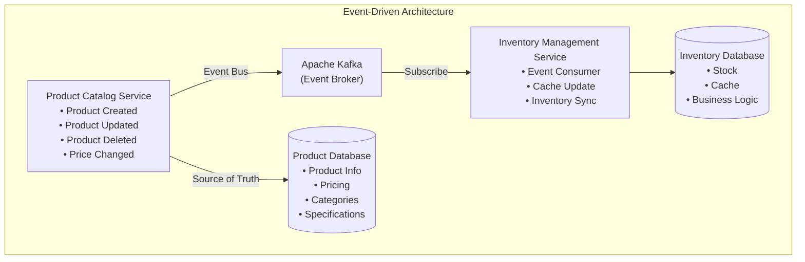
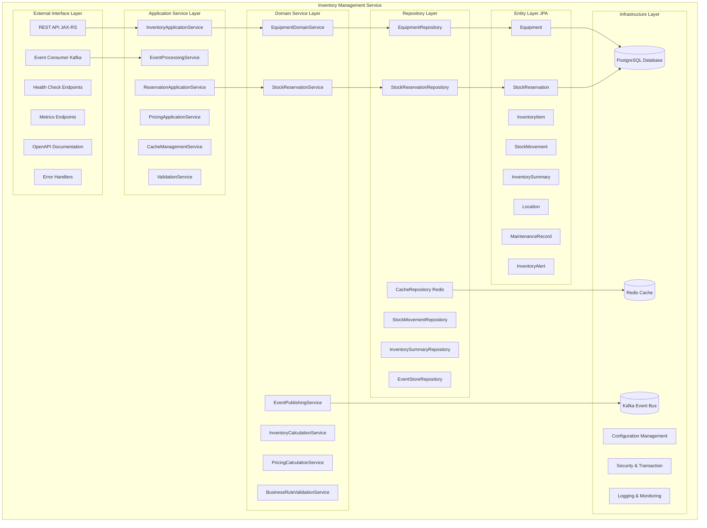
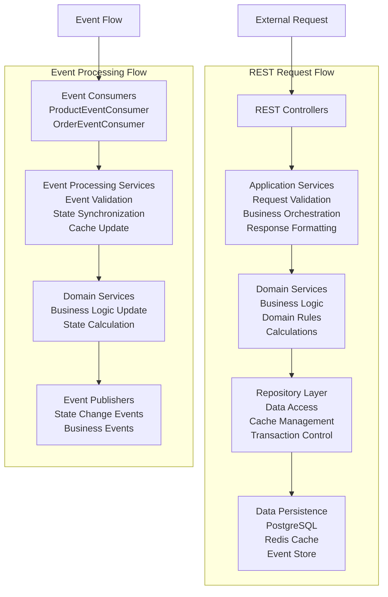
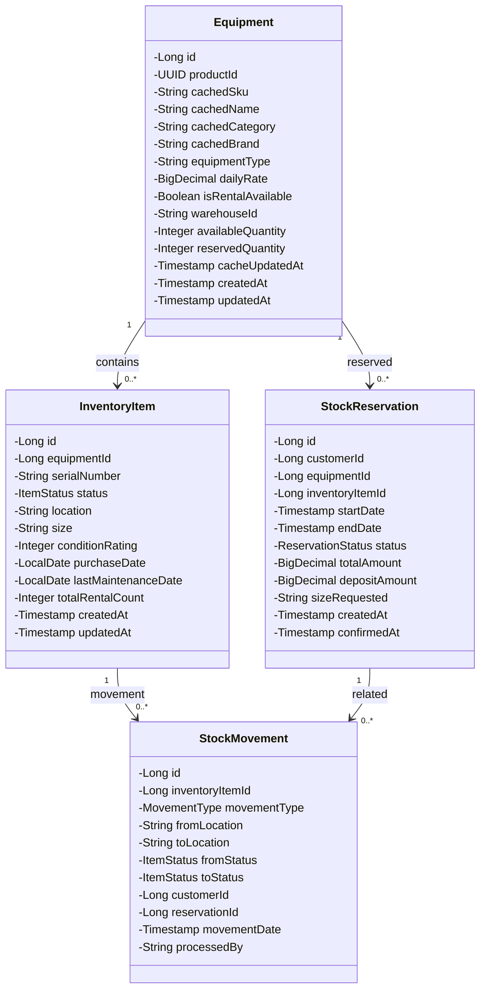
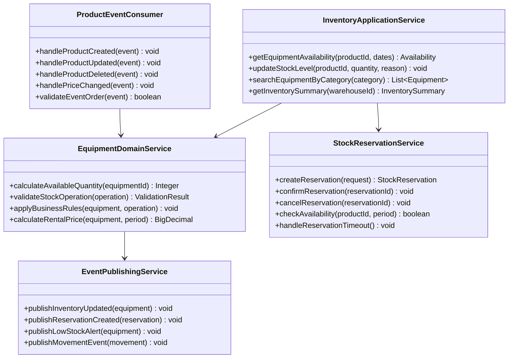
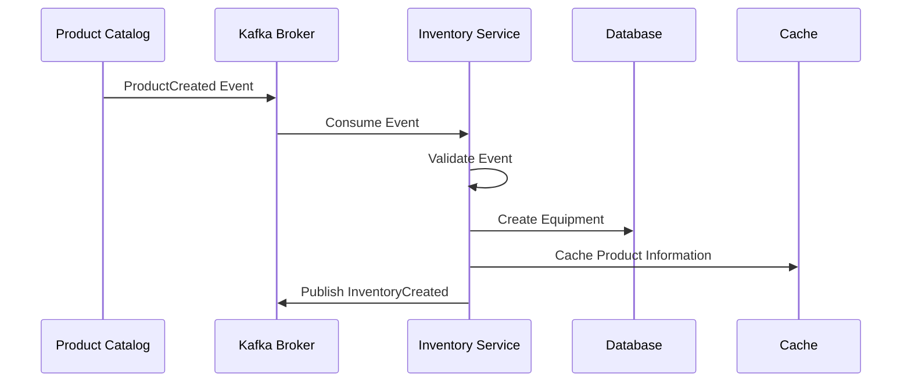
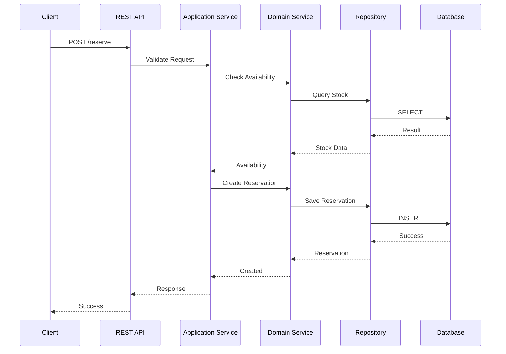
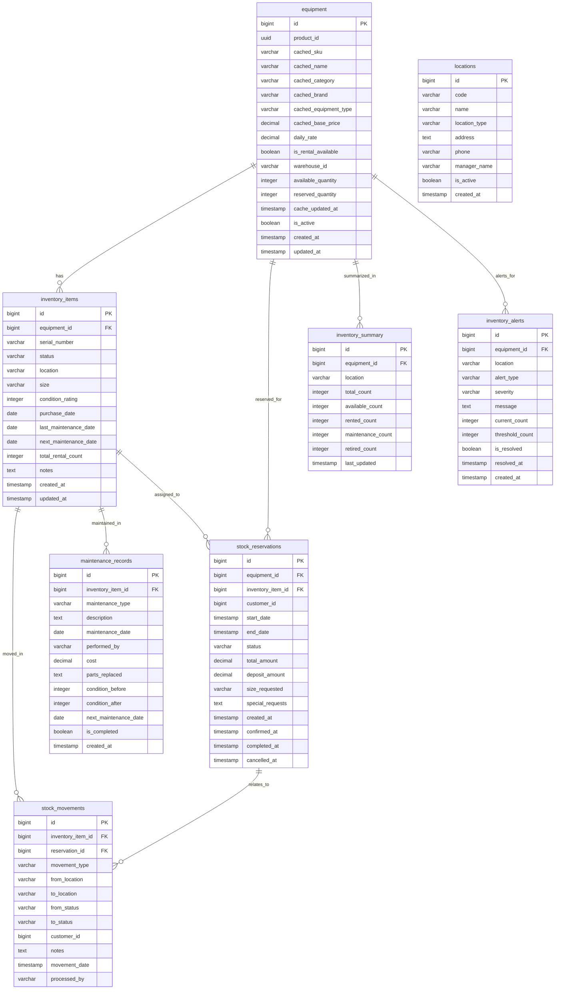

# 在庫管理サービス 詳細設計書

## 1. サービス概要

### 1.1 目的と責任範囲

在庫管理サービス（Inventory Management Service）は、スキーショップの販売・レンタル商品在庫管理を専門的に担当するマイクロサービスです。本サービスは、Event-Driven Architectureを採用することで、Product Catalog Serviceとの疎結合な連携を実現し、データ重複問題を根本的に解決します。

### 1.2 アーキテクチャ原則

- **Single Responsibility Principle**: 在庫管理のみに特化
- **Event-Driven Design**: 非同期イベント処理による疎結合
- **Data Ownership**: 在庫データの唯一の所有者
- **Cache Strategy**: Product Catalogからのイベントベースキャッシュ同期
- **Eventual Consistency**: 最終的整合性の保証

### 1.3 技術スタック

| 技術要素 | 採用技術 | 用途 |
|---------|---------|------|
| フレームワーク | Quarkus 3.8 | 高性能Javaアプリケーション基盤 |
| プログラミング言語 | Java 21 LTS | 最新のJava機能活用 |
| エンタープライズAPI | Jakarta EE 11 | 標準化されたエンタープライズ機能 |
| メインデータベース | PostgreSQL | 在庫データの永続化 |
| キャッシュ | Redis | 高速データアクセスとセッション管理 |
| メッセージング | Apache Kafka | イベントストリーミング |
| 設定管理 | MicroProfile Config | 環境別設定管理 |
| ヘルスチェック | MicroProfile Health | サービス状態監視 |
| メトリクス | MicroProfile Metrics | 性能監視 |
| コンテナ化 | Docker | アプリケーションパッケージング |
| オーケストレーション | Docker Compose | ローカル開発環境 |

## 2. Event-Driven Architecture 設計

### 2.1 アーキテクチャ概要

本サービスは、データ重複問題を解決するため、Product Catalog Serviceを商品情報のSingle Source of Truthとして位置づけ、イベント駆動によるデータ同期を実現します。



### 2.2 データ責任分離設計

| サービス | データ所有権 | 責任範囲 | 保持データ |
|---------|-------------|---------|-----------|
| **Product Catalog Service** | 商品マスタデータ | 商品情報の管理 | • 商品基本情報（名前、SKU、説明）• カテゴリ・ブランド情報• 商品仕様・画像• 基本価格情報 |
| **Inventory Management Service** | 在庫データ | 在庫専門管理 | • 在庫数・在庫場所・在庫状態• レンタル料金（ビジネスロジック）• 予約・移動履歴• 商品情報キャッシュ（イベント同期） |

### 2.3 イベント設計

#### 2.3.1 消費イベント（Incoming Events）

| イベント名 | 送信元 | 内容 | 処理内容 |
|-----------|--------|------|---------|
| `ProductCreatedEvent` | Product Catalog | 新商品作成 | • 新商品の在庫エントリ自動作成 • 初期在庫数0で登録 • 商品キャッシュ情報設定 |
| `ProductUpdatedEvent` | Product Catalog | 商品情報更新 | • キャッシュされた商品情報更新 • 価格変更時の在庫価格同期 • 商品名・SKU変更の反映 |
| `ProductDeletedEvent` | Product Catalog | 商品削除 | • 該当在庫エントリの無効化 • 予約中在庫の適切な処理 • 履歴データの保持 |
| `ProductPriceChangedEvent` | Product Catalog | 価格変更 | • レンタル料金計算への反映 • 既存予約への影響確認 • 価格履歴の記録 |

#### 2.3.2 発行イベント（Outgoing Events）

| イベント名 | 送信先 | 内容 | タイミング |
|-----------|--------|------|----------|
| `InventoryUpdatedEvent` | 全サービス | 在庫数変更 | 在庫増減時 |
| `StockReservationCreatedEvent` | Order Management | 在庫予約作成 | 予約確定時 |
| `StockReservationCancelledEvent` | Order Management | 在庫予約キャンセル | 予約取消時 |
| `LowStockAlertEvent` | Notification Service | 在庫不足警告 | 在庫が閾値を下回った時 |
| `InventoryMovementEvent` | Audit Service | 在庫移動記録 | 在庫移動実行時 |

## 3. 全体アーキテクチャ設計

### 3.1 レイヤードアーキテクチャ



### 3.2 コンポーネント間相互作用



## 4. UML図設計

### 4.1 クラス図

#### 4.1.1 エンティティクラス



#### 4.1.2 サービスクラス



### 4.2 シーケンス図

#### 4.2.1 Product Catalog連携シーケンス



#### 4.2.2 在庫予約シーケンス



## 5. ER図設計

### 5.1 在庫管理データベース設計



### 5.2 データベース制約とインデックス設計

| テーブル | 制約/インデックス | 目的 |
|---------|------------------|------|
| equipment | UNIQUE(product_id) | Product Catalog連携の一意性保証 |
| equipment | INDEX(cached_sku) | SKU検索の高速化 |
| equipment | INDEX(cached_category, warehouse_id) | カテゴリ別検索の最適化 |
| inventory_items | UNIQUE(serial_number) | シリアルナンバーの一意性 |
| inventory_items | INDEX(equipment_id, status) | 在庫状態検索の最適化 |
| stock_reservations | INDEX(customer_id, status) | 顧客別予約検索 |
| stock_reservations | INDEX(start_date, end_date) | 期間検索の最適化 |
| stock_movements | INDEX(movement_date) | 履歴検索の最適化 |
| inventory_summary | UNIQUE(equipment_id, location) | サマリーの一意性保証 |

## 6. RESTful API エンドポイント設計

### 6.1 在庫管理API

| メソッド | エンドポイント | 説明 | パラメータ | レスポンス |
|---------|---------------|------|-----------|-----------|
| GET | `/api/v1/inventory/equipment` | 設備一覧取得 | category, brand, location, page, size | EquipmentListResponse |
| GET | `/api/v1/inventory/equipment/{productId}` | 設備詳細取得 | productId (Path) | EquipmentDetailResponse |
| GET | `/api/v1/inventory/equipment/{productId}/availability` | 在庫可用性確認 | productId, startDate, endDate, quantity | AvailabilityResponse |
| POST | `/api/v1/inventory/equipment/{productId}/stock` | 在庫数更新 | productId, UpdateStockRequest | UpdateStockResponse |
| GET | `/api/v1/inventory/equipment/search` | 設備検索 | sku, name, category, type | EquipmentSearchResponse |
| GET | `/api/v1/inventory/summary/{warehouseId}` | 倉庫別在庫サマリー | warehouseId | InventorySummaryResponse |

### 6.2 予約管理API

| メソッド | エンドポイント | 説明 | パラメータ | レスポンス |
|---------|---------------|------|-----------|-----------|
| POST | `/api/v1/inventory/reservations` | 在庫予約作成 | CreateReservationRequest | ReservationResponse |
| GET | `/api/v1/inventory/reservations/{reservationId}` | 予約詳細取得 | reservationId | ReservationDetailResponse |
| PUT | `/api/v1/inventory/reservations/{reservationId}/confirm` | 予約確定 | reservationId | ConfirmationResponse |
| PUT | `/api/v1/inventory/reservations/{reservationId}/cancel` | 予約キャンセル | reservationId, CancelRequest | CancellationResponse |
| GET | `/api/v1/inventory/reservations/customer/{customerId}` | 顧客別予約一覧 | customerId, status, page | ReservationListResponse |
| GET | `/api/v1/inventory/reservations/order/{orderId}` | 注文別予約一覧 | orderId | OrderReservationResponse |

### 6.3 価格計算API

| メソッド | エンドポイント | 説明 | パラメータ | レスポンス |
|---------|---------------|------|-----------|-----------|
| POST | `/api/v1/inventory/pricing/calculate` | レンタル料金計算 | PricingCalculationRequest | PricingResponse |
| GET | `/api/v1/inventory/pricing/rates/{productId}` | 商品別料金情報 | productId, period | RateInformationResponse |
| POST | `/api/v1/inventory/pricing/bulk-calculate` | 一括料金計算 | BulkPricingRequest | BulkPricingResponse |

### 6.4 在庫移動API

| メソッド | エンドポイント | 説明 | パラメータ | レスポンス |
|---------|---------------|------|-----------|-----------|
| POST | `/api/v1/inventory/movements` | 在庫移動記録 | CreateMovementRequest | MovementResponse |
| GET | `/api/v1/inventory/movements/{itemId}/history` | アイテム履歴取得 | itemId, fromDate, toDate | MovementHistoryResponse |
| GET | `/api/v1/inventory/movements/location/{locationId}` | 場所別移動履歴 | locationId, movementType | LocationMovementResponse |

### 6.5 メンテナンス管理API

| メソッド | エンドポイント | 説明 | パラメータ | レスポンス |
|---------|---------------|------|-----------|-----------|
| POST | `/api/v1/inventory/maintenance` | メンテナンス記録作成 | MaintenanceRecordRequest | MaintenanceResponse |
| GET | `/api/v1/inventory/maintenance/due` | メンテナンス予定一覧 | dueDate, location | MaintenanceDueResponse |
| PUT | `/api/v1/inventory/maintenance/{recordId}/complete` | メンテナンス完了 | recordId, CompletionRequest | CompletionResponse |

### 6.6 監視・管理API

| メソッド | エンドポイント | 説明 | パラメータ | レスポンス |
|---------|---------------|------|-----------|-----------|
| GET | `/api/v1/inventory/health/sync-status` | データ同期状況 | - | SyncStatusResponse |
| POST | `/api/v1/inventory/sync/manual` | 手動同期実行 | SyncRequest | SyncResponse |
| GET | `/api/v1/inventory/alerts` | 在庫アラート一覧 | severity, resolved, page | AlertListResponse |
| PUT | `/api/v1/inventory/alerts/{alertId}/resolve` | アラート解決 | alertId | AlertResolveResponse |

## 7. 実装クラス設計

### 7.1 RESTリソースクラス

#### 7.1.1 InventoryResource

| メソッド | 説明 | パラメータ | 戻り値 | ビジネスロジック |
|---------|------|-----------|--------|-----------------|
| getEquipmentList | 設備一覧取得 | QueryParams | Response EquipmentListResponse | カテゴリ・ブランド・場所によるフィルタリング、ページネーション処理 |
| getEquipmentDetail | 設備詳細取得 | productId | Response EquipmentDetailResponse | 商品ID指定での詳細情報取得、キャッシュ情報含む |
| checkAvailability | 在庫可用性確認 | productId, period, quantity | Response AvailabilityResponse | 指定期間での在庫確認、予約済み数量考慮 |
| updateStock | 在庫数更新 | productId, request | Response UpdateStockResponse | 在庫増減処理、移動履歴記録、イベント発行 |
| searchEquipment | 設備検索 | SearchCriteria | Response SearchResponse | 複数条件での設備検索、あいまい検索対応 |
| getInventorySummary | 在庫サマリー取得 | warehouseId | Response SummaryResponse | 倉庫別在庫状況の集計情報取得 |

#### 7.1.2 ReservationResource

| メソッド | 説明 | パラメータ | 戻り値 | ビジネスロジック |
|---------|------|-----------|--------|-----------------|
| createReservation | 在庫予約作成 | ReservationRequest | Response ReservationResponse | 在庫可用性確認、予約エントリ作成、在庫引当 |
| getReservationDetail | 予約詳細取得 | reservationId | Response ReservationDetail | 予約情報とアイテム詳細の取得 |
| confirmReservation | 予約確定 | reservationId | Response ConfirmationResponse | 予約状態更新、在庫確定、確定イベント発行 |
| cancelReservation | 予約キャンセル | reservationId, reason | Response CancellationResponse | 予約取消、在庫解放、キャンセルイベント発行 |
| getCustomerReservations | 顧客別予約一覧 | customerId, filters | Response ReservationList | 顧客の予約履歴取得、状態フィルタリング |
| getOrderReservations | 注文別予約一覧 | orderId | Response OrderReservations | 注文に紐づく全予約の取得 |

#### 7.1.3 PricingResource

| メソッド | 説明 | パラメータ | 戻り値 | ビジネスロジック |
|---------|------|-----------|--------|-----------------|
| calculatePrice | 料金計算 | PricingRequest | Response PricingResponse | 期間・数量・割引を考慮した料金計算 |
| getRateInformation | 料金情報取得 | productId, period | Response RateInfo | 商品別の料金体系情報取得 |
| bulkCalculatePrice | 一括料金計算 | BulkPricingRequest | Response BulkPricing | 複数商品の一括料金計算 |

### 7.2 アプリケーションサービスクラス

#### 7.2.1 InventoryApplicationService

| メソッド | 説明 | パラメータ | 戻り値 | 責任 |
|---------|------|-----------|--------|------|
| getEquipmentAvailability | 在庫可用性確認 | productId, dates, quantity | AvailabilityResult | 在庫状況の総合判定、予約可能性確認 |
| updateStockLevel | 在庫レベル更新 | productId, quantity, reason | void | 在庫数変更、履歴記録、イベント発行の調整 |
| searchEquipmentByCriteria | 条件別設備検索 | SearchCriteria | List Equipment | 複合検索条件での設備抽出 |
| getInventorySummary | 在庫サマリー取得 | warehouseId | InventorySummary | 在庫状況の集計とサマリー生成 |
| validateInventoryOperation | 在庫操作検証 | Operation | ValidationResult | 在庫操作の妥当性検証 |
| handleLowStockAlert | 在庫不足処理 | productId | void | 在庫不足時のアラート処理 |

#### 7.2.2 ReservationApplicationService

| メソッド | 説明 | パラメータ | 戻り値 | 責任 |
|---------|------|-----------|--------|------|
| processReservationRequest | 予約処理 | ReservationRequest | ReservationResult | 予約作成の全体プロセス管理 |
| confirmReservation | 予約確定処理 | reservationId | void | 予約確定とそれに伴う処理の調整 |
| cancelReservation | 予約キャンセル処理 | reservationId, reason | void | 予約取消とリソース解放の管理 |
| handleReservationTimeout | 予約タイムアウト処理 | - | void | 期限切れ予約の自動処理 |
| calculateReservationCost | 予約費用計算 | reservation | CostCalculation | 予約に関する総費用の計算 |

#### 7.2.3 EventProcessingService

| メソッド | 説明 | パラメータ | 戻り値 | 責任 |
|---------|------|-----------|--------|------|
| handleProductCreatedEvent | 商品作成イベント処理 | ProductCreatedEvent | void | 新商品の在庫エントリ作成 |
| handleProductUpdatedEvent | 商品更新イベント処理 | ProductUpdatedEvent | void | 商品情報キャッシュの更新 |
| handleProductDeletedEvent | 商品削除イベント処理 | ProductDeletedEvent | void | 商品削除時の在庫処理 |
| validateEventSequence | イベント順序検証 | Event | boolean | イベントの順序性確認 |
| updateProductCache | 商品キャッシュ更新 | productInfo | void | キャッシュされた商品情報の更新 |

### 7.3 ドメインサービスクラス

#### 7.3.1 EquipmentDomainService

| メソッド | 説明 | パラメータ | 戻り値 | ビジネスロジック |
|---------|------|-----------|--------|-----------------|
| calculateAvailableQuantity | 利用可能数量計算 | equipmentId, period | Integer | 総在庫数 - 予約済み数 - メンテナンス中 |
| validateStockOperation | 在庫操作検証 | operation | ValidationResult | 在庫操作の妥当性とビジネスルール確認 |
| applyBusinessRules | ビジネスルール適用 | equipment, operation | void | 設備タイプ別のビジネスルール適用 |
| calculateRentalPrice | レンタル価格計算 | equipment, period, quantity | BigDecimal | 期間・数量を考慮した価格計算 |
| determineMaintenanceSchedule | メンテナンス予定決定 | equipment | MaintenanceSchedule | 使用頻度に基づくメンテナンス計画 |
| assessConditionRating | 状態評価 | equipment, usage | Integer | 使用状況に基づく設備状態評価 |

#### 7.3.2 StockReservationService

| メソッド | 説明 | パラメータ | 戻り値 | ビジネスロジック |
|---------|------|-----------|--------|-----------------|
| createReservation | 予約作成 | request | StockReservation | 在庫確認と予約エントリ作成 |
| confirmReservation | 予約確定 | reservationId | void | 予約状態変更と在庫確定 |
| cancelReservation | 予約キャンセル | reservationId | void | 予約取消と在庫解放 |
| checkAvailability | 在庫確認 | productId, period, quantity | boolean | 指定条件での在庫可用性確認 |
| handleReservationTimeout | タイムアウト処理 | - | void | 期限切れ予約の自動キャンセル |
| calculateDeposit | デポジット計算 | reservation | BigDecimal | 予約内容に基づくデポジット額計算 |

#### 7.3.3 PricingCalculationService

| メソッド | 説明 | パラメータ | 戻り値 | ビジネスロジック |
|---------|------|-----------|--------|-----------------|
| calculateRentalPrice | レンタル料金計算 | product, period, quantity | BigDecimal | 基本料金 × 期間 × 数量 + 割増 |
| applySeasonalAdjustment | 季節調整適用 | basePrice, date | BigDecimal | 季節による価格調整（スキーシーズン） |
| calculateBulkDiscount | 一括割引計算 | items, quantity | BigDecimal | 複数アイテム・大量レンタル割引 |
| applyPromotionalDiscount | プロモーション割引適用 | price, promotions | BigDecimal | クーポン・キャンペーン割引適用 |
| calculateInsuranceFee | 保険料計算 | equipment, period | BigDecimal | 設備価値と期間に基づく保険料 |

### 7.4 リポジトリクラス

#### 7.4.1 EquipmentRepository

| メソッド | 説明 | パラメータ | 戻り値 | データアクセス |
|---------|------|-----------|--------|---------------|
| findByProductId | 商品ID検索 | productId | Optional Equipment | product_id による単一検索 |
| findByCachedSku | SKU検索 | sku | Optional Equipment | cached_sku による検索 |
| findByCategory | カテゴリ検索 | category, pageable | Page Equipment | カテゴリ別ページネーション検索 |
| findAvailableByWarehouse | 倉庫別在庫検索 | warehouseId | List Equipment | 利用可能在庫のみ抽出 |
| updateStockQuantity | 在庫数更新 | equipmentId, quantity | void | 在庫数の原子的更新 |
| findLowStockItems | 在庫不足検索 | threshold | List\<Equipment\> | 閾値以下の在庫抽出 |

#### 7.4.2 StockReservationRepository

| メソッド | 説明 | パラメータ | 戻り値 | データアクセス |
|---------|------|-----------|--------|---------------|
| findByCustomerId | 顧客別検索 | customerId, pageable | Page StockReservation | 顧客の予約履歴検索 |
| findByOrderId | 注文別検索 | orderId | List StockReservation | 注文に紐づく予約検索 |
| findActiveReservations | アクティブ予約検索 | equipmentId, period | List StockReservation | 指定期間のアクティブ予約 |
| findExpiredReservations | 期限切れ検索 | cutoffDate | List StockReservation | 期限切れ予約の抽出 |
| updateReservationStatus | 予約状態更新 | reservationId, status | void | 予約状態の更新 |

#### 7.4.3 StockMovementRepository

| メソッド | 説明 | パラメータ | 戻り値 | データアクセス |
|---------|------|-----------|--------|---------------|
| findByInventoryItemId | アイテム別履歴 | itemId, pageable | Page StockMovement | アイテムの移動履歴 |
| findByLocation | 場所別履歴 | location, period | List StockMovement | 場所別の移動記録 |
| findByMovementType | タイプ別検索 | type, period | List StockMovement | 移動タイプ別の履歴 |
| createMovementRecord | 移動記録作成 | movement | StockMovement | 移動履歴の記録 |

### 7.5 イベント処理クラス

#### 7.5.1 ProductEventConsumer

| メソッド | 説明 | パラメータ | 戻り値 | イベント処理 |
|---------|------|-----------|--------|-------------|
| handleProductCreated | 商品作成処理 | ProductCreatedEvent | void | 新商品の在庫エントリ自動生成 |
| handleProductUpdated | 商品更新処理 | ProductUpdatedEvent | void | 商品情報のキャッシュ更新 |
| handleProductDeleted | 商品削除処理 | ProductDeletedEvent | void | 商品削除時の在庫無効化 |
| handlePriceChanged | 価格変更処理 | PriceChangedEvent | void | 価格変更の反映と履歴記録 |
| validateEventOrder | イベント順序検証 | event | boolean | イベントの重複・順序チェック |

#### 7.5.2 EventPublishingService

| メソッド | 説明 | パラメータ | 戻り値 | イベント発行 |
|---------|------|-----------|--------|-------------|
| publishInventoryUpdated | 在庫更新イベント | equipment | void | 在庫変更の通知イベント発行 |
| publishReservationCreated | 予約作成イベント | reservation | void | 予約作成の通知イベント発行 |
| publishLowStockAlert | 在庫不足アラート | equipment | void | 在庫不足警告イベント発行 |
| publishMovementEvent | 移動イベント | movement | void | 在庫移動の記録イベント発行 |
| publishMaintenanceScheduled | メンテナンス予定 | maintenance | void | メンテナンス予定通知 |

## 8. Product Catalog Service連携設計

### 8.1 連携アーキテクチャ

Product Catalog Serviceとの連携は、Event-Driven Architectureに基づき、以下の原則で設計されています：

1. **Single Source of Truth**: Product Catalog Serviceが商品情報の唯一の真実源
2. **Eventually Consistent**: 最終的整合性による疎結合な連携
3. **Event-Based Synchronization**: Kafkaを通じたリアルタイム同期
4. **Cached Data Strategy**: 商品情報のローカルキャッシュ戦略

### 8.2 イベント連携フロー

#### 8.2.1 商品作成時の連携

```text
1. Product Catalog Serviceで新商品作成
   ↓
2. ProductCreatedEventがKafkaに発行
   ↓
3. Inventory Serviceがイベントを受信
   ↓
4. 以下の処理を自動実行：
   - Equipment エンティティの作成
   - product_id の設定
   - 商品情報のキャッシュフィールド設定
   - 初期在庫数 0 で登録
   - daily_rate の初期値設定
   - warehouse_id のデフォルト設定
```

#### 8.2.2 商品更新時の連携

```text
1. Product Catalog Serviceで商品情報更新
   ↓
2. ProductUpdatedEventがKafkaに発行
   ↓
3. Inventory Serviceがイベントを受信
   ↓
4. 以下のキャッシュフィールドを更新：
   - cached_sku
   - cached_name
   - cached_category
   - cached_brand
   - cached_equipment_type
   - cached_base_price
   - cache_updated_at
```

#### 8.2.3 商品削除時の連携

```text
1. Product Catalog Serviceで商品削除
   ↓
2. ProductDeletedEventがKafkaに発行
   ↓
3. Inventory Serviceがイベントを受信
   ↓
4. 以下の処理を実行：
   - Equipment の is_active を false に設定
   - アクティブな予約の適切な処理
   - 在庫数を 0 に設定
   - 削除イベントの記録
```

### 8.3 データ整合性保証

#### 8.3.1 イベント順序保証

- Kafkaパーティションキーに product_id を使用
- イベントタイムスタンプによる順序検証
- 重複イベントの除外機能
- 欠損イベントの検出とリカバリ

#### 8.3.2 キャッシュ整合性管理

| フィールド | 更新タイミング | 整合性チェック |
|-----------|---------------|---------------|
| cached_sku | ProductUpdatedEvent受信時 | SKU重複チェック |
| cached_name | ProductUpdatedEvent受信時 | 文字数制限チェック |
| cached_category | ProductUpdatedEvent受信時 | カテゴリマスタ照合 |
| cached_brand | ProductUpdatedEvent受信時 | ブランドマスタ照合 |
| cached_equipment_type | ProductUpdatedEvent受信時 | 設備タイプ検証 |
| cached_base_price | PriceChangedEvent受信時 | 価格妥当性チェック |

### 8.4 連携エラー処理

#### 8.4.1 エラーハンドリング戦略

1. **リトライ機構**: 一時的なエラーに対する自動リトライ
2. **Dead Letter Queue**: 処理不可能なイベントの保存
3. **手動同期機能**: 管理者による強制同期
4. **アラート機能**: 同期エラーの即座通知

#### 8.4.2 データ修復機能

| 機能 | 説明 | 実行方法 |
|------|------|---------|
| 差分同期 | Product Catalogとの差分検出・修復 | `/api/v1/inventory/sync/differential` |
| 全体同期 | 全商品情報の再同期 | `/api/v1/inventory/sync/full` |
| 個別同期 | 特定商品の同期 | `/api/v1/inventory/sync/product/{productId}` |
| 整合性チェック | データ整合性の検証 | `/api/v1/inventory/sync/validate` |

## 9. 在庫管理操作の具体的実装

### 9.1 在庫数の新規設定

在庫数の新規設定は、新しい商品に対する初期在庫設定と、既存商品への在庫追加の2つのケースがあります。

#### 9.1.1 新商品の初期在庫設定

```text
1. Product Catalog ServiceからProductCreatedEventを受信
   ↓
2. ProductEventConsumerがイベント処理
   ↓
3. EquipmentDomainServiceで新規Equipment作成
   - product_id: イベントから取得
   - available_quantity: 0（初期値）
   - reserved_quantity: 0（初期値）
   - daily_rate: カテゴリ別デフォルト料金
   - warehouse_id: デフォルト倉庫
   ↓
4. 管理者が在庫管理画面で初期在庫数を設定
   ↓
5. POST /api/v1/inventory/equipment/{productId}/stock
   - quantity: 追加在庫数
   - reason: "INITIAL_STOCK"
   - warehouse_id: 配置倉庫
   ↓
6. InventoryApplicationServiceで処理
   - 在庫数の更新（available_quantity += quantity）
   - StockMovementの記録作成
   - InventoryUpdatedEventの発行
```

#### 9.1.2 既存商品への在庫追加

```text
1. 管理者が在庫追加操作を実行
   ↓
2. POST /api/v1/inventory/equipment/{productId}/stock
   Request Body:
   {
     "quantity": 10,
     "reason": "PURCHASE",
     "warehouseId": "warehouse-001",
     "unitCost": 85000,
     "supplier": "メーカーA",
     "notes": "冬季シーズン用追加仕入れ"
   }
   ↓
3. InventoryApplicationService.updateStockLevel実行
   - 商品存在確認
   - 倉庫存在確認
   - 数量妥当性検証
   ↓
4. EquipmentDomainService.validateStockOperation実行
   - ビジネスルール適用
   - 在庫上限チェック
   - 季節性考慮
   ↓
5. EquipmentRepository.updateStockQuantity実行
   - available_quantity の原子的更新
   - 楽観的ロックによる同時実行制御
   ↓
6. StockMovementRepository.createMovementRecord実行
   - 移動履歴の詳細記録
   - 仕入れ情報の保存
   ↓
7. EventPublishingService.publishInventoryUpdated実行
   - 在庫更新イベントの発行
   - 他サービスへの通知
```

### 9.2 在庫数の変更

在庫数の変更には、増加・減少・調整の3つの操作があります。

#### 9.2.1 在庫調整（棚卸し結果反映）

```text
1. 棚卸し実施後の差異調整
   ↓
2. POST /api/v1/inventory/equipment/{productId}/stock
   Request Body:
   {
     "quantity": -3,  // 減少の場合は負の値
     "reason": "INVENTORY_ADJUSTMENT",
     "warehouseId": "warehouse-001",
     "notes": "2024年12月棚卸しによる調整"
   }
   ↓
3. 調整処理の実行
   - 現在在庫数の確認
   - 調整後在庫数の妥当性チェック
   - 予約済み在庫との整合性確認
   ↓
4. 在庫数更新とアラート処理
   - available_quantity の更新
   - 在庫不足アラートの生成（必要時）
   - 在庫過多アラートの生成（必要時）
```

#### 9.2.2 在庫移動（倉庫間転送）

```text
1. 倉庫間在庫移動の実行
   ↓
2. POST /api/v1/inventory/movements
   Request Body:
   {
     "productId": "product-uuid",
     "quantity": 5,
     "fromWarehouseId": "warehouse-001",
     "toWarehouseId": "warehouse-002",
     "reason": "WAREHOUSE_TRANSFER",
     "requestedBy": "staff-001"
   }
   ↓
3. 移動可能性の検証
   - 移動元在庫数の確認
   - 移動先倉庫容量の確認
   - 移動中在庫の考慮
   ↓
4. 段階的在庫更新
   - 移動元: available_quantity -= quantity
   - 移動記録: status = "IN_TRANSIT"
   - 移動先: 移動完了後に += quantity
```

### 9.3 在庫数の削除（廃棄処理）

在庫の削除は物理的な削除ではなく、状態変更による論理削除で実装されます。

#### 9.3.1 設備廃棄処理

```text
1. 管理者が廃棄対象設備を選択
   ↓
2. PUT /api/v1/inventory/equipment/{productId}/retire
   Request Body:
   {
     "quantity": 2,
     "reason": "DAMAGE",
     "condition": "設備老朽化により使用不可",
     "disposalMethod": "リサイクル業者引き取り",
     "approvedBy": "manager-001"
   }
   ↓
3. 廃棄可能性の検証
   - 予約済み在庫でないことの確認
   - レンタル中でないことの確認
   - 廃棄権限の確認
   ↓
4. 状態更新処理
   - available_quantity -= quantity
   - retired_quantity += quantity（新規フィールド）
   - 個別アイテムのstatus = "RETIRED"
   ↓
5. 廃棄記録の作成
   - StockMovementに廃棄記録
   - MaintenanceRecordに廃棄理由記録
   - 会計システムへの廃棄通知
```

### 9.4 在庫数の取得

在庫数の取得は、リアルタイム性と性能のバランスを考慮した多層的な実装になります。

#### 9.4.1 商品別在庫状況取得

```text
1. クライアントが在庫状況を要求
   ↓
2. GET /api/v1/inventory/equipment/{productId}/availability
   Query Parameters:
   - startDate: 2024-12-20
   - endDate: 2024-12-27
   - warehouseId: warehouse-001
   ↓
3. キャッシュ確認（Redis）
   - キー: "inventory:availability:{productId}:{warehouseId}"
   - TTL: 300秒
   ↓
4. キャッシュヒットの場合
   - Redis から即座にレスポンス
   ↓
5. キャッシュミスの場合
   - EquipmentRepository.findByProductId実行
   - StockReservationRepository.findActiveReservations実行
   - 利用可能数量の計算実行
   ↓
6. レスポンス生成
   {
     "productId": "product-uuid",
     "totalQuantity": 15,
     "availableQuantity": 12,
     "reservedQuantity": 3,
     "maintenanceQuantity": 0,
     "availabilityByDate": [
       {
         "date": "2024-12-20",
         "availableQuantity": 12
       },
       ...
     ],
     "nextAvailableDate": "2024-12-20",
     "warehouseInfo": {
       "warehouseId": "warehouse-001",
       "warehouseName": "メイン倉庫A"
     }
   }
```

#### 9.4.2 在庫一覧取得（管理者用）

```text
1. 管理者が在庫管理画面を表示
   ↓
2. GET /api/v1/inventory/equipment
   Query Parameters:
   - category: SKI_BOARD
   - brand: Rossignol
   - warehouseId: warehouse-001
   - page: 0
   - size: 20
   - sort: availableQuantity,desc
   ↓
3. 検索条件の構築
   - カテゴリフィルタの適用
   - ブランドフィルタの適用
   - 倉庫フィルタの適用
   - ソート条件の適用
   ↓
4. データベース検索実行
   - EquipmentRepository.findByCategory実行
   - ページネーション処理
   - 関連するInventorySummaryの取得
   ↓
5. レスポンス生成
   {
     "content": [
       {
         "productId": "product-uuid-1",
         "sku": "ski-rossignol-x1",
         "name": "Rossignol Hero Athlete FIS GS",
         "category": "SKI_BOARD",
         "brand": "Rossignol",
         "totalQuantity": 15,
         "availableQuantity": 12,
         "reservedQuantity": 3,
         "dailyRate": 8900,
         "warehouseLocation": "メイン倉庫A",
         "lastUpdated": "2024-12-15T10:30:00Z",
         "alertLevel": "NORMAL"
       }
     ],
     "pageable": {
       "page": 0,
       "size": 20,
       "totalElements": 45,
       "totalPages": 3
     }
   }
```

### 9.5 予約管理との連携

在庫管理サービスは、予約システムと密接に連携して在庫の可用性を管理します。

#### 9.5.1 在庫予約処理

```text
1. 顧客がレンタル予約を申し込み
   ↓
2. POST /api/v1/inventory/reservations
   Request Body:
   {
     "customerId": "customer-uuid",
     "productId": "product-uuid",
     "startDate": "2024-12-20T09:00:00Z",
     "endDate": "2024-12-27T18:00:00Z",
     "quantity": 2,
     "sizeRequested": "170cm",
     "specialRequests": "新品希望"
   }
   ↓
3. 在庫可用性の詳細確認
   - ReservationApplicationService.processReservationRequest実行
   - StockReservationService.checkAvailability実行
   - 期間重複チェック
   - 数量充足チェック
   ↓
4. 予約作成と在庫引当
   - StockReservationエンティティ作成
   - Equipment.reserved_quantity += quantity
   - Equipment.available_quantity -= quantity
   ↓
5. 一時予約タイムアウト設定
   - 30分間の確定待ち状態
   - タイムアウト後の自動キャンセル処理
   ↓
6. 予約確定処理
   - 決済完了後の予約確定
   - 具体的な設備アイテムの割り当て
   - 顧客への確定通知
```

#### 9.5.2 予約キャンセルと在庫解放

```text
1. 顧客または管理者が予約をキャンセル
   ↓
2. PUT /api/v1/inventory/reservations/{reservationId}/cancel
   Request Body:
   {
     "reason": "CUSTOMER_REQUEST",
     "refundAmount": 15000,
     "notes": "顧客都合によるキャンセル"
   }
   ↓
3. キャンセル可能性の確認
   - 予約状態の確認
   - キャンセル規定の適用
   - レンタル開始前の確認
   ↓
4. 在庫解放処理
   - Equipment.reserved_quantity -= quantity
   - Equipment.available_quantity += quantity
   - StockReservation.status = "CANCELLED"
   ↓
5. 関連処理の実行
   - 返金処理の開始
   - 顧客への通知
   - 在庫解放イベント発行
```

### 9.6 メンテナンス管理との連携

設備のメンテナンスは在庫の可用性に直接影響するため、密接な連携が必要です。

#### 9.6.1 メンテナンス予定管理

```text
1. システムが自動的にメンテナンス予定を判定
   ↓
2. EquipmentDomainService.determineMaintenanceSchedule実行
   - total_rental_count による判定
   - last_maintenance_date からの経過日数
   - condition_rating の評価
   ↓
3. メンテナンス予定の作成
   - MaintenanceRecord作成（is_completed = false）
   - next_maintenance_date の設定
   - メンテナンス優先度の算出
   ↓
4. 在庫への影響計算
   - メンテナンス期間中の利用不可設定
   - 代替在庫の確保確認
   - 予約への影響評価
```

このように、在庫管理サービスは Product Catalog Service との Event-Driven な連携により、データの重複を避けながら在庫情報を効率的に管理し、レンタル業務に必要な全ての在庫操作を提供します。各操作は適切なビジネスロジックと整合性チェックを含み、リアルタイムでの在庫状況の把握と最適な在庫配分を実現します。

## 10. 同時アクセス制御と在庫競合処理

### 10.1 同時購入リクエストに対する制御設計

在庫数が少ない商品に対する同時購入リクエストは、在庫管理サービスで適切に制御する必要があります。

#### 10.1.1 責任分離原則

| サービス | 責任範囲 | 実装内容 |
|---------|---------|---------|
| **Order Management Service** | 注文プロセス管理 | 在庫予約要求の送信、予約失敗時の顧客対応、注文キャンセル時の解放要求 |
| **Inventory Management Service** | 在庫データ整合性 | 原子的在庫操作、同時アクセス制御、予約タイムアウト管理、競合状態の解決 |

#### 10.1.2 同時アクセス制御の実装方式

```text
【シナリオ: 在庫1個に対する同時購入要求】

1. 顧客A・Bが同時に購入リクエスト
   ↓
2. Order Management Service → Inventory Management Service
   POST /api/v1/inventory/reservations (並行実行)
   ↓
3. Inventory Management Service での処理:
   
   ≪楽観的ロック制御≫
   a) Equipment エンティティのversion_fieldで楽観的ロック
   b) available_quantity のCAS（Compare-And-Swap）操作
   c) 先着順での在庫確保
   ↓
4. 処理結果:
   - 先着者: 予約成功 (200 OK)
   - 後着者: 在庫不足エラー (409 Conflict)
   ↓
5. Order Management Service での後処理:
   - 成功: 注文処理継続
   - 失敗: 顧客への在庫不足通知
```

#### 10.1.3 データベースレベルの制御

##### Equipment テーブル設計拡張

```sql
ALTER TABLE equipment ADD COLUMN version_field BIGINT DEFAULT 1;
ALTER TABLE equipment ADD CONSTRAINT check_available_quantity 
    CHECK (available_quantity >= 0);
ALTER TABLE equipment ADD CONSTRAINT check_reserved_quantity 
    CHECK (reserved_quantity >= 0);
CREATE INDEX CONCURRENTLY idx_equipment_product_version 
    ON equipment(product_id, version_field);
```

##### 原子的更新クエリ

```sql
-- 在庫予約の原子的実行
UPDATE equipment 
SET available_quantity = available_quantity - ?,
    reserved_quantity = reserved_quantity + ?,
    version_field = version_field + 1,
    updated_at = CURRENT_TIMESTAMP
WHERE product_id = ? 
  AND version_field = ?
  AND available_quantity >= ?;
  
-- 影響行数が0の場合は競合発生
```

### 10.2 実装クラスの拡張

#### 10.2.1 StockReservationService の拡張

| メソッド | 説明 | 戻り値 | 同時制御実装 |
|---------|------|--------|-------------|
| `createReservationWithConcurrencyControl` | 競合制御付き予約作成 | `ReservationResult` | 楽観的ロック + リトライ機構 |
| `handleConcurrencyConflict` | 競合状態の処理 | `ConflictResolution` | 代替在庫提案・待機リスト追加 |
| `validateAvailabilityAtomic` | 原子的在庫確認 | `boolean` | CAS操作による確認 |

#### 10.2.2 EquipmentRepository の拡張

| メソッド | 説明 | 戻り値 | 実装詳細 |
|---------|------|--------|---------|
| `reserveStockAtomic` | 原子的在庫予約 | `int` (影響行数) | 楽観的ロック付きUPDATE |
| `findByProductIdForUpdate` | 排他ロック付き取得 | `Equipment` | SELECT FOR UPDATE |
| `updateStockWithVersion` | バージョン制御付き更新 | `boolean` | バージョンチェック付きUPDATE |

#### 10.2.3 競合処理フロー

```text
【Inventory Management Service内の処理フロー】

1. POST /api/v1/inventory/reservations 受信
   ↓
2. ReservationApplicationService.processReservationRequest
   ↓
3. StockReservationService.createReservationWithConcurrencyControl
   ├─ 楽観的ロック取得
   ├─ 在庫数確認
   ├─ 原子的更新実行
   └─ 競合検出時のリトライ (最大3回)
   ↓
4. 結果レスポンス:
   ■ 成功: ReservationCreated (201)
   ■ 在庫不足: StockUnavailable (409)
   ■ 一時的競合: TemporaryUnavailable (503)
   ↓
5. イベント発行:
   - 成功時: StockReservationCreatedEvent
   - 失敗時: StockReservationFailedEvent
```

### 10.3 エラーハンドリング戦略

#### 10.3.1 競合エラーレスポンス設計

```json
{
  "error": "STOCK_CONFLICT",
  "message": "在庫が他の顧客により確保されました",
  "errorCode": "INV_409_CONCURRENT_RESERVATION",
  "suggestions": [
    {
      "type": "ALTERNATIVE_PRODUCT",
      "productId": "alternative-uuid",
      "message": "類似商品をご提案します"
    },
    {
      "type": "WAITLIST",
      "estimatedAvailability": "2024-12-25T10:00:00Z",
      "message": "キャンセル待ちリストへの登録が可能です"
    }
  ],
  "timestamp": "2024-12-20T14:30:00Z"
}
```

#### 10.3.2 Order Management Service側の対応

##### 推奨実装パターン

```java
// Order Management Service での実装例
@Service
public class OrderProcessingService {
    
    public OrderResult processOrder(OrderRequest request) {
        try {
            // 在庫予約要求
            ReservationResult reservation = inventoryClient
                .reserveStock(request.getProductId(), request.getQuantity());
            
            if (reservation.isSuccess()) {
                return proceedWithOrder(request, reservation);
            } else {
                return handleStockUnavailable(request, reservation);
            }
            
        } catch (StockConflictException e) {
            // 競合状態の処理
            return handleConcurrencyConflict(request, e);
        }
    }
    
    private OrderResult handleConcurrencyConflict(
            OrderRequest request, StockConflictException e) {
        
        // 1. 顧客への通知
        notificationService.notifyStockConflict(
            request.getCustomerId(), e.getSuggestions());
        
        // 2. 代替提案の処理
        if (e.hasAlternatives()) {
            return proposeAlternatives(request, e.getAlternatives());
        }
        
        // 3. 待機リストへの追加
        return addToWaitlist(request);
    }
}
```

### 10.4 性能最適化

#### 10.4.1 Redis を使用した分散ロック

```text
【高負荷時の追加制御】

1. Redis分散ロック併用
   Key: "inventory:lock:{productId}"
   TTL: 30秒
   ↓
2. ロック取得成功時のみDB操作実行
   ↓
3. 処理完了後のロック解放
   ↓
4. ロック取得失敗時は即座にエラーレスポンス
```

#### 10.4.2 キューイングシステム

```text
【大量同時アクセス対策】

1. 在庫予約要求をKafkaキューに投入
   ↓
2. 単一コンシューマによる順次処理
   ↓
3. 処理結果の非同期通知
   ↓
4. Order Management Serviceでの結果ハンドリング
```

この設計により、在庫の同時アクセス問題を効果的に解決し、データ整合性を保証しながら優れたユーザー体験を提供できます。
