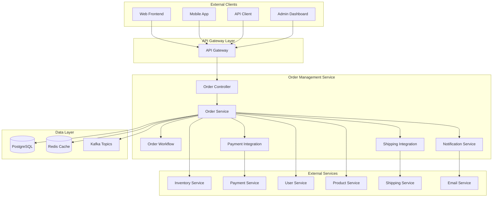
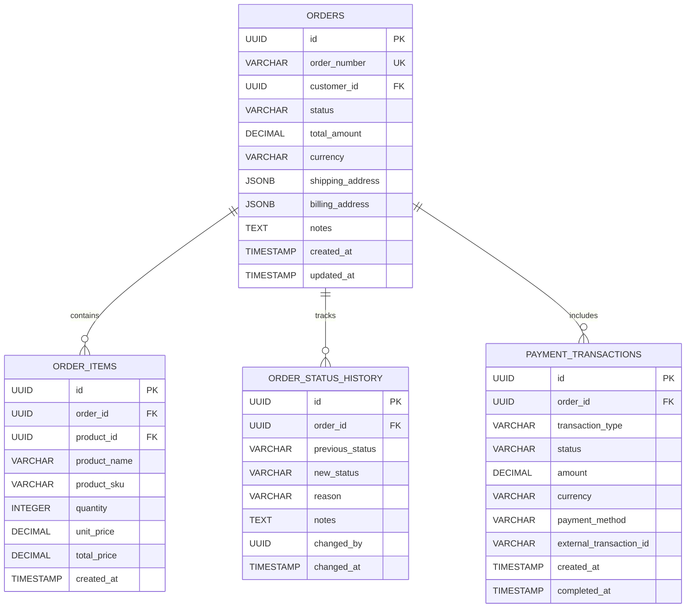

# Order Management Service 詳細設計書

## 目次

1. [概要](#概要)
2. [技術仕様](#技術仕様)
3. [アーキテクチャ設計](#アーキテクチャ設計)
4. [API設計](#api-design)
5. [データベース設計](#database-design)
6. [注文処理設計](#order-processing-design)
7. [注文履歴設計](#order-history-design)
8. [エラー処理](#error-handling)
9. [テスト設計](#テスト設計)
10. [ローカル開発環境](#ローカル開発環境)
11. [本番デプロイメント](#本番デプロイメント)
12. [監視・運用](#監視運用)
13. [障害対応](#障害対応)

## 概要

### サービス概要

Order Management Serviceは、スキー用品販売ショップサイトの注文管理機能を担当するマイクロサービスです。注文の作成、処理、追跡、履歴管理など、注文に関する全ての機能を提供します。

### 主要責務

- **注文処理**: 注文の作成、検証、確定
- **注文状態管理**: 注文ステータスの追跡・更新
- **注文履歴**: 注文履歴の管理・検索
- **注文変更**: 注文の変更・キャンセル処理
- **配送管理**: 配送情報の管理・追跡
- **返品・交換**: 返品・交換処理

### ビジネス価値

- **売上管理**: 正確な注文処理による売上確保
- **顧客満足度**: スムーズな注文体験の提供
- **運用効率化**: 自動化された注文処理フロー
- **在庫連携**: リアルタイムな在庫管理との連携

## 技術仕様

### 使用技術スタック

| 技術領域 | 技術/ライブラリ | バージョン | 用途 |
|---------|----------------|-----------|------|
| **Runtime** | OpenJDK | 21 LTS | Java実行環境 |
| **Framework** | Jakarta EE | 11 | エンタープライズフレームワーク |
| **Application Server** | WildFly | 31.0.1 | Jakarta EEアプリケーションサーバー |
| **Persistence** | Jakarta Persistence (JPA) | 3.2 | ORM |
| **Data Access** | Jakarta Data | 1.0 | Repository抽象化 |
| **REST API** | Jakarta REST (JAX-RS) | 4.0 | RESTful Web Services |
| **CDI** | Jakarta CDI | 4.1 | 依存性注入・管理 |
| **Validation** | Jakarta Validation | 3.1 | Bean Validation |
| **JSON Processing** | Jakarta JSON-P | 2.1 | JSON処理 |
| **Database** | PostgreSQL | 16 | 主データベース |
| **Cache** | Redis | 7.2 | 注文キャッシュ |
| **Message Queue** | Apache Kafka | 3.7 | 注文イベント処理 |
| **Workflow** | Camunda | 7.20 | 注文ワークフロー |
| **Monitoring** | MicroProfile Metrics | 5.1 | メトリクス収集 |
| **Tracing** | MicroProfile OpenTelemetry | 2.0 | 分散トレーシング |
| **Health Check** | MicroProfile Health | 4.0 | ヘルスチェック |
| **Configuration** | MicroProfile Config | 3.1 | 設定管理 |

### 除外技術

- **Lombok**: Jakarta EE 11のRecord クラスとモダンJava機能を活用するため使用しません

### Java 21 LTS 活用機能

- **Virtual Threads**: 高並行注文処理
- **Record Classes**: 注文データ構造
- **Pattern Matching**: 注文状態判定
- **Text Blocks**: 複雑なSQL定義
- **Sealed Classes**: 注文イベントの型安全性

## アーキテクチャ設計

### システムアーキテクチャ図



### ドメインモデル設計

```java
// 注文エンティティ
@Entity
@Table(name = "orders")
public class Order {
    
    @Id
    @GeneratedValue(strategy = GenerationType.UUID)
    private UUID id;
    
    @Column(name = "order_number", unique = true, nullable = false)
    private String orderNumber;
    
    @Column(name = "customer_id", nullable = false)
    private UUID customerId;
    
    @Enumerated(EnumType.STRING)
    @Column(name = "status", nullable = false)
    private OrderStatus status;
    
    @Embedded
    private OrderAmount orderAmount;
    
    @Embedded
    private ShippingAddress shippingAddress;
    
    @Embedded
    private BillingAddress billingAddress;
    
    @Column(name = "payment_method")
    private String paymentMethod;
    
    @Column(name = "shipping_method")
    private String shippingMethod;
    
    @Column(name = "notes")
    private String notes;
    
    @Column(name = "expected_delivery_date")
    private LocalDate expectedDeliveryDate;
    
    @Column(name = "created_at", nullable = false)
    private LocalDateTime createdAt;
    
    @Column(name = "updated_at")
    private LocalDateTime updatedAt;
    
    @Column(name = "confirmed_at")
    private LocalDateTime confirmedAt;
    
    @Column(name = "shipped_at")
    private LocalDateTime shippedAt;
    
    @Column(name = "delivered_at")
    private LocalDateTime deliveredAt;
    
    @Column(name = "cancelled_at")
    private LocalDateTime cancelledAt;
    
    // 関連エンティティ
    @OneToMany(mappedBy = "order", cascade = CascadeType.ALL, fetch = FetchType.LAZY)
    private List<OrderItem> orderItems = new ArrayList<>();
    
    @OneToMany(mappedBy = "order", cascade = CascadeType.ALL, fetch = FetchType.LAZY)
    private List<OrderStatusHistory> statusHistory = new ArrayList<>();
    
    @OneToMany(mappedBy = "order", cascade = CascadeType.ALL, fetch = FetchType.LAZY)
    private List<OrderPayment> payments = new ArrayList<>();
    
    @OneToMany(mappedBy = "order", cascade = CascadeType.ALL, fetch = FetchType.LAZY)
    private List<OrderShipment> shipments = new ArrayList<>();
    
    // ビジネスロジック
    public boolean canBeCancelled() {
        return status == OrderStatus.PENDING || status == OrderStatus.CONFIRMED;
    }
    
    public boolean canBeModified() {
        return status == OrderStatus.PENDING;
    }
    
    public boolean isCompleted() {
        return status == OrderStatus.DELIVERED;
    }
    
    public void confirm() {
        if (status != OrderStatus.PENDING) {
            throw new InvalidOrderStateException("注文を確定できません");
        }
        this.status = OrderStatus.CONFIRMED;
        this.confirmedAt = LocalDateTime.now();
        this.updatedAt = LocalDateTime.now();
    }
    
    public void cancel(String reason) {
        if (!canBeCancelled()) {
            throw new InvalidOrderStateException("注文をキャンセルできません");
        }
        this.status = OrderStatus.CANCELLED;
        this.cancelledAt = LocalDateTime.now();
        this.updatedAt = LocalDateTime.now();
    }
    
    public BigDecimal getTotalAmount() {
        return orderAmount.totalAmount();
    }
}

// 注文明細エンティティ
@Entity
@Table(name = "order_items")
public class OrderItem {
    
    @Id
    @GeneratedValue(strategy = GenerationType.UUID)
    private UUID id;
    
    @ManyToOne(fetch = FetchType.LAZY)
    @JoinColumn(name = "order_id", nullable = false)
    private Order order;
    
    @Column(name = "product_id", nullable = false)
    private UUID productId;
    
    @Column(name = "sku", nullable = false)
    private String sku;
    
    @Column(name = "product_name", nullable = false)
    private String productName;
    
    @Column(name = "unit_price", precision = 10, scale = 2, nullable = false)
    private BigDecimal unitPrice;
    
    @Column(name = "quantity", nullable = false)
    private Integer quantity;
    
    @Column(name = "discount_amount", precision = 10, scale = 2)
    private BigDecimal discountAmount = BigDecimal.ZERO;
    
    @Column(name = "tax_amount", precision = 10, scale = 2)
    private BigDecimal taxAmount = BigDecimal.ZERO;
    
    @Column(name = "total_amount", precision = 10, scale = 2, nullable = false)
    private BigDecimal totalAmount;
    
    @Column(name = "reservation_id")
    private UUID reservationId;
    
    @Column(name = "created_at", nullable = false)
    private LocalDateTime createdAt;
    
    public BigDecimal calculateSubtotal() {
        return unitPrice.multiply(BigDecimal.valueOf(quantity));
    }
    
    public BigDecimal calculateFinalAmount() {
        return calculateSubtotal().subtract(discountAmount).add(taxAmount);
    }
}

// 注文ステータス履歴
@Entity
@Table(name = "order_status_history")
public class OrderStatusHistory {
    
    @Id
    @GeneratedValue(strategy = GenerationType.UUID)
    private UUID id;
    
    @ManyToOne(fetch = FetchType.LAZY)
    @JoinColumn(name = "order_id", nullable = false)
    private Order order;
    
    @Enumerated(EnumType.STRING)
    @Column(name = "from_status")
    private OrderStatus fromStatus;
    
    @Enumerated(EnumType.STRING)
    @Column(name = "to_status", nullable = false)
    private OrderStatus toStatus;
    
    @Column(name = "reason")
    private String reason;
    
    @Column(name = "notes")
    private String notes;
    
    @Column(name = "changed_by")
    private UUID changedBy;
    
    @Column(name = "changed_at", nullable = false)
    private LocalDateTime changedAt;
}

// Embeddable Classes
@Embeddable
public record OrderAmount(
    @Column(name = "subtotal_amount", precision = 12, scale = 2)
    BigDecimal subtotalAmount,
    
    @Column(name = "discount_amount", precision = 12, scale = 2)
    BigDecimal discountAmount,
    
    @Column(name = "tax_amount", precision = 12, scale = 2)
    BigDecimal taxAmount,
    
    @Column(name = "shipping_amount", precision = 12, scale = 2)
    BigDecimal shippingAmount,
    
    @Column(name = "total_amount", precision = 12, scale = 2)
    BigDecimal totalAmount,
    
    @Column(name = "currency", length = 3)
    String currency
) {
    public static OrderAmount create(BigDecimal subtotal, BigDecimal discount, 
                                   BigDecimal tax, BigDecimal shipping) {
        var total = subtotal.subtract(discount).add(tax).add(shipping);
        return new OrderAmount(subtotal, discount, tax, shipping, total, "JPY");
    }
}

@Embeddable
public record ShippingAddress(
    @Column(name = "shipping_first_name")
    String firstName,
    
    @Column(name = "shipping_last_name")
    String lastName,
    
    @Column(name = "shipping_postal_code")
    String postalCode,
    
    @Column(name = "shipping_prefecture")
    String prefecture,
    
    @Column(name = "shipping_city")
    String city,
    
    @Column(name = "shipping_address_line1")
    String addressLine1,
    
    @Column(name = "shipping_address_line2")
    String addressLine2,
    
    @Column(name = "shipping_phone_number")
    String phoneNumber
) {
    public String getFullAddress() {
        var builder = new StringBuilder()
            .append(prefecture)
            .append(city)
            .append(addressLine1);
            
        if (addressLine2 != null && !addressLine2.isBlank()) {
            builder.append(" ").append(addressLine2);
        }
        
        return builder.toString();
    }
}

// Sealed Classes for Events
public sealed interface OrderEvent
    permits OrderCreatedEvent, OrderConfirmedEvent, OrderCancelledEvent, 
            OrderShippedEvent, OrderDeliveredEvent, OrderReturnedEvent {
}

public record OrderCreatedEvent(
    UUID orderId,
    String orderNumber,
    UUID customerId,
    BigDecimal totalAmount,
    LocalDateTime timestamp
) implements OrderEvent {}

public record OrderConfirmedEvent(
    UUID orderId,
    String orderNumber,
    LocalDateTime confirmedAt,
    LocalDateTime expectedDeliveryDate
) implements OrderEvent {}

public record OrderCancelledEvent(
    UUID orderId,
    String orderNumber,
    String cancelReason,
    LocalDateTime cancelledAt
) implements OrderEvent {}

// Enums
public enum OrderStatus {
    PENDING("処理中"),
    CONFIRMED("確定"),
    PAYMENT_PENDING("支払い待ち"),
    PAYMENT_COMPLETED("支払い完了"),
    PREPARING("準備中"),
    SHIPPED("発送済み"),
    DELIVERED("配達完了"),
    CANCELLED("キャンセル"),
    RETURNED("返品"),
    REFUNDED("返金済み");
    
    private final String description;
    
    OrderStatus(String description) {
        this.description = description;
    }
    
    public String getDescription() {
        return description;
    }
    
    public boolean isTerminal() {
        return this == DELIVERED || this == CANCELLED || this == REFUNDED;
    }
    
    public boolean canTransitionTo(OrderStatus targetStatus) {
        return switch (this) {
            case PENDING -> targetStatus == CONFIRMED || targetStatus == CANCELLED;
            case CONFIRMED -> targetStatus == PAYMENT_PENDING || targetStatus == CANCELLED;
            case PAYMENT_PENDING -> targetStatus == PAYMENT_COMPLETED || targetStatus == CANCELLED;
            case PAYMENT_COMPLETED -> targetStatus == PREPARING || targetStatus == CANCELLED;
            case PREPARING -> targetStatus == SHIPPED;
            case SHIPPED -> targetStatus == DELIVERED || targetStatus == RETURNED;
            case DELIVERED -> targetStatus == RETURNED;
            case RETURNED -> targetStatus == REFUNDED;
            default -> false;
        };
    }
}

public enum PaymentStatus {
    PENDING("支払い待ち"),
    AUTHORIZED("認証済み"),
    CAPTURED("確定"),
    FAILED("失敗"),
    CANCELLED("キャンセル"),
    REFUNDED("返金済み");
    
    private final String description;
    
    PaymentStatus(String description) {
        this.description = description;
    }
    
    public String getDescription() {
        return description;
    }
}

public enum ShipmentStatus {
    PREPARING("準備中"),
    SHIPPED("発送済み"),
    IN_TRANSIT("配送中"),
    DELIVERED("配達完了"),
    FAILED_DELIVERY("配達失敗"),
    RETURNED("返送");
    
    private final String description;
    
    ShipmentStatus(String description) {
        this.description = description;
    }
    
    public String getDescription() {
        return description;
    }
}
```

### サービス層設計

```java
// 注文サービス
@ApplicationScoped
@Transactional
public class OrderService {
    
    private static final Logger logger = LoggerFactory.getLogger(OrderService.class);
    
    @Inject
    private OrderRepository orderRepository;
    
    @Inject
    private OrderItemRepository orderItemRepository;
    
    @Inject
    private OrderNumberGenerator orderNumberGenerator;
    
    @Inject
    private InventoryServiceClient inventoryClient;
    
    @Inject
    private PaymentServiceClient paymentClient;
    
    @Inject
    private OrderEventPublisher eventPublisher;
    
    @Inject
    private OrderValidator orderValidator;
    
    @Inject
    private OrderProcessingSaga orderSaga;
    
    // CQRS - Command Handler
    @CommandHandler
    public CompletableFuture<OrderCreatedEvent> handle(CreateOrderCommand command) {
        return CompletableFuture
            .supplyAsync(() -> {
                // 注文バリデーション
                orderValidator.validateOrderRequest(command.toRequest());
                
                // 注文作成
                var order = buildOrder(command.toRequest());
                var savedOrder = orderRepository.save(order);
                
                // イベント作成
                var event = new OrderCreatedEvent(
                    savedOrder.getId(),
                    savedOrder.getOrderNumber(),
                    savedOrder.getCustomerId(),
                    savedOrder.getTotalAmount(),
                    LocalDateTime.now(),
                    savedOrder.getOrderItems().stream()
                        .map(this::toOrderItemDto)
                        .toList()
                );
                
                // イベント発行
                eventPublisher.publish(event);
                
                // Saga開始
                orderSaga.startOrderProcessingSaga(event);
                
                logger.info("Order created: {}", savedOrder.getOrderNumber());
                return event;
            }, Virtual.ofVirtual().factory());
    }
    
    @CommandHandler
    public CompletableFuture<OrderConfirmedEvent> handle(ConfirmOrderCommand command) {
        return CompletableFuture
            .supplyAsync(() -> {
                var order = findOrderById(command.orderId());
                
                if (!order.canBeModified()) {
                    throw new InvalidOrderStateException("注文を確定できません");
                }
                
                // 注文確定
                order.confirm();
                
                // ステータス履歴追加
                addStatusHistory(order, OrderStatus.PENDING, OrderStatus.CONFIRMED, "注文確定");
                
                orderRepository.save(order);
                
                // イベント発行
                var event = new OrderConfirmedEvent(
                    order.getId(),
                    order.getOrderNumber(),
                    order.getConfirmedAt(),
                    order.getExpectedDeliveryDate()
                );
                
                eventPublisher.publish(event);
                
                logger.info("Order confirmed: {}", order.getOrderNumber());
                return event;
            }, Virtual.ofVirtual().factory());
    }
    
    @CommandHandler
    public CompletableFuture<OrderCancelledEvent> handle(CancelOrderCommand command) {
        return CompletableFuture
            .supplyAsync(() -> {
                var order = findOrderById(command.orderId());
                
                if (!order.canBeCancelled()) {
                    throw new InvalidOrderStateException("注文をキャンセルできません");
                }
                
                // 注文キャンセル
                order.cancel(command.reason());
                
                // ステータス履歴追加
                addStatusHistory(order, order.getStatus(), OrderStatus.CANCELLED, command.reason());
                
                orderRepository.save(order);
                
                // イベント発行
                var event = new OrderCancelledEvent(
                    order.getId(),
                    order.getOrderNumber(),
                    command.reason(),
                    order.getCancelledAt()
                );
                
                eventPublisher.publish(event);
                
                // 補償処理Saga開始
                orderSaga.startOrderCancellationSaga(event);
                
                logger.info("Order cancelled: {}, Reason: {}", order.getOrderNumber(), command.reason());
                return event;
            }, Virtual.ofVirtual().factory());
    }
    
    // CQRS - Query Handler
    @QueryHandler
    public OrderProjection handle(GetOrderByIdQuery query) {
        var order = findOrderById(query.orderId());
        return OrderProjection.from(order);
    }
    
    @QueryHandler
    public List<OrderSummaryProjection> handle(GetOrdersByCustomerQuery query) {
        var orders = orderRepository.findByCustomerIdOrderByCreatedAtDesc(
            query.customerId(), 
            PageRequest.of(query.page(), query.size())
        );
        return orders.stream()
            .map(OrderSummaryProjection::from)
            .toList();
    }
    
    @QueryHandler
    public OrderStatisticsProjection handle(GetOrderStatisticsQuery query) {
        var totalOrders = orderRepository.countOrdersInPeriod(query.from(), query.to());
        var totalAmount = orderRepository.sumOrderAmountInPeriod(query.from(), query.to());
        var completedOrders = orderRepository.countCompletedOrdersInPeriod(query.from(), query.to());
        var cancelledOrders = orderRepository.countCancelledOrdersInPeriod(query.from(), query.to());
        
        return new OrderStatisticsProjection(
            totalOrders,
            totalAmount,
            completedOrders,
            cancelledOrders,
            calculateConversionRate(completedOrders, totalOrders)
        );
    }
    
    // Event Handlers for Service Integration
    @EventHandler
    @Async
    public void handle(InventoryReservedEvent event) {
        var order = findOrderById(event.orderId());
        logger.info("Inventory reserved for order: {}", order.getOrderNumber());
        
        // 次のステップ: 決済処理
        var paymentCommand = new ProcessPaymentCommand(
            order.getId(),
            order.getCustomerId(),
            order.getTotalAmount(),
            order.getPaymentMethod()
        );
        
        // 決済処理をトリガー
        eventPublisher.publish(new PaymentProcessingRequiredEvent(paymentCommand));
    }
    
    @EventHandler
    @Async
    public void handle(PaymentCompletedEvent event) {
        var order = findOrderById(event.orderId());
        order.setStatus(OrderStatus.PAYMENT_COMPLETED);
        orderRepository.save(order);
        
        logger.info("Payment completed for order: {}", order.getOrderNumber());
        
        // イベント発行
        eventPublisher.publish(new OrderPaymentCompletedEvent(
            order.getId(),
            order.getOrderNumber(),
            event.transactionId(),
            LocalDateTime.now()
        ));
    }
    
    @EventHandler
    @Async
    public void handle(ShipmentCreatedEvent event) {
        var order = findOrderById(event.orderId());
        order.setStatus(OrderStatus.SHIPPED);
        order.setShippedAt(LocalDateTime.now());
        orderRepository.save(order);
        
        logger.info("Order shipped: {}", order.getOrderNumber());
        
        // イベント発行
        eventPublisher.publish(new OrderShippedEvent(
            order.getId(),
            order.getOrderNumber(),
            event.trackingNumber(),
            order.getShippedAt()
        ));
    }
    
    private Order buildOrder(CreateOrderRequest request) {
        var orderNumber = orderNumberGenerator.generate();
        
        var order = new Order();
        order.setOrderNumber(orderNumber);
        order.setCustomerId(request.customerId());
        order.setStatus(OrderStatus.PENDING);
        order.setShippingAddress(request.shippingAddress());
        order.setBillingAddress(request.billingAddress());
        order.setPaymentMethod(request.paymentMethod());
        order.setShippingMethod(request.shippingMethod());
        order.setNotes(request.notes());
        order.setCreatedAt(LocalDateTime.now());
        
        // 注文明細作成
        var orderItems = new ArrayList<OrderItem>();
        var subtotal = BigDecimal.ZERO;
        
        for (var itemRequest : request.items()) {
            var orderItem = new OrderItem();
            orderItem.setOrder(order);
            orderItem.setProductId(itemRequest.productId());
            orderItem.setSku(itemRequest.sku());
            orderItem.setProductName(itemRequest.productName());
            orderItem.setUnitPrice(itemRequest.unitPrice());
            orderItem.setQuantity(itemRequest.quantity());
            orderItem.setCreatedAt(LocalDateTime.now());
            
            var itemTotal = orderItem.calculateFinalAmount();
            orderItem.setTotalAmount(itemTotal);
            subtotal = subtotal.add(itemTotal);
            
            orderItems.add(orderItem);
        }
        
        order.setOrderItems(orderItems);
        
        // 金額計算
        var discount = calculateDiscount(order);
        var tax = calculateTax(subtotal.subtract(discount));
        var shipping = calculateShipping(order);
        
        var orderAmount = OrderAmount.create(subtotal, discount, tax, shipping);
        order.setOrderAmount(orderAmount);
        
        return order;
    }
    
    public Order findOrderById(UUID orderId) {
        return orderRepository.findById(orderId)
            .orElseThrow(() -> new OrderNotFoundException("Order not found: " + orderId));
    }
    
    public Order findOrderByNumber(String orderNumber) {
        return orderRepository.findByOrderNumber(orderNumber)
            .orElseThrow(() -> new OrderNotFoundException("Order not found: " + orderNumber));
    }
    
    private void addStatusHistory(Order order, OrderStatus fromStatus, OrderStatus toStatus, String reason) {
        var history = new OrderStatusHistory();
        history.setOrder(order);
        history.setFromStatus(fromStatus);
        history.setToStatus(toStatus);
        history.setReason(reason);
        history.setChangedAt(LocalDateTime.now());
        
        order.getStatusHistory().add(history);
    }
    
    private OrderItemDto toOrderItemDto(OrderItem item) {
        return new OrderItemDto(
            item.getProductId(),
            item.getSku(),
            item.getProductName(),
            item.getUnitPrice(),
            item.getQuantity()
        );
    }
    
    private BigDecimal calculateDiscount(Order order) {
        // 割引計算ロジック（クーポン、キャンペーンなど）
        return BigDecimal.ZERO;
    }
    
    private BigDecimal calculateTax(BigDecimal amount) {
        // 消費税計算（10%）
        return amount.multiply(new BigDecimal("0.10"));
    }
    
    private BigDecimal calculateShipping(Order order) {
        // 配送料計算ロジック
        return new BigDecimal("500"); // 基本配送料
    }
    
    private BigDecimal calculateConversionRate(long completed, long total) {
        if (total == 0) return BigDecimal.ZERO;
        return BigDecimal.valueOf(completed)
            .divide(BigDecimal.valueOf(total), 4, RoundingMode.HALF_UP)
            .multiply(BigDecimal.valueOf(100));
    }
}

// Saga Pattern Implementation
@ApplicationScoped
public class OrderProcessingSaga {
    
    private static final Logger logger = LoggerFactory.getLogger(OrderProcessingSaga.class);
    
    @Inject
    private InventoryServiceClient inventoryClient;
    
    @Inject
    private PaymentServiceClient paymentClient;
    
    @Inject
    private ShippingServiceClient shippingClient;
    
    @Inject
    private OrderEventPublisher eventPublisher;
    
    @Inject
    private SagaStateRepository sagaStateRepository;
    
    @Async
    public CompletableFuture<SagaResult> startOrderProcessingSaga(OrderCreatedEvent orderEvent) {
        var sagaId = UUID.randomUUID();
        var sagaState = new SagaState(sagaId, orderEvent.orderId(), SagaType.ORDER_PROCESSING);
        sagaStateRepository.save(sagaState);
        
        logger.info("Starting order processing saga: {} for order: {}", sagaId, orderEvent.orderNumber());
        
        return CompletableFuture
            .supplyAsync(() -> reserveInventory(orderEvent), Virtual.ofVirtual().factory())
            .thenCompose(this::processPayment)
            .thenCompose(this::arrangeShipping)
            .thenApply(result -> {
                sagaState.complete();
                sagaStateRepository.save(sagaState);
                return result;
            })
            .exceptionally(throwable -> {
                logger.error("Order processing saga failed: " + sagaId, throwable);
                return handleSagaFailure(sagaState, throwable);
            });
    }
    
    @Async
    public CompletableFuture<SagaResult> startOrderCancellationSaga(OrderCancelledEvent orderEvent) {
        var sagaId = UUID.randomUUID();
        var sagaState = new SagaState(sagaId, orderEvent.orderId(), SagaType.ORDER_CANCELLATION);
        sagaStateRepository.save(sagaState);
        
        logger.info("Starting order cancellation saga: {} for order: {}", sagaId, orderEvent.orderNumber());
        
        return CompletableFuture
            .supplyAsync(() -> cancelPayment(orderEvent), Virtual.ofVirtual().factory())
            .thenCompose(result -> releaseInventory(orderEvent))
            .thenCompose(result -> cancelShipping(orderEvent))
            .thenApply(result -> {
                sagaState.complete();
                sagaStateRepository.save(sagaState);
                return result;
            })
            .exceptionally(throwable -> {
                logger.error("Order cancellation saga failed: " + sagaId, throwable);
                sagaState.fail(throwable.getMessage());
                sagaStateRepository.save(sagaState);
                return new SagaResult(false, throwable.getMessage());
            });
    }
    
    private SagaStepResult reserveInventory(OrderCreatedEvent orderEvent) {
        try {
            var reservationRequests = orderEvent.orderItems().stream()
                .map(item -> new InventoryReservationRequest(
                    item.sku(),
                    item.quantity(),
                    orderEvent.orderId(),
                    orderEvent.customerId()
                ))
                .toList();
            
            var reservationResults = inventoryClient.reserveInventoryForOrder(reservationRequests);
            
            if (reservationResults.stream().allMatch(r -> r.success())) {
                eventPublisher.publish(new InventoryReservedEvent(
                    orderEvent.orderId(),
                    orderEvent.orderNumber(),
                    reservationResults.stream().map(r -> r.reservationId()).toList(),
                    LocalDateTime.now()
                ));
                return new SagaStepResult(true, "Inventory reserved successfully");
            } else {
                throw new SagaStepException("Failed to reserve inventory");
            }
        } catch (Exception e) {
            throw new SagaStepException("Inventory reservation failed", e);
        }
    }
    
    private CompletableFuture<SagaStepResult> processPayment(SagaStepResult previousStep) {
        if (!previousStep.success()) {
            return CompletableFuture.failedFuture(new SagaStepException("Previous step failed"));
        }
        
        return CompletableFuture.supplyAsync(() -> {
            try {
                // Payment processing logic
                logger.info("Processing payment for saga step");
                return new SagaStepResult(true, "Payment processed successfully");
            } catch (Exception e) {
                throw new SagaStepException("Payment processing failed", e);
            }
        }, Virtual.ofVirtual().factory());
    }
    
    private CompletableFuture<SagaStepResult> arrangeShipping(SagaStepResult previousStep) {
        if (!previousStep.success()) {
            return CompletableFuture.failedFuture(new SagaStepException("Previous step failed"));
        }
        
        return CompletableFuture.supplyAsync(() -> {
            try {
                // Shipping arrangement logic
                logger.info("Arranging shipping for saga step");
                return new SagaStepResult(true, "Shipping arranged successfully");
            } catch (Exception e) {
                throw new SagaStepException("Shipping arrangement failed", e);
            }
        }, Virtual.ofVirtual().factory());
    }
    
    private SagaStepResult cancelPayment(OrderCancelledEvent orderEvent) {
        try {
            // Payment cancellation logic
            logger.info("Cancelling payment for order: {}", orderEvent.orderNumber());
            return new SagaStepResult(true, "Payment cancelled successfully");
        } catch (Exception e) {
            throw new SagaStepException("Payment cancellation failed", e);
        }
    }
    
    private CompletableFuture<SagaStepResult> releaseInventory(OrderCancelledEvent orderEvent) {
        return CompletableFuture.supplyAsync(() -> {
            try {
                // Inventory release logic
                logger.info("Releasing inventory for order: {}", orderEvent.orderNumber());
                return new SagaStepResult(true, "Inventory released successfully");
            } catch (Exception e) {
                throw new SagaStepException("Inventory release failed", e);
            }
        }, Virtual.ofVirtual().factory());
    }
    
    private CompletableFuture<SagaStepResult> cancelShipping(OrderCancelledEvent orderEvent) {
        return CompletableFuture.supplyAsync(() -> {
            try {
                // Shipping cancellation logic
                logger.info("Cancelling shipping for order: {}", orderEvent.orderNumber());
                return new SagaStepResult(true, "Shipping cancelled successfully");
            } catch (Exception e) {
                throw new SagaStepException("Shipping cancellation failed", e);
            }
        }, Virtual.ofVirtual().factory());
    }
    
    private SagaResult handleSagaFailure(SagaState sagaState, Throwable throwable) {
        logger.error("Saga failed, starting compensation: " + sagaState.getId(), throwable);
        sagaState.fail(throwable.getMessage());
        sagaStateRepository.save(sagaState);
        
        // Start compensation saga
        startCompensationSaga(sagaState);
        
        return new SagaResult(false, throwable.getMessage());
    }
    
    @Async
    private void startCompensationSaga(SagaState failedSaga) {
        logger.info("Starting compensation saga for: {}", failedSaga.getId());
        
        CompletableFuture
            .supplyAsync(() -> {
                // Compensation logic based on failed saga state
                if (failedSaga.getLastCompletedStep() != null) {
                    switch (failedSaga.getLastCompletedStep()) {
                        case "INVENTORY_RESERVED" -> compensateInventoryReservation(failedSaga);
                        case "PAYMENT_PROCESSED" -> compensatePayment(failedSaga);
                        case "SHIPPING_ARRANGED" -> compensateShipping(failedSaga);
                    }
                }
                return null;
            }, Virtual.ofVirtual().factory())
            .exceptionally(throwable -> {
                logger.error("Compensation saga failed: " + failedSaga.getId(), throwable);
                return null;
            });
    }
    
    private void compensateInventoryReservation(SagaState sagaState) {
        // Release reserved inventory
        logger.info("Compensating inventory reservation for saga: {}", sagaState.getId());
    }
    
    private void compensatePayment(SagaState sagaState) {
        // Refund payment
        logger.info("Compensating payment for saga: {}", sagaState.getId());
    }
    
    private void compensateShipping(SagaState sagaState) {
        // Cancel shipping
        logger.info("Compensating shipping for saga: {}", sagaState.getId());
    }
}

// 注文番号生成サービス
@ApplicationScoped
public class OrderNumberGenerator {
    
    @Inject
    private RedisTemplate redisTemplate;
    
    public String generate() {
        var today = LocalDate.now();
        var datePrefix = today.format(DateTimeFormatter.ofPattern("yyyyMMdd"));
        
        // Redis で日次連番を管理
        var counterKey = "order_counter:" + datePrefix;
        var counter = redisTemplate.opsForValue().increment(counterKey);
        
        // カウンターが初回の場合、有効期限を設定
        if (counter == 1) {
            redisTemplate.expire(counterKey, Duration.ofDays(1));
        }
        
        return String.format("ORD-%s-%06d", datePrefix, counter);
    }
}

// 注文バリデーター
@ApplicationScoped
public class OrderValidator {
    
    @Inject
    private ProductServiceClient productClient;
    
    @Inject
    private UserServiceClient userClient;
    
    public void validateOrderRequest(CreateOrderRequest request) {
        var violations = new ArrayList<String>();
        
        // 顧客存在確認
        if (!userClient.existsUser(request.customerId())) {
            violations.add("顧客が存在しません");
        }
        
        // 商品存在確認・価格検証
        for (var item : request.items()) {
            var product = productClient.getProduct(item.productId());
            if (product.isEmpty()) {
                violations.add("商品が存在しません: " + item.sku());
                continue;
            }
            
            if (!product.get().price().equals(item.unitPrice())) {
                violations.add("商品価格が一致しません: " + item.sku());
            }
            
            if (item.quantity() <= 0) {
                violations.add("数量は1以上である必要があります: " + item.sku());
            }
        }
        
        // 配送先住所確認
        if (request.shippingAddress() == null) {
            violations.add("配送先住所が必要です");
        }
        
        if (!violations.isEmpty()) {
            throw new OrderValidationException(violations);
        }
    }
}
```

### Record ベース DTO

```java
// リクエスト DTO
public record CreateOrderRequest(
    UUID customerId,
    List<OrderItemRequest> items,
    ShippingAddress shippingAddress,
    BillingAddress billingAddress,
    String paymentMethod,
    String shippingMethod,
    String notes
) {}

public record OrderItemRequest(
    UUID productId,
    String sku,
    String productName,
    BigDecimal unitPrice,
    Integer quantity,
    UUID customerId
) {}

public record UpdateOrderRequest(
    List<OrderItemRequest> items,
    ShippingAddress shippingAddress,
    String notes
) {}

// CQRS Commands
public sealed interface OrderCommand permits 
    CreateOrderCommand, ConfirmOrderCommand, CancelOrderCommand, UpdateOrderCommand {
}

public record CreateOrderCommand(
    UUID commandId,
    UUID customerId,
    List<OrderItemRequest> items,
    ShippingAddress shippingAddress,
    BillingAddress billingAddress,
    String paymentMethod,
    String shippingMethod,
    String notes,
    LocalDateTime timestamp
) implements OrderCommand {
    
    public CreateOrderRequest toRequest() {
        return new CreateOrderRequest(
            customerId, items, shippingAddress, billingAddress,
            paymentMethod, shippingMethod, notes
        );
    }
}

public record ConfirmOrderCommand(
    UUID commandId,
    UUID orderId,
    String reason,
    LocalDateTime timestamp
) implements OrderCommand {}

public record CancelOrderCommand(
    UUID commandId,
    UUID orderId,
    String reason,
    LocalDateTime timestamp
) implements OrderCommand {}

public record UpdateOrderCommand(
    UUID commandId,
    UUID orderId,
    List<OrderItemRequest> items,
    ShippingAddress shippingAddress,
    String notes,
    LocalDateTime timestamp
) implements OrderCommand {}

// CQRS Queries
public sealed interface OrderQuery permits 
    GetOrderByIdQuery, GetOrderByNumberQuery, GetOrdersByCustomerQuery, 
    GetOrderStatisticsQuery, SearchOrdersQuery {
}

public record GetOrderByIdQuery(
    UUID queryId,
    UUID orderId,
    LocalDateTime timestamp
) implements OrderQuery {}

public record GetOrderByNumberQuery(
    UUID queryId,
    String orderNumber,
    LocalDateTime timestamp
) implements OrderQuery {}

public record GetOrdersByCustomerQuery(
    UUID queryId,
    UUID customerId,
    int page,
    int size,
    LocalDateTime timestamp
) implements OrderQuery {}

public record GetOrderStatisticsQuery(
    UUID queryId,
    LocalDate from,
    LocalDate to,
    LocalDateTime timestamp
) implements OrderQuery {}

public record SearchOrdersQuery(
    UUID queryId,
    OrderSearchCriteria criteria,
    int page,
    int size,
    LocalDateTime timestamp
) implements OrderQuery {}

// CQRS Projections (Read Models)
public record OrderProjection(
    UUID orderId,
    String orderNumber,
    UUID customerId,
    OrderStatus status,
    OrderAmount orderAmount,
    ShippingAddress shippingAddress,
    BillingAddress billingAddress,
    String paymentMethod,
    String shippingMethod,
    List<OrderItemProjection> items,
    List<OrderStatusProjection> statusHistory,
    LocalDateTime createdAt,
    LocalDateTime updatedAt,
    LocalDateTime expectedDeliveryDate
) {
    public static OrderProjection from(Order order) {
        var items = order.getOrderItems().stream()
            .map(OrderItemProjection::from)
            .toList();
            
        var statusHistory = order.getStatusHistory().stream()
            .map(OrderStatusProjection::from)
            .toList();
            
        return new OrderProjection(
            order.getId(),
            order.getOrderNumber(),
            order.getCustomerId(),
            order.getStatus(),
            order.getOrderAmount(),
            order.getShippingAddress(),
            order.getBillingAddress(),
            order.getPaymentMethod(),
            order.getShippingMethod(),
            items,
            statusHistory,
            order.getCreatedAt(),
            order.getUpdatedAt(),
            order.getExpectedDeliveryDate()
        );
    }
}

public record OrderSummaryProjection(
    UUID orderId,
    String orderNumber,
    OrderStatus status,
    BigDecimal totalAmount,
    LocalDateTime createdAt,
    LocalDateTime expectedDeliveryDate
) {
    public static OrderSummaryProjection from(Order order) {
        return new OrderSummaryProjection(
            order.getId(),
            order.getOrderNumber(),
            order.getStatus(),
            order.getTotalAmount(),
            order.getCreatedAt(),
            order.getExpectedDeliveryDate()
        );
    }
}

public record OrderItemProjection(
    UUID itemId,
    UUID productId,
    String sku,
    String productName,
    BigDecimal unitPrice,
    Integer quantity,
    BigDecimal totalAmount
) {
    public static OrderItemProjection from(OrderItem item) {
        return new OrderItemProjection(
            item.getId(),
            item.getProductId(),
            item.getSku(),
            item.getProductName(),
            item.getUnitPrice(),
            item.getQuantity(),
            item.getTotalAmount()
        );
    }
}

public record OrderStatusProjection(
    OrderStatus fromStatus,
    OrderStatus toStatus,
    String reason,
    LocalDateTime changedAt
) {
    public static OrderStatusProjection from(OrderStatusHistory history) {
        return new OrderStatusProjection(
            history.getFromStatus(),
            history.getToStatus(),
            history.getReason(),
            history.getChangedAt()
        );
    }
}

public record OrderStatisticsProjection(
    long totalOrders,
    BigDecimal totalAmount,
    long completedOrders,
    long cancelledOrders,
    BigDecimal conversionRate
) {}

public record OrderSearchCriteria(
    String customerName,
    String orderNumber,
    OrderStatus status,
    LocalDate fromDate,
    LocalDate toDate,
    BigDecimal minAmount,
    BigDecimal maxAmount
) {}

// Saga Pattern Classes
@Entity
@Table(name = "saga_states")
public class SagaState {
    
    @Id
    private UUID id;
    
    @Column(name = "order_id", nullable = false)
    private UUID orderId;
    
    @Enumerated(EnumType.STRING)
    @Column(name = "saga_type", nullable = false)
    private SagaType sagaType;
    
    @Enumerated(EnumType.STRING)
    @Column(name = "status", nullable = false)
    private SagaStatus status;
    
    @Column(name = "current_step")
    private String currentStep;
    
    @Column(name = "last_completed_step")
    private String lastCompletedStep;
    
    @Column(name = "error_message")
    private String errorMessage;
    
    @Column(name = "started_at", nullable = false)
    private LocalDateTime startedAt;
    
    @Column(name = "completed_at")
    private LocalDateTime completedAt;
    
    public SagaState() {}
    
    public SagaState(UUID id, UUID orderId, SagaType sagaType) {
        this.id = id;
        this.orderId = orderId;
        this.sagaType = sagaType;
        this.status = SagaStatus.STARTED;
        this.startedAt = LocalDateTime.now();
    }
    
    public void complete() {
        this.status = SagaStatus.COMPLETED;
        this.completedAt = LocalDateTime.now();
    }
    
    public void fail(String errorMessage) {
        this.status = SagaStatus.FAILED;
        this.errorMessage = errorMessage;
        this.completedAt = LocalDateTime.now();
    }
    
    // Getters and setters
    public UUID getId() { return id; }
    public void setId(UUID id) { this.id = id; }
    
    public UUID getOrderId() { return orderId; }
    public void setOrderId(UUID orderId) { this.orderId = orderId; }
    
    public SagaType getSagaType() { return sagaType; }
    public void setSagaType(SagaType sagaType) { this.sagaType = sagaType; }
    
    public SagaStatus getStatus() { return status; }
    public void setStatus(SagaStatus status) { this.status = status; }
    
    public String getCurrentStep() { return currentStep; }
    public void setCurrentStep(String currentStep) { this.currentStep = currentStep; }
    
    public String getLastCompletedStep() { return lastCompletedStep; }
    public void setLastCompletedStep(String lastCompletedStep) { this.lastCompletedStep = lastCompletedStep; }
    
    public String getErrorMessage() { return errorMessage; }
    public void setErrorMessage(String errorMessage) { this.errorMessage = errorMessage; }
    
    public LocalDateTime getStartedAt() { return startedAt; }
    public void setStartedAt(LocalDateTime startedAt) { this.startedAt = startedAt; }
    
    public LocalDateTime getCompletedAt() { return completedAt; }
    public void setCompletedAt(LocalDateTime completedAt) { this.completedAt = completedAt; }
}

public enum SagaType {
    ORDER_PROCESSING("注文処理"),
    ORDER_CANCELLATION("注文キャンセル"),
    ORDER_MODIFICATION("注文変更"),
    PAYMENT_PROCESSING("決済処理"),
    INVENTORY_ADJUSTMENT("在庫調整");
    
    private final String description;
    
    SagaType(String description) {
        this.description = description;
    }
    
    public String getDescription() {
        return description;
    }
}

public enum SagaStatus {
    STARTED("開始"),
    IN_PROGRESS("実行中"),
    COMPLETED("完了"),
    FAILED("失敗"),
    COMPENSATING("補償中"),
    COMPENSATED("補償完了");
    
    private final String description;
    
    SagaStatus(String description) {
        this.description = description;
    }
    
    public String getDescription() {
        return description;
    }
}

public record SagaResult(
    boolean success,
    String message
) {}

public record SagaStepResult(
    boolean success,
    String message
) {}

public class SagaStepException extends RuntimeException {
    public SagaStepException(String message) {
        super(message);
    }
    
    public SagaStepException(String message, Throwable cause) {
        super(message, cause);
    }
}

// Event Processing Classes
public record OrderItemDto(
    UUID productId,
    String sku,
    String productName,
    BigDecimal unitPrice,
    Integer quantity
) {}

public record InventoryReservationRequest(
    String sku,
    Integer quantity,
    UUID orderId,
    UUID customerId
) {}

public record InventoryReservationResult(
    boolean success,
    UUID reservationId,
    String message
) {}

public record ProcessPaymentCommand(
    UUID orderId,
    UUID customerId,
    BigDecimal amount,
    String paymentMethod
) {}

// Additional Events for Service Integration
public record InventoryReservedEvent(
    UUID orderId,
    String orderNumber,
    List<UUID> reservationIds,
    LocalDateTime timestamp
) implements OrderEvent {}

public record PaymentProcessingRequiredEvent(
    ProcessPaymentCommand paymentCommand
) implements OrderEvent {}

public record OrderPaymentCompletedEvent(
    UUID orderId,
    String orderNumber,
    String transactionId,
    LocalDateTime timestamp
) implements OrderEvent {}

public record ShipmentCreatedEvent(
    UUID orderId,
    String orderNumber,
    String trackingNumber,
    LocalDateTime timestamp
) implements OrderEvent {}

public record OrderShippedEvent(
    UUID orderId,
    String orderNumber,
    String trackingNumber,
    LocalDateTime timestamp
) implements OrderEvent {}

// CQRS Annotations
@Target(ElementType.METHOD)
@Retention(RetentionPolicy.RUNTIME)
public @interface CommandHandler {}

@Target(ElementType.METHOD)
@Retention(RetentionPolicy.RUNTIME)
public @interface QueryHandler {}

@Target(ElementType.METHOD)
@Retention(RetentionPolicy.RUNTIME)
public @interface EventHandler {}

// レスポンス DTO
public record OrderResponse(
    UUID orderId,
    String orderNumber,
    UUID customerId,
    OrderStatus status,
    OrderAmount orderAmount,
    ShippingAddress shippingAddress,
    String paymentMethod,
    String shippingMethod,
    List<OrderItemResponse> items,
    LocalDateTime createdAt,
    LocalDateTime expectedDeliveryDate
) {
    public static OrderResponse from(Order order) {
        var items = order.getOrderItems().stream()
            .map(OrderItemResponse::from)
            .toList();
            
        return new OrderResponse(
            order.getId(),
            order.getOrderNumber(),
            order.getCustomerId(),
            order.getStatus(),
            order.getOrderAmount(),
            order.getShippingAddress(),
            order.getPaymentMethod(),
            order.getShippingMethod(),
            items,
            order.getCreatedAt(),
            order.getExpectedDeliveryDate()
        );
    }
}

public record OrderItemResponse(
    UUID itemId,
    UUID productId,
    String sku,
    String productName,
    BigDecimal unitPrice,
    Integer quantity,
    BigDecimal totalAmount
) {
    public static OrderItemResponse from(OrderItem item) {
        return new OrderItemResponse(
            item.getId(),
            item.getProductId(),
            item.getSku(),
            item.getProductName(),
            item.getUnitPrice(),
            item.getQuantity(),
            item.getTotalAmount()
        );
    }
}

public record OrderStatistics(
    long totalOrders,
    BigDecimal totalAmount,
    long completedOrders,
    long cancelledOrders,
    BigDecimal conversionRate
) {}

// 例外クラス
public class OrderNotFoundException extends RuntimeException {
    public OrderNotFoundException(String message) {
        super(message);
    }
}

public class InvalidOrderStateException extends RuntimeException {
    public InvalidOrderStateException(String message) {
        super(message);
    }
}

public class OrderValidationException extends RuntimeException {
    private final List<String> violations;
    
    public OrderValidationException(List<String> violations) {
        super("注文データの検証に失敗しました: " + String.join(", ", violations));
        this.violations = violations;
    }
    
    public List<String> getViolations() {
        return violations;
    }
}
```

## API設計 {#api-design}

### OpenAPI 3.1 仕様

```yaml
# order-management-api.yml
openapi: 3.1.0
info:
  title: Order Management Service API
  version: 1.0.0
  description: スキー用品ショップ 注文管理サービス

servers:
  - url: https://api.ski-shop.com/v1/orders
    description: Production server
  - url: https://staging.api.ski-shop.com/v1/orders
    description: Staging server
  - url: http://localhost:8083
    description: Local development

paths:
  /orders:
    post:
      summary: 新規注文作成
      operationId: createOrder
      tags: [Order Management]
      security:
        - BearerAuth: []
      requestBody:
        required: true
        content:
          application/json:
            schema:
              $ref: '#/components/schemas/CreateOrderRequest'
      responses:
        '201':
          description: 注文作成成功
          content:
            application/json:
              schema:
                $ref: '#/components/schemas/OrderResponse'
        '400':
          description: 無効なリクエスト
        '409':
          description: 在庫不足

    get:
      summary: 注文一覧取得
      operationId: getOrders
      tags: [Order Management]
      security:
        - BearerAuth: []
      parameters:
        - name: customerId
          in: query
          schema:
            type: string
            format: uuid
        - name: status
          in: query
          schema:
            type: string
            enum: [PENDING, CONFIRMED, PROCESSING, SHIPPED, DELIVERED, CANCELLED]
        - name: page
          in: query
          schema:
            type: integer
            default: 0
        - name: size
          in: query
          schema:
            type: integer
            default: 20
      responses:
        '200':
          description: 注文一覧
          content:
            application/json:
              schema:
                $ref: '#/components/schemas/OrderListResponse'

  /orders/{orderId}:
    get:
      summary: 注文詳細取得
      operationId: getOrderById
      tags: [Order Management]
      security:
        - BearerAuth: []
      parameters:
        - name: orderId
          in: path
          required: true
          schema:
            type: string
            format: uuid
      responses:
        '200':
          description: 注文詳細
          content:
            application/json:
              schema:
                $ref: '#/components/schemas/OrderResponse'
        '404':
          description: 注文が見つからない

    put:
      summary: 注文更新
      operationId: updateOrder
      tags: [Order Management]
      security:
        - BearerAuth: []
      parameters:
        - name: orderId
          in: path
          required: true
          schema:
            type: string
            format: uuid
      requestBody:
        required: true
        content:
          application/json:
            schema:
              $ref: '#/components/schemas/UpdateOrderRequest'
      responses:
        '200':
          description: 注文更新成功
        '404':
          description: 注文が見つからない

  /orders/{orderId}/cancel:
    post:
      summary: 注文キャンセル
      operationId: cancelOrder
      tags: [Order Management]
      security:
        - BearerAuth: []
      parameters:
        - name: orderId
          in: path
          required: true
          schema:
            type: string
            format: uuid
      requestBody:
        required: true
        content:
          application/json:
            schema:
              $ref: '#/components/schemas/CancelOrderRequest'
      responses:
        '200':
          description: キャンセル成功
        '400':
          description: キャンセルできない状態
        '404':
          description: 注文が見つからない

  /orders/{orderId}/status:
    patch:
      summary: 注文ステータス更新
      operationId: updateOrderStatus
      tags: [Order Management]
      security:
        - BearerAuth: []
      parameters:
        - name: orderId
          in: path
          required: true
          schema:
            type: string
            format: uuid
      requestBody:
        required: true
        content:
          application/json:
            schema:
              $ref: '#/components/schemas/UpdateStatusRequest'
      responses:
        '200':
          description: ステータス更新成功
        '400':
          description: 無効なステータス遷移
        '404':
          description: 注文が見つからない

components:
  schemas:
    CreateOrderRequest:
      type: object
      required:
        - customerId
        - items
        - shippingAddress
      properties:
        customerId:
          type: string
          format: uuid
        items:
          type: array
          items:
            $ref: '#/components/schemas/OrderItemRequest'
        shippingAddress:
          $ref: '#/components/schemas/AddressRequest'
        billingAddress:
          $ref: '#/components/schemas/AddressRequest'
        notes:
          type: string

    OrderItemRequest:
      type: object
      required:
        - productId
        - quantity
      properties:
        productId:
          type: string
          format: uuid
        quantity:
          type: integer
          minimum: 1

    OrderResponse:
      type: object
      properties:
        orderId:
          type: string
          format: uuid
        orderNumber:
          type: string
        customerId:
          type: string
          format: uuid
        status:
          type: string
          enum: [PENDING, CONFIRMED, PROCESSING, SHIPPED, DELIVERED, CANCELLED]
        items:
          type: array
          items:
            $ref: '#/components/schemas/OrderItemResponse'
        totalAmount:
          type: number
          format: decimal
        shippingAddress:
          $ref: '#/components/schemas/AddressResponse'
        createdAt:
          type: string
          format: date-time
        updatedAt:
          type: string
          format: date-time

  securitySchemes:
    BearerAuth:
      type: http
      scheme: bearer
      bearerFormat: JWT
```

## データベース設計 {#database-design}

### ERD（Entity Relationship Diagram）



### 詳細テーブル設計

```sql
-- 注文テーブル
CREATE TABLE orders (
    id UUID PRIMARY KEY DEFAULT gen_random_uuid(),
    order_number VARCHAR(50) UNIQUE NOT NULL,
    customer_id UUID NOT NULL,
    status VARCHAR(20) NOT NULL DEFAULT 'PENDING',
    total_amount DECIMAL(12,2) NOT NULL,
    currency VARCHAR(3) NOT NULL DEFAULT 'JPY',
    shipping_address JSONB NOT NULL,
    billing_address JSONB,
    notes TEXT,
    created_at TIMESTAMP NOT NULL DEFAULT CURRENT_TIMESTAMP,
    updated_at TIMESTAMP NOT NULL DEFAULT CURRENT_TIMESTAMP
);

-- 注文明細テーブル
CREATE TABLE order_items (
    id UUID PRIMARY KEY DEFAULT gen_random_uuid(),
    order_id UUID NOT NULL REFERENCES orders(id) ON DELETE CASCADE,
    product_id UUID NOT NULL,
    product_name VARCHAR(255) NOT NULL,
    product_sku VARCHAR(100) NOT NULL,
    quantity INTEGER NOT NULL CHECK (quantity > 0),
    unit_price DECIMAL(10,2) NOT NULL,
    total_price DECIMAL(12,2) NOT NULL,
    created_at TIMESTAMP NOT NULL DEFAULT CURRENT_TIMESTAMP
);

-- 注文ステータス履歴テーブル
CREATE TABLE order_status_history (
    id UUID PRIMARY KEY DEFAULT gen_random_uuid(),
    order_id UUID NOT NULL REFERENCES orders(id) ON DELETE CASCADE,
    previous_status VARCHAR(20),
    new_status VARCHAR(20) NOT NULL,
    reason VARCHAR(255),
    notes TEXT,
    changed_by UUID,
    changed_at TIMESTAMP NOT NULL DEFAULT CURRENT_TIMESTAMP
);

-- 決済トランザクションテーブル
CREATE TABLE payment_transactions (
    id UUID PRIMARY KEY DEFAULT gen_random_uuid(),
    order_id UUID NOT NULL REFERENCES orders(id) ON DELETE CASCADE,
    transaction_type VARCHAR(20) NOT NULL,
    status VARCHAR(20) NOT NULL,
    amount DECIMAL(12,2) NOT NULL,
    currency VARCHAR(3) NOT NULL DEFAULT 'JPY',
    payment_method VARCHAR(50),
    external_transaction_id VARCHAR(255),
    created_at TIMESTAMP NOT NULL DEFAULT CURRENT_TIMESTAMP,
    completed_at TIMESTAMP
);

-- インデックス作成
CREATE INDEX idx_orders_customer_id ON orders(customer_id);
CREATE INDEX idx_orders_status ON orders(status);
CREATE INDEX idx_orders_created_at ON orders(created_at);
CREATE INDEX idx_order_items_order_id ON order_items(order_id);
CREATE INDEX idx_order_items_product_id ON order_items(product_id);
CREATE INDEX idx_order_status_history_order_id ON order_status_history(order_id);
CREATE INDEX idx_payment_transactions_order_id ON payment_transactions(order_id);
```

## 注文処理設計 {#order-processing-design}

### 注文作成フロー

```java
@ApplicationScoped
@Transactional
public class OrderProcessingService {
    
    @Inject
    private OrderRepository orderRepository;
    
    @Inject
    private InventoryService inventoryService;
    
    @Inject
    private PaymentService paymentService;
    
    @Inject
    private OrderEventPublisher eventPublisher;
    
    @Inject
    private OrderProcessingSaga orderProcessingSaga;
    
    public CompletableFuture<OrderResult> processOrder(CreateOrderCommand command) {
        return CompletableFuture.supplyAsync(() -> {
            try {
                // 1. 注文バリデーション
                validateOrder(command);
                
                // 2. 在庫確認・予約
                var inventoryResult = inventoryService.reserveInventory(command.getItems());
                if (!inventoryResult.isSuccess()) {
                    throw new InsufficientInventoryException(inventoryResult.getMessage());
                }
                
                // 3. 注文作成
                var order = createOrder(command);
                orderRepository.save(order);
                
                // 4. 決済処理開始
                var paymentResult = paymentService.initializePayment(order);
                
                // 5. イベント発行
                eventPublisher.publish(new OrderCreatedEvent(
                    order.getId(),
                    order.getOrderNumber(),
                    order.getCustomerId(),
                    order.getItems().stream()
                        .map(this::mapToOrderItemDto)
                        .toList(),
                    LocalDateTime.now()
                ));
                
                return new OrderResult(true, order.getId(), "注文作成成功");
                
            } catch (Exception e) {
                logger.error("注文処理エラー", e);
                return new OrderResult(false, null, e.getMessage());
            }
        }, VirtualThread.ofVirtual().factory());
    }
    
    private void validateOrder(CreateOrderCommand command) {
        if (command.getItems().isEmpty()) {
            throw new InvalidOrderException("注文明細が空です");
        }
        
        for (var item : command.getItems()) {
            if (item.getQuantity() <= 0) {
                throw new InvalidOrderException("無効な数量です");
            }
        }
    }
    
    private Order createOrder(CreateOrderCommand command) {
        var order = new Order();
        order.setOrderNumber(generateOrderNumber());
        order.setCustomerId(command.getCustomerId());
        order.setStatus(OrderStatus.PENDING);
        order.setShippingAddress(command.getShippingAddress());
        order.setBillingAddress(command.getBillingAddress());
        order.setNotes(command.getNotes());
        
        var items = command.getItems().stream()
            .map(itemDto -> createOrderItem(order, itemDto))
            .toList();
        
        order.setItems(items);
        order.calculateTotalAmount();
        
        return order;
    }
    
    private String generateOrderNumber() {
        return "ORD-" + LocalDateTime.now().format(DateTimeFormatter.ofPattern("yyyyMMdd")) +
               "-" + String.format("%06d", ThreadLocalRandom.current().nextInt(1, 999999));
    }
}
```

### 注文ステータス管理

```java
public enum OrderStatus {
    PENDING("待機中"),
    CONFIRMED("確定"),
    PROCESSING("処理中"),
    SHIPPED("出荷済み"),
    DELIVERED("配達完了"),
    CANCELLED("キャンセル");
    
    private final String description;
    
    OrderStatus(String description) {
        this.description = description;
    }
    
    public boolean canTransitionTo(OrderStatus newStatus) {
        return switch (this) {
            case PENDING -> newStatus == CONFIRMED || newStatus == CANCELLED;
            case CONFIRMED -> newStatus == PROCESSING || newStatus == CANCELLED;
            case PROCESSING -> newStatus == SHIPPED || newStatus == CANCELLED;
            case SHIPPED -> newStatus == DELIVERED;
            case DELIVERED, CANCELLED -> false;
        };
    }
}
```

## 注文履歴設計 {#order-history-design}

### 履歴追跡システム

```java
@Entity
@Table(name = "order_status_history")
public class OrderStatusHistory {
    
    @Id
    @GeneratedValue(strategy = GenerationType.UUID)
    private UUID id;
    
    @ManyToOne(fetch = FetchType.LAZY)
    @JoinColumn(name = "order_id", nullable = false)
    private Order order;
    
    @Enumerated(EnumType.STRING)
    @Column(name = "previous_status")
    private OrderStatus previousStatus;
    
    @Enumerated(EnumType.STRING)
    @Column(name = "new_status", nullable = false)
    private OrderStatus newStatus;
    
    @Column(name = "reason")
    private String reason;
    
    @Column(name = "notes")
    private String notes;
    
    @Column(name = "changed_by")
    private UUID changedBy;
    
    @Column(name = "changed_at", nullable = false)
    private LocalDateTime changedAt;
}

@ApplicationScoped
public class OrderHistoryService {
    
    @Inject
    private OrderStatusHistoryRepository historyRepository;
    
    public void recordStatusChange(Order order, OrderStatus previousStatus, 
                                 OrderStatus newStatus, String reason, UUID changedBy) {
        
        var history = new OrderStatusHistory();
        history.setOrder(order);
        history.setPreviousStatus(previousStatus);
        history.setNewStatus(newStatus);
        history.setReason(reason);
        history.setChangedBy(changedBy);
        history.setChangedAt(LocalDateTime.now());
        
        historyRepository.save(history);
    }
    
    public List<OrderStatusHistory> getOrderHistory(UUID orderId) {
        return historyRepository.findByOrderIdOrderByChangedAtDesc(orderId);
    }
}
```

### 注文イベント設計

```java
public sealed interface OrderEvent permits
    OrderCreatedEvent, OrderStatusChangedEvent, OrderCancelledEvent, 
    OrderCompletedEvent, OrderPaymentProcessedEvent {
}

public record OrderCreatedEvent(
    UUID orderId,
    String orderNumber,
    UUID customerId,
    List<OrderItemDto> items,
    LocalDateTime timestamp
) implements OrderEvent {}

public record OrderStatusChangedEvent(
    UUID orderId,
    String orderNumber,
    OrderStatus previousStatus,
    OrderStatus newStatus,
    String reason,
    LocalDateTime timestamp
) implements OrderEvent {}

public record OrderCancelledEvent(
    UUID orderId,
    String orderNumber,
    String reason,
    LocalDateTime timestamp
) implements OrderEvent {}
```

## エラー処理 {#error-handling}

### 注文関連例外クラス

```java
public class OrderNotFoundException extends RuntimeException {
    public OrderNotFoundException(String message) {
        super(message);
    }
}

public class InvalidOrderException extends RuntimeException {
    public InvalidOrderException(String message) {
        super(message);
    }
}

public class InvalidOrderStatusTransitionException extends RuntimeException {
    public InvalidOrderStatusTransitionException(String message) {
        super(message);
    }
}

public class InsufficientInventoryException extends RuntimeException {
    public InsufficientInventoryException(String message) {
        super(message);
    }
}

public class PaymentProcessingException extends RuntimeException {
    public PaymentProcessingException(String message) {
        super(message);
    }
    
    public PaymentProcessingException(String message, Throwable cause) {
        super(message, cause);
    }
}
```

### グローバル例外ハンドラー

```java
@Provider
public class OrderExceptionHandler implements ExceptionMapper<Exception> {
    
    private static final Logger logger = LoggerFactory.getLogger(OrderExceptionHandler.class);
    
    @Override
    public Response toResponse(Exception exception) {
        return switch (exception) {
            case OrderNotFoundException e -> createErrorResponse(
                Response.Status.NOT_FOUND, 
                "ORDER_NOT_FOUND", 
                e.getMessage()
            );
            
            case InvalidOrderException e -> createErrorResponse(
                Response.Status.BAD_REQUEST, 
                "INVALID_ORDER", 
                e.getMessage()
            );
            
            case InvalidOrderStatusTransitionException e -> createErrorResponse(
                Response.Status.BAD_REQUEST, 
                "INVALID_STATUS_TRANSITION", 
                e.getMessage()
            );
            
            case InsufficientInventoryException e -> createErrorResponse(
                Response.Status.CONFLICT, 
                "INSUFFICIENT_INVENTORY", 
                e.getMessage()
            );
            
            case PaymentProcessingException e -> createErrorResponse(
                Response.Status.BAD_REQUEST, 
                "PAYMENT_ERROR", 
                e.getMessage()
            );
            
            default -> {
                logger.error("予期しないエラー", exception);
                yield createErrorResponse(
                    Response.Status.INTERNAL_SERVER_ERROR, 
                    "INTERNAL_ERROR", 
                    "内部エラーが発生しました"
                );
            }
        };
    }
    
    private Response createErrorResponse(Response.Status status, String code, String message) {
        var errorResponse = new ErrorResponse(
            code,
            message,
            LocalDateTime.now()
        );
        
        return Response.status(status)
            .entity(errorResponse)
            .type(MediaType.APPLICATION_JSON)
            .build();
    }
}

public record ErrorResponse(
    String code,
    String message,
    LocalDateTime timestamp
) {}
```

## テスト設計

### ユニットテスト

```java
// OrderServiceのユニットテスト
@ExtendWith(MockitoExtension.class)
class OrderServiceTest {
    
    @Mock
    private OrderRepository orderRepository;
    
    @Mock
    private InventoryServiceClient inventoryClient;
    
    @Mock
    private PaymentServiceClient paymentClient;
    
    @InjectMocks
    private OrderService orderService;
    
    @Test
    @DisplayName("注文作成 - 正常ケース")
    void testCreateOrderSuccess() {
        // Arrange
        CreateOrderRequest request = new CreateOrderRequest(
            "user123",
            List.of(new OrderItemRequest("product1", 2, new BigDecimal("5000"))),
            new ShippingAddress("東京都", "渋谷区", "1-1-1"),
            PaymentMethod.CREDIT_CARD
        );
        
        when(inventoryClient.reserveStock(any()))
            .thenReturn(new StockReservationResponse(true, "reservation123"));
        when(orderRepository.save(any()))
            .thenReturn(createMockOrder());
        
        // Act
        OrderDto result = orderService.createOrder(request);
        
        // Assert
        assertThat(result).isNotNull();
        assertThat(result.status()).isEqualTo(OrderStatus.PENDING);
        verify(inventoryClient).reserveStock(any());
        verify(orderRepository).save(any());
    }
    
    @Test
    @DisplayName("注文作成 - 在庫不足エラー")
    void testCreateOrderInsufficientStock() {
        // Arrange
        CreateOrderRequest request = new CreateOrderRequest(
            "user123",
            List.of(new OrderItemRequest("product1", 100, new BigDecimal("5000"))),
            new ShippingAddress("東京都", "渋谷区", "1-1-1"),
            PaymentMethod.CREDIT_CARD
        );
        
        when(inventoryClient.reserveStock(any()))
            .thenReturn(new StockReservationResponse(false, null));
        
        // Act & Assert
        assertThatThrownBy(() -> orderService.createOrder(request))
            .isInstanceOf(InsufficientStockException.class)
            .hasMessage("在庫が不足しています");
        
        verify(inventoryClient).reserveStock(any());
        verify(orderRepository, never()).save(any());
    }
    
    @Test
    @DisplayName("注文ステータス更新 - 正常ケース")
    void testUpdateOrderStatusSuccess() {
        // Arrange
        String orderId = "order123";
        OrderStatus newStatus = OrderStatus.CONFIRMED;
        Order existingOrder = createMockOrder();
        
        when(orderRepository.findById(orderId))
            .thenReturn(Optional.of(existingOrder));
        when(orderRepository.save(any()))
            .thenReturn(existingOrder);
        
        // Act
        OrderDto result = orderService.updateOrderStatus(orderId, newStatus);
        
        // Assert
        assertThat(result.status()).isEqualTo(OrderStatus.CONFIRMED);
        verify(orderRepository).findById(orderId);
        verify(orderRepository).save(any());
    }
    
    private Order createMockOrder() {
        return new Order(
            "order123",
            "user123",
            List.of(new OrderItem("item1", "product1", 2, new BigDecimal("5000"))),
            new BigDecimal("10000"),
            OrderStatus.PENDING,
            new ShippingAddress("東京都", "渋谷区", "1-1-1"),
            PaymentMethod.CREDIT_CARD,
            LocalDateTime.now()
        );
    }
}
```

### 統合テスト

```java
@SpringBootTest
@TestPropertySource(locations = "classpath:application-test.properties")
@DirtiesContext(classMode = DirtiesContext.ClassMode.AFTER_EACH_TEST_METHOD)
class OrderServiceIntegrationTest {
    
    @Autowired
    private OrderService orderService;
    
    @Autowired
    private OrderRepository orderRepository;
    
    @MockBean
    private InventoryServiceClient inventoryClient;
    
    @MockBean
    private PaymentServiceClient paymentClient;
    
    @Test
    @DisplayName("注文フロー - エンドツーエンド")
    void testCompleteOrderFlow() {
        // Arrange
        CreateOrderRequest request = new CreateOrderRequest(
            "user123",
            List.of(new OrderItemRequest("product1", 2, new BigDecimal("5000"))),
            new ShippingAddress("東京都", "渋谷区", "1-1-1"),
            PaymentMethod.CREDIT_CARD
        );
        
        when(inventoryClient.reserveStock(any()))
            .thenReturn(new StockReservationResponse(true, "reservation123"));
        when(paymentClient.processPayment(any()))
            .thenReturn(new PaymentResponse(true, "payment123"));
        
        // Act - 注文作成
        OrderDto createdOrder = orderService.createOrder(request);
        
        // Assert - 注文が作成されたこと
        assertThat(createdOrder).isNotNull();
        assertThat(createdOrder.status()).isEqualTo(OrderStatus.PENDING);
        
        // Act - 注文確定
        OrderDto confirmedOrder = orderService.updateOrderStatus(
            createdOrder.id(), 
            OrderStatus.CONFIRMED
        );
        
        // Assert - 注文が確定されたこと
        assertThat(confirmedOrder.status()).isEqualTo(OrderStatus.CONFIRMED);
        
        // データベースからも確認
        Optional<Order> savedOrder = orderRepository.findById(createdOrder.id());
        assertThat(savedOrder).isPresent();
        assertThat(savedOrder.get().getStatus()).isEqualTo(OrderStatus.CONFIRMED);
    }
}
```

## ローカル開発環境

### Docker Compose設定

```yaml
# docker-compose.dev.yml
version: '3.8'

services:
  order-service:
    build:
      context: .
      dockerfile: Dockerfile.dev
    ports:
      - "8086:8080"
    environment:
      - DB_HOST=order-db
      - DB_PORT=5432
      - DB_NAME=order_db
      - DB_USER=order_user
      - DB_PASSWORD=order_pass
      - KAFKA_BROKERS=kafka:29092
      - REDIS_HOST=redis
      - REDIS_PORT=6379
    depends_on:
      - order-db
      - kafka
      - redis
    networks:
      - microservices-network

  order-db:
    image: postgres:16
    environment:
      - POSTGRES_DB=order_db
      - POSTGRES_USER=order_user
      - POSTGRES_PASSWORD=order_pass
    ports:
      - "5436:5432"
    volumes:
      - order_db_data:/var/lib/postgresql/data
      - ./scripts/init-db.sql:/docker-entrypoint-initdb.d/init-db.sql
    networks:
      - microservices-network

  kafka:
    image: confluentinc/cp-kafka:7.4.0
    environment:
      KAFKA_BROKER_ID: 1
      KAFKA_ZOOKEEPER_CONNECT: zookeeper:2181
      KAFKA_ADVERTISED_LISTENERS: PLAINTEXT://kafka:29092
      KAFKA_OFFSETS_TOPIC_REPLICATION_FACTOR: 1
    depends_on:
      - zookeeper
    networks:
      - microservices-network

  zookeeper:
    image: confluentinc/cp-zookeeper:7.4.0
    environment:
      ZOOKEEPER_CLIENT_PORT: 2181
      ZOOKEEPER_TICK_TIME: 2000
    networks:
      - microservices-network

  redis:
    image: redis:7-alpine
    ports:
      - "6379:6379"
    networks:
      - microservices-network

volumes:
  order_db_data:

networks:
  microservices-network:
    driver: bridge
```

### 開発用設定

```properties
# application-dev.properties
# Database
quarkus.datasource.db-kind=postgresql
quarkus.datasource.username=order_user
quarkus.datasource.password=order_pass
quarkus.datasource.reactive.url=postgresql://localhost:5436/order_db

# Hibernate ORM
quarkus.hibernate-orm.database.generation=update
quarkus.hibernate-orm.log.sql=true

# Kafka
mp.messaging.outgoing.order-events.connector=smallrye-kafka
mp.messaging.outgoing.order-events.topic=order.events
mp.messaging.outgoing.order-events.bootstrap.servers=localhost:9092

# Redis
quarkus.redis.hosts=redis://localhost:6379

# Logging
quarkus.log.level=INFO
quarkus.log.category."com.skishop.order".level=DEBUG

# Health Check
quarkus.smallrye-health.ui.enable=true

# Metrics
quarkus.micrometer.enabled=true
quarkus.micrometer.export.prometheus.enabled=true
```

## 本番デプロイメント

### Azure Container Apps設定

```yaml
# azure-container-app.yml
apiVersion: apps/v1
kind: Deployment
metadata:
  name: order-service
  namespace: skishop
spec:
  replicas: 3
  selector:
    matchLabels:
      app: order-service
  template:
    metadata:
      labels:
        app: order-service
    spec:
      containers:
      - name: order-service
        image: skishop.azurecr.io/order-service:latest
        ports:
        - containerPort: 8080
        env:
        - name: DB_HOST
          valueFrom:
            secretKeyRef:
              name: db-credentials
              key: host
        - name: DB_USER
          valueFrom:
            secretKeyRef:
              name: db-credentials
              key: username
        - name: DB_PASSWORD
          valueFrom:
            secretKeyRef:
              name: db-credentials
              key: password
        - name: KAFKA_BROKERS
          value: "skishop-kafka.servicebus.windows.net:9093"
        resources:
          requests:
            memory: "512Mi"
            cpu: "250m"
          limits:
            memory: "1Gi"
            cpu: "500m"
        livenessProbe:
          httpGet:
            path: /q/health/live
            port: 8080
          initialDelaySeconds: 30
          periodSeconds: 10
        readinessProbe:
          httpGet:
            path: /q/health/ready
            port: 8080
          initialDelaySeconds: 5
          periodSeconds: 5

---
apiVersion: v1
kind: Service
metadata:
  name: order-service
  namespace: skishop
spec:
  selector:
    app: order-service
  ports:
  - port: 80
    targetPort: 8080
  type: ClusterIP
```

## 監視・運用

### メトリクス設定

```java
@ApplicationScoped
public class OrderMetrics {
    
    @Inject
    @Metric(name = "orders_created_total", description = "Total number of orders created")
    private Counter ordersCreated;
    
    @Inject
    @Metric(name = "order_processing_duration", description = "Order processing duration")
    private Timer orderProcessingTimer;
    
    @Inject
    @Metric(name = "active_orders", description = "Number of active orders")
    private Gauge<Long> activeOrders;
    
    public void incrementOrdersCreated() {
        ordersCreated.inc();
    }
    
    public Timer.Context startOrderProcessingTimer() {
        return orderProcessingTimer.time();
    }
    
    public void updateActiveOrdersCount(long count) {
        // Gauge更新は自動的に処理される
    }
}
```

### ログ設定

```xml
<!-- logback-spring.xml -->
<configuration>
    <springProfile name="!prod">
        <appender name="CONSOLE" class="ch.qos.logback.core.ConsoleAppender">
            <encoder>
                <pattern>%d{HH:mm:ss.SSS} [%thread] %-5level %logger{36} - %msg%n</pattern>
            </encoder>
        </appender>
        <root level="INFO">
            <appender-ref ref="CONSOLE"/>
        </root>
    </springProfile>
    
    <springProfile name="prod">
        <appender name="JSON" class="ch.qos.logback.core.ConsoleAppender">
            <encoder class="net.logstash.logback.encoder.LoggingEventCompositeJsonEncoder">
                <providers>
                    <timestamp/>
                    <logLevel/>
                    <loggerName/>
                    <message/>
                    <mdc/>
                    <arguments/>
                    <stackTrace/>
                </providers>
            </encoder>
        </appender>
        <root level="INFO">
            <appender-ref ref="JSON"/>
        </root>
    </springProfile>
</configuration>
```

## 障害対応

### 障害対応手順書

```markdown
# Order Management Service 障害対応手順

## 1. 注文処理遅延
### 症状
- 注文作成APIのレスポンス時間が5秒以上
- 注文ステータス更新の遅延

### 原因調査
1. CPU・メモリ使用率確認
2. データベース接続プール状況確認
3. 外部サービス（在庫・決済）の応答時間確認

### 対応手順
1. インスタンスのスケールアップ
2. データベースクエリ最適化
3. 外部サービス接続タイムアウト調整

## 2. 注文データ不整合
### 症状
- 注文総額の計算ミス
- 在庫数との不整合

### 原因調査
1. 計算ロジックのログ確認
2. 外部サービス連携ログ確認
3. データベーストランザクション状況確認

### 対応手順
1. 即座にサービス停止
2. データ整合性チェック実行
3. 不整合データの修正
4. 根本原因修正後サービス再開

## 3. 外部サービス接続エラー
### 症状
- 在庫サービス・決済サービスとの通信エラー
- 注文処理の失敗

### 対応手順
1. サーキットブレーカーの状態確認
2. 外部サービスの稼働状況確認
3. 必要に応じてフォールバック処理実行
4. 手動での注文処理対応
```

### 復旧手順

```bash
#!/bin/bash
# 緊急復旧スクリプト

echo "Order Service 緊急復旧開始..."

# 1. サービス停止
kubectl scale deployment order-service --replicas=0 -n skishop

# 2. データベース整合性チェック
kubectl run db-check --image=postgres:16 --rm -it \
  --env="PGPASSWORD=$DB_PASSWORD" \
  -- psql -h $DB_HOST -U $DB_USER -d order_db \
  -f /scripts/data-integrity-check.sql

# 3. キャッシュクリア
kubectl exec -it redis-0 -- redis-cli FLUSHALL

# 4. サービス再開
kubectl scale deployment order-service --replicas=3 -n skishop

# 5. ヘルスチェック
sleep 30
kubectl get pods -l app=order-service -n skishop

echo "復旧完了。ログを確認してください。"
```

---

これでOrder Management Serviceの詳細設計書が完成しました。Jakarta EE 11、Java 21 LTS、Record クラス、Virtual Threadsを活用し、包括的な注文管理機能を提供する設計となっています。
