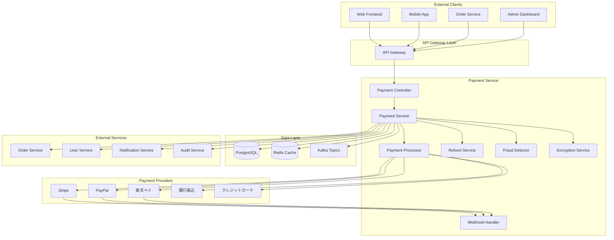
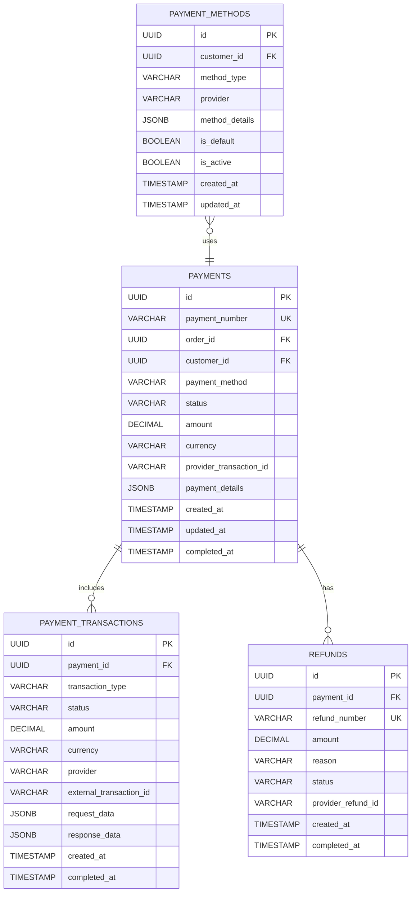

# Payment Service 詳細設計書

## 目次

1. [概要](#概要)
2. [技術仕様](#技術仕様)
3. [アーキテクチャ設計](#アーキテクチャ設計)
4. [API設計](#api設計)
5. [データベース設計](#database-design)
6. [決済処理設計](#payment-processing-design)
7. [決済プロバイダー連携](#payment-provider-integration)
8. [エラー処理](#error-handling)
9. [テスト設計](#test-design)
10. [ローカル開発環境](#local-development)
11. [本番デプロイメント](#production-deployment)
12. [監視・運用](#monitoring-operations)
13. [障害対応](#incident-response)

## 概要

### サービス概要

Payment Serviceは、スキー用品販売ショップサイトの決済機能を担当するマイクロサービスです。複数の決済プロバイダーとの連携、決済処理、トランザクション管理、決済履歴管理などの機能を提供します。

### 主要責務

- **決済処理**: クレジットカード、電子マネー、銀行振込等の決済処理
- **決済プロバイダー連携**: Stripe、PayPal、楽天ペイ等の外部決済サービス連携
- **トランザクション管理**: 決済トランザクションの管理・追跡
- **決済セキュリティ**: PCI DSS準拠のセキュアな決済処理
- **返金処理**: 返品・キャンセル時の返金処理
- **決済履歴管理**: 決済履歴の保存・検索機能

### ビジネス価値

- **売上向上**: 多様な決済手段による顧客満足度向上
- **セキュリティ**: PCI DSS準拠による安全な決済環境
- **運用効率化**: 自動化された決済処理とエラーハンドリング
- **コンプライアンス**: 金融関連法規への準拠

## 技術仕様

### 使用技術スタック

| 技術領域 | 技術/ライブラリ | バージョン | 用途 |
|---------|----------------|-----------|------|
| **Runtime** | OpenJDK | 21 LTS | Java実行環境 |
| **Framework** | Jakarta EE | 11 | エンタープライズフレームワーク |
| **Application Server** | WildFly | 31.0.1 | Jakarta EEアプリケーションサーバー |
| **Persistence** | Jakarta Persistence (JPA) | 3.2 | ORM |
| **Data Access** | Jakarta Data | 1.0 | Repository抽象化 |
| **REST API** | Jakarta REST (JAX-RS) | 4.0 | RESTful Web Services |
| **CDI** | Jakarta CDI | 4.1 | 依存性注入・管理 |
| **Validation** | Jakarta Validation | 3.1 | Bean Validation |
| **JSON Processing** | Jakarta JSON-P | 2.1 | JSON処理 |
| **Security** | Jakarta Security | 3.0 | セキュリティ機能 |
| **Database** | PostgreSQL | 16 | 主データベース |
| **Cache** | Redis | 7.2 | 決済キャッシュ |
| **Message Queue** | Apache Kafka | 3.7 | 決済イベント処理 |
| **Monitoring** | MicroProfile Metrics | 5.1 | メトリクス収集 |
| **Tracing** | MicroProfile OpenTelemetry | 2.0 | 分散トレーシング |
| **Health Check** | MicroProfile Health | 4.0 | ヘルスチェック |
| **Configuration** | MicroProfile Config | 3.1 | 設定管理 |
| **HTTP Client** | MicroProfile Rest Client | 4.0 | 外部API連携 |
| **Encryption** | Bouncy Castle | 1.76 | 暗号化処理 |

### 除外技術

- **Lombok**: Jakarta EE 11のRecord クラスとモダンJava機能を活用するため使用しません

### Java 21 LTS 活用機能

- **Virtual Threads**: 高並行決済処理
- **Record Classes**: 決済データ構造
- **Pattern Matching**: 決済状態判定
- **Text Blocks**: 複雑なSQL定義
- **Sealed Classes**: 決済イベントの型安全性

## アーキテクチャ設計

### システムアーキテクチャ図



### ドメインモデル設計

```java
// 決済エンティティ
@Entity
@Table(name = "payments")
public class Payment {
    
    @Id
    @GeneratedValue(strategy = GenerationType.UUID)
    private UUID id;
    
    @Column(name = "payment_id", unique = true, nullable = false)
    private String paymentId;
    
    @Column(name = "order_id", nullable = false)
    private UUID orderId;
    
    @Column(name = "customer_id", nullable = false)
    private UUID customerId;
    
    @Embedded
    private PaymentAmount amount;
    
    @Enumerated(EnumType.STRING)
    @Column(name = "payment_method", nullable = false)
    private PaymentMethod paymentMethod;
    
    @Enumerated(EnumType.STRING)
    @Column(name = "status", nullable = false)
    private PaymentStatus status;
    
    @Column(name = "provider", nullable = false)
    private String provider;
    
    @Column(name = "provider_transaction_id")
    private String providerTransactionId;
    
    @Column(name = "provider_reference")
    private String providerReference;
    
    @Embedded
    private PaymentDetails paymentDetails;
    
    @Column(name = "failure_reason")
    private String failureReason;
    
    @Column(name = "authorization_code")
    private String authorizationCode;
    
    @Column(name = "created_at", nullable = false)
    private LocalDateTime createdAt;
    
    @Column(name = "updated_at")
    private LocalDateTime updatedAt;
    
    @Column(name = "authorized_at")
    private LocalDateTime authorizedAt;
    
    @Column(name = "captured_at")
    private LocalDateTime capturedAt;
    
    @Column(name = "failed_at")
    private LocalDateTime failedAt;
    
    @Column(name = "expires_at")
    private LocalDateTime expiresAt;
    
    // 関連エンティティ
    @OneToMany(mappedBy = "payment", cascade = CascadeType.ALL, fetch = FetchType.LAZY)
    private List<PaymentEvent> events = new ArrayList<>();
    
    @OneToMany(mappedBy = "payment", cascade = CascadeType.ALL, fetch = FetchType.LAZY)
    private List<Refund> refunds = new ArrayList<>();
    
    // ビジネスロジック
    public boolean canBeAuthorized() {
        return status == PaymentStatus.PENDING;
    }
    
    public boolean canBeCaptured() {
        return status == PaymentStatus.AUTHORIZED;
    }
    
    public boolean canBeRefunded() {
        return status == PaymentStatus.CAPTURED;
    }
    
    public void authorize(String authCode, String providerTransactionId) {
        if (!canBeAuthorized()) {
            throw new InvalidPaymentStateException("決済を認証できません");
        }
        this.status = PaymentStatus.AUTHORIZED;
        this.authorizationCode = authCode;
        this.providerTransactionId = providerTransactionId;
        this.authorizedAt = LocalDateTime.now();
        this.updatedAt = LocalDateTime.now();
    }
    
    public void capture() {
        if (!canBeCaptured()) {
            throw new InvalidPaymentStateException("決済を確定できません");
        }
        this.status = PaymentStatus.CAPTURED;
        this.capturedAt = LocalDateTime.now();
        this.updatedAt = LocalDateTime.now();
    }
    
    public void fail(String reason) {
        this.status = PaymentStatus.FAILED;
        this.failureReason = reason;
        this.failedAt = LocalDateTime.now();
        this.updatedAt = LocalDateTime.now();
    }
    
    public BigDecimal getRefundableAmount() {
        var totalRefunded = refunds.stream()
            .filter(r -> r.getStatus() == RefundStatus.COMPLETED)
            .map(Refund::getAmount)
            .reduce(BigDecimal.ZERO, BigDecimal::add);
            
        return amount.totalAmount().subtract(totalRefunded);
    }
}

// 返金エンティティ
@Entity
@Table(name = "refunds")
public class Refund {
    
    @Id
    @GeneratedValue(strategy = GenerationType.UUID)
    private UUID id;
    
    @Column(name = "refund_id", unique = true, nullable = false)
    private String refundId;
    
    @ManyToOne(fetch = FetchType.LAZY)
    @JoinColumn(name = "payment_id", nullable = false)
    private Payment payment;
    
    @Column(name = "amount", precision = 12, scale = 2, nullable = false)
    private BigDecimal amount;
    
    @Column(name = "currency", length = 3, nullable = false)
    private String currency;
    
    @Enumerated(EnumType.STRING)
    @Column(name = "status", nullable = false)
    private RefundStatus status;
    
    @Column(name = "reason", nullable = false)
    private String reason;
    
    @Column(name = "provider_refund_id")
    private String providerRefundId;
    
    @Column(name = "failure_reason")
    private String failureReason;
    
    @Column(name = "requested_by", nullable = false)
    private UUID requestedBy;
    
    @Column(name = "created_at", nullable = false)
    private LocalDateTime createdAt;
    
    @Column(name = "updated_at")
    private LocalDateTime updatedAt;
    
    @Column(name = "completed_at")
    private LocalDateTime completedAt;
    
    @Column(name = "failed_at")
    private LocalDateTime failedAt;
    
    public void complete(String providerRefundId) {
        this.status = RefundStatus.COMPLETED;
        this.providerRefundId = providerRefundId;
        this.completedAt = LocalDateTime.now();
        this.updatedAt = LocalDateTime.now();
    }
    
    public void fail(String reason) {
        this.status = RefundStatus.FAILED;
        this.failureReason = reason;
        this.failedAt = LocalDateTime.now();
        this.updatedAt = LocalDateTime.now();
    }
}

// 決済イベント履歴
@Entity
@Table(name = "payment_events")
public class PaymentEvent {
    
    @Id
    @GeneratedValue(strategy = GenerationType.UUID)
    private UUID id;
    
    @ManyToOne(fetch = FetchType.LAZY)
    @JoinColumn(name = "payment_id", nullable = false)
    private Payment payment;
    
    @Enumerated(EnumType.STRING)
    @Column(name = "event_type", nullable = false)
    private PaymentEventType eventType;
    
    @Enumerated(EnumType.STRING)
    @Column(name = "from_status")
    private PaymentStatus fromStatus;
    
    @Enumerated(EnumType.STRING)
    @Column(name = "to_status", nullable = false)
    private PaymentStatus toStatus;
    
    @Column(name = "provider_response", columnDefinition = "TEXT")
    private String providerResponse;
    
    @Column(name = "metadata", columnDefinition = "JSONB")
    private String metadata;
    
    @Column(name = "created_at", nullable = false)
    private LocalDateTime createdAt;
}

// Embeddable Classes
@Embeddable
public record PaymentAmount(
    @Column(name = "amount", precision = 12, scale = 2)
    BigDecimal amount,
    
    @Column(name = "fee_amount", precision = 12, scale = 2)
    BigDecimal feeAmount,
    
    @Column(name = "tax_amount", precision = 12, scale = 2)
    BigDecimal taxAmount,
    
    @Column(name = "total_amount", precision = 12, scale = 2)
    BigDecimal totalAmount,
    
    @Column(name = "currency", length = 3)
    String currency
) {
    public static PaymentAmount create(BigDecimal amount, BigDecimal fee, BigDecimal tax) {
        var total = amount.add(fee).add(tax);
        return new PaymentAmount(amount, fee, tax, total, "JPY");
    }
}

@Embeddable
public record PaymentDetails(
    @Column(name = "card_last_four")
    String cardLastFour,
    
    @Column(name = "card_brand")
    String cardBrand,
    
    @Column(name = "card_expiry_month")
    Integer cardExpiryMonth,
    
    @Column(name = "card_expiry_year")
    Integer cardExpiryYear,
    
    @Column(name = "billing_address", columnDefinition = "JSONB")
    String billingAddress,
    
    @Column(name = "customer_email")
    String customerEmail,
    
    @Column(name = "customer_name")
    String customerName
) {}

// Sealed Classes for Events
public sealed interface PaymentDomainEvent
    permits PaymentCreatedEvent, PaymentAuthorizedEvent, PaymentCapturedEvent,
            PaymentFailedEvent, PaymentRefundedEvent {
}

public record PaymentCreatedEvent(
    UUID paymentId,
    String paymentNumber,
    UUID orderId,
    UUID customerId,
    BigDecimal amount,
    PaymentMethod paymentMethod,
    LocalDateTime timestamp
) implements PaymentDomainEvent {}

public record PaymentAuthorizedEvent(
    UUID paymentId,
    String paymentNumber,
    String authorizationCode,
    LocalDateTime authorizedAt
) implements PaymentDomainEvent {}

public record PaymentCapturedEvent(
    UUID paymentId,
    String paymentNumber,
    BigDecimal amount,
    LocalDateTime capturedAt
) implements PaymentDomainEvent {}

public record PaymentFailedEvent(
    UUID paymentId,
    String paymentNumber,
    String failureReason,
    LocalDateTime failedAt
) implements PaymentDomainEvent {}

// Enums
public enum PaymentMethod {
    CREDIT_CARD("クレジットカード"),
    DEBIT_CARD("デビットカード"),
    BANK_TRANSFER("銀行振込"),
    CONVENIENCE_STORE("コンビニ決済"),
    PAYPAL("PayPal"),
    RAKUTEN_PAY("楽天ペイ"),
    AMAZON_PAY("Amazon Pay"),
    APPLE_PAY("Apple Pay"),
    GOOGLE_PAY("Google Pay"),
    CRYPTO("暗号通貨");
    
    private final String description;
    
    PaymentMethod(String description) {
        this.description = description;
    }
    
    public String getDescription() {
        return description;
    }
    
    public boolean isInstant() {
        return this == CREDIT_CARD || this == DEBIT_CARD || 
               this == PAYPAL || this == APPLE_PAY || this == GOOGLE_PAY;
    }
    
    public boolean requiresManualVerification() {
        return this == BANK_TRANSFER || this == CONVENIENCE_STORE;
    }
}

public enum PaymentStatus {
    PENDING("処理中"),
    AUTHORIZED("認証済み"),
    CAPTURED("確定"),
    FAILED("失敗"),
    CANCELLED("キャンセル"),
    REFUNDED("返金済み"),
    PARTIALLY_REFUNDED("部分返金");
    
    private final String description;
    
    PaymentStatus(String description) {
        this.description = description;
    }
    
    public String getDescription() {
        return description;
    }
    
    public boolean isTerminal() {
        return this == CAPTURED || this == FAILED || this == CANCELLED || this == REFUNDED;
    }
    
    public boolean canTransitionTo(PaymentStatus targetStatus) {
        return switch (this) {
            case PENDING -> targetStatus == AUTHORIZED || targetStatus == FAILED || targetStatus == CANCELLED;
            case AUTHORIZED -> targetStatus == CAPTURED || targetStatus == FAILED || targetStatus == CANCELLED;
            case CAPTURED -> targetStatus == REFUNDED || targetStatus == PARTIALLY_REFUNDED;
            default -> false;
        };
    }
}

public enum RefundStatus {
    PENDING("処理中"),
    COMPLETED("完了"),
    FAILED("失敗"),
    CANCELLED("キャンセル");
    
    private final String description;
    
    RefundStatus(String description) {
        this.description = description;
    }
    
    public String getDescription() {
        return description;
    }
}

public enum PaymentEventType {
    CREATED("作成"),
    AUTHORIZED("認証"),
    CAPTURED("確定"),
    FAILED("失敗"),
    CANCELLED("キャンセル"),
    REFUND_REQUESTED("返金要求"),
    REFUNDED("返金完了"),
    WEBHOOK_RECEIVED("Webhook受信");
    
    private final String description;
    
    PaymentEventType(String description) {
        this.description = description;
    }
    
    public String getDescription() {
        return description;
    }
}
```

### サービス層設計

```java
// 決済サービス
// 決済サービス (CQRS Pattern 対応)
@ApplicationScoped
@Transactional
public class PaymentService {
    
    private static final Logger logger = LoggerFactory.getLogger(PaymentService.class);
    
    @Inject
    private PaymentRepository paymentRepository;
    
    @Inject
    private RefundRepository refundRepository;
    
    @Inject
    private PaymentIdGenerator paymentIdGenerator;
    
    @Inject
    private PaymentProcessorFactory processorFactory;
    
    @Inject
    private PaymentEventPublisher eventPublisher;
    
    @Inject
    private FraudDetectionService fraudDetectionService;
    
    @Inject
    private EncryptionService encryptionService;
    
    @Inject
    private OrderServiceClient orderServiceClient;
    
    @Inject
    private PaymentProcessingSaga paymentProcessingSaga;
    
    // CQRS Command Handlers
    @CommandHandler
    public PaymentResult handle(CreatePaymentCommand command) {
        try {
            // 詐欺検知
            var fraudResult = fraudDetectionService.analyze(command.toRequest());
            if (fraudResult.isRisk()) {
                return new PaymentResult(false, null, "Suspicious transaction detected");
            }
            
            // 決済ID生成
            var paymentId = paymentIdGenerator.generate();
            
            // 決済エンティティ作成
            var payment = buildPayment(command.toRequest(), paymentId);
            var savedPayment = paymentRepository.save(payment);
            
            // イベント発行
            eventPublisher.publish(new PaymentCreatedEvent(
                savedPayment.getId(),
                savedPayment.getPaymentId(),
                savedPayment.getOrderId(),
                savedPayment.getCustomerId(),
                savedPayment.getAmount().totalAmount(),
                savedPayment.getPaymentMethod(),
                LocalDateTime.now()
            ));
            
            logger.info("Payment created: {}", savedPayment.getPaymentId());
            return new PaymentResult(true, savedPayment.getId(), "決済作成完了");
            
        } catch (Exception e) {
            logger.error("決済作成エラー: orderId=" + command.orderId(), e);
            eventPublisher.publish(new PaymentCreationFailedEvent(
                command.orderId(),
                command.customerId(),
                e.getMessage(),
                LocalDateTime.now()
            ));
            
            return new PaymentResult(false, null, e.getMessage());
        }
    }
    
    @CommandHandler
    public PaymentResult handle(ProcessPaymentCommand command) {
        try {
            var payment = findPaymentById(command.paymentId());
            
            if (!payment.canBeAuthorized()) {
                return new PaymentResult(false, command.paymentId(), "Payment cannot be processed");
            }
            
            // 決済プロセッサー取得
            var processor = processorFactory.getProcessor(payment.getProvider());
            
            // 決済実行
            var result = processor.processPayment(payment);
            
            // 結果に基づく状態更新
            if (result.isSuccess()) {
                payment.authorize(result.getTransactionId(), result.getAuthorizationCode());
                paymentRepository.save(payment);
                
                eventPublisher.publish(new PaymentAuthorizedEvent(
                    payment.getId(),
                    payment.getOrderId(),
                    result.getTransactionId(),
                    LocalDateTime.now()
                ));
                
                logger.info("Payment authorized: {}", payment.getPaymentId());
                return new PaymentResult(true, payment.getId(), "決済認証完了");
            } else {
                payment.fail(result.getErrorMessage());
                paymentRepository.save(payment);
                
                eventPublisher.publish(new PaymentFailedEvent(
                    payment.getId(),
                    payment.getOrderId(),
                    result.getErrorMessage(),
                    LocalDateTime.now()
                ));
                
                return new PaymentResult(false, payment.getId(), result.getErrorMessage());
            }
            
        } catch (Exception e) {
            logger.error("決済処理エラー: paymentId=" + command.paymentId(), e);
            return new PaymentResult(false, command.paymentId(), e.getMessage());
        }
    }
    
    @CommandHandler
    public PaymentResult handle(CapturePaymentCommand command) {
        try {
            var payment = findPaymentById(command.paymentId());
            
            if (!payment.canBeCaptured()) {
                return new PaymentResult(false, command.paymentId(), "Payment cannot be captured");
            }
            
            var processor = processorFactory.getProcessor(payment.getProvider());
            var result = processor.capturePayment(payment, command.amount());
            
            if (result.isSuccess()) {
                payment.capture(command.amount(), result.getTransactionId());
                paymentRepository.save(payment);
                
                eventPublisher.publish(new PaymentCapturedEvent(
                    payment.getId(),
                    payment.getOrderId(),
                    command.amount(),
                    result.getTransactionId(),
                    LocalDateTime.now()
                ));
                
                logger.info("Payment captured: {}", payment.getPaymentId());
                return new PaymentResult(true, payment.getId(), "決済確定完了");
            } else {
                return new PaymentResult(false, payment.getId(), result.getErrorMessage());
            }
            
        } catch (Exception e) {
            logger.error("決済確定エラー: paymentId=" + command.paymentId(), e);
            return new PaymentResult(false, command.paymentId(), e.getMessage());
        }
    }
    
    @CommandHandler
    public RefundResult handle(CreateRefundCommand command) {
        try {
            var payment = findPaymentById(command.paymentId());
            
            if (!payment.canBeRefunded()) {
                return new RefundResult(false, null, "Payment cannot be refunded");
            }
            
            var processor = processorFactory.getProcessor(payment.getProvider());
            var result = processor.refundPayment(payment, command.amount());
            
            if (result.isSuccess()) {
                var refund = new Refund();
                refund.setPayment(payment);
                refund.setAmount(command.amount());
                refund.setReason(command.reason());
                refund.setStatus(RefundStatus.COMPLETED);
                refund.setTransactionId(result.getTransactionId());
                refund.setCreatedAt(LocalDateTime.now());
                
                var savedRefund = refundRepository.save(refund);
                
                eventPublisher.publish(new PaymentRefundedEvent(
                    payment.getId(),
                    savedRefund.getId(),
                    command.amount(),
                    command.reason(),
                    LocalDateTime.now()
                ));
                
                logger.info("Refund created: paymentId={}, refundId={}", 
                    payment.getPaymentId(), savedRefund.getId());
                return new RefundResult(true, savedRefund.getId(), "返金完了");
            } else {
                return new RefundResult(false, null, result.getErrorMessage());
            }
            
        } catch (Exception e) {
            logger.error("返金処理エラー: paymentId=" + command.paymentId(), e);
            return new RefundResult(false, null, e.getMessage());
        }
    }
    
    // CQRS Query Handlers
    @QueryHandler
    public PaymentProjection handle(GetPaymentByIdQuery query) {
        var payment = paymentRepository.findById(query.paymentId());
        return payment.map(PaymentProjection::from)
            .orElse(null);
    }
    
    @QueryHandler
    public PaymentProjection handle(GetPaymentByOrderIdQuery query) {
        var payment = paymentRepository.findByOrderId(query.orderId());
        return payment.map(PaymentProjection::from)
            .orElse(null);
    }
    
    @QueryHandler
    public List<PaymentProjection> handle(GetPaymentsByCustomerQuery query) {
        return paymentRepository.findByCustomerId(query.customerId(), query.page(), query.size())
            .stream()
            .map(PaymentProjection::from)
            .toList();
    }
    
    @QueryHandler
    public PaymentStatisticsProjection handle(GetPaymentStatisticsQuery query) {
        var totalAmount = paymentRepository.getTotalAmountByDateRange(query.fromDate(), query.toDate());
        var totalCount = paymentRepository.getCountByDateRange(query.fromDate(), query.toDate());
        var successfulPayments = paymentRepository.getSuccessfulPaymentsByDateRange(query.fromDate(), query.toDate());
        var failedPayments = paymentRepository.getFailedPaymentsByDateRange(query.fromDate(), query.toDate());
        
        return new PaymentStatisticsProjection(
            totalAmount,
            totalCount,
            successfulPayments,
            failedPayments,
            LocalDateTime.now()
        );
    }
    
    // Event Handlers
    @EventHandler
    public void handle(OrderCreatedEvent event) {
        logger.info("注文作成イベント処理開始: orderId={}", event.orderId());
        
        CompletableFuture.runAsync(() -> {
            try {
                paymentProcessingSaga.processOrderPayment(
                    event.orderId(),
                    event.customerId(),
                    event.totalAmount(),
                    event.paymentMethod()
                );
            } catch (Exception e) {
                logger.error("決済処理Saga実行エラー: orderId=" + event.orderId(), e);
            }
        }, VirtualThread.ofVirtual().factory());
    }
    
    @EventHandler
    public void handle(InventoryReservedEvent event) {
        logger.info("在庫予約完了イベント処理開始: orderId={}", event.orderId());
        
        CompletableFuture.runAsync(() -> {
            try {
                paymentProcessingSaga.processPaymentAuthorization(event.orderId());
            } catch (Exception e) {
                logger.error("決済認証Saga実行エラー: orderId=" + event.orderId(), e);
            }
        }, VirtualThread.ofVirtual().factory());
    }
    
    @EventHandler
    public void handle(OrderCancelledEvent event) {
        logger.info("注文キャンセルイベント処理開始: orderId={}", event.orderId());
        
        CompletableFuture.runAsync(() -> {
            try {
                paymentProcessingSaga.processPaymentCancellation(event.orderId(), event.reason());
            } catch (Exception e) {
                logger.error("決済キャンセルSaga実行エラー: orderId=" + event.orderId(), e);
            }
        }, VirtualThread.ofVirtual().factory());
    }
    
    public Payment createPayment(CreatePaymentRequest request) {
        // 詐欺検知
        var fraudResult = fraudDetectionService.analyze(request);
        if (fraudResult.isRisk()) {
            throw new PaymentFraudException("Suspicious transaction detected");
        }
        
        // 決済ID生成
        var paymentId = paymentIdGenerator.generate();
        
        // 決済エンティティ作成
        var payment = buildPayment(request, paymentId);
        var savedPayment = paymentRepository.save(payment);
        
        // イベント発行
        eventPublisher.publish(new PaymentCreatedEvent(
            savedPayment.getId(),
            savedPayment.getPaymentId(),
            savedPayment.getOrderId(),
            savedPayment.getCustomerId(),
            savedPayment.getAmount().totalAmount(),
            savedPayment.getPaymentMethod(),
            LocalDateTime.now()
        ));
        
        logger.info("Payment created: {}", savedPayment.getPaymentId());
        return savedPayment;
    }
    
    public Payment processPayment(UUID paymentId) {
        var payment = findPaymentById(paymentId);
        
        if (!payment.canBeAuthorized()) {
            throw new InvalidPaymentStateException("Payment cannot be processed");
        }
        
        try {
            // 決済プロセッサー取得
            var processor = processorFactory.getProcessor(payment.getProvider());
            
            // 決済実行
            var result = processor.processPayment(payment);
            
            if (result.isSuccessful()) {
                payment.authorize(result.authorizationCode(), result.transactionId());
                
                // 自動キャプチャー設定の場合
                if (shouldAutoCapture(payment)) {
                    return capturePayment(paymentId);
                }
                
                eventPublisher.publish(new PaymentAuthorizedEvent(
                    payment.getId(),
                    payment.getPaymentId(),
                    result.authorizationCode(),
                    payment.getAuthorizedAt()
                ));
                
            } else {
                payment.fail(result.errorMessage());
                
                eventPublisher.publish(new PaymentFailedEvent(
                    payment.getId(),
                    payment.getPaymentId(),
                    result.errorMessage(),
                    payment.getFailedAt()
                ));
            }
            
            return paymentRepository.save(payment);
            
        } catch (Exception e) {
            payment.fail(e.getMessage());
            paymentRepository.save(payment);
            
            logger.error("Payment processing failed: {}", payment.getPaymentId(), e);
            throw new PaymentProcessingException("Payment processing failed", e);
        }
    }
    
    public Payment capturePayment(UUID paymentId) {
        var payment = findPaymentById(paymentId);
        
        if (!payment.canBeCaptured()) {
            throw new InvalidPaymentStateException("Payment cannot be captured");
        }
        
        try {
            var processor = processorFactory.getProcessor(payment.getProvider());
            var result = processor.capturePayment(payment);
            
            if (result.isSuccessful()) {
                payment.capture();
                
                // 注文ステータス更新
                orderServiceClient.updatePaymentStatus(payment.getOrderId(), "COMPLETED");
                
                eventPublisher.publish(new PaymentCapturedEvent(
                    payment.getId(),
                    payment.getPaymentId(),
                    payment.getAmount().totalAmount(),
                    payment.getCapturedAt()
                ));
                
            } else {
                payment.fail(result.errorMessage());
            }
            
            return paymentRepository.save(payment);
            
        } catch (Exception e) {
            logger.error("Payment capture failed: {}", payment.getPaymentId(), e);
            throw new PaymentProcessingException("Payment capture failed", e);
        }
    }
    
    public Refund createRefund(CreateRefundRequest request) {
        var payment = findPaymentById(request.paymentId());
        
        if (!payment.canBeRefunded()) {
            throw new InvalidPaymentStateException("Payment cannot be refunded");
        }
        
        var refundableAmount = payment.getRefundableAmount();
        if (request.amount().compareTo(refundableAmount) > 0) {
            throw new InvalidRefundAmountException("Refund amount exceeds refundable amount");
        }
        
        var refundId = paymentIdGenerator.generateRefundId();
        
        var refund = new Refund();
        refund.setRefundId(refundId);
        refund.setPayment(payment);
        refund.setAmount(request.amount());
        refund.setCurrency(payment.getAmount().currency());
        refund.setStatus(RefundStatus.PENDING);
        refund.setReason(request.reason());
        refund.setRequestedBy(request.requestedBy());
        refund.setCreatedAt(LocalDateTime.now());
        
        var savedRefund = refundRepository.save(refund);
        
        // 非同期で返金処理実行
        processRefundAsync(savedRefund.getId());
        
        logger.info("Refund created: {} for payment: {}", refundId, payment.getPaymentId());
        return savedRefund;
    }
    
    @Asynchronous
    public void processRefundAsync(UUID refundId) {
        var refund = refundRepository.findById(refundId)
            .orElseThrow(() -> new RefundNotFoundException("Refund not found: " + refundId));
            
        try {
            var processor = processorFactory.getProcessor(refund.getPayment().getProvider());
            var result = processor.processRefund(refund);
            
            if (result.isSuccessful()) {
                refund.complete(result.providerRefundId());
                
                eventPublisher.publish(new PaymentRefundedEvent(
                    refund.getPayment().getId(),
                    refund.getPayment().getPaymentId(),
                    refund.getAmount(),
                    refund.getCompletedAt()
                ));
                
            } else {
                refund.fail(result.errorMessage());
            }
            
            refundRepository.save(refund);
            
        } catch (Exception e) {
            refund.fail(e.getMessage());
            refundRepository.save(refund);
            logger.error("Refund processing failed: {}", refund.getRefundId(), e);
        }
    }
    
    public Payment findPaymentById(UUID paymentId) {
        return paymentRepository.findById(paymentId)
            .orElseThrow(() -> new PaymentNotFoundException("Payment not found: " + paymentId));
    }
    
    public Payment findPaymentByOrderId(UUID orderId) {
        return paymentRepository.findByOrderId(orderId)
            .orElseThrow(() -> new PaymentNotFoundException("Payment not found for order: " + orderId));
    }
    
    public List<Payment> findPaymentsByCustomer(UUID customerId, int page, int size) {
        return paymentRepository.findByCustomerIdOrderByCreatedAtDesc(customerId, 
            PageRequest.of(page, size));
    }
    
    private Payment buildPayment(CreatePaymentRequest request, String paymentId) {
        var payment = new Payment();
        payment.setPaymentId(paymentId);
        payment.setOrderId(request.orderId());
        payment.setCustomerId(request.customerId());
        payment.setPaymentMethod(request.paymentMethod());
        payment.setProvider(determineProvider(request.paymentMethod()));
        payment.setStatus(PaymentStatus.PENDING);
        payment.setCreatedAt(LocalDateTime.now());
        
        // 金額設定
        var amount = PaymentAmount.create(
            request.amount(),
            calculateFee(request.amount(), request.paymentMethod()),
            calculateTax(request.amount())
        );
        payment.setAmount(amount);
        
        // 決済詳細設定（機密情報は暗号化）
        if (request.paymentDetails() != null) {
            var encryptedDetails = encryptPaymentDetails(request.paymentDetails());
            payment.setPaymentDetails(encryptedDetails);
        }
        
        // 有効期限設定
        payment.setExpiresAt(calculateExpiryTime(request.paymentMethod()));
        
        return payment;
    }
    
    private boolean shouldAutoCapture(Payment payment) {
        // 決済方法に応じた自動キャプチャー判定
        return payment.getPaymentMethod().isInstant();
    }
    
    private String determineProvider(PaymentMethod method) {
        return switch (method) {
            case CREDIT_CARD, DEBIT_CARD -> "stripe";
            case PAYPAL -> "paypal";
            case RAKUTEN_PAY -> "rakuten";
            case BANK_TRANSFER -> "bank";
            default -> "default";
        };
    }
    
    private BigDecimal calculateFee(BigDecimal amount, PaymentMethod method) {
        // 決済手数料計算
        var feeRate = switch (method) {
            case CREDIT_CARD -> new BigDecimal("0.036"); // 3.6%
            case PAYPAL -> new BigDecimal("0.034"); // 3.4%
            case BANK_TRANSFER -> BigDecimal.ZERO;
            default -> new BigDecimal("0.03"); // 3%
        };
        
        return amount.multiply(feeRate).setScale(0, RoundingMode.UP);
    }
    
    private BigDecimal calculateTax(BigDecimal amount) {
        // 消費税計算（10%）
        return amount.multiply(new BigDecimal("0.10"));
    }
    
    private LocalDateTime calculateExpiryTime(PaymentMethod method) {
        var now = LocalDateTime.now();
        return switch (method) {
            case CREDIT_CARD, DEBIT_CARD -> now.plusMinutes(30);
            case BANK_TRANSFER -> now.plusDays(7);
            case CONVENIENCE_STORE -> now.plusDays(3);
            default -> now.plusHours(24);
        };
    }
    
    private PaymentDetails encryptPaymentDetails(PaymentDetailsRequest details) {
        // 機密情報の暗号化
        var encryptedCardNumber = details.cardNumber() != null ? 
            encryptionService.encrypt(details.cardNumber()) : null;
        var cardLastFour = details.cardNumber() != null ? 
            details.cardNumber().substring(details.cardNumber().length() - 4) : null;
            
        return new PaymentDetails(
            cardLastFour,
            details.cardBrand(),
            details.cardExpiryMonth(),
            details.cardExpiryYear(),
            details.billingAddress() != null ? JsonUtils.toJson(details.billingAddress()) : null,
            details.customerEmail(),
            details.customerName()
        );
    }
}

// 決済プロセッサーファクトリー
@ApplicationScoped
public class PaymentProcessorFactory {
    
    @Inject
    private StripePaymentProcessor stripeProcessor;
    
    @Inject
    private PayPalPaymentProcessor paypalProcessor;
    
    @Inject
    private RakutenPaymentProcessor rakutenProcessor;
    
    @Inject
    private BankTransferProcessor bankProcessor;
    
    public PaymentProcessor getProcessor(String provider) {
        return switch (provider.toLowerCase()) {
            case "stripe" -> stripeProcessor;
            case "paypal" -> paypalProcessor;
            case "rakuten" -> rakutenProcessor;
            case "bank" -> bankProcessor;
            default -> throw new UnsupportedPaymentProviderException("Unsupported provider: " + provider);
        };
    }
}

// 決済プロセッサーインターフェース
public interface PaymentProcessor {
    
    PaymentResult processPayment(Payment payment);
    
    PaymentResult capturePayment(Payment payment);
    
    RefundResult processRefund(Refund refund);
    
    boolean verifyWebhook(String payload, String signature);
    
    PaymentStatus getPaymentStatus(String providerTransactionId);
}

// Stripe決済プロセッサー実装
@ApplicationScoped
public class StripePaymentProcessor implements PaymentProcessor {
    
    private static final Logger logger = LoggerFactory.getLogger(StripePaymentProcessor.class);
    
    @Inject
    @ConfigProperty(name = "stripe.api.key")
    private String apiKey;
    
    @Inject
    @ConfigProperty(name = "stripe.webhook.secret")
    private String webhookSecret;
    
    @Inject
    @RestClient
    private StripeClient stripeClient;
    
    @Override
    public PaymentResult processPayment(Payment payment) {
        try {
            var request = buildStripePaymentRequest(payment);
            var response = stripeClient.createPaymentIntent(request);
            
            if (response.status().equals("succeeded")) {
                return PaymentResult.success(
                    response.id(),
                    response.id(),
                    response.metadata().toString()
                );
            } else {
                return PaymentResult.failure(response.lastPaymentError().message());
            }
            
        } catch (Exception e) {
            logger.error("Stripe payment processing failed", e);
            return PaymentResult.failure(e.getMessage());
        }
    }
    
    @Override
    public PaymentResult capturePayment(Payment payment) {
        try {
            var response = stripeClient.capturePaymentIntent(payment.getProviderTransactionId());
            
            if (response.status().equals("succeeded")) {
                return PaymentResult.success(
                    response.id(),
                    response.id(),
                    response.metadata().toString()
                );
            } else {
                return PaymentResult.failure("Capture failed");
            }
            
        } catch (Exception e) {
            logger.error("Stripe payment capture failed", e);
            return PaymentResult.failure(e.getMessage());
        }
    }
    
    @Override
    public RefundResult processRefund(Refund refund) {
        try {
            var request = new StripeRefundRequest(
                refund.getPayment().getProviderTransactionId(),
                refund.getAmount().multiply(BigDecimal.valueOf(100)).longValue(), // cents
                refund.getReason()
            );
            
            var response = stripeClient.createRefund(request);
            
            if (response.status().equals("succeeded")) {
                return RefundResult.success(response.id());
            } else {
                return RefundResult.failure("Refund failed");
            }
            
        } catch (Exception e) {
            logger.error("Stripe refund processing failed", e);
            return RefundResult.failure(e.getMessage());
        }
    }
    
    @Override
    public boolean verifyWebhook(String payload, String signature) {
        try {
            return StripeWebhookVerifier.verify(payload, signature, webhookSecret);
        } catch (Exception e) {
            logger.error("Stripe webhook verification failed", e);
            return false;
        }
    }
    
    @Override
    public PaymentStatus getPaymentStatus(String providerTransactionId) {
        try {
            var response = stripeClient.getPaymentIntent(providerTransactionId);
            return mapStripeStatus(response.status());
        } catch (Exception e) {
            logger.error("Failed to get Stripe payment status", e);
            return PaymentStatus.FAILED;
        }
    }
    
    private StripePaymentRequest buildStripePaymentRequest(Payment payment) {
        return new StripePaymentRequest(
            payment.getAmount().totalAmount().multiply(BigDecimal.valueOf(100)).longValue(),
            payment.getAmount().currency().toLowerCase(),
            payment.getPaymentDetails().customerEmail(),
            Map.of(
                "order_id", payment.getOrderId().toString(),
                "customer_id", payment.getCustomerId().toString()
            )
        );
    }
    
    private PaymentStatus mapStripeStatus(String stripeStatus) {
        return switch (stripeStatus) {
            case "requires_payment_method", "requires_confirmation" -> PaymentStatus.PENDING;
            case "requires_capture" -> PaymentStatus.AUTHORIZED;
            case "succeeded" -> PaymentStatus.CAPTURED;
            case "canceled" -> PaymentStatus.CANCELLED;
            default -> PaymentStatus.FAILED;
        };
    }
}
```

### Record ベース DTO

```java
// リクエスト DTO
public record CreatePaymentRequest(
    UUID orderId,
    UUID customerId,
    BigDecimal amount,
    PaymentMethod paymentMethod,
    PaymentDetailsRequest paymentDetails,
    String description,
    Map<String, String> metadata
) {}

public record PaymentDetailsRequest(
    String cardNumber,
    String cardBrand,
    Integer cardExpiryMonth,
    Integer cardExpiryYear,
    String cardCvv,
    BillingAddressRequest billingAddress,
    String customerEmail,
    String customerName
) {}

public record BillingAddressRequest(
    String firstName,
    String lastName,
    String postalCode,
    String prefecture,
    String city,
    String addressLine1,
    String addressLine2,
    String phoneNumber
) {}

public record CreateRefundRequest(
    UUID paymentId,
    BigDecimal amount,
    String reason,
    UUID requestedBy,
    Map<String, String> metadata
) {}

public record CapturePaymentRequest(
    UUID paymentId,
    BigDecimal amount
) {}

// レスポンス DTO
public record PaymentResponse(
    UUID paymentId,
    String paymentNumber,
    UUID orderId,
    UUID customerId,
    PaymentAmount amount,
    PaymentMethod paymentMethod,
    PaymentStatus status,
    String provider,
    PaymentDetails paymentDetails,
    LocalDateTime createdAt,
    LocalDateTime authorizedAt,
    LocalDateTime capturedAt,
    LocalDateTime expiresAt
) {
    public static PaymentResponse from(Payment payment) {
        return new PaymentResponse(
            payment.getId(),
            payment.getPaymentId(),
            payment.getOrderId(),
            payment.getCustomerId(),
            payment.getAmount(),
            payment.getPaymentMethod(),
            payment.getStatus(),
            payment.getProvider(),
            payment.getPaymentDetails(),
            payment.getCreatedAt(),
            payment.getAuthorizedAt(),
            payment.getCapturedAt(),
            payment.getExpiresAt()
        );
    }
}

public record RefundResponse(
    UUID refundId,
    String refundNumber,
    UUID paymentId,
    BigDecimal amount,
    String currency,
    RefundStatus status,
    String reason,
    LocalDateTime createdAt,
    LocalDateTime completedAt
) {
    public static RefundResponse from(Refund refund) {
        return new RefundResponse(
            refund.getId(),
            refund.getRefundId(),
            refund.getPayment().getId(),
            refund.getAmount(),
            refund.getCurrency(),
            refund.getStatus(),
            refund.getReason(),
            refund.getCreatedAt(),
            refund.getCompletedAt()
        );
    }
}

public record PaymentStatistics(
    long totalPayments,
    BigDecimal totalAmount,
    long successfulPayments,
    long failedPayments,
    BigDecimal averageAmount,
    Map<PaymentMethod, Long> paymentMethodDistribution,
    Map<PaymentStatus, Long> statusDistribution
) {}

// 結果クラス
public record PaymentResult(
    boolean successful,
    String transactionId,
    String authorizationCode,
    String errorMessage,
    String metadata
) {
    public static PaymentResult success(String transactionId, String authCode, String metadata) {
        return new PaymentResult(true, transactionId, authCode, null, metadata);
    }
    
    public static PaymentResult failure(String errorMessage) {
        return new PaymentResult(false, null, null, errorMessage, null);
    }
    
    public boolean isSuccessful() {
        return successful;
    }
}

public record RefundResult(
    boolean successful,
    String providerRefundId,
    String errorMessage
) {
    public static RefundResult success(String providerRefundId) {
        return new RefundResult(true, providerRefundId, null);
    }
    
    public static RefundResult failure(String errorMessage) {
        return new RefundResult(false, null, errorMessage);
    }
    
    public boolean isSuccessful() {
        return successful;
    }
}

// 外部API DTO (Stripe)
public record StripePaymentRequest(
    long amount,
    String currency,
    String receiptEmail,
    Map<String, String> metadata
) {}

public record StripePaymentResponse(
    String id,
    String status,
    long amount,
    String currency,
    StripeError lastPaymentError,
    Map<String, Object> metadata
) {}

public record StripeError(
    String code,
    String message,
    String type
) {}

public record StripeRefundRequest(
    String paymentIntentId,
    long amount,
    String reason
) {}

public record StripeRefundResponse(
    String id,
    String status,
    long amount,
    String currency
) {}

// 例外クラス
public class PaymentNotFoundException extends RuntimeException {
    public PaymentNotFoundException(String message) {
        super(message);
    }
}

public class InvalidPaymentStateException extends RuntimeException {
    public InvalidPaymentStateException(String message) {
        super(message);
    }
}

public class PaymentProcessingException extends RuntimeException {
    public PaymentProcessingException(String message, Throwable cause) {
        super(message, cause);
    }
}

public class PaymentFraudException extends RuntimeException {
    public PaymentFraudException(String message) {
        super(message);
    }
}

public class UnsupportedPaymentProviderException extends RuntimeException {
    public UnsupportedPaymentProviderException(String message) {
        super(message);
    }
}

public class InvalidRefundAmountException extends RuntimeException {
    public InvalidRefundAmountException(String message) {
        super(message);
    }
}

public class RefundNotFoundException extends RuntimeException {
    public RefundNotFoundException(String message) {
        super(message);
    }
}
```

## API設計

### REST API エンドポイント

```java
@Path("/api/v1/payments")
@ApplicationScoped
@Produces(MediaType.APPLICATION_JSON)
@Consumes(MediaType.APPLICATION_JSON)
public class PaymentController {
    
    private static final Logger logger = LoggerFactory.getLogger(PaymentController.class);
    
    @Inject
    private PaymentService paymentService;
    
    @Inject
    private PaymentMapper paymentMapper;
    
    @POST
    @Path("")
    @Operation(summary = "決済作成", description = "新規決済を作成します")
    @APIResponse(responseCode = "201", description = "決済作成成功")
    @APIResponse(responseCode = "400", description = "リクエストが不正")
    @APIResponse(responseCode = "409", description = "決済が既に存在")
    public Response createPayment(
            @Valid @RequestBody CreatePaymentRequest request) {
        
        try {
            var payment = paymentService.createPayment(request);
            var response = PaymentResponse.from(payment);
            
            return Response.status(Response.Status.CREATED)
                .entity(response)
                .build();
                
        } catch (PaymentFraudException e) {
            logger.warn("Fraud detected for payment creation: {}", e.getMessage());
            return Response.status(Response.Status.FORBIDDEN)
                .entity(Map.of("error", "Transaction declined"))
                .build();
                
        } catch (Exception e) {
            logger.error("Failed to create payment", e);
            return Response.status(Response.Status.INTERNAL_SERVER_ERROR)
                .entity(Map.of("error", "Internal server error"))
                .build();
        }
    }
    
    @POST
    @Path("/{paymentId}/process")
    @Operation(summary = "決済処理", description = "決済を実行します")
    @APIResponse(responseCode = "200", description = "決済処理成功")
    @APIResponse(responseCode = "404", description = "決済が見つからない")
    @APIResponse(responseCode = "422", description = "決済処理不可")
    public Response processPayment(
            @PathParam("paymentId") UUID paymentId) {
        
        try {
            var payment = paymentService.processPayment(paymentId);
            var response = PaymentResponse.from(payment);
            
            return Response.ok(response).build();
            
        } catch (PaymentNotFoundException e) {
            return Response.status(Response.Status.NOT_FOUND)
                .entity(Map.of("error", e.getMessage()))
                .build();
                
        } catch (InvalidPaymentStateException e) {
            return Response.status(422)
                .entity(Map.of("error", e.getMessage()))
                .build();
                
        } catch (PaymentProcessingException e) {
            logger.error("Payment processing failed", e);
            return Response.status(Response.Status.INTERNAL_SERVER_ERROR)
                .entity(Map.of("error", "Payment processing failed"))
                .build();
        }
    }
    
    @POST
    @Path("/{paymentId}/capture")
    @Operation(summary = "決済確定", description = "認証済み決済を確定します")
    @APIResponse(responseCode = "200", description = "決済確定成功")
    @APIResponse(responseCode = "404", description = "決済が見つからない")
    @APIResponse(responseCode = "422", description = "決済確定不可")
    public Response capturePayment(
            @PathParam("paymentId") UUID paymentId,
            @Valid @RequestBody(required = false) CapturePaymentRequest request) {
        
        try {
            var payment = paymentService.capturePayment(paymentId);
            var response = PaymentResponse.from(payment);
            
            return Response.ok(response).build();
            
        } catch (PaymentNotFoundException e) {
            return Response.status(Response.Status.NOT_FOUND)
                .entity(Map.of("error", e.getMessage()))
                .build();
                
        } catch (InvalidPaymentStateException e) {
            return Response.status(422)
                .entity(Map.of("error", e.getMessage()))
                .build();
        }
    }
    
    @POST
    @Path("/{paymentId}/refunds")
    @Operation(summary = "返金作成", description = "決済に対する返金を作成します")
    @APIResponse(responseCode = "201", description = "返金作成成功")
    @APIResponse(responseCode = "404", description = "決済が見つからない")
    @APIResponse(responseCode = "422", description = "返金不可")
    public Response createRefund(
            @PathParam("paymentId") UUID paymentId,
            @Valid @RequestBody CreateRefundRequest request) {
        
        try {
            var refund = paymentService.createRefund(request);
            var response = RefundResponse.from(refund);
            
            return Response.status(Response.Status.CREATED)
                .entity(response)
                .build();
                
        } catch (PaymentNotFoundException e) {
            return Response.status(Response.Status.NOT_FOUND)
                .entity(Map.of("error", e.getMessage()))
                .build();
                
        } catch (InvalidPaymentStateException | InvalidRefundAmountException e) {
            return Response.status(422)
                .entity(Map.of("error", e.getMessage()))
                .build();
        }
    }
    
    @GET
    @Path("/{paymentId}")
    @Operation(summary = "決済取得", description = "決済情報を取得します")
    @APIResponse(responseCode = "200", description = "決済取得成功")
    @APIResponse(responseCode = "404", description = "決済が見つからない")
    public Response getPayment(@PathParam("paymentId") UUID paymentId) {
        try {
            var payment = paymentService.findPaymentById(paymentId);
            var response = PaymentResponse.from(payment);
            
            return Response.ok(response).build();
            
        } catch (PaymentNotFoundException e) {
            return Response.status(Response.Status.NOT_FOUND)
                .entity(Map.of("error", e.getMessage()))
                .build();
        }
    }
    
    @GET
    @Path("/orders/{orderId}")
    @Operation(summary = "注文決済取得", description = "注文IDから決済情報を取得します")
    @APIResponse(responseCode = "200", description = "決済取得成功")
    @APIResponse(responseCode = "404", description = "決済が見つからない")
    public Response getPaymentByOrderId(@PathParam("orderId") UUID orderId) {
        try {
            var payment = paymentService.findPaymentByOrderId(orderId);
            var response = PaymentResponse.from(payment);
            
            return Response.ok(response).build();
            
        } catch (PaymentNotFoundException e) {
            return Response.status(Response.Status.NOT_FOUND)
                .entity(Map.of("error", e.getMessage()))
                .build();
        }
    }
    
    @GET
    @Path("/customers/{customerId}")
    @Operation(summary = "顧客決済履歴", description = "顧客の決済履歴を取得します")
    @APIResponse(responseCode = "200", description = "決済履歴取得成功")
    public Response getCustomerPayments(
            @PathParam("customerId") UUID customerId,
            @QueryParam("page") @DefaultValue("0") int page,
            @QueryParam("size") @DefaultValue("20") int size) {
        
        var payments = paymentService.findPaymentsByCustomer(customerId, page, size);
        var responses = payments.stream()
            .map(PaymentResponse::from)
            .toList();
            
        return Response.ok(responses).build();
    }
    
    @GET
    @Path("/statistics")
    @Operation(summary = "決済統計", description = "決済統計情報を取得します")
    @APIResponse(responseCode = "200", description = "統計取得成功")
    @RolesAllowed({"ADMIN", "MANAGER"})
    public Response getPaymentStatistics(
            @QueryParam("from") @DateTimeFormat String fromDate,
            @QueryParam("to") @DateTimeFormat String toDate) {
        
        var from = fromDate != null ? LocalDate.parse(fromDate) : LocalDate.now().minusDays(30);
        var to = toDate != null ? LocalDate.parse(toDate) : LocalDate.now();
        
        var statistics = paymentService.getPaymentStatistics(from, to);
        return Response.ok(statistics).build();
    }
    
    @POST
    @Path("/webhooks/{provider}")
    @Operation(summary = "Webhook処理", description = "決済プロバイダーからのWebhookを処理します")
    @APIResponse(responseCode = "200", description = "Webhook処理成功")
    @APIResponse(responseCode = "400", description = "Webhook検証失敗")
    @Consumes(MediaType.TEXT_PLAIN)
    public Response handleWebhook(
            @PathParam("provider") String provider,
            @HeaderParam("Stripe-Signature") String signature,
            String payload) {
        
        try {
            var processor = paymentService.getPaymentProcessor(provider);
            
            if (!processor.verifyWebhook(payload, signature)) {
                return Response.status(Response.Status.BAD_REQUEST)
                    .entity(Map.of("error", "Invalid webhook signature"))
                    .build();
            }
            
            paymentService.processWebhook(provider, payload);
            return Response.ok(Map.of("status", "success")).build();
            
        } catch (Exception e) {
            logger.error("Webhook processing failed for provider: {}", provider, e);
            return Response.status(Response.Status.INTERNAL_SERVER_ERROR)
                .entity(Map.of("error", "Webhook processing failed"))
                .build();
        }
    }
}

// 決済処理Sagaパターン
@ApplicationScoped
@Transactional
public class PaymentProcessingSaga {
    
    private static final Logger logger = LoggerFactory.getLogger(PaymentProcessingSaga.class);
    
    @Inject
    private PaymentRepository paymentRepository;
    
    @Inject
    private SagaStateRepository sagaStateRepository;
    
    @Inject
    private PaymentEventPublisher eventPublisher;
    
    @Inject
    private PaymentProcessorFactory processorFactory;
    
    public CompletableFuture<SagaResult> processOrderPayment(
            UUID orderId, UUID customerId, BigDecimal amount, String paymentMethod) {
        
        return CompletableFuture.supplyAsync(() -> {
            var sagaId = UUID.randomUUID();
            var sagaState = new SagaState(sagaId, orderId, SagaType.PAYMENT_PROCESSING);
            sagaStateRepository.save(sagaState);
            
            try {
                logger.info("決済処理Saga開始: sagaId={}, orderId={}", sagaId, orderId);
                
                // Step 1: 決済作成
                sagaState.setCurrentStep("CREATING_PAYMENT");
                var paymentResult = createPaymentRecord(orderId, customerId, amount, paymentMethod);
                if (!paymentResult.success()) {
                    return handleSagaFailure(sagaState, "決済作成失敗", paymentResult.message());
                }
                sagaState.setLastCompletedStep("CREATING_PAYMENT");
                
                // Step 2: 決済前検証
                sagaState.setCurrentStep("VALIDATING_PAYMENT");
                var validationResult = validatePaymentDetails(paymentResult.paymentId());
                if (!validationResult.success()) {
                    return handleSagaFailure(sagaState, "決済検証失敗", validationResult.message());
                }
                sagaState.setLastCompletedStep("VALIDATING_PAYMENT");
                
                // Step 3: 決済準備完了イベント
                sagaState.setCurrentStep("PUBLISHING_EVENTS");
                publishPaymentReadyEvent(orderId, paymentResult.paymentId());
                sagaState.setLastCompletedStep("PUBLISHING_EVENTS");
                
                // Saga完了
                sagaState.complete();
                sagaStateRepository.save(sagaState);
                
                logger.info("決済処理Saga完了: sagaId={}, orderId={}", sagaId, orderId);
                return new SagaResult(true, "決済準備完了");
                
            } catch (Exception e) {
                logger.error("決済処理Saga実行エラー: sagaId=" + sagaId, e);
                return handleSagaFailure(sagaState, "予期しないエラー", e.getMessage());
            }
        }, VirtualThread.ofVirtual().factory());
    }
    
    public CompletableFuture<SagaResult> processPaymentAuthorization(UUID orderId) {
        return CompletableFuture.supplyAsync(() -> {
            var sagaId = UUID.randomUUID();
            var sagaState = new SagaState(sagaId, orderId, SagaType.PAYMENT_AUTHORIZATION);
            sagaStateRepository.save(sagaState);
            
            try {
                logger.info("決済認証Saga開始: sagaId={}, orderId={}", sagaId, orderId);
                
                // Step 1: 決済検索
                sagaState.setCurrentStep("FINDING_PAYMENT");
                var payment = paymentRepository.findByOrderId(orderId);
                if (payment.isEmpty()) {
                    return handleSagaFailure(sagaState, "決済が見つかりません", "Payment not found");
                }
                sagaState.setLastCompletedStep("FINDING_PAYMENT");
                
                // Step 2: 決済認証実行
                sagaState.setCurrentStep("AUTHORIZING_PAYMENT");
                var authResult = authorizePayment(payment.get());
                if (!authResult.success()) {
                    return handleSagaFailure(sagaState, "決済認証失敗", authResult.message());
                }
                sagaState.setLastCompletedStep("AUTHORIZING_PAYMENT");
                
                // Step 3: 認証完了イベント
                sagaState.setCurrentStep("PUBLISHING_EVENTS");
                publishPaymentAuthorizedEvent(orderId, payment.get().getId());
                sagaState.setLastCompletedStep("PUBLISHING_EVENTS");
                
                // Saga完了
                sagaState.complete();
                sagaStateRepository.save(sagaState);
                
                logger.info("決済認証Saga完了: sagaId={}, orderId={}", sagaId, orderId);
                return new SagaResult(true, "決済認証完了");
                
            } catch (Exception e) {
                logger.error("決済認証Saga実行エラー: sagaId=" + sagaId, e);
                return handleSagaFailure(sagaState, "予期しないエラー", e.getMessage());
            }
        }, VirtualThread.ofVirtual().factory());
    }
    
    public CompletableFuture<SagaResult> processPaymentCancellation(UUID orderId, String reason) {
        return CompletableFuture.supplyAsync(() -> {
            var sagaId = UUID.randomUUID();
            var sagaState = new SagaState(sagaId, orderId, SagaType.PAYMENT_CANCELLATION);
            sagaStateRepository.save(sagaState);
            
            try {
                logger.info("決済キャンセルSaga開始: sagaId={}, orderId={}", sagaId, orderId);
                
                // Step 1: 決済検索
                sagaState.setCurrentStep("FINDING_PAYMENT");
                var payment = paymentRepository.findByOrderId(orderId);
                if (payment.isEmpty()) {
                    logger.warn("決済が見つかりません: orderId={}", orderId);
                    sagaState.complete();
                    sagaStateRepository.save(sagaState);
                    return new SagaResult(true, "決済なし - 処理完了");
                }
                sagaState.setLastCompletedStep("FINDING_PAYMENT");
                
                // Step 2: 決済キャンセル/返金
                sagaState.setCurrentStep("CANCELLING_PAYMENT");
                var cancelResult = cancelOrRefundPayment(payment.get(), reason);
                if (!cancelResult.success()) {
                    return handleSagaFailure(sagaState, "決済キャンセル失敗", cancelResult.message());
                }
                sagaState.setLastCompletedStep("CANCELLING_PAYMENT");
                
                // Step 3: キャンセル完了イベント
                sagaState.setCurrentStep("PUBLISHING_EVENTS");
                publishPaymentCancelledEvent(orderId, payment.get().getId(), reason);
                sagaState.setLastCompletedStep("PUBLISHING_EVENTS");
                
                // Saga完了
                sagaState.complete();
                sagaStateRepository.save(sagaState);
                
                logger.info("決済キャンセルSaga完了: sagaId={}, orderId={}", sagaId, orderId);
                return new SagaResult(true, "決済キャンセル完了");
                
            } catch (Exception e) {
                logger.error("決済キャンセルSaga実行エラー: sagaId=" + sagaId, e);
                return handleSagaFailure(sagaState, "予期しないエラー", e.getMessage());
            }
        }, VirtualThread.ofVirtual().factory());
    }
    
    // プライベートヘルパーメソッド
    private PaymentStepResult createPaymentRecord(UUID orderId, UUID customerId, 
            BigDecimal amount, String paymentMethod) {
        try {
            var payment = new Payment();
            payment.setOrderId(orderId);
            payment.setCustomerId(customerId);
            payment.setAmount(new PaymentAmount(amount, amount, BigDecimal.ZERO));
            payment.setPaymentMethod(paymentMethod);
            payment.setStatus(PaymentStatus.PENDING);
            payment.setCreatedAt(LocalDateTime.now());
            
            var savedPayment = paymentRepository.save(payment);
            return new PaymentStepResult(true, savedPayment.getId(), "決済レコード作成完了");
            
        } catch (Exception e) {
            return new PaymentStepResult(false, null, "決済レコード作成エラー: " + e.getMessage());
        }
    }
    
    private PaymentStepResult validatePaymentDetails(UUID paymentId) {
        try {
            var payment = paymentRepository.findById(paymentId)
                .orElseThrow(() -> new PaymentNotFoundException("Payment not found"));
            
            if (payment.getAmount().totalAmount().compareTo(BigDecimal.ZERO) <= 0) {
                return new PaymentStepResult(false, paymentId, "無効な決済金額");
            }
            
            return new PaymentStepResult(true, paymentId, "決済検証完了");
            
        } catch (Exception e) {
            return new PaymentStepResult(false, paymentId, "決済検証エラー: " + e.getMessage());
        }
    }
    
    private PaymentStepResult authorizePayment(Payment payment) {
        try {
            if (!payment.canBeAuthorized()) {
                return new PaymentStepResult(false, payment.getId(), "決済認証不可能な状態");
            }
            
            var processor = processorFactory.getProcessor(payment.getProvider());
            var result = processor.processPayment(payment);
            
            if (result.isSuccess()) {
                payment.authorize(result.getTransactionId(), result.getAuthorizationCode());
                paymentRepository.save(payment);
                return new PaymentStepResult(true, payment.getId(), "決済認証完了");
            } else {
                payment.fail(result.getErrorMessage());
                paymentRepository.save(payment);
                return new PaymentStepResult(false, payment.getId(), result.getErrorMessage());
            }
            
        } catch (Exception e) {
            return new PaymentStepResult(false, payment.getId(), "決済認証エラー: " + e.getMessage());
        }
    }
    
    private PaymentStepResult cancelOrRefundPayment(Payment payment, String reason) {
        try {
            if (payment.getStatus() == PaymentStatus.PENDING) {
                // 未認証の場合はキャンセル
                payment.cancel(reason);
                paymentRepository.save(payment);
                return new PaymentStepResult(true, payment.getId(), "決済キャンセル完了");
            } else if (payment.canBeRefunded()) {
                // 認証済みの場合は返金
                var processor = processorFactory.getProcessor(payment.getProvider());
                var result = processor.refundPayment(payment, payment.getAmount().totalAmount());
                
                if (result.isSuccess()) {
                    payment.setStatus(PaymentStatus.REFUNDED);
                    paymentRepository.save(payment);
                    return new PaymentStepResult(true, payment.getId(), "決済返金完了");
                } else {
                    return new PaymentStepResult(false, payment.getId(), result.getErrorMessage());
                }
            } else {
                return new PaymentStepResult(true, payment.getId(), "決済キャンセル/返金不要");
            }
            
        } catch (Exception e) {
            return new PaymentStepResult(false, payment.getId(), "決済キャンセル/返金エラー: " + e.getMessage());
        }
    }
    
    private void publishPaymentReadyEvent(UUID orderId, UUID paymentId) {
        eventPublisher.publish(new PaymentReadyEvent(
            orderId,
            paymentId,
            LocalDateTime.now()
        ));
    }
    
    private void publishPaymentAuthorizedEvent(UUID orderId, UUID paymentId) {
        eventPublisher.publish(new PaymentAuthorizedEvent(
            paymentId,
            orderId,
            UUID.randomUUID().toString(), // transactionId
            LocalDateTime.now()
        ));
    }
    
    private void publishPaymentCancelledEvent(UUID orderId, UUID paymentId, String reason) {
        eventPublisher.publish(new PaymentCancelledEvent(
            paymentId,
            orderId,
            reason,
            LocalDateTime.now()
        ));
    }
    
    private SagaResult handleSagaFailure(SagaState sagaState, String reason, String message) {
        sagaState.fail(reason + ": " + message);
        sagaStateRepository.save(sagaState);
        
        return new SagaResult(false, reason + ": " + message);
    }
}

public record PaymentStepResult(
    boolean success,
    UUID paymentId,
    String message
) {}

// Additional Payment Events
public record PaymentReadyEvent(
    UUID orderId,
    UUID paymentId,
    LocalDateTime timestamp
) {}

public record PaymentCancelledEvent(
    UUID paymentId,
    UUID orderId,
    String reason,
    LocalDateTime timestamp
) {}

// External Events
public record OrderCreatedEvent(
    UUID orderId,
    UUID customerId,
    BigDecimal totalAmount,
    String paymentMethod,
    LocalDateTime timestamp
) {}

public record InventoryReservedEvent(
    UUID orderId,
    String sku,
    Integer quantity,
    UUID reservationId,
    LocalDateTime timestamp
) {}
```

## データベース設計 {#database-design}

### ERD（Entity Relationship Diagram）



### 詳細テーブル設計

```sql
-- 決済テーブル
CREATE TABLE payments (
    id UUID PRIMARY KEY DEFAULT gen_random_uuid(),
    payment_number VARCHAR(50) UNIQUE NOT NULL,
    order_id UUID NOT NULL,
    customer_id UUID NOT NULL,
    payment_method VARCHAR(50) NOT NULL,
    status VARCHAR(20) NOT NULL DEFAULT 'PENDING',
    amount DECIMAL(12,2) NOT NULL,
    currency VARCHAR(3) NOT NULL DEFAULT 'JPY',
    provider_transaction_id VARCHAR(255),
    payment_details JSONB,
    created_at TIMESTAMP NOT NULL DEFAULT CURRENT_TIMESTAMP,
    updated_at TIMESTAMP NOT NULL DEFAULT CURRENT_TIMESTAMP,
    completed_at TIMESTAMP
);

-- 決済トランザクションテーブル
CREATE TABLE payment_transactions (
    id UUID PRIMARY KEY DEFAULT gen_random_uuid(),
    payment_id UUID NOT NULL REFERENCES payments(id) ON DELETE CASCADE,
    transaction_type VARCHAR(20) NOT NULL,
    status VARCHAR(20) NOT NULL,
    amount DECIMAL(12,2) NOT NULL,
    currency VARCHAR(3) NOT NULL DEFAULT 'JPY',
    provider VARCHAR(50) NOT NULL,
    external_transaction_id VARCHAR(255),
    request_data JSONB,
    response_data JSONB,
    created_at TIMESTAMP NOT NULL DEFAULT CURRENT_TIMESTAMP,
    completed_at TIMESTAMP
);

-- 返金テーブル
CREATE TABLE refunds (
    id UUID PRIMARY KEY DEFAULT gen_random_uuid(),
    payment_id UUID NOT NULL REFERENCES payments(id) ON DELETE CASCADE,
    refund_number VARCHAR(50) UNIQUE NOT NULL,
    amount DECIMAL(12,2) NOT NULL,
    reason VARCHAR(255),
    status VARCHAR(20) NOT NULL DEFAULT 'PENDING',
    provider_refund_id VARCHAR(255),
    created_at TIMESTAMP NOT NULL DEFAULT CURRENT_TIMESTAMP,
    completed_at TIMESTAMP
);

-- 決済方法テーブル
CREATE TABLE payment_methods (
    id UUID PRIMARY KEY DEFAULT gen_random_uuid(),
    customer_id UUID NOT NULL,
    method_type VARCHAR(50) NOT NULL,
    provider VARCHAR(50) NOT NULL,
    method_details JSONB NOT NULL,
    is_default BOOLEAN NOT NULL DEFAULT FALSE,
    is_active BOOLEAN NOT NULL DEFAULT TRUE,
    created_at TIMESTAMP NOT NULL DEFAULT CURRENT_TIMESTAMP,
    updated_at TIMESTAMP NOT NULL DEFAULT CURRENT_TIMESTAMP
);

-- インデックス作成
CREATE INDEX idx_payments_order_id ON payments(order_id);
CREATE INDEX idx_payments_customer_id ON payments(customer_id);
CREATE INDEX idx_payments_status ON payments(status);
CREATE INDEX idx_payments_created_at ON payments(created_at);
CREATE INDEX idx_payment_transactions_payment_id ON payment_transactions(payment_id);
CREATE INDEX idx_payment_transactions_provider ON payment_transactions(provider);
CREATE INDEX idx_refunds_payment_id ON refunds(payment_id);
CREATE INDEX idx_payment_methods_customer_id ON payment_methods(customer_id);
```

## 決済処理設計 {#payment-processing-design}

### 決済フロー設計

```java
@ApplicationScoped
@Transactional
public class PaymentProcessingService {
    
    @Inject
    private PaymentRepository paymentRepository;
    
    @Inject
    private PaymentProviderFactory providerFactory;
    
    @Inject
    private PaymentEventPublisher eventPublisher;
    
    @Inject
    private PaymentProcessingSaga paymentSaga;
    
    public CompletableFuture<PaymentResult> processPayment(ProcessPaymentCommand command) {
        return CompletableFuture.supplyAsync(() -> {
            try {
                // 1. 決済データ作成
                var payment = createPayment(command);
                paymentRepository.save(payment);
                
                // 2. 決済プロバイダー選択
                var provider = providerFactory.getProvider(command.getPaymentMethod());
                
                // 3. 決済実行
                var result = provider.processPayment(payment);
                
                // 4. 結果反映
                updatePaymentStatus(payment, result);
                
                // 5. イベント発行
                if (result.isSuccess()) {
                    eventPublisher.publish(new PaymentCompletedEvent(
                        payment.getId(),
                        payment.getOrderId(),
                        payment.getAmount(),
                        LocalDateTime.now()
                    ));
                } else {
                    eventPublisher.publish(new PaymentFailedEvent(
                        payment.getId(),
                        payment.getOrderId(),
                        result.getErrorMessage(),
                        LocalDateTime.now()
                    ));
                }
                
                return new PaymentResult(result.isSuccess(), payment.getId(), result.getMessage());
                
            } catch (Exception e) {
                logger.error("決済処理エラー", e);
                return new PaymentResult(false, null, e.getMessage());
            }
        }, VirtualThread.ofVirtual().factory());
    }
    
    public CompletableFuture<RefundResult> processRefund(ProcessRefundCommand command) {
        return CompletableFuture.supplyAsync(() -> {
            try {
                var payment = findPaymentById(command.getPaymentId());
                
                // 返金可能性チェック
                if (!canRefund(payment, command.getAmount())) {
                    throw new InvalidRefundException("返金不可能な状態です");
                }
                
                // 返金データ作成
                var refund = createRefund(payment, command);
                
                // プロバイダー経由で返金実行
                var provider = providerFactory.getProvider(payment.getPaymentMethod());
                var result = provider.processRefund(payment, refund);
                
                // 結果反映
                updateRefundStatus(refund, result);
                
                // イベント発行
                if (result.isSuccess()) {
                    eventPublisher.publish(new RefundCompletedEvent(
                        refund.getId(),
                        payment.getId(),
                        refund.getAmount(),
                        LocalDateTime.now()
                    ));
                }
                
                return new RefundResult(result.isSuccess(), refund.getId(), result.getMessage());
                
            } catch (Exception e) {
                logger.error("返金処理エラー", e);
                return new RefundResult(false, null, e.getMessage());
            }
        }, VirtualThread.ofVirtual().factory());
    }
    
    private Payment createPayment(ProcessPaymentCommand command) {
        var payment = new Payment();
        payment.setPaymentNumber(generatePaymentNumber());
        payment.setOrderId(command.getOrderId());
        payment.setCustomerId(command.getCustomerId());
        payment.setPaymentMethod(command.getPaymentMethod());
        payment.setAmount(command.getAmount());
        payment.setCurrency(command.getCurrency());
        payment.setStatus(PaymentStatus.PENDING);
        payment.setCreatedAt(LocalDateTime.now());
        
        return payment;
    }
    
    private String generatePaymentNumber() {
        return "PAY-" + LocalDateTime.now().format(DateTimeFormatter.ofPattern("yyyyMMdd")) +
               "-" + String.format("%06d", ThreadLocalRandom.current().nextInt(1, 999999));
    }
}
```

### 決済ステータス管理

```java
public enum PaymentStatus {
    PENDING("処理中"),
    AUTHORIZED("認証済み"),
    CAPTURED("確定"),
    PARTIALLY_REFUNDED("部分返金済み"),
    REFUNDED("返金済み"),
    FAILED("失敗"),
    CANCELLED("キャンセル"),
    EXPIRED("期限切れ");
    
    private final String description;
    
    PaymentStatus(String description) {
        this.description = description;
    }
    
    public boolean canTransitionTo(PaymentStatus newStatus) {
        return switch (this) {
            case PENDING -> newStatus == AUTHORIZED || newStatus == FAILED || newStatus == CANCELLED;
            case AUTHORIZED -> newStatus == CAPTURED || newStatus == FAILED || newStatus == EXPIRED;
            case CAPTURED -> newStatus == PARTIALLY_REFUNDED || newStatus == REFUNDED;
            case PARTIALLY_REFUNDED -> newStatus == REFUNDED;
            case REFUNDED, FAILED, CANCELLED, EXPIRED -> false;
        };
    }
}
```

## 決済プロバイダー連携 {#payment-provider-integration}

### プロバイダー抽象化

```java
public interface PaymentProvider {
    
    String getProviderName();
    
    boolean supports(String paymentMethod);
    
    PaymentProviderResult processPayment(Payment payment);
    
    PaymentProviderResult authorizePayment(Payment payment);
    
    PaymentProviderResult capturePayment(Payment payment);
    
    PaymentProviderResult processRefund(Payment payment, Refund refund);
    
    PaymentProviderResult cancelPayment(Payment payment);
    
    PaymentStatus getPaymentStatus(String externalTransactionId);
    
    boolean isHealthy();
}

@ApplicationScoped
public class PaymentProviderFactory {
    
    @Inject
    @Any
    private Instance<PaymentProvider> providers;
    
    public PaymentProvider getProvider(String paymentMethod) {
        return providers.stream()
            .filter(provider -> provider.supports(paymentMethod))
            .findFirst()
            .orElseThrow(() -> new UnsupportedPaymentMethodException(
                "サポートされていない決済方法: " + paymentMethod));
    }
    
    public List<PaymentProvider> getAllProviders() {
        return providers.stream().toList();
    }
}
```

### Stripe連携実装

```java
@ApplicationScoped
@Named("stripe")
public class StripePaymentProvider implements PaymentProvider {
    
    @ConfigProperty(name = "payment.stripe.secret-key")
    private String stripeSecretKey;
    
    @ConfigProperty(name = "payment.stripe.webhook-secret")
    private String webhookSecret;
    
    private Stripe stripe;
    
    @PostConstruct
    public void init() {
        Stripe.apiKey = stripeSecretKey;
        this.stripe = new Stripe();
    }
    
    @Override
    public String getProviderName() {
        return "Stripe";
    }
    
    @Override
    public boolean supports(String paymentMethod) {
        return Set.of("CREDIT_CARD", "DEBIT_CARD", "APPLE_PAY", "GOOGLE_PAY")
            .contains(paymentMethod);
    }
    
    @Override
    public PaymentProviderResult processPayment(Payment payment) {
        try {
            var paymentIntentParams = PaymentIntentCreateParams.builder()
                .setAmount(payment.getAmount().multiply(BigDecimal.valueOf(100)).longValue()) // 円->銭
                .setCurrency(payment.getCurrency().toLowerCase())
                .setConfirm(true)
                .setPaymentMethod(getStripePaymentMethodId(payment))
                .setReturnUrl("https://ski-shop.com/payment/return")
                .build();
            
            var paymentIntent = PaymentIntent.create(paymentIntentParams);
            
            return new PaymentProviderResult(
                "succeeded".equals(paymentIntent.getStatus()),
                paymentIntent.getId(),
                paymentIntent.getStatus(),
                null
            );
            
        } catch (StripeException e) {
            logger.error("Stripe決済エラー", e);
            return new PaymentProviderResult(false, null, e.getMessage(), e.getCode());
        }
    }
    
    @Override
    public PaymentProviderResult processRefund(Payment payment, Refund refund) {
        try {
            var refundParams = RefundCreateParams.builder()
                .setPaymentIntent(payment.getProviderTransactionId())
                .setAmount(refund.getAmount().multiply(BigDecimal.valueOf(100)).longValue())
                .setReason(RefundCreateParams.Reason.REQUESTED_BY_CUSTOMER)
                .build();
            
            var stripeRefund = com.stripe.model.Refund.create(refundParams);
            
            return new PaymentProviderResult(
                "succeeded".equals(stripeRefund.getStatus()),
                stripeRefund.getId(),
                stripeRefund.getStatus(),
                null
            );
            
        } catch (StripeException e) {
            logger.error("Stripe返金エラー", e);
            return new PaymentProviderResult(false, null, e.getMessage(), e.getCode());
        }
    }
    
    @Override
    public boolean isHealthy() {
        try {
            // Stripe APIの疎通確認
            Balance.retrieve();
            return true;
        } catch (StripeException e) {
            logger.warn("Stripe疎通確認失敗", e);
            return false;
        }
    }
    
    private String getStripePaymentMethodId(Payment payment) {
        // 決済詳細からStripe Payment Method IDを取得
        var paymentDetails = payment.getPaymentDetails();
        return paymentDetails != null ? paymentDetails.getString("stripe_payment_method_id") : null;
    }
}
```

### PayPal連携実装

```java
@ApplicationScoped
@Named("paypal")
public class PayPalPaymentProvider implements PaymentProvider {
    
    @ConfigProperty(name = "payment.paypal.client-id")
    private String clientId;
    
    @ConfigProperty(name = "payment.paypal.client-secret")
    private String clientSecret;
    
    @ConfigProperty(name = "payment.paypal.environment", defaultValue = "sandbox")
    private String environment;
    
    private PayPalHttpClient client;
    
    @PostConstruct
    public void init() {
        var paypalEnvironment = "sandbox".equals(environment) 
            ? new SandboxEnvironment(clientId, clientSecret)
            : new LiveEnvironment(clientId, clientSecret);
        
        this.client = new PayPalHttpClient(paypalEnvironment);
    }
    
    @Override
    public String getProviderName() {
        return "PayPal";
    }
    
    @Override
    public boolean supports(String paymentMethod) {
        return "PAYPAL".equals(paymentMethod);
    }
    
    @Override
    public PaymentProviderResult processPayment(Payment payment) {
        try {
            var orderRequest = buildPayPalOrderRequest(payment);
            var request = new OrdersCreateRequest();
            request.requestBody(orderRequest);
            
            var response = client.execute(request);
            var order = response.result();
            
            // PayPal承認URL取得
            var approvalUrl = order.links().stream()
                .filter(link -> "approve".equals(link.rel()))
                .findFirst()
                .map(LinkDescription::href)
                .orElse(null);
            
            return new PaymentProviderResult(
                true,
                order.id(),
                "PayPal承認待ち",
                approvalUrl
            );
            
        } catch (IOException e) {
            logger.error("PayPal決済エラー", e);
            return new PaymentProviderResult(false, null, e.getMessage(), null);
        }
    }
    
    private OrderRequest buildPayPalOrderRequest(Payment payment) {
        var unitAmount = new Money()
            .currencyCode(payment.getCurrency())
            .value(payment.getAmount().toString());
        
        var purchaseUnit = new PurchaseUnitRequest()
            .amount(new AmountWithBreakdown()
                .currencyCode(payment.getCurrency())
                .value(payment.getAmount().toString()));
        
        return new OrderRequest()
            .checkoutPaymentIntent("CAPTURE")
            .purchaseUnits(List.of(purchaseUnit));
    }
    
    @Override
    public boolean isHealthy() {
        try {
            // PayPal APIの疎通確認
            var request = new com.paypal.http.HttpRequest<>("/v1/oauth2/token", "POST");
            client.execute(request);
            return true;
        } catch (IOException e) {
            logger.warn("PayPal疎通確認失敗", e);
            return false;
        }
    }
}
```

## エラー処理 {#error-handling}

### 決済関連例外クラス

```java
public class PaymentNotFoundException extends RuntimeException {
    public PaymentNotFoundException(String message) {
        super(message);
    }
}

public class InvalidPaymentStateException extends RuntimeException {
    public InvalidPaymentStateException(String message) {
        super(message);
    }
}

public class PaymentProcessingException extends RuntimeException {
    public PaymentProcessingException(String message) {
        super(message);
    }
    
    public PaymentProcessingException(String message, Throwable cause) {
        super(message, cause);
    }
}

public class UnsupportedPaymentMethodException extends RuntimeException {
    public UnsupportedPaymentMethodException(String message) {
        super(message);
    }
}

public class InvalidRefundException extends RuntimeException {
    public InvalidRefundException(String message) {
        super(message);
    }
}

public class PaymentProviderException extends RuntimeException {
    private final String providerName;
    private final String errorCode;
    
    public PaymentProviderException(String providerName, String errorCode, String message) {
        super(message);
        this.providerName = providerName;
        this.errorCode = errorCode;
    }
    
    public String getProviderName() { return providerName; }
    public String getErrorCode() { return errorCode; }
}
```

### グローバル例外ハンドラー

```java
@Provider
public class PaymentExceptionHandler implements ExceptionMapper<Exception> {
    
    private static final Logger logger = LoggerFactory.getLogger(PaymentExceptionHandler.class);
    
    @Override
    public Response toResponse(Exception exception) {
        return switch (exception) {
            case PaymentNotFoundException e -> createErrorResponse(
                Response.Status.NOT_FOUND,
                "PAYMENT_NOT_FOUND",
                e.getMessage()
            );
            
            case InvalidPaymentStateException e -> createErrorResponse(
                Response.Status.BAD_REQUEST,
                "INVALID_PAYMENT_STATE",
                e.getMessage()
            );
            
            case UnsupportedPaymentMethodException e -> createErrorResponse(
                Response.Status.BAD_REQUEST,
                "UNSUPPORTED_PAYMENT_METHOD",
                e.getMessage()
            );
            
            case PaymentProviderException e -> createErrorResponse(
                Response.Status.BAD_GATEWAY,
                "PAYMENT_PROVIDER_ERROR",
                e.getMessage()
            );
            
            default -> {
                logger.error("予期しないエラー", exception);
                yield createErrorResponse(
                    Response.Status.INTERNAL_SERVER_ERROR,
                    "INTERNAL_ERROR",
                    "内部エラーが発生しました"
                );
            }
        };
    }
    
    private Response createErrorResponse(Response.Status status, String code, String message) {
        var errorResponse = new PaymentErrorResponse(code, message, LocalDateTime.now());
        return Response.status(status)
            .entity(errorResponse)
            .type(MediaType.APPLICATION_JSON)
            .build();
    }
}
```

## テスト設計 {#test-design}

### 単体テスト

```java
@ExtendWith(MockitoExtension.class)
class PaymentServiceTest {
    
    @Mock
    private PaymentRepository paymentRepository;
    
    @Mock
    private PaymentProviderFactory providerFactory;
    
    @Mock
    private PaymentProvider paymentProvider;
    
    @InjectMocks
    private PaymentService paymentService;
    
    @Test
    void testProcessPayment_Success() {
        // Given
        var command = new ProcessPaymentCommand(
            UUID.randomUUID(),
            UUID.randomUUID(),
            UUID.randomUUID(),
            new BigDecimal("1000"),
            "CREDIT_CARD"
        );
        
        when(providerFactory.getProvider("CREDIT_CARD")).thenReturn(paymentProvider);
        when(paymentProvider.processPayment(any())).thenReturn(
            new PaymentProviderResult(true, "tx_123", "succeeded", null)
        );
        
        // When
        var result = paymentService.processPayment(command).join();
        
        // Then
        assertTrue(result.isSuccess());
        verify(paymentRepository).save(any(Payment.class));
    }
    
    @Test
    void testProcessRefund_Success() {
        // テスト実装
    }
}
```

### 統合テスト

```java
@QuarkusTest
@TestTransaction
class PaymentIntegrationTest {
    
    @Inject
    PaymentService paymentService;
    
    @Test
    void testPaymentFlow_CreditCard() {
        // 統合テスト実装
    }
    
    @Test
    void testRefundFlow() {
        // 統合テスト実装
    }
}
```

## ローカル開発環境 {#local-development}

### 開発環境セットアップ

```yaml
# docker-compose.yml
version: '3.8'
services:
  postgres:
    image: postgres:16
    environment:
      POSTGRES_DB: payment_db
      POSTGRES_USER: payment_user
      POSTGRES_PASSWORD: payment_pass
    ports:
      - "5432:5432"
  
  redis:
    image: redis:7.2
    ports:
      - "6379:6379"
  
  kafka:
    image: confluentinc/cp-kafka:latest
    environment:
      KAFKA_ZOOKEEPER_CONNECT: zookeeper:2181
      KAFKA_ADVERTISED_LISTENERS: PLAINTEXT://localhost:9092
    ports:
      - "9092:9092"
```

## 本番デプロイメント {#production-deployment}

### Kubernetes デプロイメント

```yaml
apiVersion: apps/v1
kind: Deployment
metadata:
  name: payment-service
spec:
  replicas: 3
  selector:
    matchLabels:
      app: payment-service
  template:
    metadata:
      labels:
        app: payment-service
    spec:
      containers:
      - name: payment-service
        image: ski-shop/payment-service:latest
        ports:
        - containerPort: 8080
        env:
        - name: POSTGRES_HOST
          value: "postgres-service"
        - name: STRIPE_SECRET_KEY
          valueFrom:
            secretKeyRef:
              name: payment-secrets
              key: stripe-secret-key
```

## 監視・運用 {#monitoring-operations}

### メトリクス監視

```java
@Counted(name = "payments_total", description = "Total payments processed")
@Timed(name = "payment_duration", description = "Payment processing time")
public PaymentResult processPayment(ProcessPaymentCommand command) {
    // 決済処理実装
}
```

### アラート設定

- **決済失敗率アラート**: 決済失敗率が5%を超過した場合
- **決済処理時間アラート**: 平均処理時間が10秒を超過した場合
- **プロバイダー疎通エラー**: 外部決済プロバイダーとの疎通が失敗した場合

## 障害対応 {#incident-response}

### 障害対応手順

#### レベル1: 軽微な障害

- **対象**: 個別決済エラー、一時的な性能劣化
- **対応時間**: 1時間以内
- **対応手順**: ログ確認、自動リトライ監視

#### レベル2: 中程度の障害

- **対象**: 特定プロバイダーの障害、決済処理遅延
- **対応時間**: 30分以内
- **対応手順**: プロバイダー切り替え、手動処理

#### レベル3: 重大な障害

- **対象**: 全決済処理停止、データ不整合
- **対応時間**: 15分以内
- **対応手順**: 緊急復旧、決済データ整合性確認

### 災害復旧計画

- **バックアップ戦略**: 決済データの暗号化バックアップ
- **復旧手順**: 段階的サービス復旧
- **データ整合性**: 決済プロバイダーとのデータ照合
