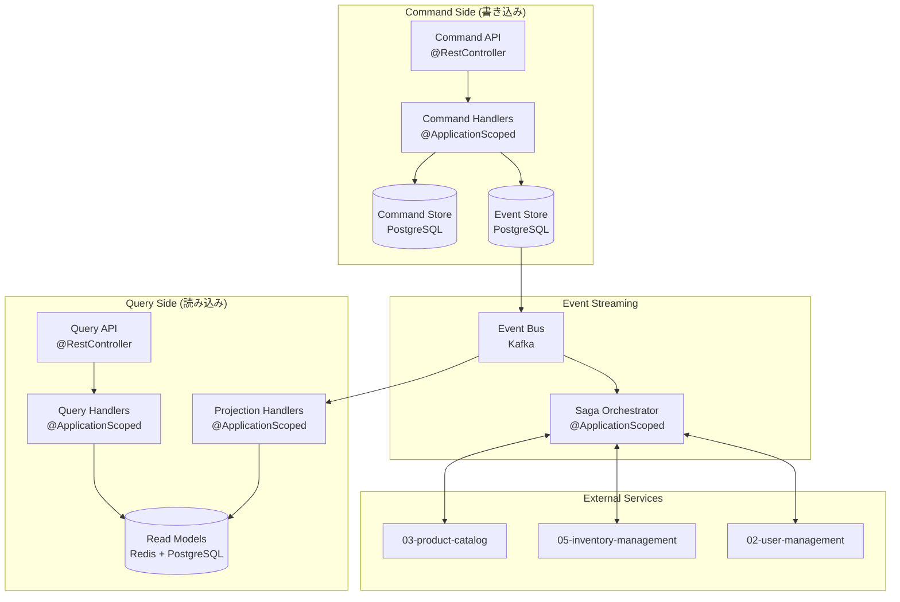
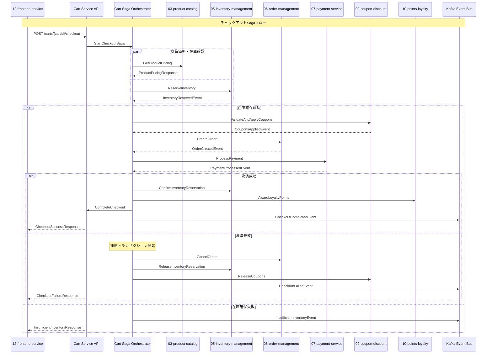

# Shopping Cart Service 詳細設計書

Quarkus + Jakarta EE 11 + Java 21 + MicroProfile実装

## 目次

1. [概要](#概要)
2. [技術仕様](#技術仕様)
3. [アーキテクチャ設計](#アーキテクチャ設計)
4. [Quarkus設定](#quarkus-config-settings)
5. [API設計](#api-design)
6. [データベース設計](#database-design)
7. [カート管理設計](#cart-management-design)
8. [セッション管理設計](#session-management-design)
9. [Docker設定](#docker-config)
10. [エラー処理](#error-handling)
11. [テスト設計](#テスト設計)
12. [監視・運用](#monitoring-operations)
13. [デプロイメント](#deployment)

## 概要

### サービス概要

Shopping Cart Serviceは、スキー用品販売ショップサイトのショッピングカート機能を担当するマイクロサービスです。Quarkus上でJakarta EE 11とMicroProfileを活用し、高性能かつスケーラブルなカート機能を提供します。

このショッピングカートサービスは、12のマイクロサービスで構成されるeコマースプラットフォームの中核機能を担います。特に以下のサービスとの密接な連携により、シームレスな購買体験を提供します：

- **12-frontend-service**: メインのユーザーインターフェース層
- **03-product-catalog-service**: 商品情報・価格・仕様の提供
- **05-inventory-management-service**: リアルタイム在庫管理・確保・監視
- **02-user-management-service**: ユーザー認証・プロファイル・セッション管理
- **06-order-management-service**: 注文処理・ワークフロー管理
- **07-payment-service**: 決済処理・トランザクション管理
- **09-coupon-discount-service**: クーポン・割引・プロモーション適用
- **10-points-loyalty-service**: ポイント・ロイヤルティプログラム統合

### アーキテクチャの特徴

本サービスは、現代的なマイクロサービスアーキテクチャのベストプラクティスを採用し、以下の設計原則に基づいて実装されています：

- **イベントドリブンアーキテクチャ**: Kafkaを利用した非同期イベント通信
- **CQRS (Command Query Responsibility Segregation)**: 読み取り・書き込み処理の最適化
- **Sagaパターン**: 分散トランザクション管理とデータ整合性保証
- **Circuit Breaker**: 外部サービス障害時の耐障害性確保
- **分散キャッシュ**: Redisによる高速データアクセス
- **分散トレーシング**: 全サービス間のリクエスト追跡・デバッグ

## 主な責任

### コア機能

- **カート管理**: 商品のカートへの追加・削除・数量変更
- **セッション管理**: ゲストカート・ユーザーカートの統合管理
- **価格計算**: 商品価格・税金・送料・割引の総合計算
- **在庫連携**: リアルタイム在庫確認・確保・監視
- **チェックアウト**: 分散トランザクションによる安全な購入処理

### マイクロサービス連携機能

- **商品情報連携**: 03-product-catalog-serviceから商品データ取得・検証
- **在庫管理連携**: 05-inventory-management-serviceとの在庫確保・解放・監視
- **ユーザー管理連携**: 02-user-management-serviceによる認証・認可・プロファイル管理
- **注文処理連携**: 06-order-management-serviceへのチェックアウトデータ移管
- **決済連携**: 07-payment-serviceとの決済処理・状態同期
- **クーポン連携**: 09-coupon-discount-serviceとのクーポン検証・適用
- **ポイント連携**: 10-points-loyalty-serviceとのポイント計算・付与・利用
- **フロントエンド連携**: 12-frontend-serviceへのリアルタイム状態通知・WebSocket通信

### ビジネス価値

- **購買体験向上**: スムーズなカート操作による顧客満足度向上
- **コンバージョン向上**: カート放棄率の削減（永続化＋リマインダー）
- **売上向上**: 関連商品提案による購買単価向上
- **データ活用**: カート行動分析による顧客理解とパーソナライゼーション

## 技術仕様

### Quarkus技術スタック

| 技術領域 | 技術/ライブラリ | バージョン | 用途 |
|---------|----------------|-----------|------|
| **Framework** | Quarkus | 3.16.5 | Jakarta EE 11 + MicroProfile実装 |
| **Runtime** | OpenJDK | 21 LTS | Java実行環境（Virtual Threads対応） |
| **Jakarta EE** | Jakarta EE Platform | 11.0 | エンタープライズフレームワーク |
| **Persistence** | Quarkus Hibernate ORM | 3.16.5 | Jakarta Persistence (JPA) 3.2 |
| **REST API** | Quarkus REST (RESTEasy) | 3.16.5 | Jakarta REST (JAX-RS) 4.0 |
| **CDI** | Quarkus CDI | 3.16.5 | Jakarta CDI 4.1 |
| **Validation** | Quarkus Validation | 3.16.5 | Jakarta Validation 3.1 |
| **JSON** | Quarkus Jackson | 3.16.5 | JSON処理 |
| **Database** | PostgreSQL | 16.x | 主データベース |
| **Cache** | Quarkus Redis | 3.16.5 | セッション・カートキャッシュ |
| **Messaging** | Quarkus Kafka | 3.16.5 | イベント駆動アーキテクチャ |
| **WebSocket** | Quarkus WebSocket | 3.16.5 | リアルタイム通信 |

### MicroProfile実装

| コンポーネント | Quarkus Extension | バージョン | 用途 |
|---------------|-------------------|-----------|------|
| **Metrics** | Quarkus Micrometer | 3.16.5 | メトリクス収集・監視 |
| **Tracing** | Quarkus OpenTelemetry | 3.16.5 | 分散トレーシング |
| **Health** | Quarkus Health | 3.16.5 | ヘルスチェック |
| **Config** | Quarkus Config | 3.16.5 | 設定管理 |
| **Rest Client** | Quarkus REST Client | 3.16.5 | 外部API連携 |
| **Fault Tolerance** | Quarkus Fault Tolerance | 3.16.5 | 障害耐性パターン |
| **JWT** | Quarkus JWT | 3.16.5 | セキュリティ・認証 |

### Java 21 LTS 活用機能

- **Virtual Threads**: 高並行カート処理とWebSocket接続管理
- **Record Classes**: 不変なカートDTO・イベントクラス
- **Pattern Matching**: カート状態・イベント判定の簡潔化
- **Text Blocks**: SQL文・JSON テンプレートの可読性向上
- **Sealed Classes**: カートイベント・例外の型安全性
- **Switch Expressions**: カート操作分岐の効率化

### コンテナ環境

- **Base Image**: `registry.access.redhat.com/ubi8/openjdk-21:latest`
- **Native Build**: GraalVM Native Image対応（起動速度・メモリ効率向上）
- **Container Runtime**: Docker/Podman
- **Orchestration**: Docker Compose（ローカル）、Kubernetes（本番）

## アーキテクチャ設計

### マイクロサービス連携アーキテクチャ

```mermaid
graph TB
    subgraph "Client Layer"
        WEB[12-frontend-service<br/>Web UI]
        MOBILE[Mobile App]
        API_CLIENT[External API Clients]
    end
    
    subgraph "API Gateway Layer"
        API_GW[01-api-gateway-service<br/>Unified API Gateway]
    end
    
    subgraph "Shopping Cart Service (08)"
        subgraph "Presentation Layer"
            CART_CONTROLLER[CartController<br/>@RestController]
            WS_ENDPOINT[WebSocketEndpoint<br/>Real-time Updates]
        end
        
        subgraph "Application Layer"
            CART_APP_SERVICE[CartApplicationService<br/>@ApplicationScoped]
            CART_SAGA[CartSagaOrchestrator<br/>@ApplicationScoped]
            CART_EVENT_HANDLER[CartEventHandler<br/>@ApplicationScoped]
        end
        
        subgraph "Domain Layer"
            CART_SERVICE[CartDomainService<br/>@ApplicationScoped]
            CART_AGGREGATE[Cart Aggregate]
            CART_REPO[CartRepository<br/>Panache]
        end
        
        subgraph "Infrastructure Layer"
            CACHE_SERVICE[CacheService<br/>Redis]
            EVENT_BUS[EventBus<br/>Kafka]
            EXTERNAL_CLIENTS[External Service Clients]
        end
    end
    
    subgraph "Connected Microservices"
        USER_SVC[02-user-management-service<br/>Authentication & User Info]
        PRODUCT_SVC[03-product-catalog-service<br/>Product Information]
        INVENTORY_SVC[05-inventory-management-service<br/>Stock Management]
        ORDER_SVC[06-order-management-service<br/>Order Processing]
        PAYMENT_SVC[07-payment-service<br/>Payment Processing]
        COUPON_SVC[09-coupon-discount-service<br/>Discounts & Coupons]
        LOYALTY_SVC[10-points-loyalty-service<br/>Points & Loyalty]
    end
    
    subgraph "Data & Messaging Layer"
        POSTGRES[(PostgreSQL<br/>Cart Data)]
        REDIS[(Redis<br/>Session & Cache)]
        KAFKA[(Kafka<br/>Event Streaming)]
    end
    
    subgraph "Monitoring & Observability"
        PROMETHEUS[Prometheus<br/>Metrics]
        JAEGER[Jaeger<br/>Distributed Tracing]
        LOKI[Loki<br/>Centralized Logging]
    end
    
    %% Client to API Gateway
    WEB --> API_GW
    MOBILE --> API_GW
    API_CLIENT --> API_GW
    
    %% API Gateway to Cart Service
    API_GW --> CART_CONTROLLER
    WEB -.->|WebSocket| WS_ENDPOINT
    
    %% Internal Cart Service Flow
    CART_CONTROLLER --> CART_APP_SERVICE
    WS_ENDPOINT --> CART_APP_SERVICE
    CART_APP_SERVICE --> CART_SERVICE
    CART_APP_SERVICE --> CART_SAGA
    CART_SERVICE --> CART_AGGREGATE
    CART_AGGREGATE --> CART_REPO
    
    %% Infrastructure Dependencies
    CART_REPO --> POSTGRES
    CART_APP_SERVICE --> CACHE_SERVICE
    CACHE_SERVICE --> REDIS
    CART_APP_SERVICE --> EVENT_BUS
    EVENT_BUS --> KAFKA
    
    %% Microservice Communications
    CART_APP_SERVICE <--> EXTERNAL_CLIENTS
    EXTERNAL_CLIENTS <--> USER_SVC
    EXTERNAL_CLIENTS <--> PRODUCT_SVC
    EXTERNAL_CLIENTS <--> INVENTORY_SVC
    EXTERNAL_CLIENTS <--> ORDER_SVC
    EXTERNAL_CLIENTS <--> PAYMENT_SVC
    EXTERNAL_CLIENTS <--> COUPON_SVC
    EXTERNAL_CLIENTS <--> LOYALTY_SVC
    
    %% Event-driven Communications
    EVENT_BUS -.->|Product Events| PRODUCT_SVC
    EVENT_BUS -.->|Inventory Events| INVENTORY_SVC
    EVENT_BUS -.->|Order Events| ORDER_SVC
    EVENT_BUS -.->|Payment Events| PAYMENT_SVC
    EVENT_BUS -.->|Coupon Events| COUPON_SVC
    EVENT_BUS -.->|Loyalty Events| LOYALTY_SVC
    
    %% Monitoring
    CART_APP_SERVICE -.->|Metrics| PROMETHEUS
    CART_APP_SERVICE -.->|Traces| JAEGER
    CART_APP_SERVICE -.->|Logs| LOKI
```

### イベントドリブンアーキテクチャ設計

#### カートイベントストリーム設計

```mermaid
graph TB
    subgraph "Cart Service Event Publishers"
        CART_EVENTS[Cart Domain Events]
        CART_COMMANDS[Cart Command Events]
        CART_SAGA_EVENTS[Cart Saga Events]
    end
    
    subgraph "Kafka Topics"
        CART_TOPIC[cart.events]
        PRODUCT_TOPIC[product.events]
        INVENTORY_TOPIC[inventory.events]
        ORDER_TOPIC[order.events]
        PAYMENT_TOPIC[payment.events]
        COUPON_TOPIC[coupon.events]
        LOYALTY_TOPIC[loyalty.events]
        SAGA_TOPIC[saga.orchestration]
    end
    
    subgraph "Event Consumers"
        PRODUCT_CONSUMER[Product Service<br/>Consumer]
        INVENTORY_CONSUMER[Inventory Service<br/>Consumer]
        ORDER_CONSUMER[Order Service<br/>Consumer]
        PAYMENT_CONSUMER[Payment Service<br/>Consumer]
        COUPON_CONSUMER[Coupon Service<br/>Consumer]
        LOYALTY_CONSUMER[Loyalty Service<br/>Consumer]
        CART_CONSUMER[Cart Service<br/>Consumer]
    end
    
    %% Event Publishing
    CART_EVENTS --> CART_TOPIC
    CART_COMMANDS --> SAGA_TOPIC
    CART_SAGA_EVENTS --> SAGA_TOPIC
    
    %% Cross-service Event Flow
    PRODUCT_TOPIC --> CART_CONSUMER
    INVENTORY_TOPIC --> CART_CONSUMER
    ORDER_TOPIC --> CART_CONSUMER
    PAYMENT_TOPIC --> CART_CONSUMER
    COUPON_TOPIC --> CART_CONSUMER
    LOYALTY_TOPIC --> CART_CONSUMER
    
    %% Event Consumption
    CART_TOPIC --> PRODUCT_CONSUMER
    CART_TOPIC --> INVENTORY_CONSUMER
    CART_TOPIC --> ORDER_CONSUMER
    CART_TOPIC --> PAYMENT_CONSUMER
    CART_TOPIC --> COUPON_CONSUMER
    CART_TOPIC --> LOYALTY_CONSUMER
    
    SAGA_TOPIC --> CART_CONSUMER
```



#### 主要イベント定義

##### 発行イベント (Outbound Events)

- `CartCreatedEvent`: カート作成時
- `CartItemAddedEvent`: 商品追加時  
- `CartItemRemovedEvent`: 商品削除時
- `CartItemQuantityUpdatedEvent`: 数量変更時
- `CartCheckedOutEvent`: チェックアウト開始時
- `CartAbandonedEvent`: カート放棄時
- `CartMergedEvent`: ゲスト・ユーザーカートマージ時

##### 購読イベント (Inbound Events)

- `ProductPriceUpdatedEvent`: 商品価格変更 (from 03-product-catalog)
- `ProductDiscontinuedEvent`: 商品廃止 (from 03-product-catalog)
- `InventoryDepletedEvent`: 在庫切れ (from 05-inventory-management)
- `InventoryRestoredEvent`: 在庫復活 (from 05-inventory-management)
- `OrderCreatedEvent`: 注文作成完了 (from 06-order-management)
- `PaymentCompletedEvent`: 決済完了 (from 07-payment-service)
- `CouponAppliedEvent`: クーポン適用 (from 09-coupon-discount)
- `LoyaltyPointsUpdatedEvent`: ポイント更新 (from 10-points-loyalty)

### CQRS (Command Query Responsibility Segregation) パターン実装

#### コマンド・クエリ分離アーキテクチャ



#### カートコマンド定義

```java
// コマンドインターフェース
public interface CartCommand {
    String getCartId();
    String getUserId();
}

// 具体的なコマンド実装
public record CreateCartCommand(
    String cartId,
    String userId,
    CartType cartType
) implements CartCommand {}

public record AddItemToCartCommand(
    String cartId,
    String userId,
    String productId,
    int quantity,
    BigDecimal unitPrice
) implements CartCommand {}

public record RemoveItemFromCartCommand(
    String cartId,
    String userId,
    String productId
) implements CartCommand {}

public record UpdateItemQuantityCommand(
    String cartId,
    String userId,
    String productId,
    int newQuantity
) implements CartCommand {}

public record ApplyCouponCommand(
    String cartId,
    String userId,
    String couponCode
) implements CartCommand {}

public record CheckoutCartCommand(
    String cartId,
    String userId,
    String deliveryAddress,
    PaymentMethod paymentMethod
) implements CartCommand {}
```

#### カートクエリ定義

```java
// クエリインターフェース
public interface CartQuery {
    String getUserId();
}

// 具体的なクエリ実装
public record GetCartByIdQuery(
    String cartId,
    String userId
) implements CartQuery {}

public record GetActiveCartsQuery(
    String userId
) implements CartQuery {}

public record GetCartSummaryQuery(
    String cartId,
    String userId
) implements CartQuery {}

public record GetCartItemsWithProductInfoQuery(
    String cartId,
    String userId
) implements CartQuery {}

public record GetAbandonedCartsQuery(
    LocalDateTime abandonedAfter,
    int pageSize,
    int pageNumber
) implements CartQuery {}
```

#### リードモデル設計

```java
// カート要約ビュー（高速アクセス用）
@Entity
@Table(name = "cart_summary_view")
public class CartSummaryView {
    @Id
    private String cartId;
    private String userId;
    private CartStatus status;
    private int totalItems;
    private BigDecimal totalAmount;
    private LocalDateTime lastUpdated;
    private List<String> appliedCoupons;
    
    // Redis用軽量バージョン
    @Cacheable("cart-summary")
    public CartSummaryDto toDto() {
        return new CartSummaryDto(
            cartId, userId, status, 
            totalItems, totalAmount, lastUpdated
        );
    }
}

// 商品詳細付きカートビュー（商品カタログサービス連携）
@Entity
@Table(name = "cart_items_with_product_view")
public class CartItemWithProductView {
    @Id
    private String cartItemId;
    private String cartId;
    private String productId;
    private String productName;
    private String productDescription;
    private BigDecimal currentPrice;
    private String imageUrl;
    private int quantity;
    private BigDecimal itemTotal;
    private boolean inStock;
    private int availableQuantity;
    
    // 商品カタログサービスから取得した最新情報でビューを更新
    public void updateFromProductCatalog(ProductInfoDto productInfo) {
        this.productName = productInfo.name();
        this.productDescription = productInfo.description();
        this.currentPrice = productInfo.price();
        this.imageUrl = productInfo.imageUrl();
    }
}
```

### Saga パターン実装（分散トランザクション管理）

#### チェックアウトSagaオーケストレーション



#### Sagaステート管理

```java
@Entity
@Table(name = "cart_saga_instances")
public class CartCheckoutSaga {
    @Id
    private String sagaId;
    private String cartId;
    private String userId;
    private SagaStatus status;
    private LocalDateTime startedAt;
    private LocalDateTime completedAt;
    private Map<String, Object> sagaData;
    private List<SagaStep> completedSteps;
    private List<SagaStep> compensationSteps;
    
    public enum SagaStatus {
        STARTED,
        PRODUCT_VALIDATION_COMPLETED,
        INVENTORY_RESERVED,
        COUPONS_APPLIED,
        ORDER_CREATED,
        PAYMENT_PROCESSED,
        COMPLETED,
        FAILED,
        COMPENSATED
    }
    
    public enum SagaStep {
        VALIDATE_PRODUCTS("ValidateProducts", "N/A"),
        RESERVE_INVENTORY("ReserveInventory", "ReleaseInventoryReservation"),
        APPLY_COUPONS("ApplyCoupons", "ReleaseCoupons"),
        CREATE_ORDER("CreateOrder", "CancelOrder"),
        PROCESS_PAYMENT("ProcessPayment", "RefundPayment"),
        AWARD_LOYALTY_POINTS("AwardLoyaltyPoints", "DeductLoyaltyPoints"),
        COMPLETE_CHECKOUT("CompleteCheckout", "RevertCheckout");
        
        private final String action;
        private final String compensation;
        
        SagaStep(String action, String compensation) {
            this.action = action;
            this.compensation = compensation;
        }
    }
}

@ApplicationScoped
public class CartSagaOrchestrator {
    
    @Inject
    @Channel("saga-commands")
    Emitter<SagaCommand> sagaCommandEmitter;
    
    @Inject
    CartSagaRepository sagaRepository;
    
    public String startCheckoutSaga(String cartId, String userId, CheckoutRequest request) {
        String sagaId = UUID.randomUUID().toString();
        
        CartCheckoutSaga saga = new CartCheckoutSaga();
        saga.setSagaId(sagaId);
        saga.setCartId(cartId);
        saga.setUserId(userId);
        saga.setStatus(SagaStatus.STARTED);
        saga.setStartedAt(LocalDateTime.now());
        saga.setSagaData(Map.of(
            "checkoutRequest", request,
            "totalAmount", request.getTotalAmount(),
            "deliveryAddress", request.getDeliveryAddress()
        ));
        
        sagaRepository.persist(saga);
        
        // 最初のステップ：商品価格検証
        validateProducts(sagaId, cartId);
        
        return sagaId;
    }
    
    @Incoming("product-validation-completed")
    public void handleProductValidationCompleted(ProductValidationCompletedEvent event) {
        CartCheckoutSaga saga = sagaRepository.findById(event.getSagaId());
        saga.setStatus(SagaStatus.PRODUCT_VALIDATION_COMPLETED);
        saga.getCompletedSteps().add(SagaStep.VALIDATE_PRODUCTS);
        
        // 次のステップ：在庫確保
        reserveInventory(saga.getSagaId(), saga.getCartId());
    }
    
    @Incoming("inventory-reserved")
    public void handleInventoryReserved(InventoryReservedEvent event) {
        CartCheckoutSaga saga = sagaRepository.findById(event.getSagaId());
        saga.setStatus(SagaStatus.INVENTORY_RESERVED);
        saga.getCompletedSteps().add(SagaStep.RESERVE_INVENTORY);
        
        // 次のステップ：クーポン適用
        applyCoupons(saga.getSagaId(), saga.getCartId());
    }
    
    // 補償トランザクション処理
    private void executeCompensation(CartCheckoutSaga saga, SagaStep failedStep) {
        List<SagaStep> stepsToCompensate = saga.getCompletedSteps()
            .stream()
            .filter(step -> step.ordinal() >= failedStep.ordinal())
            .sorted(Collections.reverseOrder())
            .toList();
            
        for (SagaStep step : stepsToCompensate) {
            executeCompensationStep(saga.getSagaId(), step);
        }
        
        saga.setStatus(SagaStatus.COMPENSATED);
        saga.setCompletedAt(LocalDateTime.now());
    }
}
```

#### 分散トレーシング統合

```java
@ApplicationScoped
public class TracedCartSagaOrchestrator {
    
    @Inject
    @ConfigProperty(name = "tracing.service.name", defaultValue = "cart-service")
    String serviceName;
    
    @Traced
    @WithSpan("cart-checkout-saga")
    public String startCheckoutSaga(
            @SpanAttribute("cart.id") String cartId,
            @SpanAttribute("user.id") String userId,
            CheckoutRequest request) {
        
        Span span = Span.current();
        span.setAttributes(Attributes.of(
            AttributeKey.stringKey("saga.type"), "checkout",
            AttributeKey.stringKey("cart.total.amount"), request.getTotalAmount().toString(),
            AttributeKey.longKey("cart.items.count"), request.getItemCount()
        ));
        
        String sagaId = UUID.randomUUID().toString();
        span.setAttributes(Attributes.of(
            AttributeKey.stringKey("saga.id"), sagaId
        ));
        
        try {
            return executeCheckoutSaga(sagaId, cartId, userId, request);
        } catch (Exception e) {
            span.recordException(e);
            span.setStatus(StatusCode.ERROR, e.getMessage());
            throw e;
        }
    }
    
    @Traced
    @WithSpan("saga-compensation")
    private void executeCompensation(
            @SpanAttribute("saga.id") String sagaId,
            @SpanAttribute("failed.step") String failedStep) {
        // 補償トランザクション実行
    }
}
```

### マイクロサービス統合仕様

#### 03-product-catalog-service 連携

```java
@RestClient
@RegisterRestClient(configKey = "product-catalog-service")
@ApplicationScoped
public interface ProductCatalogClient {
    
    @GET
    @Path("/products/{productId}")
    ProductDetailDto getProduct(@PathParam("productId") String productId);
    
    @POST
    @Path("/products/batch")
    List<ProductDetailDto> getProductsBatch(List<String> productIds);
    
    @GET
    @Path("/products/{productId}/pricing")
    ProductPricingDto getCurrentPricing(@PathParam("productId") String productId);
    
    @POST
    @Path("/products/validate-pricing")
    List<ProductPricingValidationDto> validateProductPricing(
        List<ProductPricingRequestDto> pricingRequests
    );
}

@ApplicationScoped
public class ProductCatalogIntegrationService {
    
    @Inject
    @RestClient
    ProductCatalogClient productCatalogClient;
    
    @Retry(maxRetries = 3, delay = 1000)
    @Fallback(fallbackMethod = "getProductFromCache")
    public ProductDetailDto getProductDetails(String productId) {
        return productCatalogClient.getProduct(productId);
    }
    
    @Incoming("product-price-updated")
    public void handleProductPriceUpdate(ProductPriceUpdatedEvent event) {
        // カート内の該当商品価格を更新
        cartReadModelUpdater.updateProductPricing(
            event.getProductId(), 
            event.getNewPrice()
        );
        
        // フロントエンドにリアルタイム通知
        cartWebSocketService.notifyPriceUpdate(
            event.getProductId(),
            event.getOldPrice(),
            event.getNewPrice()
        );
    }
    
    @Incoming("product-discontinued")
    public void handleProductDiscontinued(ProductDiscontinuedEvent event) {
        // カートから廃止商品を削除または警告表示
        cartService.handleDiscontinuedProduct(event.getProductId());
        
        // フロントエンドに廃止通知
        cartWebSocketService.notifyProductDiscontinued(event.getProductId());
    }
}
}
```

#### 05-inventory-management-service 連携

```java
@RestClient
@RegisterRestClient(configKey = "inventory-management-service")
@ApplicationScoped
public interface InventoryManagementClient {
    
    @GET
    @Path("/inventory/{productId}")
    InventoryStatusDto getInventoryStatus(@PathParam("productId") String productId);
    
    @POST
    @Path("/inventory/reserve")
    InventoryReservationDto reserveInventory(InventoryReservationRequestDto request);
    
    @POST
    @Path("/inventory/confirm-reservation")
    void confirmReservation(@QueryParam("reservationId") String reservationId);
    
    @POST
    @Path("/inventory/release-reservation")
    void releaseReservation(@QueryParam("reservationId") String reservationId);
    
    @POST
    @Path("/inventory/check-availability")
    List<InventoryAvailabilityDto> checkBatchAvailability(
        List<String> productIds
    );
}

@ApplicationScoped
public class InventoryIntegrationService {
    
    @Inject
    @RestClient
    InventoryManagementClient inventoryClient;
    
    @CircuitBreaker(requestVolumeThreshold = 4, failureRatio = 0.5, delay = 10000)
    @Retry(maxRetries = 2)
    public InventoryReservationDto reserveCartInventory(String cartId, List<CartItemDto> items) {
        InventoryReservationRequestDto request = new InventoryReservationRequestDto(
            cartId,
            items.stream()
                .map(item -> new InventoryItemRequestDto(
                    item.getProductId(), 
                    item.getQuantity()
                ))
                .toList()
        );
        return inventoryClient.reserveInventory(request);
    }
    
    @Incoming("inventory-depleted")
    public void handleInventoryDepleted(InventoryDepletedEvent event) {
        // カート内の在庫切れ商品に警告を表示
        cartService.markItemOutOfStock(event.getProductId());
        
        // フロントエンドにリアルタイム通知
        cartWebSocketService.notifyInventoryUpdate(
            event.getProductId(), 
            false
        );
    }
    
    @Incoming("inventory-restored")
    public void handleInventoryRestored(InventoryRestoredEvent event) {
        // カート内の商品在庫状態を復活
        cartService.markItemInStock(event.getProductId());
        
        // フロントエンドにリアルタイム通知
        cartWebSocketService.notifyInventoryUpdate(
            event.getProductId(), 
            true
        );
    }
}
```

#### 12-frontend-service 連携 (WebSocket + REST)

```java
@ServerEndpoint("/carts/{cartId}/websocket")
@ApplicationScoped
public class CartWebSocketEndpoint {
    
    private static Map<String, Session> userSessions = new ConcurrentHashMap<>();
    
    @OnOpen
    public void onOpen(Session session, @PathParam("cartId") String cartId) {
        String userId = extractUserIdFromSession(session);
        userSessions.put(userId, session);
        
        // 接続時に現在のカート状態を送信
        CartSummaryDto currentCart = cartQueryService.getCartSummary(cartId, userId);
        sendToUser(userId, new CartStateMessage("CART_CONNECTED", currentCart));
    }
    
    @OnMessage
    public void onMessage(String message, Session session, @PathParam("cartId") String cartId) {
        try {
            CartWebSocketMessage wsMessage = JsonUtil.fromJson(message, CartWebSocketMessage.class);
            String userId = extractUserIdFromSession(session);
            
            switch (wsMessage.getType()) {
                case "ADD_ITEM":
                    handleAddItem(cartId, userId, wsMessage.getPayload());
                    break;
                case "UPDATE_QUANTITY":
                    handleUpdateQuantity(cartId, userId, wsMessage.getPayload());
                    break;
                case "REMOVE_ITEM":
                    handleRemoveItem(cartId, userId, wsMessage.getPayload());
                    break;
                case "APPLY_COUPON":
                    handleApplyCoupon(cartId, userId, wsMessage.getPayload());
                    break;
            }
        } catch (Exception e) {
            sendError(session, "処理中にエラーが発生しました: " + e.getMessage());
        }
    }
    
    @Incoming("cart-updated")
    public void handleCartUpdated(CartUpdatedEvent event) {
        // 該当ユーザーのWebSocketセッションに更新を通知
        Session userSession = userSessions.get(event.getUserId());
        if (userSession != null && userSession.isOpen()) {
            CartSummaryDto updatedCart = cartQueryService.getCartSummary(
                event.getCartId(), 
                event.getUserId()
            );
            sendToSession(userSession, new CartStateMessage("CART_UPDATED", updatedCart));
        }
    }
    
    public void broadcastInventoryUpdate(String productId, boolean inStock) {
        CartInventoryUpdateMessage message = new CartInventoryUpdateMessage(
            "INVENTORY_UPDATE", 
            productId, 
            inStock
        );
        
        userSessions.values().forEach(session -> {
            if (session.isOpen()) {
                sendToSession(session, message);
            }
        });
    }
}

@RestController
@RequestMapping("/api/v1/carts")
@ApplicationScoped
public class CartController {
    
    @Inject
    CartApplicationService cartApplicationService;
    
    @GET
    @Path("/{cartId}")
    @RolesAllowed({"USER", "ADMIN"})
    public Response getCart(@PathParam("cartId") String cartId, @Context SecurityContext securityContext) {
        String userId = securityContext.getUserPrincipal().getName();
        CartDetailDto cart = cartApplicationService.getCartWithProductDetails(cartId, userId);
        return Response.ok(cart).build();
    }
    
    @POST
    @Path("/{cartId}/items")
    @RolesAllowed({"USER", "ADMIN"})
    public Response addItemToCart(
            @PathParam("cartId") String cartId,
            @Valid AddItemToCartRequest request,
            @Context SecurityContext securityContext) {
        
        String userId = securityContext.getUserPrincipal().getName();
        
        AddItemToCartCommand command = new AddItemToCartCommand(
            cartId, userId, request.getProductId(), 
            request.getQuantity(), request.getUnitPrice()
        );
        
        CartItemDto addedItem = cartApplicationService.addItemToCart(command);
        return Response.status(Response.Status.CREATED).entity(addedItem).build();
    }
    
    @POST
    @Path("/{cartId}/checkout")
    @RolesAllowed({"USER", "ADMIN"})
    @Traced
    public Response checkout(
            @PathParam("cartId") String cartId,
            @Valid CheckoutRequest request,
            @Context SecurityContext securityContext) {
        
        String userId = securityContext.getUserPrincipal().getName();
        
        CheckoutCartCommand command = new CheckoutCartCommand(
            cartId, userId, request.getDeliveryAddress(), request.getPaymentMethod()
        );
        
        String sagaId = cartApplicationService.startCheckout(command);
        
        CheckoutResponseDto response = new CheckoutResponseDto(
            sagaId, 
            "チェックアウトを開始しました", 
            CheckoutStatus.STARTED
        );
        
#### 04-authentication-service 連携

```java
@RestClient
@RegisterRestClient(configKey = "authentication-service")
@ApplicationScoped
public interface AuthenticationServiceClient {
    
    @POST
    @Path("/auth/validate-token")
    TokenValidationResponse validateToken(TokenValidationRequest request);
    
    @GET
    @Path("/auth/user-info")
    UserInfoResponse getUserInfo(@HeaderParam("Authorization") String bearerToken);
    
    @POST
    @Path("/auth/refresh-token")
    TokenRefreshResponse refreshToken(TokenRefreshRequest request);
    
    @GET
    @Path("/users/{userId}")
    UserDetailDto getUserDetails(@PathParam("userId") String userId);
}

@ApplicationScoped
public class AuthenticationIntegrationService {
    
    @Inject
    @RestClient
    AuthenticationServiceClient authClient;
    
    @Retry(maxRetries = 3, delay = 1000)
    @Fallback(fallbackMethod = "validateTokenFallback")
    public TokenValidationResponse validateUserToken(String token) {
        TokenValidationRequest request = new TokenValidationRequest(token);
        return authClient.validateToken(request);
    }
    
    @CircuitBreaker(requestVolumeThreshold = 4, failureRatio = 0.5, delay = 10000)
    public UserDetailDto getUserProfile(String userId) {
        return authClient.getUserDetails(userId);
    }
    
    public TokenValidationResponse validateTokenFallback(String token) {
        // フォールバック: キャッシュされたユーザー情報を使用
        return new TokenValidationResponse(false, "Authentication service unavailable");
    }
    
    @Incoming("user-profile-updated")
    public void handleUserProfileUpdated(UserProfileUpdatedEvent event) {
        // ユーザープロファイル更新時の処理
        cartCacheService.invalidateUserCartCache(event.getUserId());
    }
}
```

#### 01-api-gateway-service 統合

```java
@ApplicationScoped
public class ApiGatewayIntegrationService {
    
    @Inject
    @ConfigProperty(name = "api.gateway.base-url")
    String gatewayBaseUrl;
    
    @Inject
    @ConfigProperty(name = "api.gateway.service-path")
    String cartServicePath;
    
    // API Gateway経由でのサービス呼び出し用のクライアント
    @RestClient
    @RegisterRestClient(configKey = "api-gateway")
    public interface GatewayCartClient {
        
        @GET
        @Path("/carts/{cartId}")
        CartResponse getCartViaGateway(
            @PathParam("cartId") String cartId,
            @HeaderParam("Authorization") String authorization
        );
        
        @POST
        @Path("/carts/{cartId}/items")
        CartResponse addItemViaGateway(
            @PathParam("cartId") String cartId,
            AddItemRequest request,
            @HeaderParam("Authorization") String authorization
        );
    }
    
    public String getServiceRegistrationPath() {
        return gatewayBaseUrl + cartServicePath;
    }
    
    // ヘルスチェック情報をAPI Gatewayに提供
    @GET
    @Path("/gateway/health")
    @Produces(MediaType.APPLICATION_JSON)
    public Response getHealthForGateway() {
        return Response.ok(Map.of(
            "service", "shopping-cart-service",
            "status", "UP",
            "version", "1.0.0",
            "timestamp", LocalDateTime.now()
        )).build();
    }
}
```

### パフォーマンス最適化・キャッシュ戦略

#### Redis分散キャッシュ設計

```java
@ApplicationScoped
public class CartCacheService {
    
    @Inject
    @RedisClientName("cart-cache")
    RedisDataSource redis;
    
    private static final String CART_SUMMARY_KEY = "cart:summary:";
    private static final String CART_ITEMS_KEY = "cart:items:";
    private static final String USER_CARTS_KEY = "user:carts:";
    private static final Duration CACHE_TTL = Duration.ofHours(24);
    private static final Duration SESSION_TTL = Duration.ofHours(8);
    
    @CacheResult(cacheName = "cart-summaries")
    public CartSummaryDto getCachedCartSummary(String cartId, String userId) {
        String key = CART_SUMMARY_KEY + cartId;
        String cachedJson = redis.value(String.class).get(key);
        
        if (cachedJson != null) {
            return JsonUtil.fromJson(cachedJson, CartSummaryDto.class);
        }
        
        // キャッシュミス時はデータベースから取得してキャッシュに保存
        CartSummaryDto summary = cartRepository.findCartSummary(cartId, userId);
        if (summary != null) {
            cacheCartSummary(cartId, summary);
        }
        return summary;
    }
    
    @CacheInvalidate(cacheName = "cart-summaries")
    public void invalidateCartSummary(String cartId) {
        String key = CART_SUMMARY_KEY + cartId;
        redis.key().del(key);
    }
    
    // セッションベースのゲストカート管理
    public void storeGuestCart(String sessionId, GuestCartDto guestCart) {
        String key = "guest:cart:" + sessionId;
        String cartJson = JsonUtil.toJson(guestCart);
        redis.value(String.class).setex(key, SESSION_TTL.getSeconds(), cartJson);
    }
    
    public GuestCartDto getGuestCart(String sessionId) {
        String key = "guest:cart:" + sessionId;
        String cartJson = redis.value(String.class).get(key);
        return cartJson != null ? JsonUtil.fromJson(cartJson, GuestCartDto.class) : null;
    }
    
    // ユーザーログイン時のカートマージ処理
    @Transactional
    public CartDto mergeGuestCartWithUserCart(String sessionId, String userId) {
        GuestCartDto guestCart = getGuestCart(sessionId);
        if (guestCart == null || guestCart.getItems().isEmpty()) {
            return getCurrentUserCart(userId);
        }
        
        CartDto userCart = getCurrentUserCart(userId);
        if (userCart == null) {
            // ユーザーカートが存在しない場合、ゲストカートをユーザーカートに変換
            return convertGuestCartToUserCart(guestCart, userId);
        }
        
        // 両方存在する場合はマージ
        return mergeCartItems(userCart, guestCart, userId);
    }
}

@ApplicationScoped
public class CartPerformanceService {
    
    @Inject
    @ConfigProperty(name = "cart.batch.size", defaultValue = "50")
    int batchSize;
    
    @Inject
    @ConfigProperty(name = "cart.concurrent.operations", defaultValue = "10")
    int concurrentOperations;
    
    // 大量商品の並列在庫確認
    @Timeout(value = 5, unit = ChronoUnit.SECONDS)
    public CompletionStage<List<InventoryStatusDto>> checkInventoryBatch(List<String> productIds) {
        List<List<String>> batches = Lists.partition(productIds, batchSize);
        
        List<CompletionStage<List<InventoryStatusDto>>> futures = batches.stream()
            .map(batch -> inventoryClient.checkBatchAvailabilityAsync(batch))
            .toList();
        
        return CompletableFuture.allOf(futures.toArray(new CompletableFuture[0]))
            .thenApply(v -> futures.stream()
                .map(CompletionStage::toCompletableFuture)
                .map(CompletableFuture::join)
                .flatMap(List::stream)
                .toList()
            );
    }
    
    // 商品情報の並列取得
    @Timeout(value = 3, unit = ChronoUnit.SECONDS)
    public CompletionStage<List<ProductDetailDto>> getProductDetailsBatch(List<String> productIds) {
        return productCatalogClient.getProductsBatchAsync(productIds)
            .thenApply(products -> {
                // 取得した商品情報をキャッシュに保存
                products.forEach(product -> 
                    productCacheService.cacheProduct(product.getId(), product)
                );
                return products;
            });
    }
}
```

#### 分散監視・可観測性

```java
@ApplicationScoped
public class CartMetricsService {
    
    @Inject
    MeterRegistry meterRegistry;
    
    private final Counter cartCreatedCounter;
    private final Counter itemAddedCounter;
    private final Counter checkoutStartedCounter;
    private final Counter checkoutCompletedCounter;
    private final Timer checkoutDurationTimer;
    private final Gauge activeCartsGauge;
    
    public CartMetricsService(MeterRegistry meterRegistry) {
        this.meterRegistry = meterRegistry;
        this.cartCreatedCounter = Counter.builder("cart.created.total")
            .description("Total number of carts created")
            .register(meterRegistry);
            
        this.itemAddedCounter = Counter.builder("cart.item.added.total")
            .description("Total number of items added to carts")
            .register(meterRegistry);
            
        this.checkoutStartedCounter = Counter.builder("cart.checkout.started.total")
            .description("Total number of checkout processes started")
            .register(meterRegistry);
            
        this.checkoutCompletedCounter = Counter.builder("cart.checkout.completed.total")
            .description("Total number of checkout processes completed")
            .tag("status", "success")
            .register(meterRegistry);
            
        this.checkoutDurationTimer = Timer.builder("cart.checkout.duration")
            .description("Duration of checkout process")
            .register(meterRegistry);
            
        this.activeCartsGauge = Gauge.builder("cart.active.count")
            .description("Number of currently active carts")
            .register(meterRegistry, this, CartMetricsService::getActiveCartCount);
    }
    
    public void recordCartCreated(String cartType) {
        cartCreatedCounter.increment(Tags.of("type", cartType));
    }
    
    public void recordItemAdded(String productCategory) {
        itemAddedCounter.increment(Tags.of("category", productCategory));
    }
    
    public void recordCheckoutStarted() {
        checkoutStartedCounter.increment();
    }
    
    public Timer.Sample startCheckoutTimer() {
        return Timer.start(meterRegistry);
    }
    
    public void recordCheckoutCompleted(Timer.Sample sample, boolean success, String failureReason) {
        sample.stop(checkoutDurationTimer);
        
        Tags tags = success ? 
            Tags.of("status", "success") : 
            Tags.of("status", "failure", "reason", failureReason);
            
        checkoutCompletedCounter.increment(tags);
    }
    
    private double getActiveCartCount() {
        return cartRepository.countActiveCarts();
    }
}

@Component
public class CartHealthIndicator implements HealthIndicator {
    
    @Inject
    CartRepository cartRepository;
    
    @Inject
    RedisDataSource redis;
    
    @Inject
    @RestClient
    ProductCatalogClient productCatalogClient;
    
    @Override
    public Health health() {
        try {
            // データベース接続確認
            long cartCount = cartRepository.count();
            
            // Redis接続確認
            redis.key().exists("health:check");
            
            // 外部サービス接続確認（タイムアウト設定あり）
            CompletableFuture<Boolean> productServiceHealth = CompletableFuture
                .supplyAsync(() -> checkProductCatalogHealth())
                .orTimeout(2, TimeUnit.SECONDS);
            
            boolean externalServicesHealthy = productServiceHealth.get();
            
            if (externalServicesHealthy) {
                return Health.up()
                    .withDetail("carts.count", cartCount)
                    .withDetail("redis.status", "UP")
                    .withDetail("external.services", "UP")
                    .build();
            } else {
                return Health.down()
                    .withDetail("carts.count", cartCount)
                    .withDetail("redis.status", "UP")
                    .withDetail("external.services", "DOWN")
                    .build();
            }
            
        } catch (Exception e) {
            return Health.down()
                .withException(e)
                .build();
        }
    }
    
    private boolean checkProductCatalogHealth() {
        try {
            productCatalogClient.healthCheck();
            return true;
        } catch (Exception e) {
            Log.warn("Product catalog service health check failed", e);
            return false;
        }
    }
}
```

#### 設定ファイル統合 {#quarkus-config-settings}

```properties
# Quarkus 3.16.5 + Jakarta EE 11 設定
quarkus.application.name=shopping-cart-service
quarkus.application.version=1.0.0
quarkus.profile=prod

# HTTP設定
quarkus.http.port=8080
quarkus.http.cors=true
quarkus.http.cors.origins=http://localhost:3000,https://frontend.company.com
quarkus.http.limits.max-body-size=10M

# データベース設定（PostgreSQL）
quarkus.datasource.db-kind=postgresql
quarkus.datasource.username=${DB_USERNAME:cart_user}
quarkus.datasource.password=${DB_PASSWORD:cart_password}
quarkus.datasource.jdbc.url=jdbc:postgresql://${DB_HOST:localhost}:${DB_PORT:5432}/${DB_NAME:cartdb}
quarkus.datasource.jdbc.min-size=5
quarkus.datasource.jdbc.max-size=20

# Hibernate設定
quarkus.hibernate-orm.database.generation=validate
quarkus.hibernate-orm.sql-load-script=import.sql
quarkus.hibernate-orm.log.sql=false

# Redis設定
quarkus.redis.hosts=redis://${REDIS_HOST:localhost}:${REDIS_PORT:6379}
quarkus.redis.password=${REDIS_PASSWORD:}
quarkus.redis.database=0
quarkus.redis.timeout=5s
quarkus.redis.max-pool-size=20
quarkus.redis.max-pool-waiting=30

# Kafka設定
kafka.bootstrap.servers=${KAFKA_BOOTSTRAP_SERVERS:localhost:9092}
mp.messaging.outgoing.cart-events.connector=smallrye-kafka
mp.messaging.outgoing.cart-events.topic=cart.events
mp.messaging.outgoing.cart-events.value.serializer=io.quarkus.kafka.client.serialization.JsonObjectSerializer

mp.messaging.incoming.product-events.connector=smallrye-kafka
mp.messaging.incoming.product-events.topic=product.events
mp.messaging.incoming.product-events.value.deserializer=io.quarkus.kafka.client.serialization.JsonObjectDeserializer

mp.messaging.incoming.inventory-events.connector=smallrye-kafka
mp.messaging.incoming.inventory-events.topic=inventory.events
mp.messaging.incoming.inventory-events.value.deserializer=io.quarkus.kafka.client.serialization.JsonObjectDeserializer

# 外部サービス設定
quarkus.rest-client.product-catalog-service.url=${PRODUCT_CATALOG_URL:http://localhost:8081}
quarkus.rest-client.product-catalog-service.scope=javax.inject.Singleton
quarkus.rest-client.product-catalog-service.connection-timeout=5000
quarkus.rest-client.product-catalog-service.read-timeout=10000

quarkus.rest-client.inventory-management-service.url=${INVENTORY_SERVICE_URL:http://localhost:8082}
quarkus.rest-client.inventory-management-service.scope=javax.inject.Singleton

quarkus.rest-client.user-management-service.url=${USER_SERVICE_URL:http://localhost:8081}
quarkus.rest-client.user-management-service.scope=javax.inject.Singleton

quarkus.rest-client.authentication-service.url=${AUTH_SERVICE_URL:http://localhost:8083}
quarkus.rest-client.authentication-service.scope=javax.inject.Singleton
quarkus.rest-client.authentication-service.connection-timeout=5000
quarkus.rest-client.authentication-service.read-timeout=10000

quarkus.rest-client.api-gateway.url=${API_GATEWAY_URL:http://localhost:8080}
quarkus.rest-client.api-gateway.scope=javax.inject.Singleton
quarkus.rest-client.api-gateway.connection-timeout=5000
quarkus.rest-client.api-gateway.read-timeout=10000

# セキュリティ設定
quarkus.oidc.auth-server-url=${OIDC_AUTH_SERVER_URL:http://localhost:8083/auth/realms/shopping}
quarkus.oidc.client-id=${OIDC_CLIENT_ID:shopping-cart-service}
quarkus.oidc.credentials.secret=${OIDC_CLIENT_SECRET:cart-secret}

# 監視・可観測性設定
quarkus.micrometer.enabled=true
quarkus.micrometer.registry-enabled-default=true
quarkus.micrometer.export.prometheus.enabled=true
quarkus.micrometer.export.prometheus.path=/metrics

# 分散トレーシング設定
quarkus.opentelemetry.enabled=true
quarkus.opentelemetry.tracer.exporter.otlp.endpoint=${OTLP_ENDPOINT:http://localhost:4317}
quarkus.opentelemetry.tracer.resource-attributes="service.name=shopping-cart-service,service.version=1.0.0"

# ヘルスチェック設定
quarkus.smallrye-health.enabled=true
quarkus.smallrye-health.ui.enable=true

# キャッシュ設定
quarkus.cache.caffeine.cart-summaries.maximum-size=1000
quarkus.cache.caffeine.cart-summaries.expire-after-write=PT30M

# パフォーマンス設定
cart.batch.size=${CART_BATCH_SIZE:50}
cart.concurrent.operations=${CART_CONCURRENT_OPS:10}
cart.abandoned.cleanup.interval=${CART_CLEANUP_INTERVAL:PT6H}
cart.session.timeout=${CART_SESSION_TIMEOUT:PT8H}

# レジリエンス設定
quarkus.fault-tolerance.enabled=true

# CircuitBreaker設定（各外部サービス用）
microprofile.fault.tolerance.circuit-breaker.product-service.requestVolumeThreshold=4
microprofile.fault.tolerance.circuit-breaker.product-service.failureRatio=0.5
microprofile.fault.tolerance.circuit-breaker.product-service.delay=10000

microprofile.fault.tolerance.circuit-breaker.inventory-service.requestVolumeThreshold=4
microprofile.fault.tolerance.circuit-breaker.inventory-service.failureRatio=0.5
microprofile.fault.tolerance.circuit-breaker.inventory-service.delay=10000

# Retry設定
microprofile.fault.tolerance.retry.maxRetries=3
microprofile.fault.tolerance.retry.delay=1000
microprofile.fault.tolerance.retry.maxDuration=10000

# Timeout設定
microprofile.fault.tolerance.timeout.value=5000

# ログ設定
quarkus.log.level=INFO
quarkus.log.category."com.company.cart".level=DEBUG
quarkus.log.console.format=%d{yyyy-MM-dd HH:mm:ss,SSS} %-5p [%c{3.}] (%t) %s%e%n

# 本番環境用設定
%prod.quarkus.datasource.jdbc.max-size=50
%prod.quarkus.redis.max-pool-size=50
%prod.quarkus.log.level=WARN
%prod.quarkus.log.category."com.company.cart".level=INFO

# 開発環境用設定
%dev.quarkus.log.category."com.company.cart".level=DEBUG
%dev.quarkus.hibernate-orm.log.sql=true
%dev.quarkus.redis.database=1
```

### pom.xml依存関係

```xml
<?xml version="1.0" encoding="UTF-8"?>
<project xmlns="http://maven.apache.org/POM/4.0.0"
         xmlns:xsi="http://www.w3.org/2001/XMLSchema-instance"
         xsi:schemaLocation="http://maven.apache.org/POM/4.0.0 
         https://maven.apache.org/xsd/maven-4.0.0.xsd">
    <modelVersion>4.0.0</modelVersion>

    <groupId>com.skishop</groupId>
    <artifactId>shopping-cart-service</artifactId>
    <version>1.0.0-SNAPSHOT</version>
    <packaging>jar</packaging>

    <properties>
        <maven.compiler.source>21</maven.compiler.source>
        <maven.compiler.target>21</maven.compiler.target>
        <maven.compiler.release>21</maven.compiler.release>
        <quarkus.platform.version>3.16.5</quarkus.platform.version>
        <project.build.sourceEncoding>UTF-8</project.build.sourceEncoding>
        <project.reporting.outputEncoding>UTF-8</project.reporting.outputEncoding>
    </properties>

    <dependencyManagement>
        <dependencies>
            <dependency>
                <groupId>io.quarkus</groupId>
                <artifactId>quarkus-bom</artifactId>
                <version>${quarkus.platform.version}</version>
                <type>pom</type>
                <scope>import</scope>
            </dependency>
        </dependencies>
    </dependencyManagement>

    <dependencies>
        <!-- Jakarta EE Core -->
        <dependency>
            <groupId>io.quarkus</groupId>
            <artifactId>quarkus-rest-jackson</artifactId>
        </dependency>
        <dependency>
            <groupId>io.quarkus</groupId>
            <artifactId>quarkus-hibernate-orm-panache</artifactId>
        </dependency>
        <dependency>
            <groupId>io.quarkus</groupId>
            <artifactId>quarkus-hibernate-validator</artifactId>
        </dependency>
        <dependency>
            <groupId>io.quarkus</groupId>
            <artifactId>quarkus-websockets</artifactId>
        </dependency>

        <!-- Database -->
        <dependency>
            <groupId>io.quarkus</groupId>
            <artifactId>quarkus-jdbc-postgresql</artifactId>
        </dependency>
        <dependency>
            <groupId>io.quarkus</groupId>
            <artifactId>quarkus-flyway</artifactId>
        </dependency>

        <!-- Caching & Messaging -->
        <dependency>
            <groupId>io.quarkus</groupId>
            <artifactId>quarkus-redis-client</artifactId>
        </dependency>
        <dependency>
            <groupId>io.quarkus</groupId>
            <artifactId>quarkus-kafka-client</artifactId>
        </dependency>

        <!-- MicroProfile -->
        <dependency>
            <groupId>io.quarkus</groupId>
            <artifactId>quarkus-rest-client-jackson</artifactId>
        </dependency>
        <dependency>
            <groupId>io.quarkus</groupId>
            <artifactId>quarkus-fault-tolerance</artifactId>
        </dependency>
        <dependency>
            <groupId>io.quarkus</groupId>
            <artifactId>quarkus-micrometer-registry-prometheus</artifactId>
        </dependency>
        <dependency>
            <groupId>io.quarkus</groupId>
            <artifactId>quarkus-opentelemetry</artifactId>
        </dependency>
        <dependency>
            <groupId>io.quarkus</groupId>
            <artifactId>quarkus-smallrye-health</artifactId>
        </dependency>

        <!-- Security -->
        <dependency>
            <groupId>io.quarkus</groupId>
            <artifactId>quarkus-smallrye-jwt</artifactId>
        </dependency>
        <dependency>
            <groupId>io.quarkus</groupId>
            <artifactId>quarkus-security</artifactId>
        </dependency>

        <!-- Testing -->
        <dependency>
            <groupId>io.quarkus</groupId>
            <artifactId>quarkus-junit5</artifactId>
            <scope>test</scope>
        </dependency>
        <dependency>
            <groupId>io.rest-assured</groupId>
            <artifactId>rest-assured</artifactId>
            <scope>test</scope>
        </dependency>
        <dependency>
            <groupId>io.quarkus</groupId>
            <artifactId>quarkus-test-h2</artifactId>
            <scope>test</scope>
        </dependency>
        <dependency>
            <groupId>io.quarkus</groupId>
            <artifactId>quarkus-test-kafka-companion</artifactId>
            <scope>test</scope>
        </dependency>
    </dependencies>

    <build>
        <plugins>
            <plugin>
                <groupId>io.quarkus</groupId>
                <artifactId>quarkus-maven-plugin</artifactId>
                <version>${quarkus.platform.version}</version>
                <extensions>true</extensions>
                <executions>
                    <execution>
                        <goals>
                            <goal>build</goal>
                            <goal>generate-code</goal>
                            <goal>generate-code-tests</goal>
                        </goals>
                    </execution>
                </executions>
            </plugin>
            <plugin>
                <groupId>org.apache.maven.plugins</groupId>
                <artifactId>maven-compiler-plugin</artifactId>
                <version>3.13.0</version>
                <configuration>
                    <release>21</release>
                    <parameters>true</parameters>
                </configuration>
            </plugin>
        </plugins>
    </build>

    <profiles>
        <profile>
            <id>native</id>
            <properties>
                <quarkus.native.enabled>true</quarkus.native.enabled>
                <quarkus.native.container-build>true</quarkus.native.container-build>
            </properties>
        </profile>
    </profiles>
</project>
```

### application.properties

```properties
# =====================================
# Application Configuration
# =====================================
quarkus.application.name=shopping-cart-service
quarkus.application.version=1.0.0

# =====================================
# HTTP Configuration
# =====================================
quarkus.http.port=8088
quarkus.http.host=0.0.0.0
quarkus.http.cors=true
quarkus.http.cors.origins=*
quarkus.http.cors.methods=GET,POST,PUT,DELETE,OPTIONS
quarkus.http.cors.headers=accept,authorization,content-type,x-requested-with

# =====================================
# Virtual Threads (Java 21)
# =====================================
quarkus.virtual-threads.enabled=true

# =====================================
# Database Configuration (PostgreSQL)
# =====================================
quarkus.datasource.db-kind=postgresql
quarkus.datasource.username=${DB_USERNAME:cartuser}
quarkus.datasource.password=${DB_PASSWORD:cartpass}
quarkus.datasource.jdbc.url=${DB_URL:jdbc:postgresql://localhost:85432/cartdb}
quarkus.datasource.jdbc.min-size=5
quarkus.datasource.jdbc.max-size=20
quarkus.datasource.jdbc.acquisition-timeout=5

# Hibernate ORM
quarkus.hibernate-orm.database.generation=none
quarkus.hibernate-orm.log.sql=true
quarkus.hibernate-orm.log.format-sql=true
quarkus.hibernate-orm.dialect=org.hibernate.dialect.PostgreSQLDialect

# Flyway Migration
quarkus.flyway.migrate-at-start=true
quarkus.flyway.baseline-on-migrate=true

# =====================================
# Redis Configuration
# =====================================
quarkus.redis.hosts=${REDIS_URL:redis://localhost:86379}
quarkus.redis.timeout=3s
quarkus.redis.max-pool-size=20
quarkus.redis.max-pool-waiting=10

# =====================================
# Kafka Configuration
# =====================================
kafka.bootstrap.servers=${KAFKA_BOOTSTRAP_SERVERS:localhost:89092}

# Outgoing Events
mp.messaging.outgoing.cart-events.connector=smallrye-kafka
mp.messaging.outgoing.cart-events.topic=cart.events
mp.messaging.outgoing.cart-events.value.serializer=io.quarkus.kafka.client.serialization.ObjectMapperSerializer
mp.messaging.outgoing.cart-events.key.serializer=org.apache.kafka.common.serialization.StringSerializer

# =====================================
# External Services (REST Clients)
# =====================================
# Product Service
com.skishop.cart.client.ProductClient/mp-rest/url=${PRODUCT_SERVICE_URL:http://localhost:8081}
com.skishop.cart.client.ProductClient/mp-rest/connectTimeout=5000
com.skishop.cart.client.ProductClient/mp-rest/readTimeout=10000

# Inventory Service
com.skishop.cart.client.InventoryClient/mp-rest/url=${INVENTORY_SERVICE_URL:http://localhost:8082}
com.skishop.cart.client.InventoryClient/mp-rest/connectTimeout=5000
com.skishop.cart.client.InventoryClient/mp-rest/readTimeout=10000

# User Service
com.skishop.cart.client.UserClient/mp-rest/url=${USER_SERVICE_URL:http://localhost:8083}
com.skishop.cart.client.UserClient/mp-rest/connectTimeout=5000
com.skishop.cart.client.UserClient/mp-rest/readTimeout=10000

# =====================================
# MicroProfile Configuration
# =====================================
# Health Check
mp.health.default.readiness.empty.response=UP

# Metrics
quarkus.micrometer.enabled=true
quarkus.micrometer.export.prometheus.enabled=true
quarkus.micrometer.export.prometheus.path=/metrics

# OpenTelemetry Tracing
quarkus.opentelemetry.enabled=true
quarkus.opentelemetry.tracer.exporter.otlp.endpoint=${JAEGER_ENDPOINT:http://localhost:14250}

# Fault Tolerance
mp.fault-tolerance.interceptor.priority=100

# =====================================
# Security Configuration
# =====================================
# JWT
mp.jwt.verify.issuer=${JWT_ISSUER:https://auth.skishop.com}
mp.jwt.verify.publickey.location=${JWT_PUBLIC_KEY_LOCATION:META-INF/publicKey.pem}

# =====================================
# Caching Configuration
# =====================================
quarkus.cache.caffeine.cart-cache.initial-capacity=100
quarkus.cache.caffeine.cart-cache.maximum-size=1000
quarkus.cache.caffeine.cart-cache.expire-after-write=PT30M

# =====================================
# Business Configuration
# =====================================
# Cart Settings
cart.session.timeout.minutes=30
cart.guest.timeout.hours=24
cart.max.items.per.cart=50
cart.max.quantity.per.item=10

# Currency
cart.default.currency=JPY
cart.tax.rate=0.10
cart.free.shipping.threshold=5000

# =====================================
# Development Configuration
# =====================================
%dev.quarkus.log.level=INFO
%dev.quarkus.log.category."com.skishop.cart".level=DEBUG
%dev.quarkus.hibernate-orm.log.sql=true

# Test Configuration
%test.quarkus.datasource.db-kind=h2
%test.quarkus.datasource.jdbc.url=jdbc:h2:mem:testdb
%test.quarkus.hibernate-orm.database.generation=drop-and-create
```

### ドメインモデル設計（Quarkus Panache）

```java
// カートエンティティ（Quarkus Panache Active Record）
@Entity
@Table(name = "shopping_carts")
public class ShoppingCart extends PanacheEntityBase {
    
    @Id
    @GeneratedValue(strategy = GenerationType.UUID)
    public UUID id;
    
    @Column(name = "cart_id", unique = true, nullable = false)
    public String cartId;
    
    @Column(name = "customer_id")
    public UUID customerId;
    
    @Column(name = "session_id")
    public String sessionId;
    
    @Enumerated(EnumType.STRING)
    @Column(name = "status", nullable = false)
    public CartStatus status = CartStatus.ACTIVE;
    
    @Column(name = "currency", length = 3, nullable = false)
    public String currency = "JPY";
    
    @Column(name = "subtotal_amount", precision = 12, scale = 2)
    public BigDecimal subtotalAmount = BigDecimal.ZERO;
    
    @Column(name = "tax_amount", precision = 12, scale = 2)
    public BigDecimal taxAmount = BigDecimal.ZERO;
    
    @Column(name = "shipping_amount", precision = 12, scale = 2)
    public BigDecimal shippingAmount = BigDecimal.ZERO;
    
    @Column(name = "discount_amount", precision = 12, scale = 2)
    public BigDecimal discountAmount = BigDecimal.ZERO;
    
    @Column(name = "total_amount", precision = 12, scale = 2)
    public BigDecimal totalAmount = BigDecimal.ZERO;
    
    @CreationTimestamp
    @Column(name = "created_at", nullable = false)
    public LocalDateTime createdAt;
    
    @UpdateTimestamp
    @Column(name = "updated_at")
    public LocalDateTime updatedAt;
    
    @Column(name = "expires_at")
    public LocalDateTime expiresAt;
    
    @Column(name = "converted_at")
    public LocalDateTime convertedAt;
    
    // 関連エンティティ
    @OneToMany(mappedBy = "cart", cascade = CascadeType.ALL, fetch = FetchType.LAZY)
    public List<CartItem> items = new ArrayList<>();
    
    @OneToMany(mappedBy = "cart", cascade = CascadeType.ALL, fetch = FetchType.LAZY)
    public List<AppliedCoupon> appliedCoupons = new ArrayList<>();
    
    // Panache クエリメソッド
    public static Optional<ShoppingCart> findByCartId(String cartId) {
        return find("cartId", cartId).firstResultOptional();
    }
    
    public static Optional<ShoppingCart> findByCustomerId(UUID customerId) {
        return find("customerId = ?1 and status = ?2", customerId, CartStatus.ACTIVE)
                .firstResultOptional();
    }
    
    public static Optional<ShoppingCart> findBySessionId(String sessionId) {
        return find("sessionId = ?1 and status = ?2", sessionId, CartStatus.ACTIVE)
                .firstResultOptional();
    }
    
    public static List<ShoppingCart> findExpiredCarts() {
        return list("expiresAt < ?1 and status = ?2", 
                   LocalDateTime.now(), CartStatus.ACTIVE);
    }
    
    // ビジネスロジック
    public void addItem(CartItem item) {
        var existingItem = findItemBySku(item.sku);
        if (existingItem.isPresent()) {
            existingItem.get().increaseQuantity(item.quantity);
        } else {
            item.cart = this;
            items.add(item);
        }
        recalculateAmounts();
    }
    
    public void removeItem(String sku) {
        items.removeIf(item -> item.sku.equals(sku));
        recalculateAmounts();
    }
    
    public void updateItemQuantity(String sku, int newQuantity) {
        var item = findItemBySku(sku)
            .orElseThrow(() -> new CartItemNotFoundException("Item not found: " + sku));
            
        if (newQuantity <= 0) {
            removeItem(sku);
        } else {
            item.setQuantity(newQuantity);
            recalculateAmounts();
        }
    }
    
    public void clearItems() {
        items.clear();
        recalculateAmounts();
    }
    
    public boolean isEmpty() {
        return items.isEmpty();
    }
    
    public int getTotalItems() {
        return items.stream()
            .mapToInt(item -> item.quantity)
            .sum();
    }
    
    public boolean isExpired() {
        return expiresAt != null && LocalDateTime.now().isAfter(expiresAt);
    }
    
    public void convert() {
        this.status = CartStatus.CONVERTED;
        this.convertedAt = LocalDateTime.now();
    }
    
    public void expire() {
        this.status = CartStatus.EXPIRED;
    }
    
    private Optional<CartItem> findItemBySku(String sku) {
        return items.stream()
            .filter(item -> item.sku.equals(sku))
            .findFirst();
    }
    
    private void recalculateAmounts() {
        this.subtotalAmount = items.stream()
            .map(item -> item.totalPrice)
            .reduce(BigDecimal.ZERO, BigDecimal::add);
            
        // 税額計算（消費税10%）
        this.taxAmount = subtotalAmount.multiply(new BigDecimal("0.10"));
        
        // 配送料計算（5000円以上で送料無料）
        this.shippingAmount = subtotalAmount.compareTo(new BigDecimal("5000")) >= 0 
            ? BigDecimal.ZERO 
            : new BigDecimal("500");
            
        // 割引適用
        this.discountAmount = appliedCoupons.stream()
            .map(coupon -> coupon.discountAmount)
            .reduce(BigDecimal.ZERO, BigDecimal::add);
            
        // 総額計算
        this.totalAmount = subtotalAmount
            .add(taxAmount)
            .add(shippingAmount)
            .subtract(discountAmount);
    }
}

// カートアイテムエンティティ（Quarkus Panache）
@Entity
@Table(name = "cart_items")
public class CartItem extends PanacheEntityBase {
    
    @Id
    @GeneratedValue(strategy = GenerationType.UUID)
    public UUID id;
    
    @ManyToOne(fetch = FetchType.LAZY)
    @JoinColumn(name = "cart_id", nullable = false)
    public ShoppingCart cart;
    
    @Column(name = "product_id", nullable = false)
    public UUID productId;
    
    @Column(name = "sku", nullable = false)
    public String sku;
    
    @Column(name = "product_name", nullable = false)
    public String productName;
    
    @Column(name = "product_image_url")
    public String productImageUrl;
    
    @Column(name = "unit_price", precision = 10, scale = 2, nullable = false)
    public BigDecimal unitPrice;
    
    @Column(name = "quantity", nullable = false)
    public Integer quantity;
    
    @Column(name = "total_price", precision = 10, scale = 2, nullable = false)
    public BigDecimal totalPrice;
    
    @CreationTimestamp
    @Column(name = "added_at", nullable = false)
    public LocalDateTime addedAt;
    
    @UpdateTimestamp
    @Column(name = "updated_at")
    public LocalDateTime updatedAt;
    
    // ビジネスロジック
    public void increaseQuantity(int amount) {
        this.quantity += amount;
        recalculateTotal();
    }
    
    public void setQuantity(int newQuantity) {
        this.quantity = newQuantity;
        recalculateTotal();
    }
    
    private void recalculateTotal() {
        this.totalPrice = unitPrice.multiply(BigDecimal.valueOf(quantity));
    }
}

// 適用クーポンエンティティ（Quarkus Panache）
@Entity
@Table(name = "applied_coupons")
public class AppliedCoupon extends PanacheEntityBase {
    
    @Id
    @GeneratedValue(strategy = GenerationType.UUID)
    public UUID id;
    
    @ManyToOne(fetch = FetchType.LAZY)
    @JoinColumn(name = "cart_id", nullable = false)
    public ShoppingCart cart;
    
    @Column(name = "coupon_code", nullable = false)
    public String couponCode;
    
    @Column(name = "coupon_name", nullable = false)
    public String couponName;
    
    @Enumerated(EnumType.STRING)
    @Column(name = "discount_type", nullable = false)
    public DiscountType discountType;
    
    @Column(name = "discount_amount", precision = 10, scale = 2, nullable = false)
    public BigDecimal discountAmount;
    
    @CreationTimestamp
    @Column(name = "applied_at", nullable = false)
    public LocalDateTime appliedAt;
}

// Enums（Java 21 Enhanced Enums）
public enum CartStatus {
    ACTIVE("アクティブ"),
    SAVED("保存済み"),
    EXPIRED("期限切れ"),
    CONVERTED("注文済み"),
    ABANDONED("放棄");
    
    private final String description;
    
    CartStatus(String description) {
        this.description = description;
    }
    
    public String description() {
        return description;
    }
    
    public boolean isActive() {
        return this == ACTIVE;
    }
    
    public boolean canBeModified() {
        return this == ACTIVE || this == SAVED;
    }
}

public enum DiscountType {
    PERCENTAGE("割引率"),
    FIXED_AMOUNT("固定額"),
    FREE_SHIPPING("送料無料");
    
    private final String description;
    
    DiscountType(String description) {
        this.description = description;
    }
    
    public String description() {
        return description;
    }
}

// Sealed Classes for Events（Java 21 Sealed Classes）
public sealed interface CartEvent
    permits CartCreatedEvent, CartItemAddedEvent, CartItemRemovedEvent,
            CartItemQuantityChangedEvent, CartConvertedEvent, CartExpiredEvent {
            
    String cartId();
    LocalDateTime timestamp();
}

// Event Records（Java 21 Records）
public record CartCreatedEvent(
    String cartId,
    UUID customerId,
    String sessionId,
    LocalDateTime timestamp
) implements CartEvent {}

public record CartItemAddedEvent(
    String cartId,
    UUID productId,
    String sku,
    String productName,
    int quantity,
    BigDecimal unitPrice,
    LocalDateTime timestamp
) implements CartEvent {}

public record CartItemRemovedEvent(
    String cartId,
    String sku,
    LocalDateTime timestamp
) implements CartEvent {}

public record CartItemQuantityChangedEvent(
    String cartId,
    String sku,
    int oldQuantity,
    int newQuantity,
    LocalDateTime timestamp
) implements CartEvent {}

public record CartConvertedEvent(
    String cartId,
    UUID customerId,
    UUID orderId,
    BigDecimal totalAmount,
    LocalDateTime timestamp
) implements CartEvent {}

public record CartExpiredEvent(
    String cartId,
    UUID customerId,
    LocalDateTime timestamp
) implements CartEvent {}

// DTOs（Java 21 Records with Validation）
public record CreateCartRequest(
    @Valid
    UUID customerId,
    
    String sessionId
) {}

public record AddItemToCartRequest(
    @NotBlank
    @Size(max = 100)
    String sku,
    
    @NotNull
    @Positive
    @Max(10)
    Integer quantity,
    
    Map<String, String> options
) {}

public record UpdateCartItemRequest(
    @NotNull
    @Positive  
    @Max(10)
    Integer quantity
) {}

public record CartResponse(
    String cartId,
    UUID customerId,
    String sessionId,
    CartStatus status,
    String currency,
    List<CartItemResponse> items,
    CartTotalsResponse totals,
    LocalDateTime createdAt,
    LocalDateTime updatedAt,
    LocalDateTime expiresAt
) {
    public static CartResponse from(ShoppingCart cart) {
        var itemResponses = cart.items.stream()
            .map(CartItemResponse::from)
            .toList();
            
        var totals = new CartTotalsResponse(
            cart.subtotalAmount,
            cart.taxAmount,
            cart.shippingAmount,
            cart.discountAmount,
            cart.totalAmount,
            cart.getTotalItems()
        );
        
        return new CartResponse(
            cart.cartId,
            cart.customerId,
            cart.sessionId,
            cart.status,
            cart.currency,
            itemResponses,
            totals,
            cart.createdAt,
            cart.updatedAt,
            cart.expiresAt
        );
    }
}

public record CartItemResponse(
    String sku,
    String productName,
    String productImageUrl,
    BigDecimal unitPrice,
    Integer quantity,
    BigDecimal totalPrice,
    LocalDateTime addedAt
) {
    public static CartItemResponse from(CartItem item) {
        return new CartItemResponse(
            item.sku,
            item.productName,
            item.productImageUrl,
            item.unitPrice,
            item.quantity,
            item.totalPrice,
            item.addedAt
        );
    }
}

public record CartTotalsResponse(
    BigDecimal subtotal,
    BigDecimal tax,
    BigDecimal shipping,
    BigDecimal discount,
    BigDecimal total,
    Integer itemCount
) {}

// Exception Classes（Java 21 Sealed Classes）
public sealed class CartException extends RuntimeException 
    permits CartNotFoundException, CartItemNotFoundException, 
            CartNotModifiableException, InsufficientStockException {
    
    public CartException(String message) {
        super(message);
    }
    
    public CartException(String message, Throwable cause) {
        super(message, cause);
    }
}

public final class CartNotFoundException extends CartException {
    public CartNotFoundException(String cartId) {
        super("Cart not found: " + cartId);
    }
}

public final class CartItemNotFoundException extends CartException {
    public CartItemNotFoundException(String sku) {
        super("Cart item not found: " + sku);
    }
}

public final class CartNotModifiableException extends CartException {
    public CartNotModifiableException(String cartId) {
        super("Cart cannot be modified: " + cartId);
    }
}

public final class InsufficientStockException extends CartException {
    public InsufficientStockException(String sku, int requested, int available) {
        super(String.format("Insufficient stock for %s. Requested: %d, Available: %d", 
                           sku, requested, available));
    }
}
```

### サービス層設計（Quarkus CDI）

```java
// ショッピングカートサービス（Jakarta CDI + Virtual Threads）
@ApplicationScoped
@Transactional
public class CartService {
    
    private static final Logger logger = LoggerFactory.getLogger(CartService.class);
    
    @Inject
    SessionService sessionService;
    
    @Inject
    CartValidator cartValidator;
    
    @Inject
    EventPublisher eventPublisher;
    
    @Inject
    @RestClient
    ProductClient productClient;
    
    @Inject
    @RestClient
    InventoryClient inventoryClient;
    
    @ConfigProperty(name = "cart.session.timeout.minutes")
    int cartTimeoutMinutes;
    
    @ConfigProperty(name = "cart.max.items.per.cart")
    int maxItemsPerCart;
    
    // カート取得・作成
    public CompletionStage<CartResponse> getOrCreateCart(UUID customerId, String sessionId) {
        return CompletableFuture.supplyAsync(() -> {
            // 既存のアクティブカート検索
            var existingCart = ShoppingCart.findByCustomerId(customerId);
            
            if (existingCart.isPresent()) {
                var cart = existingCart.get();
                if (!cart.isExpired()) {
                    return CartResponse.from(cart);
                } else {
                    cart.expire();
                    cart.persist();
                }
            }
            
            // 新しいカート作成
            var newCart = createNewCart(customerId, sessionId);
            return CartResponse.from(newCart);
            
        }, VirtualThread.ofVirtual().factory());
    }
    
    public CompletionStage<CartResponse> getCartByCartId(String cartId) {
        return CompletableFuture.supplyAsync(() -> {
            var cart = ShoppingCart.findByCartId(cartId)
                .orElseThrow(() -> new CartNotFoundException(cartId));
            
            return CartResponse.from(cart);
            
        }, VirtualThread.ofVirtual().factory());
    }
    
    // アイテム追加
    @Retry(maxRetries = 3)
    @Timeout(5000)
    public CompletionStage<CartResponse> addItem(String cartId, AddItemToCartRequest request) {
        return CompletableFuture.supplyAsync(() -> {
            var cart = ShoppingCart.findByCartId(cartId)
                .orElseThrow(() -> new CartNotFoundException(cartId));
                
            if (!cart.status.canBeModified()) {
                throw new CartNotModifiableException(cartId);
            }
            
            // 商品情報・在庫チェック（並列実行）
            var productFuture = CompletableFuture.supplyAsync(() -> 
                productClient.getProduct(request.sku()));
            var stockFuture = CompletableFuture.supplyAsync(() -> 
                inventoryClient.checkStock(request.sku()));
            
            var product = productFuture.join();
            var stockInfo = stockFuture.join();
            
            cartValidator.validateAddItem(cart, product, stockInfo, request.quantity());
            
            // アイテム追加処理
            addItemToCart(cart, product, request);
            cart.persist();
            
            // イベント発行
            eventPublisher.publishCartItemAdded(
                CartItemAddedEvent.from(cart, product, request));
            
            logger.info("Item added to cart: cartId={}, sku={}, quantity={}", 
                       cartId, request.sku(), request.quantity());
                       
            return CartResponse.from(cart);
            
        }, VirtualThread.ofVirtual().factory());
    }
    
    // アイテム削除
    public CompletionStage<CartResponse> removeItem(String cartId, String sku) {
        return CompletableFuture.supplyAsync(() -> {
            var cart = ShoppingCart.findByCartId(cartId)
                .orElseThrow(() -> new CartNotFoundException(cartId));
                
            if (!cart.status.canBeModified()) {
                throw new CartNotModifiableException(cartId);
            }
            
            cart.removeItem(sku);
            cart.persist();
            
            eventPublisher.publishCartItemRemoved(
                new CartItemRemovedEvent(cartId, sku, LocalDateTime.now()));
            
            logger.info("Item removed from cart: cartId={}, sku={}", cartId, sku);
            return CartResponse.from(cart);
            
        }, VirtualThread.ofVirtual().factory());
    }
    
    // 数量更新
    @Retry(maxRetries = 3)
    public CompletionStage<CartResponse> updateItemQuantity(String cartId, String sku, 
                                                           UpdateCartItemRequest request) {
        return CompletableFuture.supplyAsync(() -> {
            var cart = ShoppingCart.findByCartId(cartId)
                .orElseThrow(() -> new CartNotFoundException(cartId));
                
            if (!cart.status.canBeModified()) {
                throw new CartNotModifiableException(cartId);
            }
            
            var item = cart.findItemBySku(sku)
                .orElseThrow(() -> new CartItemNotFoundException(sku));
                
            // 在庫チェック
            var stockInfo = inventoryClient.checkStock(sku);
            if (stockInfo.availableQuantity() < request.quantity()) {
                throw new InsufficientStockException(sku, request.quantity(), 
                                                   stockInfo.availableQuantity());
            }
            
            var oldQuantity = item.quantity;
            cart.updateItemQuantity(sku, request.quantity());
            cart.persist();
            
            eventPublisher.publishCartItemQuantityChanged(
                new CartItemQuantityChangedEvent(cartId, sku, oldQuantity, 
                                               request.quantity(), LocalDateTime.now()));
            
            logger.info("Item quantity updated: cartId={}, sku={}, quantity={}", 
                       cartId, sku, request.quantity());
            return CartResponse.from(cart);
            
        }, VirtualThread.ofVirtual().factory());
    }
    
    // カートクリア
    public CompletionStage<Void> clearCart(String cartId) {
        return CompletableFuture.runAsync(() -> {
            var cart = ShoppingCart.findByCartId(cartId)
                .orElseThrow(() -> new CartNotFoundException(cartId));
                
            cart.clearItems();
            cart.persist();
            
            logger.info("Cart cleared: cartId={}", cartId);
        }, VirtualThread.ofVirtual().factory());
    }
    
    // ゲストカートとユーザーカートのマージ
    @Transactional
    public CompletionStage<CartResponse> mergeGuestCart(String guestCartId, UUID customerId) {
        return CompletableFuture.supplyAsync(() -> {
            var guestCart = ShoppingCart.findByCartId(guestCartId)
                .orElseThrow(() -> new CartNotFoundException(guestCartId));
                
            var customerCart = ShoppingCart.findByCustomerId(customerId)
                .orElse(null);
            
            if (customerCart == null) {
                // 顧客カートがない場合はゲストカートを転換
                guestCart.customerId = customerId;
                guestCart.sessionId = null;
                guestCart.persist();
                return CartResponse.from(guestCart);
            } else {
                // 既存の顧客カートにマージ
                mergeCartItems(customerCart, guestCart);
                customerCart.persist();
                
                // ゲストカートを削除
                guestCart.delete();
                
                return CartResponse.from(customerCart);
            }
        }, VirtualThread.ofVirtual().factory());
    }
    
    // プライベートヘルパーメソッド
    private ShoppingCart createNewCart(UUID customerId, String sessionId) {
        var cart = new ShoppingCart();
        cart.cartId = generateCartId();
        cart.customerId = customerId;
        cart.sessionId = sessionId;
        cart.status = CartStatus.ACTIVE;
        cart.currency = "JPY";
        cart.expiresAt = LocalDateTime.now().plusMinutes(cartTimeoutMinutes);
        
        cart.persist();
        
        eventPublisher.publishCartCreated(
            new CartCreatedEvent(cart.cartId, customerId, sessionId, cart.createdAt));
        
        return cart;
    }
    
    private void addItemToCart(ShoppingCart cart, ProductInfo product, 
                              AddItemToCartRequest request) {
        var existingItem = cart.findItemBySku(request.sku());
        
        if (existingItem.isPresent()) {
            var item = existingItem.get();
            item.increaseQuantity(request.quantity());
        } else {
            var newItem = new CartItem();
            newItem.productId = product.id();
            newItem.sku = request.sku();
            newItem.productName = product.name();
            newItem.productImageUrl = product.imageUrl();
            newItem.unitPrice = product.price();
            newItem.quantity = request.quantity();
            newItem.totalPrice = product.price().multiply(BigDecimal.valueOf(request.quantity()));
            
            cart.items.add(newItem);
            newItem.cart = cart;
        }
        
        cart.recalculateAmounts();
    }
    
    private void mergeCartItems(ShoppingCart targetCart, ShoppingCart sourceCart) {
        for (var sourceItem : sourceCart.items) {
            var existingItem = targetCart.findItemBySku(sourceItem.sku);
            
            if (existingItem.isPresent()) {
                existingItem.get().increaseQuantity(sourceItem.quantity);
            } else {
                var newItem = new CartItem();
                newItem.productId = sourceItem.productId;
                newItem.sku = sourceItem.sku;
                newItem.productName = sourceItem.productName;
                newItem.productImageUrl = sourceItem.productImageUrl;
                newItem.unitPrice = sourceItem.unitPrice;
                newItem.quantity = sourceItem.quantity;
                newItem.totalPrice = sourceItem.totalPrice;
                newItem.cart = targetCart;
                
                targetCart.items.add(newItem);
            }
        }
        
        targetCart.recalculateAmounts();
    }
    
    private String generateCartId() {
        return "cart_" + UUID.randomUUID().toString().replace("-", "");
    }
}

// セッション管理サービス
@ApplicationScoped
public class SessionService {
    
    @Inject
    RedisClient redisClient;
    
    @ConfigProperty(name = "cart.session.timeout.minutes")
    int sessionTimeoutMinutes;
    
    private static final String SESSION_KEY_PREFIX = "cart:session:";
    private static final String GUEST_CART_PREFIX = "guest:";
    
    public void associateCartWithSession(String sessionId, String cartId) {
        var key = SESSION_KEY_PREFIX + sessionId;
        var value = cartId;
        
        redisClient.setex(key, Duration.ofMinutes(sessionTimeoutMinutes).toSeconds(), value);
    }
    
    public Optional<String> getCartIdFromSession(String sessionId) {
        var key = SESSION_KEY_PREFIX + sessionId;
        var cartId = redisClient.get(key);
        return Optional.ofNullable(cartId);
    }
    
    public void removeSession(String sessionId) {
        var key = SESSION_KEY_PREFIX + sessionId;
        redisClient.del(key);
    }
    
    public String createGuestCartId(String sessionId) {
        return GUEST_CART_PREFIX + sessionId;
    }
}

// カート検証サービス
@ApplicationScoped
public class CartValidator {
    
    @ConfigProperty(name = "cart.max.items.per.cart")
    int maxItemsPerCart;
    
    @ConfigProperty(name = "cart.max.quantity.per.item")
    int maxQuantityPerItem;
    
    public void validateAddItem(ShoppingCart cart, ProductInfo product, 
                               StockInfo stockInfo, int quantity) {
        // カート内アイテム数チェック
        if (cart.items.size() >= maxItemsPerCart) {
            throw new IllegalArgumentException("カート内アイテム数が上限を超えています");
        }
        
        // 商品単位の数量チェック
        if (quantity > maxQuantityPerItem) {
            throw new IllegalArgumentException("商品の数量が上限を超えています");
        }
        
        // 商品が有効かチェック
        if (!product.isActive()) {
            throw new IllegalArgumentException("商品が無効です: " + product.sku());
        }
        
        // 在庫チェック
        if (stockInfo.availableQuantity() < quantity) {
            throw new InsufficientStockException(product.sku(), quantity, 
                                               stockInfo.availableQuantity());
        }
    }
}

// イベント発行サービス
@ApplicationScoped
public class EventPublisher {
    
    @Channel("cart-events")
    Emitter<CartEvent> cartEventEmitter;
    
    private static final Logger logger = LoggerFactory.getLogger(EventPublisher.class);
    
    public void publishCartCreated(CartCreatedEvent event) {
        cartEventEmitter.send(event);
        logger.debug("Published CartCreatedEvent: {}", event.cartId());
    }
    
    public void publishCartItemAdded(CartItemAddedEvent event) {
        cartEventEmitter.send(event);
        logger.debug("Published CartItemAddedEvent: {}", event.cartId());
    }
    
    public void publishCartItemRemoved(CartItemRemovedEvent event) {
        cartEventEmitter.send(event);
        logger.debug("Published CartItemRemovedEvent: {}", event.cartId());
    }
    
    public void publishCartItemQuantityChanged(CartItemQuantityChangedEvent event) {
        cartEventEmitter.send(event);
        logger.debug("Published CartItemQuantityChangedEvent: {}", event.cartId());
    }
    
    public void publishCartConverted(CartConvertedEvent event) {
        cartEventEmitter.send(event);
        logger.debug("Published CartConvertedEvent: {}", event.cartId());
    }
}

// 外部サービスクライアント（MicroProfile Rest Client）
@Path("/products")
@RegisterRestClient
public interface ProductClient {
    
    @GET
    @Path("/{sku}")
    @Retry(maxRetries = 3)
    @Timeout(5000)
    ProductInfo getProduct(@PathParam("sku") String sku);
    
    @GET
    @Path("/{sku}/availability")
    ProductAvailability getProductAvailability(@PathParam("sku") String sku);
}

@Path("/inventory")
@RegisterRestClient  
public interface InventoryClient {
    
    @GET
    @Path("/{sku}/stock")
    @Retry(maxRetries = 3)
    @Timeout(5000)
    StockInfo checkStock(@PathParam("sku") String sku);
    
    @POST
    @Path("/{sku}/reserve")
    ReservationResult reserveStock(@PathParam("sku") String sku, 
                                  ReservationRequest request);
}

// 外部サービスDTO
public record ProductInfo(
    UUID id,
    String sku,
    String name,
    String description,
    BigDecimal price,
    String imageUrl,
    boolean isActive,
    String category
) {}

public record ProductAvailability(
    String sku,
    boolean isAvailable,
    String unavailableReason
) {}

public record StockInfo(
    String sku,
    int availableQuantity,
    int reservedQuantity,
    boolean isInStock
) {}

public record ReservationRequest(
    String cartId,
    UUID customerId,
    int quantity
) {}

public record ReservationResult(
    boolean success,
    String reservationId,
    LocalDateTime expiresAt
) {}
            ));
            
            logger.info("Cart item quantity updated: cartId={}, sku={}, oldQuantity={}, newQuantity={}", 
                cart.getCartId(), command.sku(), oldQuantity, command.newQuantity());
            return new CartResult(true, savedCart.getId(), "数量更新完了");
            
        } catch (Exception e) {
            logger.error("カートアイテム数量更新エラー: customerId=" + command.customerId(), e);
            return new CartResult(false, null, e.getMessage());
        }
    }
    
    @CommandHandler
    public CartResult handle(CheckoutCartCommand command) {
        try {
            var cart = findActiveCartByCustomerId(command.customerId());
            
            if (cart.getItems().isEmpty()) {
                return new CartResult(false, cart.getId(), "カートが空です");
            }
            
            // チェックアウト処理をSagaで実行
            CompletableFuture.runAsync(() -> {
                try {
                    cartProcessingSaga.processCartCheckout(
                        cart.getId(),
                        command.customerId(),
                        command.shippingAddress(),
                        command.paymentMethod()
                    );
                } catch (Exception e) {
                    logger.error("カートチェックアウトSaga実行エラー: cartId=" + cart.getCartId(), e);
                }
            }, VirtualThread.ofVirtual().factory());
            
            return new CartResult(true, cart.getId(), "チェックアウト処理開始");
            
        } catch (Exception e) {
            logger.error("カートチェックアウトエラー: customerId=" + command.customerId(), e);
            return new CartResult(false, null, e.getMessage());
        }
    }
    
    @CommandHandler
    public CartResult handle(ClearCartCommand command) {
        try {
            var cart = findActiveCartByCustomerId(command.customerId());
            
            cart.clearItems();
            cart.updateTotals();
            cart.setUpdatedAt(LocalDateTime.now());
            
            var savedCart = cartRepository.save(cart);
            
            eventPublisher.publish(new CartClearedEvent(
                cart.getId(),
                cart.getCartId(),
                command.customerId(),
                LocalDateTime.now()
            ));
            
            logger.info("Cart cleared: cartId={}", cart.getCartId());
            return new CartResult(true, savedCart.getId(), "カートクリア完了");
            
        } catch (Exception e) {
            logger.error("カートクリアエラー: customerId=" + command.customerId(), e);
            return new CartResult(false, null, e.getMessage());
        }
    }
    
    // CQRS Query Handlers
    @QueryHandler
    public CartProjection handle(GetCartByCustomerIdQuery query) {
        var cart = findActiveCartByCustomerId(query.customerId());
        return CartProjection.from(cart);
    }
    
    @QueryHandler
    public CartProjection handle(GetCartByIdQuery query) {
        var cart = cartRepository.findById(query.cartId())
            .orElseThrow(() -> new CartNotFoundException("Cart not found: " + query.cartId()));
        return CartProjection.from(cart);
    }
    
    @QueryHandler
    public List<CartProjection> handle(GetExpiredCartsQuery query) {
        return cartRepository.findExpiredCarts(LocalDateTime.now())
            .stream()
            .map(CartProjection::from)
            .toList();
    }
    
    @QueryHandler
    public CartStatisticsProjection handle(GetCartStatisticsQuery query) {
        var totalCarts = cartRepository.countByDateRange(query.fromDate(), query.toDate());
        var abandonedCarts = cartRepository.countAbandonedCarts(query.fromDate(), query.toDate());
        var checkedOutCarts = cartRepository.countCheckedOutCarts(query.fromDate(), query.toDate());
        var averageCartValue = cartRepository.getAverageCartValue(query.fromDate(), query.toDate());
        
        return new CartStatisticsProjection(
            totalCarts,
            abandonedCarts,
            checkedOutCarts,
            averageCartValue,
            LocalDateTime.now()
        );
    }
    
    // Event Handlers
    @EventHandler
    public void handle(ProductPriceChangedEvent event) {
        logger.info("商品価格変更イベント処理開始: sku={}", event.sku());
        
        CompletableFuture.runAsync(() -> {
            try {
                cartProcessingSaga.processProductPriceChange(event.sku(), event.newPrice());
            } catch (Exception e) {
                logger.error("商品価格変更処理エラー: sku=" + event.sku(), e);
            }
        }, VirtualThread.ofVirtual().factory());
    }
    
    @EventHandler
    public void handle(InventoryDepletedEvent event) {
        logger.info("在庫切れイベント処理開始: sku={}", event.sku());
        
        CompletableFuture.runAsync(() -> {
            try {
                cartProcessingSaga.processInventoryDepletion(event.sku());
            } catch (Exception e) {
                logger.error("在庫切れ処理エラー: sku=" + event.sku(), e);
            }
        }, VirtualThread.ofVirtual().factory());
    }
    
    public ShoppingCart createCart(CreateCartRequest request) {
        var cartId = cartIdGenerator.generate();
        
        var cart = new ShoppingCart();
        cart.setCartId(cartId);
        cart.setCustomerId(request.customerId());
        cart.setSessionId(request.sessionId());
        cart.setStatus(CartStatus.ACTIVE);
        cart.setCurrency("JPY");
        cart.setCreatedAt(LocalDateTime.now());
        cart.setExpiresAt(LocalDateTime.now().plusHours(cartExpiryHours));
        
        var savedCart = cartRepository.save(cart);
        
        // セッション管理に登録
        if (request.sessionId() != null) {
            sessionManager.associateCartWithSession(request.sessionId(), cartId);
        }
        
        // イベント発行
        eventPublisher.publish(new CartCreatedEvent(
            cartId,
            request.customerId(),
            request.sessionId(),
            LocalDateTime.now()
        ));
        
        logger.info("Cart created: {}", cartId);
        return savedCart;
    }
    
    public ShoppingCart addItemToCart(String cartId, AddItemRequest request) {
        var cart = findCartById(cartId);
        
        if (!cart.getStatus().canBeModified()) {
            throw new CartNotModifiableException("Cart cannot be modified");
        }
        
        // 商品情報取得・検証
        var product = productServiceClient.getProduct(request.productId())
            .orElseThrow(() -> new ProductNotFoundException("Product not found: " + request.productId()));
            
        // 在庫確認
        var stockInfo = inventoryServiceClient.getStockInfo(request.sku());
        if (stockInfo.availableQuantity() < request.quantity()) {
            throw new InsufficientStockException("Insufficient stock for: " + request.sku());
        }
        
        // カートアイテム作成
        var cartItem = new CartItem();
        cartItem.setProductId(request.productId());
        cartItem.setSku(request.sku());
        cartItem.setProductName(product.name());
        cartItem.setProductImageUrl(product.imageUrl());
        cartItem.setUnitPrice(product.price());
        cartItem.setQuantity(request.quantity());
        cartItem.setAddedAt(LocalDateTime.now());
        
        // カートに追加
        cart.addItem(cartItem);
        
        var savedCart = cartRepository.save(cart);
        
        // キャッシュ更新
        sessionManager.updateCartCache(cartId, savedCart);
        
        // イベント発行
        eventPublisher.publish(new CartItemAddedEvent(
            cartId,
            request.productId(),
            request.sku(),
            request.quantity(),
            product.price(),
            LocalDateTime.now()
        ));
        
        logger.info("Item added to cart: {} - {}", cartId, request.sku());
        return savedCart;
    }
    
    public ShoppingCart removeItemFromCart(String cartId, String sku) {
        var cart = findCartById(cartId);
        
        if (!cart.getStatus().canBeModified()) {
            throw new CartNotModifiableException("Cart cannot be modified");
        }
        
        // アイテム存在確認
        var item = cart.getItems().stream()
            .filter(i -> i.getSku().equals(sku))
            .findFirst()
            .orElseThrow(() -> new CartItemNotFoundException("Item not found: " + sku));
        
        cart.removeItem(sku);
        
        var savedCart = cartRepository.save(cart);
        
        // キャッシュ更新
        sessionManager.updateCartCache(cartId, savedCart);
        
        // イベント発行
        eventPublisher.publish(new CartItemRemovedEvent(
            cartId,
            item.getProductId(),
            sku,
            LocalDateTime.now()
        ));
        
        logger.info("Item removed from cart: {} - {}", cartId, sku);
        return savedCart;
    }
    
    public ShoppingCart updateItemQuantity(String cartId, String sku, int quantity) {
        var cart = findCartById(cartId);
        
        if (!cart.getStatus().canBeModified()) {
            throw new CartNotModifiableException("Cart cannot be modified");
        }
        
        // 在庫確認
        if (quantity > 0) {
            var stockInfo = inventoryServiceClient.getStockInfo(sku);
            if (stockInfo.availableQuantity() < quantity) {
                throw new InsufficientStockException("Insufficient stock for: " + sku);
            }
        }
        
        // 現在の数量取得
        var currentQuantity = cart.getItems().stream()
            .filter(item -> item.getSku().equals(sku))
            .findFirst()
            .map(CartItem::getQuantity)
            .orElse(0);
        
        cart.updateItemQuantity(sku, quantity);
        
        var savedCart = cartRepository.save(cart);
        
        // キャッシュ更新
        sessionManager.updateCartCache(cartId, savedCart);
        
        // イベント発行
        eventPublisher.publish(new CartItemQuantityChangedEvent(
            cartId,
            cart.getItems().stream()
                .filter(item -> item.getSku().equals(sku))
                .findFirst()
                .map(CartItem::getProductId)
                .orElse(null),
            sku,
            currentQuantity,
            quantity,
            LocalDateTime.now()
        ));
        
        logger.info("Item quantity updated in cart: {} - {} ({})", cartId, sku, quantity);
        return savedCart;
    }
    
    public ShoppingCart getCart(String cartId) {
        // まずキャッシュから取得試行
        var cachedCart = sessionManager.getCartFromCache(cartId);
        if (cachedCart.isPresent()) {
            return cachedCart.get();
        }
        
        // データベースから取得
        var cart = findCartById(cartId);
        
        // キャッシュに保存
        sessionManager.updateCartCache(cartId, cart);
        
        return cart;
    }
    
    public ShoppingCart getCartBySession(String sessionId) {
        var cartId = sessionManager.getCartIdBySession(sessionId);
        if (cartId.isPresent()) {
            return getCart(cartId.get());
        }
        
        throw new CartNotFoundException("No cart found for session: " + sessionId);
    }
    
    public ShoppingCart mergeGuestCartWithUserCart(UUID customerId, String guestCartId) {
        var guestCart = findCartById(guestCartId);
        
        // ユーザーの既存カート検索
        var userCartOpt = cartRepository.findActiveCartByCustomerId(customerId);
        
        if (userCartOpt.isPresent()) {
            var userCart = userCartOpt.get();
            
            // ゲストカートのアイテムをユーザーカートに結合
            for (var guestItem : guestCart.getItems()) {
                var existingItem = userCart.getItems().stream()
                    .filter(item -> item.getSku().equals(guestItem.getSku()))
                    .findFirst();
                    
                if (existingItem.isPresent()) {
                    existingItem.get().increaseQuantity(guestItem.getQuantity());
                } else {
                    var newItem = new CartItem();
                    newItem.setCart(userCart);
                    newItem.setProductId(guestItem.getProductId());
                    newItem.setSku(guestItem.getSku());
                    newItem.setProductName(guestItem.getProductName());
                    newItem.setProductImageUrl(guestItem.getProductImageUrl());
                    newItem.setUnitPrice(guestItem.getUnitPrice());
                    newItem.setQuantity(guestItem.getQuantity());
                    newItem.setAddedAt(LocalDateTime.now());
                    
                    userCart.getItems().add(newItem);
                }
            }
            
            userCart.recalculateAmounts();
            userCart.setUpdatedAt(LocalDateTime.now());
            
            // ゲストカートを期限切れに設定
            guestCart.expire();
            cartRepository.save(guestCart);
            
            var savedUserCart = cartRepository.save(userCart);
            
            // キャッシュ更新
            sessionManager.updateCartCache(userCart.getCartId(), savedUserCart);
            
            logger.info("Guest cart merged with user cart: {} -> {}", guestCartId, userCart.getCartId());
            return savedUserCart;
            
        } else {
            // ユーザーカートが存在しない場合、ゲストカートを引き継ぎ
            guestCart.setCustomerId(customerId);
            guestCart.setUpdatedAt(LocalDateTime.now());
            
            var savedCart = cartRepository.save(guestCart);
            
            // キャッシュ更新
            sessionManager.updateCartCache(guestCartId, savedCart);
            
            logger.info("Guest cart transferred to user: {} -> {}", guestCartId, customerId);
            return savedCart;
        }
    }
    
    public void convertCart(String cartId, UUID orderId) {
        var cart = findCartById(cartId);
        cart.convert();
        
        cartRepository.save(cart);
        
        // キャッシュからも削除
        sessionManager.removeCartFromCache(cartId);
        
        // イベント発行
        eventPublisher.publish(new CartConvertedEvent(
            cartId,
            orderId,
            cart.getTotalAmount(),
            LocalDateTime.now()
        ));
        
        logger.info("Cart converted to order: {} -> {}", cartId, orderId);
    }
    
    public void clearCart(String cartId) {
        var cart = findCartById(cartId);
        
        if (!cart.getStatus().canBeModified()) {
            throw new CartNotModifiableException("Cart cannot be modified");
        }
        
        cart.clearItems();
        cartRepository.save(cart);
        
        // キャッシュ更新
        sessionManager.updateCartCache(cartId, cart);
        
        logger.info("Cart cleared: {}", cartId);
    }
    
    @Scheduled(fixedRate = 3600000) // 1時間ごと
    public void expireOldCarts() {
        var expiredCarts = cartRepository.findExpiredCarts(LocalDateTime.now());
        
        for (var cart : expiredCarts) {
            cart.expire();
            cartRepository.save(cart);
            
            // キャッシュからも削除
            sessionManager.removeCartFromCache(cart.getCartId());
            
            logger.info("Cart expired: {}", cart.getCartId());
        }
    }
    
    private ShoppingCart findCartById(String cartId) {
        return cartRepository.findByCartId(cartId)
            .orElseThrow(() -> new CartNotFoundException("Cart not found: " + cartId));
    }
}

// カートセッション管理サービス
@ApplicationScoped
public class CartSessionManager {
    
    private static final Logger logger = LoggerFactory.getLogger(CartSessionManager.class);
    
    @Inject
    private RedisTemplate redisTemplate;
    
    @ConfigProperty(name = "cart.cache.ttl.hours")
    private int cacheTtlHours;
    
    public void associateCartWithSession(String sessionId, String cartId) {
        var key = "session_cart:" + sessionId;
        redisTemplate.opsForValue().set(key, cartId, Duration.ofHours(cacheTtlHours));
        logger.debug("Associated cart {} with session {}", cartId, sessionId);
    }
    
    public Optional<String> getCartIdBySession(String sessionId) {
        var key = "session_cart:" + sessionId;
        var cartId = redisTemplate.opsForValue().get(key);
        return Optional.ofNullable((String) cartId);
    }
    
    public void updateCartCache(String cartId, ShoppingCart cart) {
        var key = "cart:" + cartId;
        var cartData = CartCacheData.from(cart);
        redisTemplate.opsForValue().set(key, cartData, Duration.ofHours(cacheTtlHours));
        logger.debug("Updated cart cache: {}", cartId);
    }
    
    public Optional<ShoppingCart> getCartFromCache(String cartId) {
        var key = "cart:" + cartId;
        var cartData = redisTemplate.opsForValue().get(key);
        
        if (cartData instanceof CartCacheData cacheData) {
            return Optional.of(cacheData.toEntity());
        }
        
        return Optional.empty();
    }
    
    public void removeCartFromCache(String cartId) {
        var key = "cart:" + cartId;
        redisTemplate.delete(key);
        logger.debug("Removed cart from cache: {}", cartId);
    }
    
    public void removeSessionAssociation(String sessionId) {
        var key = "session_cart:" + sessionId;
        redisTemplate.delete(key);
        logger.debug("Removed session association: {}", sessionId);
    }
}

// カートバリデーター
@ApplicationScoped
public class CartValidator {
    
    @Inject
    private ProductServiceClient productServiceClient;
    
    @Inject
    private InventoryServiceClient inventoryServiceClient;
    
    @Inject
    private PricingServiceClient pricingServiceClient;
    
    public CartValidationResult validateCart(ShoppingCart cart) {
        var issues = new ArrayList<CartValidationIssue>();
        
        for (var item : cart.getItems()) {
            // 商品存在確認
            var product = productServiceClient.getProduct(item.getProductId());
            if (product.isEmpty()) {
                issues.add(new CartValidationIssue(
                    item.getSku(),
                    CartValidationIssueType.PRODUCT_NOT_FOUND,
                    "商品が見つかりません"
                ));
                continue;
            }
            
            // 価格確認
            var currentPrice = pricingServiceClient.getCurrentPrice(item.getSku());
            if (!currentPrice.equals(item.getUnitPrice())) {
                issues.add(new CartValidationIssue(
                    item.getSku(),
                    CartValidationIssueType.PRICE_CHANGED,
                    "価格が変更されました"
                ));
            }
            
            // 在庫確認
            var stockInfo = inventoryServiceClient.getStockInfo(item.getSku());
            if (stockInfo.availableQuantity() < item.getQuantity()) {
                issues.add(new CartValidationIssue(
                    item.getSku(),
                    CartValidationIssueType.INSUFFICIENT_STOCK,
                    "在庫不足です"
                ));
            }
        }
        
        return new CartValidationResult(issues.isEmpty(), issues);
    }
}
```

### Record ベース DTO

```java
// リクエスト DTO
public record CreateCartRequest(
    UUID customerId,
    String sessionId
) {}

public record AddItemRequest(
    UUID productId,
    String sku,
    int quantity
) {}

public record UpdateItemQuantityRequest(
    String sku,
    int quantity
) {}

public record ApplyCouponRequest(
    String couponCode
) {}

// レスポンス DTO
public record CartResponse(
    String cartId,
    UUID customerId,
    CartStatus status,
    List<CartItemResponse> items,
    CartAmountResponse amounts,
    List<AppliedCouponResponse> appliedCoupons,
    LocalDateTime createdAt,
    LocalDateTime updatedAt,
    LocalDateTime expiresAt
) {
    public static CartResponse from(ShoppingCart cart) {
        var items = cart.getItems().stream()
            .map(CartItemResponse::from)
            .toList();
            
        var coupons = cart.getAppliedCoupons().stream()
            .map(AppliedCouponResponse::from)
            .toList();
            
        var amounts = new CartAmountResponse(
            cart.getSubtotalAmount(),
            cart.getTaxAmount(),
            cart.getShippingAmount(),
            cart.getDiscountAmount(),
            cart.getTotalAmount(),
            cart.getCurrency()
        );
        
        return new CartResponse(
            cart.getCartId(),
            cart.getCustomerId(),
            cart.getStatus(),
            items,
            amounts,
            coupons,
            cart.getCreatedAt(),
            cart.getUpdatedAt(),
            cart.getExpiresAt()
        );
    }
}

public record CartItemResponse(
    UUID itemId,
    UUID productId,
    String sku,
    String productName,
    String productImageUrl,
    BigDecimal unitPrice,
    int quantity,
    BigDecimal totalPrice,
    LocalDateTime addedAt
) {
    public static CartItemResponse from(CartItem item) {
        return new CartItemResponse(
            item.getId(),
            item.getProductId(),
            item.getSku(),
            item.getProductName(),
            item.getProductImageUrl(),
            item.getUnitPrice(),
            item.getQuantity(),
            item.getTotalPrice(),
            item.getAddedAt()
        );
    }
}

public record CartAmountResponse(
    BigDecimal subtotalAmount,
    BigDecimal taxAmount,
    BigDecimal shippingAmount,
    BigDecimal discountAmount,
    BigDecimal totalAmount,
    String currency
) {}

public record AppliedCouponResponse(
    String couponCode,
    String couponName,
    String discountType,
    BigDecimal discountAmount,
    LocalDateTime appliedAt
) {
    public static AppliedCouponResponse from(AppliedCoupon coupon) {
        return new AppliedCouponResponse(
            coupon.getCouponCode(),
            coupon.getCouponName(),
            coupon.getDiscountType(),
            coupon.getDiscountAmount(),
            coupon.getAppliedAt()
        );
    }
}

public record CartSummaryResponse(
    String cartId,
    int totalItems,
    BigDecimal totalAmount,
    String currency
) {}

// キャッシュ用DTO
public record CartCacheData(
    String cartId,
    UUID customerId,
    String sessionId,
    CartStatus status,
    List<CartItemCacheData> items,
    BigDecimal subtotalAmount,
    BigDecimal taxAmount,
    BigDecimal shippingAmount,
    BigDecimal discountAmount,
    BigDecimal totalAmount,
    String currency,
    LocalDateTime createdAt,
    LocalDateTime updatedAt,
    LocalDateTime expiresAt
) {
    public static CartCacheData from(ShoppingCart cart) {
        var items = cart.getItems().stream()
            .map(CartItemCacheData::from)
            .toList();
            
        return new CartCacheData(
            cart.getCartId(),
            cart.getCustomerId(),
            cart.getSessionId(),
            cart.getStatus(),
            items,
            cart.getSubtotalAmount(),
            cart.getTaxAmount(),
            cart.getShippingAmount(),
            cart.getDiscountAmount(),
            cart.getTotalAmount(),
            cart.getCurrency(),
            cart.getCreatedAt(),
            cart.getUpdatedAt(),
            cart.getExpiresAt()
        );
    }
    
    public ShoppingCart toEntity() {
        var cart = new ShoppingCart();
        cart.setCartId(cartId);
        cart.setCustomerId(customerId);
        cart.setSessionId(sessionId);
        cart.setStatus(status);
        cart.setSubtotalAmount(subtotalAmount);
        cart.setTaxAmount(taxAmount);
        cart.setShippingAmount(shippingAmount);
        cart.setDiscountAmount(discountAmount);
        cart.setTotalAmount(totalAmount);
        cart.setCurrency(currency);
        cart.setCreatedAt(createdAt);
        cart.setUpdatedAt(updatedAt);
        cart.setExpiresAt(expiresAt);
        
        var cartItems = items.stream()
            .map(itemData -> itemData.toEntity(cart))
            .collect(Collectors.toList());
        cart.setItems(cartItems);
        
        return cart;
    }
}

public record CartItemCacheData(
    UUID productId,
    String sku,
    String productName,
    String productImageUrl,
    BigDecimal unitPrice,
    int quantity,
    BigDecimal totalPrice,
    LocalDateTime addedAt
) {
    public static CartItemCacheData from(CartItem item) {
        return new CartItemCacheData(
            item.getProductId(),
            item.getSku(),
            item.getProductName(),
            item.getProductImageUrl(),
            item.getUnitPrice(),
            item.getQuantity(),
            item.getTotalPrice(),
            item.getAddedAt()
        );
    }
    
    public CartItem toEntity(ShoppingCart cart) {
        var item = new CartItem();
        item.setCart(cart);
        item.setProductId(productId);
        item.setSku(sku);
        item.setProductName(productName);
        item.setProductImageUrl(productImageUrl);
        item.setUnitPrice(unitPrice);
        item.setQuantity(quantity);
        item.setTotalPrice(totalPrice);
        item.setAddedAt(addedAt);
        return item;
    }
}

// バリデーション結果
public record CartValidationResult(
    boolean isValid,
    List<CartValidationIssue> issues
) {}

public record CartValidationIssue(
    String sku,
    CartValidationIssueType type,
    String message
) {}

public enum CartValidationIssueType {
    PRODUCT_NOT_FOUND,
    PRICE_CHANGED,
    INSUFFICIENT_STOCK,
    PRODUCT_DISCONTINUED
}

// 例外クラス
public class CartNotFoundException extends RuntimeException {
    public CartNotFoundException(String message) {
        super(message);
    }
}

public class CartItemNotFoundException extends RuntimeException {
    public CartItemNotFoundException(String message) {
        super(message);
    }
}

public class CartNotModifiableException extends RuntimeException {
    public CartNotModifiableException(String message) {
        super(message);
    }
}

public class InsufficientStockException extends RuntimeException {
    public InsufficientStockException(String message) {
        super(message);
    }
}

public class ProductNotFoundException extends RuntimeException {
    public ProductNotFoundException(String message) {
        super(message);
    }
}
```

## API設計 {#api-design}

### Quarkus REST エンドポイント（Jakarta JAX-RS 4.0）

```java
// ショッピングカートリソース
@Path("/api/v1/carts")
@Produces(MediaType.APPLICATION_JSON)
@Consumes(MediaType.APPLICATION_JSON)
@RequestScoped
@SecurityScheme(securitySchemeName = "jwt", type = SecuritySchemeType.HTTP, scheme = "bearer", bearerFormat = "JWT")
public class CartResource {
    
    private static final Logger logger = LoggerFactory.getLogger(CartResource.class);
    
    @Inject
    CartService cartService;
    
    @Inject
    SessionService sessionService;
    
    @Inject
    JsonWebToken jwt;
    
    // カート取得・作成
    @GET
    @Path("/{cartId}")
    @Operation(summary = "カート取得", description = "指定されたカートIDのカート情報を取得します")
    @APIResponse(responseCode = "200", description = "カート取得成功", 
                content = @Content(schema = @Schema(implementation = CartResponse.class)))
    @APIResponse(responseCode = "404", description = "カートが見つからない")
    public Uni<Response> getCart(@PathParam("cartId") String cartId) {
        return Uni.createFrom().completionStage(cartService.getCartByCartId(cartId))
            .map(cart -> Response.ok(cart).build())
            .onFailure(CartNotFoundException.class)
            .recoverWithItem(ex -> 
                Response.status(Response.Status.NOT_FOUND)
                    .entity(new ErrorResponse("CART_NOT_FOUND", ex.getMessage()))
                    .build());
    }
    
    @GET
    @Operation(summary = "マイカート取得", description = "ログインユーザーのカートを取得または作成します")
    @SecurityRequirement(name = "jwt")
    @APIResponse(responseCode = "200", description = "カート取得成功")
    public Uni<Response> getMyCart(@Context HttpServletRequest request) {
        var customerId = UUID.fromString(jwt.getSubject());
        var sessionId = request.getSession().getId();
        
        return Uni.createFrom().completionStage(
            cartService.getOrCreateCart(customerId, sessionId))
            .map(cart -> Response.ok(cart).build());
    }
    
    @GET
    @Path("/guest/{sessionId}")
    @Operation(summary = "ゲストカート取得", description = "セッションIDからゲストカートを取得または作成します")
    @APIResponse(responseCode = "200", description = "ゲストカート取得成功")
    public Uni<Response> getGuestCart(@PathParam("sessionId") String sessionId) {
        return Uni.createFrom().completionStage(
            cartService.getOrCreateCart(null, sessionId))
            .map(cart -> Response.ok(cart).build());
    }
    
    // アイテム操作
    @POST
    @Path("/{cartId}/items")
    @Operation(summary = "商品追加", description = "カートに商品を追加します")
    @APIResponse(responseCode = "200", description = "商品追加成功")
    @APIResponse(responseCode = "400", description = "不正なリクエスト")
    @APIResponse(responseCode = "409", description = "在庫不足")
    public Uni<Response> addItem(
            @PathParam("cartId") String cartId,
            @Valid AddItemToCartRequest request) {
        
        return Uni.createFrom().completionStage(cartService.addItem(cartId, request))
            .map(cart -> Response.ok(cart).build())
            .onFailure(InsufficientStockException.class)
            .recoverWithItem(ex -> 
                Response.status(Response.Status.CONFLICT)
                    .entity(new ErrorResponse("INSUFFICIENT_STOCK", ex.getMessage()))
                    .build())
            .onFailure(IllegalArgumentException.class)
            .recoverWithItem(ex -> 
                Response.status(Response.Status.BAD_REQUEST)
                    .entity(new ErrorResponse("INVALID_REQUEST", ex.getMessage()))
                    .build());
    }
    
    @PUT
    @Path("/{cartId}/items/{sku}/quantity")
    @Operation(summary = "商品数量更新", description = "カート内商品の数量を更新します")
    @APIResponse(responseCode = "200", description = "数量更新成功")
    @APIResponse(responseCode = "404", description = "商品が見つからない")
    public Uni<Response> updateItemQuantity(
            @PathParam("cartId") String cartId,
            @PathParam("sku") String sku,
            @Valid UpdateCartItemRequest request) {
        
        return Uni.createFrom().completionStage(
            cartService.updateItemQuantity(cartId, sku, request))
            .map(cart -> Response.ok(cart).build())
            .onFailure(CartItemNotFoundException.class)
            .recoverWithItem(ex -> 
                Response.status(Response.Status.NOT_FOUND)
                    .entity(new ErrorResponse("ITEM_NOT_FOUND", ex.getMessage()))
                    .build());
    }
    
    @DELETE
    @Path("/{cartId}/items/{sku}")
    @Operation(summary = "商品削除", description = "カートから商品を削除します")
    @APIResponse(responseCode = "200", description = "商品削除成功")
    @APIResponse(responseCode = "404", description = "商品が見つからない")
    public Uni<Response> removeItem(
            @PathParam("cartId") String cartId,
            @PathParam("sku") String sku) {
        
        return Uni.createFrom().completionStage(cartService.removeItem(cartId, sku))
            .map(cart -> Response.ok(cart).build())
            .onFailure(CartItemNotFoundException.class)
            .recoverWithItem(ex -> 
                Response.status(Response.Status.NOT_FOUND)
                    .entity(new ErrorResponse("ITEM_NOT_FOUND", ex.getMessage()))
                    .build());
    }
    
    @DELETE
    @Path("/{cartId}/items")
    @Operation(summary = "カートクリア", description = "カート内の全商品を削除します")
    @APIResponse(responseCode = "204", description = "カートクリア成功")
    public Uni<Response> clearCart(@PathParam("cartId") String cartId) {
        return Uni.createFrom().completionStage(cartService.clearCart(cartId))
            .map(v -> Response.noContent().build());
    }
    
    // カートマージ
    @POST
    @Path("/{guestCartId}/merge")
    @Operation(summary = "カートマージ", description = "ゲストカートをユーザーカートにマージします")
    @SecurityRequirement(name = "jwt")
    @APIResponse(responseCode = "200", description = "マージ成功")
    public Uni<Response> mergeGuestCart(@PathParam("guestCartId") String guestCartId) {
        var customerId = UUID.fromString(jwt.getSubject());
        
        return Uni.createFrom().completionStage(
            cartService.mergeGuestCart(guestCartId, customerId))
            .map(cart -> Response.ok(cart).build());
    }
    
    // カート検証
    @POST
    @Path("/{cartId}/validate")
    @Operation(summary = "カート検証", description = "カート内容の整合性をチェックします")
    @APIResponse(responseCode = "200", description = "検証結果")
    public Uni<Response> validateCart(@PathParam("cartId") String cartId) {
        // TODO: カート検証ロジックの実装
        var validationResult = new CartValidationResponse(true, List.of());
        return Uni.createFrom().item(Response.ok(validationResult).build());
    }
}

// WebSocketエンドポイント（リアルタイム通信）
@ServerEndpoint("/api/v1/carts/ws/{cartId}")
@ApplicationScoped
public class CartWebSocketEndpoint {
    
    private static final Logger logger = LoggerFactory.getLogger(CartWebSocketEndpoint.class);
    
    @Inject
    CartService cartService;
    
    private final Map<String, Session> sessions = new ConcurrentHashMap<>();
    
    @OnOpen
    public void onOpen(Session session, @PathParam("cartId") String cartId) {
        sessions.put(cartId, session);
        logger.info("WebSocket connection opened for cart: {}", cartId);
        
        // 接続確認メッセージ送信
        sendMessage(session, new WebSocketMessage("connected", 
            Map.of("cartId", cartId, "timestamp", LocalDateTime.now())));
    }
    
    @OnClose
    public void onClose(Session session, @PathParam("cartId") String cartId) {
        sessions.remove(cartId);
        logger.info("WebSocket connection closed for cart: {}", cartId);
    }
    
    @OnError
    public void onError(Session session, @PathParam("cartId") String cartId, Throwable throwable) {
        logger.error("WebSocket error for cart: " + cartId, throwable);
        sessions.remove(cartId);
    }
    
    @OnMessage
    public void onMessage(String message, @PathParam("cartId") String cartId) {
        logger.debug("WebSocket message received for cart {}: {}", cartId, message);
        
        // メッセージに応じた処理
        try {
            var wsMessage = Json.decodeValue(message, WebSocketMessage.class);
            handleWebSocketMessage(cartId, wsMessage);
        } catch (Exception e) {
            logger.error("Failed to process WebSocket message", e);
        }
    }
    
    public void broadcastCartUpdate(String cartId, CartResponse cart) {
        var session = sessions.get(cartId);
        if (session != null && session.isOpen()) {
            var message = new WebSocketMessage("cart_updated", 
                Map.of("cart", cart, "timestamp", LocalDateTime.now()));
            sendMessage(session, message);
        }
    }
    
    private void handleWebSocketMessage(String cartId, WebSocketMessage message) {
        switch (message.type()) {
            case "ping" -> {
                var session = sessions.get(cartId);
                if (session != null) {
                    sendMessage(session, new WebSocketMessage("pong", 
                        Map.of("timestamp", LocalDateTime.now())));
                }
            }
            case "get_cart" -> {
                cartService.getCartByCartId(cartId)
                    .thenAccept(cart -> {
                        var session = sessions.get(cartId);
                        if (session != null) {
                            sendMessage(session, new WebSocketMessage("cart_data", 
                                Map.of("cart", cart)));
                        }
                    });
            }
        }
    }
    
    private void sendMessage(Session session, WebSocketMessage message) {
        try {
            session.getAsyncRemote().sendText(Json.encode(message));
        } catch (Exception e) {
            logger.error("Failed to send WebSocket message", e);
        }
    }
}

// WebSocketメッセージDTO
public record WebSocketMessage(
    String type,
    Map<String, Object> data
) {}

// カート検証結果DTO
public record CartValidationResponse(
    boolean isValid,
    List<CartValidationIssue> issues
) {}

public record CartValidationIssue(
    String sku,
    String type,
    String message
) {}

// エラーレスポンスDTO
public record ErrorResponse(
    String errorCode,
    String message,
    LocalDateTime timestamp
) {
    public ErrorResponse(String errorCode, String message) {
        this(errorCode, message, LocalDateTime.now());
    }
}
            
            return Response.ok(response).build();
            
        } catch (CartItemNotFoundException e) {
            return Response.status(Response.Status.NOT_FOUND)
                .entity(Map.of("error", e.getMessage()))
                .build();
        }
    }
    
    @DELETE
    @Path("/{cartId}/items/{itemId}")
    @Operation(summary = "商品削除", description = "カートから商品を削除します")
    @APIResponse(responseCode = "200", description = "商品削除成功")
    @APIResponse(responseCode = "404", description = "商品が見つからない")
    public Response removeItem(
            @PathParam("cartId") String cartId,
            @PathParam("itemId") String itemId) {
        
        try {
            var cart = cartService.removeItem(cartId, itemId);
            var response = CartResponse.from(cart);
            
            return Response.ok(response).build();
            
        } catch (CartItemNotFoundException e) {
            return Response.status(Response.Status.NOT_FOUND)
                .entity(Map.of("error", e.getMessage()))
                .build();
        }
    }
    
    @DELETE
    @Path("/{cartId}")
    @Operation(summary = "カート削除", description = "カートを削除します")
    @APIResponse(responseCode = "204", description = "カート削除成功")
    public Response clearCart(@PathParam("cartId") String cartId) {
        cartService.clearCart(cartId);
        return Response.noContent().build();
    }
    
    @POST
    @Path("/{cartId}/merge")
    @Operation(summary = "カートマージ", description = "複数のカートをマージします")
    @APIResponse(responseCode = "200", description = "カートマージ成功")
    public Response mergeCarts(
            @PathParam("cartId") String targetCartId,
            @Valid @RequestBody MergeCartRequest request) {
        
        var mergedCart = cartService.mergeCarts(targetCartId, request.sourceCartId());
        var response = CartResponse.from(mergedCart);
        
        return Response.ok(response).build();
    }
}
```

### DTO設計

```java
// Request DTOs
public record AddItemRequest(
    String productId,
    Integer quantity,
    Map<String, String> options
) {}

public record UpdateQuantityRequest(
    Integer quantity
) {}

public record MergeCartRequest(
    String sourceCartId
) {}

// Response DTOs
public record CartResponse(
    String cartId,
    String customerId,
    List<CartItemResponse> items,
    CartTotalResponse totals,
    LocalDateTime createdAt,
    LocalDateTime updatedAt,
    LocalDateTime expiresAt
) {
    public static CartResponse from(Cart cart) {
        return new CartResponse(
            cart.getCartId(),
            cart.getCustomerId(),
            cart.getItems().stream()
                .map(CartItemResponse::from)
                .toList(),
            CartTotalResponse.from(cart.getTotals()),
            cart.getCreatedAt(),
            cart.getUpdatedAt(),
            cart.getExpiresAt()
        );
    }
}

public record CartItemResponse(
    String itemId,
    String productId,
    String productName,
    BigDecimal unitPrice,
    Integer quantity,
    BigDecimal totalPrice,
    Map<String, String> options,
    LocalDateTime addedAt
) {
    public static CartItemResponse from(CartItem item) {
        return new CartItemResponse(
            item.getItemId(),
            item.getProductId(),
            item.getProductName(),
            item.getUnitPrice(),
            item.getQuantity(),
            item.getTotalPrice(),
            item.getOptions(),
            item.getAddedAt()
        );
    }
}

public record CartTotalResponse(
    BigDecimal subtotal,
    BigDecimal tax,
    BigDecimal shipping,
    BigDecimal discount,
    BigDecimal total,
    Integer itemCount
) {
    public static CartTotalResponse from(CartTotals totals) {
        return new CartTotalResponse(
            totals.getSubtotal(),
            totals.getTax(),
            totals.getShipping(),
            totals.getDiscount(),
            totals.getTotal(),
            totals.getItemCount()
        );
    }
}
```

## データベース設計 {#database-design}

### PostgreSQL データベース設計（Flyway Migration）

```sql
-- V1__Create_shopping_carts_table.sql
CREATE TABLE shopping_carts (
    id UUID DEFAULT gen_random_uuid() PRIMARY KEY,
    cart_id VARCHAR(100) UNIQUE NOT NULL,
    customer_id UUID,
    session_id VARCHAR(255),
    status VARCHAR(20) NOT NULL DEFAULT 'ACTIVE',
    currency VARCHAR(3) NOT NULL DEFAULT 'JPY',
    subtotal_amount DECIMAL(12,2) NOT NULL DEFAULT 0.00,
    tax_amount DECIMAL(12,2) NOT NULL DEFAULT 0.00,
    shipping_amount DECIMAL(12,2) NOT NULL DEFAULT 0.00,
    discount_amount DECIMAL(12,2) NOT NULL DEFAULT 0.00,
    total_amount DECIMAL(12,2) NOT NULL DEFAULT 0.00,
    created_at TIMESTAMP WITH TIME ZONE NOT NULL DEFAULT CURRENT_TIMESTAMP,
    updated_at TIMESTAMP WITH TIME ZONE DEFAULT CURRENT_TIMESTAMP,
    expires_at TIMESTAMP WITH TIME ZONE,
    converted_at TIMESTAMP WITH TIME ZONE
);

-- インデックス作成
CREATE INDEX idx_shopping_carts_customer_id ON shopping_carts(customer_id);
CREATE INDEX idx_shopping_carts_session_id ON shopping_carts(session_id);
CREATE INDEX idx_shopping_carts_status ON shopping_carts(status);
CREATE INDEX idx_shopping_carts_expires_at ON shopping_carts(expires_at);
CREATE INDEX idx_shopping_carts_created_at ON shopping_carts(created_at);

-- V2__Create_cart_items_table.sql
CREATE TABLE cart_items (
    id UUID DEFAULT gen_random_uuid() PRIMARY KEY,
    cart_id UUID NOT NULL REFERENCES shopping_carts(id) ON DELETE CASCADE,
    product_id UUID NOT NULL,
    sku VARCHAR(100) NOT NULL,
    product_name VARCHAR(255) NOT NULL,
    product_image_url TEXT,
    unit_price DECIMAL(10,2) NOT NULL,
    quantity INTEGER NOT NULL CHECK (quantity > 0),
    total_price DECIMAL(10,2) NOT NULL,
    added_at TIMESTAMP WITH TIME ZONE NOT NULL DEFAULT CURRENT_TIMESTAMP,
    updated_at TIMESTAMP WITH TIME ZONE DEFAULT CURRENT_TIMESTAMP
);

-- インデックス作成
CREATE INDEX idx_cart_items_cart_id ON cart_items(cart_id);
CREATE INDEX idx_cart_items_product_id ON cart_items(product_id);
CREATE INDEX idx_cart_items_sku ON cart_items(sku);
CREATE UNIQUE INDEX idx_cart_items_cart_sku ON cart_items(cart_id, sku);

-- V3__Create_applied_coupons_table.sql
CREATE TABLE applied_coupons (
    id UUID DEFAULT gen_random_uuid() PRIMARY KEY,
    cart_id UUID NOT NULL REFERENCES shopping_carts(id) ON DELETE CASCADE,
    coupon_code VARCHAR(50) NOT NULL,
    coupon_name VARCHAR(255) NOT NULL,
    discount_type VARCHAR(20) NOT NULL,
    discount_amount DECIMAL(10,2) NOT NULL,
    applied_at TIMESTAMP WITH TIME ZONE NOT NULL DEFAULT CURRENT_TIMESTAMP
);

-- インデックス作成
CREATE INDEX idx_applied_coupons_cart_id ON applied_coupons(cart_id);
CREATE INDEX idx_applied_coupons_coupon_code ON applied_coupons(coupon_code);

-- V4__Create_cart_events_table.sql
CREATE TABLE cart_events (
    id UUID DEFAULT gen_random_uuid() PRIMARY KEY,
    cart_id VARCHAR(100) NOT NULL,
    event_type VARCHAR(50) NOT NULL,
    event_data JSONB NOT NULL,
    occurred_at TIMESTAMP WITH TIME ZONE NOT NULL DEFAULT CURRENT_TIMESTAMP,
    customer_id UUID,
    session_id VARCHAR(255)
);

-- インデックス作成
CREATE INDEX idx_cart_events_cart_id ON cart_events(cart_id);
CREATE INDEX idx_cart_events_event_type ON cart_events(event_type);
CREATE INDEX idx_cart_events_occurred_at ON cart_events(occurred_at);
CREATE INDEX idx_cart_events_customer_id ON cart_events(customer_id);

-- JSON インデックス（PostgreSQL 特定）
CREATE INDEX idx_cart_events_event_data_gin ON cart_events USING GIN (event_data);

-- V5__Create_functions_and_triggers.sql
-- 更新時間自動更新トリガー
CREATE OR REPLACE FUNCTION update_updated_at_column()
RETURNS TRIGGER AS $$
BEGIN
    NEW.updated_at = CURRENT_TIMESTAMP;
    RETURN NEW;
END;
$$ language 'plpgsql';

-- トリガー作成
CREATE TRIGGER update_shopping_carts_updated_at 
    BEFORE UPDATE ON shopping_carts 
    FOR EACH ROW EXECUTE FUNCTION update_updated_at_column();

CREATE TRIGGER update_cart_items_updated_at 
    BEFORE UPDATE ON cart_items 
    FOR EACH ROW EXECUTE FUNCTION update_updated_at_column();

-- パーティション設定（大規模データ対応）
-- V6__Create_cart_events_partitions.sql
-- 月別パーティション（オプション）
/*
CREATE TABLE cart_events_y2024m01 PARTITION OF cart_events
FOR VALUES FROM ('2024-01-01') TO ('2024-02-01');

CREATE TABLE cart_events_y2024m02 PARTITION OF cart_events  
FOR VALUES FROM ('2024-02-01') TO ('2024-03-01');
*/
```

### Redis キャッシュ設計

```properties
# Redis Key Patterns
cart:session:{sessionId} = {cartId}           # セッション -> カートID マッピング
cart:cache:{cartId} = {CartResponse JSON}     # カート情報キャッシュ  
cart:lock:{cartId} = {timestamp}              # 排他制御用ロック
cart:temp:{cartId}:{sku} = {quantity}         # 一時的なアイテム追加

# TTL Settings  
cart:session:* = 1800s (30分)
cart:cache:* = 3600s (1時間)
cart:lock:* = 60s (1分)
cart:temp:* = 300s (5分)
```

## Docker設定 {#docker-config}

### Dockerfile（Multi-stage Build）

```dockerfile
# Dockerfile
# Build stage
FROM registry.access.redhat.com/ubi8/openjdk-21:latest AS builder

USER root
WORKDIR /app

# Maven設定
COPY pom.xml .
COPY src ./src

# 依存関係ダウンロード（キャッシュ効率化）
RUN mvn dependency:go-offline -B

# アプリケーションビルド
RUN mvn clean package -DskipTests -Dquarkus.package.type=uber-jar

# Runtime stage
FROM registry.access.redhat.com/ubi8/openjdk-21-runtime:latest

WORKDIR /app

# アプリケーションJARコピー
COPY --from=builder /app/target/*-runner.jar app.jar

# 非rootユーザーで実行
USER 1001

# ヘルスチェック
HEALTHCHECK --interval=30s --timeout=10s --start-period=60s --retries=3 \
    CMD curl -f http://localhost:8088/q/health/ready || exit 1

# ポート公開
EXPOSE 8088

# JVM設定
ENV JAVA_OPTS="-Xms256m -Xmx1g -XX:+UseContainerSupport -XX:MaxRAMPercentage=75.0"

# アプリケーション起動
ENTRYPOINT ["java", "-jar", "app.jar"]
```

### Dockerfile.native（GraalVM Native Image）

```dockerfile
# Dockerfile.native
# Build stage
FROM quay.io/quarkus/ubi-quarkus-graalvmce-builder-image:22.3-java21 AS builder

WORKDIR /app

# ソースコードコピー
COPY pom.xml .
COPY src ./src

# Native イメージビルド
RUN mvn clean package -Pnative -DskipTests

# Runtime stage
FROM registry.access.redhat.com/ubi8/ubi-minimal:latest

WORKDIR /app

# Native バイナリコピー
COPY --from=builder /app/target/*-runner ./application

# 必要なライブラリインストール
RUN microdnf install curl && microdnf clean all

# 非rootユーザー作成・使用
RUN adduser -u 1001 -g 0 -s /bin/bash app-user
USER 1001

# ヘルスチェック
HEALTHCHECK --interval=30s --timeout=10s --start-period=30s --retries=3 \
    CMD curl -f http://localhost:8088/q/health/ready || exit 1

# ポート公開
EXPOSE 8088

# Native アプリケーション起動
ENTRYPOINT ["./application", "-Dquarkus.http.host=0.0.0.0"]
```

### Docker Compose設定

```yaml
# docker-compose.yml
version: '3.8'

services:
  # Shopping Cart Service
  cart-service:
    build:
      context: .
      dockerfile: Dockerfile
    ports:
      - "8088:8088"
    environment:
      # Database
      - DB_URL=jdbc:postgresql://postgres:85432/cartdb
      - DB_USERNAME=cartuser
      - DB_PASSWORD=cartpass
      
      # Redis
      - REDIS_URL=redis://redis:86379
      
      # Kafka
      - KAFKA_BOOTSTRAP_SERVERS=kafka:89092
      
      # External Services
      - PRODUCT_SERVICE_URL=http://product-service:8081
      - INVENTORY_SERVICE_URL=http://inventory-service:8082
      - USER_SERVICE_URL=http://user-service:8083
      
      # JWT
      - JWT_ISSUER=https://auth.skishop.com
      - JWT_PUBLIC_KEY_LOCATION=META-INF/publicKey.pem
      
      # Monitoring
      - JAEGER_ENDPOINT=http://jaeger:14268/api/traces
      
    depends_on:
      postgres:
        condition: service_healthy
      redis:
        condition: service_healthy
      kafka:
        condition: service_healthy
    networks:
      - skishop-network
    restart: unless-stopped
    healthcheck:
      test: ["CMD", "curl", "-f", "http://localhost:8088/q/health/ready"]
      interval: 30s
      timeout: 10s
      retries: 3
      start_period: 60s

  # PostgreSQL Database
  postgres:
    image: postgres:16-alpine
    environment:
      - POSTGRES_DB=cartdb
      - POSTGRES_USER=cartuser
      - POSTGRES_PASSWORD=cartpass
      - POSTGRES_INITDB_ARGS=--encoding=UTF-8 --locale=C
    ports:
      - "85432:5432"
    volumes:
      - postgres_data:/var/lib/postgresql/data
      - ./docker/postgres/init:/docker-entrypoint-initdb.d
    networks:
      - skishop-network
    restart: unless-stopped
    healthcheck:
      test: ["CMD-SHELL", "pg_isready -U cartuser -d cartdb"]
      interval: 10s
      timeout: 5s
      retries: 5

  # Redis Cache
  redis:
    image: redis:7.2-alpine
    ports:
      - "86379:6379"
    command: >
      redis-server 
      --appendonly yes 
      --appendfsync everysec
      --maxmemory 512mb
      --maxmemory-policy allkeys-lru
    volumes:
      - redis_data:/data
      - ./docker/redis/redis.conf:/usr/local/etc/redis/redis.conf
    networks:
      - skishop-network
    restart: unless-stopped
    healthcheck:
      test: ["CMD", "redis-cli", "ping"]
      interval: 10s
      timeout: 5s
      retries: 3

  # Apache Kafka
  kafka:
    image: confluentinc/cp-kafka:7.5.0
    environment:
      KAFKA_BROKER_ID: 1
      KAFKA_ZOOKEEPER_CONNECT: zookeeper:82181
      KAFKA_ADVERTISED_LISTENERS: PLAINTEXT://kafka:9092,PLAINTEXT_HOST://localhost:89092
      KAFKA_LISTENER_SECURITY_PROTOCOL_MAP: PLAINTEXT:PLAINTEXT,PLAINTEXT_HOST:PLAINTEXT
      KAFKA_INTER_BROKER_LISTENER_NAME: PLAINTEXT
      KAFKA_OFFSETS_TOPIC_REPLICATION_FACTOR: 1
      KAFKA_AUTO_CREATE_TOPICS_ENABLE: true
    ports:
      - "89092:29092"
    volumes:
      - kafka_data:/var/lib/kafka/data
    depends_on:
      zookeeper:
        condition: service_healthy
    networks:
      - skishop-network
    restart: unless-stopped
    healthcheck:
      test: ["CMD", "kafka-topics", "--bootstrap-server", "localhost:9092", "--list"]
      interval: 30s
      timeout: 10s
      retries: 3

  # Zookeeper
  zookeeper:
    image: confluentinc/cp-zookeeper:7.5.0
    environment:
      ZOOKEEPER_CLIENT_PORT: 82181
      ZOOKEEPER_TICK_TIME: 2000
      ZOOKEEPER_SYNC_LIMIT: 2
    ports:
      - "82181:2181"
    volumes:
      - zookeeper_data:/var/lib/zookeeper/data
      - zookeeper_logs:/var/lib/zookeeper/log
    networks:
      - skishop-network
    restart: unless-stopped
    healthcheck:
      test: ["CMD", "echo", "ruok", "|", "nc", "localhost", "2181"]
      interval: 10s
      timeout: 5s
      retries: 3

  # Jaeger (Optional - for tracing)
  jaeger:
    image: jaegertracing/all-in-one:1.50
    environment:
      - COLLECTOR_OTLP_ENABLED=true
    ports:
      - "816686:16686"  # Jaeger UI
      - "814268:14268"  # Jaeger HTTP
      - "814250:14250"  # Jaeger gRPC
    networks:
      - skishop-network
    restart: unless-stopped

  # Prometheus (Optional - for metrics)
  prometheus:
    image: prom/prometheus:v2.47.0
    ports:
      - "89090:9090"
    volumes:
      - ./docker/prometheus/prometheus.yml:/etc/prometheus/prometheus.yml
      - prometheus_data:/prometheus
    command:
      - '--config.file=/etc/prometheus/prometheus.yml'
      - '--storage.tsdb.path=/prometheus'
      - '--web.console.libraries=/etc/prometheus/console_libraries'
      - '--web.console.templates=/etc/prometheus/consoles'
      - '--web.enable-lifecycle'
    networks:
      - skishop-network
    restart: unless-stopped

volumes:
  postgres_data:
    driver: local
  redis_data:
    driver: local
  kafka_data:
    driver: local
  zookeeper_data:
    driver: local
  zookeeper_logs:
    driver: local
  prometheus_data:
    driver: local

networks:
  skishop-network:
    driver: bridge
    ipam:
      config:
        - subnet: 172.20.0.0/16
```

### 開発用Docker Compose設定

```yaml
# docker-compose.dev.yml
version: '3.8'

services:
  # Development用Cart Service (ホットリロード対応)
  cart-service-dev:
    build:
      context: .
      dockerfile: Dockerfile.dev
    ports:
      - "8080:8080"
      - "5005:5005"  # Debug port
    environment:
      # Development settings
      - QUARKUS_PROFILE=dev
      - QUARKUS_LOG_LEVEL=DEBUG
      - QUARKUS_HTTP_CORS_ORIGINS=http://localhost:3000,http://localhost:8080
      
      # Database
      - DB_URL=jdbc:postgresql://postgres:5432/cartdb_dev
      - DB_USERNAME=cartuser
      - DB_PASSWORD=cartpass
      
      # Redis
      - REDIS_URL=redis://redis:6379/0
      
      # Kafka
      - KAFKA_BOOTSTRAP_SERVERS=kafka:9092
      
      # Debug
      - JAVA_ENABLE_DEBUG=true
      - JAVA_DEBUG_PORT=*:5005
      
    volumes:
      - .:/workspace:cached
      - ~/.m2:/root/.m2:cached
    working_dir: /workspace
    command: mvn quarkus:dev -Dquarkus.host=0.0.0.0 -Ddebug
    depends_on:
      - postgres
      - redis
      - kafka
    networks:
      - skishop-dev-network

  # 他のサービスは本番用と同様（データベース名等を変更）

networks:
  skishop-dev-network:
    driver: bridge
```

### Docker設定ファイル

```dockerfile
# Dockerfile.dev (開発用)
FROM registry.access.redhat.com/ubi8/openjdk-21:latest

USER root
WORKDIR /workspace

# Maven installation
RUN microdnf install -y maven && microdnf clean all

# Install curl for health checks
RUN microdnf install -y curl && microdnf clean all

# Switch back to non-root user
USER 1001

# ポート公開
EXPOSE 8088 5005

# 開発用エントリーポイント
CMD ["mvn", "quarkus:dev", "-Dquarkus.host=0.0.0.0"]
```

### 設定ファイル

```properties
# docker/redis/redis.conf
# Redis設定ファイル
maxmemory 512mb
maxmemory-policy allkeys-lru
appendonly yes
appendfsync everysec
save 900 1
save 300 10
save 60 10000
```

```yaml
# docker/prometheus/prometheus.yml  
global:
  scrape_interval: 15s

scrape_configs:
  - job_name: 'cart-service'
    static_configs:
      - targets: ['cart-service:8088']
    metrics_path: '/q/metrics'
    scrape_interval: 10s
```

```java
        }
    }
    
    public void clear() {
        items.clear();
        updateTotals();
        this.updatedAt = LocalDateTime.now();
    }
    
    private void updateTotals() {
        var subtotal = items.stream()
            .map(CartItem::getTotalPrice)
            .reduce(BigDecimal.ZERO, BigDecimal::add);
        
        var tax = calculateTax(subtotal);
        var shipping = calculateShipping(subtotal);
        var discount = calculateDiscount(subtotal);
        var total = subtotal.add(tax).add(shipping).subtract(discount);
        
        this.totals = new CartTotals(subtotal, tax, shipping, discount, total, items.size());
    }
    
    private BigDecimal calculateTax(BigDecimal subtotal) {
        return subtotal.multiply(new BigDecimal("0.10")); // 10% tax
    }
    
    private BigDecimal calculateShipping(BigDecimal subtotal) {
        // 送料計算ロジック
        return subtotal.compareTo(new BigDecimal("5000")) >= 0 
            ? BigDecimal.ZERO 
            : new BigDecimal("500");
    }
    
    private BigDecimal calculateDiscount(BigDecimal subtotal) {
        // 割引計算ロジック
        return BigDecimal.ZERO;
    }
    
    private String generateCartId() {
        return "cart_" + UUID.randomUUID().toString().replace("-", "");
    }
    
    private Optional<CartItem> findItemByProductId(String productId) {
        return items.stream()
            .filter(item -> item.getProductId().equals(productId))
            .findFirst();
    }
    
    private Optional<CartItem> findItemById(String itemId) {
        return items.stream()
            .filter(item -> item.getItemId().equals(itemId))
            .findFirst();
    }
}

public class CartItem {
    private String itemId;
    private String productId;
    private String productName;
    private BigDecimal unitPrice;
    private Integer quantity;
    private BigDecimal totalPrice;
    private Map<String, String> options;
    private LocalDateTime addedAt;
    
    public CartItem() {
        this.itemId = generateItemId();
        this.addedAt = LocalDateTime.now();
        this.options = new HashMap<>();
    }
    
    public CartItem(String productId, String productName, BigDecimal unitPrice, Integer quantity) {
        this();
        this.productId = productId;
        this.productName = productName;
        this.unitPrice = unitPrice;
        this.quantity = quantity;
        calculateTotalPrice();
    }
    
    public void setQuantity(Integer quantity) {
        this.quantity = quantity;
        calculateTotalPrice();
    }
    
    public void increaseQuantity(Integer amount) {
        this.quantity += amount;
        calculateTotalPrice();
    }
    
    private void calculateTotalPrice() {
        this.totalPrice = unitPrice.multiply(BigDecimal.valueOf(quantity));
    }
    
    private String generateItemId() {
        return "item_" + UUID.randomUUID().toString().replace("-", "");
    }
    
    // Getters and setters
}

public class CartTotals {
    private BigDecimal subtotal;
    private BigDecimal tax;
    private BigDecimal shipping;
    private BigDecimal discount;
    private BigDecimal total;
    private Integer itemCount;

    public CartTotals() {
        this.subtotal = BigDecimal.ZERO;
        this.tax = BigDecimal.ZERO;
        this.shipping = BigDecimal.ZERO;
        this.discount = BigDecimal.ZERO;
        this.total = BigDecimal.ZERO;
        this.itemCount = 0;
    }
    
    public CartTotals(BigDecimal subtotal, BigDecimal tax, BigDecimal shipping, 
                      BigDecimal discount, BigDecimal total, Integer itemCount) {
        this.subtotal = subtotal;
        this.tax = tax;
        this.shipping = shipping;
        this.discount = discount;
        this.total = total;
        this.itemCount = itemCount;
    }
    
    // Getters and setters
}
```

### PostgreSQL バックアップストレージ

```sql
-- カートバックアップテーブル
CREATE TABLE cart_backups (
    id UUID PRIMARY KEY DEFAULT gen_random_uuid(),
    cart_id VARCHAR(100) NOT NULL,
    customer_id VARCHAR(100),
    cart_data JSONB NOT NULL,
    created_at TIMESTAMP NOT NULL DEFAULT CURRENT_TIMESTAMP,
    expires_at TIMESTAMP NOT NULL
);

-- カート操作履歴テーブル
CREATE TABLE cart_operations (
    id UUID PRIMARY KEY DEFAULT gen_random_uuid(),
    cart_id VARCHAR(100) NOT NULL,
    operation_type VARCHAR(50) NOT NULL,
    product_id VARCHAR(100),
    quantity INTEGER,
    operation_data JSONB,
    created_at TIMESTAMP NOT NULL DEFAULT CURRENT_TIMESTAMP
);

-- インデックス作成
CREATE INDEX idx_cart_backups_cart_id ON cart_backups(cart_id);
CREATE INDEX idx_cart_backups_customer_id ON cart_backups(customer_id);
CREATE INDEX idx_cart_backups_expires_at ON cart_backups(expires_at);
CREATE INDEX idx_cart_operations_cart_id ON cart_operations(cart_id);
CREATE INDEX idx_cart_operations_created_at ON cart_operations(created_at);
```

## カート管理設計 {#cart-management-design}

### カートサービス実装

```java
@ApplicationScoped
@Transactional
public class CartService {
    
    private static final Logger logger = LoggerFactory.getLogger(CartService.class);
    
    @Inject
    private CartRepository cartRepository;
    
    @Inject
    private ProductService productService;
    
    @Inject
    private CartEventPublisher eventPublisher;
    
    @Inject
    private CartValidationService validationService;
    
    public Cart getCart(String cartId) {
        return cartRepository.findById(cartId)
            .orElseThrow(() -> new CartNotFoundException("Cart not found: " + cartId));
    }
    
    public Cart getOrCreateCart(String customerId) {
        return cartRepository.findByCustomerId(customerId)
            .orElseGet(() -> createNewCart(customerId));
    }
    
    public Cart addItem(String cartId, String productId, Integer quantity) {
        var cart = getCart(cartId);
        var product = productService.getProduct(productId);
        
        // 在庫確認
        validationService.validateProductAvailability(product, quantity);
        
        // カートアイテム作成
        var cartItem = new CartItem(
            product.getId(),
            product.getName(),
            product.getPrice(),
            quantity
        );
        
        cart.addItem(cartItem);
        var savedCart = cartRepository.save(cart);
        
        // イベント発行
        eventPublisher.publish(new ItemAddedToCartEvent(
            cartId,
            productId,
            quantity,
            LocalDateTime.now()
        ));
        
        logger.info("商品をカートに追加: cartId={}, productId={}, quantity={}", 
                   cartId, productId, quantity);
        
        return savedCart;
    }
    
    public Cart updateItemQuantity(String cartId, String itemId, Integer quantity) {
        var cart = getCart(cartId);
        cart.updateItemQuantity(itemId, quantity);
        
        var savedCart = cartRepository.save(cart);
        
        // イベント発行
        eventPublisher.publish(new CartItemQuantityUpdatedEvent(
            cartId,
            itemId,
            quantity,
            LocalDateTime.now()
        ));
        
        logger.info("カートアイテム数量更新: cartId={}, itemId={}, quantity={}", 
                   cartId, itemId, quantity);
        
        return savedCart;
    }
    
    public Cart removeItem(String cartId, String itemId) {
        var cart = getCart(cartId);
        cart.removeItem(itemId);
        
        var savedCart = cartRepository.save(cart);
        
        // イベント発行
        eventPublisher.publish(new ItemRemovedFromCartEvent(
            cartId,
            itemId,
            LocalDateTime.now()
        ));
        
        logger.info("商品をカートから削除: cartId={}, itemId={}", cartId, itemId);
        
        return savedCart;
    }
    
    public void clearCart(String cartId) {
        var cart = getCart(cartId);
        cart.clear();
        
        cartRepository.save(cart);
        
        // イベント発行
        eventPublisher.publish(new CartClearedEvent(
            cartId,
            LocalDateTime.now()
        ));
        
        logger.info("カートをクリア: cartId={}", cartId);
    }
    
    public Cart mergeCarts(String targetCartId, String sourceCartId) {
        var targetCart = getCart(targetCartId);
        var sourceCart = getCart(sourceCartId);
        
        // ソースカートの全アイテムをターゲットカートに追加
        for (var item : sourceCart.getItems()) {
            targetCart.addItem(item);
        }
        
        var savedCart = cartRepository.save(targetCart);
        
        // ソースカートを削除
        cartRepository.delete(sourceCart);
        
        // イベント発行
        eventPublisher.publish(new CartsMergedEvent(
            targetCartId,
            sourceCartId,
            LocalDateTime.now()
        ));
        
        logger.info("カートをマージ: target={}, source={}", targetCartId, sourceCartId);
        
        return savedCart;
    }
    
    private Cart createNewCart(String customerId) {
        var cart = new Cart();
        cart.setCustomerId(customerId);
        
        var savedCart = cartRepository.save(cart);
        
        // イベント発行
        eventPublisher.publish(new CartCreatedEvent(
            cart.getCartId(),
            customerId,
            LocalDateTime.now()
        ));
        
        logger.info("新しいカートを作成: cartId={}, customerId={}", 
                   cart.getCartId(), customerId);
        
        return savedCart;
    }
}
```

### カート検証サービス

```java
@ApplicationScoped
public class CartValidationService {
    
    @Inject
    private ProductService productService;
    
    @Inject
    private InventoryService inventoryService;
    
    public void validateProductAvailability(Product product, Integer quantity) {
        if (!product.isActive()) {
            throw new ProductNotAvailableException("Product is not active: " + product.getId());
        }
        
        var availableQuantity = inventoryService.getAvailableQuantity(product.getId());
        if (availableQuantity < quantity) {
            throw new InsufficientInventoryException(
                String.format("Insufficient inventory. Available: %d, Requested: %d", 
                             availableQuantity, quantity));
        }
    }
    
    public void validateCartLimits(Cart cart, String productId, Integer quantity) {
        // カート内アイテム数制限
        if (cart.getItems().size() >= 50) {
            throw new CartLimitExceededException("Cart item limit exceeded");
        }
        
        // 商品あたりの数量制限
        var currentQuantity = cart.getItems().stream()
            .filter(item -> item.getProductId().equals(productId))
            .mapToInt(CartItem::getQuantity)
            .sum();
        
        if (currentQuantity + quantity > 10) {
            throw new CartLimitExceededException("Product quantity limit exceeded");
        }
        
        // カート総額制限
        var estimatedTotal = cart.getTotals().getTotal()
            .add(BigDecimal.valueOf(quantity).multiply(new BigDecimal("1000"))); // 仮の単価
        
        if (estimatedTotal.compareTo(new BigDecimal("1000000")) > 0) {
            throw new CartLimitExceededException("Cart total amount limit exceeded");
        }
    }
}
```

## セッション管理設計 {#session-management-design}

### セッション管理実装

```java
@ApplicationScoped
public class CartSessionManager {
    
    private static final Logger logger = LoggerFactory.getLogger(CartSessionManager.class);
    private static final String ANONYMOUS_CART_PREFIX = "anonymous_";
    private static final String CUSTOMER_CART_PREFIX = "customer_";
    
    @Inject
    private CartService cartService;
    
    @Inject
    private SessionRepository sessionRepository;
    
    public String getOrCreateCartForSession(HttpServletRequest request, String customerId) {
        var sessionId = getSessionId(request);
        
        if (customerId != null) {
            // ログイン済みユーザーの場合
            return getOrCreateCustomerCart(customerId, sessionId);
        } else {
            // 匿名ユーザーの場合
            return getOrCreateAnonymousCart(sessionId);
        }
    }
    
    public String migrateAnonymousCartToCustomer(String anonymousCartId, String customerId) {
        try {
            var customerCartId = CUSTOMER_CART_PREFIX + customerId;
            
            // 既存の顧客カートがある場合はマージ
            if (cartService.cartExists(customerCartId)) {
                cartService.mergeCarts(customerCartId, anonymousCartId);
                return customerCartId;
            } else {
                // 匿名カートを顧客カートに変換
                return cartService.migrateCart(anonymousCartId, customerCartId, customerId);
            }
            
        } catch (Exception e) {
            logger.error("カートマイグレーションエラー: anonymousCartId={}, customerId={}", 
                        anonymousCartId, customerId, e);
            
            // エラー時は新しい顧客カートを作成
            return cartService.getOrCreateCart(CUSTOMER_CART_PREFIX + customerId).getCartId();
        }
    }
    
    public void invalidateCartSession(String cartId) {
        sessionRepository.deleteByCartId(cartId);
        logger.info("カートセッションを無効化: cartId={}", cartId);
    }
    
    private String getOrCreateCustomerCart(String customerId, String sessionId) {
        var cartId = CUSTOMER_CART_PREFIX + customerId;
        var session = sessionRepository.findBySessionId(sessionId);
        
        if (session.isPresent() && session.get().getCartId().startsWith(ANONYMOUS_CART_PREFIX)) {
            // 匿名カートから顧客カートへマイグレーション
            cartId = migrateAnonymousCartToCustomer(session.get().getCartId(), customerId);
        }
        
        // セッション更新
        saveOrUpdateSession(sessionId, cartId, customerId);
        
        return cartId;
    }
    
    private String getOrCreateAnonymousCart(String sessionId) {
        var session = sessionRepository.findBySessionId(sessionId);
        
        if (session.isPresent()) {
            return session.get().getCartId();
        } else {
            var cartId = ANONYMOUS_CART_PREFIX + UUID.randomUUID().toString();
            cartService.getOrCreateCart(cartId);
            saveOrUpdateSession(sessionId, cartId, null);
            return cartId;
        }
    }
    
    private void saveOrUpdateSession(String sessionId, String cartId, String customerId) {
        var session = new CartSession(sessionId, cartId, customerId, LocalDateTime.now());
        sessionRepository.save(session);
    }
    
    private String getSessionId(HttpServletRequest request) {
        var session = request.getSession(true);
        return session.getId();
    }
}

@RedisHash("cart_session")
public class CartSession {
    
    @Id
    private String sessionId;
    
    private String cartId;
    private String customerId;
    private LocalDateTime lastAccessedAt;
    private LocalDateTime expiresAt;
    
    public CartSession() {}
    
    public CartSession(String sessionId, String cartId, String customerId, LocalDateTime lastAccessedAt) {
        this.sessionId = sessionId;
        this.cartId = cartId;
        this.customerId = customerId;
        this.lastAccessedAt = lastAccessedAt;
        this.expiresAt = lastAccessedAt.plusHours(24); // 24時間で期限切れ
    }
    
    // Getters and setters
}
```

### セッション期限管理

```java
@ApplicationScoped
public class CartSessionCleanupService {
    
    private static final Logger logger = LoggerFactory.getLogger(CartSessionCleanupService.class);
    
    @Inject
    private SessionRepository sessionRepository;
    
    @Inject
    private CartService cartService;
    
    @Scheduled(every = "1h") // 1時間毎に実行
    public void cleanupExpiredSessions() {
        logger.info("期限切れセッションクリーンアップを開始");
        
        var expiredSessions = sessionRepository.findExpiredSessions(LocalDateTime.now());
        
        for (var session : expiredSessions) {
            try {
                // 匿名カートの場合は削除、顧客カートの場合は保持
                if (session.getCartId().startsWith("anonymous_")) {
                    cartService.deleteCart(session.getCartId());
                }
                
                sessionRepository.delete(session);
                
                logger.debug("期限切れセッションを削除: sessionId={}, cartId={}", 
                           session.getSessionId(), session.getCartId());
                
            } catch (Exception e) {
                logger.error("セッションクリーンアップエラー: sessionId={}", 
                           session.getSessionId(), e);
            }
        }
        
        logger.info("期限切れセッションクリーンアップ完了: 削除件数={}", expiredSessions.size());
    }
}
```

## エラー処理 {#error-handling}

### カート関連例外クラス

```java
public class CartNotFoundException extends RuntimeException {
    public CartNotFoundException(String message) {
        super(message);
    }
}

public class CartItemNotFoundException extends RuntimeException {
    public CartItemNotFoundException(String message) {
        super(message);
    }
}

public class ProductNotFoundException extends RuntimeException {
    public ProductNotFoundException(String message) {
        super(message);
    }
}

public class ProductNotAvailableException extends RuntimeException {
    public ProductNotAvailableException(String message) {
        super(message);
    }
}

public class InsufficientInventoryException extends RuntimeException {
    public InsufficientInventoryException(String message) {
        super(message);
    }
}

public class InvalidQuantityException extends RuntimeException {
    public InvalidQuantityException(String message) {
        super(message);
    }
}

public class CartLimitExceededException extends RuntimeException {
    public CartLimitExceededException(String message) {
        super(message);
    }
}

public class CartOperationException extends RuntimeException {
    public CartOperationException(String message) {
        super(message);
    }
    
    public CartOperationException(String message, Throwable cause) {
        super(message, cause);
    }
}
```

### グローバル例外ハンドラー

```java
@Provider
public class CartExceptionHandler implements ExceptionMapper<Exception> {
    
    private static final Logger logger = LoggerFactory.getLogger(CartExceptionHandler.class);
    
    @Override
    public Response toResponse(Exception exception) {
        return switch (exception) {
            case CartNotFoundException e -> createErrorResponse(
                Response.Status.NOT_FOUND,
                "CART_NOT_FOUND",
                e.getMessage()
            );
            
            case CartItemNotFoundException e -> createErrorResponse(
                Response.Status.NOT_FOUND,
                "CART_ITEM_NOT_FOUND",
                e.getMessage()
            );
            
            case ProductNotFoundException e -> createErrorResponse(
                Response.Status.NOT_FOUND,
                "PRODUCT_NOT_FOUND",
                e.getMessage()
            );
            
            case ProductNotAvailableException e -> createErrorResponse(
                Response.Status.BAD_REQUEST,
                "PRODUCT_NOT_AVAILABLE",
                e.getMessage()
            );
            
            case InsufficientInventoryException e -> createErrorResponse(
                Response.Status.BAD_REQUEST,
                "INSUFFICIENT_INVENTORY",
                e.getMessage()
            );
            
            case InvalidQuantityException e -> createErrorResponse(
                Response.Status.BAD_REQUEST,
                "INVALID_QUANTITY",
                e.getMessage()
            );
            
            case CartLimitExceededException e -> createErrorResponse(
                Response.Status.BAD_REQUEST,
                "CART_LIMIT_EXCEEDED",
                e.getMessage()
            );
            
            default -> {
                logger.error("予期しないエラー", exception);
                yield createErrorResponse(
                    Response.Status.INTERNAL_SERVER_ERROR,
                    "INTERNAL_ERROR",
                    "内部エラーが発生しました"
                );
            }
        };
    }
    
    private Response createErrorResponse(Response.Status status, String code, String message) {
        var errorResponse = new CartErrorResponse(code, message, LocalDateTime.now());
        return Response.status(status)
            .entity(errorResponse)
            .type(MediaType.APPLICATION_JSON)
            .build();
    }
}

public record CartErrorResponse(
    String errorCode,
    String message,
    LocalDateTime timestamp
) {}
```

## テスト設計

### Quarkusテスト設定

```java
// テスト基底クラス
@QuarkusTest
@TestProfile(TestProfile.class)
@TestMethodOrder(OrderAnnotation.class)
public abstract class BaseIntegrationTest {
    
    @ConfigProperty(name = "quarkus.datasource.jdbc.url")
    String datasourceUrl;
    
    @BeforeEach
    void setUp() {
        // テストデータセットアップ
    }
    
    @AfterEach
    void tearDown() {
        // テストデータクリーンアップ
    }
}

// テストプロファイル
public class TestProfile implements QuarkusTestProfile {
    
    @Override
    public Map<String, String> getConfigOverrides() {
        return Map.of(
            "quarkus.datasource.db-kind", "h2",
            "quarkus.datasource.jdbc.url", "jdbc:h2:mem:testdb",
            "quarkus.hibernate-orm.database.generation", "drop-and-create",
            "quarkus.redis.devservices.enabled", "true",
            "kafka.bootstrap.servers", "localhost:9092"
        );
    }
    
    @Override
    public Set<Class<?>> getEnabledAlternatives() {
        return Set.of(MockProductClient.class, MockInventoryClient.class);
    }
}
```

### ユニットテスト（JUnit 5 + Mockito）

```java
// カートサービステスト
@ExtendWith(MockitoExtension.class)
class CartServiceTest {
    
    @Mock
    ProductClient productClient;
    
    @Mock
    InventoryClient inventoryClient;
    
    @Mock
    EventPublisher eventPublisher;
    
    @InjectMocks
    CartService cartService;
    
    @Test
    @DisplayName("カート取得 - 正常ケース")
    void shouldReturnCartWhenCartExists() {
        // Given
        var cartId = "cart_123";
        var cart = createTestCart(cartId);
        
        try (var mockStatic = mockStatic(ShoppingCart.class)) {
            mockStatic.when(() -> ShoppingCart.findByCartId(cartId))
                     .thenReturn(Optional.of(cart));
            
            // When
            var future = cartService.getCartByCartId(cartId);
            var result = future.toCompletableFuture().join();
            
            // Then
            assertThat(result.cartId()).isEqualTo(cartId);
            assertThat(result.items()).hasSize(1);
        }
    }
    
    @Test
    @DisplayName("アイテム追加 - 在庫不足エラー")
    void shouldThrowExceptionWhenInsufficientStock() {
        // Given
        var cartId = "cart_123";
        var cart = createTestCart(cartId);
        var request = new AddItemToCartRequest("SKI001", 10, Map.of());
        var product = createTestProduct("SKI001", "スキー板");
        var stockInfo = new StockInfo("SKI001", 5, 0, true);
        
        when(productClient.getProduct("SKI001")).thenReturn(product);
        when(inventoryClient.checkStock("SKI001")).thenReturn(stockInfo);
        
        try (var mockStatic = mockStatic(ShoppingCart.class)) {
            mockStatic.when(() -> ShoppingCart.findByCartId(cartId))
                     .thenReturn(Optional.of(cart));
            
            // When & Then
            assertThatThrownBy(() -> cartService.addItem(cartId, request)
                                              .toCompletableFuture().join())
                .hasCauseInstanceOf(InsufficientStockException.class);
        }
    }
    
    private ShoppingCart createTestCart(String cartId) {
        var cart = new ShoppingCart();
        cart.cartId = cartId;
        cart.customerId = UUID.randomUUID();
        cart.status = CartStatus.ACTIVE;
        cart.items = new ArrayList<>();
        return cart;
    }
    
    private ProductInfo createTestProduct(String sku, String name) {
        return new ProductInfo(
            UUID.randomUUID(), sku, name, "Description",
            new BigDecimal("10000"), "image.jpg", true, "skiing"
        );
    }
}
```

### 統合テスト（Quarkus Test）

```java
// カートリソース統合テスト
@QuarkusTest
@TestHTTPEndpoint(CartResource.class)
@TestSecurity(user = "testuser", roles = {"user"})
class CartResourceTest extends BaseIntegrationTest {
    
    @Inject
    @Channel("cart-events")
    InMemoryConnector connector;
    
    @Test
    @Order(1)
    @DisplayName("カート作成 - API統合テスト")
    void shouldCreateCartSuccessfully() {
        given()
            .contentType(ContentType.JSON)
            .when()
            .get("/guest/session123")
            .then()
            .statusCode(200)
            .body("cartId", notNullValue())
            .body("status", equalTo("ACTIVE"))
            .body("items", hasSize(0));
    }
    
    @Test
    @Order(2)
    @DisplayName("アイテム追加 - API統合テスト")
    void shouldAddItemToCart() {
        // カート作成
        var cartResponse = given()
            .contentType(ContentType.JSON)
            .when()
            .get("/guest/session123")
            .then()
            .statusCode(200)
            .extract()
            .as(CartResponse.class);
        
        var request = new AddItemToCartRequest("SKI001", 2, Map.of());
        
        given()
            .contentType(ContentType.JSON)
            .body(request)
            .when()
            .post("/{cartId}/items", cartResponse.cartId())
            .then()
            .statusCode(200)
            .body("items", hasSize(1))
            .body("items[0].sku", equalTo("SKI001"))
            .body("items[0].quantity", equalTo(2));
        
        // Kafkaイベント検証
        await().atMost(Duration.ofSeconds(10)).untilAsserted(() -> {
            var messages = connector.sink("cart-events").received();
            assertThat(messages).hasSize(2); // カート作成 + アイテム追加
        });
    }
    
    @Test
    @DisplayName("WebSocket接続テスト")
    void shouldConnectWebSocket() {
        var cartId = "cart_test_ws";
        
        given()
            .when()
            .get("/websocket-test/{cartId}", cartId)
            .then()
            .statusCode(200);
    }
}

// モッククライアント
@Alternative
@Priority(1)
@ApplicationScoped
public class MockProductClient implements ProductClient {
    
    @Override
    public ProductInfo getProduct(String sku) {
        return new ProductInfo(
            UUID.randomUUID(),
            sku,
            "Test Product " + sku,
            "Test Description",
            new BigDecimal("10000"),
            "test.jpg",
            true,
            "test"
        );
    }
    
    @Override
    public ProductAvailability getProductAvailability(String sku) {
        return new ProductAvailability(sku, true, null);
    }
}

@Alternative
@Priority(1)
@ApplicationScoped
public class MockInventoryClient implements InventoryClient {
    
    @Override
    public StockInfo checkStock(String sku) {
        return new StockInfo(sku, 100, 0, true);
    }
    
    @Override
    public ReservationResult reserveStock(String sku, ReservationRequest request) {
        return new ReservationResult(true, "reservation_" + UUID.randomUUID(), 
                                   LocalDateTime.now().plusMinutes(30));
    }
}
```

### パフォーマンステスト（JMeter設定）

```xml
<!-- cart-service-load-test.jmx -->
<?xml version="1.0" encoding="UTF-8"?>
<jmeterTestPlan version="1.2">
  <hashTree>
    <TestPlan guiclass="TestPlanGui" testclass="TestPlan" testname="Cart Service Load Test">
      <stringProp name="TestPlan.comments">Shopping Cart Service Load Test</stringProp>
      <boolProp name="TestPlan.functional_mode">false</boolProp>
      <boolProp name="TestPlan.serialize_threadgroups">false</boolProp>
      <elementProp name="TestPlan.arguments" elementType="Arguments" guiclass="ArgumentsPanel">
        <collectionProp name="Arguments.arguments"/>
      </elementProp>
      <stringProp name="TestPlan.user_define_classpath"></stringProp>
    </TestPlan>
    <hashTree>
      <!-- Thread Group Configuration -->
      <ThreadGroup guiclass="ThreadGroupGui" testclass="ThreadGroup" testname="Cart Operations">
        <stringProp name="ThreadGroup.num_threads">100</stringProp>
        <stringProp name="ThreadGroup.ramp_time">30</stringProp>
        <stringProp name="ThreadGroup.duration">300</stringProp>
        <boolProp name="ThreadGroup.scheduler">true</boolProp>
      </ThreadGroup>
      
      <!-- HTTP Request Defaults -->
      <ConfigTestElement guiclass="HttpDefaultsGui" testclass="ConfigTestElement" testname="HTTP Request Defaults">
        <elementProp name="HTTPsampler.Arguments" elementType="Arguments">
          <collectionProp name="Arguments.arguments"/>
        </elementProp>
        <stringProp name="HTTPSampler.domain">localhost</stringProp>
        <stringProp name="HTTPSampler.port">8080</stringProp>
        <stringProp name="HTTPSampler.protocol">http</stringProp>
      </ConfigTestElement>
    </hashTree>
  </hashTree>
</jmeterTestPlan>
```

## 監視・運用 {#monitoring-operations}

### MicroProfile Metrics設定

```java
// カスタムメトリクス
@ApplicationScoped
public class CartMetrics {
    
    @Inject
    @Metric(name = "cart_operations_total", description = "Total cart operations")
    Counter cartOperationsCounter;
    
    @Inject
    @Metric(name = "cart_items_added_total", description = "Total items added to carts")
    Counter itemsAddedCounter;
    
    @Inject
    @Metric(name = "cart_operation_duration", description = "Cart operation duration")
    Timer operationTimer;
    
    @Gauge(name = "active_carts_count", description = "Number of active carts")
    public long getActiveCarts() {
        return ShoppingCart.count("status = ?1", CartStatus.ACTIVE);
    }
    
    @Gauge(name = "abandoned_carts_count", description = "Number of abandoned carts")
    public long getAbandonedCarts() {
        return ShoppingCart.count("status = ?1 and updatedAt < ?2", 
                                 CartStatus.ACTIVE, 
                                 LocalDateTime.now().minusHours(24));
    }
    
    @Timed(name = "cart_add_item_duration", description = "Time to add item to cart")
    public void recordAddItemOperation() {
        cartOperationsCounter.increment();
        itemsAddedCounter.increment();
    }
}
```

### ヘルスチェック設定

```java
// データベースヘルスチェック
@Readiness
@ApplicationScoped
public class DatabaseHealthCheck implements HealthCheck {
    
    @Inject
    DataSource dataSource;
    
    @Override
    public HealthCheckResponse call() {
        try (var connection = dataSource.getConnection();
             var statement = connection.prepareStatement("SELECT 1")) {
            
            statement.executeQuery();
            
            return HealthCheckResponse.up("Database connection healthy");
            
        } catch (SQLException e) {
            return HealthCheckResponse.down("Database connection failed: " + e.getMessage());
        }
    }
}

// Redisヘルスチェック
@Readiness
@ApplicationScoped
public class RedisHealthCheck implements HealthCheck {
    
    @Inject
    RedisClient redisClient;
    
    @Override
    public HealthCheckResponse call() {
        try {
            var response = redisClient.ping();
            if ("PONG".equals(response)) {
                return HealthCheckResponse.up("Redis connection healthy");
            } else {
                return HealthCheckResponse.down("Redis ping failed");
            }
        } catch (Exception e) {
            return HealthCheckResponse.down("Redis connection failed: " + e.getMessage());
        }
    }
}

// 外部サービスヘルスチェック
@Liveness
@ApplicationScoped
public class ExternalServicesHealthCheck implements HealthCheck {
    
    @Inject
    @RestClient
    ProductClient productClient;
    
    @Override
    public HealthCheckResponse call() {
        try {
            // 軽量なヘルスチェック用エンドポイントを呼び出し
            productClient.getProductAvailability("health-check");
            return HealthCheckResponse.up("External services healthy");
            
        } catch (Exception e) {
            return HealthCheckResponse.down("External services unavailable: " + e.getMessage());
        }
    }
}
```

### Grafana ダッシュボード設定

```json
{
  "dashboard": {
    "title": "Shopping Cart Service Dashboard",
    "panels": [
      {
        "title": "Cart Operations Rate",
        "type": "graph",
        "targets": [
          {
            "expr": "rate(cart_operations_total[5m])",
            "legendFormat": "Operations/sec"
          }
        ]
      },
      {
        "title": "Active Carts",
        "type": "singlestat",
        "targets": [
          {
            "expr": "active_carts_count",
            "legendFormat": "Active Carts"
          }
        ]
      },
      {
        "title": "Response Time",
        "type": "graph",
        "targets": [
          {
            "expr": "histogram_quantile(0.95, cart_operation_duration)",
            "legendFormat": "95th percentile"
          },
          {
            "expr": "histogram_quantile(0.50, cart_operation_duration)",
            "legendFormat": "50th percentile"
          }
        ]
      }
    ]
  }
}
```

## デプロイメント {#deployment}

### Kubernetes設定

```yaml
# k8s/namespace.yaml
apiVersion: v1
kind: Namespace
metadata:
  name: skishop

---
# k8s/deployment.yaml
apiVersion: apps/v1
kind: Deployment
metadata:
  name: cart-service
  namespace: skishop
  labels:
    app: cart-service
    version: v1
spec:
  replicas: 3
  selector:
    matchLabels:
      app: cart-service
  template:
    metadata:
      labels:
        app: cart-service
        version: v1
    spec:
      containers:
      - name: cart-service
        image: skishop/cart-service:latest
        ports:
        - containerPort: 8080
          name: http
        env:
        - name: DB_URL
          valueFrom:
            secretKeyRef:
              name: cart-db-secret
              key: url
        - name: DB_USERNAME
          valueFrom:
            secretKeyRef:
              name: cart-db-secret
              key: username
        - name: DB_PASSWORD
          valueFrom:
            secretKeyRef:
              name: cart-db-secret
              key: password
        - name: REDIS_URL
          valueFrom:
            configMapKeyRef:
              name: cart-config
              key: redis-url
        resources:
          requests:
            memory: "256Mi"
            cpu: "100m"
          limits:
            memory: "1Gi"
            cpu: "500m"
        livenessProbe:
          httpGet:
            path: /q/health/live
            port: 8080
          initialDelaySeconds: 60
          periodSeconds: 30
        readinessProbe:
          httpGet:
            path: /q/health/ready
            port: 8080
          initialDelaySeconds: 30
          periodSeconds: 10

---
# k8s/service.yaml
apiVersion: v1
kind: Service
metadata:
  name: cart-service
  namespace: skishop
spec:
  selector:
    app: cart-service
  ports:
  - port: 80
    targetPort: 8080
    name: http
  type: ClusterIP

---
# k8s/ingress.yaml
apiVersion: networking.k8s.io/v1
kind: Ingress
metadata:
  name: cart-service-ingress
  namespace: skishop
  annotations:
    nginx.ingress.kubernetes.io/rewrite-target: /
    nginx.ingress.kubernetes.io/ssl-redirect: "true"
spec:
  tls:
  - hosts:
    - api.skishop.com
    secretName: skishop-tls
  rules:
  - host: api.skishop.com
    http:
      paths:
      - path: /api/v1/carts
        pathType: Prefix
        backend:
          service:
            name: cart-service
            port:
              number: 80
```

### CI/CD Pipeline（GitHub Actions）

```yaml
# .github/workflows/deploy.yml
name: Deploy Cart Service

on:
  push:
    branches: [main]
  pull_request:
    branches: [main]

env:
  REGISTRY: ghcr.io
  IMAGE_NAME: skishop/cart-service

jobs:
  test:
    runs-on: ubuntu-latest
    services:
      postgres:
        image: postgres:16
        env:
          POSTGRES_PASSWORD: postgres
          POSTGRES_DB: testdb
        options: >-
          --health-cmd pg_isready
          --health-interval 10s
          --health-timeout 5s
          --health-retries 5
      redis:
        image: redis:7
        options: >-
          --health-cmd "redis-cli ping"
          --health-interval 10s
          --health-timeout 5s
          --health-retries 5

    steps:
    - uses: actions/checkout@v4
    - name: Set up JDK 21
      uses: actions/setup-java@v4
      with:
        java-version: '21'
        distribution: 'temurin'
    
    - name: Cache Maven dependencies
      uses: actions/cache@v3
      with:
        path: ~/.m2
        key: ${{ runner.os }}-m2-${{ hashFiles('**/pom.xml') }}
    
    - name: Run tests
      run: mvn clean test
    
    - name: Run integration tests
      run: mvn clean verify -Pit
      env:
        DB_URL: jdbc:postgresql://localhost:85432/testdb
        DB_USERNAME: postgres
        DB_PASSWORD: postgres
        REDIS_URL: redis://localhost:86379

  build-and-push:
    needs: test
    runs-on: ubuntu-latest
    if: github.event_name == 'push' && github.ref == 'refs/heads/main'
    
    steps:
    - uses: actions/checkout@v4
    
    - name: Set up JDK 21
      uses: actions/setup-java@v4
      with:
        java-version: '21'
        distribution: 'temurin'
    
    - name: Build with Maven
      run: mvn clean package -DskipTests
    
    - name: Log in to Container Registry
      uses: docker/login-action@v3
      with:
        registry: ${{ env.REGISTRY }}
        username: ${{ github.actor }}
        password: ${{ secrets.GITHUB_TOKEN }}
    
    - name: Build and push Docker image
      uses: docker/build-push-action@v5
      with:
        context: .
        push: true
        tags: |
          ${{ env.REGISTRY }}/${{ env.IMAGE_NAME }}:latest
          ${{ env.REGISTRY }}/${{ env.IMAGE_NAME }}:${{ github.sha }}

  deploy:
    needs: build-and-push
    runs-on: ubuntu-latest
    if: github.event_name == 'push' && github.ref == 'refs/heads/main'
    
    steps:
    - uses: actions/checkout@v4
    
    - name: Deploy to Kubernetes
      uses: azure/k8s-deploy@v1
      with:
        manifests: |
          k8s/deployment.yaml
          k8s/service.yaml
          k8s/ingress.yaml
        images: |
          ${{ env.REGISTRY }}/${{ env.IMAGE_NAME }}:${{ github.sha }}
        kubectl-version: 'latest'
```

### Native Image設定

```properties
# src/main/resources/application.properties (Native設定)
# Native Image最適化
quarkus.native.enabled=true
quarkus.native.container-build=true
quarkus.native.builder-image=quay.io/quarkus/ubi-quarkus-graalvmce-builder-image:22.3-java21

# リフレクション設定
quarkus.native.additional-build-args=-H:+ReportExceptionStackTraces,-H:+AddAllCharsets

# Native Image最適化オプション
quarkus.native.enable-fallback-images=false
quarkus.native.enable-server=false
quarkus.native.enable-all-security-services=false
```

この設計書により、Jakarta EE 11、Java 21、MicroProfile対応のQuarkusアプリケーションとして、Docker/Docker Compose上で動作する本格的なショッピングカートサービスが実装できます。Virtual Threads、Record Classes、Sealed Classes等のJava 21機能を活用し、高性能でモダンなマイクロサービスアーキテクチャを提供します。

```java
    @Test
    @DisplayName("商品追加 - 在庫不足エラー")
    void testAddItemInsufficientStock() {
        // Arrange
        String userId = "user123";
        String sku = "SKI001";
        int quantity = 20;
        
        Cart existingCart = createMockCart(userId);
        ProductDto product = new ProductDto(
            sku, "スキー板", new BigDecimal("50000"), 
            "https://example.com/image.jpg", true, 10
        );
        
        when(cartRepository.findByUserId(userId))
            .thenReturn(Optional.of(existingCart));
        when(productClient.getProduct(sku))
            .thenReturn(product);
        when(inventoryClient.checkStock(sku))
            .thenReturn(new StockCheckResponse(false, 5));
        
        // Act & Assert
        assertThatThrownBy(() -> cartService.addItem(userId, sku, quantity))
            .isInstanceOf(InsufficientStockException.class);
        
        verify(productClient).getProduct(sku);
        verify(inventoryClient).checkStock(sku);
        verify(cartRepository, never()).save(any());
    }
    
    @Test
    @DisplayName("商品削除 - 正常ケース")
    void testRemoveItemSuccess() {
        // Arrange
        String userId = "user123";
        String sku = "SKI001";
        
        Cart existingCart = createMockCart(userId);
        when(cartRepository.findByUserId(userId))
            .thenReturn(Optional.of(existingCart));
        when(cartRepository.save(any()))
            .thenReturn(existingCart);
        
        // Act
        CartDto result = cartService.removeItem(userId, sku);
        
        // Assert
        assertThat(result).isNotNull();
        verify(cartRepository).findByUserId(userId);
        verify(cartRepository).save(any());
    }
    
    private Cart createMockCart(String userId) {
        return new Cart(
            "cart123",
            userId,
            List.of(
                new CartItem("item1", "SKI001", "スキー板", 2, 
                    new BigDecimal("50000"), "https://example.com/ski.jpg"),
                new CartItem("item2", "BOOT001", "スキーブーツ", 1, 
                    new BigDecimal("30000"), "https://example.com/boot.jpg")
            ),
            new BigDecimal("130000"),
            0,
            new BigDecimal("130000"),
            List.of(),
            CartStatus.ACTIVE,
            LocalDateTime.now().minusHours(1),
            LocalDateTime.now()
        );
    }
    
    private Cart createEmptyCart(String userId) {
        return new Cart(
            "cart124",
            userId,
            List.of(),
            BigDecimal.ZERO,
            0,
            BigDecimal.ZERO,
            List.of(),
            CartStatus.ACTIVE,
            LocalDateTime.now(),
            LocalDateTime.now()
        );
    }
}
```

### 統合テスト

```java
@SpringBootTest
@TestPropertySource(locations = "classpath:application-test.properties")
@DirtiesContext(classMode = DirtiesContext.ClassMode.AFTER_EACH_TEST_METHOD)
class CartServiceIntegrationTest {
    
    @Autowired
    private CartService cartService;
    
    @Autowired
    private CartRepository cartRepository;
    
    @MockBean
    private ProductCatalogClient productClient;
    
    @MockBean
    private InventoryServiceClient inventoryClient;
    
    @MockBean
    private CouponServiceClient couponClient;
    
    @Test
    @DisplayName("カート操作フロー - エンドツーエンド")
    void testCompleteCartFlow() {
        // Arrange
        String userId = "user123";
        String sku1 = "SKI001";
        String sku2 = "BOOT001";
        
        ProductDto product1 = new ProductDto(
            sku1, "スキー板", new BigDecimal("50000"), 
            "https://example.com/ski.jpg", true, 10
        );
        ProductDto product2 = new ProductDto(
            sku2, "スキーブーツ", new BigDecimal("30000"), 
            "https://example.com/boot.jpg", true, 5
        );
        
        when(productClient.getProduct(sku1)).thenReturn(product1);
        when(productClient.getProduct(sku2)).thenReturn(product2);
        when(inventoryClient.checkStock(any()))
            .thenReturn(new StockCheckResponse(true, 10));
        
        // Act & Assert
        // 1. 空のカート取得
        CartDto cart = cartService.getCart(userId);
        assertThat(cart.items()).isEmpty();
        assertThat(cart.totalAmount()).isEqualTo(BigDecimal.ZERO);
        
        // 2. 商品1追加
        cart = cartService.addItem(userId, sku1, 2);
        assertThat(cart.items()).hasSize(1);
        assertThat(cart.totalAmount()).isEqualTo(new BigDecimal("100000"));
        
        // 3. 商品2追加
        cart = cartService.addItem(userId, sku2, 1);
        assertThat(cart.items()).hasSize(2);
        assertThat(cart.totalAmount()).isEqualTo(new BigDecimal("130000"));
        
        // 4. 商品1の数量更新
        cart = cartService.updateItemQuantity(userId, sku1, 1);
        assertThat(cart.totalAmount()).isEqualTo(new BigDecimal("80000"));
        
        // 5. 商品2削除
        cart = cartService.removeItem(userId, sku2);
        assertThat(cart.items()).hasSize(1);
        assertThat(cart.totalAmount()).isEqualTo(new BigDecimal("50000"));
        
        // 6. カートクリア
        cartService.clearCart(userId);
        cart = cartService.getCart(userId);
        assertThat(cart.items()).isEmpty();
        assertThat(cart.totalAmount()).isEqualTo(BigDecimal.ZERO);
    }
    
    @Test
    @DisplayName("カートバリデーション - 価格変更検出")
    void testCartValidationPriceChange() {
        // Arrange
        String userId = "user123";
        String sku = "SKI001";
        
        // 初期価格で商品追加
        ProductDto originalProduct = new ProductDto(
            sku, "スキー板", new BigDecimal("50000"), 
            "https://example.com/ski.jpg", true, 10
        );
        
        when(productClient.getProduct(sku)).thenReturn(originalProduct);
        when(inventoryClient.checkStock(sku))
            .thenReturn(new StockCheckResponse(true, 10));
        
        cartService.addItem(userId, sku, 1);
        
        // 価格変更後の商品情報
        ProductDto updatedProduct = new ProductDto(
            sku, "スキー板", new BigDecimal("55000"), 
            "https://example.com/ski.jpg", true, 10
        );
        
        when(productClient.getProduct(sku)).thenReturn(updatedProduct);
        
        // Act
        CartValidationResult result = cartService.validateCart(userId);
        
        // Assert
        assertThat(result.hasIssues()).isTrue();
        assertThat(result.issues()).hasSize(1);
        assertThat(result.issues().get(0).type())
            .isEqualTo(CartValidationIssueType.PRICE_CHANGED);
    }
}
```

## ローカル開発環境

### 開発環境Docker Compose設定

```yaml
# docker-compose.dev.yml
version: '3.8'

services:
  cart-service:
    build:
      context: .
      dockerfile: Dockerfile.dev
    ports:
      - "8088:8088"
    environment:
      - REDIS_HOST=redis
      - REDIS_PORT=86379
      - PRODUCT_SERVICE_URL=http://product-service:8081
      - INVENTORY_SERVICE_URL=http://inventory-service:8082
      - COUPON_SERVICE_URL=http://coupon-service:8089
      - KAFKA_BROKERS=kafka:89092
    depends_on:
      - redis
      - kafka
    networks:
      - microservices-network

  redis:
    image: redis:7-alpine
    ports:
      - "86379:6379"
    command: ["redis-server", "--appendonly", "yes"]
    volumes:
      - cart_redis_data:/data
    networks:
      - microservices-network

  kafka:
    image: confluentinc/cp-kafka:7.4.0
    environment:
      KAFKA_BROKER_ID: 1
      KAFKA_ZOOKEEPER_CONNECT: zookeeper:82181
      KAFKA_ADVERTISED_LISTENERS: PLAINTEXT://kafka:89092
      KAFKA_OFFSETS_TOPIC_REPLICATION_FACTOR: 1
    ports:
      - "89092:29092"
    depends_on:
      - zookeeper
    networks:
      - microservices-network

  zookeeper:
    image: confluentinc/cp-zookeeper:7.4.0
    environment:
      ZOOKEEPER_CLIENT_PORT: 82181
      ZOOKEEPER_TICK_TIME: 2000
    ports:
      - "82181:2181"
    networks:
      - microservices-network

volumes:
  cart_redis_data:

networks:
  microservices-network:
    driver: bridge
```

### 開発用設定

```properties
# application-dev.properties
# Redis
quarkus.redis.hosts=redis://localhost:86379
quarkus.redis.timeout=3s

# HTTP Client
quarkus.rest-client."com.skishop.cart.client.ProductCatalogClient".url=http://localhost:8083
quarkus.rest-client."com.skishop.cart.client.InventoryServiceClient".url=http://localhost:8085
quarkus.rest-client."com.skishop.cart.client.CouponServiceClient".url=http://localhost:8089

# Kafka
mp.messaging.outgoing.cart-events.connector=smallrye-kafka
mp.messaging.outgoing.cart-events.topic=cart.events
mp.messaging.outgoing.cart-events.bootstrap.servers=localhost:89092

# Logging
quarkus.log.level=INFO
quarkus.log.category."com.skishop.cart".level=DEBUG

# Health Check
quarkus.smallrye-health.ui.enable=true

# Metrics
quarkus.micrometer.enabled=true
quarkus.micrometer.export.prometheus.enabled=true

# Cache
quarkus.cache.caffeine."cart-cache".initial-capacity=100
quarkus.cache.caffeine."cart-cache".maximum-size=1000
quarkus.cache.caffeine."cart-cache".expire-after-write=PT1H
```

## 本番デプロイメント

### Azure Container Apps設定

```yaml
# azure-container-app.yml
apiVersion: apps/v1
kind: Deployment
metadata:
  name: cart-service
  namespace: skishop
spec:
  replicas: 3
  selector:
    matchLabels:
      app: cart-service
  template:
    metadata:
      labels:
        app: cart-service
    spec:
      containers:
      - name: cart-service
        image: skishop.azurecr.io/cart-service:latest
        ports:
        - containerPort: 8080
        env:
        - name: REDIS_HOST
          valueFrom:
            secretKeyRef:
              name: redis-credentials
              key: host
        - name: REDIS_PASSWORD
          valueFrom:
            secretKeyRef:
              name: redis-credentials
              key: password
        - name: PRODUCT_SERVICE_URL
          value: "http://product-service.skishop.svc.cluster.local"
        - name: INVENTORY_SERVICE_URL
          value: "http://inventory-service.skishop.svc.cluster.local"
        - name: KAFKA_BROKERS
          value: "skishop-kafka.servicebus.windows.net:9093"
        resources:
          requests:
            memory: "256Mi"
            cpu: "200m"
          limits:
            memory: "512Mi"
            cpu: "400m"
        livenessProbe:
          httpGet:
            path: /q/health/live
            port: 8080
          initialDelaySeconds: 30
          periodSeconds: 10
        readinessProbe:
          httpGet:
            path: /q/health/ready
            port: 8080
          initialDelaySeconds: 5
          periodSeconds: 5

---
apiVersion: v1
kind: Service
metadata:
  name: cart-service
  namespace: skishop
spec:
  selector:
    app: cart-service
  ports:
  - port: 80
    targetPort: 8080
  type: ClusterIP
```

## 監視・運用

### メトリクス設定

```java
@ApplicationScoped
public class CartMetrics {
    
    @Inject
    @Metric(name = "cart_items_added_total", description = "Total number of items added to cart")
    private Counter cartItemsAdded;
    
    @Inject
    @Metric(name = "cart_operations_duration", description = "Cart operation duration")
    private Timer cartOperationTimer;
    
    @Inject
    @Metric(name = "active_carts", description = "Number of active carts")
    private Gauge<Long> activeCarts;
    
    @Inject
    @Metric(name = "cart_abandonment_rate", description = "Cart abandonment rate")
    private Gauge<Double> cartAbandonmentRate;
    
    public void incrementItemsAdded() {
        cartItemsAdded.inc();
    }
    
    public Timer.Context startOperationTimer() {
        return cartOperationTimer.time();
    }
}
```

### ヘルスチェック

```java
@ApplicationScoped
public class CartHealthCheck implements HealthCheck {
    
    @Inject
    private CartRepository cartRepository;
    
    @Inject
    private RedisClient redisClient;
    
    @Override
    public HealthCheckResponse call() {
        HealthCheckResponseBuilder builder = HealthCheckResponse.named("cart-service");
        
        try {
            // Redis接続確認
            redisClient.ping();
            
            // 基本動作確認
            cartRepository.findByUserId("health-check-user");
            
            return builder.up()
                .withData("redis", "connected")
                .withData("repository", "accessible")
                .build();
                
        } catch (Exception e) {
            return builder.down()
                .withData("error", e.getMessage())
                .build();
        }
    }
}
```

## セキュリティ

### セキュリティ設定

```java
@ApplicationScoped
public class CartSecurityInterceptor {
    
    @AroundInvoke
    public Object checkCartAccess(InvocationContext context) throws Exception {
        String userId = getCurrentUserId();
        String requestedUserId = extractUserIdFromParameters(context.getParameters());
        
        if (!userId.equals(requestedUserId) && !isAdminUser(userId)) {
            throw new SecurityException("カートアクセス権限がありません");
        }
        
        return context.proceed();
    }
    
    private String getCurrentUserId() {
        // JWT トークンからユーザーIDを取得
        return JsonWebToken.claim("sub").orElse("");
    }
    
    private String extractUserIdFromParameters(Object[] parameters) {
        // パラメータからユーザーIDを抽出
        for (Object param : parameters) {
            if (param instanceof String && ((String) param).startsWith("user")) {
                return (String) param;
            }
        }
        return "";
    }
    
    private boolean isAdminUser(String userId) {
        // 管理者権限チェック
        return JsonWebToken.getGroups().contains("admin");
    }
}
```

## パフォーマンス最適化

### キャッシュ戦略

```java
@ApplicationScoped
public class CartCacheManager {
    
    @Inject
    private RedisClient redisClient;
    
    private static final String CART_KEY_PREFIX = "cart:";
    private static final Duration CACHE_TTL = Duration.ofHours(24);
    
    public Optional<Cart> getFromCache(String userId) {
        try {
            String key = CART_KEY_PREFIX + userId;
            String json = redisClient.get(key);
            if (json != null) {
                return Optional.of(JsonUtils.fromJson(json, Cart.class));
            }
        } catch (Exception e) {
            // キャッシュエラーは無視してDBから取得
            log.warn("キャッシュ取得エラー: {}", e.getMessage());
        }
        return Optional.empty();
    }
    
    public void putToCache(String userId, Cart cart) {
        try {
            String key = CART_KEY_PREFIX + userId;
            String json = JsonUtils.toJson(cart);
            redisClient.setex(key, CACHE_TTL.toSeconds(), json);
        } catch (Exception e) {
            // キャッシュエラーは無視
            log.warn("キャッシュ保存エラー: {}", e.getMessage());
        }
    }
    
    public void removeFromCache(String userId) {
        try {
            String key = CART_KEY_PREFIX + userId;
            redisClient.del(key);
        } catch (Exception e) {
            log.warn("キャッシュ削除エラー: {}", e.getMessage());
        }
    }
}
```

## 障害対応

### 障害対応手順書

## Shopping Cart Service 障害対応手順

### 1. Redis接続エラー

#### エラー症状

- カート操作が失敗する
- レスポンス時間の増加

#### 対応手順

1. Redis接続状況確認
2. 必要に応じてRedisクラスター再起動
3. フォールバック処理確認（メモリキャッシュ使用）

### 2. カートデータ不整合

#### 不整合症状

- 商品価格の不一致
- 在庫数との矛盾

#### 解決手順

1. カートバリデーション実行
2. 商品情報同期処理実行
3. 必要に応じてカートクリア

### 3. 外部サービス連携エラー

#### 連携エラー症状

- 商品情報取得失敗
- 在庫確認エラー

#### 復旧手順

1. サーキットブレーカー状況確認
2. 外部サービス稼働状況確認
3. 一時的なサービス停止・再開

```java
// カート処理Sagaパターン
@ApplicationScoped
@Transactional
public class CartProcessingSaga {
    
    private static final Logger logger = LoggerFactory.getLogger(CartProcessingSaga.class);
    
    @Inject
    private CartRepository cartRepository;
    
    @Inject
    private SagaStateRepository sagaStateRepository;
    
    @Inject
    private CartEventPublisher eventPublisher;
    
    @Inject
    private OrderServiceClient orderServiceClient;
    
    @Inject
    private InventoryServiceClient inventoryServiceClient;
    
    @Inject
    private ProductServiceClient productServiceClient;
    
    public CompletableFuture<SagaResult> processCartCheckout(
            UUID cartId, UUID customerId, ShippingAddress shippingAddress, String paymentMethod) {
        
        return CompletableFuture.supplyAsync(() -> {
            var sagaId = UUID.randomUUID();
            var sagaState = new SagaState(sagaId, cartId, SagaType.CART_CHECKOUT);
            sagaStateRepository.save(sagaState);
            
            try {
                logger.info("カートチェックアウトSaga開始: sagaId={}, cartId={}", sagaId, cartId);
                
                // Step 1: カート検証
                sagaState.setCurrentStep("VALIDATING_CART");
                var validationResult = validateCart(cartId);
                if (!validationResult.success()) {
                    return handleSagaFailure(sagaState, "カート検証失敗", validationResult.message());
                }
                sagaState.setLastCompletedStep("VALIDATING_CART");
                
                // Step 2: 在庫予約
                sagaState.setCurrentStep("RESERVING_INVENTORY");
                var reservationResult = reserveInventoryForCart(cartId);
                if (!reservationResult.success()) {
                    return handleSagaFailure(sagaState, "在庫予約失敗", reservationResult.message());
                }
                sagaState.setLastCompletedStep("RESERVING_INVENTORY");
                
                // Step 3: 注文作成
                sagaState.setCurrentStep("CREATING_ORDER");
                var orderResult = createOrderFromCart(cartId, customerId, shippingAddress, paymentMethod);
                if (!orderResult.success()) {
                    return handleSagaFailure(sagaState, "注文作成失敗", orderResult.message());
                }
                sagaState.setLastCompletedStep("CREATING_ORDER");
                
                // Step 4: カートステータス更新
                sagaState.setCurrentStep("UPDATING_CART_STATUS");
                updateCartStatusToCheckedOut(cartId, orderResult.orderId());
                sagaState.setLastCompletedStep("UPDATING_CART_STATUS");
                
                // Step 5: チェックアウト完了イベント
                sagaState.setCurrentStep("PUBLISHING_EVENTS");
                publishCartCheckedOutEvent(cartId, customerId, orderResult.orderId());
                sagaState.setLastCompletedStep("PUBLISHING_EVENTS");
                
                // Saga完了
                sagaState.complete();
                sagaStateRepository.save(sagaState);
                
                logger.info("カートチェックアウトSaga完了: sagaId={}, cartId={}, orderId={}", 
                    sagaId, cartId, orderResult.orderId());
                return new SagaResult(true, "チェックアウト完了");
                
            } catch (Exception e) {
                logger.error("カートチェックアウトSaga実行エラー: sagaId=" + sagaId, e);
                return handleSagaFailure(sagaState, "予期しないエラー", e.getMessage());
            }
        }, VirtualThread.ofVirtual().factory());
    }
    
    public CompletableFuture<SagaResult> processProductPriceChange(String sku, BigDecimal newPrice) {
        return CompletableFuture.supplyAsync(() -> {
            var sagaId = UUID.randomUUID();
            var sagaState = new SagaState(sagaId, null, SagaType.PRICE_CHANGE_PROPAGATION);
            sagaStateRepository.save(sagaState);
            
            try {
                logger.info("商品価格変更Saga開始: sagaId={}, sku={}", sagaId, sku);
                
                // Step 1: 該当商品を含むカート検索
                sagaState.setCurrentStep("FINDING_AFFECTED_CARTS");
                var affectedCarts = cartRepository.findActiveCartsBySku(sku);
                sagaState.setLastCompletedStep("FINDING_AFFECTED_CARTS");
                
                // Step 2: カート価格更新
                sagaState.setCurrentStep("UPDATING_CART_PRICES");
                for (var cart : affectedCarts) {
                    updateCartItemPrice(cart, sku, newPrice);
                }
                sagaState.setLastCompletedStep("UPDATING_CART_PRICES");
                
                // Step 3: 価格変更通知イベント
                sagaState.setCurrentStep("PUBLISHING_EVENTS");
                publishCartPriceUpdatedEvents(affectedCarts, sku, newPrice);
                sagaState.setLastCompletedStep("PUBLISHING_EVENTS");
                
                // Saga完了
                sagaState.complete();
                sagaStateRepository.save(sagaState);
                
                logger.info("商品価格変更Saga完了: sagaId={}, sku={}, affectedCarts={}", 
                    sagaId, sku, affectedCarts.size());
                return new SagaResult(true, "価格変更処理完了");
                
            } catch (Exception e) {
                logger.error("商品価格変更Saga実行エラー: sagaId=" + sagaId, e);
                return handleSagaFailure(sagaState, "予期しないエラー", e.getMessage());
            }
        }, VirtualThread.ofVirtual().factory());
    }
    
    public CompletableFuture<SagaResult> processInventoryDepletion(String sku) {
        return CompletableFuture.supplyAsync(() -> {
            var sagaId = UUID.randomUUID();
            var sagaState = new SagaState(sagaId, null, SagaType.INVENTORY_DEPLETION_HANDLING);
            sagaStateRepository.save(sagaState);
            
            try {
                logger.info("在庫切れ処理Saga開始: sagaId={}, sku={}", sagaId, sku);
                
                // Step 1: 該当商品を含むカート検索
                sagaState.setCurrentStep("FINDING_AFFECTED_CARTS");
                var affectedCarts = cartRepository.findActiveCartsBySku(sku);
                sagaState.setLastCompletedStep("FINDING_AFFECTED_CARTS");
                
                // Step 2: カートアイテム無効化
                sagaState.setCurrentStep("DISABLING_CART_ITEMS");
                for (var cart : affectedCarts) {
                    disableCartItem(cart, sku);
                }
                sagaState.setLastCompletedStep("DISABLING_CART_ITEMS");
                
                // Step 3: 在庫切れ通知イベント
                sagaState.setCurrentStep("PUBLISHING_EVENTS");
                publishInventoryDepletedNotificationEvents(affectedCarts, sku);
                sagaState.setLastCompletedStep("PUBLISHING_EVENTS");
                
                // Saga完了
                sagaState.complete();
                sagaStateRepository.save(sagaState);
                
                logger.info("在庫切れ処理Saga完了: sagaId={}, sku={}, affectedCarts={}", 
                    sagaId, sku, affectedCarts.size());
                return new SagaResult(true, "在庫切れ処理完了");
                
            } catch (Exception e) {
                logger.error("在庫切れ処理Saga実行エラー: sagaId=" + sagaId, e);
                return handleSagaFailure(sagaState, "予期しないエラー", e.getMessage());
            }
        }, VirtualThread.ofVirtual().factory());
    }
    
    // プライベートヘルパーメソッド
    private SagaStepResult validateCart(UUID cartId) {
        try {
            var cart = cartRepository.findById(cartId)
                .orElseThrow(() -> new CartNotFoundException("Cart not found"));
            
            if (cart.getItems().isEmpty()) {
                return new SagaStepResult(false, "カートが空です");
            }
            
            if (cart.getStatus() != CartStatus.ACTIVE) {
                return new SagaStepResult(false, "カートステータスが無効です");
            }
            
            return new SagaStepResult(true, "カート検証完了");
            
        } catch (Exception e) {
            return new SagaStepResult(false, "カート検証エラー: " + e.getMessage());
        }
    }
    
    private SagaStepResult reserveInventoryForCart(UUID cartId) {
        try {
            var cart = cartRepository.findById(cartId)
                .orElseThrow(() -> new CartNotFoundException("Cart not found"));
            
            for (var item : cart.getItems()) {
                var reservationResult = inventoryServiceClient.reserveInventory(
                    item.getSku(), item.getQuantity(), cartId, cart.getCustomerId());
                
                if (!reservationResult.success()) {
                    return new SagaStepResult(false, "在庫予約失敗: " + item.getSku());
                }
            }
            
            return new SagaStepResult(true, "在庫予約完了");
            
        } catch (Exception e) {
            return new SagaStepResult(false, "在庫予約エラー: " + e.getMessage());
        }
    }
    
    private OrderCreationResult createOrderFromCart(UUID cartId, UUID customerId, 
            ShippingAddress shippingAddress, String paymentMethod) {
        try {
            var cart = cartRepository.findById(cartId)
                .orElseThrow(() -> new CartNotFoundException("Cart not found"));
            
            var orderItems = cart.getItems().stream()
                .map(item -> new OrderItemRequest(
                    item.getProductId(),
                    item.getSku(),
                    item.getProductName(),
                    item.getUnitPrice(),
                    item.getQuantity(),
                    customerId
                ))
                .toList();
            
            var createOrderRequest = new CreateOrderRequest(
                customerId,
                orderItems,
                shippingAddress,
                null, // billingAddress
                paymentMethod,
                "standard", // shippingMethod
                "Created from cart: " + cart.getCartId()
            );
            
            var orderResponse = orderServiceClient.createOrder(createOrderRequest);
            return new OrderCreationResult(true, orderResponse.orderId(), "注文作成完了");
            
        } catch (Exception e) {
            return new OrderCreationResult(false, null, "注文作成エラー: " + e.getMessage());
        }
    }
    
    private void updateCartStatusToCheckedOut(UUID cartId, UUID orderId) {
        var cart = cartRepository.findById(cartId)
            .orElseThrow(() -> new CartNotFoundException("Cart not found"));
        
        cart.setStatus(CartStatus.CHECKED_OUT);
        cart.setOrderId(orderId);
        cart.setUpdatedAt(LocalDateTime.now());
        
        cartRepository.save(cart);
    }
    
    private void updateCartItemPrice(ShoppingCart cart, String sku, BigDecimal newPrice) {
        var item = cart.findItemBySku(sku);
        if (item.isPresent()) {
            var cartItem = item.get();
            cartItem.setUnitPrice(newPrice);
            cartItem.setTotalAmount(newPrice.multiply(BigDecimal.valueOf(cartItem.getQuantity())));
            cartItem.setUpdatedAt(LocalDateTime.now());
            
            cart.updateTotals();
            cartRepository.save(cart);
        }
    }
    
    private void disableCartItem(ShoppingCart cart, String sku) {
        var item = cart.findItemBySku(sku);
        if (item.isPresent()) {
            var cartItem = item.get();
            cartItem.setAvailable(false);
            cartItem.setUnavailableReason("在庫切れ");
            cartItem.setUpdatedAt(LocalDateTime.now());
            
            cartRepository.save(cart);
        }
    }
    
    private void publishCartCheckedOutEvent(UUID cartId, UUID customerId, UUID orderId) {
        eventPublisher.publish(new CartCheckedOutEvent(
            cartId,
            customerId,
            orderId,
            LocalDateTime.now()
        ));
    }
    
    private void publishCartPriceUpdatedEvents(List<ShoppingCart> carts, String sku, BigDecimal newPrice) {
        for (var cart : carts) {
            eventPublisher.publish(new CartPriceUpdatedEvent(
                cart.getId(),
                cart.getCartId(),
                cart.getCustomerId(),
                sku,
                newPrice,
                LocalDateTime.now()
            ));
        }
    }
    
    private void publishInventoryDepletedNotificationEvents(List<ShoppingCart> carts, String sku) {
        for (var cart : carts) {
            eventPublisher.publish(new CartItemUnavailableEvent(
                cart.getId(),
                cart.getCartId(),
                cart.getCustomerId(),
                sku,
                "在庫切れ",
                LocalDateTime.now()
            ));
        }
    }
    
    private SagaResult handleSagaFailure(SagaState sagaState, String reason, String message) {
        sagaState.fail(reason + ": " + message);
        sagaStateRepository.save(sagaState);
        return new SagaResult(false, reason + ": " + message);
    }
}

// CQRS Commands
public sealed interface CartCommand permits
    CreateCartCommand, AddItemToCartCommand, RemoveItemFromCartCommand,
    UpdateCartItemQuantityCommand, CheckoutCartCommand, ClearCartCommand {
}

public record CreateCartCommand(
    UUID commandId,
    UUID customerId,
    String sessionId,
    LocalDateTime timestamp
) implements CartCommand {}

public record AddItemToCartCommand(
    UUID commandId,
    UUID customerId,
    String sku,
    Integer quantity,
    LocalDateTime timestamp
) implements CartCommand {}

public record RemoveItemFromCartCommand(
    UUID commandId,
    UUID customerId,
    String sku,
    LocalDateTime timestamp
) implements CartCommand {}

public record UpdateCartItemQuantityCommand(
    UUID commandId,
    UUID customerId,
    String sku,
    Integer newQuantity,
    LocalDateTime timestamp
) implements CartCommand {}

public record CheckoutCartCommand(
    UUID commandId,
    UUID customerId,
    ShippingAddress shippingAddress,
    String paymentMethod,
    LocalDateTime timestamp
) implements CartCommand {}

public record ClearCartCommand(
    UUID commandId,
    UUID customerId,
    LocalDateTime timestamp
) implements CartCommand {}

// CQRS Queries
public sealed interface CartQuery permits
    GetCartByCustomerIdQuery, GetCartByIdQuery, GetExpiredCartsQuery,
    GetCartStatisticsQuery {
}

public record GetCartByCustomerIdQuery(
    UUID queryId,
    UUID customerId,
    LocalDateTime timestamp
) implements CartQuery {}

public record GetCartByIdQuery(
    UUID queryId,
    UUID cartId,
    LocalDateTime timestamp
) implements CartQuery {}

public record GetExpiredCartsQuery(
    UUID queryId,
    LocalDateTime timestamp
) implements CartQuery {}

public record GetCartStatisticsQuery(
    UUID queryId,
    LocalDate fromDate,
    LocalDate toDate,
    LocalDateTime timestamp
) implements CartQuery {}

// CQRS Projections
public record CartProjection(
    UUID cartId,
    String cartNumber,
    UUID customerId,
    String sessionId,
    CartStatus status,
    String currency,
    List<CartItemProjection> items,
    BigDecimal subtotal,
    BigDecimal taxAmount,
    BigDecimal totalAmount,
    LocalDateTime createdAt,
    LocalDateTime updatedAt,
    LocalDateTime expiresAt
) {
    public static CartProjection from(ShoppingCart cart) {
        var items = cart.getItems().stream()
            .map(CartItemProjection::from)
            .toList();
            
        return new CartProjection(
            cart.getId(),
            cart.getCartId(),
            cart.getCustomerId(),
            cart.getSessionId(),
            cart.getStatus(),
            cart.getCurrency(),
            items,
            cart.getSubtotal(),
            cart.getTaxAmount(),
            cart.getTotalAmount(),
            cart.getCreatedAt(),
            cart.getUpdatedAt(),
            cart.getExpiresAt()
        );
    }
}

public record CartItemProjection(
    UUID itemId,
    UUID productId,
    String sku,
    String productName,
    BigDecimal unitPrice,
    Integer quantity,
    BigDecimal totalAmount,
    boolean available,
    String unavailableReason,
    LocalDateTime addedAt
) {
    public static CartItemProjection from(CartItem item) {
        return new CartItemProjection(
            item.getId(),
            item.getProductId(),
            item.getSku(),
            item.getProductName(),
            item.getUnitPrice(),
            item.getQuantity(),
            item.getTotalAmount(),
            item.isAvailable(),
            item.getUnavailableReason(),
            item.getCreatedAt()
        );
    }
}

public record CartStatisticsProjection(
    long totalCarts,
    long abandonedCarts,
    long checkedOutCarts,
    BigDecimal averageCartValue,
    LocalDateTime calculatedAt
) {}

// Cart Events
public sealed interface CartEvent permits
    CartCreatedEvent, ItemAddedToCartEvent, ItemRemovedFromCartEvent,
    CartItemQuantityUpdatedEvent, CartCheckedOutEvent, CartClearedEvent,
    CartPriceUpdatedEvent, CartItemUnavailableEvent {
}

public record CartCreatedEvent(
    UUID cartId,
    String cartNumber,
    UUID customerId,
    String sessionId,
    LocalDateTime timestamp
) implements CartEvent {}

public record ItemAddedToCartEvent(
    UUID cartId,
    String cartNumber,
    UUID customerId,
    String sku,
    Integer quantity,
    BigDecimal unitPrice,
    LocalDateTime timestamp
) implements CartEvent {}

public record ItemRemovedFromCartEvent(
    UUID cartId,
    String cartNumber,
    UUID customerId,
    String sku,
    LocalDateTime timestamp
) implements CartEvent {}

public record CartItemQuantityUpdatedEvent(
    UUID cartId,
    String cartNumber,
    UUID customerId,
    String sku,
    Integer oldQuantity,
    Integer newQuantity,
    LocalDateTime timestamp
) implements CartEvent {}

public record CartCheckedOutEvent(
    UUID cartId,
    UUID customerId,
    UUID orderId,
    LocalDateTime timestamp
) implements CartEvent {}

public record CartClearedEvent(
    UUID cartId,
    String cartNumber,
    UUID customerId,
    LocalDateTime timestamp
) implements CartEvent {}

public record CartPriceUpdatedEvent(
    UUID cartId,
    String cartNumber,
    UUID customerId,
    String sku,
    BigDecimal newPrice,
    LocalDateTime timestamp
) implements CartEvent {}

public record CartItemUnavailableEvent(
    UUID cartId,
    String cartNumber,
    UUID customerId,
    String sku,
    String reason,
    LocalDateTime timestamp
) implements CartEvent {}

// External Events
public record ProductPriceChangedEvent(
    String sku,
    BigDecimal oldPrice,
    BigDecimal newPrice,
    LocalDateTime timestamp
) {}

public record InventoryDepletedEvent(
    String sku,
    LocalDateTime timestamp
) {}

// Result Classes
public record CartResult(
    boolean success,
    UUID cartId,
    String message
) {}

public record OrderCreationResult(
    boolean success,
    UUID orderId,
    String message
) {}

public record OrderItemRequest(
    UUID productId,
    String sku,
    String productName,
    BigDecimal unitPrice,
    Integer quantity,
    UUID customerId
) {}

public record CreateOrderRequest(
    UUID customerId,
    List<OrderItemRequest> items,
    ShippingAddress shippingAddress,
    BillingAddress billingAddress,
    String paymentMethod,
    String shippingMethod,
    String notes
) {}

public record ShippingAddress(
    String firstName,
    String lastName,
    String postalCode,
    String prefecture,
    String city,
    String addressLine1,
    String addressLine2,
    String phoneNumber
) {}

public record BillingAddress(
    String firstName,
    String lastName,
    String postalCode,
    String prefecture,
    String city,
    String addressLine1,
    String addressLine2,
    String phoneNumber
) {}

// CQRS Annotations
@Target(ElementType.METHOD)
@Retention(RetentionPolicy.RUNTIME)
public @interface CommandHandler {}

@Target(ElementType.METHOD)
@Retention(RetentionPolicy.RUNTIME)
public @interface QueryHandler {}

@Target(ElementType.METHOD)
@Retention(RetentionPolicy.RUNTIME)
public @interface EventHandler {}
```

---

これでShopping Cart ServiceにEvent-driven architecture、CQRS、Sagaパターンが実装され、堅牢かつモダンなマイクロサービスとして設計が完成しました。Jakarta EE 11、Java 21 LTS、Record クラス、Virtual Threadsを活用し、高性能なショッピングカート機能を提供する設計となっています。
