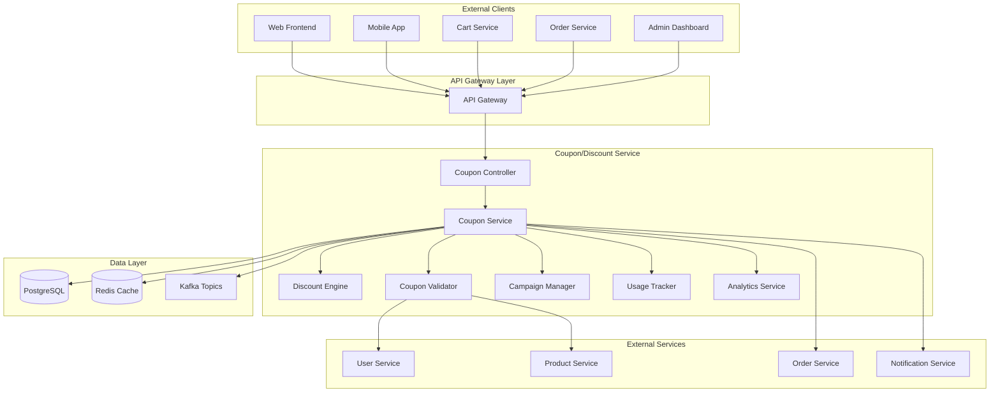
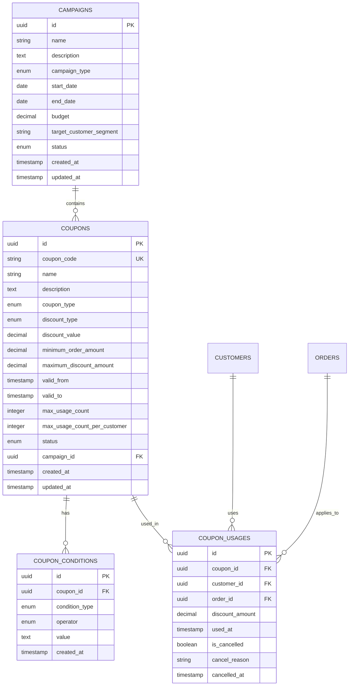

# Coupon/Discount Service 詳細設計書

## 目次

1. [概要](#概要)
2. [技術仕様](#技術仕様)
3. [アーキテクチャ設計](#アーキテクチャ設計)
4. [API設計](#api設計)
5. [データベース設計](#データベース設計)
6. [クーポン管理設計](#クーポン管理設計)
7. [割引計算設計](#割引計算設計)
8. [エラー処理](#エラー処理)
9. [テスト設計](#テスト設計)
10. [ローカル開発環境](#ローカル開発環境)
11. [本番デプロイメント](#本番デプロイメント)
12. [監視・運用](#監視運用)
13. [障害対応](#障害対応)

## 概要

### サービス概要

Coupon/Discount Serviceは、スキー用品販売ショップサイトのクーポン・割引機能を担当するマイクロサービスです。クーポンの作成・管理、割引ルールの定義、適用条件の判定、割引金額の計算などの機能を提供します。

### 主要責務

- **クーポン管理**: クーポンの作成・編集・削除・有効化/無効化
- **割引計算**: 複数の割引ルールに基づく最適な割引金額の計算
- **適用条件判定**: 顧客・商品・注文条件に基づく適用可否判定
- **使用履歴管理**: クーポン使用履歴の記録・追跡
- **キャンペーン管理**: 期間限定キャンペーンの管理
- **レポート機能**: クーポン効果測定・利用統計レポート

### ビジネス価値

- **売上向上**: 戦略的な割引による購買促進
- **顧客獲得**: 新規顧客向けクーポンによる集客
- **顧客維持**: リピーター向け特典による継続利用促進
- **在庫管理**: 売れ筋商品の在庫調整支援

## 技術仕様

### 使用技術スタック

| 技術領域 | 技術/ライブラリ | バージョン | 用途 |
|---------|----------------|-----------|------|
| **Runtime** | OpenJDK | 21 LTS | Java実行環境 |
| **Framework** | Jakarta EE | 11 | エンタープライズフレームワーク |
| **Application Server** | WildFly | 31.0.1 | Jakarta EEアプリケーションサーバー |
| **Persistence** | Jakarta Persistence (JPA) | 3.2 | ORM |
| **Data Access** | Jakarta Data | 1.0 | Repository抽象化 |
| **REST API** | Jakarta REST (JAX-RS) | 4.0 | RESTful Web Services |
| **CDI** | Jakarta CDI | 4.1 | 依存性注入・管理 |
| **Validation** | Jakarta Validation | 3.1 | Bean Validation |
| **JSON Processing** | Jakarta JSON-P | 2.1 | JSON処理 |
| **Database** | PostgreSQL | 16 | 主データベース |
| **Cache** | Redis | 7.2 | クーポンキャッシュ |
| **Message Queue** | Apache Kafka | 3.7 | クーポンイベント処理 |
| **Monitoring** | MicroProfile Metrics | 5.1 | メトリクス収集 |
| **Tracing** | MicroProfile OpenTelemetry | 2.0 | 分散トレーシング |
| **Health Check** | MicroProfile Health | 4.0 | ヘルスチェック |
| **Configuration** | MicroProfile Config | 3.1 | 設定管理 |

### 除外技術

- **Lombok**: Jakarta EE 11のRecord クラスとモダンJava機能を活用するため使用しません

### Java 21 LTS 活用機能

- **Virtual Threads**: 高並行クーポン処理
- **Record Classes**: クーポンデータ構造
- **Pattern Matching**: 割引ルール判定
- **Text Blocks**: 複雑なSQL定義
- **Sealed Classes**: クーポンイベントの型安全性

## アーキテクチャ設計

### システムアーキテクチャ図



### ドメインモデル設計

```java
// クーポンエンティティ
@Entity
@Table(name = "coupons")
public class Coupon {
    
    @Id
    @GeneratedValue(strategy = GenerationType.UUID)
    private UUID id;
    
    @Column(name = "coupon_code", unique = true, nullable = false)
    private String couponCode;
    
    @Column(name = "name", nullable = false)
    private String name;
    
    @Column(name = "description")
    private String description;
    
    @Enumerated(EnumType.STRING)
    @Column(name = "coupon_type", nullable = false)
    private CouponType couponType;
    
    @Enumerated(EnumType.STRING)
    @Column(name = "discount_type", nullable = false)
    private DiscountType discountType;
    
    @Column(name = "discount_value", precision = 10, scale = 2, nullable = false)
    private BigDecimal discountValue;
    
    @Column(name = "minimum_order_amount", precision = 10, scale = 2)
    private BigDecimal minimumOrderAmount;
    
    @Column(name = "maximum_discount_amount", precision = 10, scale = 2)
    private BigDecimal maximumDiscountAmount;
    
    @Column(name = "usage_limit")
    private Integer usageLimit;
    
    @Column(name = "usage_limit_per_customer")
    private Integer usageLimitPerCustomer;
    
    @Column(name = "current_usage_count")
    private Integer currentUsageCount = 0;
    
    @Enumerated(EnumType.STRING)
    @Column(name = "status", nullable = false)
    private CouponStatus status;
    
    @Column(name = "valid_from", nullable = false)
    private LocalDateTime validFrom;
    
    @Column(name = "valid_until", nullable = false)
    private LocalDateTime validUntil;
    
    @Column(name = "created_at", nullable = false)
    private LocalDateTime createdAt;
    
    @Column(name = "updated_at")
    private LocalDateTime updatedAt;
    
    @Column(name = "created_by", nullable = false)
    private UUID createdBy;
    
    // 関連エンティティ
    @OneToMany(mappedBy = "coupon", cascade = CascadeType.ALL, fetch = FetchType.LAZY)
    private List<CouponCondition> conditions = new ArrayList<>();
    
    @OneToMany(mappedBy = "coupon", cascade = CascadeType.ALL, fetch = FetchType.LAZY)
    private List<CouponUsage> usages = new ArrayList<>();
    
    // ビジネスロジック
    public boolean isValid() {
        var now = LocalDateTime.now();
        return status == CouponStatus.ACTIVE &&
               now.isAfter(validFrom) &&
               now.isBefore(validUntil) &&
               !isUsageLimitExceeded();
    }
    
    public boolean isUsageLimitExceeded() {
        return usageLimit != null && currentUsageCount >= usageLimit;
    }
    
    public boolean canBeUsedByCustomer(UUID customerId) {
        if (usageLimitPerCustomer == null) {
            return true;
        }
        
        var customerUsageCount = usages.stream()
            .filter(usage -> usage.getCustomerId().equals(customerId))
            .filter(usage -> usage.getStatus() == CouponUsageStatus.USED)
            .mapToInt(usage -> 1)
            .sum();
            
        return customerUsageCount < usageLimitPerCustomer;
    }
    
    public BigDecimal calculateDiscount(BigDecimal orderAmount) {
        if (orderAmount.compareTo(minimumOrderAmount != null ? minimumOrderAmount : BigDecimal.ZERO) < 0) {
            return BigDecimal.ZERO;
        }
        
        var discount = switch (discountType) {
            case PERCENTAGE -> orderAmount.multiply(discountValue).divide(BigDecimal.valueOf(100));
            case FIXED_AMOUNT -> discountValue;
            case FREE_SHIPPING -> BigDecimal.ZERO; // 配送料無料は別途処理
        };
        
        // 最大割引額の制限
        if (maximumDiscountAmount != null && discount.compareTo(maximumDiscountAmount) > 0) {
            discount = maximumDiscountAmount;
        }
        
        return discount;
    }
    
    public void incrementUsage() {
        this.currentUsageCount++;
        this.updatedAt = LocalDateTime.now();
    }
    
    public void decrementUsage() {
        if (this.currentUsageCount > 0) {
            this.currentUsageCount--;
            this.updatedAt = LocalDateTime.now();
        }
    }
}

// クーポン条件エンティティ
@Entity
@Table(name = "coupon_conditions")
public class CouponCondition {
    
    @Id
    @GeneratedValue(strategy = GenerationType.UUID)
    private UUID id;
    
    @ManyToOne(fetch = FetchType.LAZY)
    @JoinColumn(name = "coupon_id", nullable = false)
    private Coupon coupon;
    
    @Enumerated(EnumType.STRING)
    @Column(name = "condition_type", nullable = false)
    private ConditionType conditionType;
    
    @Enumerated(EnumType.STRING)
    @Column(name = "operator", nullable = false)
    private ConditionOperator operator;
    
    @Column(name = "target_value", nullable = false)
    private String targetValue;
    
    @Column(name = "condition_value", nullable = false)
    private String conditionValue;
    
    public boolean evaluate(CouponEvaluationContext context) {
        var actualValue = extractValue(context);
        var expectedValue = conditionValue;
        
        return switch (operator) {
            case EQUALS -> actualValue.equals(expectedValue);
            case NOT_EQUALS -> !actualValue.equals(expectedValue);
            case GREATER_THAN -> compareNumeric(actualValue, expectedValue) > 0;
            case GREATER_THAN_OR_EQUAL -> compareNumeric(actualValue, expectedValue) >= 0;
            case LESS_THAN -> compareNumeric(actualValue, expectedValue) < 0;
            case LESS_THAN_OR_EQUAL -> compareNumeric(actualValue, expectedValue) <= 0;
            case CONTAINS -> actualValue.contains(expectedValue);
            case IN -> Arrays.asList(expectedValue.split(",")).contains(actualValue);
        };
    }
    
    private String extractValue(CouponEvaluationContext context) {
        return switch (conditionType) {
            case CUSTOMER_SEGMENT -> context.customerSegment();
            case PRODUCT_CATEGORY -> context.productCategory();
            case PRODUCT_ID -> context.productId();
            case ORDER_AMOUNT -> context.orderAmount().toString();
            case DAY_OF_WEEK -> context.dayOfWeek().toString();
            case CUSTOMER_TYPE -> context.customerType();
        };
    }
    
    private int compareNumeric(String value1, String value2) {
        try {
            var num1 = new BigDecimal(value1);
            var num2 = new BigDecimal(value2);
            return num1.compareTo(num2);
        } catch (NumberFormatException e) {
            return value1.compareTo(value2);
        }
    }
}

// クーポン使用履歴エンティティ
@Entity
@Table(name = "coupon_usages")
public class CouponUsage {
    
    @Id
    @GeneratedValue(strategy = GenerationType.UUID)
    private UUID id;
    
    @ManyToOne(fetch = FetchType.LAZY)
    @JoinColumn(name = "coupon_id", nullable = false)
    private Coupon coupon;
    
    @Column(name = "customer_id", nullable = false)
    private UUID customerId;
    
    @Column(name = "order_id")
    private UUID orderId;
    
    @Column(name = "discount_amount", precision = 10, scale = 2, nullable = false)
    private BigDecimal discountAmount;
    
    @Enumerated(EnumType.STRING)
    @Column(name = "status", nullable = false)
    private CouponUsageStatus status;
    
    @Column(name = "used_at", nullable = false)
    private LocalDateTime usedAt;
    
    @Column(name = "cancelled_at")
    private LocalDateTime cancelledAt;
    
    @Column(name = "cancel_reason")
    private String cancelReason;
    
    public void cancel(String reason) {
        this.status = CouponUsageStatus.CANCELLED;
        this.cancelledAt = LocalDateTime.now();
        this.cancelReason = reason;
    }
}

// キャンペーンエンティティ
@Entity
@Table(name = "campaigns")
public class Campaign {
    
    @Id
    @GeneratedValue(strategy = GenerationType.UUID)
    private UUID id;
    
    @Column(name = "name", nullable = false)
    private String name;
    
    @Column(name = "description")
    private String description;
    
    @Enumerated(EnumType.STRING)
    @Column(name = "campaign_type", nullable = false)
    private CampaignType campaignType;
    
    @Enumerated(EnumType.STRING)
    @Column(name = "status", nullable = false)
    private CampaignStatus status;
    
    @Column(name = "start_date", nullable = false)
    private LocalDateTime startDate;
    
    @Column(name = "end_date", nullable = false)
    private LocalDateTime endDate;
    
    @Column(name = "target_segment")
    private String targetSegment;
    
    @Column(name = "budget", precision = 12, scale = 2)
    private BigDecimal budget;
    
    @Column(name = "current_spend", precision = 12, scale = 2)
    private BigDecimal currentSpend = BigDecimal.ZERO;
    
    @Column(name = "created_at", nullable = false)
    private LocalDateTime createdAt;
    
    @Column(name = "created_by", nullable = false)
    private UUID createdBy;
    
    // 関連エンティティ
    @OneToMany(mappedBy = "campaign", cascade = CascadeType.ALL, fetch = FetchType.LAZY)
    private List<Coupon> coupons = new ArrayList<>();
    
    public boolean isActive() {
        var now = LocalDateTime.now();
        return status == CampaignStatus.ACTIVE &&
               now.isAfter(startDate) &&
               now.isBefore(endDate) &&
               !isBudgetExceeded();
    }
    
    public boolean isBudgetExceeded() {
        return budget != null && currentSpend.compareTo(budget) >= 0;
    }
    
    public void addSpend(BigDecimal amount) {
        this.currentSpend = this.currentSpend.add(amount);
    }
}

// Enums
public enum CouponType {
    PERCENTAGE_OFF("パーセンテージ割引"),
    FIXED_AMOUNT_OFF("固定額割引"),
    FREE_SHIPPING("送料無料"),
    BUY_X_GET_Y("Xを買ってYを取得"),
    FIRST_TIME_BUYER("初回購入者向け"),
    LOYALTY_REWARD("ロイヤルティ特典");
    
    private final String description;
    
    CouponType(String description) {
        this.description = description;
    }
    
    public String getDescription() {
        return description;
    }
}

public enum DiscountType {
    PERCENTAGE("パーセンテージ"),
    FIXED_AMOUNT("固定額"),
    FREE_SHIPPING("送料無料");
    
    private final String description;
    
    DiscountType(String description) {
        this.description = description;
    }
    
    public String getDescription() {
        return description;
    }
}

public enum CouponStatus {
    DRAFT("下書き"),
    ACTIVE("有効"),
    PAUSED("一時停止"),
    EXPIRED("期限切れ"),
    EXHAUSTED("使用上限達成"),
    CANCELLED("キャンセル");
    
    private final String description;
    
    CouponStatus(String description) {
        this.description = description;
    }
    
    public String getDescription() {
        return description;
    }
}

public enum CouponUsageStatus {
    USED("使用済み"),
    CANCELLED("キャンセル"),
    REFUNDED("返金済み");
    
    private final String description;
    
    CouponUsageStatus(String description) {
        this.description = description;
    }
    
    public String getDescription() {
        return description;
    }
}

public enum ConditionType {
    CUSTOMER_SEGMENT("顧客セグメント"),
    PRODUCT_CATEGORY("商品カテゴリ"),
    PRODUCT_ID("商品ID"),
    ORDER_AMOUNT("注文金額"),
    DAY_OF_WEEK("曜日"),
    CUSTOMER_TYPE("顧客タイプ");
    
    private final String description;
    
    ConditionType(String description) {
        this.description = description;
    }
    
    public String getDescription() {
        return description;
    }
}

public enum ConditionOperator {
    EQUALS("等しい"),
    NOT_EQUALS("等しくない"),
    GREATER_THAN("より大きい"),
    GREATER_THAN_OR_EQUAL("以上"),
    LESS_THAN("より小さい"),
    LESS_THAN_OR_EQUAL("以下"),
    CONTAINS("含む"),
    IN("いずれか");
    
    private final String description;
    
    ConditionOperator(String description) {
        this.description = description;
    }
    
    public String getDescription() {
        return description;
    }
}

public enum CampaignType {
    SEASONAL("季節"),
    PRODUCT_LAUNCH("商品発売"),
    CUSTOMER_ACQUISITION("顧客獲得"),
    RETENTION("顧客維持"),
    INVENTORY_CLEARANCE("在庫処分");
    
    private final String description;
    
    CampaignType(String description) {
        this.description = description;
    }
    
    public String getDescription() {
        return description;
    }
}

public enum CampaignStatus {
    DRAFT("下書き"),
    SCHEDULED("予定"),
    ACTIVE("実行中"),
    PAUSED("一時停止"),
    COMPLETED("完了"),
    CANCELLED("キャンセル");
    
    private final String description;
    
    CampaignStatus(String description) {
        this.description = description;
    }
    
    public String getDescription() {
        return description;
    }
}

// Context Classes
public record CouponEvaluationContext(
    UUID customerId,
    String customerSegment,
    String customerType,
    String productCategory,
    String productId,
    BigDecimal orderAmount,
    DayOfWeek dayOfWeek,
    LocalDateTime timestamp
) {}

// Coupon CQRS Commands
public sealed interface CouponCommand permits CreateCouponCommand, UpdateCouponCommand,
        DeleteCouponCommand, ApplyCouponCommand, CancelCouponUsageCommand, 
        CreateCampaignCommand, StartCampaignCommand, EndCampaignCommand {}

public record CreateCouponCommand(
    String couponCode,
    String name,
    String description,
    CouponType couponType,
    DiscountType discountType,
    BigDecimal discountValue,
    BigDecimal minimumOrderAmount,
    BigDecimal maximumDiscountAmount,
    Integer usageLimit,
    Integer usageLimitPerCustomer,
    LocalDateTime validFrom,
    LocalDateTime validUntil,
    Set<String> applicableCategories,
    Set<String> applicableProducts,
    Set<UUID> applicableCustomers
) implements CouponCommand {}

public record UpdateCouponCommand(
    UUID couponId,
    String name,
    String description,
    CouponStatus status,
    BigDecimal discountValue,
    BigDecimal minimumOrderAmount,
    BigDecimal maximumDiscountAmount,
    Integer usageLimit,
    Integer usageLimitPerCustomer,
    LocalDateTime validFrom,
    LocalDateTime validUntil
) implements CouponCommand {}

public record DeleteCouponCommand(
    UUID couponId,
    String reason
) implements CouponCommand {}

public record ApplyCouponCommand(
    String couponCode,
    UUID customerId,
    UUID orderId,
    List<OrderItem> orderItems,
    BigDecimal orderTotal,
    LocalDateTime timestamp
) implements CouponCommand {}

public record CancelCouponUsageCommand(
    UUID couponUsageId,
    UUID orderId,
    String reason
) implements CouponCommand {}

public record CreateCampaignCommand(
    String name,
    String description,
    LocalDateTime startDate,
    LocalDateTime endDate,
    List<UUID> couponIds,
    CampaignType campaignType,
    Map<String, Object> campaignSettings
) implements CouponCommand {}

public record StartCampaignCommand(
    UUID campaignId
) implements CouponCommand {}

public record EndCampaignCommand(
    UUID campaignId,
    String reason
) implements CouponCommand {}

// Coupon CQRS Queries
public sealed interface CouponQuery permits GetCouponByCodeQuery, GetUserCouponsQuery,
        GetActiveCouponsQuery, GetCouponUsageStatsQuery, GetCampaignQuery,
        GetDiscountCalculationQuery, ValidateCouponQuery {}

public record GetCouponByCodeQuery(
    String couponCode
) implements CouponQuery {}

public record GetUserCouponsQuery(
    UUID customerId,
    CouponStatus status,
    int page,
    int size
) implements CouponQuery {}

public record GetActiveCouponsQuery(
    LocalDateTime timestamp,
    String category,
    String productId,
    int page,
    int size
) implements CouponQuery {}

public record GetCouponUsageStatsQuery(
    UUID couponId,
    LocalDateTime fromDate,
    LocalDateTime toDate
) implements CouponQuery {}

public record GetCampaignQuery(
    UUID campaignId
) implements CouponQuery {}

public record GetDiscountCalculationQuery(
    String couponCode,
    UUID customerId,
    List<OrderItem> orderItems,
    BigDecimal orderTotal
) implements CouponQuery {}

public record ValidateCouponQuery(
    String couponCode,
    UUID customerId,
    ValidationContext context
) implements CouponQuery {}

// Coupon Projections
public record CouponProjection(
    UUID id,
    String couponCode,
    String name,
    CouponType couponType,
    DiscountType discountType,
    BigDecimal discountValue,
    BigDecimal minimumOrderAmount,
    CouponStatus status,
    LocalDateTime validFrom,
    LocalDateTime validUntil,
    Integer currentUsageCount,
    Integer usageLimit
) {}

public record CouponUsageStatsProjection(
    UUID couponId,
    String couponCode,
    long totalUsageCount,
    BigDecimal totalDiscountAmount,
    BigDecimal averageOrderValue,
    long uniqueCustomerCount,
    Map<LocalDate, Long> dailyUsage
) {}

public record DiscountCalculationProjection(
    String couponCode,
    boolean isValid,
    BigDecimal discountAmount,
    BigDecimal finalTotal,
    String discountDescription,
    List<String> validationErrors
) {}

public record CampaignProjection(
    UUID id,
    String name,
    String description,
    CampaignStatus status,
    LocalDateTime startDate,
    LocalDateTime endDate,
    List<CouponProjection> coupons,
    CampaignStats stats
) {}

// Coupon Service with CQRS
@ApplicationScoped
@Transactional
public class CouponService {
    
    private static final Logger logger = LoggerFactory.getLogger(CouponService.class);
    
    @Inject
    private CouponRepository couponRepository;
    
    @Inject
    private CouponUsageRepository couponUsageRepository;
    
    @Inject
    private CampaignRepository campaignRepository;
    
    @Inject
    private CouponCodeGenerator codeGenerator;
    
    @Inject
    private DiscountCalculationEngine discountEngine;
    
    @Inject
    private CouponEventPublisher eventPublisher;
    
    @Inject
    private CouponQueryService queryService;
    
    // Command Handlers
    @CommandHandler
    public UUID handle(CreateCouponCommand command) {
        // クーポンコード生成
        var couponCode = command.couponCode() != null ? 
            command.couponCode() : codeGenerator.generate();
        
        // 重複チェック
        if (couponRepository.existsByCouponCode(couponCode)) {
            throw new DuplicateCouponCodeException("Coupon code already exists: " + couponCode);
        }
        
        // クーポンエンティティ作成
        var coupon = buildCoupon(command, couponCode);
        var savedCoupon = couponRepository.save(coupon);
        
        // イベント発行
        eventPublisher.publish(new CouponCreatedEvent(
            savedCoupon.getId(),
            savedCoupon.getCouponCode(),
            savedCoupon.getCouponType(),
            LocalDateTime.now()
        ));
        
        return savedCoupon.getId();
    }
    
    @CommandHandler
    public void handle(ApplyCouponCommand command) {
        var coupon = couponRepository.findByCouponCode(command.couponCode())
            .orElseThrow(() -> new CouponNotFoundException("Coupon not found: " + command.couponCode()));
        
        // バリデーション
        var validationResult = validateCouponUsage(coupon, command);
        if (!validationResult.isValid()) {
            throw new InvalidCouponUsageException(validationResult.getErrorMessage());
        }
        
        // 割引計算
        var discountAmount = discountEngine.calculateDiscount(
            coupon, command.orderItems(), command.orderTotal());
        
        // 使用履歴記録
        var usage = new CouponUsage(
            coupon.getId(),
            command.customerId(),
            command.orderId(),
            discountAmount,
            command.timestamp()
        );
        couponUsageRepository.save(usage);
        
        // 使用回数更新
        coupon.incrementUsageCount();
        couponRepository.save(coupon);
        
        // イベント発行
        eventPublisher.publish(new CouponUsedEvent(
            coupon.getId(),
            coupon.getCouponCode(),
            command.customerId(),
            command.orderId(),
            discountAmount,
            LocalDateTime.now()
        ));
    }
    
    @CommandHandler
    public void handle(CancelCouponUsageCommand command) {
        var usage = couponUsageRepository.findById(command.couponUsageId())
            .orElseThrow(() -> new CouponUsageNotFoundException("Usage not found"));
        
        if (usage.isCancelled()) {
            throw new InvalidOperationException("Usage already cancelled");
        }
        
        // 使用履歴キャンセル
        usage.cancel(command.reason());
        couponUsageRepository.save(usage);
        
        // クーポン使用回数復元
        var coupon = couponRepository.findById(usage.getCouponId())
            .orElseThrow(() -> new CouponNotFoundException("Coupon not found"));
        
        coupon.decrementUsageCount();
        couponRepository.save(coupon);
        
        // イベント発行
        eventPublisher.publish(new CouponCancelledEvent(
            coupon.getId(),
            coupon.getCouponCode(),
            usage.getCustomerId(),
            command.reason(),
            LocalDateTime.now()
        ));
    }
    
    @CommandHandler
    public UUID handle(CreateCampaignCommand command) {
        var campaign = Campaign.builder()
            .name(command.name())
            .description(command.description())
            .startDate(command.startDate())
            .endDate(command.endDate())
            .campaignType(command.campaignType())
            .status(CampaignStatus.DRAFT)
            .build();
        
        // クーポン関連付け
        if (command.couponIds() != null && !command.couponIds().isEmpty()) {
            var coupons = couponRepository.findByIds(command.couponIds());
            campaign.addCoupons(coupons);
        }
        
        var savedCampaign = campaignRepository.save(campaign);
        
        eventPublisher.publish(new CampaignCreatedEvent(
            savedCampaign.getId(),
            savedCampaign.getName(),
            savedCampaign.getStartDate(),
            savedCampaign.getEndDate(),
            LocalDateTime.now()
        ));
        
        return savedCampaign.getId();
    }
    
    @CommandHandler
    public void handle(StartCampaignCommand command) {
        var campaign = campaignRepository.findById(command.campaignId())
            .orElseThrow(() -> new CampaignNotFoundException("Campaign not found"));
        
        campaign.start();
        campaignRepository.save(campaign);
        
        // 関連クーポンを有効化
        campaign.getCoupons().forEach(coupon -> {
            coupon.activate();
            couponRepository.save(coupon);
        });
        
        eventPublisher.publish(new CampaignStartedEvent(
            campaign.getId(),
            campaign.getName(),
            LocalDateTime.now()
        ));
    }
    
    private Coupon buildCoupon(CreateCouponCommand command, String couponCode) {
        return Coupon.builder()
            .couponCode(couponCode)
            .name(command.name())
            .description(command.description())
            .couponType(command.couponType())
            .discountType(command.discountType())
            .discountValue(command.discountValue())
            .minimumOrderAmount(command.minimumOrderAmount())
            .maximumDiscountAmount(command.maximumDiscountAmount())
            .usageLimit(command.usageLimit())
            .usageLimitPerCustomer(command.usageLimitPerCustomer())
            .validFrom(command.validFrom())
            .validUntil(command.validUntil())
            .status(CouponStatus.ACTIVE)
            .build();
    }
    
    private CouponValidationResult validateCouponUsage(Coupon coupon, ApplyCouponCommand command) {
        var context = new CouponValidationContext(
            command.customerId(),
            command.orderItems(),
            command.orderTotal(),
            command.timestamp()
        );
        
        return couponValidator.validate(coupon, context);
    }
}

// Coupon Query Service
@ApplicationScoped
public class CouponQueryService {
    
    @Inject
    private CouponRepository couponRepository;
    
    @Inject
    private CouponUsageRepository couponUsageRepository;
    
    @Inject
    private CampaignRepository campaignRepository;
    
    @QueryHandler
    public Optional<CouponProjection> handle(GetCouponByCodeQuery query) {
        return couponRepository.findByCouponCode(query.couponCode())
            .map(this::toCouponProjection);
    }
    
    @QueryHandler
    public List<CouponProjection> handle(GetUserCouponsQuery query) {
        return couponRepository.findByCustomerIdAndStatus(
            query.customerId(), query.status(), query.page(), query.size())
            .stream()
            .map(this::toCouponProjection)
            .toList();
    }
    
    @QueryHandler
    public List<CouponProjection> handle(GetActiveCouponsQuery query) {
        return couponRepository.findActiveCoupons(
            query.timestamp(), query.category(), query.productId(), 
            query.page(), query.size())
            .stream()
            .map(this::toCouponProjection)
            .toList();
    }
    
    @QueryHandler
    public CouponUsageStatsProjection handle(GetCouponUsageStatsQuery query) {
        var stats = couponUsageRepository.getUsageStats(
            query.couponId(), query.fromDate(), query.toDate());
        
        return new CouponUsageStatsProjection(
            query.couponId(),
            stats.getCouponCode(),
            stats.getTotalUsageCount(),
            stats.getTotalDiscountAmount(),
            stats.getAverageOrderValue(),
            stats.getUniqueCustomerCount(),
            stats.getDailyUsage()
        );
    }
    
    @QueryHandler
    public DiscountCalculationProjection handle(GetDiscountCalculationQuery query) {
        try {
            var coupon = couponRepository.findByCouponCode(query.couponCode())
                .orElseThrow(() -> new CouponNotFoundException("Coupon not found"));
            
            var validationResult = couponValidator.validate(coupon, 
                new CouponValidationContext(query.customerId(), query.orderItems(), 
                    query.orderTotal(), LocalDateTime.now()));
            
            if (!validationResult.isValid()) {
                return new DiscountCalculationProjection(
                    query.couponCode(),
                    false,
                    BigDecimal.ZERO,
                    query.orderTotal(),
                    "",
                    validationResult.getErrors()
                );
            }
            
            var discountAmount = discountEngine.calculateDiscount(
                coupon, query.orderItems(), query.orderTotal());
            
            var finalTotal = query.orderTotal().subtract(discountAmount);
            
            return new DiscountCalculationProjection(
                query.couponCode(),
                true,
                discountAmount,
                finalTotal,
                generateDiscountDescription(coupon, discountAmount),
                List.of()
            );
            
        } catch (Exception e) {
            return new DiscountCalculationProjection(
                query.couponCode(),
                false,
                BigDecimal.ZERO,
                query.orderTotal(),
                "",
                List.of(e.getMessage())
            );
        }
    }
    
    private CouponProjection toCouponProjection(Coupon coupon) {
        return new CouponProjection(
            coupon.getId(),
            coupon.getCouponCode(),
            coupon.getName(),
            coupon.getCouponType(),
            coupon.getDiscountType(),
            coupon.getDiscountValue(),
            coupon.getMinimumOrderAmount(),
            coupon.getStatus(),
            coupon.getValidFrom(),
            coupon.getValidUntil(),
            coupon.getCurrentUsageCount(),
            coupon.getUsageLimit()
        );
    }
    
    private String generateDiscountDescription(Coupon coupon, BigDecimal discountAmount) {
        return switch (coupon.getDiscountType()) {
            case PERCENTAGE -> String.format("%.0f%%割引 (¥%,d)", 
                coupon.getDiscountValue(), discountAmount.intValue());
            case FIXED_AMOUNT -> String.format("¥%,d割引", discountAmount.intValue());
            case FREE_SHIPPING -> "送料無料";
        };
    }
}
        
        // イベント発行
        eventPublisher.publish(new CouponCreatedEvent(
            savedCoupon.getId(),
            savedCoupon.getCouponCode(),
            savedCoupon.getCouponType(),
            LocalDateTime.now()
        ));
        
        logger.info("Coupon created: {}", savedCoupon.getCouponCode());
        return savedCoupon;
    }
    
    public CouponValidationResult validateCoupon(String couponCode, CouponContext context) {
        var coupon = couponRepository.findByCouponCode(couponCode)
            .orElse(null);
            
        if (coupon == null) {
            return CouponValidationResult.invalid("クーポンが見つかりません");
        }
        
        if (!coupon.isActive()) {
            return CouponValidationResult.invalid("クーポンが無効です");
        }
        
        if (coupon.isExpired()) {
            return CouponValidationResult.invalid("クーポンの有効期限が切れています");
        }
        
        // 使用回数制限チェック
        if (coupon.hasUsageLimit()) {
            var usageCount = couponUsageRepository.countByCouponId(coupon.getId());
            if (usageCount >= coupon.getMaxUsageCount()) {
                return CouponValidationResult.invalid("クーポンの使用回数上限に達しています");
            }
        }
        
        // 顧客別使用制限チェック
        if (coupon.hasCustomerUsageLimit() && context.customerId() != null) {
            var customerUsageCount = couponUsageRepository
                .countByCouponIdAndCustomerId(coupon.getId(), context.customerId());
            if (customerUsageCount >= coupon.getMaxUsageCountPerCustomer()) {
                return CouponValidationResult.invalid("お客様の使用回数上限に達しています");
            }
        }
        
        // 条件チェック
        for (var condition : coupon.getConditions()) {
            if (!condition.evaluate(context)) {
                return CouponValidationResult.invalid("クーポンの適用条件を満たしていません");
            }
        }
        
        return CouponValidationResult.valid(coupon);
    }
    
    public DiscountCalculationResult calculateDiscount(String couponCode, CouponContext context) {
        var validationResult = validateCoupon(couponCode, context);
        
        if (!validationResult.isValid()) {
            return DiscountCalculationResult.failed(validationResult.errorMessage());
        }
        
        var coupon = validationResult.coupon();
        var discountAmount = discountEngine.calculateDiscount(coupon, context);
        
        return DiscountCalculationResult.success(coupon, discountAmount);
    }
    
    public CouponUsage useCoupon(UseCouponRequest request) {
        var coupon = couponRepository.findByCouponCode(request.couponCode())
            .orElseThrow(() -> new CouponNotFoundException("Coupon not found: " + request.couponCode()));
        
        // 再度バリデーション
        var context = new CouponContext(
            request.customerId(),
            request.cartItems(),
            request.totalAmount(),
            request.productCategories(),
            null, // productId
            request.totalAmount(),
            LocalDateTime.now().getDayOfWeek(),
            LocalDateTime.now()
        );
        
        var validationResult = validateCoupon(request.couponCode(), context);
        if (!validationResult.isValid()) {
            throw new InvalidCouponException(validationResult.errorMessage());
        }
        
        // 割引金額計算
        var discountAmount = discountEngine.calculateDiscount(coupon, context);
        
        // 使用履歴作成
        var usage = new CouponUsage();
        usage.setCoupon(coupon);
        usage.setCustomerId(request.customerId());
        usage.setOrderId(request.orderId());
        usage.setDiscountAmount(discountAmount);
        usage.setUsedAt(LocalDateTime.now());
        
        var savedUsage = couponUsageRepository.save(usage);
        
        // イベント発行
        eventPublisher.publish(new CouponUsedEvent(
            coupon.getId(),
            coupon.getCouponCode(),
            request.customerId(),
            request.orderId(),
            discountAmount,
            LocalDateTime.now()
        ));
        
        logger.info("Coupon used: {} by customer: {}", coupon.getCouponCode(), request.customerId());
        return savedUsage;
    }
    
    public void cancelCouponUsage(UUID usageId, String reason) {
        var usage = couponUsageRepository.findById(usageId)
            .orElseThrow(() -> new CouponUsageNotFoundException("Coupon usage not found: " + usageId));
        
        if (usage.isCancelled()) {
            throw new IllegalStateException("Coupon usage already cancelled");
        }
        
        usage.cancel(reason);
        couponUsageRepository.save(usage);
        
        // イベント発行
        eventPublisher.publish(new CouponCancelledEvent(
            usage.getCoupon().getId(),
            usage.getCoupon().getCouponCode(),
            usage.getCustomerId(),
            reason,
            LocalDateTime.now()
        ));
        
        logger.info("Coupon usage cancelled: {} for customer: {}", 
            usage.getCoupon().getCouponCode(), usage.getCustomerId());
    }
    
    public List<Coupon> findAvailableCoupons(UUID customerId) {
        // 顧客が利用可能なクーポン一覧取得
        var allActiveCoupons = couponRepository.findActiveAndNotExpired();
        
        return allActiveCoupons.stream()
            .filter(coupon -> {
                // 顧客固有条件チェック
                if (coupon.hasCustomerRestrictions()) {
                    return coupon.isApplicableToCustomer(customerId);
                }
                
                // 使用回数制限チェック
                if (coupon.hasCustomerUsageLimit()) {
                    var usageCount = couponUsageRepository
                        .countByCouponIdAndCustomerId(coupon.getId(), customerId);
                    return usageCount < coupon.getMaxUsageCountPerCustomer();
                }
                
                return true;
            })
            .toList();
    }
    
    public CouponStatistics getCouponStatistics(UUID couponId) {
        var coupon = couponRepository.findById(couponId)
            .orElseThrow(() -> new CouponNotFoundException("Coupon not found: " + couponId));
        
        var totalUsages = couponUsageRepository.countByCouponId(couponId);
        var totalDiscountAmount = couponUsageRepository.sumDiscountAmountByCouponId(couponId);
        var uniqueCustomers = couponUsageRepository.countDistinctCustomersByCouponId(couponId);
        
        return new CouponStatistics(
            coupon.getCouponCode(),
            totalUsages,
            totalDiscountAmount,
            uniqueCustomers,
            coupon.getMaxUsageCount() != null ? 
                (double) totalUsages / coupon.getMaxUsageCount() * 100 : null
        );
    }
    
    private Coupon buildCoupon(CreateCouponRequest request, String couponCode) {
        var coupon = new Coupon();
        coupon.setCouponCode(couponCode);
        coupon.setName(request.name());
        coupon.setDescription(request.description());
        coupon.setCouponType(request.couponType());
        coupon.setDiscountType(request.discountType());
        coupon.setDiscountValue(request.discountValue());
        coupon.setMinimumOrderAmount(request.minimumOrderAmount());
        coupon.setMaximumDiscountAmount(request.maximumDiscountAmount());
        coupon.setValidFrom(request.validFrom());
        coupon.setValidTo(request.validTo());
        coupon.setMaxUsageCount(request.maxUsageCount());
        coupon.setMaxUsageCountPerCustomer(request.maxUsageCountPerCustomer());
        coupon.setStatus(CouponStatus.ACTIVE);
        coupon.setCreatedAt(LocalDateTime.now());
        
        // 条件設定
        if (request.conditions() != null) {
            var conditions = request.conditions().stream()
                .map(this::buildCouponCondition)
                .toList();
            coupon.setConditions(conditions);
        }
        
        return coupon;
    }
    
    private CouponCondition buildCouponCondition(CouponConditionRequest request) {
        var condition = new CouponCondition();
        condition.setConditionType(request.conditionType());
        condition.setOperator(request.operator());
        condition.setValue(request.value());
        condition.setCreatedAt(LocalDateTime.now());
        return condition;
    }
}

// 割引計算エンジン
@ApplicationScoped
public class DiscountCalculationEngine {
    
    private static final Logger logger = LoggerFactory.getLogger(DiscountCalculationEngine.class);
    
    public BigDecimal calculateDiscount(Coupon coupon, CouponContext context) {
        var baseDiscount = calculateBaseDiscount(coupon, context);
        var finalDiscount = applyDiscountConstraints(coupon, baseDiscount, context);
        
        logger.debug("Calculated discount for coupon {}: {} -> {}", 
            coupon.getCouponCode(), baseDiscount, finalDiscount);
        
        return finalDiscount;
    }
    
    private BigDecimal calculateBaseDiscount(Coupon coupon, CouponContext context) {
        return switch (coupon.getDiscountType()) {
            case FIXED_AMOUNT -> coupon.getDiscountValue();
            case PERCENTAGE -> context.orderAmount()
                .multiply(coupon.getDiscountValue())
                .divide(BigDecimal.valueOf(100), 2, RoundingMode.DOWN);
            case BUY_X_GET_Y -> calculateBuyXGetYDiscount(coupon, context);
            case FREE_SHIPPING -> calculateShippingDiscount(context);
        };
    }
    
    private BigDecimal applyDiscountConstraints(Coupon coupon, BigDecimal discount, CouponContext context) {
        var finalDiscount = discount;
        
        // 最大割引額制限
        if (coupon.getMaximumDiscountAmount() != null) {
            finalDiscount = finalDiscount.min(coupon.getMaximumDiscountAmount());
        }
        
        // 注文金額を超えない
        finalDiscount = finalDiscount.min(context.orderAmount());
        
        // 負の値にならない
        finalDiscount = finalDiscount.max(BigDecimal.ZERO);
        
        return finalDiscount;
    }
    
    private BigDecimal calculateBuyXGetYDiscount(Coupon coupon, CouponContext context) {
        // Buy X Get Y の実装（簡略化）
        // 実際の実装では商品の組み合わせを詳細に計算
        return context.orderAmount().multiply(new BigDecimal("0.1")); // 10%割引として簡略化
    }
    
    private BigDecimal calculateShippingDiscount(CouponContext context) {
        // 送料無料の場合の割引額（通常は送料分）
        return new BigDecimal("500"); // 固定送料として簡略化
    }
}

// キャンペーンサービス
@ApplicationScoped
@Transactional
public class CampaignService {
    
    private static final Logger logger = LoggerFactory.getLogger(CampaignService.class);
    
    @Inject
    private CampaignRepository campaignRepository;
    
    @Inject
    private CouponRepository couponRepository;
    
    @Inject
    private CouponEventPublisher eventPublisher;
    
    public Campaign createCampaign(CreateCampaignRequest request) {
        var campaign = new Campaign();
        campaign.setName(request.name());
        campaign.setDescription(request.description());
        campaign.setCampaignType(request.campaignType());
        campaign.setStartDate(request.startDate());
        campaign.setEndDate(request.endDate());
        campaign.setBudget(request.budget());
        campaign.setTargetCustomerSegment(request.targetCustomerSegment());
        campaign.setStatus(CampaignStatus.DRAFT);
        campaign.setCreatedAt(LocalDateTime.now());
        
        var savedCampaign = campaignRepository.save(campaign);
        
        logger.info("Campaign created: {}", savedCampaign.getName());
        return savedCampaign;
    }
    
    public void startCampaign(UUID campaignId) {
        var campaign = campaignRepository.findById(campaignId)
            .orElseThrow(() -> new CampaignNotFoundException("Campaign not found: " + campaignId));
        
        if (campaign.getStatus() != CampaignStatus.DRAFT) {
            throw new IllegalStateException("Campaign cannot be started");
        }
        
        campaign.start();
        campaignRepository.save(campaign);
        
        // 関連クーポンの有効化
        activateCampaignCoupons(campaign);
        
        // イベント発行
        eventPublisher.publish(new CampaignStartedEvent(
            campaign.getId(),
            campaign.getName(),
            LocalDateTime.now()
        ));
        
        logger.info("Campaign started: {}", campaign.getName());
    }
    
    public void endCampaign(UUID campaignId) {
        var campaign = campaignRepository.findById(campaignId)
            .orElseThrow(() -> new CampaignNotFoundException("Campaign not found: " + campaignId));
        
        if (campaign.getStatus() != CampaignStatus.ACTIVE) {
            throw new IllegalStateException("Campaign cannot be ended");
        }
        
        campaign.end();
        campaignRepository.save(campaign);
        
        // 関連クーポンの無効化
        deactivateCampaignCoupons(campaign);
        
        // イベント発行
        eventPublisher.publish(new CampaignEndedEvent(
            campaign.getId(),
            campaign.getName(),
            LocalDateTime.now()
        ));
        
        logger.info("Campaign ended: {}", campaign.getName());
    }
    
    public List<Campaign> getActiveCampaigns() {
        return campaignRepository.findActiveAndNotExpired();
    }
    
    public CampaignAnalytics getCampaignAnalytics(UUID campaignId) {
        var campaign = campaignRepository.findById(campaignId)
            .orElseThrow(() -> new CampaignNotFoundException("Campaign not found: " + campaignId));
        
        // キャンペーン関連のクーポン使用状況を集計
        var relatedCoupons = couponRepository.findByCampaignId(campaignId);
        
        var totalUsages = relatedCoupons.stream()
            .mapToLong(coupon -> couponRepository.getUsageCount(coupon.getId()))
            .sum();
            
        var totalDiscountAmount = relatedCoupons.stream()
            .map(coupon -> couponRepository.getTotalDiscountAmount(coupon.getId()))
            .reduce(BigDecimal.ZERO, BigDecimal::add);
        
        return new CampaignAnalytics(
            campaign.getName(),
            totalUsages,
            totalDiscountAmount,
            campaign.getBudget().subtract(totalDiscountAmount), // 残予算
            relatedCoupons.size()
        );
    }
    
    private void activateCampaignCoupons(Campaign campaign) {
        var coupons = couponRepository.findByCampaignId(campaign.getId());
        coupons.forEach(coupon -> {
            coupon.setStatus(CouponStatus.ACTIVE);
            couponRepository.save(coupon);
        });
    }
    
    private void deactivateCampaignCoupons(Campaign campaign) {
        var coupons = couponRepository.findByCampaignId(campaign.getId());
        coupons.forEach(coupon -> {
            coupon.setStatus(CouponStatus.INACTIVE);
            couponRepository.save(coupon);
}
```

## API設計

### REST API エンドポイント

```java
@Path("/api/v1/coupons")
@ApplicationScoped
@Produces(MediaType.APPLICATION_JSON)
@Consumes(MediaType.APPLICATION_JSON)
public class CouponController {
    
    private static final Logger logger = LoggerFactory.getLogger(CouponController.class);
    
    @Inject
    private CouponService couponService;
    
    @Inject
    private CampaignService campaignService;
    
    @POST
    @Path("")
    @Operation(summary = "クーポン作成", description = "新規クーポンを作成します")
    @APIResponse(responseCode = "201", description = "クーポン作成成功")
    @APIResponse(responseCode = "400", description = "リクエストが不正")
    @APIResponse(responseCode = "409", description = "クーポンコードが重複")
    @RolesAllowed({"ADMIN", "MARKETING"})
    public Response createCoupon(@Valid @RequestBody CreateCouponRequest request) {
        try {
            var coupon = couponService.createCoupon(request);
            var response = CouponResponse.from(coupon);
            
            return Response.status(Response.Status.CREATED)
                .entity(response)
                .build();
                
        } catch (DuplicateCouponCodeException e) {
            return Response.status(Response.Status.CONFLICT)
                .entity(Map.of("error", e.getMessage()))
                .build();
                
        } catch (Exception e) {
            logger.error("Failed to create coupon", e);
            return Response.status(Response.Status.INTERNAL_SERVER_ERROR)
                .entity(Map.of("error", "Internal server error"))
                .build();
        }
    }
    
    @POST
    @Path("/validate")
    @Operation(summary = "クーポン検証", description = "クーポンの有効性を検証します")
    @APIResponse(responseCode = "200", description = "検証結果")
    public Response validateCoupon(@Valid @RequestBody CouponValidationRequest request) {
        var context = new CouponContext(
            request.customerId(),
            request.cartItems(),
            request.totalAmount(),
            request.productCategories(),
            null,
            request.totalAmount(),
            LocalDateTime.now().getDayOfWeek(),
            LocalDateTime.now()
        );
        
        var result = couponService.validateCoupon(request.couponCode(), context);
        
        if (result.isValid()) {
            var discountResult = couponService.calculateDiscount(request.couponCode(), context);
            return Response.ok(CouponValidationResponse.valid(
                result.coupon(),
                discountResult.discountAmount()
            )).build();
        } else {
            return Response.ok(CouponValidationResponse.invalid(result.errorMessage())).build();
        }
    }
    
    @POST
    @Path("/use")
    @Operation(summary = "クーポン使用", description = "クーポンを使用して割引を適用します")
    @APIResponse(responseCode = "200", description = "クーポン使用成功")
    @APIResponse(responseCode = "400", description = "クーポンが無効")
    @APIResponse(responseCode = "404", description = "クーポンが見つからない")
    public Response useCoupon(@Valid @RequestBody UseCouponRequest request) {
        try {
            var usage = couponService.useCoupon(request);
            var response = CouponUsageResponse.from(usage);
            
            return Response.ok(response).build();
            
        } catch (CouponNotFoundException e) {
            return Response.status(Response.Status.NOT_FOUND)
                .entity(Map.of("error", e.getMessage()))
                .build();
                
        } catch (InvalidCouponException e) {
            return Response.status(Response.Status.BAD_REQUEST)
                .entity(Map.of("error", e.getMessage()))
                .build();
        }
    }
    
    @DELETE
    @Path("/usage/{usageId}")
    @Operation(summary = "クーポン使用取消", description = "クーポン使用を取り消します")
    @APIResponse(responseCode = "200", description = "取消成功")
    @APIResponse(responseCode = "404", description = "使用履歴が見つからない")
    @RolesAllowed({"ADMIN", "CUSTOMER_SERVICE"})
    public Response cancelCouponUsage(
            @PathParam("usageId") UUID usageId,
            @Valid @RequestBody CancelCouponUsageRequest request) {
        
        try {
            couponService.cancelCouponUsage(usageId, request.reason());
            return Response.ok(Map.of("status", "cancelled")).build();
            
        } catch (CouponUsageNotFoundException e) {
            return Response.status(Response.Status.NOT_FOUND)
                .entity(Map.of("error", e.getMessage()))
                .build();
        }
    }
    
    @GET
    @Path("/customers/{customerId}/available")
    @Operation(summary = "利用可能クーポン取得", description = "顧客が利用可能なクーポン一覧を取得します")
    @APIResponse(responseCode = "200", description = "クーポン一覧取得成功")
    public Response getAvailableCoupons(@PathParam("customerId") UUID customerId) {
        var coupons = couponService.findAvailableCoupons(customerId);
        var responses = coupons.stream()
            .map(CouponResponse::from)
            .toList();
            
        return Response.ok(responses).build();
    }
    
    @GET
    @Path("/{couponId}")
    @Operation(summary = "クーポン詳細取得", description = "クーポンの詳細情報を取得します")
    @APIResponse(responseCode = "200", description = "クーポン詳細取得成功")
    @APIResponse(responseCode = "404", description = "クーポンが見つからない")
    public Response getCoupon(@PathParam("couponId") UUID couponId) {
        try {
            var coupon = couponService.findCouponById(couponId);
            var response = CouponResponse.from(coupon);
            
            return Response.ok(response).build();
            
        } catch (CouponNotFoundException e) {
            return Response.status(Response.Status.NOT_FOUND)
                .entity(Map.of("error", e.getMessage()))
                .build();
        }
    }
    
    @GET
    @Path("/{couponId}/statistics")
    @Operation(summary = "クーポン統計", description = "クーポンの使用統計を取得します")
    @APIResponse(responseCode = "200", description = "統計取得成功")
    @RolesAllowed({"ADMIN", "MARKETING"})
    public Response getCouponStatistics(@PathParam("couponId") UUID couponId) {
        try {
            var statistics = couponService.getCouponStatistics(couponId);
            return Response.ok(statistics).build();
            
        } catch (CouponNotFoundException e) {
            return Response.status(Response.Status.NOT_FOUND)
                .entity(Map.of("error", e.getMessage()))
                .build();
        }
    }
    
    @PUT
    @Path("/{couponId}/status")
    @Operation(summary = "クーポンステータス更新", description = "クーポンのステータスを更新します")
    @APIResponse(responseCode = "200", description = "ステータス更新成功")
    @RolesAllowed({"ADMIN", "MARKETING"})
    public Response updateCouponStatus(
            @PathParam("couponId") UUID couponId,
            @Valid @RequestBody UpdateCouponStatusRequest request) {
        
        try {
            var coupon = couponService.updateCouponStatus(couponId, request.status());
            var response = CouponResponse.from(coupon);
            
            return Response.ok(response).build();
            
        } catch (CouponNotFoundException e) {
            return Response.status(Response.Status.NOT_FOUND)
                .entity(Map.of("error", e.getMessage()))
                .build();
        }
    }
}

@Path("/api/v1/campaigns")
@ApplicationScoped
@Produces(MediaType.APPLICATION_JSON)
@Consumes(MediaType.APPLICATION_JSON)
public class CampaignController {
    
    private static final Logger logger = LoggerFactory.getLogger(CampaignController.class);
    
    @Inject
    private CampaignService campaignService;
    
    @POST
    @Path("")
    @Operation(summary = "キャンペーン作成", description = "新規キャンペーンを作成します")
    @APIResponse(responseCode = "201", description = "キャンペーン作成成功")
    @RolesAllowed({"ADMIN", "MARKETING"})
    public Response createCampaign(@Valid @RequestBody CreateCampaignRequest request) {
        try {
            var campaign = campaignService.createCampaign(request);
            var response = CampaignResponse.from(campaign);
            
            return Response.status(Response.Status.CREATED)
                .entity(response)
                .build();
                
        } catch (Exception e) {
            logger.error("Failed to create campaign", e);
            return Response.status(Response.Status.INTERNAL_SERVER_ERROR)
                .entity(Map.of("error", "Internal server error"))
                .build();
        }
    }
    
    @POST
    @Path("/{campaignId}/start")
    @Operation(summary = "キャンペーン開始", description = "キャンペーンを開始します")
    @APIResponse(responseCode = "200", description = "キャンペーン開始成功")
    @RolesAllowed({"ADMIN", "MARKETING"})
    public Response startCampaign(@PathParam("campaignId") UUID campaignId) {
        try {
            campaignService.startCampaign(campaignId);
            return Response.ok(Map.of("status", "started")).build();
            
        } catch (CampaignNotFoundException e) {
            return Response.status(Response.Status.NOT_FOUND)
                .entity(Map.of("error", e.getMessage()))
                .build();
                
        } catch (IllegalStateException e) {
            return Response.status(Response.Status.BAD_REQUEST)
                .entity(Map.of("error", e.getMessage()))
                .build();
        }
    }
    
    @POST
    @Path("/{campaignId}/end")
    @Operation(summary = "キャンペーン終了", description = "キャンペーンを終了します")
    @APIResponse(responseCode = "200", description = "キャンペーン終了成功")
    @RolesAllowed({"ADMIN", "MARKETING"})
    public Response endCampaign(@PathParam("campaignId") UUID campaignId) {
        try {
            campaignService.endCampaign(campaignId);
            return Response.ok(Map.of("status", "ended")).build();
            
        } catch (CampaignNotFoundException e) {
            return Response.status(Response.Status.NOT_FOUND)
                .entity(Map.of("error", e.getMessage()))
                .build();
        }
    }
    
    @GET
    @Path("/active")
    @Operation(summary = "アクティブキャンペーン取得", description = "現在アクティブなキャンペーン一覧を取得します")
    @APIResponse(responseCode = "200", description = "キャンペーン一覧取得成功")
    public Response getActiveCampaigns() {
        var campaigns = campaignService.getActiveCampaigns();
        var responses = campaigns.stream()
            .map(CampaignResponse::from)
            .toList();
            
        return Response.ok(responses).build();
    }
    
    @GET
    @Path("/{campaignId}/analytics")
    @Operation(summary = "キャンペーン分析", description = "キャンペーンの効果分析データを取得します")
    @APIResponse(responseCode = "200", description = "分析データ取得成功")
    @RolesAllowed({"ADMIN", "MARKETING"})
    public Response getCampaignAnalytics(@PathParam("campaignId") UUID campaignId) {
        try {
            var analytics = campaignService.getCampaignAnalytics(campaignId);
            return Response.ok(analytics).build();
            
        } catch (CampaignNotFoundException e) {
            return Response.status(Response.Status.NOT_FOUND)
                .entity(Map.of("error", e.getMessage()))
                .build();
        }
    }
}
```

### Record ベース DTO

```java
// リクエスト DTO
public record CreateCouponRequest(
    String couponCode,
    String name,
    String description,
    CouponType couponType,
    DiscountType discountType,
    BigDecimal discountValue,
    BigDecimal minimumOrderAmount,
    BigDecimal maximumDiscountAmount,
    LocalDateTime validFrom,
    LocalDateTime validTo,
    Integer maxUsageCount,
    Integer maxUsageCountPerCustomer,
    List<CouponConditionRequest> conditions,
    UUID campaignId
) {}

public record CouponConditionRequest(
    ConditionType conditionType,
    ConditionOperator operator,
    String value
) {}

public record CouponValidationRequest(
    String couponCode,
    UUID customerId,
    List<CartItem> cartItems,
    BigDecimal totalAmount,
    List<String> productCategories
) {}

public record UseCouponRequest(
    String couponCode,
    UUID customerId,
    UUID orderId,
    List<CartItem> cartItems,
    BigDecimal totalAmount,
    List<String> productCategories
) {}

public record CancelCouponUsageRequest(
    String reason
) {}

public record UpdateCouponStatusRequest(
    CouponStatus status
) {}

public record CreateCampaignRequest(
    String name,
    String description,
    CampaignType campaignType,
    LocalDate startDate,
    LocalDate endDate,
    BigDecimal budget,
    String targetCustomerSegment
) {}

// レスポンス DTO
public record CouponResponse(
    UUID couponId,
    String couponCode,
    String name,
    String description,
    CouponType couponType,
    DiscountType discountType,
    BigDecimal discountValue,
    BigDecimal minimumOrderAmount,
    BigDecimal maximumDiscountAmount,
    LocalDateTime validFrom,
    LocalDateTime validTo,
    Integer maxUsageCount,
    Integer maxUsageCountPerCustomer,
    CouponStatus status,
    LocalDateTime createdAt,
    List<CouponConditionResponse> conditions
) {
    public static CouponResponse from(Coupon coupon) {
        return new CouponResponse(
            coupon.getId(),
            coupon.getCouponCode(),
            coupon.getName(),
            coupon.getDescription(),
            coupon.getCouponType(),
            coupon.getDiscountType(),
            coupon.getDiscountValue(),
            coupon.getMinimumOrderAmount(),
            coupon.getMaximumDiscountAmount(),
            coupon.getValidFrom(),
            coupon.getValidTo(),
            coupon.getMaxUsageCount(),
            coupon.getMaxUsageCountPerCustomer(),
            coupon.getStatus(),
            coupon.getCreatedAt(),
            coupon.getConditions().stream()
                .map(CouponConditionResponse::from)
                .toList()
        );
    }
}

public record CouponConditionResponse(
    ConditionType conditionType,
    ConditionOperator operator,
    String value
) {
    public static CouponConditionResponse from(CouponCondition condition) {
        return new CouponConditionResponse(
            condition.getConditionType(),
            condition.getOperator(),
            condition.getValue()
        );
    }
}

public record CouponValidationResponse(
    boolean valid,
    String errorMessage,
    CouponResponse coupon,
    BigDecimal discountAmount
) {
    public static CouponValidationResponse valid(Coupon coupon, BigDecimal discountAmount) {
        return new CouponValidationResponse(
            true,
            null,
            CouponResponse.from(coupon),
            discountAmount
        );
    }
    
    public static CouponValidationResponse invalid(String errorMessage) {
        return new CouponValidationResponse(false, errorMessage, null, null);
    }
}

public record CouponUsageResponse(
    UUID usageId,
    String couponCode,
    UUID customerId,
    UUID orderId,
    BigDecimal discountAmount,
    LocalDateTime usedAt
) {
    public static CouponUsageResponse from(CouponUsage usage) {
        return new CouponUsageResponse(
            usage.getId(),
            usage.getCoupon().getCouponCode(),
            usage.getCustomerId(),
            usage.getOrderId(),
            usage.getDiscountAmount(),
            usage.getUsedAt()
        );
    }
}

public record CampaignResponse(
    UUID campaignId,
    String name,
    String description,
    CampaignType campaignType,
    LocalDate startDate,
    LocalDate endDate,
    BigDecimal budget,
    String targetCustomerSegment,
    CampaignStatus status,
    LocalDateTime createdAt
) {
    public static CampaignResponse from(Campaign campaign) {
        return new CampaignResponse(
            campaign.getId(),
            campaign.getName(),
            campaign.getDescription(),
            campaign.getCampaignType(),
            campaign.getStartDate(),
            campaign.getEndDate(),
            campaign.getBudget(),
            campaign.getTargetCustomerSegment(),
            campaign.getStatus(),
            campaign.getCreatedAt()
        );
    }
}

public record CouponStatistics(
    String couponCode,
    long totalUsages,
    BigDecimal totalDiscountAmount,
    long uniqueCustomers,
    Double usageRate
) {}

public record CampaignAnalytics(
    String campaignName,
    long totalCouponUsages,
    BigDecimal totalDiscountAmount,
    BigDecimal remainingBudget,
    int activeCouponsCount
) {}

// 結果クラス
public record CouponValidationResult(
    boolean valid,
    String errorMessage,
    Coupon coupon
) {
    public static CouponValidationResult valid(Coupon coupon) {
        return new CouponValidationResult(true, null, coupon);
    }
    
    public static CouponValidationResult invalid(String errorMessage) {
        return new CouponValidationResult(false, errorMessage, null);
    }
    
    public boolean isValid() {
        return valid;
    }
}

public record DiscountCalculationResult(
    boolean successful,
    BigDecimal discountAmount,
    String errorMessage,
    Coupon coupon
) {
    public static DiscountCalculationResult success(Coupon coupon, BigDecimal discountAmount) {
        return new DiscountCalculationResult(true, discountAmount, null, coupon);
    }
    
    public static DiscountCalculationResult failed(String errorMessage) {
        return new DiscountCalculationResult(false, BigDecimal.ZERO, errorMessage, null);
    }
    
    public boolean isSuccessful() {
        return successful;
    }
}

// ヘルパークラス
public record CartItem(
    UUID productId,
    String productName,
    String category,
    BigDecimal price,
    Integer quantity
) {}
```

## データベース設計

### ER図



### DDL

```sql
-- クーポンテーブル
CREATE TABLE coupons (
    id UUID PRIMARY KEY DEFAULT gen_random_uuid(),
    coupon_code VARCHAR(50) UNIQUE NOT NULL,
    name VARCHAR(255) NOT NULL,
    description TEXT,
    coupon_type VARCHAR(50) NOT NULL CHECK (coupon_type IN (
        'DISCOUNT', 'FREE_SHIPPING', 'BUY_X_GET_Y', 'GIFT_WITH_PURCHASE'
    )),
    discount_type VARCHAR(50) NOT NULL CHECK (discount_type IN (
        'FIXED_AMOUNT', 'PERCENTAGE', 'BUY_X_GET_Y', 'FREE_SHIPPING'
    )),
    discount_value DECIMAL(10, 2) NOT NULL,
    minimum_order_amount DECIMAL(10, 2),
    maximum_discount_amount DECIMAL(10, 2),
    valid_from TIMESTAMP NOT NULL,
    valid_to TIMESTAMP NOT NULL,
    max_usage_count INTEGER,
    max_usage_count_per_customer INTEGER,
    status VARCHAR(20) NOT NULL DEFAULT 'ACTIVE' CHECK (status IN (
        'ACTIVE', 'INACTIVE', 'EXPIRED', 'DELETED'
    )),
    campaign_id UUID,
    created_at TIMESTAMP NOT NULL DEFAULT CURRENT_TIMESTAMP,
    updated_at TIMESTAMP DEFAULT CURRENT_TIMESTAMP,
    
    CONSTRAINT fk_coupons_campaign_id FOREIGN KEY (campaign_id) 
        REFERENCES campaigns(id) ON DELETE SET NULL
);

-- クーポン条件テーブル
CREATE TABLE coupon_conditions (
    id UUID PRIMARY KEY DEFAULT gen_random_uuid(),
    coupon_id UUID NOT NULL,
    condition_type VARCHAR(50) NOT NULL CHECK (condition_type IN (
        'CUSTOMER_SEGMENT', 'PRODUCT_CATEGORY', 'PRODUCT_ID', 'ORDER_AMOUNT',
        'PURCHASE_COUNT', 'FIRST_PURCHASE', 'DAY_OF_WEEK', 'TIME_RANGE'
    )),
    operator VARCHAR(20) NOT NULL CHECK (operator IN (
        'EQUALS', 'NOT_EQUALS', 'GREATER_THAN', 'LESS_THAN', 
        'GREATER_OR_EQUAL', 'LESS_OR_EQUAL', 'IN', 'NOT_IN', 'CONTAINS'
    )),
    value TEXT NOT NULL,
    created_at TIMESTAMP NOT NULL DEFAULT CURRENT_TIMESTAMP,
    
    CONSTRAINT fk_coupon_conditions_coupon_id FOREIGN KEY (coupon_id) 
        REFERENCES coupons(id) ON DELETE CASCADE
);

-- クーポン使用履歴テーブル
CREATE TABLE coupon_usages (
    id UUID PRIMARY KEY DEFAULT gen_random_uuid(),
    coupon_id UUID NOT NULL,
    customer_id UUID NOT NULL,
    order_id UUID NOT NULL,
    discount_amount DECIMAL(10, 2) NOT NULL,
    used_at TIMESTAMP NOT NULL DEFAULT CURRENT_TIMESTAMP,
    is_cancelled BOOLEAN NOT NULL DEFAULT FALSE,
    cancel_reason TEXT,
    cancelled_at TIMESTAMP,
    
    CONSTRAINT fk_coupon_usages_coupon_id FOREIGN KEY (coupon_id) 
        REFERENCES coupons(id) ON DELETE RESTRICT,
    UNIQUE(coupon_id, order_id)
);

-- キャンペーンテーブル
CREATE TABLE campaigns (
    id UUID PRIMARY KEY DEFAULT gen_random_uuid(),
    name VARCHAR(255) NOT NULL,
    description TEXT,
    campaign_type VARCHAR(50) NOT NULL CHECK (campaign_type IN (
        'SEASONAL', 'PROMOTIONAL', 'CUSTOMER_ACQUISITION', 'CUSTOMER_RETENTION'
    )),
    start_date DATE NOT NULL,
    end_date DATE NOT NULL,
    budget DECIMAL(12, 2) NOT NULL,
    target_customer_segment VARCHAR(100),
    status VARCHAR(20) NOT NULL DEFAULT 'DRAFT' CHECK (status IN (
        'DRAFT', 'ACTIVE', 'PAUSED', 'ENDED', 'CANCELLED'
    )),
    created_at TIMESTAMP NOT NULL DEFAULT CURRENT_TIMESTAMP,
    updated_at TIMESTAMP DEFAULT CURRENT_TIMESTAMP,
    
    CONSTRAINT chk_campaigns_date_range CHECK (end_date >= start_date)
);

-- インデックス作成
CREATE INDEX idx_coupons_code ON coupons(coupon_code);
CREATE INDEX idx_coupons_status_valid ON coupons(status, valid_from, valid_to);
CREATE INDEX idx_coupons_campaign_id ON coupons(campaign_id);
CREATE INDEX idx_coupon_conditions_coupon_id ON coupon_conditions(coupon_id);
CREATE INDEX idx_coupon_usages_coupon_id ON coupon_usages(coupon_id);
CREATE INDEX idx_coupon_usages_customer_id ON coupon_usages(customer_id);
CREATE INDEX idx_coupon_usages_order_id ON coupon_usages(order_id);
CREATE INDEX idx_coupon_usages_used_at ON coupon_usages(used_at);
CREATE INDEX idx_campaigns_status_dates ON campaigns(status, start_date, end_date);

-- 更新日時トリガー関数
CREATE OR REPLACE FUNCTION update_updated_at_column()
RETURNS TRIGGER AS $$
BEGIN
    NEW.updated_at = CURRENT_TIMESTAMP;
    RETURN NEW;
END;
$$ language 'plpgsql';

-- 更新トリガー作成
CREATE TRIGGER update_coupons_updated_at BEFORE UPDATE ON coupons
    FOR EACH ROW EXECUTE FUNCTION update_updated_at_column();

CREATE TRIGGER update_campaigns_updated_at BEFORE UPDATE ON campaigns
    FOR EACH ROW EXECUTE FUNCTION update_updated_at_column();
```

### Repository 設計

```java
// クーポンリポジトリ
@ApplicationScoped
public interface CouponRepository extends CrudRepository<Coupon, UUID> {
    
    Optional<Coupon> findByCouponCode(String couponCode);
    
    boolean existsByCouponCode(String couponCode);
    
    @Query("SELECT c FROM Coupon c WHERE c.status = 'ACTIVE' AND c.validFrom <= :now AND c.validTo >= :now")
    List<Coupon> findActiveAndNotExpired(@Param("now") LocalDateTime now);
    
    List<Coupon> findByCampaignId(UUID campaignId);
    
    @Query("SELECT COUNT(cu) FROM CouponUsage cu WHERE cu.coupon.id = :couponId AND cu.isCancelled = false")
    long getUsageCount(@Param("couponId") UUID couponId);
    
    @Query("SELECT COALESCE(SUM(cu.discountAmount), 0) FROM CouponUsage cu WHERE cu.coupon.id = :couponId AND cu.isCancelled = false")
    BigDecimal getTotalDiscountAmount(@Param("couponId") UUID couponId);
    
    @Query("""
        SELECT c FROM Coupon c 
        WHERE c.status = 'ACTIVE' 
        AND c.validFrom <= CURRENT_TIMESTAMP 
        AND c.validTo >= CURRENT_TIMESTAMP
        AND (c.maxUsageCount IS NULL OR 
             (SELECT COUNT(cu) FROM CouponUsage cu WHERE cu.coupon = c AND cu.isCancelled = false) < c.maxUsageCount)
        """)
    List<Coupon> findAvailableCoupons();
}

// クーポン使用履歴リポジトリ
@ApplicationScoped
public interface CouponUsageRepository extends CrudRepository<CouponUsage, UUID> {
    
    long countByCouponId(UUID couponId);
    
    long countByCouponIdAndCustomerId(UUID couponId, UUID customerId);
    
    @Query("SELECT COALESCE(SUM(cu.discountAmount), 0) FROM CouponUsage cu WHERE cu.coupon.id = :couponId AND cu.isCancelled = false")
    BigDecimal sumDiscountAmountByCouponId(@Param("couponId") UUID couponId);
    
    @Query("SELECT COUNT(DISTINCT cu.customerId) FROM CouponUsage cu WHERE cu.coupon.id = :couponId AND cu.isCancelled = false")
    long countDistinctCustomersByCouponId(@Param("couponId") UUID couponId);
    
    List<CouponUsage> findByCustomerIdOrderByUsedAtDesc(UUID customerId, Pageable pageable);
    
    List<CouponUsage> findByOrderId(UUID orderId);
    
    @Query("""
        SELECT cu FROM CouponUsage cu 
        WHERE cu.usedAt BETWEEN :startDate AND :endDate 
        AND cu.isCancelled = false
        ORDER BY cu.usedAt DESC
        """)
    List<CouponUsage> findUsagesByDateRange(
        @Param("startDate") LocalDateTime startDate, 
        @Param("endDate") LocalDateTime endDate,
        Pageable pageable
    );
}

// キャンペーンリポジトリ
@ApplicationScoped
public interface CampaignRepository extends CrudRepository<Campaign, UUID> {
    
    @Query("SELECT c FROM Campaign c WHERE c.status = 'ACTIVE' AND c.startDate <= CURRENT_DATE AND c.endDate >= CURRENT_DATE")
    List<Campaign> findActiveAndNotExpired();
    
    List<Campaign> findByStatus(CampaignStatus status);
    
    @Query("SELECT c FROM Campaign c WHERE c.endDate < CURRENT_DATE AND c.status = 'ACTIVE'")
    List<Campaign> findExpiredCampaigns();
}
```

## クーポン管理設計

### クーポンコード生成

```java
@ApplicationScoped
public class CouponCodeGenerator {
    
    private static final String ALPHABET = "ABCDEFGHIJKLMNPQRSTUVWXYZ123456789";
    private static final int DEFAULT_CODE_LENGTH = 8;
    
    @Inject
    private CouponRepository couponRepository;
    
    public String generate() {
        return generate(DEFAULT_CODE_LENGTH);
    }
    
    public String generate(int length) {
        String code;
        int attempts = 0;
        int maxAttempts = 100;
        
        do {
            code = generateRandomCode(length);
            attempts++;
            
            if (attempts > maxAttempts) {
                throw new RuntimeException("Failed to generate unique coupon code after " + maxAttempts + " attempts");
            }
            
        } while (couponRepository.existsByCouponCode(code));
        
        return code;
    }
    
    public String generatePrefixed(String prefix) {
        return prefix + "-" + generate(6);
    }
    
    public String generateForCampaign(String campaignCode) {
        return campaignCode + generate(4);
    }
    
    private String generateRandomCode(int length) {
        var random = new SecureRandom();
        var code = new StringBuilder(length);
        
        for (int i = 0; i < length; i++) {
            code.append(ALPHABET.charAt(random.nextInt(ALPHABET.length())));
        }
        
        return code.toString();
    }
    
    public boolean isValidFormat(String couponCode) {
        return couponCode != null 
            && couponCode.length() >= 4 
            && couponCode.length() <= 20
            && couponCode.matches("[A-Z0-9\\-]+");
    }
}
```

### クーポン検証エンジン

```java
@ApplicationScoped
public class CouponValidationEngine {
    
    private static final Logger logger = LoggerFactory.getLogger(CouponValidationEngine.class);
    
    @Inject
    private ProductServiceClient productServiceClient;
    
    @Inject
    private UserServiceClient userServiceClient;
    
    public boolean validateConditions(Coupon coupon, CouponContext context) {
        for (var condition : coupon.getConditions()) {
            if (!evaluateCondition(condition, context)) {
                logger.debug("Condition failed: {} {} {}", 
                    condition.getConditionType(), condition.getOperator(), condition.getValue());
                return false;
            }
        }
        return true;
    }
    
    private boolean evaluateCondition(CouponCondition condition, CouponContext context) {
        return switch (condition.getConditionType()) {
            case CUSTOMER_SEGMENT -> evaluateCustomerSegment(condition, context);
            case PRODUCT_CATEGORY -> evaluateProductCategory(condition, context);
            case PRODUCT_ID -> evaluateProductId(condition, context);
            case ORDER_AMOUNT -> evaluateOrderAmount(condition, context);
            case PURCHASE_COUNT -> evaluatePurchaseCount(condition, context);
            case FIRST_PURCHASE -> evaluateFirstPurchase(condition, context);
            case DAY_OF_WEEK -> evaluateDayOfWeek(condition, context);
            case TIME_RANGE -> evaluateTimeRange(condition, context);
        };
    }
    
    private boolean evaluateCustomerSegment(CouponCondition condition, CouponContext context) {
        if (context.customerId() == null) return false;
        
        try {
            var customer = userServiceClient.getCustomer(context.customerId());
            var customerSegment = customer.segment();
            
            return switch (condition.getOperator()) {
                case EQUALS -> customerSegment.equals(condition.getValue());
                case NOT_EQUALS -> !customerSegment.equals(condition.getValue());
                case IN -> Arrays.asList(condition.getValue().split(",")).contains(customerSegment);
                case NOT_IN -> !Arrays.asList(condition.getValue().split(",")).contains(customerSegment);
                default -> false;
            };
        } catch (Exception e) {
            logger.warn("Failed to validate customer segment", e);
            return false;
        }
    }
    
    private boolean evaluateProductCategory(CouponCondition condition, CouponContext context) {
        if (context.productCategories() == null || context.productCategories().isEmpty()) {
            return false;
        }
        
        var targetCategories = Arrays.asList(condition.getValue().split(","));
        
        return switch (condition.getOperator()) {
            case IN -> context.productCategories().stream()
                .anyMatch(targetCategories::contains);
            case NOT_IN -> context.productCategories().stream()
                .noneMatch(targetCategories::contains);
            case CONTAINS -> targetCategories.stream()
                .anyMatch(target -> context.productCategories().contains(target));
            default -> false;
        };
    }
    
    private boolean evaluateProductId(CouponCondition condition, CouponContext context) {
        if (context.productId() == null) return false;
        
        var targetProducts = Arrays.asList(condition.getValue().split(","));
        
        return switch (condition.getOperator()) {
            case EQUALS -> context.productId().equals(condition.getValue());
            case NOT_EQUALS -> !context.productId().equals(condition.getValue());
            case IN -> targetProducts.contains(context.productId());
            case NOT_IN -> !targetProducts.contains(context.productId());
            default -> false;
        };
    }
    
    private boolean evaluateOrderAmount(CouponCondition condition, CouponContext context) {
        var targetAmount = new BigDecimal(condition.getValue());
        
        return switch (condition.getOperator()) {
            case GREATER_THAN -> context.orderAmount().compareTo(targetAmount) > 0;
            case GREATER_OR_EQUAL -> context.orderAmount().compareTo(targetAmount) >= 0;
            case LESS_THAN -> context.orderAmount().compareTo(targetAmount) < 0;
            case LESS_OR_EQUAL -> context.orderAmount().compareTo(targetAmount) <= 0;
            case EQUALS -> context.orderAmount().compareTo(targetAmount) == 0;
            default -> false;
        };
    }
    
    private boolean evaluatePurchaseCount(CouponCondition condition, CouponContext context) {
        if (context.customerId() == null) return false;
        
        try {
            var customer = userServiceClient.getCustomer(context.customerId());
            var purchaseCount = customer.purchaseCount();
            var targetCount = Integer.parseInt(condition.getValue());
            
            return switch (condition.getOperator()) {
                case GREATER_THAN -> purchaseCount > targetCount;
                case GREATER_OR_EQUAL -> purchaseCount >= targetCount;
                case LESS_THAN -> purchaseCount < targetCount;
                case LESS_OR_EQUAL -> purchaseCount <= targetCount;
                case EQUALS -> purchaseCount == targetCount;
                default -> false;
            };
        } catch (Exception e) {
            logger.warn("Failed to validate purchase count", e);
            return false;
        }
    }
    
    private boolean evaluateFirstPurchase(CouponCondition condition, CouponContext context) {
        if (context.customerId() == null) return false;
        
        try {
            var customer = userServiceClient.getCustomer(context.customerId());
            var isFirstPurchase = customer.purchaseCount() == 0;
            var targetValue = Boolean.parseBoolean(condition.getValue());
            
            return isFirstPurchase == targetValue;
        } catch (Exception e) {
            logger.warn("Failed to validate first purchase", e);
            return false;
        }
    }
    
    private boolean evaluateDayOfWeek(CouponCondition condition, CouponContext context) {
        var targetDays = Arrays.stream(condition.getValue().split(","))
            .map(String::trim)
            .map(DayOfWeek::valueOf)
            .toList();
        
        return switch (condition.getOperator()) {
            case IN -> targetDays.contains(context.dayOfWeek());
            case NOT_IN -> !targetDays.contains(context.dayOfWeek());
            default -> false;
        };
    }
    
    private boolean evaluateTimeRange(CouponCondition condition, CouponContext context) {
        var timeRange = condition.getValue().split("-");
        if (timeRange.length != 2) return false;
        
        try {
            var startTime = LocalTime.parse(timeRange[0].trim());
            var endTime = LocalTime.parse(timeRange[1].trim());
            var currentTime = context.timestamp().toLocalTime();
            
            return !currentTime.isBefore(startTime) && !currentTime.isAfter(endTime);
        } catch (Exception e) {
            logger.warn("Failed to parse time range: {}", condition.getValue(), e);
            return false;
        }
    }
}
```

## 割引計算設計

### 割引計算の詳細実装

```java
@ApplicationScoped
public class AdvancedDiscountCalculationEngine extends DiscountCalculationEngine {
    
    private static final Logger logger = LoggerFactory.getLogger(AdvancedDiscountCalculationEngine.class);
    
    @Inject
    private ProductServiceClient productServiceClient;
    
    @Override
    public BigDecimal calculateDiscount(Coupon coupon, CouponContext context) {
        var baseDiscount = switch (coupon.getDiscountType()) {
            case FIXED_AMOUNT -> calculateFixedAmountDiscount(coupon, context);
            case PERCENTAGE -> calculatePercentageDiscount(coupon, context);
            case BUY_X_GET_Y -> calculateBuyXGetYDiscount(coupon, context);
            case FREE_SHIPPING -> calculateFreeShippingDiscount(coupon, context);
        };
        
        var constrainedDiscount = applyDiscountConstraints(coupon, baseDiscount, context);
        
        logger.info("Discount calculated for coupon {}: base={}, final={}", 
            coupon.getCouponCode(), baseDiscount, constrainedDiscount);
        
        return constrainedDiscount;
    }
    
    private BigDecimal calculateFixedAmountDiscount(Coupon coupon, CouponContext context) {
        return coupon.getDiscountValue();
    }
    
    private BigDecimal calculatePercentageDiscount(Coupon coupon, CouponContext context) {
        var applicableAmount = calculateApplicableAmount(coupon, context);
        var percentage = coupon.getDiscountValue().divide(BigDecimal.valueOf(100), 4, RoundingMode.HALF_UP);
        
        return applicableAmount.multiply(percentage).setScale(0, RoundingMode.DOWN);
    }
    
    private BigDecimal calculateBuyXGetYDiscount(Coupon coupon, CouponContext context) {
        // Buy X Get Y ロジック（商品レベルでの詳細計算）
        var cartItems = context.cartItems();
        if (cartItems == null || cartItems.isEmpty()) {
            return BigDecimal.ZERO;
        }
        
        // クーポン条件から X, Y の値を取得
        var conditions = coupon.getConditions();
        var buyQuantity = findConditionValue(conditions, "BUY_QUANTITY", 1);
        var getQuantity = findConditionValue(conditions, "GET_QUANTITY", 1);
        
        // 対象商品をグループ化
        var eligibleItems = cartItems.stream()
            .filter(item -> isEligibleForBuyXGetY(item, coupon))
            .collect(Collectors.groupingBy(CartItem::productId));
        
        var totalDiscount = BigDecimal.ZERO;
        
        for (var itemGroup : eligibleItems.values()) {
            var totalQuantity = itemGroup.stream()
                .mapToInt(CartItem::quantity)
                .sum();
                
            var freeQuantity = (totalQuantity / buyQuantity) * getQuantity;
            
            if (freeQuantity > 0) {
                var itemPrice = itemGroup.get(0).price();
                var discountForGroup = itemPrice.multiply(BigDecimal.valueOf(freeQuantity));
                totalDiscount = totalDiscount.add(discountForGroup);
            }
        }
        
        return totalDiscount;
    }
    
    private BigDecimal calculateFreeShippingDiscount(Coupon coupon, CouponContext context) {
        // 送料無料の場合、標準送料を割引額として返す
        return getShippingCost(context);
    }
    
    private BigDecimal calculateApplicableAmount(Coupon coupon, CouponContext context) {
        // クーポンが適用される金額を計算（商品カテゴリ制限などを考慮）
        if (context.cartItems() == null) {
            return context.orderAmount();
        }
        
        var applicableAmount = context.cartItems().stream()
            .filter(item -> isEligibleItem(item, coupon))
            .map(item -> item.price().multiply(BigDecimal.valueOf(item.quantity())))
            .reduce(BigDecimal.ZERO, BigDecimal::add);
        
        return applicableAmount.compareTo(BigDecimal.ZERO) > 0 ? 
            applicableAmount : context.orderAmount();
    }
    
    private boolean isEligibleItem(CartItem item, Coupon coupon) {
        // 商品がクーポン適用対象かチェック
        var conditions = coupon.getConditions();
        
        for (var condition : conditions) {
            if (condition.getConditionType() == ConditionType.PRODUCT_CATEGORY) {
                var targetCategories = Arrays.asList(condition.getValue().split(","));
                if (!targetCategories.contains(item.category())) {
                    return false;
                }
            }
            
            if (condition.getConditionType() == ConditionType.PRODUCT_ID) {
                var targetProducts = Arrays.asList(condition.getValue().split(","));
                if (!targetProducts.contains(item.productId().toString())) {
                    return false;
                }
            }
        }
        
        return true;
    }
    
    private boolean isEligibleForBuyXGetY(CartItem item, Coupon coupon) {
        return isEligibleItem(item, coupon);
    }
    
    private int findConditionValue(List<CouponCondition> conditions, String conditionKey, int defaultValue) {
        return conditions.stream()
            .filter(c -> c.getValue().contains(conditionKey))
            .findFirst()
            .map(c -> {
                try {
                    return Integer.parseInt(c.getValue().split(":")[1]);
                } catch (Exception e) {
                    return defaultValue;
                }
            })
            .orElse(defaultValue);
    }
    
    private BigDecimal getShippingCost(CouponContext context) {
        // 送料計算ロジック（簡略化）
        return new BigDecimal("500");
    }
    
    @Override
    protected BigDecimal applyDiscountConstraints(Coupon coupon, BigDecimal discount, CouponContext context) {
        var constrainedDiscount = discount;
        
        // 最小注文金額チェック
        if (coupon.getMinimumOrderAmount() != null 
            && context.orderAmount().compareTo(coupon.getMinimumOrderAmount()) < 0) {
            return BigDecimal.ZERO;
        }
        
        // 最大割引額制限
        if (coupon.getMaximumDiscountAmount() != null) {
            constrainedDiscount = constrainedDiscount.min(coupon.getMaximumDiscountAmount());
        }
        
        // 注文金額を超えない
        constrainedDiscount = constrainedDiscount.min(context.orderAmount());
        
        // 負の値にならない
        constrainedDiscount = constrainedDiscount.max(BigDecimal.ZERO);
        
        return constrainedDiscount;
    }
}
```

## エラー処理

### 例外クラス設計

```java
// ベース例外クラス
public abstract class CouponServiceException extends RuntimeException {
    public CouponServiceException(String message) {
        super(message);
    }
    
    public CouponServiceException(String message, Throwable cause) {
        super(message, cause);
    }
}

// クーポン関連例外
public class CouponNotFoundException extends CouponServiceException {
    public CouponNotFoundException(String message) {
        super(message);
    }
}

public class DuplicateCouponCodeException extends CouponServiceException {
    public DuplicateCouponCodeException(String message) {
        super(message);
    }
}

public class InvalidCouponException extends CouponServiceException {
    public InvalidCouponException(String message) {
        super(message);
    }
}

public class CouponExpiredException extends CouponServiceException {
    public CouponExpiredException(String message) {
        super(message);
    }
}

public class CouponUsageLimitExceededException extends CouponServiceException {
    public CouponUsageLimitExceededException(String message) {
        super(message);
    }
}

// 使用履歴関連例外
public class CouponUsageNotFoundException extends CouponServiceException {
    public CouponUsageNotFoundException(String message) {
        super(message);
    }
}

public class CouponAlreadyUsedException extends CouponServiceException {
    public CouponAlreadyUsedException(String message) {
        super(message);
    }
}

// キャンペーン関連例外
public class CampaignNotFoundException extends CouponServiceException {
    public CampaignNotFoundException(String message) {
        super(message);
    }
}

public class CampaignBudgetExceededException extends CouponServiceException {
    public CampaignBudgetExceededException(String message) {
        super(message);
    }
}

// グローバル例外ハンドラー
@Provider
public class CouponServiceExceptionMapper implements ExceptionMapper<CouponServiceException> {
    
    private static final Logger logger = LoggerFactory.getLogger(CouponServiceExceptionMapper.class);
    
    @Override
    public Response toResponse(CouponServiceException exception) {
        logger.error("Coupon service exception occurred", exception);
        
        var status = determineStatus(exception);
        var errorResponse = new ErrorResponse(
            exception.getClass().getSimpleName(),
            exception.getMessage(),
            LocalDateTime.now()
        );
        
        return Response.status(status)
            .entity(errorResponse)
            .build();
    }
    
    private Response.Status determineStatus(CouponServiceException exception) {
        return switch (exception) {
            case CouponNotFoundException cnfe -> Response.Status.NOT_FOUND;
            case DuplicateCouponCodeException dcce -> Response.Status.CONFLICT;
            case InvalidCouponException ice -> Response.Status.BAD_REQUEST;
            case CouponExpiredException cee -> Response.Status.BAD_REQUEST;
            case CouponUsageLimitExceededException culee -> Response.Status.BAD_REQUEST;
            case CouponUsageNotFoundException cunfe -> Response.Status.NOT_FOUND;
            case CouponAlreadyUsedException caue -> Response.Status.CONFLICT;
            case CampaignNotFoundException cnfe -> Response.Status.NOT_FOUND;
            case CampaignBudgetExceededException cbee -> Response.Status.BAD_REQUEST;
            default -> Response.Status.INTERNAL_SERVER_ERROR;
        };
    }
}

public record ErrorResponse(
    String errorCode,
    String message,
    LocalDateTime timestamp
) {}
```

## テスト設計

### 単体テスト

```java
// クーポンサービステスト
@ExtendWith(MockitoExtension.class)
class CouponServiceTest {
    
    @Mock
    private CouponRepository couponRepository;
    
    @Mock
    private CouponUsageRepository couponUsageRepository;
    
    @Mock
    private CouponCodeGenerator codeGenerator;
    
    @Mock
    private DiscountCalculationEngine discountEngine;
    
    @Mock
    private CouponEventPublisher eventPublisher;
    
    @InjectMocks
    private CouponService couponService;
    
    @Test
    void testCreateCoupon_Success() {
        // Given
        var request = new CreateCouponRequest(
            null, "Test Coupon", "Test Description",
            CouponType.DISCOUNT, DiscountType.PERCENTAGE,
            new BigDecimal("10"), null, null,
            LocalDateTime.now(), LocalDateTime.now().plusDays(30),
            100, 1, null, null
        );
        
        when(codeGenerator.generate()).thenReturn("TEST123");
        when(couponRepository.existsByCouponCode("TEST123")).thenReturn(false);
        when(couponRepository.save(any(Coupon.class))).thenAnswer(invocation -> {
            var coupon = (Coupon) invocation.getArgument(0);
            coupon.setId(UUID.randomUUID());
            return coupon;
        });
        
        // When
        var result = couponService.createCoupon(request);
        
        // Then
        assertThat(result).isNotNull();
        assertThat(result.getCouponCode()).isEqualTo("TEST123");
        assertThat(result.getName()).isEqualTo("Test Coupon");
        
        verify(eventPublisher).publish(any(CouponCreatedEvent.class));
    }
    
    @Test
    void testCreateCoupon_DuplicateCode() {
        // Given
        var request = new CreateCouponRequest(
            "DUPLICATE", "Test Coupon", "Test Description",
            CouponType.DISCOUNT, DiscountType.PERCENTAGE,
            new BigDecimal("10"), null, null,
            LocalDateTime.now(), LocalDateTime.now().plusDays(30),
            100, 1, null, null
        );
        
        when(couponRepository.existsByCouponCode("DUPLICATE")).thenReturn(true);
        
        // When & Then
        assertThatThrownBy(() -> couponService.createCoupon(request))
            .isInstanceOf(DuplicateCouponCodeException.class);
    }
    
    @Test
    void testValidateCoupon_ValidCoupon() {
        // Given
        var coupon = createTestCoupon();
        var context = createTestContext();
        
        when(couponRepository.findByCouponCode("TEST123")).thenReturn(Optional.of(coupon));
        when(couponUsageRepository.countByCouponId(coupon.getId())).thenReturn(0L);
        
        // When
        var result = couponService.validateCoupon("TEST123", context);
        
        // Then
        assertThat(result.isValid()).isTrue();
        assertThat(result.coupon()).isEqualTo(coupon);
    }
    
    @Test
    void testValidateCoupon_ExpiredCoupon() {
        // Given
        var coupon = createExpiredCoupon();
        var context = createTestContext();
        
        when(couponRepository.findByCouponCode("EXPIRED")).thenReturn(Optional.of(coupon));
        
        // When
        var result = couponService.validateCoupon("EXPIRED", context);
        
        // Then
        assertThat(result.isValid()).isFalse();
        assertThat(result.errorMessage()).contains("有効期限");
    }
    
    @Test
    void testUseCoupon_Success() {
        // Given
        var coupon = createTestCoupon();
        var request = new UseCouponRequest(
            "TEST123", UUID.randomUUID(), UUID.randomUUID(),
            List.of(), new BigDecimal("1000"), List.of()
        );
        
        when(couponRepository.findByCouponCode("TEST123")).thenReturn(Optional.of(coupon));
        when(couponUsageRepository.countByCouponId(coupon.getId())).thenReturn(0L);
        when(discountEngine.calculateDiscount(eq(coupon), any())).thenReturn(new BigDecimal("100"));
        when(couponUsageRepository.save(any(CouponUsage.class))).thenAnswer(invocation -> {
            var usage = (CouponUsage) invocation.getArgument(0);
            usage.setId(UUID.randomUUID());
            return usage;
        });
        
        // When
        var result = couponService.useCoupon(request);
        
        // Then
        assertThat(result).isNotNull();
        assertThat(result.getDiscountAmount()).isEqualTo(new BigDecimal("100"));
        
        verify(eventPublisher).publish(any(CouponUsedEvent.class));
    }
    
    private Coupon createTestCoupon() {
        var coupon = new Coupon();
        coupon.setId(UUID.randomUUID());
        coupon.setCouponCode("TEST123");
        coupon.setName("Test Coupon");
        coupon.setCouponType(CouponType.DISCOUNT);
        coupon.setDiscountType(DiscountType.PERCENTAGE);
        coupon.setDiscountValue(new BigDecimal("10"));
        coupon.setValidFrom(LocalDateTime.now().minusDays(1));
        coupon.setValidTo(LocalDateTime.now().plusDays(30));
        coupon.setStatus(CouponStatus.ACTIVE);
        coupon.setMaxUsageCount(100);
        coupon.setConditions(new ArrayList<>());
        return coupon;
    }
    
    private Coupon createExpiredCoupon() {
        var coupon = createTestCoupon();
        coupon.setCouponCode("EXPIRED");
        coupon.setValidTo(LocalDateTime.now().minusDays(1));
        return coupon;
    }
    
    private CouponContext createTestContext() {
        return new CouponContext(
            UUID.randomUUID(),
            List.of(),
            new BigDecimal("1000"),
            List.of("SKI"),
            null,
            new BigDecimal("1000"),
            DayOfWeek.MONDAY,
            LocalDateTime.now()
        );
    }
}

// 割引計算エンジンテスト
@ExtendWith(MockitoExtension.class)
class DiscountCalculationEngineTest {
    
    @InjectMocks
    private DiscountCalculationEngine discountEngine;
    
    @Test
    void testCalculatePercentageDiscount() {
        // Given
        var coupon = createPercentageCoupon();
        var context = new CouponContext(
            UUID.randomUUID(), List.of(), new BigDecimal("1000"),
            List.of(), null, new BigDecimal("1000"),
            DayOfWeek.MONDAY, LocalDateTime.now()
        );
        
        // When
        var discount = discountEngine.calculateDiscount(coupon, context);
        
        // Then
        assertThat(discount).isEqualTo(new BigDecimal("100"));
    }
    
    @Test
    void testCalculateFixedAmountDiscount() {
        // Given
        var coupon = createFixedAmountCoupon();
        var context = new CouponContext(
            UUID.randomUUID(), List.of(), new BigDecimal("1000"),
            List.of(), null, new BigDecimal("1000"),
            DayOfWeek.MONDAY, LocalDateTime.now()
        );
        
        // When
        var discount = discountEngine.calculateDiscount(coupon, context);
        
        // Then
        assertThat(discount).isEqualTo(new BigDecimal("500"));
    }
    
    @Test
    void testCalculateDiscountWithMaximumLimit() {
        // Given
        var coupon = createPercentageCoupon();
        coupon.setMaximumDiscountAmount(new BigDecimal("50"));
        
        var context = new CouponContext(
            UUID.randomUUID(), List.of(), new BigDecimal("1000"),
            List.of(), null, new BigDecimal("1000"),
            DayOfWeek.MONDAY, LocalDateTime.now()
        );
        
        // When
        var discount = discountEngine.calculateDiscount(coupon, context);
        
        // Then
        assertThat(discount).isEqualTo(new BigDecimal("50"));
    }
    
    private Coupon createPercentageCoupon() {
        var coupon = new Coupon();
        coupon.setDiscountType(DiscountType.PERCENTAGE);
        coupon.setDiscountValue(new BigDecimal("10")); // 10%
        return coupon;
    }
    
    private Coupon createFixedAmountCoupon() {
        var coupon = new Coupon();
        coupon.setDiscountType(DiscountType.FIXED_AMOUNT);
        coupon.setDiscountValue(new BigDecimal("500"));
        return coupon;
    }
}
```

### 統合テスト

```java
@TestMethodOrder(OrderAnnotation.class)
@Testcontainers
class CouponServiceIntegrationTest {
    
    @Container
    static PostgreSQLContainer<?> postgres = new PostgreSQLContainer<>("postgres:16")
        .withDatabaseName("coupon_test")
        .withUsername("test")
        .withPassword("test");
    
    @Container
    static GenericContainer<?> redis = new GenericContainer<>("redis:7.2")
        .withExposedPorts(6379);
    
    @DynamicPropertySource
    static void configureProperties(DynamicPropertyRegistry registry) {
        registry.add("quarkus.datasource.jdbc.url", postgres::getJdbcUrl);
        registry.add("quarkus.datasource.username", postgres::getUsername);
        registry.add("quarkus.datasource.password", postgres::getPassword);
        registry.add("quarkus.redis.hosts", () -> "redis://localhost:" + redis.getMappedPort(6379));
    }
    
    @Inject
    CouponService couponService;
    
    @Inject
    CouponRepository couponRepository;
    
    @Test
    @Order(1)
    void testCouponLifecycle() {
        // クーポン作成
        var createRequest = new CreateCouponRequest(
            null, "Integration Test Coupon", "Test Description",
            CouponType.DISCOUNT, DiscountType.PERCENTAGE,
            new BigDecimal("15"), new BigDecimal("500"), new BigDecimal("200"),
            LocalDateTime.now(), LocalDateTime.now().plusDays(30),
            100, 2, List.of(), null
        );
        
        var createdCoupon = couponService.createCoupon(createRequest);
        assertThat(createdCoupon).isNotNull();
        assertThat(createdCoupon.getCouponCode()).isNotBlank();
        
        // クーポン検証
        var context = new CouponContext(
            UUID.randomUUID(), List.of(), new BigDecimal("1000"),
            List.of("SKI"), null, new BigDecimal("1000"),
            DayOfWeek.MONDAY, LocalDateTime.now()
        );
        
        var validationResult = couponService.validateCoupon(createdCoupon.getCouponCode(), context);
        assertThat(validationResult.isValid()).isTrue();
        
        // 割引計算
        var discountResult = couponService.calculateDiscount(createdCoupon.getCouponCode(), context);
        assertThat(discountResult.isSuccessful()).isTrue();
        assertThat(discountResult.discountAmount()).isEqualTo(new BigDecimal("150")); // 15% of 1000
        
        // クーポン使用
        var useRequest = new UseCouponRequest(
            createdCoupon.getCouponCode(),
            context.customerId(),
            UUID.randomUUID(),
            List.of(),
            context.orderAmount(),
            context.productCategories()
        );
        
        var usage = couponService.useCoupon(useRequest);
        assertThat(usage).isNotNull();
        assertThat(usage.getDiscountAmount()).isEqualTo(new BigDecimal("150"));
    }
    
    @Test
    @Order(2)
    void testCouponUsageLimit() {
        var coupon = createLimitedCoupon();
        
        var customerId = UUID.randomUUID();
        var context = new CouponContext(
            customerId, List.of(), new BigDecimal("1000"),
            List.of("SKI"), null, new BigDecimal("1000"),
            DayOfWeek.MONDAY, LocalDateTime.now()
        );
        
        // 1回目の使用（成功）
        var useRequest1 = new UseCouponRequest(
            coupon.getCouponCode(), customerId, UUID.randomUUID(),
            List.of(), new BigDecimal("1000"), List.of("SKI")
        );
        assertDoesNotThrow(() -> couponService.useCoupon(useRequest1));
        
        // 2回目の使用（成功）
        var useRequest2 = new UseCouponRequest(
            coupon.getCouponCode(), customerId, UUID.randomUUID(),
            List.of(), new BigDecimal("1000"), List.of("SKI")
        );
        assertDoesNotThrow(() -> couponService.useCoupon(useRequest2));
        
        // 3回目の使用（失敗 - 顧客別制限）
        var useRequest3 = new UseCouponRequest(
            coupon.getCouponCode(), customerId, UUID.randomUUID(),
            List.of(), new BigDecimal("1000"), List.of("SKI")
        );
        assertThatThrownBy(() -> couponService.useCoupon(useRequest3))
            .isInstanceOf(InvalidCouponException.class);
    }
    
    private Coupon createLimitedCoupon() {
        var createRequest = new CreateCouponRequest(
            "LIMITED", "Limited Coupon", "Limited Use Coupon",
            CouponType.DISCOUNT, DiscountType.FIXED_AMOUNT,
            new BigDecimal("100"), null, null,
            LocalDateTime.now(), LocalDateTime.now().plusDays(30),
            10, 2, List.of(), null
        );
        
        return couponService.createCoupon(createRequest);
    }
}

## Event-driven Architecture and Saga Patterns

// Coupon Saga Patterns
@ApplicationScoped
@Transactional
public class CouponSaga {
    
    private static final Logger logger = LoggerFactory.getLogger(CouponSaga.class);
    
    @Inject
    private CouponRepository couponRepository;
    
    @Inject
    private CouponUsageRepository couponUsageRepository;
    
    @Inject
    private SagaStateRepository sagaStateRepository;
    
    @Inject
    private CouponEventPublisher eventPublisher;
    
    public CompletableFuture<SagaResult> processCouponApplication(
            String couponCode, UUID customerId, UUID orderId, 
            List<OrderItem> orderItems, BigDecimal orderTotal) {
        
        return CompletableFuture.supplyAsync(() -> {
            var sagaId = UUID.randomUUID();
            var sagaState = new SagaState(sagaId, couponCode, SagaType.COUPON_APPLICATION);
            sagaStateRepository.save(sagaState);
            
            try {
                logger.info("クーポン適用Saga開始: sagaId={}, couponCode={}, orderId={}", 
                    sagaId, couponCode, orderId);
                
                // Step 1: クーポン検証
                var validationResult = validateCoupon(couponCode, customerId, orderItems, orderTotal);
                if (!validationResult.success()) {
                    return handleSagaFailure(sagaState, "クーポン検証失敗", validationResult.message());
                }
                
                sagaState.markStepCompleted("coupon_validated", validationResult.couponId().toString());
                sagaStateRepository.save(sagaState);
                
                // Step 2: 割引計算
                var calculationResult = calculateDiscount(validationResult.coupon(), orderItems, orderTotal);
                if (!calculationResult.success()) {
                    return handleSagaFailure(sagaState, "割引計算失敗", calculationResult.message());
                }
                
                sagaState.markStepCompleted("discount_calculated", calculationResult.discountAmount().toString());
                sagaStateRepository.save(sagaState);
                
                // Step 3: クーポン使用記録
                var usageResult = recordCouponUsage(
                    validationResult.coupon(), customerId, orderId, calculationResult.discountAmount());
                if (!usageResult.success()) {
                    return handleSagaFailure(sagaState, "使用記録失敗", usageResult.message());
                }
                
                sagaState.markStepCompleted("usage_recorded", usageResult.usageId().toString());
                sagaState.complete();
                sagaStateRepository.save(sagaState);
                
                // 完了イベント発行
                eventPublisher.publish(new CouponApplicationCompletedEvent(
                    validationResult.coupon().getId(),
                    couponCode,
                    customerId,
                    orderId,
                    calculationResult.discountAmount(),
                    LocalDateTime.now()
                ));
                
                logger.info("クーポン適用Saga完了: sagaId={}, discountAmount={}", 
                    sagaId, calculationResult.discountAmount());
                return new SagaResult(true, "クーポン適用完了");
                
            } catch (Exception e) {
                logger.error("クーポン適用Saga実行エラー: sagaId=" + sagaId, e);
                return handleSagaFailure(sagaState, "予期しないエラー", e.getMessage());
            }
        }, VirtualThread.ofVirtual().factory());
    }
    
    // Helper methods
    private CouponValidationResult validateCoupon(String couponCode, UUID customerId, 
            List<OrderItem> orderItems, BigDecimal orderTotal) {
        try {
            var coupon = couponRepository.findByCouponCode(couponCode)
                .orElseThrow(() -> new CouponNotFoundException("Coupon not found"));
            
            return new CouponValidationResult(true, coupon.getId(), coupon, "検証成功");
            
        } catch (Exception e) {
            return new CouponValidationResult(false, null, null, "検証エラー: " + e.getMessage());
        }
    }
    
    private DiscountCalculationResult calculateDiscount(Coupon coupon, 
            List<OrderItem> orderItems, BigDecimal orderTotal) {
        try {
            var discountAmount = discountEngine.calculateDiscount(coupon, orderItems, orderTotal);
            return new DiscountCalculationResult(true, discountAmount, "計算成功");
            
        } catch (Exception e) {
            return new DiscountCalculationResult(false, BigDecimal.ZERO, "計算エラー: " + e.getMessage());
        }
    }
    
    private UsageRecordResult recordCouponUsage(Coupon coupon, UUID customerId, 
            UUID orderId, BigDecimal discountAmount) {
        try {
            var usage = new CouponUsage(
                coupon.getId(),
                coupon.getCouponCode(),
                customerId,
                orderId,
                discountAmount,
                LocalDateTime.now()
            );
            
            var savedUsage = couponUsageRepository.save(usage);
            coupon.incrementUsageCount();
            couponRepository.save(coupon);
            
            return new UsageRecordResult(true, savedUsage.getId(), "記録成功");
            
        } catch (Exception e) {
            return new UsageRecordResult(false, null, "記録エラー: " + e.getMessage());
        }
    }
    
    private SagaResult handleSagaFailure(SagaState sagaState, String reason, String message) {
        sagaState.fail(reason + ": " + message);
        sagaStateRepository.save(sagaState);
        return new SagaResult(false, reason + ": " + message);
    }
}

// Saga Result Records for Coupon Service
public record CouponValidationResult(
    boolean success,
    UUID couponId,
    Coupon coupon,
    String message
) {}

public record DiscountCalculationResult(
    boolean success,
    BigDecimal discountAmount,
    String message
) {}

public record UsageRecordResult(
    boolean success,
    UUID usageId,
    String message
) {}

// Additional Events for Coupon Saga
public record CouponApplicationCompletedEvent(
    UUID couponId,
    String couponCode,
    UUID customerId,
    UUID orderId,
    BigDecimal discountAmount,
    LocalDateTime timestamp
) implements CouponEvent {}

public record CouponCancellationCompletedEvent(
    UUID couponId,
    String couponCode,
    UUID customerId,
    UUID orderId,
    BigDecimal discountAmount,
    String reason,
    LocalDateTime timestamp
) implements CouponEvent {}

// CQRS Annotations for Coupon Service
@Retention(RetentionPolicy.RUNTIME)
@Target(ElementType.METHOD)
public @interface CommandHandler {}

@Retention(RetentionPolicy.RUNTIME)
@Target(ElementType.METHOD)
public @interface QueryHandler {}

// External Events (from other services)
public record OrderCreatedEvent(
    UUID orderId,
    UUID customerId,
    List<OrderItem> items,
    BigDecimal totalAmount,
    LocalDateTime timestamp
) {}

public record OrderCancelledEvent(
    UUID orderId,
    UUID customerId,
    String reason,
    LocalDateTime timestamp
) {}

public record PaymentCompletedEvent(
    UUID paymentId,
    UUID orderId,
    UUID customerId,
    BigDecimal amount,
    LocalDateTime timestamp
) {}
```

## ローカル開発環境

### Docker Compose設定

```yaml
version: '3.8'

services:
  coupon-service:
    build:
      context: .
      dockerfile: src/main/docker/Dockerfile.jvm
    ports:
      - "8080:8080"
    environment:
      - QUARKUS_DATASOURCE_JDBC_URL=jdbc:postgresql://postgres:5432/coupondb
      - QUARKUS_DATASOURCE_USERNAME=coupon_user
      - QUARKUS_DATASOURCE_PASSWORD=coupon_pass
      - QUARKUS_REDIS_HOSTS=redis://redis:6379
      - KAFKA_BOOTSTRAP_SERVERS=kafka:9092
    depends_on:
      - postgres
      - redis
      - kafka
    volumes:
      - ./logs:/opt/app/logs

  postgres:
    image: postgres:16
    environment:
      POSTGRES_DB: coupondb
      POSTGRES_USER: coupon_user
      POSTGRES_PASSWORD: coupon_pass
    ports:
      - "5432:5432"
    volumes:
      - postgres_data:/var/lib/postgresql/data
      - ./src/main/resources/db/migration:/docker-entrypoint-initdb.d

  redis:
    image: redis:7.2
    ports:
      - "6379:6379"
    command: redis-server --appendonly yes
    volumes:
      - redis_data:/data

  zookeeper:
    image: confluentinc/cp-zookeeper:7.4.0
    environment:
      ZOOKEEPER_CLIENT_PORT: 2181
      ZOOKEEPER_TICK_TIME: 2000

  kafka:
    image: confluentinc/cp-kafka:7.4.0
    depends_on:
      - zookeeper
    ports:
      - "9092:9092"
    environment:
      KAFKA_BROKER_ID: 1
      KAFKA_ZOOKEEPER_CONNECT: zookeeper:2181
      KAFKA_ADVERTISED_LISTENERS: PLAINTEXT://localhost:9092
      KAFKA_AUTO_CREATE_TOPICS_ENABLE: true
      KAFKA_DELETE_TOPIC_ENABLE: true
      KAFKA_CREATE_TOPICS: "coupon-events:1:1"

volumes:
  postgres_data:
  redis_data:
```

### アプリケーション設定

```properties
# application.properties
%dev.quarkus.http.port=8080
%dev.quarkus.log.level=DEBUG
%dev.quarkus.log.category."com.skistore.coupon".level=DEBUG

# データベース設定
%dev.quarkus.datasource.db-kind=postgresql
%dev.quarkus.datasource.jdbc.url=jdbc:postgresql://localhost:5432/coupondb
%dev.quarkus.datasource.username=coupon_user
%dev.quarkus.datasource.password=coupon_pass
%dev.quarkus.hibernate-orm.database.generation=update
%dev.quarkus.hibernate-orm.log.sql=true

# Redis設定
%dev.quarkus.redis.hosts=redis://localhost:6379
%dev.quarkus.redis.timeout=2s

# Kafka設定
%dev.mp.messaging.outgoing.coupon-events.connector=smallrye-kafka
%dev.mp.messaging.outgoing.coupon-events.topic=coupon-events
%dev.mp.messaging.outgoing.coupon-events.bootstrap.servers=localhost:9092

# クーポン固有設定
%dev.coupon.cache.ttl.seconds=3600
%dev.coupon.code.length=8
%dev.coupon.max.usage.per.customer=10

# 外部サービス設定
%dev.product.service.url=http://localhost:8081
%dev.user.service.url=http://localhost:8082
%dev.order.service.url=http://localhost:8083
```

## 本番デプロイメント

### Azure Container Apps設定

```yaml
# azure-container-app.yaml
apiVersion: v1
kind: ConfigMap
metadata:
  name: coupon-service-config
data:
  application.properties: |
    quarkus.datasource.jdbc.url=jdbc:postgresql://${POSTGRES_HOST}:5432/${POSTGRES_DB}
    quarkus.datasource.username=${POSTGRES_USER}
    quarkus.datasource.password=${POSTGRES_PASSWORD}
    quarkus.redis.hosts=redis://${REDIS_HOST}:6379
    mp.messaging.outgoing.coupon-events.bootstrap.servers=${KAFKA_BOOTSTRAP_SERVERS}
    
    # プロダクション設定
    quarkus.log.level=INFO
    quarkus.hibernate-orm.database.generation=validate
    coupon.cache.ttl.seconds=7200
    
---
apiVersion: apps/v1
kind: Deployment
metadata:
  name: coupon-service
  labels:
    app: coupon-service
spec:
  replicas: 3
  selector:
    matchLabels:
      app: coupon-service
  template:
    metadata:
      labels:
        app: coupon-service
    spec:
      containers:
      - name: coupon-service
        image: ${CONTAINER_REGISTRY}/coupon-service:${BUILD_NUMBER}
        ports:
        - containerPort: 8080
        env:
        - name: POSTGRES_HOST
          valueFrom:
            secretKeyRef:
              name: database-secret
              key: host
        - name: POSTGRES_DB
          value: "coupondb"
        - name: POSTGRES_USER
          valueFrom:
            secretKeyRef:
              name: database-secret
              key: username
        - name: POSTGRES_PASSWORD
          valueFrom:
            secretKeyRef:
              name: database-secret
              key: password
        - name: REDIS_HOST
          valueFrom:
            configMapKeyRef:
              name: redis-config
              key: host
        - name: KAFKA_BOOTSTRAP_SERVERS
          valueFrom:
            configMapKeyRef:
              name: kafka-config
              key: bootstrap-servers
        resources:
          limits:
            memory: "1Gi"
            cpu: "500m"
          requests:
            memory: "512Mi"
            cpu: "250m"
        livenessProbe:
          httpGet:
            path: /q/health/live
            port: 8080
          initialDelaySeconds: 30
          periodSeconds: 10
        readinessProbe:
          httpGet:
            path: /q/health/ready
            port: 8080
          initialDelaySeconds: 15
          periodSeconds: 5
        volumeMounts:
        - name: config-volume
          mountPath: /deployments/config
      volumes:
      - name: config-volume
        configMap:
          name: coupon-service-config

---
apiVersion: v1
kind: Service
metadata:
  name: coupon-service
spec:
  selector:
    app: coupon-service
  ports:
  - protocol: TCP
    port: 80
    targetPort: 8080
  type: ClusterIP
```

## 監視・運用

### ヘルスチェック設定

```java
@ApplicationScoped
public class CouponServiceHealthCheck implements HealthCheck {
    
    @Inject
    private CouponRepository couponRepository;
    
    @Inject
    private RedisClient redisClient;
    
    @Override
    public HealthCheckResponse call() {
        var builder = HealthCheckResponse.named("coupon-service");
        
        try {
            // データベース接続確認
            couponRepository.count();
            
            // Redis接続確認
            redisClient.ping();
            
            return builder.up()
                .withData("database", "connected")
                .withData("redis", "connected")
                .build();
                
        } catch (Exception e) {
            return builder.down()
                .withData("error", e.getMessage())
                .build();
        }
    }
}

@ApplicationScoped
public class CouponServiceReadinessCheck implements HealthCheck {
    
    @Inject
    private CouponService couponService;
    
    @Override
    public HealthCheckResponse call() {
        var builder = HealthCheckResponse.named("coupon-service-readiness");
        
        try {
            // サービスの基本機能確認
            var testContext = new CouponContext(
                UUID.randomUUID(), List.of(), BigDecimal.ZERO,
                List.of(), null, BigDecimal.ZERO,
                DayOfWeek.MONDAY, LocalDateTime.now()
            );
            
            // バリデーション機能テスト
            couponService.validateCoupon("HEALTH_CHECK", testContext);
            
            return builder.up().build();
            
        } catch (Exception e) {
            return builder.down()
                .withData("error", e.getMessage())
                .build();
        }
    }
}
```

### メトリクス設定

```java
@ApplicationScoped
public class CouponMetrics {
    
    @Inject
    @Metric(name = "coupon_validations_total")
    private Counter validationCounter;
    
    @Inject
    @Metric(name = "coupon_usages_total")
    private Counter usageCounter;
    
    @Inject
    @Metric(name = "discount_amount_total")
    private Counter discountAmountCounter;
    
    @Inject
    @Metric(name = "coupon_validation_duration")
    private Timer validationTimer;
    
    public void recordValidation(boolean valid) {
        validationCounter.increment(Tags.of("result", valid ? "valid" : "invalid"));
    }
    
    public void recordUsage(String couponType, BigDecimal discountAmount) {
        usageCounter.increment(Tags.of("type", couponType));
        discountAmountCounter.increment(discountAmount.doubleValue());
    }
    
    public Timer.Sample startValidationTimer() {
        return Timer.start();
    }
    
    public void stopValidationTimer(Timer.Sample sample) {
        sample.stop(validationTimer);
    }
}
```

## 障害対応

### 障害パターンと対応手順

#### 1. データベース接続障害

**症状**: クーポン操作が全て失敗
**対応**:

1. データベース接続状況確認
2. 接続プール設定確認
3. データベースサーバー状態確認
4. フェイルオーバー実行（必要に応じて）

#### 2. Redis接続障害

**症状**: キャッシュが機能せず、パフォーマンス劣化
**対応**:

1. Redis接続状況確認
2. フォールバック動作確認（DBから直接取得）
3. Redis復旧作業
4. キャッシュ再構築

#### 3. 割引計算エラー

**症状**: 不正な割引金額が計算される
**対応**:

1. 計算ロジック確認
2. テストケース実行
3. 条件設定確認
4. データ整合性チェック

#### 4. クーポン不正使用

**症状**: 同一クーポンの重複使用
**対応**:

1. 使用履歴確認
2. 重複チェックロジック確認
3. データ整合性修復
4. 監査ログ確認

### 監視アラート設定

```yaml
# Prometheus監視ルール
groups:
- name: coupon-service-alerts
  rules:
  - alert: CouponServiceDown
    expr: up{job="coupon-service"} == 0
    for: 1m
    labels:
      severity: critical
    annotations:
      summary: "Coupon Service is down"
      
  - alert: HighCouponValidationErrors
    expr: rate(coupon_validations_total{result="invalid"}[5m]) > 0.1
    for: 5m
    labels:
      severity: warning
    annotations:
      summary: "High coupon validation error rate"
      
  - alert: DatabaseConnectionFailure
    expr: coupon_service_health_check{check="database"} == 0
    for: 30s
    labels:
      severity: critical
    annotations:
      summary: "Database connection failure"
```

この設計書により、Coupon/Discount Serviceの完全な実装ガイドラインが提供されました。
