# Points/Loyalty Service 詳細設計書

## 目次

1. [概要](#概要)
2. [技術仕様](#技術仕様)
3. [アーキテクチャ設計](#アーキテクチャ設計)
4. [API設計](#api-design)
5. [データベース設計](#database-design)
6. [ポイント管理設計](#points-management-design)
7. [ロイヤルティプログラム設計](#loyalty-program-design)
8. [エラー処理](#error-handling)
9. [テスト設計](#テスト設計)
10. [ローカル開発環境](#ローカル開発環境)
11. [本番デプロイメント](#本番デプロイメント)
12. [監視・運用](#監視運用)
13. [障害対応](#障害対応)

## 概要

### サービス概要

Points/Loyalty Serviceは、スキー用品販売ショップサイトのポイント・ロイヤルティ機能を担当するマイクロサービスです。ポイントの獲得・消費・管理、ロイヤルティプログラムの運営、顧客ランク管理などの機能を提供します。

### 主要責務

- **ポイント管理**: ポイントの獲得・消費・残高管理
- **ロイヤルティプログラム**: 顧客ランク・特典管理
- **ポイント交換**: ポイントと商品・クーポンの交換
- **ランクアップ管理**: 購買実績によるランク判定・昇格
- **特典配布**: ランク・イベント特典の自動配布
- **レポート機能**: ポイント・ロイヤルティ分析レポート

### ビジネス価値

- **顧客獲得**: ポイント制度による新規顧客誘引
- **顧客維持**: ロイヤルティプログラムによるリピート促進
- **売上向上**: ランク特典による購買単価向上
- **顧客満足度**: 継続利用による特典増加の仕組み

## 技術仕様

### 使用技術スタック

| 技術領域 | 技術/ライブラリ | バージョン | 用途 |
|---------|----------------|-----------|------|
| **Runtime** | OpenJDK | 21 LTS | Java実行環境 |
| **Framework** | Jakarta EE | 11 | エンタープライズフレームワーク |
| **Application Server** | WildFly | 31.0.1 | Jakarta EEアプリケーションサーバー |
| **Persistence** | Jakarta Persistence (JPA) | 3.2 | ORM |
| **Data Access** | Jakarta Data | 1.0 | Repository抽象化 |
| **REST API** | Jakarta REST (JAX-RS) | 4.0 | RESTful Web Services |
| **CDI** | Jakarta CDI | 4.1 | 依存性注入・管理 |
| **Validation** | Jakarta Validation | 3.1 | Bean Validation |
| **JSON Processing** | Jakarta JSON-P | 2.1 | JSON処理 |
| **Database** | PostgreSQL | 16 | 主データベース |
| **Cache** | Redis | 7.2 | ポイントキャッシュ |
| **Message Queue** | Apache Kafka | 3.7 | ポイントイベント処理 |
| **Monitoring** | MicroProfile Metrics | 5.1 | メトリクス収集 |
| **Tracing** | MicroProfile OpenTelemetry | 2.0 | 分散トレーシング |
| **Health Check** | MicroProfile Health | 4.0 | ヘルスチェック |
| **Configuration** | MicroProfile Config | 3.1 | 設定管理 |
| **HTTP Client** | MicroProfile Rest Client | 4.0 | 外部API連携 |

### 除外技術

- **Lombok**: Jakarta EE 11のRecord クラスとモダンJava機能を活用するため使用しません

### Java 21 LTS 活用機能

- **Virtual Threads**: 高並行ポイント処理
- **Record Classes**: ポイントデータ構造
- **Pattern Matching**: ランク判定ロジック
- **Text Blocks**: 複雑なSQL定義
- **Sealed Classes**: ポイントイベントの型安全性

## アーキテクチャ設計

### システムアーキテクチャ図

```mermaid
graph TB
    subgraph "External Clients"
        WEB[Web Frontend]
        MOBILE[Mobile App]
        ORDER_SERVICE[Order Service]
        COUPON_SERVICE[Coupon Service]
        ADMIN[Admin Dashboard]
    end
    
    subgraph "API Gateway Layer"
        GATEWAY[API Gateway]
    end
    
    subgraph "Points/Loyalty Service"
        POINTS_CTRL[Points Controller]
        LOYALTY_CTRL[Loyalty Controller]
        POINTS_SERVICE[Points Service]
        LOYALTY_SERVICE[Loyalty Service]
        RANK_ENGINE[Rank Engine]
        REWARD_ENGINE[Reward Engine]
        POINTS_CALCULATOR[Points Calculator]
        NOTIFICATION_HANDLER[Notification Handler]
    end
    
    subgraph "Data Layer"
        POSTGRES[(PostgreSQL)]
        REDIS[(Redis Cache)]
        KAFKA[Kafka Topics]
    end
    
    subgraph "External Services"
        ORDER_EXTERNAL[Order Service]
        USER_SERVICE[User Service]
        PRODUCT_SERVICE[Product Service]
        NOTIFICATION_SERVICE[Notification Service]
        COUPON_EXTERNAL[Coupon Service]
    end
    
    WEB --> GATEWAY
    MOBILE --> GATEWAY
    ORDER_SERVICE --> GATEWAY
    COUPON_SERVICE --> GATEWAY
    ADMIN --> GATEWAY
    
    GATEWAY --> POINTS_CTRL
    GATEWAY --> LOYALTY_CTRL
    
    POINTS_CTRL --> POINTS_SERVICE
    LOYALTY_CTRL --> LOYALTY_SERVICE
    
    POINTS_SERVICE --> POINTS_CALCULATOR
    POINTS_SERVICE --> NOTIFICATION_HANDLER
    LOYALTY_SERVICE --> RANK_ENGINE
    LOYALTY_SERVICE --> REWARD_ENGINE
    
    POINTS_SERVICE --> POSTGRES
    LOYALTY_SERVICE --> POSTGRES
    POINTS_SERVICE --> REDIS
    LOYALTY_SERVICE --> REDIS
    POINTS_SERVICE --> KAFKA
    LOYALTY_SERVICE --> KAFKA
    
    POINTS_SERVICE --> ORDER_EXTERNAL
    LOYALTY_SERVICE --> USER_SERVICE
    POINTS_SERVICE --> PRODUCT_SERVICE
    NOTIFICATION_HANDLER --> NOTIFICATION_SERVICE
    REWARD_ENGINE --> COUPON_EXTERNAL
```



### ドメインモデル設計

```java
// ポイントアカウントエンティティ
@Entity
@Table(name = "point_accounts")
public class PointAccount {
    
    @Id
    @GeneratedValue(strategy = GenerationType.UUID)
    private UUID id;
    
    @Column(name = "customer_id", unique = true, nullable = false)
    private UUID customerId;
    
    @Column(name = "total_points", nullable = false)
    private Long totalPoints;
    
    @Column(name = "available_points", nullable = false)
    private Long availablePoints;
    
    @Column(name = "pending_points", nullable = false)
    private Long pendingPoints;
    
    @Column(name = "expired_points", nullable = false)
    private Long expiredPoints;
    
    @Column(name = "lifetime_earned_points", nullable = false)
    private Long lifetimeEarnedPoints;
    
    @Column(name = "lifetime_spent_points", nullable = false)
    private Long lifetimeSpentPoints;
    
    @Column(name = "created_at", nullable = false)
    private LocalDateTime createdAt;
    
    @Column(name = "updated_at")
    private LocalDateTime updatedAt;
    
    // 関連エンティティ
    @OneToMany(mappedBy = "pointAccount", cascade = CascadeType.ALL, fetch = FetchType.LAZY)
    private List<PointTransaction> transactions = new ArrayList<>();
    
    @OneToOne(mappedBy = "pointAccount", cascade = CascadeType.ALL, fetch = FetchType.LAZY)
    private LoyaltyStatus loyaltyStatus;
    
    // ビジネスロジック
    public void earnPoints(long points, String source, String description) {
        this.totalPoints += points;
        this.availablePoints += points;
        this.lifetimeEarnedPoints += points;
        this.updatedAt = LocalDateTime.now();
        
        var transaction = new PointTransaction();
        transaction.setPointAccount(this);
        transaction.setTransactionType(PointTransactionType.EARN);
        transaction.setPoints(points);
        transaction.setSource(source);
        transaction.setDescription(description);
        transaction.setCreatedAt(LocalDateTime.now());
        
        this.transactions.add(transaction);
    }
    
    public boolean spendPoints(long points, String purpose, String description) {
        if (this.availablePoints < points) {
            return false;
        }
        
        this.availablePoints -= points;
        this.lifetimeSpentPoints += points;
        this.updatedAt = LocalDateTime.now();
        
        var transaction = new PointTransaction();
        transaction.setPointAccount(this);
        transaction.setTransactionType(PointTransactionType.SPEND);
        transaction.setPoints(-points);
        transaction.setSource(purpose);
        transaction.setDescription(description);
        transaction.setCreatedAt(LocalDateTime.now());
        
        this.transactions.add(transaction);
        return true;
    }
    
    public void expirePoints(long points) {
        this.availablePoints -= points;
        this.expiredPoints += points;
        this.updatedAt = LocalDateTime.now();
        
        var transaction = new PointTransaction();
        transaction.setPointAccount(this);
        transaction.setTransactionType(PointTransactionType.EXPIRE);
        transaction.setPoints(-points);
        transaction.setSource("SYSTEM");
        transaction.setDescription("ポイント有効期限切れ");
        transaction.setCreatedAt(LocalDateTime.now());
        
        this.transactions.add(transaction);
    }
    
    public long getPointsExpiringSoon(LocalDateTime cutoffDate) {
        return transactions.stream()
            .filter(t -> t.getTransactionType() == PointTransactionType.EARN)
            .filter(t -> t.getExpiresAt() != null)
            .filter(t -> t.getExpiresAt().isBefore(cutoffDate))
            .filter(t -> !t.isExpired())
            .mapToLong(PointTransaction::getPoints)
            .sum();
    }
}

// ポイント取引履歴エンティティ
@Entity
@Table(name = "point_transactions")
public class PointTransaction {
    
    @Id
    @GeneratedValue(strategy = GenerationType.UUID)
    private UUID id;
    
    @ManyToOne(fetch = FetchType.LAZY)
    @JoinColumn(name = "point_account_id", nullable = false)
    private PointAccount pointAccount;
    
    @Enumerated(EnumType.STRING)
    @Column(name = "transaction_type", nullable = false)
    private PointTransactionType transactionType;
    
    @Column(name = "points", nullable = false)
    private Long points;
    
    @Column(name = "source", nullable = false)
    private String source;
    
    @Column(name = "description")
    private String description;
    
    @Column(name = "reference_id")
    private UUID referenceId;
    
    @Column(name = "expires_at")
    private LocalDateTime expiresAt;
    
    @Column(name = "is_expired", nullable = false)
    private Boolean isExpired = false;
    
    @Column(name = "created_at", nullable = false)
    private LocalDateTime createdAt;
    
    public boolean isExpirable() {
        return transactionType == PointTransactionType.EARN && expiresAt != null;
    }
    
    public boolean isExpiringSoon(LocalDateTime cutoffDate) {
        return isExpirable() && !isExpired && expiresAt.isBefore(cutoffDate);
    }
    
    public void markAsExpired() {
        this.isExpired = true;
    }
}

// ロイヤルティステータスエンティティ
@Entity
@Table(name = "loyalty_status")
public class LoyaltyStatus {
    
    @Id
    @GeneratedValue(strategy = GenerationType.UUID)
    private UUID id;
    
    @OneToOne(fetch = FetchType.LAZY)
    @JoinColumn(name = "point_account_id", nullable = false)
    private PointAccount pointAccount;
    
    @Column(name = "customer_id", nullable = false)
    private UUID customerId;
    
    @Enumerated(EnumType.STRING)
    @Column(name = "current_rank", nullable = false)
    private LoyaltyRank currentRank;
    
    @Enumerated(EnumType.STRING)
    @Column(name = "next_rank")
    private LoyaltyRank nextRank;
    
    @Column(name = "points_to_next_rank")
    private Long pointsToNextRank;
    
    @Column(name = "rank_achieved_at")
    private LocalDateTime rankAchievedAt;
    
    @Column(name = "total_purchases", nullable = false)
    private Long totalPurchases = 0L;
    
    @Column(name = "total_purchase_amount", precision = 12, scale = 2, nullable = false)
    private BigDecimal totalPurchaseAmount = BigDecimal.ZERO;
    
    @Column(name = "annual_purchases", nullable = false)
    private Long annualPurchases = 0L;
    
    @Column(name = "annual_purchase_amount", precision = 12, scale = 2, nullable = false)
    private BigDecimal annualPurchaseAmount = BigDecimal.ZERO;
    
    @Column(name = "membership_start_date", nullable = false)
    private LocalDate membershipStartDate;
    
    @Column(name = "created_at", nullable = false)
    private LocalDateTime createdAt;
    
    @Column(name = "updated_at")
    private LocalDateTime updatedAt;
    
    // 関連エンティティ
    @OneToMany(mappedBy = "loyaltyStatus", cascade = CascadeType.ALL, fetch = FetchType.LAZY)
    private List<LoyaltyEvent> loyaltyEvents = new ArrayList<>();
    
    @OneToMany(mappedBy = "loyaltyStatus", cascade = CascadeType.ALL, fetch = FetchType.LAZY)
    private List<RewardGrant> rewardGrants = new ArrayList<>();
    
    // ビジネスロジック
    public void recordPurchase(BigDecimal purchaseAmount) {
        this.totalPurchases++;
        this.totalPurchaseAmount = this.totalPurchaseAmount.add(purchaseAmount);
        this.annualPurchases++;
        this.annualPurchaseAmount = this.annualPurchaseAmount.add(purchaseAmount);
        this.updatedAt = LocalDateTime.now();
    }
    
    public boolean shouldUpgradeRank() {
        if (nextRank == null) {
            return false;
        }
        
        return switch (nextRank) {
            case SILVER -> totalPurchaseAmount.compareTo(LoyaltyRank.SILVER.getMinPurchaseAmount()) >= 0
                || totalPurchases >= LoyaltyRank.SILVER.getMinPurchaseCount();
            case GOLD -> totalPurchaseAmount.compareTo(LoyaltyRank.GOLD.getMinPurchaseAmount()) >= 0
                || totalPurchases >= LoyaltyRank.GOLD.getMinPurchaseCount();
            case PLATINUM -> totalPurchaseAmount.compareTo(LoyaltyRank.PLATINUM.getMinPurchaseAmount()) >= 0
                || totalPurchases >= LoyaltyRank.PLATINUM.getMinPurchaseCount();
            case DIAMOND -> totalPurchaseAmount.compareTo(LoyaltyRank.DIAMOND.getMinPurchaseAmount()) >= 0
                || totalPurchases >= LoyaltyRank.DIAMOND.getMinPurchaseCount();
            default -> false;
        };
    }
    
    public void upgradeRank(LoyaltyRank newRank) {
        var previousRank = this.currentRank;
        this.currentRank = newRank;
        this.nextRank = newRank.getNextRank();
        this.rankAchievedAt = LocalDateTime.now();
        this.updatedAt = LocalDateTime.now();
        
        // ランクアップイベント記録
        var event = new LoyaltyEvent();
        event.setLoyaltyStatus(this);
        event.setEventType(LoyaltyEventType.RANK_UP);
        event.setFromRank(previousRank);
        event.setToRank(newRank);
        event.setCreatedAt(LocalDateTime.now());
        
        this.loyaltyEvents.add(event);
        
        updatePointsToNextRank();
    }
    
    public void resetAnnualStats() {
        this.annualPurchases = 0L;
        this.annualPurchaseAmount = BigDecimal.ZERO;
        this.updatedAt = LocalDateTime.now();
    }
    
    private void updatePointsToNextRank() {
        if (nextRank != null) {
            var currentPoints = pointAccount.getLifetimeEarnedPoints();
            var requiredPoints = nextRank.getMinPoints();
            this.pointsToNextRank = Math.max(0, requiredPoints - currentPoints);
        } else {
            this.pointsToNextRank = 0L;
        }
    }
    
    public BigDecimal getDiscountRate() {
        return currentRank.getDiscountRate();
    }
    
    public Double getPointsMultiplier() {
        return currentRank.getPointsMultiplier();
    }
}

// ロイヤルティイベントエンティティ
@Entity
@Table(name = "loyalty_events")
public class LoyaltyEvent {
    
    @Id
    @GeneratedValue(strategy = GenerationType.UUID)
    private UUID id;
    
    @ManyToOne(fetch = FetchType.LAZY)
    @JoinColumn(name = "loyalty_status_id", nullable = false)
    private LoyaltyStatus loyaltyStatus;
    
    @Enumerated(EnumType.STRING)
    @Column(name = "event_type", nullable = false)
    private LoyaltyEventType eventType;
    
    @Enumerated(EnumType.STRING)
    @Column(name = "from_rank")
    private LoyaltyRank fromRank;
    
    @Enumerated(EnumType.STRING)
    @Column(name = "to_rank")
    private LoyaltyRank toRank;
    
    @Column(name = "description")
    private String description;
    
    @Column(name = "metadata", columnDefinition = "JSONB")
    private String metadata;
    
    @Column(name = "created_at", nullable = false)
    private LocalDateTime createdAt;
}

// 特典付与エンティティ
@Entity
@Table(name = "reward_grants")
public class RewardGrant {
    
    @Id
    @GeneratedValue(strategy = GenerationType.UUID)
    private UUID id;
    
    @ManyToOne(fetch = FetchType.LAZY)
    @JoinColumn(name = "loyalty_status_id", nullable = false)
    private LoyaltyStatus loyaltyStatus;
    
    @Column(name = "customer_id", nullable = false)
    private UUID customerId;
    
    @Enumerated(EnumType.STRING)
    @Column(name = "reward_type", nullable = false)
    private RewardType rewardType;
    
    @Column(name = "reward_value", precision = 12, scale = 2)
    private BigDecimal rewardValue;
    
    @Column(name = "reward_reference")
    private String rewardReference;
    
    @Column(name = "description", nullable = false)
    private String description;
    
    @Enumerated(EnumType.STRING)
    @Column(name = "status", nullable = false)
    private RewardStatus status;
    
    @Column(name = "granted_at", nullable = false)
    private LocalDateTime grantedAt;
    
    @Column(name = "claimed_at")
    private LocalDateTime claimedAt;
    
    @Column(name = "expires_at")
    private LocalDateTime expiresAt;
    
    public boolean isExpired() {
        return expiresAt != null && LocalDateTime.now().isAfter(expiresAt);
    }
    
    public boolean canBeClaimed() {
        return status == RewardStatus.GRANTED && !isExpired();
    }
    
    public void claim() {
        if (!canBeClaimed()) {
            throw new IllegalStateException("Reward cannot be claimed");
        }
        this.status = RewardStatus.CLAIMED;
        this.claimedAt = LocalDateTime.now();
    }
}

// Enums
public enum PointTransactionType {
    EARN("獲得"),
    SPEND("使用"),
    EXPIRE("期限切れ"),
    ADJUST("調整"),
    REFUND("返還");
    
    private final String description;
    
    PointTransactionType(String description) {
        this.description = description;
    }
    
    public String getDescription() {
        return description;
    }
}

public enum LoyaltyRank {
    BRONZE("ブロンズ", 0L, BigDecimal.ZERO, 0L, 1.0, BigDecimal.ZERO),
    SILVER("シルバー", 1000L, new BigDecimal("50000"), 5L, 1.2, new BigDecimal("0.03")),
    GOLD("ゴールド", 3000L, new BigDecimal("150000"), 15L, 1.5, new BigDecimal("0.05")),
    PLATINUM("プラチナ", 6000L, new BigDecimal("300000"), 30L, 2.0, new BigDecimal("0.08")),
    DIAMOND("ダイヤモンド", 12000L, new BigDecimal("600000"), 60L, 3.0, new BigDecimal("0.10"));
    
    private final String displayName;
    private final Long minPoints;
    private final BigDecimal minPurchaseAmount;
    private final Long minPurchaseCount;
    private final Double pointsMultiplier;
    private final BigDecimal discountRate;
    
    LoyaltyRank(String displayName, Long minPoints, BigDecimal minPurchaseAmount, 
                Long minPurchaseCount, Double pointsMultiplier, BigDecimal discountRate) {
        this.displayName = displayName;
        this.minPoints = minPoints;
        this.minPurchaseAmount = minPurchaseAmount;
        this.minPurchaseCount = minPurchaseCount;
        this.pointsMultiplier = pointsMultiplier;
        this.discountRate = discountRate;
    }
    
    public String getDisplayName() { return displayName; }
    public Long getMinPoints() { return minPoints; }
    public BigDecimal getMinPurchaseAmount() { return minPurchaseAmount; }
    public Long getMinPurchaseCount() { return minPurchaseCount; }
    public Double getPointsMultiplier() { return pointsMultiplier; }
    public BigDecimal getDiscountRate() { return discountRate; }
    
    public LoyaltyRank getNextRank() {
        var ranks = values();
        var currentIndex = this.ordinal();
        return currentIndex < ranks.length - 1 ? ranks[currentIndex + 1] : null;
    }
    
    public boolean canUpgradeTo(LoyaltyRank targetRank) {
        return targetRank.ordinal() == this.ordinal() + 1;
    }
}

public enum LoyaltyEventType {
    ENROLLMENT("入会"),
    RANK_UP("ランクアップ"),
    RANK_DOWN("ランクダウン"),
    SPECIAL_PROMOTION("特別プロモーション"),
    ANNIVERSARY("記念日"),
    BONUS_AWARD("ボーナス付与");
    
    private final String description;
    
    LoyaltyEventType(String description) {
        this.description = description;
    }
    
    public String getDescription() {
        return description;
    }
}

public enum RewardType {
    POINTS("ポイント"),
    COUPON("クーポン"),
    FREE_SHIPPING("送料無料"),
    DISCOUNT("割引"),
    EXCLUSIVE_ACCESS("先行アクセス"),
    BIRTHDAY_BONUS("誕生日特典");
    
    private final String description;
    
    RewardType(String description) {
        this.description = description;
    }
    
    public String getDescription() {
        return description;
    }
}

public enum RewardStatus {
    GRANTED("付与済み"),
    CLAIMED("受け取り済み"),
    EXPIRED("期限切れ"),
    CANCELLED("キャンセル");
    
    private final String description;
    
    RewardStatus(String description) {
        this.description = description;
    }
    
    public String getDescription() {
        return description;
    }
}

// Points/Loyalty CQRS Commands
public sealed interface PointsLoyaltyCommand permits EarnPointsCommand, SpendPointsCommand,
        TransferPointsCommand, ClaimRewardCommand, UpdateLoyaltyRankCommand, 
        CreateRewardCommand, ExpirePointsCommand {}

public record EarnPointsCommand(
    UUID customerId,
    Long points,
    String source,
    String description,
    UUID orderId,
    LocalDateTime earnedAt
) implements PointsLoyaltyCommand {}

public record SpendPointsCommand(
    UUID customerId,
    Long points,
    String purpose,
    String description,
    UUID orderId,
    LocalDateTime spentAt
) implements PointsLoyaltyCommand {}

public record TransferPointsCommand(
    UUID fromCustomerId,
    UUID toCustomerId,
    Long points,
    String reason
) implements PointsLoyaltyCommand {}

public record ClaimRewardCommand(
    UUID customerId,
    UUID rewardId,
    LocalDateTime claimedAt
) implements PointsLoyaltyCommand {}

public record UpdateLoyaltyRankCommand(
    UUID customerId,
    LoyaltyRank newRank,
    String reason
) implements PointsLoyaltyCommand {}

public record CreateRewardCommand(
    String name,
    String description,
    RewardType rewardType,
    BigDecimal rewardValue,
    Long requiredPoints,
    LoyaltyRank minimumRank,
    LocalDateTime validFrom,
    LocalDateTime validUntil
) implements PointsLoyaltyCommand {}

public record ExpirePointsCommand(
    UUID customerId,
    Long points,
    String reason
) implements PointsLoyaltyCommand {}

// Points/Loyalty CQRS Queries
public sealed interface PointsLoyaltyQuery permits GetPointsBalanceQuery, GetPointsHistoryQuery,
        GetLoyaltyStatusQuery, GetAvailableRewardsQuery, GetPointsStatisticsQuery,
        GetLoyaltyTrendQuery, GetRankBenefitsQuery {}

public record GetPointsBalanceQuery(
    UUID customerId
) implements PointsLoyaltyQuery {}

public record GetPointsHistoryQuery(
    UUID customerId,
    LocalDateTime fromDate,
    LocalDateTime toDate,
    Set<TransactionType> transactionTypes,
    int page,
    int size
) implements PointsLoyaltyQuery {}

public record GetLoyaltyStatusQuery(
    UUID customerId
) implements PointsLoyaltyQuery {}

public record GetAvailableRewardsQuery(
    UUID customerId,
    LoyaltyRank customerRank,
    Long availablePoints
) implements PointsLoyaltyQuery {}

public record GetPointsStatisticsQuery(
    LocalDateTime fromDate,
    LocalDateTime toDate,
    String groupBy
) implements PointsLoyaltyQuery {}

public record GetLoyaltyTrendQuery(
    UUID customerId,
    int months
) implements PointsLoyaltyQuery {}

public record GetRankBenefitsQuery(
    LoyaltyRank rank
) implements PointsLoyaltyQuery {}

// Points/Loyalty Projections
public record PointsBalanceProjection(
    UUID customerId,
    Long totalPoints,
    Long availablePoints,
    Long pendingPoints,
    Long expiredPoints,
    LocalDateTime lastActivity
) {}

public record PointsHistoryProjection(
    UUID transactionId,
    TransactionType transactionType,
    Long points,
    String source,
    String description,
    LocalDateTime timestamp,
    Long balanceAfter
) {}

public record LoyaltyStatusProjection(
    UUID customerId,
    LoyaltyRank currentRank,
    LoyaltyRank nextRank,
    Long pointsToNextRank,
    BigDecimal annualSpending,
    LocalDateTime rankAchievedAt,
    List<String> currentBenefits
) {}

public record RewardProjection(
    UUID rewardId,
    String name,
    String description,
    RewardType rewardType,
    BigDecimal rewardValue,
    Long requiredPoints,
    LoyaltyRank minimumRank,
    boolean isAvailable,
    LocalDateTime validUntil
) {}

public record PointsStatisticsProjection(
    long totalPointsEarned,
    long totalPointsSpent,
    long totalPointsExpired,
    long activeCustomers,
    Map<String, Long> pointsSourceDistribution,
    Map<LoyaltyRank, Long> rankDistribution
) {}

// Points/Loyalty Service with CQRS
@ApplicationScoped
@Transactional
public class PointsLoyaltyService {
    
    private static final Logger logger = LoggerFactory.getLogger(PointsLoyaltyService.class);
    
    @Inject
    private PointAccountRepository pointAccountRepository;
    
    @Inject
    private PointTransactionRepository transactionRepository;
    
    @Inject
    private LoyaltyStatusRepository loyaltyStatusRepository;
    
    @Inject
    private RewardRepository rewardRepository;
    
    @Inject
    private PointsLoyaltyEventPublisher eventPublisher;
    
    @Inject
    private RankCalculationEngine rankEngine;
    
    @Inject
    private PointsLoyaltyQueryService queryService;
    
    // Command Handlers
    @CommandHandler
    public void handle(EarnPointsCommand command) {
        var pointAccount = getOrCreatePointAccount(command.customerId());
        
        // ポイント付与
        pointAccount.earnPoints(command.points(), command.source(), command.description());
        pointAccountRepository.save(pointAccount);
        
        // トランザクション記録
        var transaction = new PointTransaction(
            pointAccount,
            TransactionType.EARN,
            command.points(),
            command.source(),
            command.description(),
            command.orderId(),
            command.earnedAt()
        );
        transactionRepository.save(transaction);
        
        // ランク判定
        var loyaltyStatus = loyaltyStatusRepository.findByCustomerId(command.customerId())
            .orElse(createInitialLoyaltyStatus(command.customerId()));
        
        var newRank = rankEngine.calculateRank(pointAccount.getLifetimeEarnedPoints(), 
            loyaltyStatus.getAnnualSpending());
        
        if (newRank != loyaltyStatus.getCurrentRank()) {
            loyaltyStatus.updateRank(newRank);
            loyaltyStatusRepository.save(loyaltyStatus);
            
            eventPublisher.publish(new RankUpEvent(
                command.customerId(),
                loyaltyStatus.getCurrentRank(),
                newRank,
                LocalDateTime.now()
            ));
        }
        
        // イベント発行
        eventPublisher.publish(new PointsEarnedEvent(
            command.customerId(),
            command.points(),
            command.source(),
            command.description(),
            LocalDateTime.now()
        ));
    }
    
    @CommandHandler
    public void handle(SpendPointsCommand command) {
        var pointAccount = pointAccountRepository.findByCustomerId(command.customerId())
            .orElseThrow(() -> new PointAccountNotFoundException("Point account not found"));
        
        if (pointAccount.getAvailablePoints() < command.points()) {
            throw new InsufficientPointsException("Insufficient points available");
        }
        
        // ポイント消費
        pointAccount.spendPoints(command.points(), command.purpose(), command.description());
        pointAccountRepository.save(pointAccount);
        
        // トランザクション記録
        var transaction = new PointTransaction(
            pointAccount,
            TransactionType.SPEND,
            -command.points(),
            command.purpose(),
            command.description(),
            command.orderId(),
            command.spentAt()
        );
        transactionRepository.save(transaction);
        
        // イベント発行
        eventPublisher.publish(new PointsSpentEvent(
            command.customerId(),
            command.points(),
            command.purpose(),
            command.description(),
            LocalDateTime.now()
        ));
    }
    
    @CommandHandler
    public void handle(ClaimRewardCommand command) {
        var reward = rewardRepository.findById(command.rewardId())
            .orElseThrow(() -> new RewardNotFoundException("Reward not found"));
        
        var pointAccount = pointAccountRepository.findByCustomerId(command.customerId())
            .orElseThrow(() -> new PointAccountNotFoundException("Point account not found"));
        
        var loyaltyStatus = loyaltyStatusRepository.findByCustomerId(command.customerId())
            .orElseThrow(() -> new LoyaltyStatusNotFoundException("Loyalty status not found"));
        
        // 報酬獲得条件チェック
        if (!canClaimReward(reward, pointAccount, loyaltyStatus)) {
            throw new RewardClaimException("Cannot claim this reward");
        }
        
        // ポイント消費
        if (reward.getRequiredPoints() > 0) {
            pointAccount.spendPoints(reward.getRequiredPoints(), "REWARD_CLAIM", 
                "Claimed reward: " + reward.getName());
            pointAccountRepository.save(pointAccount);
        }
        
        // 報酬クレーム記録
        var claim = new RewardClaim(
            reward.getId(),
            command.customerId(),
            reward.getRewardType(),
            reward.getRewardValue(),
            command.claimedAt()
        );
        rewardClaimRepository.save(claim);
        
        // イベント発行
        eventPublisher.publish(new RewardClaimedEvent(
            command.customerId(),
            command.rewardId(),
            reward.getRewardType(),
            reward.getRewardValue(),
            LocalDateTime.now()
        ));
    }
    
    @CommandHandler
    public void handle(UpdateLoyaltyRankCommand command) {
        var loyaltyStatus = loyaltyStatusRepository.findByCustomerId(command.customerId())
            .orElseThrow(() -> new LoyaltyStatusNotFoundException("Loyalty status not found"));
        
        var previousRank = loyaltyStatus.getCurrentRank();
        loyaltyStatus.updateRank(command.newRank());
        loyaltyStatusRepository.save(loyaltyStatus);
        
        eventPublisher.publish(new RankUpEvent(
            command.customerId(),
            previousRank,
            command.newRank(),
            LocalDateTime.now()
        ));
    }
    
    private PointAccount getOrCreatePointAccount(UUID customerId) {
        return pointAccountRepository.findByCustomerId(customerId)
            .orElseGet(() -> {
                var newAccount = new PointAccount(customerId);
                return pointAccountRepository.save(newAccount);
            });
    }
    
    private LoyaltyStatus createInitialLoyaltyStatus(UUID customerId) {
        var loyaltyStatus = new LoyaltyStatus(customerId, LoyaltyRank.BRONZE);
        return loyaltyStatusRepository.save(loyaltyStatus);
    }
    
    private boolean canClaimReward(Reward reward, PointAccount pointAccount, LoyaltyStatus loyaltyStatus) {
        return pointAccount.getAvailablePoints() >= reward.getRequiredPoints() &&
               loyaltyStatus.getCurrentRank().ordinal() >= reward.getMinimumRank().ordinal() &&
               reward.isActive() &&
               (reward.getValidUntil() == null || reward.getValidUntil().isAfter(LocalDateTime.now()));
    }
}

// Points/Loyalty Query Service
@ApplicationScoped
public class PointsLoyaltyQueryService {
    
    @Inject
    private PointAccountRepository pointAccountRepository;
    
    @Inject
    private PointTransactionRepository transactionRepository;
    
    @Inject
    private LoyaltyStatusRepository loyaltyStatusRepository;
    
    @Inject
    private RewardRepository rewardRepository;
    
    @QueryHandler
    public Optional<PointsBalanceProjection> handle(GetPointsBalanceQuery query) {
        return pointAccountRepository.findByCustomerId(query.customerId())
            .map(this::toPointsBalanceProjection);
    }
    
    @QueryHandler
    public List<PointsHistoryProjection> handle(GetPointsHistoryQuery query) {
        return transactionRepository.findByCustomerIdAndDateRange(
            query.customerId(),
            query.fromDate(),
            query.toDate(),
            query.transactionTypes(),
            query.page(),
            query.size()
        ).stream()
        .map(this::toPointsHistoryProjection)
        .toList();
    }
    
    @QueryHandler
    public Optional<LoyaltyStatusProjection> handle(GetLoyaltyStatusQuery query) {
        return loyaltyStatusRepository.findByCustomerId(query.customerId())
            .map(this::toLoyaltyStatusProjection);
    }
    
    @QueryHandler
    public List<RewardProjection> handle(GetAvailableRewardsQuery query) {
        return rewardRepository.findAvailableRewards(
            query.customerRank(),
            query.availablePoints()
        ).stream()
        .map(this::toRewardProjection)
        .toList();
    }
    
    @QueryHandler
    public PointsStatisticsProjection handle(GetPointsStatisticsQuery query) {
        var stats = transactionRepository.getStatistics(query.fromDate(), query.toDate());
        
        return new PointsStatisticsProjection(
            stats.getTotalPointsEarned(),
            stats.getTotalPointsSpent(),
            stats.getTotalPointsExpired(),
            stats.getActiveCustomers(),
            stats.getPointsSourceDistribution(),
            stats.getRankDistribution()
        );
    }
    
    private PointsBalanceProjection toPointsBalanceProjection(PointAccount account) {
        return new PointsBalanceProjection(
            account.getCustomerId(),
            account.getTotalPoints(),
            account.getAvailablePoints(),
            account.getPendingPoints(),
            account.getExpiredPoints(),
            account.getUpdatedAt()
        );
    }
    
    private PointsHistoryProjection toPointsHistoryProjection(PointTransaction transaction) {
        return new PointsHistoryProjection(
            transaction.getId(),
            transaction.getTransactionType(),
            transaction.getPoints(),
            transaction.getSource(),
            transaction.getDescription(),
            transaction.getCreatedAt(),
            transaction.getBalanceAfter()
        );
    }
    
    private LoyaltyStatusProjection toLoyaltyStatusProjection(LoyaltyStatus status) {
        var nextRank = getNextRank(status.getCurrentRank());
        var pointsToNextRank = calculatePointsToNextRank(status, nextRank);
        
        return new LoyaltyStatusProjection(
            status.getCustomerId(),
            status.getCurrentRank(),
            nextRank,
            pointsToNextRank,
            status.getAnnualSpending(),
            status.getRankAchievedAt(),
            getBenefitsForRank(status.getCurrentRank())
        );
    }
    
    private RewardProjection toRewardProjection(Reward reward) {
        return new RewardProjection(
            reward.getId(),
            reward.getName(),
            reward.getDescription(),
            reward.getRewardType(),
            reward.getRewardValue(),
            reward.getRequiredPoints(),
            reward.getMinimumRank(),
            reward.isActive(),
            reward.getValidUntil()
        );
    }
    
    private LoyaltyRank getNextRank(LoyaltyRank currentRank) {
        var ranks = LoyaltyRank.values();
        var currentIndex = currentRank.ordinal();
        return currentIndex < ranks.length - 1 ? ranks[currentIndex + 1] : null;
    }
    
    private Long calculatePointsToNextRank(LoyaltyStatus status, LoyaltyRank nextRank) {
        if (nextRank == null) return 0L;
        return rankEngine.getPointsRequiredForRank(nextRank) - status.getTotalEarnedPoints();
    }
    
    private List<String> getBenefitsForRank(LoyaltyRank rank) {
        return switch (rank) {
            case BRONZE -> List.of("基本ポイント還元", "誕生日特典");
            case SILVER -> List.of("1.5倍ポイント還元", "送料無料", "先行セール案内");
            case GOLD -> List.of("2倍ポイント還元", "専用サポート", "限定商品アクセス");
            case PLATINUM -> List.of("3倍ポイント還元", "コンシェルジュサービス", "VIP招待イベント");
            case DIAMOND -> List.of("5倍ポイント還元", "専属アドバイザー", "最優先サポート");
        };
    }
}

// Points/Loyalty Service Saga Patterns
@ApplicationScoped
public class PointsEarningSaga {
    
    private static final Logger logger = LoggerFactory.getLogger(PointsEarningSaga.class);
    
    @Inject
    private PointsLoyaltyService pointsService;
    
    @Inject
    private EmailService emailService;
    
    @Inject
    private NotificationService notificationService;
    
    @Inject
    private AuditService auditService;
    
    private final ExecutorService executor = Executors.newVirtualThreadPerTaskExecutor();
    
    @SagaOrchestrationStart
    @EventHandler
    public void handleOrderCompletedEvent(OrderCompletedEvent event) {
        var sagaId = UUID.randomUUID();
        logger.info("Starting Points Earning Saga for order: {} (Saga: {})", 
            event.orderId(), sagaId);
        
        CompletableFuture.runAsync(() -> {
            try {
                // Step 1: ポイント計算
                var pointsToEarn = calculatePointsForOrder(event);
                
                // Step 2: ポイント付与
                var earnCommand = new EarnPointsCommand(
                    event.customerId(),
                    pointsToEarn,
                    "ORDER_COMPLETION",
                    "Order completion points for order: " + event.orderId(),
                    event.orderId(),
                    LocalDateTime.now()
                );
                
                pointsService.handle(earnCommand);
                
                // Step 3: ボーナスポイント判定
                handleBonusPointsIfEligible(event, pointsToEarn);
                
                // Step 4: 通知送信
                sendEarningNotification(event.customerId(), pointsToEarn);
                
                // Step 5: 監査ログ記録
                auditService.recordPointsEarning(sagaId, event.customerId(), 
                    pointsToEarn, event.orderId());
                
                logger.info("Points Earning Saga completed successfully (Saga: {})", sagaId);
                
            } catch (Exception e) {
                logger.error("Points Earning Saga failed (Saga: {})", sagaId, e);
                handlePointsEarningFailure(sagaId, event, e);
            }
        }, executor);
    }
    
    private Long calculatePointsForOrder(OrderCompletedEvent event) {
        var basePoints = (event.totalAmount().longValue() / 100) * 1; // 100円で1ポイント
        
        // 曜日ボーナス
        var dayOfWeek = LocalDateTime.now().getDayOfWeek();
        var dayMultiplier = switch (dayOfWeek) {
            case SATURDAY, SUNDAY -> 2.0;
            default -> 1.0;
        };
        
        return (long) (basePoints * dayMultiplier);
    }
    
    private void handleBonusPointsIfEligible(OrderCompletedEvent event, Long basePoints) {
        // 初回購入ボーナス
        if (isFirstTimeCustomer(event.customerId())) {
            var bonusCommand = new EarnPointsCommand(
                event.customerId(),
                500L, // 初回購入ボーナス
                "FIRST_ORDER_BONUS",
                "First order bonus points",
                event.orderId(),
                LocalDateTime.now()
            );
            pointsService.handle(bonusCommand);
        }
        
        // 高額購入ボーナス
        if (event.totalAmount().compareTo(BigDecimal.valueOf(10000)) >= 0) {
            var bonusPoints = event.totalAmount().longValue() / 1000; // 1000円毎に1ボーナスポイント
            var bonusCommand = new EarnPointsCommand(
                event.customerId(),
                bonusPoints,
                "HIGH_VALUE_ORDER_BONUS",
                "High value order bonus points",
                event.orderId(),
                LocalDateTime.now()
            );
            pointsService.handle(bonusCommand);
        }
    }
    
    private void sendEarningNotification(UUID customerId, Long points) {
        try {
            var notification = new PointsEarnedNotification(
                customerId,
                points,
                "ポイントが付与されました",
                LocalDateTime.now()
            );
            
            notificationService.sendAsync(notification);
            
        } catch (Exception e) {
            logger.warn("Failed to send points earning notification to customer: {}", 
                customerId, e);
        }
    }
    
    private void handlePointsEarningFailure(UUID sagaId, OrderCompletedEvent event, Exception error) {
        try {
            // 失敗時の補償処理
            auditService.recordPointsEarningFailure(sagaId, event.customerId(), 
                event.orderId(), error.getMessage());
            
            // 管理者への通知
            notificationService.sendAdminAlert(
                "Points Earning Saga Failed",
                String.format("Saga: %s, Customer: %s, Order: %s, Error: %s",
                    sagaId, event.customerId(), event.orderId(), error.getMessage())
            );
            
        } catch (Exception compensationError) {
            logger.error("Failed to handle points earning saga failure", compensationError);
        }
    }
    
    private boolean isFirstTimeCustomer(UUID customerId) {
        // 簡単な実装例
        return pointsService.getPointsBalance(customerId)
            .map(balance -> balance.totalPoints() == 0L)
            .orElse(true);
    }
}

@ApplicationScoped
public class RankUpSaga {
    
    private static final Logger logger = LoggerFactory.getLogger(RankUpSaga.class);
    
    @Inject
    private PointsLoyaltyService pointsService;
    
    @Inject
    private CouponService couponService;
    
    @Inject
    private EmailService emailService;
    
    @Inject
    private NotificationService notificationService;
    
    private final ExecutorService executor = Executors.newVirtualThreadPerTaskExecutor();
    
    @SagaOrchestrationStart
    @EventHandler
    public void handleRankUpEvent(RankUpEvent event) {
        var sagaId = UUID.randomUUID();
        logger.info("Starting Rank Up Saga for customer: {} to rank: {} (Saga: {})", 
            event.customerId(), event.newRank(), sagaId);
        
        CompletableFuture.runAsync(() -> {
            try {
                // Step 1: ランクアップ特典の付与
                grantRankUpBenefits(event);
                
                // Step 2: ランクアップクーポンの発行
                issueRankUpCoupon(event);
                
                // Step 3: ランクアップ通知の送信
                sendRankUpNotification(event);
                
                // Step 4: VIP特典の有効化（プラチナ以上）
                if (event.newRank().ordinal() >= LoyaltyRank.PLATINUM.ordinal()) {
                    activateVipBenefits(event.customerId(), event.newRank());
                }
                
                // Step 5: 記念品の手配（ダイヤモンド）
                if (event.newRank() == LoyaltyRank.DIAMOND) {
                    arrangeDiamondGift(event.customerId());
                }
                
                logger.info("Rank Up Saga completed successfully (Saga: {})", sagaId);
                
            } catch (Exception e) {
                logger.error("Rank Up Saga failed (Saga: {})", sagaId, e);
                handleRankUpFailure(sagaId, event, e);
            }
        }, executor);
    }
    
    private void grantRankUpBenefits(RankUpEvent event) {
        // ランクアップボーナスポイント
        var bonusPoints = calculateRankUpBonus(event.newRank());
        
        var earnCommand = new EarnPointsCommand(
            event.customerId(),
            bonusPoints,
            "RANK_UP_BONUS",
            "Rank up bonus to " + event.newRank(),
            null,
            LocalDateTime.now()
        );
        
        pointsService.handle(earnCommand);
    }
    
    private void issueRankUpCoupon(RankUpEvent event) {
        var discountRate = calculateRankUpCouponDiscount(event.newRank());
        
        var createCouponCommand = new CreateCouponCommand(
            "RANK_UP_" + event.newRank() + "_" + UUID.randomUUID().toString().substring(0, 8),
            "ランクアップ記念クーポン",
            "ランクアップおめでとうございます！",
            CouponType.PERCENTAGE,
            discountRate,
            null, // 最小注文金額なし
            BigDecimal.valueOf(10000), // 最大割引額
            LocalDateTime.now(),
            LocalDateTime.now().plusDays(30),
            Set.of(event.customerId()),
            false, // 一般公開しない
            1 // 使用回数制限
        );
        
        couponService.handle(createCouponCommand);
    }
    
    private void sendRankUpNotification(RankUpEvent event) {
        try {
            // メール通知
            var emailContent = createRankUpEmailContent(event);
            emailService.sendTemplateEmail(
                event.customerId(),
                "ランクアップのお知らせ",
                "rank-up-notification",
                emailContent
            );
            
            // プッシュ通知
            var pushNotification = new RankUpNotification(
                event.customerId(),
                event.newRank(),
                "おめでとうございます！" + event.newRank() + "ランクに昇格しました！",
                LocalDateTime.now()
            );
            
            notificationService.sendAsync(pushNotification);
            
        } catch (Exception e) {
            logger.warn("Failed to send rank up notification to customer: {}", 
                event.customerId(), e);
        }
    }
    
    private void activateVipBenefits(UUID customerId, LoyaltyRank rank) {
        try {
            // VIP特典の有効化
            var vipBenefits = createVipBenefits(rank);
            
            for (var benefit : vipBenefits) {
                // 特典有効化処理
                activateBenefit(customerId, benefit);
            }
            
        } catch (Exception e) {
            logger.warn("Failed to activate VIP benefits for customer: {}", customerId, e);
        }
    }
    
    private void arrangeDiamondGift(UUID customerId) {
        try {
            // ダイヤモンド会員記念品の手配
            var giftRequest = new GiftRequest(
                customerId,
                "DIAMOND_WELCOME_GIFT",
                "ダイヤモンド会員記念品セット",
                LocalDateTime.now()
            );
            
            // 外部ギフトサービスに依頼
            giftService.arrangeGift(giftRequest);
            
        } catch (Exception e) {
            logger.warn("Failed to arrange diamond gift for customer: {}", customerId, e);
        }
    }
    
    private void handleRankUpFailure(UUID sagaId, RankUpEvent event, Exception error) {
        try {
            // 失敗時の補償処理
            auditService.recordRankUpFailure(sagaId, event.customerId(), 
                event.newRank(), error.getMessage());
            
            // 管理者への通知
            notificationService.sendAdminAlert(
                "Rank Up Saga Failed",
                String.format("Saga: %s, Customer: %s, New Rank: %s, Error: %s",
                    sagaId, event.customerId(), event.newRank(), error.getMessage())
            );
            
        } catch (Exception compensationError) {
            logger.error("Failed to handle rank up saga failure", compensationError);
        }
    }
    
    private Long calculateRankUpBonus(LoyaltyRank rank) {
        return switch (rank) {
            case BRONZE -> 100L;
            case SILVER -> 300L;
            case GOLD -> 500L;
            case PLATINUM -> 1000L;
            case DIAMOND -> 2000L;
        };
    }
    
    private BigDecimal calculateRankUpCouponDiscount(LoyaltyRank rank) {
        return switch (rank) {
            case BRONZE -> BigDecimal.valueOf(5);
            case SILVER -> BigDecimal.valueOf(10);
            case GOLD -> BigDecimal.valueOf(15);
            case PLATINUM -> BigDecimal.valueOf(20);
            case DIAMOND -> BigDecimal.valueOf(25);
        };
    }
    
    private Map<String, Object> createRankUpEmailContent(RankUpEvent event) {
        return Map.of(
            "customerRank", event.newRank().toString(),
            "bonusPoints", calculateRankUpBonus(event.newRank()),
            "benefits", getBenefitsForRank(event.newRank()),
            "congratulationMessage", createCongratulationMessage(event.newRank())
        );
    }
    
    private List<VipBenefit> createVipBenefits(LoyaltyRank rank) {
        return switch (rank) {
            case PLATINUM -> List.of(
                new VipBenefit("DEDICATED_SUPPORT", "専用サポート"),
                new VipBenefit("PRIORITY_SHIPPING", "優先配送"),
                new VipBenefit("EARLY_ACCESS", "先行販売アクセス")
            );
            case DIAMOND -> List.of(
                new VipBenefit("CONCIERGE_SERVICE", "コンシェルジュサービス"),
                new VipBenefit("PERSONAL_ADVISOR", "専属アドバイザー"),
                new VipBenefit("VIP_EVENTS", "VIP招待イベント"),
                new VipBenefit("MAXIMUM_PRIORITY", "最優先サポート")
            );
            default -> List.of();
        };
    }
}

@ApplicationScoped
public class PointsSpendingSaga {
    
    private static final Logger logger = LoggerFactory.getLogger(PointsSpendingSaga.class);
    
    @Inject
    private PointsLoyaltyService pointsService;
    
    @Inject
    private OrderService orderService;
    
    @Inject
    private PaymentService paymentService;
    
    @Inject
    private NotificationService notificationService;
    
    private final ExecutorService executor = Executors.newVirtualThreadPerTaskExecutor();
    
    @SagaOrchestrationStart
    @EventHandler
    public void handlePointsPaymentRequest(PointsPaymentRequestEvent event) {
        var sagaId = UUID.randomUUID();
        logger.info("Starting Points Spending Saga for order: {} (Saga: {})", 
            event.orderId(), sagaId);
        
        CompletableFuture.runAsync(() -> {
            try {
                // Step 1: ポイント残高確認
                validatePointsBalance(event);
                
                // Step 2: ポイント仮押さえ
                reservePoints(event);
                
                // Step 3: 決済処理
                processPayment(event);
                
                // Step 4: ポイント消費確定
                confirmPointsSpending(event);
                
                // Step 5: 通知送信
                sendSpendingNotification(event);
                
                logger.info("Points Spending Saga completed successfully (Saga: {})", sagaId);
                
            } catch (Exception e) {
                logger.error("Points Spending Saga failed (Saga: {})", sagaId, e);
                handleSpendingFailure(sagaId, event, e);
            }
        }, executor);
    }
    
    private void validatePointsBalance(PointsPaymentRequestEvent event) {
        var balance = pointsService.getPointsBalance(event.customerId())
            .orElseThrow(() -> new PointAccountNotFoundException("Point account not found"));
        
        if (balance.availablePoints() < event.pointsToSpend()) {
            throw new InsufficientPointsException(
                String.format("Insufficient points. Available: %d, Required: %d",
                    balance.availablePoints(), event.pointsToSpend())
            );
        }
    }
    
    private void reservePoints(PointsPaymentRequestEvent event) {
        // ポイント仮押さえ（実装例）
        var reserveCommand = new ReservePointsCommand(
            event.customerId(),
            event.pointsToSpend(),
            event.orderId(),
            LocalDateTime.now()
        );
        
        pointsService.handle(reserveCommand);
    }
    
    private void processPayment(PointsPaymentRequestEvent event) {
        // 決済処理
        var paymentRequest = new PaymentRequest(
            event.orderId(),
            event.customerId(),
            event.pointsAmount(),
            PaymentMethod.POINTS,
            Map.of("points", event.pointsToSpend().toString())
        );
        
        paymentService.processPayment(paymentRequest);
    }
    
    private void confirmPointsSpending(PointsPaymentRequestEvent event) {
        var spendCommand = new SpendPointsCommand(
            event.customerId(),
            event.pointsToSpend(),
            "ORDER_PAYMENT",
            "Points payment for order: " + event.orderId(),
            event.orderId(),
            LocalDateTime.now()
        );
        
        pointsService.handle(spendCommand);
    }
    
    private void sendSpendingNotification(PointsPaymentRequestEvent event) {
        try {
            var notification = new PointsSpentNotification(
                event.customerId(),
                event.pointsToSpend(),
                "ポイントで決済を行いました",
                event.orderId(),
                LocalDateTime.now()
            );
            
            notificationService.sendAsync(notification);
            
        } catch (Exception e) {
            logger.warn("Failed to send points spending notification to customer: {}", 
                event.customerId(), e);
        }
    }
    
    private void handleSpendingFailure(UUID sagaId, PointsPaymentRequestEvent event, Exception error) {
        try {
            // 補償処理：ポイント仮押さえ解除
            compensatePointsReservation(event);
            
            // 決済キャンセル
            paymentService.cancelPayment(event.orderId());
            
            // 注文ステータス更新
            orderService.updateOrderStatus(event.orderId(), OrderStatus.PAYMENT_FAILED);
            
            // 顧客への通知
            notificationService.sendPaymentFailureNotification(
                event.customerId(),
                event.orderId(),
                "ポイント決済に失敗しました"
            );
            
        } catch (Exception compensationError) {
            logger.error("Failed to compensate points spending saga failure", compensationError);
        }
    }
    
    private void compensatePointsReservation(PointsPaymentRequestEvent event) {
        try {
            var releaseCommand = new ReleasePointsReservationCommand(
                event.customerId(),
                event.pointsToSpend(),
                event.orderId(),
                LocalDateTime.now()
            );
            
            pointsService.handle(releaseCommand);
            
        } catch (Exception e) {
            logger.error("Failed to release points reservation for order: {}", 
                event.orderId(), e);
        }
    }
}

public record PointsEarnedEvent(
    UUID customerId,
    Long points,
    String source,
    String description,
    LocalDateTime timestamp
) implements PointsLoyaltyEvent {}

public record PointsSpentEvent(
    UUID customerId,
    Long points,
    String purpose,
    String description,
    LocalDateTime timestamp
) implements PointsLoyaltyEvent {}

public record PointsExpiredEvent(
    UUID customerId,
    Long expiredPoints,
    LocalDateTime timestamp
) implements PointsLoyaltyEvent {}

public record RankUpEvent(
    UUID customerId,
    LoyaltyRank fromRank,
    LoyaltyRank toRank,
    LocalDateTime timestamp
) implements PointsLoyaltyEvent {}

public record RewardGrantedEvent(
    UUID customerId,
    RewardType rewardType,
    BigDecimal rewardValue,
    String description,
    LocalDateTime timestamp
) implements PointsLoyaltyEvent {}

public record RewardClaimedEvent(
    UUID customerId,
    UUID rewardId,
    RewardType rewardType,
    LocalDateTime timestamp
) implements PointsLoyaltyEvent {}

// 例外クラス
public class LoyaltyAccountNotFoundException extends RuntimeException {
    public LoyaltyAccountNotFoundException(String message) {
        super(message);
    }
}

public class InsufficientPointsException extends RuntimeException {
    public InsufficientPointsException(String message) {
        super(message);
    }
}

public class RewardNotFoundException extends RuntimeException {
    public RewardNotFoundException(String message) {
        super(message);
    }
}

public class RewardAlreadyClaimedException extends RuntimeException {
    public RewardAlreadyClaimedException(String message) {
        super(message);
    }
}

public class RewardExpiredException extends RuntimeException {
    public RewardExpiredException(String message) {
        super(message);
    }
}
```

## API設計 {#api-design}

### REST API エンドポイント

```java
@Path("/api/v1/loyalty")
@ApplicationScoped
@Produces(MediaType.APPLICATION_JSON)
@Consumes(MediaType.APPLICATION_JSON)
public class LoyaltyController {
    
    private static final Logger logger = LoggerFactory.getLogger(LoyaltyController.class);
    
    @Inject
    private PointsLoyaltyService loyaltyService;
    
    @Inject
    private PointsLoyaltyQueryService queryService;
    
    @GET
    @Path("/accounts/{customerId}")
    @Operation(summary = "ロイヤルティアカウント取得", description = "顧客のロイヤルティアカウント情報を取得します")
    @APIResponse(responseCode = "200", description = "アカウント取得成功")
    @APIResponse(responseCode = "404", description = "アカウントが見つからない")
    public Response getLoyaltyAccount(@PathParam("customerId") UUID customerId) {
        try {
            var query = new GetLoyaltyStatusQuery(customerId);
            var loyaltyStatus = queryService.handle(query);
            
            if (loyaltyStatus.isEmpty()) {
                return Response.status(Response.Status.NOT_FOUND)
                    .entity(Map.of("error", "Loyalty account not found"))
                    .build();
            }
            
            return Response.ok(loyaltyStatus.get()).build();
            
        } catch (Exception e) {
            logger.error("Failed to get loyalty account", e);
            return Response.status(Response.Status.INTERNAL_SERVER_ERROR)
                .entity(Map.of("error", "Internal server error"))
                .build();
        }
    }
    
    @GET
    @Path("/points/{customerId}")
    @Operation(summary = "ポイント残高取得", description = "顧客のポイント残高を取得します")
    @APIResponse(responseCode = "200", description = "ポイント残高取得成功")
    @APIResponse(responseCode = "404", description = "アカウントが見つからない")
    public Response getPointsBalance(@PathParam("customerId") UUID customerId) {
        try {
            var query = new GetPointsBalanceQuery(customerId);
            var balance = queryService.handle(query);
            
            if (balance.isEmpty()) {
                return Response.status(Response.Status.NOT_FOUND)
                    .entity(Map.of("error", "Points account not found"))
                    .build();
            }
            
            return Response.ok(balance.get()).build();
            
        } catch (Exception e) {
            logger.error("Failed to get points balance", e);
            return Response.status(Response.Status.INTERNAL_SERVER_ERROR)
                .entity(Map.of("error", "Internal server error"))
                .build();
        }
    }
    
    @POST
    @Path("/points/{customerId}/earn")
    @Operation(summary = "ポイント付与", description = "顧客にポイントを付与します")
    @APIResponse(responseCode = "200", description = "ポイント付与成功")
    @APIResponse(responseCode = "400", description = "不正なリクエスト")
    public Response earnPoints(
            @PathParam("customerId") UUID customerId,
            @Valid @RequestBody EarnPointsRequest request) {
        
        try {
            var command = new EarnPointsCommand(
                customerId,
                request.points(),
                request.source(),
                request.description(),
                request.orderId(),
                LocalDateTime.now()
            );
            
            loyaltyService.handle(command);
            
            return Response.ok(Map.of("message", "Points earned successfully")).build();
            
        } catch (Exception e) {
            logger.error("Failed to earn points", e);
            return Response.status(Response.Status.BAD_REQUEST)
                .entity(Map.of("error", e.getMessage()))
                .build();
        }
    }
    
    @POST
    @Path("/points/{customerId}/spend")
    @Operation(summary = "ポイント使用", description = "顧客のポイントを使用します")
    @APIResponse(responseCode = "200", description = "ポイント使用成功")
    @APIResponse(responseCode = "400", description = "不正なリクエスト")
    public Response spendPoints(
            @PathParam("customerId") UUID customerId,
            @Valid @RequestBody SpendPointsRequest request) {
        
        try {
            var command = new SpendPointsCommand(
                customerId,
                request.points(),
                request.purpose(),
                request.description(),
                request.orderId(),
                LocalDateTime.now()
            );
            
            loyaltyService.handle(command);
            
            return Response.ok(Map.of("message", "Points spent successfully")).build();
            
        } catch (InsufficientPointsException e) {
            return Response.status(Response.Status.BAD_REQUEST)
                .entity(Map.of("error", "Insufficient points"))
                .build();
                
        } catch (Exception e) {
            logger.error("Failed to spend points", e);
            return Response.status(Response.Status.INTERNAL_SERVER_ERROR)
                .entity(Map.of("error", "Internal server error"))
                .build();
        }
    }
    
    @GET
    @Path("/points/{customerId}/history")
    @Operation(summary = "ポイント履歴取得", description = "顧客のポイント取引履歴を取得します")
    @APIResponse(responseCode = "200", description = "履歴取得成功")
    public Response getPointsHistory(
            @PathParam("customerId") UUID customerId,
            @QueryParam("fromDate") String fromDate,
            @QueryParam("toDate") String toDate,
            @QueryParam("page") @DefaultValue("0") int page,
            @QueryParam("size") @DefaultValue("20") int size) {
        
        try {
            var from = fromDate != null ? LocalDateTime.parse(fromDate) : LocalDateTime.now().minusMonths(1);
            var to = toDate != null ? LocalDateTime.parse(toDate) : LocalDateTime.now();
            
            var query = new GetPointsHistoryQuery(
                customerId,
                from,
                to,
                Set.of(), // All transaction types
                page,
                size
            );
            
            var history = queryService.handle(query);
            
            return Response.ok(history).build();
            
        } catch (Exception e) {
            logger.error("Failed to get points history", e);
            return Response.status(Response.Status.INTERNAL_SERVER_ERROR)
                .entity(Map.of("error", "Internal server error"))
                .build();
        }
    }
    
    @GET
    @Path("/rewards/{customerId}")
    @Operation(summary = "利用可能リワード取得", description = "顧客が利用可能なリワードを取得します")
    @APIResponse(responseCode = "200", description = "リワード取得成功")
    public Response getAvailableRewards(@PathParam("customerId") UUID customerId) {
        try {
            var loyaltyStatus = queryService.handle(new GetLoyaltyStatusQuery(customerId));
            var pointsBalance = queryService.handle(new GetPointsBalanceQuery(customerId));
            
            if (loyaltyStatus.isEmpty() || pointsBalance.isEmpty()) {
                return Response.status(Response.Status.NOT_FOUND)
                    .entity(Map.of("error", "Customer not found"))
                    .build();
            }
            
            var query = new GetAvailableRewardsQuery(
                customerId,
                loyaltyStatus.get().currentRank(),
                pointsBalance.get().availablePoints()
            );
            
            var rewards = queryService.handle(query);
            
            return Response.ok(rewards).build();
            
        } catch (Exception e) {
            logger.error("Failed to get available rewards", e);
            return Response.status(Response.Status.INTERNAL_SERVER_ERROR)
                .entity(Map.of("error", "Internal server error"))
                .build();
        }
    }
    
    @POST
    @Path("/rewards/{customerId}/claim/{rewardId}")
    @Operation(summary = "リワード獲得", description = "顧客がリワードを獲得します")
    @APIResponse(responseCode = "200", description = "リワード獲得成功")
    @APIResponse(responseCode = "400", description = "リワード獲得不可")
    public Response claimReward(
            @PathParam("customerId") UUID customerId,
            @PathParam("rewardId") UUID rewardId) {
        
        try {
            var command = new ClaimRewardCommand(
                customerId,
                rewardId,
                LocalDateTime.now()
            );
            
            loyaltyService.handle(command);
            
            return Response.ok(Map.of("message", "Reward claimed successfully")).build();
            
        } catch (RewardNotFoundException e) {
            return Response.status(Response.Status.NOT_FOUND)
                .entity(Map.of("error", "Reward not found"))
                .build();
                
        } catch (Exception e) {
            logger.error("Failed to claim reward", e);
            return Response.status(Response.Status.BAD_REQUEST)
                .entity(Map.of("error", e.getMessage()))
                .build();
        }
    }
}
```

### DTO設計

```java
// Request DTOs
public record EarnPointsRequest(
    Long points,
    String source,
    String description,
    UUID orderId
) {}

public record SpendPointsRequest(
    Long points,
    String purpose,
    String description,
    UUID orderId
) {}

public record TransferPointsRequest(
    UUID toCustomerId,
    Long points,
    String reason
) {}

public record CreateRewardRequest(
    String name,
    String description,
    RewardType rewardType,
    BigDecimal rewardValue,
    Long requiredPoints,
    LoyaltyRank minimumRank,
    LocalDateTime validFrom,
    LocalDateTime validUntil
) {}

// Response DTOs
public record LoyaltyAccountResponse(
    UUID customerId,
    Long totalPoints,
    Long availablePoints,
    Long pendingPoints,
    LoyaltyRank currentRank,
    LoyaltyRank nextRank,
    Long pointsToNextRank,
    BigDecimal annualSpending,
    LocalDateTime rankAchievedAt,
    List<String> currentBenefits,
    LocalDateTime createdAt,
    LocalDateTime updatedAt
) {}

public record PointsBalanceResponse(
    UUID customerId,
    Long totalPoints,
    Long availablePoints,
    Long pendingPoints,
    Long expiredPoints,
    LocalDateTime lastActivity
) {}

public record PointsTransactionResponse(
    UUID transactionId,
    PointTransactionType transactionType,
    Long points,
    String source,
    String description,
    LocalDateTime timestamp,
    Long balanceAfter
) {}

public record RewardResponse(
    UUID rewardId,
    String name,
    String description,
    RewardType rewardType,
    BigDecimal rewardValue,
    Long requiredPoints,
    LoyaltyRank minimumRank,
    boolean isAvailable,
    LocalDateTime validUntil
) {}
```

## データベース設計 {#database-design}

### ERD（Entity Relationship Diagram）


### 詳細テーブル設計

```sql
-- ロイヤルティアカウントテーブル
CREATE TABLE loyalty_accounts (
    id UUID PRIMARY KEY DEFAULT gen_random_uuid(),
    customer_id UUID UNIQUE NOT NULL,
    total_points BIGINT NOT NULL DEFAULT 0,
    available_points BIGINT NOT NULL DEFAULT 0,
    pending_points BIGINT NOT NULL DEFAULT 0,
    current_rank VARCHAR(20) NOT NULL DEFAULT 'BRONZE',
    annual_spending DECIMAL(12,2) NOT NULL DEFAULT 0,
    rank_achieved_at TIMESTAMP NOT NULL DEFAULT CURRENT_TIMESTAMP,
    created_at TIMESTAMP NOT NULL DEFAULT CURRENT_TIMESTAMP,
    updated_at TIMESTAMP NOT NULL DEFAULT CURRENT_TIMESTAMP
);

-- ポイント取引テーブル
CREATE TABLE point_transactions (
    id UUID PRIMARY KEY DEFAULT gen_random_uuid(),
    loyalty_account_id UUID NOT NULL REFERENCES loyalty_accounts(id) ON DELETE CASCADE,
    transaction_type VARCHAR(20) NOT NULL,
    points BIGINT NOT NULL,
    source VARCHAR(100) NOT NULL,
    description TEXT,
    order_id UUID,
    balance_after BIGINT NOT NULL,
    created_at TIMESTAMP NOT NULL DEFAULT CURRENT_TIMESTAMP,
    expires_at TIMESTAMP
);

-- リワードテーブル
CREATE TABLE rewards (
    id UUID PRIMARY KEY DEFAULT gen_random_uuid(),
    name VARCHAR(200) NOT NULL,
    description TEXT,
    reward_type VARCHAR(50) NOT NULL,
    reward_value DECIMAL(10,2),
    required_points BIGINT NOT NULL DEFAULT 0,
    minimum_rank VARCHAR(20) NOT NULL DEFAULT 'BRONZE',
    is_active BOOLEAN NOT NULL DEFAULT TRUE,
    valid_from TIMESTAMP NOT NULL DEFAULT CURRENT_TIMESTAMP,
    valid_until TIMESTAMP,
    created_at TIMESTAMP NOT NULL DEFAULT CURRENT_TIMESTAMP
);

-- リワード獲得テーブル
CREATE TABLE reward_claims (
    id UUID PRIMARY KEY DEFAULT gen_random_uuid(),
    reward_id UUID NOT NULL REFERENCES rewards(id),
    customer_id UUID NOT NULL,
    status VARCHAR(20) NOT NULL DEFAULT 'CLAIMED',
    claimed_at TIMESTAMP NOT NULL DEFAULT CURRENT_TIMESTAMP,
    expires_at TIMESTAMP,
    created_at TIMESTAMP NOT NULL DEFAULT CURRENT_TIMESTAMP
);

-- ロイヤルティイベントテーブル
CREATE TABLE loyalty_events (
    id UUID PRIMARY KEY DEFAULT gen_random_uuid(),
    customer_id UUID NOT NULL,
    event_type VARCHAR(50) NOT NULL,
    description TEXT,
    event_data JSONB,
    created_at TIMESTAMP NOT NULL DEFAULT CURRENT_TIMESTAMP
);

-- インデックス作成
CREATE INDEX idx_loyalty_accounts_customer_id ON loyalty_accounts(customer_id);
CREATE INDEX idx_loyalty_accounts_current_rank ON loyalty_accounts(current_rank);
CREATE INDEX idx_point_transactions_loyalty_account_id ON point_transactions(loyalty_account_id);
CREATE INDEX idx_point_transactions_created_at ON point_transactions(created_at);
CREATE INDEX idx_point_transactions_expires_at ON point_transactions(expires_at);
CREATE INDEX idx_rewards_is_active ON rewards(is_active);
CREATE INDEX idx_rewards_valid_period ON rewards(valid_from, valid_until);
CREATE INDEX idx_reward_claims_customer_id ON reward_claims(customer_id);
CREATE INDEX idx_reward_claims_claimed_at ON reward_claims(claimed_at);
CREATE INDEX idx_loyalty_events_customer_id ON loyalty_events(customer_id);
CREATE INDEX idx_loyalty_events_event_type ON loyalty_events(event_type);
```

## ポイント管理設計 {#points-management-design}

### ポイント計算エンジン

```java
@ApplicationScoped
public class PointsCalculationEngine {
    
    private static final Logger logger = LoggerFactory.getLogger(PointsCalculationEngine.class);
    
    @ConfigProperty(name = "loyalty.points.base-rate")
    private Double basePointsRate; // 基本ポイント還元率
    
    @ConfigProperty(name = "loyalty.points.expiry-months")
    private Integer pointsExpiryMonths; // ポイント有効期限（月）
    
    public Long calculateEarnedPoints(BigDecimal orderAmount, LoyaltyRank customerRank, 
                                    String source, LocalDateTime orderDate) {
        
        // 基本ポイント計算
        var basePoints = (orderAmount.longValue() / 100) * 1; // 100円で1ポイント
        
        // ランク別倍率適用
        var rankMultiplier = getRankMultiplier(customerRank);
        var rankPoints = (long) (basePoints * rankMultiplier);
        
        // ソース別ボーナス
        var sourceBonus = getSourceBonus(source);
        var bonusPoints = (long) (rankPoints * sourceBonus);
        
        // 特別日ボーナス
        var dayBonus = getSpecialDayBonus(orderDate);
        var finalPoints = (long) (bonusPoints * dayBonus);
        
        logger.debug("Points calculation: base={}, rank={}, source={}, day={}, final={}", 
                    basePoints, rankPoints, bonusPoints, dayBonus, finalPoints);
        
        return Math.max(finalPoints, 1L); // 最低1ポイント保証
    }
    
    public LocalDateTime calculateExpiryDate(LocalDateTime earnedDate) {
        return earnedDate.plusMonths(pointsExpiryMonths);
    }
    
    public List<PointTransaction> findExpiringPoints(UUID customerId, LocalDateTime expiryDate) {
        return pointTransactionRepository.findByCustomerIdAndExpiryDateBefore(customerId, expiryDate);
    }
    
    private Double getRankMultiplier(LoyaltyRank rank) {
        return switch (rank) {
            case BRONZE -> 1.0;
            case SILVER -> 1.2;
            case GOLD -> 1.5;
            case PLATINUM -> 2.0;
            case DIAMOND -> 3.0;
        };
    }
    
    private Double getSourceBonus(String source) {
        return switch (source) {
            case "PURCHASE" -> 1.0;
            case "REVIEW" -> 1.5;
            case "REFERRAL" -> 2.0;
            case "BIRTHDAY" -> 3.0;
            case "CAMPAIGN" -> 1.8;
            default -> 1.0;
        };
    }
    
    private Double getSpecialDayBonus(LocalDateTime orderDate) {
        var dayOfWeek = orderDate.getDayOfWeek();
        var dayOfMonth = orderDate.getDayOfMonth();
        
        // 週末ボーナス
        if (dayOfWeek == DayOfWeek.SATURDAY || dayOfWeek == DayOfWeek.SUNDAY) {
            return 1.5;
        }
        
        // 5の倍数の日ボーナス
        if (dayOfMonth % 5 == 0) {
            return 1.3;
        }
        
        return 1.0;
    }
}
```

### ポイント有効期限管理

```java
@ApplicationScoped
public class PointsExpiryManager {
    
    private static final Logger logger = LoggerFactory.getLogger(PointsExpiryManager.class);
    
    @Inject
    private PointTransactionRepository transactionRepository;
    
    @Inject
    private LoyaltyAccountRepository accountRepository;
    
    @Inject
    private PointsLoyaltyEventPublisher eventPublisher;
    
    @Scheduled(cron = "0 0 1 * * ?") // 毎日午前1時実行
    @Transactional
    public void processExpiredPoints() {
        logger.info("期限切れポイント処理開始");
        
        var expiryDate = LocalDateTime.now();
        var expiredTransactions = transactionRepository.findExpiredTransactions(expiryDate);
        
        var customerPointsMap = expiredTransactions.stream()
            .collect(Collectors.groupingBy(
                PointTransaction::getCustomerId,
                Collectors.summingLong(PointTransaction::getPoints)
            ));
        
        for (var entry : customerPointsMap.entrySet()) {
            var customerId = entry.getKey();
            var expiredPoints = entry.getValue();
            
            try {
                processCustomerExpiredPoints(customerId, expiredPoints);
                
            } catch (Exception e) {
                logger.error("顧客の期限切れポイント処理エラー: customerId={}", customerId, e);
            }
        }
        
        logger.info("期限切れポイント処理完了: 対象顧客数={}", customerPointsMap.size());
    }
    
    private void processCustomerExpiredPoints(UUID customerId, Long expiredPoints) {
        var account = accountRepository.findByCustomerId(customerId)
            .orElseThrow(() -> new LoyaltyAccountNotFoundException("Account not found: " + customerId));
        
        // 利用可能ポイントから期限切れポイントを減算
        var newAvailablePoints = Math.max(0L, account.getAvailablePoints() - expiredPoints);
        account.setAvailablePoints(newAvailablePoints);
        
        // 期限切れ取引記録
        var expiredTransaction = new PointTransaction();
        expiredTransaction.setLoyaltyAccountId(account.getId());
        expiredTransaction.setTransactionType(PointTransactionType.EXPIRE);
        expiredTransaction.setPoints(-expiredPoints);
        expiredTransaction.setSource("SYSTEM");
        expiredTransaction.setDescription("Points expired");
        expiredTransaction.setBalanceAfter(newAvailablePoints);
        expiredTransaction.setCreatedAt(LocalDateTime.now());
        
        transactionRepository.save(expiredTransaction);
        accountRepository.save(account);
        
        // イベント発行
        eventPublisher.publish(new PointsExpiredEvent(
            customerId,
            expiredPoints,
            LocalDateTime.now()
        ));
        
        logger.info("期限切れポイント処理完了: customerId={}, expiredPoints={}, newBalance={}", 
                   customerId, expiredPoints, newAvailablePoints);
    }
    
    @Scheduled(cron = "0 0 10 * * ?") // 毎日午前10時実行
    public void sendExpiryNotifications() {
        logger.info("ポイント期限切れ通知送信開始");
        
        // 7日後に期限切れのポイント
        var warningDate = LocalDateTime.now().plusDays(7);
        var expiringTransactions = transactionRepository.findExpiringTransactions(warningDate);
        
        var customerExpiringPoints = expiringTransactions.stream()
            .collect(Collectors.groupingBy(
                PointTransaction::getCustomerId,
                Collectors.summingLong(PointTransaction::getPoints)
            ));
        
        for (var entry : customerExpiringPoints.entrySet()) {
            var customerId = entry.getKey();
            var expiringPoints = entry.getValue();
            
            try {
                sendExpiryWarningNotification(customerId, expiringPoints, warningDate);
                
            } catch (Exception e) {
                logger.error("ポイント期限切れ通知送信エラー: customerId={}", customerId, e);
            }
        }
        
        logger.info("ポイント期限切れ通知送信完了: 対象顧客数={}", customerExpiringPoints.size());
    }
    
    private void sendExpiryWarningNotification(UUID customerId, Long expiringPoints, LocalDateTime expiryDate) {
        var notification = new PointsExpiryWarningNotification(
            customerId,
            expiringPoints,
            expiryDate,
            "ポイントの有効期限が近づいています",
            LocalDateTime.now()
        );
        
        // 非同期で通知送信
        CompletableFuture.runAsync(() -> {
            try {
                notificationService.sendAsync(notification);
            } catch (Exception e) {
                logger.warn("ポイント期限切れ通知送信失敗: customerId={}", customerId, e);
            }
        }, VirtualThread.ofVirtual().factory());
    }
}
```

## ロイヤルティプログラム設計 {#loyalty-program-design}

### ランク計算エンジン

```java
@ApplicationScoped
public class RankCalculationEngine {
    
    private static final Logger logger = LoggerFactory.getLogger(RankCalculationEngine.class);
    
    @Inject
    private PointTransactionRepository transactionRepository;
    
    @Inject
    private OrderServiceClient orderServiceClient;
    
    public LoyaltyRank calculateRank(UUID customerId) {
        // 過去12ヶ月の購入実績を取得
        var fromDate = LocalDateTime.now().minusMonths(12);
        var toDate = LocalDateTime.now();
        
        var totalPoints = getTotalEarnedPoints(customerId, fromDate, toDate);
        var annualSpending = getAnnualSpending(customerId, fromDate, toDate);
        var purchaseCount = getPurchaseCount(customerId, fromDate, toDate);
        
        return determineRank(totalPoints, annualSpending, purchaseCount);
    }
    
    public Long getPointsRequiredForRank(LoyaltyRank targetRank) {
        return targetRank.getMinPoints();
    }
    
    public BigDecimal getSpendingRequiredForRank(LoyaltyRank targetRank) {
        return targetRank.getMinPurchaseAmount();
    }
    
    private Long getTotalEarnedPoints(UUID customerId, LocalDateTime fromDate, LocalDateTime toDate) {
        return transactionRepository.findByCustomerIdAndDateRange(customerId, fromDate, toDate)
            .stream()
            .filter(t -> t.getTransactionType() == PointTransactionType.EARN)
            .mapToLong(PointTransaction::getPoints)
            .sum();
    }
    
    private BigDecimal getAnnualSpending(UUID customerId, LocalDateTime fromDate, LocalDateTime toDate) {
        try {
            return orderServiceClient.getTotalSpending(customerId, fromDate, toDate);
        } catch (Exception e) {
            logger.warn("Failed to get annual spending for customer: {}", customerId, e);
            return BigDecimal.ZERO;
        }
    }
    
    private Long getPurchaseCount(UUID customerId, LocalDateTime fromDate, LocalDateTime toDate) {
        try {
            return orderServiceClient.getPurchaseCount(customerId, fromDate, toDate);
        } catch (Exception e) {
            logger.warn("Failed to get purchase count for customer: {}", customerId, e);
            return 0L;
        }
    }
    
    private LoyaltyRank determineRank(Long totalPoints, BigDecimal annualSpending, Long purchaseCount) {
        for (var rank : LoyaltyRank.values()) {
            if (totalPoints >= rank.getMinPoints() &&
                annualSpending.compareTo(rank.getMinPurchaseAmount()) >= 0 &&
                purchaseCount >= rank.getMinPurchaseCount()) {
                
                // 上位ランクから評価するため、条件を満たす最高ランクを返す
                continue;
            } else {
                // 条件を満たさない場合、一つ下のランクを返す
                var ranks = LoyaltyRank.values();
                var currentIndex = rank.ordinal();
                return currentIndex > 0 ? ranks[currentIndex - 1] : LoyaltyRank.BRONZE;
            }
        }
        
        // 全ての条件を満たした場合、最高ランクを返す
        return LoyaltyRank.DIAMOND;
    }
}
```

### リワード管理システム

```java
@ApplicationScoped
@Transactional
public class RewardManagementService {
    
    private static final Logger logger = LoggerFactory.getLogger(RewardManagementService.class);
    
    @Inject
    private RewardRepository rewardRepository;
    
    @Inject
    private RewardClaimRepository rewardClaimRepository;
    
    @Inject
    private CouponService couponService;
    
    @Inject
    private PointsLoyaltyEventPublisher eventPublisher;
    
    public List<Reward> getAvailableRewards(UUID customerId, LoyaltyRank customerRank, Long availablePoints) {
        return rewardRepository.findAvailableRewards(customerRank, availablePoints, LocalDateTime.now());
    }
    
    public RewardClaim claimReward(UUID customerId, UUID rewardId) {
        var reward = rewardRepository.findById(rewardId)
            .orElseThrow(() -> new RewardNotFoundException("Reward not found: " + rewardId));
        
        // 重複獲得チェック
        var existingClaim = rewardClaimRepository.findByCustomerIdAndRewardId(customerId, rewardId);
        if (existingClaim.isPresent()) {
            throw new RewardAlreadyClaimedException("Reward already claimed");
        }
        
        // リワード有効性チェック
        if (!reward.isClaimable()) {
            throw new RewardExpiredException("Reward is not claimable");
        }
        
        // リワード獲得処理
        var claim = new RewardClaim();
        claim.setRewardId(rewardId);
        claim.setCustomerId(customerId);
        claim.setStatus(RewardStatus.CLAIMED);
        claim.setClaimedAt(LocalDateTime.now());
        
        if (reward.getValidUntil() != null) {
            claim.setExpiresAt(reward.getValidUntil());
        }
        
        var savedClaim = rewardClaimRepository.save(claim);
        
        // リワード固有の処理
        processRewardSpecificActions(customerId, reward);
        
        // イベント発行
        eventPublisher.publish(new RewardClaimedEvent(
            customerId,
            rewardId,
            reward.getRewardType(),
            LocalDateTime.now()
        ));
        
        logger.info("Reward claimed: customerId={}, rewardId={}, type={}", 
                   customerId, rewardId, reward.getRewardType());
        
        return savedClaim;
    }
    
    public void generateSeasonalRewards() {
        logger.info("季節限定リワード生成開始");
        
        var currentSeason = getCurrentSeason();
        var seasonalRewards = createSeasonalRewards(currentSeason);
        
        for (var reward : seasonalRewards) {
            rewardRepository.save(reward);
            logger.info("季節限定リワード作成: {}", reward.getName());
        }
        
        logger.info("季節限定リワード生成完了: 作成数={}", seasonalRewards.size());
    }
    
    public void generateBirthdayRewards() {
        logger.info("誕生日リワード生成開始");
        
        // 今日が誕生日の顧客を取得
        var today = LocalDate.now();
        var birthdayCustomers = customerService.getBirthdayCustomers(today);
        
        for (var customerId : birthdayCustomers) {
            try {
                createBirthdayReward(customerId);
            } catch (Exception e) {
                logger.error("誕生日リワード作成エラー: customerId={}", customerId, e);
            }
        }
        
        logger.info("誕生日リワード生成完了: 対象顧客数={}", birthdayCustomers.size());
    }
    
    private void processRewardSpecificActions(UUID customerId, Reward reward) {
        switch (reward.getRewardType()) {
            case COUPON -> {
                // クーポン発行
                var couponCode = generateCouponCode();
                var createCouponCommand = new CreateCouponCommand(
                    couponCode,
                    reward.getName(),
                    reward.getDescription(),
                    CouponType.PERCENTAGE,
                    reward.getRewardValue(),
                    null,
                    BigDecimal.valueOf(5000),
                    LocalDateTime.now(),
                    LocalDateTime.now().plusDays(30),
                    Set.of(customerId),
                    false,
                    1
                );
                
                couponService.handle(createCouponCommand);
            }
            
            case FREE_SHIPPING -> {
                // 送料無料特典付与
                grantFreeShippingBenefit(customerId, reward);
            }
            
            case POINTS -> {
                // ボーナスポイント付与
                var earnCommand = new EarnPointsCommand(
                    customerId,
                    reward.getRewardValue().longValue(),
                    "REWARD_CLAIM",
                    "Bonus points from reward: " + reward.getName(),
                    null,
                    LocalDateTime.now()
                );
                
                pointsLoyaltyService.handle(earnCommand);
            }
            
            case EXCLUSIVE_ACCESS -> {
                // 限定アクセス権付与
                grantExclusiveAccess(customerId, reward);
            }
        }
    }
    
    private Season getCurrentSeason() {
        var month = LocalDate.now().getMonthValue();
        return switch (month) {
            case 12, 1, 2 -> Season.WINTER;
            case 3, 4, 5 -> Season.SPRING;
            case 6, 7, 8 -> Season.SUMMER;
            case 9, 10, 11 -> Season.AUTUMN;
            default -> Season.SPRING;
        };
    }
    
    private List<Reward> createSeasonalRewards(Season season) {
        return switch (season) {
            case WINTER -> List.of(
                createReward("ウィンタースペシャル", "冬季限定20%割引", RewardType.COUPON, 
                           BigDecimal.valueOf(20), 1000L, LoyaltyRank.SILVER),
                createReward("スキーシーズン特典", "スキー用品追加10%オフ", RewardType.COUPON,
                           BigDecimal.valueOf(10), 500L, LoyaltyRank.BRONZE)
            );
            
            case SPRING -> List.of(
                createReward("スプリングセール", "春の新商品15%割引", RewardType.COUPON,
                           BigDecimal.valueOf(15), 800L, LoyaltyRank.SILVER)
            );
            
            case SUMMER -> List.of(
                createReward("サマーボーナス", "夏季限定ポイント2倍", RewardType.POINTS,
                           BigDecimal.valueOf(1000), 2000L, LoyaltyRank.GOLD)
            );
            
            case AUTUMN -> List.of(
                createReward("オータムセール", "秋の大感謝祭25%割引", RewardType.COUPON,
                           BigDecimal.valueOf(25), 1500L, LoyaltyRank.GOLD)
            );
        };
    }
    
    private void createBirthdayReward(UUID customerId) {
        var loyaltyStatus = loyaltyStatusRepository.findByCustomerId(customerId)
            .orElse(null);
        
        if (loyaltyStatus != null) {
            var rank = loyaltyStatus.getCurrentRank();
            var discountRate = getBirthdayDiscountRate(rank);
            
            var birthdayReward = createReward(
                "お誕生日特典",
                "お誕生日おめでとうございます！" + discountRate + "%割引クーポンをプレゼント",
                RewardType.COUPON,
                discountRate,
                0L, // ポイント不要
                LoyaltyRank.BRONZE
            );
            
            // 顧客専用リワードとして保存
            birthdayReward.setCustomerId(customerId);
            birthdayReward.setValidUntil(LocalDateTime.now().plusDays(30));
            
            rewardRepository.save(birthdayReward);
            
            // 誕生日イベント発行
            eventPublisher.publish(new BirthdayRewardGrantedEvent(
                customerId,
                birthdayReward.getId(),
                discountRate,
                LocalDateTime.now()
            ));
        }
    }
    
    private BigDecimal getBirthdayDiscountRate(LoyaltyRank rank) {
        return switch (rank) {
            case BRONZE -> BigDecimal.valueOf(10);
            case SILVER -> BigDecimal.valueOf(15);
            case GOLD -> BigDecimal.valueOf(20);
            case PLATINUM -> BigDecimal.valueOf(25);
            case DIAMOND -> BigDecimal.valueOf(30);
        };
    }
    
    private Reward createReward(String name, String description, RewardType type, 
                              BigDecimal value, Long requiredPoints, LoyaltyRank minRank) {
        var reward = new Reward();
        reward.setName(name);
        reward.setDescription(description);
        reward.setRewardType(type);
        reward.setRewardValue(value);
        reward.setRequiredPoints(requiredPoints);
        reward.setMinimumRank(minRank);
        reward.setIsActive(true);
        reward.setValidFrom(LocalDateTime.now());
        reward.setValidUntil(LocalDateTime.now().plusDays(90));
        reward.setCreatedAt(LocalDateTime.now());
        
        return reward;
    }
}

enum Season {
    SPRING, SUMMER, AUTUMN, WINTER
}
```

## エラー処理 {#error-handling}

### ポイント・ロイヤルティ関連例外クラス

```java
public class LoyaltyAccountNotFoundException extends RuntimeException {
    public LoyaltyAccountNotFoundException(String message) {
        super(message);
    }
}

public class PointAccountNotFoundException extends RuntimeException {
    public PointAccountNotFoundException(String message) {
        super(message);
    }
}

public class InsufficientPointsException extends RuntimeException {
    public InsufficientPointsException(String message) {
        super(message);
    }
}

public class PointsTransactionException extends RuntimeException {
    public PointsTransactionException(String message) {
        super(message);
    }
    
    public PointsTransactionException(String message, Throwable cause) {
        super(message, cause);
    }
}

public class RewardNotFoundException extends RuntimeException {
    public RewardNotFoundException(String message) {
        super(message);
    }
}

public class RewardAlreadyClaimedException extends RuntimeException {
    public RewardAlreadyClaimedException(String message) {
        super(message);
    }
}

public class RewardExpiredException extends RuntimeException {
    public RewardExpiredException(String message) {
        super(message);
    }
}

public class RewardClaimException extends RuntimeException {
    public RewardClaimException(String message) {
        super(message);
    }
    
    public RewardClaimException(String message, Throwable cause) {
        super(message, cause);
    }
}

public class InvalidRankTransitionException extends RuntimeException {
    public InvalidRankTransitionException(String message) {
        super(message);
    }
}

public class LoyaltyProgramException extends RuntimeException {
    public LoyaltyProgramException(String message) {
        super(message);
    }
    
    public LoyaltyProgramException(String message, Throwable cause) {
        super(message, cause);
    }
}
```

### グローバル例外ハンドラー

```java
@Provider
public class LoyaltyExceptionHandler implements ExceptionMapper<Exception> {
    
    private static final Logger logger = LoggerFactory.getLogger(LoyaltyExceptionHandler.class);
    
    @Override
    public Response toResponse(Exception exception) {
        return switch (exception) {
            case LoyaltyAccountNotFoundException e -> createErrorResponse(
                Response.Status.NOT_FOUND,
                "LOYALTY_ACCOUNT_NOT_FOUND",
                e.getMessage()
            );
            
            case PointAccountNotFoundException e -> createErrorResponse(
                Response.Status.NOT_FOUND,
                "POINT_ACCOUNT_NOT_FOUND",
                e.getMessage()
            );
            
            case InsufficientPointsException e -> createErrorResponse(
                Response.Status.BAD_REQUEST,
                "INSUFFICIENT_POINTS",
                e.getMessage()
            );
            
            case RewardNotFoundException e -> createErrorResponse(
                Response.Status.NOT_FOUND,
                "REWARD_NOT_FOUND",
                e.getMessage()
            );
            
            case RewardAlreadyClaimedException e -> createErrorResponse(
                Response.Status.CONFLICT,
                "REWARD_ALREADY_CLAIMED",
                e.getMessage()
            );
            
            case RewardExpiredException e -> createErrorResponse(
                Response.Status.BAD_REQUEST,
                "REWARD_EXPIRED",
                e.getMessage()
            );
            
            case InvalidRankTransitionException e -> createErrorResponse(
                Response.Status.BAD_REQUEST,
                "INVALID_RANK_TRANSITION",
                e.getMessage()
            );
            
            case PointsTransactionException e -> createErrorResponse(
                Response.Status.BAD_REQUEST,
                "POINTS_TRANSACTION_ERROR",
                e.getMessage()
            );
            
            default -> {
                logger.error("予期しないエラー", exception);
                yield createErrorResponse(
                    Response.Status.INTERNAL_SERVER_ERROR,
                    "INTERNAL_ERROR",
                    "内部エラーが発生しました"
                );
            }
        };
    }
    
    private Response createErrorResponse(Response.Status status, String code, String message) {
        var errorResponse = new LoyaltyErrorResponse(code, message, LocalDateTime.now());
        return Response.status(status)
            .entity(errorResponse)
            .type(MediaType.APPLICATION_JSON)
            .build();
    }
}

public record LoyaltyErrorResponse(
    String errorCode,
    String message,
    LocalDateTime timestamp
) {}
```

## テスト設計

### ユニットテスト

```java
// LoyaltyServiceのユニットテスト
@ExtendWith(MockitoExtension.class)
class LoyaltyServiceTest {
    
    @Mock
    private LoyaltyAccountRepository loyaltyAccountRepository;
    
    @Mock
    private PointsTransactionRepository pointsTransactionRepository;
    
    @Mock
    private RewardRepository rewardRepository;
    
    @Mock
    private ApplicationEventPublisher eventPublisher;
    
    @InjectMocks
    private LoyaltyService loyaltyService;
    
    @Test
    @DisplayName("ポイント付与 - 正常ケース")
    void testEarnPointsSuccess() {
        // Arrange
        UUID customerId = UUID.randomUUID();
        Long points = 100L;
        String source = "購入";
        
        LoyaltyAccount account = createMockLoyaltyAccount(customerId);
        when(loyaltyAccountRepository.findByCustomerId(customerId))
            .thenReturn(Optional.of(account));
        when(loyaltyAccountRepository.save(any()))
            .thenReturn(account);
        
        // Act
        LoyaltyAccountDto result = loyaltyService.earnPoints(customerId, points, source);
        
        // Assert
        assertThat(result).isNotNull();
        assertThat(result.totalPoints()).isEqualTo(account.getTotalPoints() + points);
        verify(pointsTransactionRepository).save(any());
        verify(eventPublisher).publishEvent(any(PointsEarnedEvent.class));
    }
    
    @Test
    @DisplayName("ポイント付与 - ランクアップ")
    void testEarnPointsWithRankUp() {
        // Arrange
        UUID customerId = UUID.randomUUID();
        Long points = 10000L; // ランクアップに十分なポイント
        String source = "購入";
        
        LoyaltyAccount account = createMockLoyaltyAccount(customerId);
        account.setTotalPoints(40000L); // ブロンズレベル
        
        when(loyaltyAccountRepository.findByCustomerId(customerId))
            .thenReturn(Optional.of(account));
        when(loyaltyAccountRepository.save(any()))
            .thenReturn(account);
        
        // Act
        LoyaltyAccountDto result = loyaltyService.earnPoints(customerId, points, source);
        
        // Assert
        assertThat(result.rank()).isEqualTo(LoyaltyRank.SILVER);
        verify(eventPublisher).publishEvent(any(PointsEarnedEvent.class));
        verify(eventPublisher).publishEvent(any(RankUpEvent.class));
    }
    
    @Test
    @DisplayName("ポイント使用 - 正常ケース")
    void testSpendPointsSuccess() {
        // Arrange
        UUID customerId = UUID.randomUUID();
        Long points = 500L;
        String purpose = "割引";
        
        LoyaltyAccount account = createMockLoyaltyAccount(customerId);
        account.setCurrentPoints(1000L);
        
        when(loyaltyAccountRepository.findByCustomerId(customerId))
            .thenReturn(Optional.of(account));
        when(loyaltyAccountRepository.save(any()))
            .thenReturn(account);
        
        // Act
        LoyaltyAccountDto result = loyaltyService.spendPoints(customerId, points, purpose);
        
        // Assert
        assertThat(result.currentPoints()).isEqualTo(500L);
        verify(pointsTransactionRepository).save(any());
        verify(eventPublisher).publishEvent(any(PointsSpentEvent.class));
    }
    
    @Test
    @DisplayName("ポイント使用 - 残高不足エラー")
    void testSpendPointsInsufficientBalance() {
        // Arrange
        UUID customerId = UUID.randomUUID();
        Long points = 1500L;
        String purpose = "割引";
        
        LoyaltyAccount account = createMockLoyaltyAccount(customerId);
        account.setCurrentPoints(1000L);
        
        when(loyaltyAccountRepository.findByCustomerId(customerId))
            .thenReturn(Optional.of(account));
        
        // Act & Assert
        assertThatThrownBy(() -> loyaltyService.spendPoints(customerId, points, purpose))
            .isInstanceOf(InsufficientPointsException.class)
            .hasMessage("ポイント残高が不足しています");
        
        verify(loyaltyAccountRepository, never()).save(any());
    }
    
    @Test
    @DisplayName("リワード取得 - 正常ケース")
    void testClaimRewardSuccess() {
        // Arrange
        UUID customerId = UUID.randomUUID();
        UUID rewardId = UUID.randomUUID();
        
        LoyaltyAccount account = createMockLoyaltyAccount(customerId);
        Reward reward = createMockReward(rewardId, customerId);
        
        when(loyaltyAccountRepository.findByCustomerId(customerId))
            .thenReturn(Optional.of(account));
        when(rewardRepository.findById(rewardId))
            .thenReturn(Optional.of(reward));
        when(rewardRepository.save(any()))
            .thenReturn(reward);
        
        // Act
        RewardDto result = loyaltyService.claimReward(customerId, rewardId);
        
        // Assert
        assertThat(result.status()).isEqualTo(RewardStatus.CLAIMED);
        verify(eventPublisher).publishEvent(any(RewardClaimedEvent.class));
    }
    
    private LoyaltyAccount createMockLoyaltyAccount(UUID customerId) {
        return new LoyaltyAccount(
            UUID.randomUUID(),
            customerId,
            5000L,
            4500L,
            LoyaltyRank.BRONZE,
            LocalDateTime.now().minusDays(30),
            LocalDateTime.now()
        );
    }
    
    private Reward createMockReward(UUID rewardId, UUID customerId) {
        return new Reward(
            rewardId,
            customerId,
            "20%割引クーポン",
            RewardType.DISCOUNT_COUPON,
            new BigDecimal("20"),
            RewardStatus.AVAILABLE,
            LocalDateTime.now().plusDays(30),
            LocalDateTime.now(),
            null,
            null
        );
    }
}
```

### 統合テスト

```java
@SpringBootTest
@TestPropertySource(locations = "classpath:application-test.properties")
@DirtiesContext(classMode = DirtiesContext.ClassMode.AFTER_EACH_TEST_METHOD)
class LoyaltyServiceIntegrationTest {
    
    @Autowired
    private LoyaltyService loyaltyService;
    
    @Autowired
    private LoyaltyAccountRepository loyaltyAccountRepository;
    
    @Autowired
    private PointsTransactionRepository pointsTransactionRepository;
    
    @Autowired
    private RewardRepository rewardRepository;
    
    @Test
    @DisplayName("ロイヤルティプログラム - エンドツーエンド")
    void testCompleteLoyaltyFlow() {
        // Arrange
        UUID customerId = UUID.randomUUID();
        
        // Act & Assert
        // 1. アカウント作成
        LoyaltyAccountDto account = loyaltyService.createAccount(customerId);
        assertThat(account.customerId()).isEqualTo(customerId);
        assertThat(account.rank()).isEqualTo(LoyaltyRank.BRONZE);
        assertThat(account.currentPoints()).isEqualTo(0L);
        
        // 2. ポイント付与（購入）
        account = loyaltyService.earnPoints(customerId, 1000L, "商品購入");
        assertThat(account.currentPoints()).isEqualTo(1000L);
        
        // 3. ポイント付与（レビュー投稿）
        account = loyaltyService.earnPoints(customerId, 200L, "レビュー投稿");
        assertThat(account.currentPoints()).isEqualTo(1200L);
        
        // 4. ポイント使用
        account = loyaltyService.spendPoints(customerId, 500L, "割引利用");
        assertThat(account.currentPoints()).isEqualTo(700L);
        
        // 5. 大量ポイント付与でランクアップ
        account = loyaltyService.earnPoints(customerId, 49300L, "大量購入");
        assertThat(account.rank()).isEqualTo(LoyaltyRank.SILVER);
        assertThat(account.currentPoints()).isEqualTo(50000L);
        
        // 6. ランクアップ特典確認
        List<RewardDto> rewards = loyaltyService.getAvailableRewards(customerId);
        assertThat(rewards).isNotEmpty();
        assertThat(rewards).anyMatch(r -> r.rewardType() == RewardType.RANK_UP_BONUS);
        
        // データベース確認
        Optional<LoyaltyAccount> savedAccount = 
            loyaltyAccountRepository.findByCustomerId(customerId);
        assertThat(savedAccount).isPresent();
        assertThat(savedAccount.get().getRank()).isEqualTo(LoyaltyRank.SILVER);
        
        List<PointsTransaction> transactions = 
            pointsTransactionRepository.findByCustomerIdOrderByCreatedAtDesc(customerId);
        assertThat(transactions).hasSize(4); // 3回付与、1回使用
    }
    
    @Test
    @DisplayName("ポイント有効期限管理")
    void testPointsExpiration() {
        // Arrange
        UUID customerId = UUID.randomUUID();
        loyaltyService.createAccount(customerId);
        
        // 過去のポイント付与（有効期限切れ）
        LoyaltyAccount account = loyaltyAccountRepository.findByCustomerId(customerId).get();
        PointsTransaction expiredTransaction = new PointsTransaction(
            UUID.randomUUID(),
            customerId,
            1000L,
            PointsTransactionType.EARNED,
            "テスト購入",
            LocalDateTime.now().minusYears(2), // 2年前
            LocalDateTime.now().minusYears(1)  // 1年前に有効期限切れ
        );
        pointsTransactionRepository.save(expiredTransaction);
        
        // 現在のポイント付与
        loyaltyService.earnPoints(customerId, 500L, "現在の購入");
        
        // Act - 有効期限切れポイント処理
        loyaltyService.processExpiredPoints();
        
        // Assert
        LoyaltyAccountDto updatedAccount = loyaltyService.getAccount(customerId);
        assertThat(updatedAccount.currentPoints()).isEqualTo(500L); // 有効期限切れポイントは除外
    }
}
```

## ローカル開発環境

### Docker Compose設定

```yaml
# docker-compose.dev.yml
version: '3.8'

services:
  loyalty-service:
    build:
      context: .
      dockerfile: Dockerfile.dev
    ports:
      - "8090:8080"
    environment:
      - DB_HOST=loyalty-db
      - DB_PORT=5432
      - DB_NAME=loyalty_db
      - DB_USER=loyalty_user
      - DB_PASSWORD=loyalty_pass
      - KAFKA_BROKERS=kafka:29092
      - REDIS_HOST=redis
      - REDIS_PORT=6379
    depends_on:
      - loyalty-db
      - kafka
      - redis
    networks:
      - microservices-network

  loyalty-db:
    image: postgres:16
    environment:
      - POSTGRES_DB=loyalty_db
      - POSTGRES_USER=loyalty_user
      - POSTGRES_PASSWORD=loyalty_pass
    ports:
      - "5440:5432"
    volumes:
      - loyalty_db_data:/var/lib/postgresql/data
      - ./scripts/init-loyalty-db.sql:/docker-entrypoint-initdb.d/init-db.sql
    networks:
      - microservices-network

  kafka:
    image: confluentinc/cp-kafka:7.4.0
    environment:
      KAFKA_BROKER_ID: 1
      KAFKA_ZOOKEEPER_CONNECT: zookeeper:2181
      KAFKA_ADVERTISED_LISTENERS: PLAINTEXT://kafka:29092
      KAFKA_OFFSETS_TOPIC_REPLICATION_FACTOR: 1
    depends_on:
      - zookeeper
    networks:
      - microservices-network

  zookeeper:
    image: confluentinc/cp-zookeeper:7.4.0
    environment:
      ZOOKEEPER_CLIENT_PORT: 2181
      ZOOKEEPER_TICK_TIME: 2000
    networks:
      - microservices-network

  redis:
    image: redis:7-alpine
    ports:
      - "6379:6379"
    networks:
      - microservices-network

volumes:
  loyalty_db_data:

networks:
  microservices-network:
    driver: bridge
```

### 開発用設定

```properties
# application-dev.properties
# Database
quarkus.datasource.db-kind=postgresql
quarkus.datasource.username=loyalty_user
quarkus.datasource.password=loyalty_pass
quarkus.datasource.reactive.url=postgresql://localhost:5440/loyalty_db

# Hibernate ORM
quarkus.hibernate-orm.database.generation=update
quarkus.hibernate-orm.log.sql=true

# Kafka
mp.messaging.outgoing.loyalty-events.connector=smallrye-kafka
mp.messaging.outgoing.loyalty-events.topic=loyalty.events
mp.messaging.outgoing.loyalty-events.bootstrap.servers=localhost:9092

mp.messaging.incoming.order-events.connector=smallrye-kafka
mp.messaging.incoming.order-events.topic=order.events
mp.messaging.incoming.order-events.bootstrap.servers=localhost:9092

# Redis
quarkus.redis.hosts=redis://localhost:6379

# Scheduled Tasks
quarkus.scheduler.enabled=true

# Logging
quarkus.log.level=INFO
quarkus.log.category."com.skishop.loyalty".level=DEBUG

# Health Check
quarkus.smallrye-health.ui.enable=true

# Metrics
quarkus.micrometer.enabled=true
quarkus.micrometer.export.prometheus.enabled=true
```

## 本番デプロイメント

### Azure Container Apps設定

```yaml
# azure-container-app.yml
apiVersion: apps/v1
kind: Deployment
metadata:
  name: loyalty-service
  namespace: skishop
spec:
  replicas: 2
  selector:
    matchLabels:
      app: loyalty-service
  template:
    metadata:
      labels:
        app: loyalty-service
    spec:
      containers:
      - name: loyalty-service
        image: skishop.azurecr.io/loyalty-service:latest
        ports:
        - containerPort: 8080
        env:
        - name: DB_HOST
          valueFrom:
            secretKeyRef:
              name: db-credentials
              key: loyalty-host
        - name: DB_USER
          valueFrom:
            secretKeyRef:
              name: db-credentials
              key: loyalty-username
        - name: DB_PASSWORD
          valueFrom:
            secretKeyRef:
              name: db-credentials
              key: loyalty-password
        - name: KAFKA_BROKERS
          value: "skishop-kafka.servicebus.windows.net:9093"
        - name: REDIS_HOST
          valueFrom:
            secretKeyRef:
              name: redis-credentials
              key: host
        resources:
          requests:
            memory: "256Mi"
            cpu: "200m"
          limits:
            memory: "512Mi"
            cpu: "400m"
        livenessProbe:
          httpGet:
            path: /q/health/live
            port: 8080
          initialDelaySeconds: 30
          periodSeconds: 10
        readinessProbe:
          httpGet:
            path: /q/health/ready
            port: 8080
          initialDelaySeconds: 5
          periodSeconds: 5

---
apiVersion: v1
kind: Service
metadata:
  name: loyalty-service
  namespace: skishop
spec:
  selector:
    app: loyalty-service
  ports:
  - port: 80
    targetPort: 8080
  type: ClusterIP
```

## 監視・運用

### メトリクス設定

```java
@ApplicationScoped
public class LoyaltyMetrics {
    
    @Inject
    @Metric(name = "points_earned_total", description = "Total points earned")
    private Counter pointsEarned;
    
    @Inject
    @Metric(name = "points_spent_total", description = "Total points spent")
    private Counter pointsSpent;
    
    @Inject
    @Metric(name = "rank_ups_total", description = "Total rank ups")
    private Counter rankUps;
    
    @Inject
    @Metric(name = "rewards_claimed_total", description = "Total rewards claimed")
    private Counter rewardsClaimed;
    
    @Inject
    @Metric(name = "active_loyalty_accounts", description = "Number of active loyalty accounts")
    private Gauge<Long> activeLoyaltyAccounts;
    
    public void incrementPointsEarned(Long points) {
        pointsEarned.inc(points);
    }
    
    public void incrementPointsSpent(Long points) {
        pointsSpent.inc(points);
    }
    
    public void incrementRankUps() {
        rankUps.inc();
    }
    
    public void incrementRewardsClaimed() {
        rewardsClaimed.inc();
    }
}
```

### バッチ処理

```java
@ApplicationScoped
public class LoyaltyBatchProcessor {
    
    @Inject
    private LoyaltyService loyaltyService;
    
    @Inject
    private Logger logger;
    
    @Scheduled(cron = "0 0 2 * * ?") // 毎日午前2時実行
    public void processExpiredPoints() {
        logger.info("有効期限切れポイント処理開始");
        try {
            loyaltyService.processExpiredPoints();
            logger.info("有効期限切れポイント処理完了");
        } catch (Exception e) {
            logger.error("有効期限切れポイント処理エラー", e);
        }
    }
    
    @Scheduled(cron = "0 0 3 * * ?") // 毎日午前3時実行
    public void generateMonthlyRewards() {
        logger.info("月次リワード生成開始");
        try {
            loyaltyService.generateMonthlyRewards();
            logger.info("月次リワード生成完了");
        } catch (Exception e) {
            logger.error("月次リワード生成エラー", e);
        }
    }
    
    @Scheduled(cron = "0 */30 * * * ?") // 30分ごと実行
    public void calculateRankings() {
        logger.info("ランキング計算開始");
        try {
            loyaltyService.calculateCustomerRankings();
            logger.info("ランキング計算完了");
        } catch (Exception e) {
            logger.error("ランキング計算エラー", e);
        }
    }
}
```

## 分析・レポート

### 分析サービス

```java
@ApplicationScoped
public class LoyaltyAnalyticsService {
    
    @Inject
    private LoyaltyAccountRepository loyaltyAccountRepository;
    
    @Inject
    private PointsTransactionRepository pointsTransactionRepository;
    
    public LoyaltyProgramAnalyticsDto getAnalytics(LocalDate fromDate, LocalDate toDate) {
        // ポイント付与・使用分析
        List<PointsTransaction> transactions = pointsTransactionRepository
            .findByCreatedAtBetween(fromDate.atStartOfDay(), toDate.atTime(23, 59, 59));
        
        Long totalPointsEarned = transactions.stream()
            .filter(t -> t.getType() == PointsTransactionType.EARNED)
            .mapToLong(PointsTransaction::getPoints)
            .sum();
        
        Long totalPointsSpent = transactions.stream()
            .filter(t -> t.getType() == PointsTransactionType.SPENT)
            .mapToLong(PointsTransaction::getPoints)
            .sum();
        
        // ランク分布分析
        Map<LoyaltyRank, Long> rankDistribution = loyaltyAccountRepository
            .findAll()
            .stream()
            .collect(groupingBy(LoyaltyAccount::getRank, counting()));
        
        // アクティビティ分析
        Long activeAccounts = loyaltyAccountRepository
            .countByLastActivityAfter(LocalDateTime.now().minusDays(30));
        
        return new LoyaltyProgramAnalyticsDto(
            totalPointsEarned,
            totalPointsSpent,
            rankDistribution,
            activeAccounts,
            calculateEngagementRate(),
            fromDate,
            toDate
        );
    }
    
    private Double calculateEngagementRate() {
        Long totalAccounts = loyaltyAccountRepository.count();
        Long activeAccounts = loyaltyAccountRepository
            .countByLastActivityAfter(LocalDateTime.now().minusDays(30));
        
        return totalAccounts > 0 ? (double) activeAccounts / totalAccounts * 100 : 0.0;
    }
}
```

## 障害対応

### 障害対応手順書

```markdown
# Points/Loyalty Service 障害対応手順

## 1. ポイント計算エラー
### 症状
- ポイント付与・減算の不整合
- ランク計算の異常

### 対応手順
1. ポイント取引ログ確認
2. データベース整合性チェック
3. 必要に応じてポイント再計算バッチ実行

## 2. ランクアップ処理エラー
### 症状
- ランクアップが適切に反映されない
- 特典が付与されない

### 対応手順
1. ランク計算ロジック確認
2. イベント処理状況確認
3. 手動でのランク・特典調整

## 3. バッチ処理エラー
### 症状
- 有効期限切れポイント処理の失敗
- 月次リワード生成の停止

### 対応手順
1. バッチ処理ログ確認
2. 処理対象データの確認
3. 手動でのバッチ処理実行
```

---

これでPoints/Loyalty Serviceの詳細設計書が完成しました。Jakarta EE 11、Java 21 LTS、Record クラス、Virtual Threadsを活用し、包括的なポイント・ロイヤルティプログラム機能を提供する設計となっています。
