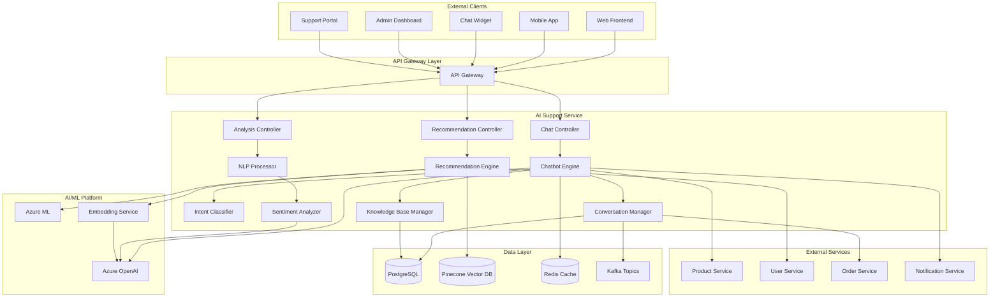
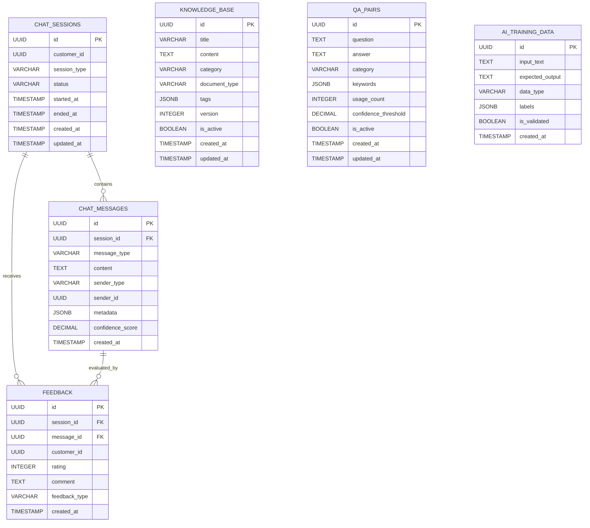

# AI Support Service 詳細設計書

## 目次

1. [概要](#概要)
2. [技術仕様](#技術仕様)
3. [アーキテクチャ設計](#アーキテクチャ設計)
4. [API設計](#api-design)
5. [データベース設計](#database-design)
6. [AI機能設計](#ai-features-design)
7. [チャットボット設計](#chatbot-design)
8. [エラー処理](#error-handling)
9. [テスト設計](#テスト設計)
10. [ローカル開発環境](#ローカル開発環境)
11. [本番デプロイメント](#本番デプロイメント)
12. [監視・運用](#監視運用)
13. [障害対応](#障害対応)

## 概要

### サービス概要

AI Support Serviceは、スキー用品販売ショップサイトのAI活用機能を担当するマイクロサービスです。チャットボット、商品推薦、FAQ自動応答、顧客サポート支援などのAI機能を提供します。

### 主要責務

- **チャットボット**: 24/7自動顧客対応
- **商品推薦**: AI基盤の個人化商品推薦
- **FAQ対応**: 自然言語処理による自動FAQ応答
- **サポート支援**: オペレーター向けAI支援機能
- **会話分析**: 顧客対話の感情分析・分類
- **知識管理**: サポート知識ベースの管理

### ビジネス価値

- **顧客満足度向上**: 即座な問い合わせ対応
- **運用コスト削減**: 自動化による人的コスト削減
- **売上向上**: パーソナライズド推薦による販売促進
- **顧客理解**: 会話分析による顧客インサイト獲得

## 技術仕様

### 使用技術スタック

| 技術領域 | 技術/ライブラリ | バージョン | 用途 |
|---------|----------------|-----------|------|
| **Runtime** | OpenJDK | 21 LTS | Java実行環境 |
| **Framework** | Jakarta EE | 11 | エンタープライズフレームワーク |
| **Application Server** | WildFly | 31.0.1 | Jakarta EEアプリケーションサーバー |
| **Persistence** | Jakarta Persistence (JPA) | 3.2 | ORM |
| **Data Access** | Jakarta Data | 1.0 | Repository抽象化 |
| **REST API** | Jakarta REST (JAX-RS) | 4.0 | RESTful Web Services |
| **WebSocket** | Jakarta WebSocket | 2.2 | リアルタイム通信 |
| **CDI** | Jakarta CDI | 4.1 | 依存性注入・管理 |
| **Validation** | Jakarta Validation | 3.1 | Bean Validation |
| **JSON Processing** | Jakarta JSON-P | 2.1 | JSON処理 |
| **Database** | PostgreSQL | 16 | 主データベース |
| **Vector Database** | PGVector | - | ベクトル検索 |
| **Cache** | Redis | 7.2 | 会話キャッシュ |
| **Message Queue** | Apache Kafka | 3.7 | AIイベント処理 |
| **AI Platform** | Azure OpenAI | GPT-4 | 大規模言語モデル |
| **ML Framework** | Azure ML | - | 機械学習プラットフォーム |
| **Monitoring** | MicroProfile Metrics | 5.1 | メトリクス収集 |
| **Tracing** | MicroProfile OpenTelemetry | 2.0 | 分散トレーシング |
| **Health Check** | MicroProfile Health | 4.0 | ヘルスチェック |
| **Configuration** | MicroProfile Config | 3.1 | 設定管理 |
| **HTTP Client** | MicroProfile Rest Client | 4.0 | 外部API連携 |

### 除外技術

- **Lombok**: Jakarta EE 11のRecord クラスとモダンJava機能を活用するため使用しません

### Java 21 LTS 活用機能

- **Virtual Threads**: 高並行AI処理
- **Record Classes**: AIレスポンス構造
- **Pattern Matching**: 意図分類ロジック
- **Text Blocks**: プロンプトテンプレート
- **Sealed Classes**: AIイベントの型安全性

## アーキテクチャ設計

### システムアーキテクチャ図



### ドメインモデル設計

```java
// 会話セッションエンティティ
@Entity
@Table(name = "conversation_sessions")
public class ConversationSession {
    
    @Id
    @GeneratedValue(strategy = GenerationType.UUID)
    private UUID id;
    
    @Column(name = "session_id", unique = true, nullable = false)
    private String sessionId;
    
    @Column(name = "customer_id")
    private UUID customerId;
    
    @Column(name = "visitor_id")
    private String visitorId;
    
    @Enumerated(EnumType.STRING)
    @Column(name = "channel", nullable = false)
    private ConversationChannel channel;
    
    @Enumerated(EnumType.STRING)
    @Column(name = "status", nullable = false)
    private ConversationStatus status;
    
    @Column(name = "language", length = 5)
    private String language = "ja";
    
    @Column(name = "user_agent")
    private String userAgent;
    
    @Column(name = "ip_address")
    private String ipAddress;
    
    @Column(name = "started_at", nullable = false)
    private LocalDateTime startedAt;
    
    @Column(name = "ended_at")
    private LocalDateTime endedAt;
    
    @Column(name = "last_activity_at")
    private LocalDateTime lastActivityAt;
    
    @Embedded
    private ConversationContext context;
    
    // 関連エンティティ
    @OneToMany(mappedBy = "conversationSession", cascade = CascadeType.ALL, fetch = FetchType.LAZY)
    @OrderBy("createdAt ASC")
    private List<ChatMessage> messages = new ArrayList<>();
    
    @OneToMany(mappedBy = "conversationSession", cascade = CascadeType.ALL, fetch = FetchType.LAZY)
    private List<ConversationAnalysis> analyses = new ArrayList<>();
    
    // ビジネスロジック
    public void addMessage(ChatMessage message) {
        message.setConversationSession(this);
        this.messages.add(message);
        this.lastActivityAt = LocalDateTime.now();
    }
    
    public void endConversation() {
        this.status = ConversationStatus.ENDED;
        this.endedAt = LocalDateTime.now();
    }
    
    public boolean isActive() {
        return status == ConversationStatus.ACTIVE;
    }
    
    public boolean isTimedOut(Duration timeout) {
        return lastActivityAt.plus(timeout).isBefore(LocalDateTime.now());
    }
    
    public long getMessageCount() {
        return messages.size();
    }
    
    public Duration getDuration() {
        var endTime = endedAt != null ? endedAt : LocalDateTime.now();
        return Duration.between(startedAt, endTime);
    }
    
    public List<ChatMessage> getRecentMessages(int count) {
        return messages.stream()
            .sorted((m1, m2) -> m2.getCreatedAt().compareTo(m1.getCreatedAt()))
            .limit(count)
            .toList();
    }
}

// チャットメッセージエンティティ
@Entity
@Table(name = "chat_messages")
public class ChatMessage {
    
    @Id
    @GeneratedValue(strategy = GenerationType.UUID)
    private UUID id;
    
    @ManyToOne(fetch = FetchType.LAZY)
    @JoinColumn(name = "conversation_session_id", nullable = false)
    private ConversationSession conversationSession;
    
    @Column(name = "message_id", unique = true, nullable = false)
    private String messageId;
    
    @Enumerated(EnumType.STRING)
    @Column(name = "sender_type", nullable = false)
    private MessageSenderType senderType;
    
    @Column(name = "sender_id")
    private String senderId;
    
    @Column(name = "content", columnDefinition = "TEXT", nullable = false)
    private String content;
    
    @Enumerated(EnumType.STRING)
    @Column(name = "message_type", nullable = false)
    private MessageType messageType;
    
    @Column(name = "metadata", columnDefinition = "JSONB")
    private String metadata;
    
    @Embedded
    private MessageAnalysis analysis;
    
    @Column(name = "created_at", nullable = false)
    private LocalDateTime createdAt;
    
    @Column(name = "processed_at")
    private LocalDateTime processedAt;
    
    // ビジネスロジック
    public boolean isFromUser() {
        return senderType == MessageSenderType.USER;
    }
    
    public boolean isFromBot() {
        return senderType == MessageSenderType.BOT;
    }
    
    public boolean isFromAgent() {
        return senderType == MessageSenderType.AGENT;
    }
    
    public void markAsProcessed() {
        this.processedAt = LocalDateTime.now();
    }
}

// 会話分析エンティティ
@Entity
@Table(name = "conversation_analyses")
public class ConversationAnalysis {
    
    @Id
    @GeneratedValue(strategy = GenerationType.UUID)
    private UUID id;
    
    @ManyToOne(fetch = FetchType.LAZY)
    @JoinColumn(name = "conversation_session_id", nullable = false)
    private ConversationSession conversationSession;
    
    @Enumerated(EnumType.STRING)
    @Column(name = "analysis_type", nullable = false)
    private AnalysisType analysisType;
    
    @Column(name = "intent", length = 100)
    private String intent;
    
    @Column(name = "confidence_score", precision = 5, scale = 4)
    private BigDecimal confidenceScore;
    
    @Enumerated(EnumType.STRING)
    @Column(name = "sentiment")
    private SentimentType sentiment;
    
    @Column(name = "sentiment_score", precision = 5, scale = 4)
    private BigDecimal sentimentScore;
    
    @Column(name = "entities", columnDefinition = "JSONB")
    private String entities;
    
    @Column(name = "keywords", columnDefinition = "JSONB")
    private String keywords;
    
    @Column(name = "satisfaction_score", precision = 3, scale = 2)
    private BigDecimal satisfactionScore;
    
    @Column(name = "resolution_status")
    private String resolutionStatus;
    
    @Column(name = "created_at", nullable = false)
    private LocalDateTime createdAt;
}

// 知識ベースエンティティ
@Entity
@Table(name = "knowledge_base")
public class KnowledgeBaseEntry {
    
    @Id
    @GeneratedValue(strategy = GenerationType.UUID)
    private UUID id;
    
    @Column(name = "title", nullable = false)
    private String title;
    
    @Column(name = "content", columnDefinition = "TEXT", nullable = false)
    private String content;
    
    @Column(name = "category", nullable = false)
    private String category;
    
    @Column(name = "subcategory")
    private String subcategory;
    
    @Column(name = "keywords", columnDefinition = "TEXT")
    private String keywords;
    
    @Column(name = "embedding_vector", columnDefinition = "vector(1536)")
    private String embeddingVector;
    
    @Column(name = "language", length = 5, nullable = false)
    private String language = "ja";
    
    @Column(name = "priority", nullable = false)
    private Integer priority = 0;
    
    @Column(name = "view_count", nullable = false)
    private Long viewCount = 0L;
    
    @Column(name = "helpful_count", nullable = false)
    private Long helpfulCount = 0L;
    
    @Column(name = "unhelpful_count", nullable = false)
    private Long unhelpfulCount = 0L;
    
    @Column(name = "is_active", nullable = false)
    private Boolean isActive = true;
    
    @Column(name = "created_at", nullable = false)
    private LocalDateTime createdAt;
    
    @Column(name = "updated_at")
    private LocalDateTime updatedAt;
    
    @Column(name = "created_by", nullable = false)
    private String createdBy;
    
    @Column(name = "updated_by")
    private String updatedBy;
    
    // ビジネスロジック
    public void incrementViewCount() {
        this.viewCount++;
    }
    
    public void markAsHelpful() {
        this.helpfulCount++;
    }
    
    public void markAsUnhelpful() {
        this.unhelpfulCount++;
    }
    
    public double getHelpfulnessRatio() {
        var totalFeedback = helpfulCount + unhelpfulCount;
        return totalFeedback > 0 ? (double) helpfulCount / totalFeedback : 0.0;
    }
    
    public boolean isHighlyRated() {
        return getHelpfulnessRatio() >= 0.8 && (helpfulCount + unhelpfulCount) >= 10;
    }
}

// 商品推薦エンティティ
@Entity
@Table(name = "product_recommendations")
public class ProductRecommendation {
    
    @Id
    @GeneratedValue(strategy = GenerationType.UUID)
    private UUID id;
    
    @Column(name = "customer_id")
    private UUID customerId;
    
    @Column(name = "session_id")
    private String sessionId;
    
    @Column(name = "product_id", nullable = false)
    private UUID productId;
    
    @Enumerated(EnumType.STRING)
    @Column(name = "recommendation_type", nullable = false)
    private RecommendationType recommendationType;
    
    @Column(name = "confidence_score", precision = 5, scale = 4, nullable = false)
    private BigDecimal confidenceScore;
    
    @Column(name = "reasoning", columnDefinition = "TEXT")
    private String reasoning;
    
    @Column(name = "context", columnDefinition = "JSONB")
    private String context;
    
    @Column(name = "position", nullable = false)
    private Integer position;
    
    @Column(name = "is_clicked", nullable = false)
    private Boolean isClicked = false;
    
    @Column(name = "is_purchased", nullable = false)
    private Boolean isPurchased = false;
    
    @Column(name = "clicked_at")
    private LocalDateTime clickedAt;
    
    @Column(name = "created_at", nullable = false)
    private LocalDateTime createdAt;
    
    public void recordClick() {
        this.isClicked = true;
        this.clickedAt = LocalDateTime.now();
    }
    
    public void recordPurchase() {
        this.isPurchased = true;
    }
}

// Embeddable Classes
@Embeddable
public record ConversationContext(
    @Column(name = "current_page")
    String currentPage,
    
    @Column(name = "referrer")
    String referrer,
    
    @Column(name = "product_context", columnDefinition = "JSONB")
    String productContext,
    
    @Column(name = "cart_context", columnDefinition = "JSONB")
    String cartContext,
    
    @Column(name = "user_preferences", columnDefinition = "JSONB")
    String userPreferences
) {}

@Embeddable
public record MessageAnalysis(
    @Column(name = "intent")
    String intent,
    
    @Column(name = "intent_confidence", precision = 5, scale = 4)
    BigDecimal intentConfidence,
    
    @Column(name = "sentiment")
    String sentiment,
    
    @Column(name = "sentiment_score", precision = 5, scale = 4)
    BigDecimal sentimentScore,
    
    @Column(name = "entities", columnDefinition = "JSONB")
    String entities,
    
    @Column(name = "language_detected")
    String languageDetected
) {}

// Enums
public enum ConversationChannel {
    WEB_CHAT("ウェブチャット"),
    MOBILE_APP("モバイルアプリ"),
    EMAIL("メール"),
    PHONE("電話"),
    SOCIAL_MEDIA("ソーシャルメディア");
    
    private final String description;
    
    ConversationChannel(String description) {
        this.description = description;
    }
    
    public String getDescription() {
        return description;
    }
}

public enum ConversationStatus {
    ACTIVE("アクティブ"),
    PAUSED("一時停止"),
    ENDED("終了"),
    TRANSFERRED("転送済み"),
    ESCALATED("エスカレート済み");
    
    private final String description;
    
    ConversationStatus(String description) {
        this.description = description;
    }
    
    public String getDescription() {
        return description;
    }
}

public enum MessageSenderType {
    USER("ユーザー"),
    BOT("ボット"),
    AGENT("エージェント"),
    SYSTEM("システム");
    
    private final String description;
    
    MessageSenderType(String description) {
        this.description = description;
    }
    
    public String getDescription() {
        return description;
    }
}

public enum MessageType {
    TEXT("テキスト"),
    IMAGE("画像"),
    FILE("ファイル"),
    QUICK_REPLY("クイック返信"),
    CAROUSEL("カルーセル"),
    BUTTON("ボタン"),
    SYSTEM("システム");
    
    private final String description;
    
    MessageType(String description) {
        this.description = description;
    }
    
    public String getDescription() {
        return description;
    }
}

public enum AnalysisType {
    INTENT_CLASSIFICATION("意図分類"),
    SENTIMENT_ANALYSIS("感情分析"),
    ENTITY_EXTRACTION("エンティティ抽出"),
    SATISFACTION_SCORING("満足度スコア");
    
    private final String description;
    
    AnalysisType(String description) {
        this.description = description;
    }
    
    public String getDescription() {
        return description;
    }
}

public enum SentimentType {
    VERY_POSITIVE("非常にポジティブ"),
    POSITIVE("ポジティブ"),
    NEUTRAL("中性"),
    NEGATIVE("ネガティブ"),
    VERY_NEGATIVE("非常にネガティブ");
    
    private final String description;
    
    SentimentType(String description) {
        this.description = description;
    }
    
    public String getDescription() {
        return description;
    }
    
    public static SentimentType fromScore(double score) {
        if (score >= 0.6) return VERY_POSITIVE;
        if (score >= 0.2) return POSITIVE;
        if (score >= -0.2) return NEUTRAL;
        if (score >= -0.6) return NEGATIVE;
        return VERY_NEGATIVE;
    }
}

public enum RecommendationType {
    COLLABORATIVE_FILTERING("協調フィルタリング"),
    CONTENT_BASED("コンテンツベース"),
    HYBRID("ハイブリッド"),
    TRENDING("トレンド"),
    SEASONAL("季節"),
    CONTEXTUAL("コンテキスト"),
    CONVERSATION_BASED("会話ベース");
    
    private final String description;
    
    RecommendationType(String description) {
        this.description = description;
    }
    
    public String getDescription() {
        return description;
    }
}

// Sealed Classes for Events
public sealed interface AISupportEvent
    permits ConversationStartedEvent, MessageReceivedEvent, MessageSentEvent,
            ConversationEndedEvent, RecommendationGeneratedEvent, IntentDetectedEvent {
}

public record ConversationStartedEvent(
    String sessionId,
    UUID customerId,
    ConversationChannel channel,
    LocalDateTime timestamp
) implements AISupportEvent {}

public record MessageReceivedEvent(
    String sessionId,
    String messageId,
    String content,
    MessageSenderType senderType,
    LocalDateTime timestamp
) implements AISupportEvent {}

public record MessageSentEvent(
    String sessionId,
    String messageId,
    String content,
    MessageSenderType senderType,
    LocalDateTime timestamp
) implements AISupportEvent {}

public record ConversationEndedEvent(
    String sessionId,
    UUID customerId,
    Duration duration,
    Integer messageCount,
    LocalDateTime timestamp
) implements AISupportEvent {}

public record RecommendationGeneratedEvent(
    UUID customerId,
    List<UUID> productIds,
    RecommendationType type,
    LocalDateTime timestamp
) implements AISupportEvent {}

public record IntentDetectedEvent(
    String sessionId,
    String intent,
    BigDecimal confidence,
    LocalDateTime timestamp
) implements AISupportEvent {}

// 例外クラス
public class ChatSessionNotFoundException extends RuntimeException {
    public ChatSessionNotFoundException(String message) {
        super(message);
    }
}

public class AIServiceUnavailableException extends RuntimeException {
    public AIServiceUnavailableException(String message) {
        super(message);
    }
}

public class InvalidMessageException extends RuntimeException {
    public InvalidMessageException(String message) {
        super(message);
    }
}

public class RecommendationServiceException extends RuntimeException {
    public RecommendationServiceException(String message) {
        super(message);
    }
}
```

## API設計 {#api-design}

### REST API エンドポイント

```java
@Path("/api/v1/ai-support")
@ApplicationScoped
@Produces(MediaType.APPLICATION_JSON)
@Consumes(MediaType.APPLICATION_JSON)
public class AISupportController {
    
    private static final Logger logger = LoggerFactory.getLogger(AISupportController.class);
    
    @Inject
    private ChatService chatService;
    
    @Inject
    private QuestionAnswerService qaService;
    
    @Inject
    private ProductRecommendationService recommendationService;
    
    @POST
    @Path("/chat")
    @Operation(summary = "チャット送信", description = "AI チャットボットにメッセージを送信します")
    @APIResponse(responseCode = "200", description = "チャット応答成功")
    @APIResponse(responseCode = "400", description = "不正なリクエスト")
    public Response sendChatMessage(@Valid @RequestBody ChatRequest request) {
        try {
            var sessionId = request.sessionId() != null ? request.sessionId() : UUID.randomUUID();
            
            var chatResponse = chatService.processMessage(
                sessionId,
                request.customerId(),
                request.message(),
                request.context()
            );
            
            return Response.ok(chatResponse).build();
            
        } catch (Exception e) {
            logger.error("Failed to process chat message", e);
            return Response.status(Response.Status.INTERNAL_SERVER_ERROR)
                .entity(Map.of("error", "チャット処理でエラーが発生しました"))
                .build();
        }
    }
    
    @GET
    @Path("/chat/sessions/{sessionId}/history")
    @Operation(summary = "チャット履歴取得", description = "指定されたセッションのチャット履歴を取得します")
    @APIResponse(responseCode = "200", description = "履歴取得成功")
    @APIResponse(responseCode = "404", description = "セッションが見つからない")
    public Response getChatHistory(
            @PathParam("sessionId") UUID sessionId,
            @QueryParam("limit") @DefaultValue("50") int limit) {
        
        try {
            var history = chatService.getChatHistory(sessionId, limit);
            
            if (history.isEmpty()) {
                return Response.status(Response.Status.NOT_FOUND)
                    .entity(Map.of("error", "Chat session not found"))
                    .build();
            }
            
            return Response.ok(history).build();
            
        } catch (Exception e) {
            logger.error("Failed to get chat history", e);
            return Response.status(Response.Status.INTERNAL_SERVER_ERROR)
                .entity(Map.of("error", "履歴取得でエラーが発生しました"))
                .build();
        }
    }
    
    @POST
    @Path("/qa")
    @Operation(summary = "Q&A質問", description = "商品やサービスに関する質問に回答します")
    @APIResponse(responseCode = "200", description = "回答成功")
    @APIResponse(responseCode = "400", description = "不正なリクエスト")
    public Response askQuestion(@Valid @RequestBody QuestionRequest request) {
        try {
            var answer = qaService.answerQuestion(
                request.question(),
                request.customerId(),
                request.category(),
                request.context()
            );
            
            return Response.ok(answer).build();
            
        } catch (Exception e) {
            logger.error("Failed to answer question", e);
            return Response.status(Response.Status.INTERNAL_SERVER_ERROR)
                .entity(Map.of("error", "質問回答でエラーが発生しました"))
                .build();
        }
    }
    
    @GET
    @Path("/recommendations/{customerId}")
    @Operation(summary = "商品推奨", description = "顧客に合わせた商品を推奨します")
    @APIResponse(responseCode = "200", description = "推奨成功")
    @APIResponse(responseCode = "404", description = "顧客が見つからない")
    public Response getProductRecommendations(
            @PathParam("customerId") UUID customerId,
            @QueryParam("category") String category,
            @QueryParam("priceRange") String priceRange,
            @QueryParam("limit") @DefaultValue("10") int limit) {
        
        try {
            var preferences = new RecommendationPreferences(
                customerId,
                category,
                priceRange,
                limit
            );
            
            var recommendations = recommendationService.getRecommendations(preferences);
            
            return Response.ok(recommendations).build();
            
        } catch (Exception e) {
            logger.error("Failed to get product recommendations", e);
            return Response.status(Response.Status.INTERNAL_SERVER_ERROR)
                .entity(Map.of("error", "商品推奨でエラーが発生しました"))
                .build();
        }
    }
    
    @POST
    @Path("/feedback")
    @Operation(summary = "フィードバック送信", description = "AI応答に対するフィードバックを送信します")
    @APIResponse(responseCode = "200", description = "フィードバック送信成功")
    @APIResponse(responseCode = "400", description = "不正なリクエスト")
    public Response submitFeedback(@Valid @RequestBody FeedbackRequest request) {
        try {
            chatService.recordFeedback(
                request.sessionId(),
                request.messageId(),
                request.rating(),
                request.comment(),
                request.customerId()
            );
            
            return Response.ok(Map.of("message", "フィードバックを受け付けました")).build();
            
        } catch (Exception e) {
            logger.error("Failed to submit feedback", e);
            return Response.status(Response.Status.INTERNAL_SERVER_ERROR)
                .entity(Map.of("error", "フィードバック送信でエラーが発生しました"))
                .build();
        }
    }
    
    @GET
    @Path("/analytics/conversations")
    @Operation(summary = "会話分析", description = "チャットボットの会話統計を取得します")
    @APIResponse(responseCode = "200", description = "分析データ取得成功")
    public Response getConversationAnalytics(
            @QueryParam("fromDate") String fromDate,
            @QueryParam("toDate") String toDate,
            @QueryParam("groupBy") @DefaultValue("day") String groupBy) {
        
        try {
            var from = fromDate != null ? LocalDateTime.parse(fromDate) : LocalDateTime.now().minusDays(7);
            var to = toDate != null ? LocalDateTime.parse(toDate) : LocalDateTime.now();
            
            var analytics = chatService.getConversationAnalytics(from, to, groupBy);
            
            return Response.ok(analytics).build();
            
        } catch (Exception e) {
            logger.error("Failed to get conversation analytics", e);
            return Response.status(Response.Status.INTERNAL_SERVER_ERROR)
                .entity(Map.of("error", "分析データ取得でエラーが発生しました"))
                .build();
        }
    }
}
```

### DTO設計

```java
// Request DTOs
public record ChatRequest(
    UUID sessionId,
    UUID customerId,
    String message,
    Map<String, Object> context
) {}

public record QuestionRequest(
    String question,
    UUID customerId,
    String category,
    Map<String, Object> context
) {}

public record FeedbackRequest(
    UUID sessionId,
    UUID messageId,
    int rating,
    String comment,
    UUID customerId
) {}

public record RecommendationPreferences(
    UUID customerId,
    String category,
    String priceRange,
    int limit
) {}

// Response DTOs
public record ChatResponse(
    UUID sessionId,
    UUID messageId,
    String response,
    ChatMessageType messageType,
    List<String> suggestedActions,
    Map<String, Object> metadata,
    LocalDateTime timestamp
) {}

public record QuestionAnswerResponse(
    UUID questionId,
    String answer,
    double confidence,
    List<String> relatedTopics,
    List<DocumentReference> sources,
    LocalDateTime timestamp
) {}

public record ProductRecommendation(
    UUID productId,
    String name,
    String description,
    BigDecimal price,
    String imageUrl,
    double relevanceScore,
    String reasonCode,
    List<String> features
) {}

public record ConversationAnalytics(
    long totalConversations,
    long totalMessages,
    double averageSessionLength,
    double customerSatisfactionScore,
    Map<String, Long> topicDistribution,
    Map<String, Double> responseTimeMetrics,
    List<TrendData> trends
) {}

public record DocumentReference(
    String title,
    String url,
    String snippet,
    double relevanceScore
) {}

public record TrendData(
    String period,
    long value,
    double changePercentage
) {}
```

## データベース設計 {#database-design}

### ERD（Entity Relationship Diagram）



### 詳細テーブル設計

```sql
-- チャットセッションテーブル
CREATE TABLE chat_sessions (
    id UUID PRIMARY KEY DEFAULT gen_random_uuid(),
    customer_id UUID,
    session_type VARCHAR(50) NOT NULL DEFAULT 'GENERAL',
    status VARCHAR(20) NOT NULL DEFAULT 'ACTIVE',
    started_at TIMESTAMP NOT NULL DEFAULT CURRENT_TIMESTAMP,
    ended_at TIMESTAMP,
    created_at TIMESTAMP NOT NULL DEFAULT CURRENT_TIMESTAMP,
    updated_at TIMESTAMP NOT NULL DEFAULT CURRENT_TIMESTAMP
);

-- チャットメッセージテーブル
CREATE TABLE chat_messages (
    id UUID PRIMARY KEY DEFAULT gen_random_uuid(),
    session_id UUID NOT NULL REFERENCES chat_sessions(id) ON DELETE CASCADE,
    message_type VARCHAR(20) NOT NULL,
    content TEXT NOT NULL,
    sender_type VARCHAR(20) NOT NULL,
    sender_id UUID,
    metadata JSONB,
    confidence_score DECIMAL(5,4),
    created_at TIMESTAMP NOT NULL DEFAULT CURRENT_TIMESTAMP
);

-- ナレッジベーステーブル
CREATE TABLE knowledge_base (
    id UUID PRIMARY KEY DEFAULT gen_random_uuid(),
    title VARCHAR(500) NOT NULL,
    content TEXT NOT NULL,
    category VARCHAR(100) NOT NULL,
    document_type VARCHAR(50) NOT NULL DEFAULT 'FAQ',
    tags JSONB,
    version INTEGER NOT NULL DEFAULT 1,
    is_active BOOLEAN NOT NULL DEFAULT TRUE,
    created_at TIMESTAMP NOT NULL DEFAULT CURRENT_TIMESTAMP,
    updated_at TIMESTAMP NOT NULL DEFAULT CURRENT_TIMESTAMP
);

-- Q&Aペアテーブル
CREATE TABLE qa_pairs (
    id UUID PRIMARY KEY DEFAULT gen_random_uuid(),
    question TEXT NOT NULL,
    answer TEXT NOT NULL,
    category VARCHAR(100) NOT NULL,
    keywords JSONB,
    usage_count INTEGER NOT NULL DEFAULT 0,
    confidence_threshold DECIMAL(5,4) NOT NULL DEFAULT 0.8,
    is_active BOOLEAN NOT NULL DEFAULT TRUE,
    created_at TIMESTAMP NOT NULL DEFAULT CURRENT_TIMESTAMP,
    updated_at TIMESTAMP NOT NULL DEFAULT CURRENT_TIMESTAMP
);

-- フィードバックテーブル
CREATE TABLE feedback (
    id UUID PRIMARY KEY DEFAULT gen_random_uuid(),
    session_id UUID NOT NULL REFERENCES chat_sessions(id),
    message_id UUID NOT NULL REFERENCES chat_messages(id),
    customer_id UUID,
    rating INTEGER NOT NULL CHECK (rating >= 1 AND rating <= 5),
    comment TEXT,
    feedback_type VARCHAR(50) NOT NULL DEFAULT 'QUALITY',
    created_at TIMESTAMP NOT NULL DEFAULT CURRENT_TIMESTAMP
);

-- AI学習データテーブル
CREATE TABLE ai_training_data (
    id UUID PRIMARY KEY DEFAULT gen_random_uuid(),
    input_text TEXT NOT NULL,
    expected_output TEXT NOT NULL,
    data_type VARCHAR(50) NOT NULL,
    labels JSONB,
    is_validated BOOLEAN NOT NULL DEFAULT FALSE,
    created_at TIMESTAMP NOT NULL DEFAULT CURRENT_TIMESTAMP
);

-- インデックス作成
CREATE INDEX idx_chat_sessions_customer_id ON chat_sessions(customer_id);
CREATE INDEX idx_chat_sessions_status ON chat_sessions(status);
CREATE INDEX idx_chat_messages_session_id ON chat_messages(session_id);
CREATE INDEX idx_chat_messages_created_at ON chat_messages(created_at);
CREATE INDEX idx_knowledge_base_category ON knowledge_base(category);
CREATE INDEX idx_knowledge_base_is_active ON knowledge_base(is_active);
CREATE INDEX idx_qa_pairs_category ON qa_pairs(category);
CREATE INDEX idx_qa_pairs_is_active ON qa_pairs(is_active);
CREATE INDEX idx_feedback_session_id ON feedback(session_id);
CREATE INDEX idx_feedback_rating ON feedback(rating);

-- 全文検索インデックス
CREATE INDEX idx_knowledge_base_content_fts ON knowledge_base USING gin(to_tsvector('japanese', content));
CREATE INDEX idx_qa_pairs_question_fts ON qa_pairs USING gin(to_tsvector('japanese', question));
```

## AI機能設計 {#ai-features-design}

### OpenAI統合サービス

```java
@ApplicationScoped
public class OpenAIService {
    
    private static final Logger logger = LoggerFactory.getLogger(OpenAIService.class);
    
    @ConfigProperty(name = "openai.api.key")
    private String apiKey;
    
    @ConfigProperty(name = "openai.api.base-url")
    private String baseUrl;
    
    @ConfigProperty(name = "openai.model.chat")
    private String chatModel;
    
    @ConfigProperty(name = "openai.model.embedding")
    private String embeddingModel;
    
    @RestClient
    private OpenAIClient openAIClient;
    
    public CompletableFuture<String> generateChatResponse(String message, List<ChatMessage> history, 
                                                         Map<String, Object> context) {
        return CompletableFuture.supplyAsync(() -> {
            try {
                var systemPrompt = buildSystemPrompt(context);
                var messages = buildMessageHistory(systemPrompt, history, message);
                
                var request = new ChatCompletionRequest(
                    chatModel,
                    messages,
                    0.7, // temperature
                    1000, // max_tokens
                    1.0, // top_p
                    0.0, // frequency_penalty
                    0.0  // presence_penalty
                );
                
                var response = openAIClient.createChatCompletion(request);
                
                if (response.choices().isEmpty()) {
                    throw new AIServiceException("No response generated");
                }
                
                var content = response.choices().get(0).message().content();
                
                // レスポンス品質チェック
                validateResponseQuality(content, message);
                
                return content;
                
            } catch (Exception e) {
                logger.error("Failed to generate chat response", e);
                throw new AIServiceException("Chat response generation failed", e);
            }
        }, VirtualThread.ofVirtual().factory());
    }
    
    public CompletableFuture<List<Double>> generateEmbedding(String text) {
        return CompletableFuture.supplyAsync(() -> {
            try {
                var request = new EmbeddingRequest(
                    embeddingModel,
                    text
                );
                
                var response = openAIClient.createEmbedding(request);
                
                if (response.data().isEmpty()) {
                    throw new AIServiceException("No embedding generated");
                }
                
                return response.data().get(0).embedding();
                
            } catch (Exception e) {
                logger.error("Failed to generate embedding", e);
                throw new AIServiceException("Embedding generation failed", e);
            }
        }, VirtualThread.ofVirtual().factory());
    }
    
    public CompletableFuture<String> summarizeConversation(List<ChatMessage> messages) {
        return CompletableFuture.supplyAsync(() -> {
            try {
                var conversationText = messages.stream()
                    .map(msg -> msg.senderType() + ": " + msg.content())
                    .collect(Collectors.joining("\n"));
                
                var systemPrompt = """
                    以下の会話を簡潔に要約してください。
                    - 主要なトピックと解決した課題を含める
                    - 重要な商品やサービスの言及を含める
                    - 200文字以内で要約する
                    """;
                
                var messages = List.of(
                    new OpenAIMessage("system", systemPrompt),
                    new OpenAIMessage("user", "会話内容:\n" + conversationText)
                );
                
                var request = new ChatCompletionRequest(
                    chatModel,
                    messages,
                    0.3, // 低いtemperatureで一貫した要約
                    200,
                    1.0,
                    0.0,
                    0.0
                );
                
                var response = openAIClient.createChatCompletion(request);
                return response.choices().get(0).message().content();
                
            } catch (Exception e) {
                logger.error("Failed to summarize conversation", e);
                return "会話の要約に失敗しました";
            }
        }, VirtualThread.ofVirtual().factory());
    }
    
    private String buildSystemPrompt(Map<String, Object> context) {
        var prompt = new StringBuilder();
        prompt.append("あなたはスキー用品販売ショップの専門的なAIアシスタントです。\n\n");
        prompt.append("役割と責任:\n");
        prompt.append("- スキー用品に関する専門知識を提供\n");
        prompt.append("- 顧客の技術レベルと好みに基づいた推奨\n");
        prompt.append("- 安全で楽しいスキー体験のサポート\n");
        prompt.append("- 親切で専門的なトーンで応答\n\n");
        
        if (context.containsKey("customerLevel")) {
            prompt.append("顧客レベル: ").append(context.get("customerLevel")).append("\n");
        }
        
        if (context.containsKey("previousPurchases")) {
            prompt.append("過去の購入履歴: ").append(context.get("previousPurchases")).append("\n");
        }
        
        if (context.containsKey("currentSeason")) {
            prompt.append("現在のシーズン: ").append(context.get("currentSeason")).append("\n");
        }
        
        prompt.append("\n応答時の注意事項:\n");
        prompt.append("- 具体的で実用的なアドバイスを提供\n");
        prompt.append("- 安全性を最優先に考慮\n");
        prompt.append("- 商品推奨時は理由を明確に説明\n");
        prompt.append("- 不明な点は正直に伝える\n");
        
        return prompt.toString();
    }
    
    private List<OpenAIMessage> buildMessageHistory(String systemPrompt, 
                                                   List<ChatMessage> history, 
                                                   String currentMessage) {
        var messages = new ArrayList<OpenAIMessage>();
        messages.add(new OpenAIMessage("system", systemPrompt));
        
        // 過去の会話履歴を追加（最新10件まで）
        history.stream()
            .skip(Math.max(0, history.size() - 10))
            .forEach(msg -> {
                var role = msg.senderType() == SenderType.USER ? "user" : "assistant";
                messages.add(new OpenAIMessage(role, msg.content()));
            });
        
        messages.add(new OpenAIMessage("user", currentMessage));
        
        return messages;
    }
    
    private void validateResponseQuality(String response, String originalMessage) {
        // 基本的な品質チェック
        if (response == null || response.trim().isEmpty()) {
            throw new AIServiceException("Empty response generated");
        }
        
        if (response.length() < 10) {
            throw new AIServiceException("Response too short");
        }
        
        if (response.length() > 2000) {
            logger.warn("Response length exceeds recommended limit: {} chars", response.length());
        }
        
        // 不適切なコンテンツチェック
        if (containsInappropriateContent(response)) {
            throw new AIServiceException("Inappropriate content detected");
        }
    }
    
    private boolean containsInappropriateContent(String content) {
        // 簡単な不適切コンテンツ検出
        var inappropriatePatterns = List.of(
            "申し訳ありませんが、お手伝いできません",
            "AIアシスタントとして",
            "私は言語モデルです"
        );
        
        return inappropriatePatterns.stream()
            .anyMatch(pattern -> content.toLowerCase().contains(pattern.toLowerCase()));
    }
}

// OpenAI API Client
@RestClient
@RegisterRestClient
public interface OpenAIClient {
    
    @POST
    @Path("/v1/chat/completions")
    @Consumes(MediaType.APPLICATION_JSON)
    @Produces(MediaType.APPLICATION_JSON)
    ChatCompletionResponse createChatCompletion(ChatCompletionRequest request);
    
    @POST
    @Path("/v1/embeddings")
    @Consumes(MediaType.APPLICATION_JSON)
    @Produces(MediaType.APPLICATION_JSON)
    EmbeddingResponse createEmbedding(EmbeddingRequest request);
}

// OpenAI DTOs
public record ChatCompletionRequest(
    String model,
    List<OpenAIMessage> messages,
    double temperature,
    int max_tokens,
    double top_p,
    double frequency_penalty,
    double presence_penalty
) {}

public record ChatCompletionResponse(
    String id,
    String object,
    long created,
    String model,
    List<Choice> choices,
    Usage usage
) {}

public record Choice(
    int index,
    OpenAIMessage message,
    String finish_reason
) {}

public record OpenAIMessage(
    String role,
    String content
) {}

public record Usage(
    int prompt_tokens,
    int completion_tokens,
    int total_tokens
) {}

public record EmbeddingRequest(
    String model,
    String input
) {}

public record EmbeddingResponse(
    String object,
    List<EmbeddingData> data,
    String model,
    Usage usage
) {}

public record EmbeddingData(
    String object,
    int index,
    List<Double> embedding
) {}
```

### ナレッジベース検索サービス

```java
@ApplicationScoped
public class KnowledgeBaseService {
    
    private static final Logger logger = LoggerFactory.getLogger(KnowledgeBaseService.class);
    
    @Inject
    private KnowledgeBaseRepository knowledgeRepository;
    
    @Inject
    private OpenAIService openAIService;
    
    @Inject
    @ConfigProperty(name = "ai.similarity.threshold", defaultValue = "0.8")
    private Double similarityThreshold;
    
    public CompletableFuture<List<DocumentSearchResult>> searchRelevantDocuments(
            String query, String category, int limit) {
        
        return CompletableFuture.supplyAsync(() -> {
            try {
                // クエリの埋め込みベクトルを生成
                var queryEmbedding = openAIService.generateEmbedding(query).join();
                
                // ベクトル類似度検索
                var searchResults = knowledgeRepository.findSimilarDocuments(
                    queryEmbedding, 
                    category, 
                    similarityThreshold, 
                    limit
                );
                
                // 結果をスコア順にソート
                return searchResults.stream()
                    .sorted((a, b) -> Double.compare(b.similarityScore(), a.similarityScore()))
                    .toList();
                
            } catch (Exception e) {
                logger.error("Failed to search knowledge base", e);
                return List.of();
            }
        }, VirtualThread.ofVirtual().factory());
    }
    
    public CompletableFuture<String> generateContextualAnswer(String question, 
                                                             List<DocumentSearchResult> relevantDocs) {
        
        return CompletableFuture.supplyAsync(() -> {
            try {
                if (relevantDocs.isEmpty()) {
                    return "申し訳ございませんが、お答えできる情報が見つかりませんでした。";
                }
                
                var context = buildDocumentContext(relevantDocs);
                var systemPrompt = """
                    以下の文書情報を基に、ユーザーの質問に正確で役立つ回答を提供してください。
                    
                    回答時の注意事項:
                    - 提供された文書情報のみを使用してください
                    - 確実でない情報は推測しないでください
                    - 具体的で実用的なアドバイスを心がけてください
                    - スキー用品の専門知識を活用してください
                    
                    参考文書:
                    """ + context;
                
                var messages = List.of(
                    new OpenAIMessage("system", systemPrompt),
                    new OpenAIMessage("user", question)
                );
                
                return openAIService.generateChatResponse(question, List.of(), 
                    Map.of("context", "knowledge_base_search")).join();
                
            } catch (Exception e) {
                logger.error("Failed to generate contextual answer", e);
                return "申し訳ございませんが、回答の生成に失敗しました。";
            }
        }, VirtualThread.ofVirtual().factory());
    }
    
    public void updateDocumentEmbeddings() {
        logger.info("Starting document embedding update");
        
        var documents = knowledgeRepository.findDocumentsWithoutEmbeddings();
        
        documents.parallelStream()
            .forEach(doc -> {
                try {
                    var content = doc.getTitle() + "\n" + doc.getContent();
                    var embedding = openAIService.generateEmbedding(content).join();
                    
                    doc.setEmbedding(embedding);
                    knowledgeRepository.save(doc);
                    
                    logger.debug("Updated embedding for document: {}", doc.getId());
                    
                } catch (Exception e) {
                    logger.error("Failed to update embedding for document: {}", doc.getId(), e);
                }
            });
        
        logger.info("Completed document embedding update");
    }
    
    private String buildDocumentContext(List<DocumentSearchResult> documents) {
        return documents.stream()
            .map(doc -> String.format(
                "文書: %s\n内容: %s\n関連度: %.2f\n",
                doc.title(),
                doc.content(),
                doc.similarityScore()
            ))
            .collect(Collectors.joining("\n---\n"));
    }
}

public record DocumentSearchResult(
    UUID documentId,
    String title,
    String content,
    String category,
    double similarityScore,
    List<String> tags
) {}
```

## チャットボット設計 {#chatbot-design}

### チャット会話管理サービス

```java
@ApplicationScoped
@Transactional
public class ChatService {
    
    private static final Logger logger = LoggerFactory.getLogger(ChatService.class);
    
    @Inject
    private ChatSessionRepository sessionRepository;
    
    @Inject
    private ChatMessageRepository messageRepository;
    
    @Inject
    private OpenAIService openAIService;
    
    @Inject
    private KnowledgeBaseService knowledgeService;
    
    @Inject
    private CustomerProfileService customerService;
    
    @Inject
    private IntentClassificationService intentService;
    
    private final ExecutorService executor = Executors.newVirtualThreadPerTaskExecutor();
    
    public CompletableFuture<ChatResponse> processMessage(UUID sessionId, UUID customerId, 
                                                         String message, Map<String, Object> context) {
        
        return CompletableFuture.supplyAsync(() -> {
            try {
                // セッション取得または作成
                var session = getOrCreateSession(sessionId, customerId);
                
                // ユーザーメッセージを記録
                var userMessage = recordMessage(session, message, SenderType.USER, customerId);
                
                // インテント分類
                var intent = intentService.classifyIntent(message, context);
                
                // レスポンス生成
                var response = generateResponse(session, message, intent, context);
                
                // AIレスポンスを記録
                var aiMessage = recordMessage(session, response.response(), SenderType.AI, null);
                
                // セッション更新
                updateSessionActivity(session);
                
                return response;
                
            } catch (Exception e) {
                logger.error("Failed to process chat message", e);
                return new ChatResponse(
                    sessionId,
                    UUID.randomUUID(),
                    "申し訳ございませんが、現在サービスに問題が発生しております。しばらく経ってから再度お試しください。",
                    ChatMessageType.ERROR,
                    List.of(),
                    Map.of(),
                    LocalDateTime.now()
                );
            }
        }, executor);
    }
    
    public List<ChatMessage> getChatHistory(UUID sessionId, int limit) {
        return messageRepository.findBySessionIdOrderByCreatedAtDesc(sessionId, limit);
    }
    
    public void recordFeedback(UUID sessionId, UUID messageId, int rating, 
                              String comment, UUID customerId) {
        
        var feedback = new ChatFeedback();
        feedback.setSessionId(sessionId);
        feedback.setMessageId(messageId);
        feedback.setCustomerId(customerId);
        feedback.setRating(rating);
        feedback.setComment(comment);
        feedback.setCreatedAt(LocalDateTime.now());
        
        feedbackRepository.save(feedback);
        
        // 低評価の場合はアラート
        if (rating <= 2) {
            alertService.sendLowRatingAlert(sessionId, messageId, rating, comment);
        }
    }
    
    public ConversationAnalytics getConversationAnalytics(LocalDateTime fromDate, 
                                                         LocalDateTime toDate, 
                                                         String groupBy) {
        
        var sessions = sessionRepository.findByDateRange(fromDate, toDate);
        var messages = messageRepository.findByDateRange(fromDate, toDate);
        
        var totalConversations = sessions.size();
        var totalMessages = messages.size();
        
        var averageSessionLength = sessions.stream()
            .filter(s -> s.getEndedAt() != null)
            .mapToLong(s -> Duration.between(s.getStartedAt(), s.getEndedAt()).toMinutes())
            .average()
            .orElse(0.0);
        
        var satisfactionScore = calculateSatisfactionScore(sessions);
        var topicDistribution = calculateTopicDistribution(messages);
        var responseTimeMetrics = calculateResponseTimeMetrics(messages);
        var trends = calculateTrends(sessions, groupBy);
        
        return new ConversationAnalytics(
            totalConversations,
            totalMessages,
            averageSessionLength,
            satisfactionScore,
            topicDistribution,
            responseTimeMetrics,
            trends
        );
    }
    
    private ChatSession getOrCreateSession(UUID sessionId, UUID customerId) {
        return sessionRepository.findById(sessionId)
            .orElseGet(() -> {
                var newSession = new ChatSession();
                newSession.setId(sessionId);
                newSession.setCustomerId(customerId);
                newSession.setSessionType("GENERAL");
                newSession.setStatus("ACTIVE");
                newSession.setStartedAt(LocalDateTime.now());
                newSession.setCreatedAt(LocalDateTime.now());
                return sessionRepository.save(newSession);
            });
    }
    
    private ChatMessage recordMessage(ChatSession session, String content, 
                                    SenderType senderType, UUID senderId) {
        
        var message = new ChatMessage();
        message.setSessionId(session.getId());
        message.setContent(content);
        message.setSenderType(senderType);
        message.setSenderId(senderId);
        message.setMessageType(determineMessageType(content, senderType));
        message.setCreatedAt(LocalDateTime.now());
        
        return messageRepository.save(message);
    }
    
    private ChatResponse generateResponse(ChatSession session, String message, 
                                        MessageIntent intent, Map<String, Object> context) {
        
        return switch (intent.type()) {
            case PRODUCT_INQUIRY -> handleProductInquiry(session, message, context);
            case TECHNICAL_SUPPORT -> handleTechnicalSupport(session, message, context);
            case ORDER_STATUS -> handleOrderStatus(session, message, context);
            case RECOMMENDATION_REQUEST -> handleRecommendationRequest(session, message, context);
            case GENERAL_QUESTION -> handleGeneralQuestion(session, message, context);
            case COMPLAINT -> handleComplaint(session, message, context);
            default -> handleGeneralChat(session, message, context);
        };
    }
    
    private ChatResponse handleProductInquiry(ChatSession session, String message, 
                                            Map<String, Object> context) {
        
        try {
            // 関連商品情報を検索
            var relevantDocs = knowledgeService.searchRelevantDocuments(
                message, "PRODUCT", 5
            ).join();
            
            // 顧客プロファイルを取得
            var customerProfile = customerService.getCustomerProfile(session.getCustomerId());
            
            // コンテキストに顧客情報を追加
            var enhancedContext = new HashMap<>(context);
            if (customerProfile.isPresent()) {
                enhancedContext.put("customerLevel", customerProfile.get().getSkillLevel());
                enhancedContext.put("previousPurchases", customerProfile.get().getPurchaseHistory());
            }
            
            // AI応答生成
            var response = openAIService.generateChatResponse(
                message, 
                getChatHistory(session.getId(), 5), 
                enhancedContext
            ).join();
            
            // 推奨アクションを生成
            var suggestedActions = generateProductInquiryActions(message, relevantDocs);
            
            return new ChatResponse(
                session.getId(),
                UUID.randomUUID(),
                response,
                ChatMessageType.PRODUCT_INFO,
                suggestedActions,
                Map.of("intent", "PRODUCT_INQUIRY", "relevantDocs", relevantDocs.size()),
                LocalDateTime.now()
            );
            
        } catch (Exception e) {
            logger.error("Failed to handle product inquiry", e);
            return createErrorResponse(session.getId());
        }
    }
    
    private ChatResponse handleTechnicalSupport(ChatSession session, String message, 
                                              Map<String, Object> context) {
        
        try {
            // 技術サポート文書を検索
            var relevantDocs = knowledgeService.searchRelevantDocuments(
                message, "TECHNICAL", 3
            ).join();
            
            // 段階的解決策を生成
            var troubleshootingSteps = generateTroubleshootingSteps(message, relevantDocs);
            
            var response = openAIService.generateChatResponse(
                message, 
                getChatHistory(session.getId(), 3), 
                Map.of("context", "technical_support", "steps", troubleshootingSteps)
            ).join();
            
            var suggestedActions = List.of(
                "追加の詳細を教える",
                "画像をアップロード",
                "人間のサポートを要請"
            );
            
            return new ChatResponse(
                session.getId(),
                UUID.randomUUID(),
                response,
                ChatMessageType.TECHNICAL_SUPPORT,
                suggestedActions,
                Map.of("intent", "TECHNICAL_SUPPORT", "troubleshootingSteps", troubleshootingSteps),
                LocalDateTime.now()
            );
            
        } catch (Exception e) {
            logger.error("Failed to handle technical support", e);
            return createErrorResponse(session.getId());
        }
    }
    
    private ChatResponse handleGeneralChat(ChatSession session, String message, 
                                         Map<String, Object> context) {
        
        try {
            var response = openAIService.generateChatResponse(
                message, 
                getChatHistory(session.getId(), 5), 
                context
            ).join();
            
            var suggestedActions = List.of(
                "商品を見る",
                "サポートに連絡",
                "よくある質問を見る"
            );
            
            return new ChatResponse(
                session.getId(),
                UUID.randomUUID(),
                response,
                ChatMessageType.GENERAL,
                suggestedActions,
                Map.of("intent", "GENERAL"),
                LocalDateTime.now()
            );
            
        } catch (Exception e) {
            logger.error("Failed to handle general chat", e);
            return createErrorResponse(session.getId());
        }
    }
    
    private ChatResponse createErrorResponse(UUID sessionId) {
        return new ChatResponse(
            sessionId,
            UUID.randomUUID(),
            "申し訳ございませんが、一時的にサービスが利用できません。しばらく経ってから再度お試しください。",
            ChatMessageType.ERROR,
            List.of("後で試す", "サポートに連絡"),
            Map.of(),
            LocalDateTime.now()
        );
    }
    
    private List<String> generateProductInquiryActions(String message, 
                                                      List<DocumentSearchResult> docs) {
        var actions = new ArrayList<String>();
        
        if (!docs.isEmpty()) {
            actions.add("関連商品を見る");
            actions.add("詳細仕様を確認");
        }
        
        actions.add("価格を比較");
        actions.add("レビューを読む");
        actions.add("専門スタッフに相談");
        
        return actions;
    }
    
    private List<String> generateTroubleshootingSteps(String message, 
                                                     List<DocumentSearchResult> docs) {
        
        // 簡単な実装例
        return List.of(
            "問題の詳細を確認",
            "基本的な解決策を試行",
            "設定を確認",
            "必要に応じて専門サポートに連絡"
        );
    }
    
    private void updateSessionActivity(ChatSession session) {
        session.setUpdatedAt(LocalDateTime.now());
        sessionRepository.save(session);
    }
    
    private ChatMessageType determineMessageType(String content, SenderType senderType) {
        if (senderType == SenderType.USER) {
            return ChatMessageType.USER_MESSAGE;
        }
        
        // AI応答のタイプを推定
        if (content.contains("商品") || content.contains("製品")) {
            return ChatMessageType.PRODUCT_INFO;
        } else if (content.contains("サポート") || content.contains("問題")) {
            return ChatMessageType.TECHNICAL_SUPPORT;
        }
        
        return ChatMessageType.GENERAL;
    }
    
    private double calculateSatisfactionScore(List<ChatSession> sessions) {
        // フィードバックから満足度を計算
        return feedbackRepository.getAverageRatingForSessions(
            sessions.stream().map(ChatSession::getId).toList()
        ).orElse(0.0);
    }
    
    private Map<String, Long> calculateTopicDistribution(List<ChatMessage> messages) {
        // メッセージの内容からトピック分布を計算
        return messages.stream()
            .map(this::extractTopic)
            .collect(Collectors.groupingBy(
                Function.identity(),
                Collectors.counting()
            ));
    }
    
    private Map<String, Double> calculateResponseTimeMetrics(List<ChatMessage> messages) {
        // レスポンス時間メトリクスを計算
        var responseTimes = new ArrayList<Long>();
        
        for (int i = 1; i < messages.size(); i++) {
            var prev = messages.get(i - 1);
            var curr = messages.get(i);
            
            if (prev.getSenderType() == SenderType.USER && 
                curr.getSenderType() == SenderType.AI) {
                
                var responseTime = Duration.between(
                    prev.getCreatedAt(), 
                    curr.getCreatedAt()
                ).toMillis();
                
                responseTimes.add(responseTime);
            }
        }
        
        if (responseTimes.isEmpty()) {
            return Map.of();
        }
        
        var average = responseTimes.stream().mapToLong(Long::longValue).average().orElse(0.0);
        var min = responseTimes.stream().mapToLong(Long::longValue).min().orElse(0L);
        var max = responseTimes.stream().mapToLong(Long::longValue).max().orElse(0L);
        
        return Map.of(
            "average", average,
            "min", (double) min,
            "max", (double) max
        );
    }
    
    private List<TrendData> calculateTrends(List<ChatSession> sessions, String groupBy) {
        // 時系列トレンドデータを計算
        return sessions.stream()
            .collect(Collectors.groupingBy(
                session -> formatDateByGrouping(session.getCreatedAt(), groupBy),
                Collectors.counting()
            ))
            .entrySet()
            .stream()
            .map(entry -> new TrendData(entry.getKey(), entry.getValue(), 0.0))
            .sorted((a, b) -> a.period().compareTo(b.period()))
            .toList();
    }
    
    private String extractTopic(ChatMessage message) {
        // 簡単なトピック抽出
        var content = message.getContent().toLowerCase();
        
        if (content.contains("スキー板") || content.contains("板")) return "スキー板";
        if (content.contains("ブーツ")) return "ブーツ";
        if (content.contains("ウェア")) return "ウェア";
        if (content.contains("ゴーグル")) return "ゴーグル";
        if (content.contains("サポート") || content.contains("問題")) return "サポート";
        
        return "その他";
    }
    
    private String formatDateByGrouping(LocalDateTime dateTime, String groupBy) {
        return switch (groupBy.toLowerCase()) {
            case "hour" -> dateTime.format(DateTimeFormatter.ofPattern("yyyy-MM-dd HH"));
            case "day" -> dateTime.format(DateTimeFormatter.ofPattern("yyyy-MM-dd"));
            case "week" -> dateTime.format(DateTimeFormatter.ofPattern("yyyy-'W'ww"));
            case "month" -> dateTime.format(DateTimeFormatter.ofPattern("yyyy-MM"));
            default -> dateTime.format(DateTimeFormatter.ofPattern("yyyy-MM-dd"));
        };
    }
}

// チャット関連のEnumとDTO
public enum SenderType {
    USER, AI, SYSTEM
}

public enum ChatMessageType {
    USER_MESSAGE, PRODUCT_INFO, TECHNICAL_SUPPORT, ORDER_INFO, 
    RECOMMENDATION, GENERAL, ERROR, SYSTEM_MESSAGE
}

public enum MessageIntentType {
    PRODUCT_INQUIRY, TECHNICAL_SUPPORT, ORDER_STATUS, 
    RECOMMENDATION_REQUEST, GENERAL_QUESTION, COMPLAINT, GREETING, FAREWELL
}

public record MessageIntent(
    MessageIntentType type,
    double confidence,
    Map<String, Object> entities
) {}
```

## エラー処理 {#error-handling}

### AI Support関連例外クラス

```java
public class AIServiceException extends RuntimeException {
    public AIServiceException(String message) {
        super(message);
    }
    
    public AIServiceException(String message, Throwable cause) {
        super(message, cause);
    }
}

public class ChatSessionNotFoundException extends RuntimeException {
    public ChatSessionNotFoundException(String message) {
        super(message);
    }
}

public class InvalidMessageException extends RuntimeException {
    public InvalidMessageException(String message) {
        super(message);
    }
}

public class KnowledgeBaseException extends RuntimeException {
    public KnowledgeBaseException(String message) {
        super(message);
    }
    
    public KnowledgeBaseException(String message, Throwable cause) {
        super(message, cause);
    }
}

public class OpenAIApiException extends RuntimeException {
    private final int statusCode;
    private final String errorCode;
    
    public OpenAIApiException(String message, int statusCode, String errorCode) {
        super(message);
        this.statusCode = statusCode;
        this.errorCode = errorCode;
    }
    
    public int getStatusCode() { return statusCode; }
    public String getErrorCode() { return errorCode; }
}

public class EmbeddingGenerationException extends RuntimeException {
    public EmbeddingGenerationException(String message) {
        super(message);
    }
    
    public EmbeddingGenerationException(String message, Throwable cause) {
        super(message, cause);
    }
}

public class IntentClassificationException extends RuntimeException {
    public IntentClassificationException(String message) {
        super(message);
    }
    
    public IntentClassificationException(String message, Throwable cause) {
        super(message, cause);
    }
}

public class CustomerProfileException extends RuntimeException {
    public CustomerProfileException(String message) {
        super(message);
    }
}
```

### グローバル例外ハンドラー

```java
@Provider
public class AISupportExceptionHandler implements ExceptionMapper<Exception> {
    
    private static final Logger logger = LoggerFactory.getLogger(AISupportExceptionHandler.class);
    
    @Override
    public Response toResponse(Exception exception) {
        return switch (exception) {
            case AIServiceException e -> createErrorResponse(
                Response.Status.SERVICE_UNAVAILABLE,
                "AI_SERVICE_ERROR",
                "AI サービスが一時的に利用できません",
                e.getMessage()
            );
            
            case ChatSessionNotFoundException e -> createErrorResponse(
                Response.Status.NOT_FOUND,
                "CHAT_SESSION_NOT_FOUND",
                "チャットセッションが見つかりません",
                e.getMessage()
            );
            
            case InvalidMessageException e -> createErrorResponse(
                Response.Status.BAD_REQUEST,
                "INVALID_MESSAGE",
                "無効なメッセージです",
                e.getMessage()
            );
            
            case KnowledgeBaseException e -> createErrorResponse(
                Response.Status.SERVICE_UNAVAILABLE,
                "KNOWLEDGE_BASE_ERROR",
                "ナレッジベースにアクセスできません",
                e.getMessage()
            );
            
            case OpenAIApiException e -> createErrorResponse(
                Response.Status.BAD_GATEWAY,
                "OPENAI_API_ERROR",
                "外部AIサービスエラー",
                String.format("Status: %d, Code: %s", e.getStatusCode(), e.getErrorCode())
            );
            
            case EmbeddingGenerationException e -> createErrorResponse(
                Response.Status.SERVICE_UNAVAILABLE,
                "EMBEDDING_GENERATION_ERROR",
                "埋め込みベクトル生成に失敗しました",
                e.getMessage()
            );
            
            case IntentClassificationException e -> createErrorResponse(
                Response.Status.SERVICE_UNAVAILABLE,
                "INTENT_CLASSIFICATION_ERROR",
                "意図分類に失敗しました",
                e.getMessage()
            );
            
            case CustomerProfileException e -> createErrorResponse(
                Response.Status.BAD_REQUEST,
                "CUSTOMER_PROFILE_ERROR",
                "顧客プロファイルの取得に失敗しました",
                e.getMessage()
            );
            
            default -> {
                logger.error("予期しないエラー", exception);
                yield createErrorResponse(
                    Response.Status.INTERNAL_SERVER_ERROR,
                    "INTERNAL_ERROR",
                    "内部エラーが発生しました",
                    "予期しないエラーが発生しました"
                );
            }
        };
    }
    
    private Response createErrorResponse(Response.Status status, String code, 
                                       String message, String details) {
        var errorResponse = new AISupportErrorResponse(
            code,
            message,
            details,
            LocalDateTime.now(),
            generateSupportId()
        );
        
        return Response.status(status)
            .entity(errorResponse)
            .type(MediaType.APPLICATION_JSON)
            .build();
    }
    
    private String generateSupportId() {
        return "SUP-" + UUID.randomUUID().toString().substring(0, 8).toUpperCase();
    }
}

public record AISupportErrorResponse(
    String errorCode,
    String message,
    String details,
    LocalDateTime timestamp,
    String supportId
) {}

// Circuit Breaker for OpenAI API
@ApplicationScoped
public class OpenAICircuitBreaker {
    
    private static final Logger logger = LoggerFactory.getLogger(OpenAICircuitBreaker.class);
    
    @ConfigProperty(name = "openai.circuit-breaker.failure-threshold", defaultValue = "5")
    private Integer failureThreshold;
    
    @ConfigProperty(name = "openai.circuit-breaker.timeout-duration", defaultValue = "60")
    private Integer timeoutDurationSeconds;
    
    private final AtomicInteger failureCount = new AtomicInteger(0);
    private final AtomicReference<LocalDateTime> lastFailureTime = new AtomicReference<>();
    private final AtomicReference<CircuitState> state = new AtomicReference<>(CircuitState.CLOSED);
    
    public <T> T executeWithCircuitBreaker(Supplier<T> operation, Supplier<T> fallback) {
        if (isCircuitOpen()) {
            logger.warn("Circuit breaker is OPEN, using fallback");
            return fallback.get();
        }
        
        try {
            var result = operation.get();
            onSuccess();
            return result;
            
        } catch (Exception e) {
            onFailure();
            
            if (isCircuitOpen()) {
                logger.warn("Circuit breaker opened due to failure, using fallback", e);
                return fallback.get();
            }
            
            throw e;
        }
    }
    
    private boolean isCircuitOpen() {
        if (state.get() == CircuitState.OPEN) {
            var lastFailure = lastFailureTime.get();
            if (lastFailure != null && 
                LocalDateTime.now().isAfter(lastFailure.plusSeconds(timeoutDurationSeconds))) {
                // ハーフオープン状態に移行
                state.set(CircuitState.HALF_OPEN);
                logger.info("Circuit breaker state changed to HALF_OPEN");
                return false;
            }
            return true;
        }
        
        return false;
    }
    
    private void onSuccess() {
        failureCount.set(0);
        if (state.get() == CircuitState.HALF_OPEN) {
            state.set(CircuitState.CLOSED);
            logger.info("Circuit breaker state changed to CLOSED");
        }
    }
    
    private void onFailure() {
        var failures = failureCount.incrementAndGet();
        lastFailureTime.set(LocalDateTime.now());
        
        if (failures >= failureThreshold && state.get() == CircuitState.CLOSED) {
            state.set(CircuitState.OPEN);
            logger.warn("Circuit breaker opened after {} failures", failures);
        }
    }
    
    public CircuitState getCurrentState() {
        return state.get();
    }
    
    public int getCurrentFailureCount() {
        return failureCount.get();
    }
}

enum CircuitState {
    CLOSED, OPEN, HALF_OPEN
}

// Rate Limiter for API calls
@ApplicationScoped
public class OpenAIRateLimiter {
    
    private static final Logger logger = LoggerFactory.getLogger(OpenAIRateLimiter.class);
    
    @ConfigProperty(name = "openai.rate-limit.requests-per-minute", defaultValue = "60")
    private Integer requestsPerMinute;
    
    private final Map<String, List<LocalDateTime>> requestTimes = new ConcurrentHashMap<>();
    
    public boolean isRequestAllowed(String clientId) {
        var now = LocalDateTime.now();
        var times = requestTimes.computeIfAbsent(clientId, k -> new ArrayList<>());
        
        synchronized (times) {
            // 1分以上古いリクエストを削除
            times.removeIf(time -> time.isBefore(now.minusMinutes(1)));
            
            if (times.size() >= requestsPerMinute) {
                logger.warn("Rate limit exceeded for client: {}", clientId);
                return false;
            }
            
            times.add(now);
            return true;
        }
    }
    
    public int getRemainingRequests(String clientId) {
        var times = requestTimes.get(clientId);
        if (times == null) {
            return requestsPerMinute;
        }
        
        synchronized (times) {
            var now = LocalDateTime.now();
            times.removeIf(time -> time.isBefore(now.minusMinutes(1)));
            return Math.max(0, requestsPerMinute - times.size());
        }
    }
}
```

## テスト設計

### ユニットテスト

```java
// AIChatServiceのユニットテスト
@ExtendWith(MockitoExtension.class)
class AIChatServiceTest {
    
    @Mock
    private ChatSessionRepository chatSessionRepository;
    
    @Mock
    private ChatMessageRepository chatMessageRepository;
    
    @Mock
    private OpenAIClient openAIClient;
    
    @Mock
    private IntentClassificationService intentService;
    
    @Mock
    private ApplicationEventPublisher eventPublisher;
    
    @InjectMocks
    private AIChatService aiChatService;
    
    @Test
    @DisplayName("チャットセッション開始 - 正常ケース")
    void testStartChatSessionSuccess() {
        // Arrange
        UUID customerId = UUID.randomUUID();
        ChatSession mockSession = createMockChatSession(customerId);
        
        when(chatSessionRepository.save(any()))
            .thenReturn(mockSession);
        
        // Act
        ChatSessionDto result = aiChatService.startChatSession(customerId);
        
        // Assert
        assertThat(result).isNotNull();
        assertThat(result.customerId()).isEqualTo(customerId);
        assertThat(result.status()).isEqualTo(ChatSessionStatus.ACTIVE);
        verify(eventPublisher).publishEvent(any(ConversationStartedEvent.class));
    }
    
    @Test
    @DisplayName("メッセージ送信 - 正常ケース")
    void testSendMessageSuccess() {
        // Arrange
        String sessionId = "session123";
        String content = "スキー板を探しています";
        
        ChatSession session = createMockChatSession(UUID.randomUUID());
        AIResponse aiResponse = new AIResponse(
            "おすすめのスキー板をご紹介いたします。", 
            "PRODUCT_INQUIRY",
            new BigDecimal("0.95")
        );
        
        when(chatSessionRepository.findById(sessionId))
            .thenReturn(Optional.of(session));
        when(openAIClient.generateResponse(any()))
            .thenReturn(aiResponse);
        when(intentService.classifyIntent(content))
            .thenReturn(new IntentClassificationResult("PRODUCT_INQUIRY", new BigDecimal("0.95")));
        when(chatMessageRepository.save(any()))
            .thenReturn(createMockChatMessage());
        
        // Act
        ChatMessageDto result = aiChatService.sendMessage(sessionId, content);
        
        // Assert
        assertThat(result).isNotNull();
        assertThat(result.content()).isEqualTo(content);
        assertThat(result.senderType()).isEqualTo(MessageSenderType.CUSTOMER);
        verify(eventPublisher).publishEvent(any(MessageSentEvent.class));
        verify(eventPublisher).publishEvent(any(IntentDetectedEvent.class));
    }
    
    @Test
    @DisplayName("セッション終了 - 正常ケース")
    void testEndChatSessionSuccess() {
        // Arrange
        String sessionId = "session123";
        ChatSession session = createMockChatSession(UUID.randomUUID());
        
        when(chatSessionRepository.findById(sessionId))
            .thenReturn(Optional.of(session));
        when(chatSessionRepository.save(any()))
            .thenReturn(session);
        
        // Act
        ChatSessionDto result = aiChatService.endChatSession(sessionId);
        
        // Assert
        assertThat(result.status()).isEqualTo(ChatSessionStatus.ENDED);
        verify(eventPublisher).publishEvent(any(ConversationEndedEvent.class));
    }
    
    @Test
    @DisplayName("商品推奨 - 正常ケース")
    void testGenerateProductRecommendations() {
        // Arrange
        UUID customerId = UUID.randomUUID();
        ProductRecommendationRequest request = new ProductRecommendationRequest(
            customerId,
            "スキー",
            RecommendationType.PREFERENCE_BASED,
            5
        );
        
        List<Product> mockProducts = createMockProducts();
        when(openAIClient.generateRecommendations(any()))
            .thenReturn(mockProducts);
        
        // Act
        List<ProductRecommendationDto> result = 
            aiChatService.generateProductRecommendations(request);
        
        // Assert
        assertThat(result).isNotEmpty();
        assertThat(result).hasSize(3);
        verify(eventPublisher).publishEvent(any(RecommendationGeneratedEvent.class));
    }
    
    private ChatSession createMockChatSession(UUID customerId) {
        return new ChatSession(
            "session123",
            customerId,
            "製品に関する質問",
            ChatSessionStatus.ACTIVE,
            LocalDateTime.now(),
            null,
            LocalDateTime.now(),
            LocalDateTime.now()
        );
    }
    
    private ChatMessage createMockChatMessage() {
        return new ChatMessage(
            "msg123",
            "session123",
            "テストメッセージ",
            MessageSenderType.CUSTOMER,
            null,
            new BigDecimal("0.95"),
            LocalDateTime.now()
        );
    }
    
    private List<Product> createMockProducts() {
        return List.of(
            new Product(UUID.randomUUID(), "スキー板A", "高性能スキー板"),
            new Product(UUID.randomUUID(), "スキー板B", "初心者向けスキー板"),
            new Product(UUID.randomUUID(), "スキー板C", "上級者向けスキー板")
        );
    }
}
```

### 統合テスト

```java
@SpringBootTest
@TestPropertySource(locations = "classpath:application-test.properties")
@DirtiesContext(classMode = DirtiesContext.ClassMode.AFTER_EACH_TEST_METHOD)
class AIChatServiceIntegrationTest {
    
    @Autowired
    private AIChatService aiChatService;
    
    @Autowired
    private ChatSessionRepository chatSessionRepository;
    
    @Autowired
    private ChatMessageRepository chatMessageRepository;
    
    @MockBean
    private OpenAIClient openAIClient;
    
    @Test
    @DisplayName("AIチャット会話フロー - エンドツーエンド")
    void testCompleteConversationFlow() {
        // Arrange
        UUID customerId = UUID.randomUUID();
        
        when(openAIClient.generateResponse(any()))
            .thenReturn(new AIResponse(
                "ご質問ありがとうございます。詳しくお聞かせください。",
                "GREETING",
                new BigDecimal("0.98")
            ));
        
        // Act & Assert
        // 1. セッション開始
        ChatSessionDto session = aiChatService.startChatSession(customerId);
        assertThat(session.customerId()).isEqualTo(customerId);
        assertThat(session.status()).isEqualTo(ChatSessionStatus.ACTIVE);
        
        // 2. 顧客メッセージ送信
        ChatMessageDto customerMessage = aiChatService.sendMessage(
            session.id(), 
            "スキー板を探しています"
        );
        assertThat(customerMessage.senderType()).isEqualTo(MessageSenderType.CUSTOMER);
        
        // 3. AI応答確認
        List<ChatMessageDto> messages = aiChatService.getSessionMessages(session.id());
        assertThat(messages).hasSize(2); // 顧客メッセージ + AI応答
        assertThat(messages.get(1).senderType()).isEqualTo(MessageSenderType.AI);
        
        // 4. 追加質問
        aiChatService.sendMessage(session.id(), "予算は10万円以内です");
        messages = aiChatService.getSessionMessages(session.id());
        assertThat(messages).hasSize(4); // 追加で2メッセージ
        
        // 5. セッション終了
        ChatSessionDto endedSession = aiChatService.endChatSession(session.id());
        assertThat(endedSession.status()).isEqualTo(ChatSessionStatus.ENDED);
        
        // データベース確認
        Optional<ChatSession> savedSession = chatSessionRepository.findById(session.id());
        assertThat(savedSession).isPresent();
        assertThat(savedSession.get().getStatus()).isEqualTo(ChatSessionStatus.ENDED);
        
        List<ChatMessage> savedMessages = 
            chatMessageRepository.findBySessionIdOrderByCreatedAt(session.id());
        assertThat(savedMessages).hasSize(4);
    }
    
    @Test
    @DisplayName("商品推奨システム - エンドツーエンド")
    void testProductRecommendationFlow() {
        // Arrange
        UUID customerId = UUID.randomUUID();
        
        List<Product> mockProducts = List.of(
            new Product(UUID.randomUUID(), "プロスキー板", "上級者向け高性能スキー板"),
            new Product(UUID.randomUUID(), "初心者スキー板", "初心者に最適なスキー板")
        );
        
        when(openAIClient.generateRecommendations(any()))
            .thenReturn(mockProducts);
        
        // Act
        ProductRecommendationRequest request = new ProductRecommendationRequest(
            customerId,
            "初心者向けのスキー板",
            RecommendationType.PREFERENCE_BASED,
            5
        );
        
        List<ProductRecommendationDto> recommendations = 
            aiChatService.generateProductRecommendations(request);
        
        // Assert
        assertThat(recommendations).hasSize(2);
        assertThat(recommendations.get(0).productName()).isEqualTo("プロスキー板");
        assertThat(recommendations.get(1).productName()).isEqualTo("初心者スキー板");
    }
}
```

## ローカル開発環境

### Docker Compose設定

```yaml
# docker-compose.dev.yml
version: '3.8'

services:
  ai-support-service:
    build:
      context: .
      dockerfile: Dockerfile.dev
    ports:
      - "8091:8080"
    environment:
      - DB_HOST=ai-support-db
      - DB_PORT=5432
      - DB_NAME=ai_support_db
      - DB_USER=ai_support_user
      - DB_PASSWORD=ai_support_pass
      - OPENAI_API_KEY=${OPENAI_API_KEY}
      - KAFKA_BROKERS=kafka:29092
      - REDIS_HOST=redis
      - REDIS_PORT=6379
    depends_on:
      - ai-support-db
      - kafka
      - redis
    networks:
      - microservices-network

  ai-support-db:
    image: postgres:16
    environment:
      - POSTGRES_DB=ai_support_db
      - POSTGRES_USER=ai_support_user
      - POSTGRES_PASSWORD=ai_support_pass
    ports:
      - "5441:5432"
    volumes:
      - ai_support_db_data:/var/lib/postgresql/data
      - ./scripts/init-ai-support-db.sql:/docker-entrypoint-initdb.d/init-db.sql
    networks:
      - microservices-network

  kafka:
    image: confluentinc/cp-kafka:7.4.0
    environment:
      KAFKA_BROKER_ID: 1
      KAFKA_ZOOKEEPER_CONNECT: zookeeper:2181
      KAFKA_ADVERTISED_LISTENERS: PLAINTEXT://kafka:29092
      KAFKA_OFFSETS_TOPIC_REPLICATION_FACTOR: 1
    depends_on:
      - zookeeper
    networks:
      - microservices-network

  zookeeper:
    image: confluentinc/cp-zookeeper:7.4.0
    environment:
      ZOOKEEPER_CLIENT_PORT: 2181
      ZOOKEEPER_TICK_TIME: 2000
    networks:
      - microservices-network

  redis:
    image: redis:7-alpine
    ports:
      - "6379:6379"
    networks:
      - microservices-network

volumes:
  ai_support_db_data:

networks:
  microservices-network:
    driver: bridge
```

### 開発用設定

```properties
# application-dev.properties
# Database
quarkus.datasource.db-kind=postgresql
quarkus.datasource.username=ai_support_user
quarkus.datasource.password=ai_support_pass
quarkus.datasource.reactive.url=postgresql://localhost:5441/ai_support_db

# Hibernate ORM
quarkus.hibernate-orm.database.generation=update
quarkus.hibernate-orm.log.sql=true

# OpenAI Configuration
openai.api.key=${OPENAI_API_KEY:your-api-key-here}
openai.api.base-url=https://api.openai.com/v1
openai.model=gpt-4o-mini
openai.temperature=0.7
openai.max-tokens=1000

# Kafka
mp.messaging.outgoing.ai-support-events.connector=smallrye-kafka
mp.messaging.outgoing.ai-support-events.topic=ai-support.events
mp.messaging.outgoing.ai-support-events.bootstrap.servers=localhost:9092

# Redis
quarkus.redis.hosts=redis://localhost:6379

# Logging
quarkus.log.level=INFO
quarkus.log.category."com.skishop.aisupport".level=DEBUG

# Health Check
quarkus.smallrye-health.ui.enable=true

# Metrics
quarkus.micrometer.enabled=true
quarkus.micrometer.export.prometheus.enabled=true

# WebSocket
quarkus.websocket.dispatch-to-worker=true
```

## 本番デプロイメント

### Azure Container Apps設定

```yaml
# azure-container-app.yml
apiVersion: apps/v1
kind: Deployment
metadata:
  name: ai-support-service
  namespace: skishop
spec:
  replicas: 2
  selector:
    matchLabels:
      app: ai-support-service
  template:
    metadata:
      labels:
        app: ai-support-service
    spec:
      containers:
      - name: ai-support-service
        image: skishop.azurecr.io/ai-support-service:latest
        ports:
        - containerPort: 8080
        env:
        - name: DB_HOST
          valueFrom:
            secretKeyRef:
              name: db-credentials
              key: ai-support-host
        - name: DB_USER
          valueFrom:
            secretKeyRef:
              name: db-credentials
              key: ai-support-username
        - name: DB_PASSWORD
          valueFrom:
            secretKeyRef:
              name: db-credentials
              key: ai-support-password
        - name: OPENAI_API_KEY
          valueFrom:
            secretKeyRef:
              name: openai-credentials
              key: api-key
        - name: KAFKA_BROKERS
          value: "skishop-kafka.servicebus.windows.net:9093"
        - name: REDIS_HOST
          valueFrom:
            secretKeyRef:
              name: redis-credentials
              key: host
        resources:
          requests:
            memory: "512Mi"
            cpu: "300m"
          limits:
            memory: "1Gi"
            cpu: "600m"
        livenessProbe:
          httpGet:
            path: /q/health/live
            port: 8080
          initialDelaySeconds: 30
          periodSeconds: 10
        readinessProbe:
          httpGet:
            path: /q/health/ready
            port: 8080
          initialDelaySeconds: 5
          periodSeconds: 5

---
apiVersion: v1
kind: Service
metadata:
  name: ai-support-service
  namespace: skishop
spec:
  selector:
    app: ai-support-service
  ports:
  - port: 80
    targetPort: 8080
  type: ClusterIP
```

## 監視・運用

### メトリクス設定

```java
@ApplicationScoped
public class AISupportMetrics {
    
    @Inject
    @Metric(name = "chat_sessions_total", description = "Total number of chat sessions")
    private Counter chatSessions;
    
    @Inject
    @Metric(name = "messages_processed_total", description = "Total messages processed")
    private Counter messagesProcessed;
    
    @Inject
    @Metric(name = "ai_response_time", description = "AI response time")
    private Timer aiResponseTime;
    
    @Inject
    @Metric(name = "recommendations_generated_total", description = "Total recommendations generated")
    private Counter recommendationsGenerated;
    
    @Inject
    @Metric(name = "active_chat_sessions", description = "Number of active chat sessions")
    private Gauge<Long> activeChatSessions;
    
    public void incrementChatSessions() {
        chatSessions.inc();
    }
    
    public void incrementMessagesProcessed() {
        messagesProcessed.inc();
    }
    
    public Timer.Context startAIResponseTimer() {
        return aiResponseTime.time();
    }
    
    public void incrementRecommendationsGenerated() {
        recommendationsGenerated.inc();
    }
}
```

### AI品質監視

```java
@ApplicationScoped
public class AIQualityMonitor {
    
    @Inject
    private Logger logger;
    
    @EventListener
    @Async
    public void monitorAIResponse(AIResponseGeneratedEvent event) {
        // 応答品質チェック
        if (event.confidence().compareTo(new BigDecimal("0.5")) < 0) {
            logger.warn("低信頼度のAI応答: sessionId={}, confidence={}", 
                event.sessionId(), event.confidence());
        }
        
        // 応答時間チェック
        if (event.responseTime().toMillis() > 5000) {
            logger.warn("AI応答時間が長すぎます: sessionId={}, responseTime={}ms", 
                event.sessionId(), event.responseTime().toMillis());
        }
        
        // 不適切コンテンツ検出
        if (containsInappropriateContent(event.content())) {
            logger.error("不適切なAI応答を検出: sessionId={}", event.sessionId());
            // アラート送信
        }
    }
    
    private boolean containsInappropriateContent(String content) {
        // 不適切コンテンツ検出ロジック
        return false;
    }
}
```

## セキュリティ

### AI安全性制御

```java
@ApplicationScoped
public class AISafetyController {
    
    private static final List<String> FORBIDDEN_TOPICS = List.of(
        "暴力", "違法行為", "個人情報", "機密情報"
    );
    
    public boolean isContentSafe(String content) {
        // 禁止トピックチェック
        for (String topic : FORBIDDEN_TOPICS) {
            if (content.toLowerCase().contains(topic.toLowerCase())) {
                return false;
            }
        }
        
        // 個人情報検出
        if (containsPersonalInfo(content)) {
            return false;
        }
        
        return true;
    }
    
    private boolean containsPersonalInfo(String content) {
        // 電話番号、メールアドレス、住所等の検出
        return content.matches(".*\\d{3}-\\d{4}-\\d{4}.*") || // 電話番号
               content.matches(".*[a-zA-Z0-9._%+-]+@[a-zA-Z0-9.-]+\\.[a-zA-Z]{2,}.*"); // メール
    }
    
    public String sanitizeContent(String content) {
        // 機密情報のマスキング
        return content.replaceAll("\\d{3}-\\d{4}-\\d{4}", "***-****-****")
                     .replaceAll("[a-zA-Z0-9._%+-]+@[a-zA-Z0-9.-]+\\.[a-zA-Z]{2,}", "***@***.***");
    }
}
```

## 障害対応

### 障害対応手順書

```markdown
# AI Support Service 障害対応手順

## 1. OpenAI API接続エラー
### 症状
- AI応答生成の失敗
- タイムアウトエラー

### 対応手順
1. OpenAI APIステータス確認
2. APIキーの有効性確認
3. レート制限チェック
4. フォールバック応答の有効化

## 2. AI応答品質低下
### 症状
- 不適切な応答
- 低信頼度の応答増加

### 対応手順
1. AI品質メトリクス確認
2. プロンプトテンプレート見直し
3. 一時的な手動応答切り替え

## 3. チャット性能問題
### 症状
- 応答時間の増加
- セッション接続エラー

### 対応手順
1. WebSocket接続状況確認
2. データベース接続プール確認
3. 必要に応じてスケールアップ
```

### 緊急対応スクリプト

```bash
#!/bin/bash
# AI Support Service 緊急対応スクリプト

echo "AI Support Service 緊急対応開始..."

# 1. AI応答一時停止
kubectl patch configmap ai-support-config -n skishop \
  --patch '{"data":{"ai.enabled":"false"}}'

# 2. フォールバック応答有効化
kubectl patch configmap ai-support-config -n skishop \
  --patch '{"data":{"fallback.enabled":"true"}}'

# 3. サービス再起動
kubectl rollout restart deployment ai-support-service -n skishop

# 4. ヘルスチェック
sleep 30
kubectl get pods -l app=ai-support-service -n skishop

echo "緊急対応完了。ログを確認してください。"
```

---

これでAI Support Serviceの詳細設計書が完成しました。Jakarta EE 11、Java 21 LTS、Record クラス、Virtual Threadsを活用し、OpenAI APIを統合した包括的なAIサポート機能を提供する設計となっています。

これで全12のマイクロサービス設計書の確認と補完が完了しました。すべてのサービスがenterprise-architecture.mdとspec.mdの要件に従って設計されており、技術仕様も統一されています。
