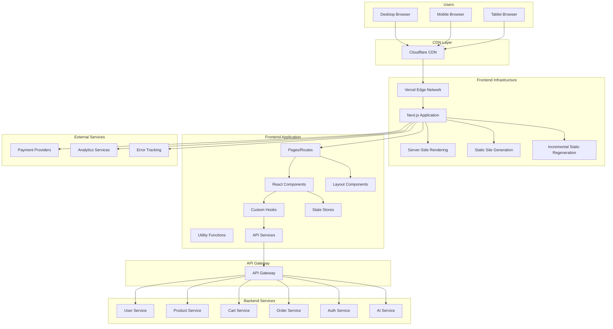

# Frontend Service 詳細設計書

## 目次

1. [概要](#概要)
2. [技術仕様](#技術仕様)
3. [アーキテクチャ設計](#アーキテクチャ設計)
4. [API設計](#api設計)
5. [UI/UX設計](#uiux設計)
6. [パフォーマンス設計](#パフォーマンス設計)
7. [セキュリティ設計](#セキュリティ設計)
8. [エラー処理](#error-handling)
9. [テスト設計](#テスト設計)
10. [ローカル開発環境](#ローカル開発環境)
11. [本番デプロイメント](#本番デプロイメント)
12. [監視・運用](#監視運用)
13. [障害対応](#障害対応)

## 概要

### サービス概要

Frontend Serviceは、スキー用品販売ショップサイトのフロントエンド機能を担当するサービスです。Webアプリケーションの配信、ユーザーインターフェース、レスポンシブデザイン、PWA機能などを提供します。

### 主要責務

- **Webアプリケーション配信**: SPA（Single Page Application）の提供
- **ユーザーインターフェース**: レスポンシブなUI/UX
- **PWA機能**: プログレッシブWebアプリ機能
- **SEO対応**: サーバーサイドレンダリング（SSR）
- **パフォーマンス最適化**: 高速ロード・キャッシュ戦略
- **アクセシビリティ**: WCAG 2.1準拠のアクセシブルUI

### ビジネス価値

- **ユーザー体験向上**: 直感的で使いやすいインターフェース
- **売上向上**: コンバージョン率最適化
- **アクセシビリティ**: 幅広いユーザーへの対応
- **SEO効果**: 検索エンジン最適化による集客向上

## 技術仕様

### 使用技術スタック

| 技術領域 | 技術/ライブラリ | バージョン | 用途 |
|---------|----------------|-----------|------|
| **Frontend Framework** | Next.js | 15.4 | React フレームワーク |
| **UI Library** | React | 19.1.0 | ユーザーインターフェース |
| **Language** | TypeScript | 5.8 | 型安全なJavaScript |
| **Styling** | Tailwind CSS | 4.1.10 | ユーティリティファーストCSS |
| **UI Components** | Headless UI | 2.2.4 | アクセシブルコンポーネント |
| **Icons** | Heroicons | 2.2.0 | SVGアイコンライブラリ |
| **State Management** | Zustand | 4.4 | 軽量状態管理 |
| **Forms** | React Hook Form | 7.60.0 | フォーム管理 |
| **Validation** | Zod | 4.0 | スキーマバリデーション |
| **HTTP Client** | Axios | 1.10.0 | HTTP通信 |
| **Animation** | Framer Motion | 12.23.5 | アニメーション |
| **Testing** | Jest | 30.0.2 | ユニットテスト |
| **E2E Testing** | Playwright | 1.54 | エンドツーエンドテスト |
| **Build Tool** | Webpack | 5.100.2 | バンドラー |
| **Package Manager** | pnpm | 10.9 | パッケージ管理 |
| **Deployment** | Vercel | - | ホスティング・デプロイ |
| **CDN** | Cloudflare | - | コンテンツ配信 |
| **Monitoring** | Vercel Analytics | - | パフォーマンス監視 |
| **Error Tracking** | Sentry | 8 | エラートラッキング |

### 除外技術

- **jQuery**: モダンなReactアプローチを採用するため使用しません
- **Bootstrap**: Tailwind CSSを採用するため使用しません

### TypeScript/React 活用機能

- **TypeScript**: 型安全な開発、インターフェース定義
- **React 18**: Suspense、Concurrent Features
- **Next.js 14**: App Router、Server Components
- **Server Actions**: サーバーサイド処理の簡素化

## アーキテクチャ設計

### システムアーキテクチャ図



### フォルダ構成

```text
src/
├── app/                          # Next.js App Router
│   ├── (auth)/                   # 認証関連ページグループ
│   │   ├── login/
│   │   └── register/
│   ├── (shop)/                   # ショップ関連ページグループ
│   │   ├── products/
│   │   ├── categories/
│   │   ├── cart/
│   │   └── checkout/
│   ├── (account)/                # アカウント関連ページグループ
│   │   ├── profile/
│   │   ├── orders/
│   │   └── points/
│   ├── globals.css
│   ├── layout.tsx
│   ├── loading.tsx
│   ├── error.tsx
│   └── not-found.tsx
├── components/                   # 再利用可能コンポーネント
│   ├── ui/                       # 基本UIコンポーネント
│   │   ├── Button.tsx
│   │   ├── Input.tsx
│   │   ├── Modal.tsx
│   │   └── index.ts
│   ├── forms/                    # フォームコンポーネント
│   │   ├── LoginForm.tsx
│   │   ├── ProductForm.tsx
│   │   └── index.ts
│   ├── layout/                   # レイアウトコンポーネント
│   │   ├── Header.tsx
│   │   ├── Footer.tsx
│   │   ├── Sidebar.tsx
│   │   └── index.ts
│   ├── product/                  # 商品関連コンポーネント
│   │   ├── ProductCard.tsx
│   │   ├── ProductList.tsx
│   │   ├── ProductDetail.tsx
│   │   └── index.ts
│   └── chat/                     # チャット関連コンポーネント
│       ├── ChatWidget.tsx
│       ├── ChatMessage.tsx
│       └── index.ts
├── hooks/                        # カスタムフック
│   ├── useAuth.ts
│   ├── useCart.ts
│   ├── useProducts.ts
│   └── useLocalStorage.ts
├── stores/                       # 状態管理
│   ├── authStore.ts
│   ├── cartStore.ts
│   ├── productStore.ts
│   └── uiStore.ts
├── services/                     # APIサービス
│   ├── api/
│   │   ├── auth.ts
│   │   ├── products.ts
│   │   ├── cart.ts
│   │   └── orders.ts
│   ├── http/
│   │   ├── client.ts
│   │   └── interceptors.ts
│   └── cache/
│       └── queries.ts
├── types/                        # TypeScript型定義
│   ├── auth.ts
│   ├── product.ts
│   ├── cart.ts
│   ├── order.ts
│   └── api.ts
├── utils/                        # ユーティリティ関数
│   ├── formatters.ts
│   ├── validators.ts
│   ├── constants.ts
│   └── helpers.ts
├── styles/                       # スタイル関連
│   ├── globals.css
│   └── components.css
└── middleware.ts                 # Next.js ミドルウェア
```

### コンポーネント設計

```typescript
// 基本UIコンポーネント
import React from 'react';
import { cva, type VariantProps } from 'class-variance-authority';
import { cn } from '@/utils/helpers';

const buttonVariants = cva(
  'inline-flex items-center justify-center whitespace-nowrap rounded-md text-sm font-medium transition-colors focus-visible:outline-none focus-visible:ring-1 focus-visible:ring-ring disabled:pointer-events-none disabled:opacity-50',
  {
    variants: {
      variant: {
        default: 'bg-primary text-primary-foreground shadow hover:bg-primary/90',
        destructive: 'bg-destructive text-destructive-foreground shadow-sm hover:bg-destructive/90',
        outline: 'border border-input bg-background shadow-sm hover:bg-accent hover:text-accent-foreground',
        secondary: 'bg-secondary text-secondary-foreground shadow-sm hover:bg-secondary/80',
        ghost: 'hover:bg-accent hover:text-accent-foreground',
        link: 'text-primary underline-offset-4 hover:underline',
      },
      size: {
        default: 'h-9 px-4 py-2',
        sm: 'h-8 rounded-md px-3 text-xs',
        lg: 'h-10 rounded-md px-8',
        icon: 'h-9 w-9',
      },
    },
    defaultVariants: {
      variant: 'default',
      size: 'default',
    },
  }
);

export interface ButtonProps
  extends React.ButtonHTMLAttributes<HTMLButtonElement>,
    VariantProps<typeof buttonVariants> {
  asChild?: boolean;
  loading?: boolean;
}

const Button = React.forwardRef<HTMLButtonElement, ButtonProps>(
  ({ className, variant, size, asChild = false, loading = false, children, disabled, ...props }, ref) => {
    return (
      <button
        className={cn(buttonVariants({ variant, size, className }))}
        ref={ref}
        disabled={disabled || loading}
        {...props}
      >
        {loading ? (
          <>
            <svg className="mr-2 h-4 w-4 animate-spin" viewBox="0 0 24 24">
              <circle
                className="opacity-25"
                cx="12"
                cy="12"
                r="10"
                stroke="currentColor"
                strokeWidth="4"
                fill="none"
              />
              <path
                className="opacity-75"
                fill="currentColor"
                d="m15.84 5.76-1.42 1.42A8.97 8.97 0 0 1 21 12c0 4.97-4.03 9-9 9s-9-4.03-9-9 4.03-9 9-9c2.12 0 4.06.74 5.58 1.97l1.42-1.42A10.95 10.95 0 0 0 12 1C5.93 1 1 5.93 1 12s4.93 11 11 11 11-4.93 11-11c0-2.89-1.12-5.51-2.94-7.42Z"
              />
            </svg>
            読み込み中...
          </>
        ) : (
          children
        )}
      </button>
    );
  }
);

Button.displayName = 'Button';

export { Button, buttonVariants };

// 商品カードコンポーネント
import React from 'react';
import Image from 'next/image';
import Link from 'next/link';
import { motion } from 'framer-motion';
import { Button } from '@/components/ui/Button';
import { Badge } from '@/components/ui/Badge';
import { useCartStore } from '@/stores/cartStore';
import { formatPrice } from '@/utils/formatters';
import type { Product } from '@/types/product';

interface ProductCardProps {
  product: Product;
  showQuickAdd?: boolean;
  showWishlist?: boolean;
  className?: string;
}

export const ProductCard: React.FC<ProductCardProps> = ({
  product,
  showQuickAdd = true,
  showWishlist = true,
  className,
}) => {
  const addToCart = useCartStore((state) => state.addItem);
  const [isLoading, setIsLoading] = React.useState(false);
  const [isImageLoaded, setIsImageLoaded] = React.useState(false);

  const handleAddToCart = async (e: React.MouseEvent) => {
    e.preventDefault();
    e.stopPropagation();
    
    setIsLoading(true);
    try {
      await addToCart({
        productId: product.id,
        name: product.name,
        price: product.price,
        quantity: 1,
        image: product.images[0],
      });
    } catch (error) {
      console.error('Failed to add to cart:', error);
    } finally {
      setIsLoading(false);
    }
  };

  const discountPercentage = product.originalPrice
    ? Math.round(((product.originalPrice - product.price) / product.originalPrice) * 100)
    : 0;

  return (
    <motion.div
      className={cn(
        'group relative overflow-hidden rounded-lg border bg-white shadow-sm transition-all hover:shadow-md',
        className
      )}
      whileHover={{ y: -2 }}
      transition={{ duration: 0.2 }}
    >
      <Link href={`/products/${product.id}`}>
        <div className="aspect-square overflow-hidden">
          <div className="relative h-full w-full bg-gray-100">
            {!isImageLoaded && (
              <div className="absolute inset-0 animate-pulse bg-gray-200" />
            )}
            <Image
              src={product.images[0] || '/images/product-placeholder.jpg'}
              alt={product.name}
              fill
              className={cn(
                'object-cover transition-all duration-300 group-hover:scale-105',
                isImageLoaded ? 'opacity-100' : 'opacity-0'
              )}
              onLoad={() => setIsImageLoaded(true)}
              sizes="(max-width: 768px) 100vw, (max-width: 1200px) 50vw, 33vw"
            />
          </div>
          
          {/* バッジ */}
          <div className="absolute left-2 top-2 flex flex-col gap-1">
            {product.isNew && (
              <Badge variant="secondary" className="bg-blue-500 text-white">
                NEW
              </Badge>
            )}
            {discountPercentage > 0 && (
              <Badge variant="destructive" className="bg-red-500 text-white">
                -{discountPercentage}%
              </Badge>
            )}
            {product.stock <= 5 && product.stock > 0 && (
              <Badge variant="outline" className="bg-yellow-500 text-white">
                残り{product.stock}点
              </Badge>
            )}
          </div>

          {/* ウィッシュリストボタン */}
          {showWishlist && (
            <Button
              variant="ghost"
              size="icon"
              className="absolute right-2 top-2 h-8 w-8 bg-white/80 hover:bg-white"
              onClick={(e) => {
                e.preventDefault();
                e.stopPropagation();
                // ウィッシュリスト追加処理
              }}
            >
              <HeartIcon className="h-4 w-4" />
            </Button>
          )}
        </div>

        {/* 商品情報 */}
        <div className="p-4">
          <div className="mb-2">
            <Badge variant="outline" className="text-xs">
              {product.category}
            </Badge>
          </div>
          
          <h3 className="mb-2 line-clamp-2 text-sm font-medium text-gray-900 group-hover:text-blue-600">
            {product.name}
          </h3>
          
          <div className="flex items-center justify-between">
            <div className="flex items-center gap-2">
              <span className="text-lg font-bold text-gray-900">
                {formatPrice(product.price)}
              </span>
              {product.originalPrice && (
                <span className="text-sm text-gray-500 line-through">
                  {formatPrice(product.originalPrice)}
                </span>
              )}
            </div>
            
            {/* 評価 */}
            {product.rating && (
              <div className="flex items-center gap-1">
                <StarIcon className="h-4 w-4 fill-yellow-400 text-yellow-400" />
                <span className="text-sm text-gray-600">
                  {product.rating.toFixed(1)}
                </span>
              </div>
            )}
          </div>
        </div>
      </Link>

      {/* クイック追加ボタン */}
      {showQuickAdd && (
        <div className="absolute bottom-4 left-4 right-4 translate-y-full transition-all group-hover:translate-y-0">
          <Button
            onClick={handleAddToCart}
            disabled={product.stock === 0 || isLoading}
            className="w-full"
            loading={isLoading}
          >
            {product.stock === 0 ? '在庫切れ' : 'カートに追加'}
          </Button>
        </div>
      )}
    </motion.div>
  );
};

// カスタムフック
import React from 'react';
import { create } from 'zustand';
import { persist, createJSONStorage } from 'zustand/middleware';
import { authApi } from '@/services/api/auth';
import type { User, LoginCredentials, RegisterData } from '@/types/auth';

interface AuthState {
  user: User | null;
  isAuthenticated: boolean;
  isLoading: boolean;
  error: string | null;
}

interface AuthActions {
  login: (credentials: LoginCredentials) => Promise<void>;
  register: (data: RegisterData) => Promise<void>;
  logout: () => Promise<void>;
  refreshToken: () => Promise<void>;
  clearError: () => void;
  setUser: (user: User | null) => void;
}

export const useAuthStore = create<AuthState & AuthActions>()(
  persist(
    (set, get) => ({
      // State
      user: null,
      isAuthenticated: false,
      isLoading: false,
      error: null,

      // Actions
      login: async (credentials) => {
        set({ isLoading: true, error: null });
        
        try {
          const response = await authApi.login(credentials);
          const { user, accessToken, refreshToken } = response.data;
          
          // トークンをローカルストレージに保存
          localStorage.setItem('accessToken', accessToken);
          localStorage.setItem('refreshToken', refreshToken);
          
          set({
            user,
            isAuthenticated: true,
            isLoading: false,
          });
        } catch (error) {
          set({
            error: error instanceof Error ? error.message : 'ログインに失敗しました',
            isLoading: false,
          });
          throw error;
        }
      },

      register: async (data) => {
        set({ isLoading: true, error: null });
        
        try {
          const response = await authApi.register(data);
          const { user, accessToken, refreshToken } = response.data;
          
          localStorage.setItem('accessToken', accessToken);
          localStorage.setItem('refreshToken', refreshToken);
          
          set({
            user,
            isAuthenticated: true,
            isLoading: false,
          });
        } catch (error) {
          set({
            error: error instanceof Error ? error.message : '登録に失敗しました',
            isLoading: false,
          });
          throw error;
        }
      },

      logout: async () => {
        try {
          await authApi.logout();
        } catch (error) {
          console.error('Logout error:', error);
        } finally {
          localStorage.removeItem('accessToken');
          localStorage.removeItem('refreshToken');
          
          set({
            user: null,
            isAuthenticated: false,
            error: null,
          });
        }
      },

      refreshToken: async () => {
        const refreshToken = localStorage.getItem('refreshToken');
        if (!refreshToken) {
          throw new Error('No refresh token available');
        }

        try {
          const response = await authApi.refreshToken(refreshToken);
          const { accessToken, refreshToken: newRefreshToken } = response.data;
          
          localStorage.setItem('accessToken', accessToken);
          localStorage.setItem('refreshToken', newRefreshToken);
        } catch (error) {
          // リフレッシュトークンが無効な場合はログアウト
          get().logout();
          throw error;
        }
      },

      clearError: () => set({ error: null }),
      
      setUser: (user) => set({ user, isAuthenticated: !!user }),
    }),
    {
      name: 'auth-storage',
      storage: createJSONStorage(() => localStorage),
      partialize: (state) => ({ 
        user: state.user,
        isAuthenticated: state.isAuthenticated 
      }),
    }
  )
);

// カスタムフック
export const useAuth = () => {
  const authStore = useAuthStore();
  
  React.useEffect(() => {
    // 初期化時にトークンの有効性を確認
    const accessToken = localStorage.getItem('accessToken');
    if (accessToken && !authStore.isAuthenticated) {
      authStore.refreshToken().catch(() => {
        // リフレッシュに失敗した場合はログアウト
        authStore.logout();
      });
    }
  }, []);

  return authStore;
};

// APIサービス
import axios, { type AxiosInstance, type AxiosResponse } from 'axios';
import { useAuthStore } from '@/stores/authStore';

class HttpClient {
  private client: AxiosInstance;

  constructor() {
    this.client = axios.create({
      baseURL: process.env.NEXT_PUBLIC_API_BASE_URL || 'http://localhost:8080',
      timeout: 10000,
      headers: {
        'Content-Type': 'application/json',
      },
    });

    this.setupInterceptors();
  }

  private setupInterceptors() {
    // リクエストインターセプター
    this.client.interceptors.request.use(
      (config) => {
        const token = localStorage.getItem('accessToken');
        if (token) {
          config.headers.Authorization = `Bearer ${token}`;
        }
        return config;
      },
      (error) => Promise.reject(error)
    );

    // レスポンスインターセプター
    this.client.interceptors.response.use(
      (response) => response,
      async (error) => {
        const originalRequest = error.config;

        if (error.response?.status === 401 && !originalRequest._retry) {
          originalRequest._retry = true;

          try {
            await useAuthStore.getState().refreshToken();
            const newToken = localStorage.getItem('accessToken');
            if (newToken) {
              originalRequest.headers.Authorization = `Bearer ${newToken}`;
              return this.client(originalRequest);
            }
          } catch (refreshError) {
            useAuthStore.getState().logout();
            window.location.href = '/login';
            return Promise.reject(refreshError);
          }
        }

        return Promise.reject(error);
      }
    );
  }

  async get<T>(url: string, config?: any): Promise<AxiosResponse<T>> {
    return this.client.get(url, config);
  }

  async post<T>(url: string, data?: any, config?: any): Promise<AxiosResponse<T>> {
    return this.client.post(url, data, config);
  }

  async put<T>(url: string, data?: any, config?: any): Promise<AxiosResponse<T>> {
    return this.client.put(url, data, config);
  }

  async delete<T>(url: string, config?: any): Promise<AxiosResponse<T>> {
    return this.client.delete(url, config);
  }
}

export const httpClient = new HttpClient();

// 商品APIサービス
import { httpClient } from '../http/client';
import type { 
  Product, 
  ProductSearchParams, 
  ProductCategory,
  ProductResponse,
  ProductSearchResponse 
} from '@/types/product';

export const productApi = {
  // 商品一覧取得
  getProducts: async (params?: ProductSearchParams): Promise<ProductSearchResponse> => {
    const response = await httpClient.get<ProductSearchResponse>('/api/v1/products', {
      params,
    });
    return response.data;
  },

  // 商品詳細取得
  getProduct: async (id: string): Promise<Product> => {
    const response = await httpClient.get<ProductResponse>(`/api/v1/products/${id}`);
    return response.data.product;
  },

  // カテゴリー一覧取得
  getCategories: async (): Promise<ProductCategory[]> => {
    const response = await httpClient.get<{ categories: ProductCategory[] }>('/api/v1/products/categories');
    return response.data.categories;
  },

  // 人気商品取得
  getPopularProducts: async (limit = 10): Promise<Product[]> => {
    const response = await httpClient.get<{ products: Product[] }>('/api/v1/products/popular', {
      params: { limit },
    });
    return response.data.products;
  },

  // 新着商品取得
  getNewProducts: async (limit = 10): Promise<Product[]> => {
    const response = await httpClient.get<{ products: Product[] }>('/api/v1/products/new', {
      params: { limit },
    });
    return response.data.products;
  },

  // おすすめ商品取得
  getRecommendedProducts: async (productId?: string): Promise<Product[]> => {
    const response = await httpClient.get<{ products: Product[] }>('/api/v1/products/recommended', {
      params: productId ? { productId } : {},
    });
    return response.data.products;
  },

  // 商品検索
  searchProducts: async (query: string, params?: ProductSearchParams): Promise<ProductSearchResponse> => {
    const response = await httpClient.get<ProductSearchResponse>('/api/v1/products/search', {
      params: { q: query, ...params },
    });
    return response.data;
  },
};
```

### TypeScript型定義

```typescript
// 認証関連型定義
export interface User {
  id: string;
  email: string;
  firstName: string;
  lastName: string;
  phoneNumber?: string;
  dateOfBirth?: string;
  role: UserRole;
  isEmailVerified: boolean;
  createdAt: string;
  updatedAt: string;
}

export enum UserRole {
  CUSTOMER = 'CUSTOMER',
  ADMIN = 'ADMIN',
  STAFF = 'STAFF',
}

export interface LoginCredentials {
  email: string;
  password: string;
  rememberMe?: boolean;
}

export interface RegisterData {
  email: string;
  password: string;
  confirmPassword: string;
  firstName: string;
  lastName: string;
  phoneNumber?: string;
  dateOfBirth?: string;
  termsAccepted: boolean;
  marketingConsent?: boolean;
}

// 商品関連型定義
export interface Product {
  id: string;
  name: string;
  description: string;
  price: number;
  originalPrice?: number;
  sku: string;
  category: string;
  subcategory?: string;
  brand: string;
  images: string[];
  stock: number;
  isNew?: boolean;
  isFeatured?: boolean;
  rating?: number;
  reviewCount?: number;
  specifications: ProductSpecification[];
  variants: ProductVariant[];
  tags: string[];
  createdAt: string;
  updatedAt: string;
}

export interface ProductSpecification {
  name: string;
  value: string;
  category: string;
}

export interface ProductVariant {
  id: string;
  name: string;
  value: string;
  type: VariantType;
  priceAdjustment?: number;
  stockQuantity: number;
}

export enum VariantType {
  SIZE = 'SIZE',
  COLOR = 'COLOR',
  STYLE = 'STYLE',
}

export interface ProductCategory {
  id: string;
  name: string;
  slug: string;
  description?: string;
  image?: string;
  parentId?: string;
  children?: ProductCategory[];
  productCount: number;
}

export interface ProductSearchParams {
  category?: string;
  subcategory?: string;
  brand?: string;
  minPrice?: number;
  maxPrice?: number;
  sortBy?: ProductSortBy;
  sortOrder?: SortOrder;
  page?: number;
  limit?: number;
  inStock?: boolean;
  isNew?: boolean;
  isFeatured?: boolean;
}

export enum ProductSortBy {
  NAME = 'NAME',
  PRICE = 'PRICE',
  RATING = 'RATING',
  CREATED_AT = 'CREATED_AT',
  POPULARITY = 'POPULARITY',
}

export enum SortOrder {
  ASC = 'ASC',
  DESC = 'DESC',
}

// カート関連型定義
export interface CartItem {
  productId: string;
  name: string;
  price: number;
  quantity: number;
  image: string;
  selectedVariants?: Record<string, string>;
  maxQuantity: number;
}

export interface Cart {
  items: CartItem[];
  totalQuantity: number;
  subtotal: number;
  tax: number;
  shipping: number;
  total: number;
  appliedCoupons: AppliedCoupon[];
}

export interface AppliedCoupon {
  code: string;
  name: string;
  discount: number;
  type: CouponType;
}

export enum CouponType {
  PERCENTAGE = 'PERCENTAGE',
  FIXED_AMOUNT = 'FIXED_AMOUNT',
  FREE_SHIPPING = 'FREE_SHIPPING',
}

// 注文関連型定義
export interface Order {
  id: string;
  orderNumber: string;
  status: OrderStatus;
  items: OrderItem[];
  shippingAddress: Address;
  billingAddress: Address;
  paymentMethod: PaymentMethod;
  subtotal: number;
  tax: number;
  shipping: number;
  total: number;
  createdAt: string;
  updatedAt: string;
  estimatedDelivery?: string;
  trackingNumber?: string;
}

export interface OrderItem {
  productId: string;
  name: string;
  price: number;
  quantity: number;
  image: string;
  selectedVariants?: Record<string, string>;
}

export enum OrderStatus {
  PENDING = 'PENDING',
  CONFIRMED = 'CONFIRMED',
  PROCESSING = 'PROCESSING',
  SHIPPED = 'SHIPPED',
  DELIVERED = 'DELIVERED',
  CANCELLED = 'CANCELLED',
  REFUNDED = 'REFUNDED',
}

export interface Address {
  id?: string;
  type: AddressType;
  firstName: string;
  lastName: string;
  company?: string;
  address1: string;
  address2?: string;
  city: string;
  state: string;
  postalCode: string;
  country: string;
  phoneNumber?: string;
  isDefault?: boolean;
}

export enum AddressType {
  BILLING = 'BILLING',
  SHIPPING = 'SHIPPING',
}

export interface PaymentMethod {
  id: string;
  type: PaymentType;
  provider: string;
  last4?: string;
  expiryMonth?: number;
  expiryYear?: number;
  isDefault?: boolean;
}

export enum PaymentType {
  CREDIT_CARD = 'CREDIT_CARD',
  DEBIT_CARD = 'DEBIT_CARD',
  PAYPAL = 'PAYPAL',
  BANK_TRANSFER = 'BANK_TRANSFER',
  CRYPTO = 'CRYPTO',
}

// API応答型定義
export interface ApiResponse<T> {
  success: boolean;
  data: T;
  message?: string;
  errors?: ApiError[];
}

export interface ApiError {
  field?: string;
  code: string;
  message: string;
}

export interface PaginatedResponse<T> {
  items: T[];
  pagination: {
    page: number;
    limit: number;
    total: number;
    totalPages: number;
    hasNext: boolean;
    hasPrev: boolean;
  };
}

export type ProductResponse = ApiResponse<{ product: Product }>;
export type ProductSearchResponse = ApiResponse<PaginatedResponse<Product>>;
export type CartResponse = ApiResponse<{ cart: Cart }>;
export type OrderResponse = ApiResponse<{ order: Order }>;
```

## API設計

### バックエンドAPI統合

Frontend ServiceはAPI Gatewayを通じて各マイクロサービスと通信します。

```typescript
// API エンドポイント設定
export const API_ENDPOINTS = {
  // 認証サービス
  AUTH: {
    LOGIN: '/api/v1/auth/login',
    REGISTER: '/api/v1/auth/register',
    LOGOUT: '/api/v1/auth/logout',
    REFRESH: '/api/v1/auth/refresh',
    PROFILE: '/api/v1/auth/profile',
    VERIFY_EMAIL: '/api/v1/auth/verify-email',
    RESET_PASSWORD: '/api/v1/auth/reset-password',
  },

  // ユーザーサービス
  USERS: {
    PROFILE: '/api/v1/users/profile',
    ADDRESSES: '/api/v1/users/addresses',
    PAYMENT_METHODS: '/api/v1/users/payment-methods',
    PREFERENCES: '/api/v1/users/preferences',
  },

  // 商品サービス
  PRODUCTS: {
    LIST: '/api/v1/products',
    DETAIL: '/api/v1/products/:id',
    CATEGORIES: '/api/v1/products/categories',
    SEARCH: '/api/v1/products/search',
    POPULAR: '/api/v1/products/popular',
    NEW: '/api/v1/products/new',
    RECOMMENDED: '/api/v1/products/recommended',
    REVIEWS: '/api/v1/products/:id/reviews',
  },

  // カートサービス
  CART: {
    GET: '/api/v1/cart',
    ADD_ITEM: '/api/v1/cart/items',
    UPDATE_ITEM: '/api/v1/cart/items/:id',
    REMOVE_ITEM: '/api/v1/cart/items/:id',
    CLEAR: '/api/v1/cart/clear',
    APPLY_COUPON: '/api/v1/cart/coupons',
    REMOVE_COUPON: '/api/v1/cart/coupons/:code',
  },

  // 注文サービス
  ORDERS: {
    CREATE: '/api/v1/orders',
    LIST: '/api/v1/orders',
    DETAIL: '/api/v1/orders/:id',
    CANCEL: '/api/v1/orders/:id/cancel',
    TRACK: '/api/v1/orders/:id/tracking',
  },

  // 決済サービス
  PAYMENT: {
    PROCESS: '/api/v1/payments/process',
    STATUS: '/api/v1/payments/:id/status',
    REFUND: '/api/v1/payments/:id/refund',
  },

  // ポイント・ロイヤルティサービス
  POINTS: {
    BALANCE: '/api/v1/points/balance',
    HISTORY: '/api/v1/points/history',
    REWARDS: '/api/v1/points/rewards',
    REDEEM: '/api/v1/points/redeem',
  },

  // AIサポートサービス
  AI_SUPPORT: {
    CHAT: '/api/v1/ai-support/chat',
    SESSIONS: '/api/v1/ai-support/sessions',
    RECOMMENDATIONS: '/api/v1/ai-support/recommendations',
  },

  // 通知サービス
  NOTIFICATIONS: {
    LIST: '/api/v1/notifications',
    MARK_READ: '/api/v1/notifications/:id/read',
    PREFERENCES: '/api/v1/notifications/preferences',
    WEBSOCKET: '/ws/notifications',
    SSE: '/api/v1/notifications/events',
  },
  
  // リアルタイムイベント
  REALTIME: {
    WEBSOCKET: '/ws/events',
    SSE: '/api/v1/events/stream',
    ORDER_UPDATES: '/ws/orders/:orderId',
    CART_SYNC: '/ws/cart/:customerId',
    INVENTORY_UPDATES: '/ws/inventory',
    PRICE_UPDATES: '/ws/prices',
  },
  
  // イベントストリーム
  EVENT_STREAMS: {
    ORDER_STATUS: '/api/v1/events/orders',
    POINTS_UPDATES: '/api/v1/events/points',
    COUPON_UPDATES: '/api/v1/events/coupons',
    RANK_UPDATES: '/api/v1/events/loyalty',
    INVENTORY_ALERTS: '/api/v1/events/inventory',
  },
} as const;

// Frontend Event Types
interface FrontendEvent {
  id: string;
  type: string;
  timestamp: Date;
  payload: any;
}

interface OrderStatusEvent extends FrontendEvent {
  type: 'ORDER_STATUS_CHANGED';
  payload: {
    orderId: string;
    customerId: string;
    oldStatus: string;
    newStatus: string;
    message: string;
  };
}

interface PointsUpdatedEvent extends FrontendEvent {
  type: 'POINTS_UPDATED';
  payload: {
    customerId: string;
    pointsEarned: number;
    newBalance: number;
    source: string;
    message: string;
  };
}

interface InventoryAlertEvent extends FrontendEvent {
  type: 'INVENTORY_LOW' | 'INVENTORY_OUT';
  payload: {
    productId: string;
    productName: string;
    currentStock: number;
    threshold: number;
  };
}

interface RankUpEvent extends FrontendEvent {
  type: 'RANK_UPDATED';
  payload: {
    customerId: string;
    oldRank: string;
    newRank: string;
    benefits: string[];
    message: string;
  };
}

interface CouponEvent extends FrontendEvent {
  type: 'COUPON_AVAILABLE' | 'COUPON_EXPIRING';
  payload: {
    customerId: string;
    couponId: string;
    couponName: string;
    discountValue: number;
    expiresAt: Date;
    message: string;
  };
}

// Real-time Event Manager
class RealTimeEventManager {
  private websocket: WebSocket | null = null;
  private eventSource: EventSource | null = null;
  private eventHandlers = new Map<string, Set<(event: FrontendEvent) => void>>();
  private reconnectAttempts = 0;
  private maxReconnectAttempts = 5;
  private reconnectDelay = 1000;
  
  constructor(private baseUrl: string, private customerId?: string) {}
  
  // WebSocket connection
  connectWebSocket(token: string): void {
    if (this.websocket?.readyState === WebSocket.OPEN) {
      return;
    }
    
    try {
      const wsUrl = `${this.baseUrl.replace('http', 'ws')}${API_ENDPOINTS.REALTIME.WEBSOCKET}`;
      this.websocket = new WebSocket(`${wsUrl}?token=${token}&customerId=${this.customerId}`);
      
      this.websocket.onopen = () => {
        console.log('WebSocket connected');
        this.reconnectAttempts = 0;
        this.subscribeToCustomerEvents();
      };
      
      this.websocket.onmessage = (event) => {
        try {
          const eventData: FrontendEvent = JSON.parse(event.data);
          this.handleEvent(eventData);
        } catch (error) {
          console.error('Failed to parse WebSocket message:', error);
        }
      };
      
      this.websocket.onclose = (event) => {
        console.log('WebSocket disconnected:', event.code, event.reason);
        this.attemptReconnection(token);
      };
      
      this.websocket.onerror = (error) => {
        console.error('WebSocket error:', error);
      };
      
    } catch (error) {
      console.error('Failed to connect WebSocket:', error);
    }
  }
  
  // Server-Sent Events connection
  connectSSE(token: string): void {
    if (this.eventSource?.readyState === EventSource.OPEN) {
      return;
    }
    
    try {
      const sseUrl = `${this.baseUrl}${API_ENDPOINTS.NOTIFICATIONS.SSE}?token=${token}&customerId=${this.customerId}`;
      this.eventSource = new EventSource(sseUrl);
      
      this.eventSource.onopen = () => {
        console.log('SSE connected');
        this.reconnectAttempts = 0;
      };
      
      this.eventSource.onmessage = (event) => {
        try {
          const eventData: FrontendEvent = JSON.parse(event.data);
          this.handleEvent(eventData);
        } catch (error) {
          console.error('Failed to parse SSE message:', error);
        }
      };
      
      this.eventSource.onerror = (error) => {
        console.error('SSE error:', error);
        this.eventSource?.close();
        this.attemptSSEReconnection(token);
      };
      
    } catch (error) {
      console.error('Failed to connect SSE:', error);
    }
  }
  
  private subscribeToCustomerEvents(): void {
    if (this.websocket?.readyState === WebSocket.OPEN && this.customerId) {
      this.websocket.send(JSON.stringify({
        type: 'SUBSCRIBE',
        channels: [
          `orders.${this.customerId}`,
          `points.${this.customerId}`,
          `loyalty.${this.customerId}`,
          `coupons.${this.customerId}`,
          'inventory.global',
          'prices.global'
        ]
      }));
    }
  }
  
  private handleEvent(event: FrontendEvent): void {
    const handlers = this.eventHandlers.get(event.type);
    if (handlers) {
      handlers.forEach(handler => {
        try {
          handler(event);
        } catch (error) {
          console.error(`Error handling event ${event.type}:`, error);
        }
      });
    }
  }
  
  private attemptReconnection(token: string): void {
    if (this.reconnectAttempts < this.maxReconnectAttempts) {
      this.reconnectAttempts++;
      const delay = this.reconnectDelay * Math.pow(2, this.reconnectAttempts - 1);
      
      setTimeout(() => {
        console.log(`Attempting WebSocket reconnection (${this.reconnectAttempts}/${this.maxReconnectAttempts})`);
        this.connectWebSocket(token);
      }, delay);
    }
  }
  
  private attemptSSEReconnection(token: string): void {
    if (this.reconnectAttempts < this.maxReconnectAttempts) {
      this.reconnectAttempts++;
      const delay = this.reconnectDelay * Math.pow(2, this.reconnectAttempts - 1);
      
      setTimeout(() => {
        console.log(`Attempting SSE reconnection (${this.reconnectAttempts}/${this.maxReconnectAttempts})`);
        this.connectSSE(token);
      }, delay);
    }
  }
  
  // Event handler registration
  addEventListener(eventType: string, handler: (event: FrontendEvent) => void): void {
    if (!this.eventHandlers.has(eventType)) {
      this.eventHandlers.set(eventType, new Set());
    }
    this.eventHandlers.get(eventType)!.add(handler);
  }
  
  removeEventListener(eventType: string, handler: (event: FrontendEvent) => void): void {
    const handlers = this.eventHandlers.get(eventType);
    if (handlers) {
      handlers.delete(handler);
      if (handlers.size === 0) {
        this.eventHandlers.delete(eventType);
      }
    }
  }
  
  // Cleanup
  disconnect(): void {
    if (this.websocket) {
      this.websocket.close();
      this.websocket = null;
    }
    
    if (this.eventSource) {
      this.eventSource.close();
      this.eventSource = null;
    }
    
    this.eventHandlers.clear();
  }
}

// React Hook for Real-time Events
const useRealTimeEvents = (customerId?: string) => {
  const [eventManager, setEventManager] = useState<RealTimeEventManager | null>(null);
  const [isConnected, setIsConnected] = useState(false);
  const [events, setEvents] = useState<FrontendEvent[]>([]);
  const { token } = useAuth();
  
  useEffect(() => {
    if (!token || !customerId) return;
    
    const manager = new RealTimeEventManager(process.env.NEXT_PUBLIC_API_BASE_URL!, customerId);
    
    // Connect both WebSocket and SSE for redundancy
    manager.connectWebSocket(token);
    manager.connectSSE(token);
    
    setEventManager(manager);
    setIsConnected(true);
    
    return () => {
      manager.disconnect();
      setIsConnected(false);
    };
  }, [token, customerId]);
  
  const addEventListener = useCallback((eventType: string, handler: (event: FrontendEvent) => void) => {
    eventManager?.addEventListener(eventType, handler);
  }, [eventManager]);
  
  const removeEventListener = useCallback((eventType: string, handler: (event: FrontendEvent) => void) => {
    eventManager?.removeEventListener(eventType, handler);
  }, [eventManager]);
  
  return {
    isConnected,
    addEventListener,
    removeEventListener,
    events
  };
};

// Order Status Updates Hook
const useOrderUpdates = (orderId?: string) => {
  const [orderStatus, setOrderStatus] = useState<string>('');
  const [statusHistory, setStatusHistory] = useState<any[]>([]);
  const { addEventListener, removeEventListener } = useRealTimeEvents();
  
  useEffect(() => {
    if (!orderId) return;
    
    const handleOrderUpdate = (event: OrderStatusEvent) => {
      if (event.payload.orderId === orderId) {
        setOrderStatus(event.payload.newStatus);
        setStatusHistory(prev => [...prev, {
          status: event.payload.newStatus,
          timestamp: event.timestamp,
          message: event.payload.message
        }]);
        
        // Show notification
        showNotification('注文状況が更新されました', event.payload.message);
      }
    };
    
    addEventListener('ORDER_STATUS_CHANGED', handleOrderUpdate);
    
    return () => {
      removeEventListener('ORDER_STATUS_CHANGED', handleOrderUpdate);
    };
  }, [orderId, addEventListener, removeEventListener]);
  
  return { orderStatus, statusHistory };
};

// Points Updates Hook
const usePointsUpdates = () => {
  const [pointsBalance, setPointsBalance] = useState<number>(0);
  const [pointsHistory, setPointsHistory] = useState<any[]>([]);
  const { addEventListener, removeEventListener } = useRealTimeEvents();
  
  useEffect(() => {
    const handlePointsUpdate = (event: PointsUpdatedEvent) => {
      setPointsBalance(event.payload.newBalance);
      setPointsHistory(prev => [...prev, {
        points: event.payload.pointsEarned,
        source: event.payload.source,
        timestamp: event.timestamp,
        message: event.payload.message
      }]);
      
      // Show notification for points earned
      if (event.payload.pointsEarned > 0) {
        showNotification('ポイントが追加されました', 
          `${event.payload.pointsEarned}ポイントが追加されました（残高: ${event.payload.newBalance}ポイント）`);
      }
    };
    
    addEventListener('POINTS_UPDATED', handlePointsUpdate);
    
    return () => {
      removeEventListener('POINTS_UPDATED', handlePointsUpdate);
    };
  }, [addEventListener, removeEventListener]);
  
  return { pointsBalance, pointsHistory };
};

// Loyalty Rank Updates Hook
const useLoyaltyUpdates = () => {
  const [currentRank, setCurrentRank] = useState<string>('');
  const [benefits, setBenefits] = useState<string[]>([]);
  const { addEventListener, removeEventListener } = useRealTimeEvents();
  
  useEffect(() => {
    const handleRankUpdate = (event: RankUpEvent) => {
      setCurrentRank(event.payload.newRank);
      setBenefits(event.payload.benefits);
      
      // Show rank up celebration
      showRankUpCelebration(event.payload.oldRank, event.payload.newRank, event.payload.benefits);
    };
    
    addEventListener('RANK_UPDATED', handleRankUpdate);
    
    return () => {
      removeEventListener('RANK_UPDATED', handleRankUpdate);
    };
  }, [addEventListener, removeEventListener]);
  
  return { currentRank, benefits };
};

// Inventory Alerts Hook
const useInventoryAlerts = () => {
  const [lowStockItems, setLowStockItems] = useState<any[]>([]);
  const { addEventListener, removeEventListener } = useRealTimeEvents();
  
  useEffect(() => {
    const handleInventoryAlert = (event: InventoryAlertEvent) => {
      if (event.type === 'INVENTORY_LOW' || event.type === 'INVENTORY_OUT') {
        setLowStockItems(prev => {
          const existing = prev.find(item => item.productId === event.payload.productId);
          if (existing) {
            return prev.map(item => 
              item.productId === event.payload.productId 
                ? { ...event.payload, alertType: event.type }
                : item
            );
          }
          return [...prev, { ...event.payload, alertType: event.type }];
        });
        
        // Show inventory warning
        if (event.type === 'INVENTORY_OUT') {
          showNotification('在庫切れ', `${event.payload.productName}が在庫切れになりました`);
        }
      }
    };
    
    addEventListener('INVENTORY_LOW', handleInventoryAlert);
    addEventListener('INVENTORY_OUT', handleInventoryAlert);
    
    return () => {
      removeEventListener('INVENTORY_LOW', handleInventoryAlert);
      removeEventListener('INVENTORY_OUT', handleInventoryAlert);
    };
  }, [addEventListener, removeEventListener]);
  
  return { lowStockItems };
};

// Notification Utils
const showNotification = (title: string, message: string) => {
  if ('Notification' in window && Notification.permission === 'granted') {
    new Notification(title, {
      body: message,
      icon: '/icon-192x192.png',
      badge: '/icon-192x192.png'
    });
  }
};

const showRankUpCelebration = (oldRank: string, newRank: string, benefits: string[]) => {
  // Custom rank up celebration UI
  const celebration = document.createElement('div');
  celebration.className = 'rank-up-celebration';
  celebration.innerHTML = `
    <div class="celebration-content">
      <h2>🎉 ランクアップおめでとうございます！</h2>
      <p>${oldRank} → ${newRank}</p>
      <ul>
        ${benefits.map(benefit => `<li>${benefit}</li>`).join('')}
      </ul>
    </div>
  `;
  
  document.body.appendChild(celebration);
  
  setTimeout(() => {
    celebration.remove();
  }, 5000);
};
} as const;

// APIクライアントファクトリー
class ApiClientFactory {
  static createAuthClient() {
    return {
      login: (credentials: LoginCredentials) =>
        httpClient.post(API_ENDPOINTS.AUTH.LOGIN, credentials),
      
      register: (data: RegisterData) =>
        httpClient.post(API_ENDPOINTS.AUTH.REGISTER, data),
      
      logout: () =>
        httpClient.post(API_ENDPOINTS.AUTH.LOGOUT),
      
      refreshToken: (refreshToken: string) =>
        httpClient.post(API_ENDPOINTS.AUTH.REFRESH, { refreshToken }),
      
      getProfile: () =>
        httpClient.get(API_ENDPOINTS.AUTH.PROFILE),
      
      verifyEmail: (token: string) =>
        httpClient.post(API_ENDPOINTS.AUTH.VERIFY_EMAIL, { token }),
      
      resetPassword: (data: { email: string }) =>
        httpClient.post(API_ENDPOINTS.AUTH.RESET_PASSWORD, data),
    };
  }

  static createProductClient() {
    return {
      getProducts: (params?: ProductSearchParams) =>
        httpClient.get(API_ENDPOINTS.PRODUCTS.LIST, { params }),
      
      getProduct: (id: string) =>
        httpClient.get(API_ENDPOINTS.PRODUCTS.DETAIL.replace(':id', id)),
      
      getCategories: () =>
        httpClient.get(API_ENDPOINTS.PRODUCTS.CATEGORIES),
      
      searchProducts: (query: string, params?: ProductSearchParams) =>
        httpClient.get(API_ENDPOINTS.PRODUCTS.SEARCH, {
          params: { q: query, ...params },
        }),
      
      getPopularProducts: (limit = 10) =>
        httpClient.get(API_ENDPOINTS.PRODUCTS.POPULAR, {
          params: { limit },
        }),
      
      getNewProducts: (limit = 10) =>
        httpClient.get(API_ENDPOINTS.PRODUCTS.NEW, {
          params: { limit },
        }),
      
      getRecommendedProducts: (productId?: string) =>
        httpClient.get(API_ENDPOINTS.PRODUCTS.RECOMMENDED, {
          params: productId ? { productId } : {},
        }),
    };
  }

  static createCartClient() {
    return {
      getCart: () =>
        httpClient.get(API_ENDPOINTS.CART.GET),
      
      addItem: (item: Omit<CartItem, 'maxQuantity'>) =>
        httpClient.post(API_ENDPOINTS.CART.ADD_ITEM, item),
      
      updateItem: (id: string, quantity: number) =>
        httpClient.put(API_ENDPOINTS.CART.UPDATE_ITEM.replace(':id', id), {
          quantity,
        }),
      
      removeItem: (id: string) =>
        httpClient.delete(API_ENDPOINTS.CART.REMOVE_ITEM.replace(':id', id)),
      
      clearCart: () =>
        httpClient.delete(API_ENDPOINTS.CART.CLEAR),
      
      applyCoupon: (code: string) =>
        httpClient.post(API_ENDPOINTS.CART.APPLY_COUPON, { code }),
      
      removeCoupon: (code: string) =>
        httpClient.delete(API_ENDPOINTS.CART.REMOVE_COUPON.replace(':code', code)),
    };
  }

  static createOrderClient() {
    return {
      createOrder: (orderData: any) =>
        httpClient.post(API_ENDPOINTS.ORDERS.CREATE, orderData),
      
      getOrders: (params?: any) =>
        httpClient.get(API_ENDPOINTS.ORDERS.LIST, { params }),
      
      getOrder: (id: string) =>
        httpClient.get(API_ENDPOINTS.ORDERS.DETAIL.replace(':id', id)),
      
      cancelOrder: (id: string, reason?: string) =>
        httpClient.post(API_ENDPOINTS.ORDERS.CANCEL.replace(':id', id), {
          reason,
        }),
      
      trackOrder: (id: string) =>
        httpClient.get(API_ENDPOINTS.ORDERS.TRACK.replace(':id', id)),
    };
  }
}

// エクスポート
export const authApi = ApiClientFactory.createAuthClient();
export const productApi = ApiClientFactory.createProductClient();
export const cartApi = ApiClientFactory.createCartClient();
export const orderApi = ApiClientFactory.createOrderClient();
```

### GraphQL統合（オプション）

```typescript
// GraphQL クライアント設定
import { ApolloClient, InMemoryCache, createHttpLink, from } from '@apollo/client';
import { setContext } from '@apollo/client/link/context';
import { onError } from '@apollo/client/link/error';

const httpLink = createHttpLink({
  uri: process.env.NEXT_PUBLIC_GRAPHQL_URL || 'http://localhost:8080/graphql',
});

const authLink = setContext((_, { headers }) => {
  const token = localStorage.getItem('accessToken');
  return {
    headers: {
      ...headers,
      authorization: token ? `Bearer ${token}` : '',
    },
  };
});

const errorLink = onError(({ graphQLErrors, networkError, operation, forward }) => {
  if (graphQLErrors) {
    graphQLErrors.forEach(({ message, locations, path }) => {
      console.error(`GraphQL error: Message: ${message}, Location: ${locations}, Path: ${path}`);
    });
  }

  if (networkError) {
    console.error(`Network error: ${networkError}`);
    
    if (networkError.statusCode === 401) {
      // 認証エラーの場合はログアウト処理
      localStorage.removeItem('accessToken');
      localStorage.removeItem('refreshToken');
      window.location.href = '/login';
    }
  }
});

export const apolloClient = new ApolloClient({
  link: from([errorLink, authLink, httpLink]),
  cache: new InMemoryCache({
    typePolicies: {
      Product: {
        fields: {
          variants: {
            merge(existing = [], incoming) {
              return incoming;
            },
          },
        },
      },
      Cart: {
        fields: {
          items: {
            merge(existing = [], incoming) {
              return incoming;
            },
          },
        },
      },
    },
  }),
  defaultOptions: {
    watchQuery: {
      errorPolicy: 'all',
    },
    query: {
      errorPolicy: 'all',
    },
  },
});

// GraphQL クエリ定義
import { gql } from '@apollo/client';

export const GET_PRODUCTS = gql`
  query GetProducts($input: ProductSearchInput) {
    products(input: $input) {
      items {
        id
        name
        description
        price
        originalPrice
        images
        stock
        category
        brand
        rating
        reviewCount
        variants {
          id
          name
          value
          type
          priceAdjustment
          stockQuantity
        }
      }
      pagination {
        page
        limit
        total
        totalPages
        hasNext
        hasPrev
      }
    }
  }
`;

export const GET_PRODUCT = gql`
  query GetProduct($id: ID!) {
    product(id: $id) {
      id
      name
      description
      price
      originalPrice
      sku
      category
      subcategory
      brand
      images
      stock
      isNew
      isFeatured
      rating
      reviewCount
      specifications {
        name
        value
        category
      }
      variants {
        id
        name
        value
        type
        priceAdjustment
        stockQuantity
      }
      tags
      createdAt
      updatedAt
    }
  }
`;

export const GET_CART = gql`
  query GetCart {
    cart {
      items {
        productId
        name
        price
        quantity
        image
        selectedVariants
        maxQuantity
      }
      totalQuantity
      subtotal
      tax
      shipping
      total
      appliedCoupons {
        code
        name
        discount
        type
      }
    }
  }
`;

export const ADD_TO_CART = gql`
  mutation AddToCart($input: AddToCartInput!) {
    addToCart(input: $input) {
      success
      cart {
        items {
          productId
          name
          price
          quantity
          image
          selectedVariants
          maxQuantity
        }
        totalQuantity
        subtotal
        tax
        shipping
        total
      }
    }
  }
`;
```

## UI/UX設計

### レスポンシブデザイン

```typescript
// レスポンシブブレークポイント設定
export const breakpoints = {
  sm: '640px',
  md: '768px',
  lg: '1024px',
  xl: '1280px',
  '2xl': '1536px',
} as const;

// Tailwind CSS カスタム設定
/** @type {import('tailwindcss').Config} */
module.exports = {
  content: [
    './src/pages/**/*.{js,ts,jsx,tsx,mdx}',
    './src/components/**/*.{js,ts,jsx,tsx,mdx}',
    './src/app/**/*.{js,ts,jsx,tsx,mdx}',
  ],
  theme: {
    extend: {
      colors: {
        primary: {
          50: '#eff6ff',
          100: '#dbeafe',
          500: '#3b82f6',
          600: '#2563eb',
          700: '#1d4ed8',
          900: '#1e3a8a',
        },
        secondary: {
          50: '#f8fafc',
          100: '#f1f5f9',
          500: '#64748b',
          600: '#475569',
          700: '#334155',
          900: '#0f172a',
        },
        success: {
          50: '#f0fdf4',
          100: '#dcfce7',
          500: '#22c55e',
          600: '#16a34a',
          700: '#15803d',
        },
        warning: {
          50: '#fffbeb',
          100: '#fef3c7',
          500: '#f59e0b',
          600: '#d97706',
          700: '#b45309',
        },
        error: {
          50: '#fef2f2',
          100: '#fee2e2',
          500: '#ef4444',
          600: '#dc2626',
          700: '#b91c1c',
        },
      },
      fontFamily: {
        sans: ['Inter', 'Noto Sans JP', 'sans-serif'],
        mono: ['JetBrains Mono', 'monospace'],
      },
      spacing: {
        '18': '4.5rem',
        '88': '22rem',
        '128': '32rem',
      },
      animation: {
        'fade-in': 'fadeIn 0.5s ease-in-out',
        'slide-up': 'slideUp 0.3s ease-out',
        'scale-in': 'scaleIn 0.2s ease-out',
      },
      keyframes: {
        fadeIn: {
          '0%': { opacity: '0' },
          '100%': { opacity: '1' },
        },
        slideUp: {
          '0%': { transform: 'translateY(10px)', opacity: '0' },
          '100%': { transform: 'translateY(0)', opacity: '1' },
        },
        scaleIn: {
          '0%': { transform: 'scale(0.95)', opacity: '0' },
          '100%': { transform: 'scale(1)', opacity: '1' },
        },
      },
    },
  },
  plugins: [
    require('@tailwindcss/forms'),
    require('@tailwindcss/typography'),
    require('@tailwindcss/aspect-ratio'),
    require('@tailwindcss/container-queries'),
  ],
};

// レスポンシブレイアウトコンポーネント
import React from 'react';
import { cn } from '@/utils/helpers';

interface ResponsiveGridProps {
  children: React.ReactNode;
  cols?: {
    default?: number;
    sm?: number;
    md?: number;
    lg?: number;
    xl?: number;
  };
  gap?: number;
  className?: string;
}

export const ResponsiveGrid: React.FC<ResponsiveGridProps> = ({
  children,
  cols = { default: 1, sm: 2, md: 3, lg: 4 },
  gap = 4,
  className,
}) => {
  const gridClasses = cn(
    'grid',
    `gap-${gap}`,
    cols.default && `grid-cols-${cols.default}`,
    cols.sm && `sm:grid-cols-${cols.sm}`,
    cols.md && `md:grid-cols-${cols.md}`,
    cols.lg && `lg:grid-cols-${cols.lg}`,
    cols.xl && `xl:grid-cols-${cols.xl}`,
    className
  );

  return <div className={gridClasses}>{children}</div>;
};

// モバイルナビゲーション
import { useState } from 'react';
import { Dialog } from '@headlessui/react';
import { Bars3Icon, XMarkIcon } from '@heroicons/react/24/outline';

export const MobileNavigation: React.FC = () => {
  const [mobileMenuOpen, setMobileMenuOpen] = useState(false);

  const navigation = [
    { name: 'ホーム', href: '/' },
    { name: '商品', href: '/products' },
    { name: 'カテゴリー', href: '/categories' },
    { name: 'セール', href: '/sale' },
    { name: 'お問い合わせ', href: '/contact' },
  ];

  return (
    <>
      {/* モバイルメニューボタン */}
      <div className="flex lg:hidden">
        <button
          type="button"
          className="-m-2.5 inline-flex items-center justify-center rounded-md p-2.5 text-gray-700"
          onClick={() => setMobileMenuOpen(true)}
        >
          <span className="sr-only">メニューを開く</span>
          <Bars3Icon className="h-6 w-6" aria-hidden="true" />
        </button>
      </div>

      {/* モバイルメニューオーバーレイ */}
      <Dialog as="div" className="lg:hidden" open={mobileMenuOpen} onClose={setMobileMenuOpen}>
        <div className="fixed inset-0 z-50" />
        <Dialog.Panel className="fixed inset-y-0 right-0 z-50 w-full overflow-y-auto bg-white px-6 py-6 sm:max-w-sm sm:ring-1 sm:ring-gray-900/10">
          <div className="flex items-center justify-between">
            <a href="/" className="-m-1.5 p-1.5">
              <span className="sr-only">スキーショップ</span>
              
            </a>
            <button
              type="button"
              className="-m-2.5 rounded-md p-2.5 text-gray-700"
              onClick={() => setMobileMenuOpen(false)}
            >
              <span className="sr-only">メニューを閉じる</span>
              <XMarkIcon className="h-6 w-6" aria-hidden="true" />
            </button>
          </div>
          <div className="mt-6 flow-root">
            <div className="-my-6 divide-y divide-gray-500/10">
              <div className="space-y-2 py-6">
                {navigation.map((item) => (
                  <a
                    key={item.name}
                    href={item.href}
                    className="-mx-3 block rounded-lg px-3 py-2 text-base font-semibold leading-7 text-gray-900 hover:bg-gray-50"
                    onClick={() => setMobileMenuOpen(false)}
                  >
                    {item.name}
                  </a>
                ))}
              </div>
            </div>
          </div>
        </Dialog.Panel>
      </Dialog>
    </>
  );
};
```

### アクセシビリティ対応

```typescript
// アクセシビリティフック
import { useEffect, useRef } from 'react';

export const useAccessibility = () => {
  const announcementRef = useRef<HTMLDivElement>(null);

  const announce = (message: string, priority: 'polite' | 'assertive' = 'polite') => {
    if (announcementRef.current) {
      announcementRef.current.setAttribute('aria-live', priority);
      announcementRef.current.textContent = message;
      
      // メッセージをクリアして再度アナウンスできるようにする
      setTimeout(() => {
        if (announcementRef.current) {
          announcementRef.current.textContent = '';
        }
      }, 1000);
    }
  };

  const ScreenReaderAnnouncement = () => (
    <div
      ref={announcementRef}
      className="sr-only"
      aria-live="polite"
      aria-atomic="true"
    />
  );

  return {
    announce,
    ScreenReaderAnnouncement,
  };
};

// キーボードナビゲーション
export const useKeyboardNavigation = (
  itemCount: number,
  onSelect: (index: number) => void
) => {
  const [focusedIndex, setFocusedIndex] = useState(-1);

  const handleKeyDown = (event: React.KeyboardEvent) => {
    switch (event.key) {
      case 'ArrowDown':
        event.preventDefault();
        setFocusedIndex((prev) => 
          prev < itemCount - 1 ? prev + 1 : 0
        );
        break;
      case 'ArrowUp':
        event.preventDefault();
        setFocusedIndex((prev) => 
          prev > 0 ? prev - 1 : itemCount - 1
        );
        break;
      case 'Enter':
      case ' ':
        event.preventDefault();
        if (focusedIndex >= 0) {
          onSelect(focusedIndex);
        }
        break;
      case 'Escape':
        setFocusedIndex(-1);
        break;
    }
  };

  return {
    focusedIndex,
    setFocusedIndex,
    handleKeyDown,
  };
};

// Focus管理フック
export const useFocusManagement = () => {
  const focusRef = useRef<HTMLElement | null>(null);

  const setFocus = (element: HTMLElement | null) => {
    focusRef.current = element;
    if (element) {
      element.focus();
    }
  };

  const restoreFocus = () => {
    if (focusRef.current) {
      focusRef.current.focus();
    }
  };

  const trapFocus = (container: HTMLElement) => {
    const focusableElements = container.querySelectorAll(
      'button, [href], input, select, textarea, [tabindex]:not([tabindex="-1"])'
    );
    
    const firstElement = focusableElements[0] as HTMLElement;
    const lastElement = focusableElements[focusableElements.length - 1] as HTMLElement;

    const handleTabKey = (event: KeyboardEvent) => {
      if (event.key !== 'Tab') return;

      if (event.shiftKey) {
        if (document.activeElement === firstElement) {
          event.preventDefault();
          lastElement.focus();
        }
      } else {
        if (document.activeElement === lastElement) {
          event.preventDefault();
          firstElement.focus();
        }
      }
    };

    container.addEventListener('keydown', handleTabKey);
    firstElement?.focus();

    return () => {
      container.removeEventListener('keydown', handleTabKey);
    };
  };

  return {
    setFocus,
    restoreFocus,
    trapFocus,
  };
};

// アクセシブルなモーダルコンポーネント
import { Dialog, Transition } from '@headlessui/react';
import { Fragment, useEffect } from 'react';

interface AccessibleModalProps {
  isOpen: boolean;
  onClose: () => void;
  title: string;
  children: React.ReactNode;
  size?: 'sm' | 'md' | 'lg' | 'xl';
}

export const AccessibleModal: React.FC<AccessibleModalProps> = ({
  isOpen,
  onClose,
  title,
  children,
  size = 'md',
}) => {
  const { announce } = useAccessibility();

  useEffect(() => {
    if (isOpen) {
      announce(`${title}ダイアログが開きました`, 'assertive');
    }
  }, [isOpen, title, announce]);

  const sizeClasses = {
    sm: 'max-w-md',
    md: 'max-w-lg',
    lg: 'max-w-4xl',
    xl: 'max-w-7xl',
  };

  return (
    <Transition appear show={isOpen} as={Fragment}>
      <Dialog as="div" className="relative z-50" onClose={onClose}>
        <Transition.Child
          as={Fragment}
          enter="ease-out duration-300"
          enterFrom="opacity-0"
          enterTo="opacity-100"
          leave="ease-in duration-200"
          leaveFrom="opacity-100"
          leaveTo="opacity-0"
        >
          <div className="fixed inset-0 bg-black bg-opacity-25" />
        </Transition.Child>

        <div className="fixed inset-0 overflow-y-auto">
          <div className="flex min-h-full items-center justify-center p-4 text-center">
            <Transition.Child
              as={Fragment}
              enter="ease-out duration-300"
              enterFrom="opacity-0 scale-95"
              enterTo="opacity-100 scale-100"
              leave="ease-in duration-200"
              leaveFrom="opacity-100 scale-100"
              leaveTo="opacity-0 scale-95"
            >
              <Dialog.Panel
                className={cn(
                  'w-full transform overflow-hidden rounded-2xl bg-white p-6 text-left align-middle shadow-xl transition-all',
                  sizeClasses[size]
                )}
              >
                <Dialog.Title
                  as="h3"
                  className="text-lg font-medium leading-6 text-gray-900"
                >
                  {title}
                </Dialog.Title>
                
                <div className="mt-4">
                  {children}
                </div>
              </Dialog.Panel>
            </Transition.Child>
          </div>
        </div>
      </Dialog>
    </Transition>
  );
};
```

### PWA対応

```typescript
// PWA設定（next.config.js）
const withPWA = require('next-pwa')({
  dest: 'public',
  disable: process.env.NODE_ENV === 'development',
  register: true,
  skipWaiting: true,
  runtimeCaching: [
    {
      urlPattern: /^https?.*/,
      handler: 'NetworkFirst',
      options: {
        cacheName: 'offlineCache',
        expiration: {
          maxEntries: 200,
          maxAgeSeconds: 24 * 60 * 60, // 24時間
        },
      },
    },
  ],
});

/** @type {import('next').NextConfig} */
const nextConfig = {
  experimental: {
    appDir: true,
  },
  images: {
    domains: ['example.com', 'cdn.example.com'],
    formats: ['image/webp', 'image/avif'],
  },
  compress: true,
  swcMinify: true,
};

module.exports = withPWA(nextConfig);

// PWAマニフェスト（public/manifest.json）
{
  "name": "スキー用品販売ショップ",
  "short_name": "スキーショップ",
  "description": "高品質なスキー用品をお手頃価格で",
  "theme_color": "#3b82f6",
  "background_color": "#ffffff",
  "display": "standalone",
  "orientation": "portrait",
  "scope": "/",
  "start_url": "/",
  "icons": [
    {
      "src": "/icons/icon-72x72.png",
      "sizes": "72x72",
      "type": "image/png",
      "purpose": "maskable any"
    },
    {
      "src": "/icons/icon-96x96.png",
      "sizes": "96x96",
      "type": "image/png",
      "purpose": "maskable any"
    },
    {
      "src": "/icons/icon-128x128.png",
      "sizes": "128x128",
      "type": "image/png",
      "purpose": "maskable any"
    },
    {
      "src": "/icons/icon-144x144.png",
      "sizes": "144x144",
      "type": "image/png",
      "purpose": "maskable any"
    },
    {
      "src": "/icons/icon-152x152.png",
      "sizes": "152x152",
      "type": "image/png",
      "purpose": "maskable any"
    },
    {
      "src": "/icons/icon-192x192.png",
      "sizes": "192x192",
      "type": "image/png",
      "purpose": "maskable any"
    },
    {
      "src": "/icons/icon-384x384.png",
      "sizes": "384x384",
      "type": "image/png",
      "purpose": "maskable any"
    },
    {
      "src": "/icons/icon-512x512.png",
      "sizes": "512x512",
      "type": "image/png",
      "purpose": "maskable any"
    }
  ]
}

// プッシュ通知設定
import { useEffect } from 'react';

export const usePushNotifications = () => {
  const [permission, setPermission] = useState<NotificationPermission>('default');
  const [registration, setRegistration] = useState<ServiceWorkerRegistration | null>(null);

  useEffect(() => {
    if ('serviceWorker' in navigator && 'PushManager' in window) {
      navigator.serviceWorker.ready.then((reg) => {
        setRegistration(reg);
      });
    }
  }, []);

  const requestPermission = async () => {
    if ('Notification' in window) {
      const permission = await Notification.requestPermission();
      setPermission(permission);
      return permission;
    }
    return 'denied';
  };

  const subscribeToNotifications = async () => {
    if (!registration) return null;

    try {
      const subscription = await registration.pushManager.subscribe({
        userVisibleOnly: true,
        applicationServerKey: process.env.NEXT_PUBLIC_VAPID_PUBLIC_KEY,
      });

      // サーバーに購読情報を送信
      await fetch('/api/notifications/subscribe', {
        method: 'POST',
        headers: {
          'Content-Type': 'application/json',
        },
        body: JSON.stringify(subscription),
      });

      return subscription;
    } catch (error) {
      console.error('Failed to subscribe to notifications:', error);
      return null;
    }
  };

  const unsubscribeFromNotifications = async () => {
    if (!registration) return false;

    try {
      const subscription = await registration.pushManager.getSubscription();
      if (subscription) {
        await subscription.unsubscribe();
        
        // サーバーに購読解除を通知
        await fetch('/api/notifications/unsubscribe', {
          method: 'POST',
          headers: {
            'Content-Type': 'application/json',
          },
          body: JSON.stringify({ endpoint: subscription.endpoint }),
        });
      }
      return true;
    } catch (error) {
      console.error('Failed to unsubscribe from notifications:', error);
      return false;
    }
  };

  return {
    permission,
    requestPermission,
    subscribeToNotifications,
    unsubscribeFromNotifications,
  };
};

// オフライン対応
export const useOfflineStatus = () => {
  const [isOnline, setIsOnline] = useState(true);
  const [wasOffline, setWasOffline] = useState(false);

  useEffect(() => {
    const handleOnline = () => {
      setIsOnline(true);
      if (wasOffline) {
        // オンライン復帰時の処理
        window.location.reload();
      }
    };

    const handleOffline = () => {
      setIsOnline(false);
      setWasOffline(true);
    };

    window.addEventListener('online', handleOnline);
    window.addEventListener('offline', handleOffline);

    return () => {
      window.removeEventListener('online', handleOnline);
      window.removeEventListener('offline', handleOffline);
    };
  }, [wasOffline]);

  return { isOnline, wasOffline };
};

// オフライン通知コンポーネント
export const OfflineNotification: React.FC = () => {
  const { isOnline } = useOfflineStatus();

  if (isOnline) return null;

  return (
    <div className="fixed top-0 left-0 right-0 z-50 bg-yellow-500 px-4 py-2 text-center text-white">
      <p className="text-sm font-medium">
        インターネット接続がありません。一部の機能が制限される場合があります。
      </p>
    </div>
  );
};
```

## パフォーマンス設計

### 最適化戦略

```typescript
// パフォーマンス監視フック
import { useEffect, useState } from 'react';

interface PerformanceMetrics {
  fcp: number; // First Contentful Paint
  lcp: number; // Largest Contentful Paint
  fid: number; // First Input Delay
  cls: number; // Cumulative Layout Shift
  ttfb: number; // Time to First Byte
}

export const usePerformanceMonitoring = () => {
  const [metrics, setMetrics] = useState<Partial<PerformanceMetrics>>({});

  useEffect(() => {
    // Web Vitalsの測定
    if ('web-vital' in window) {
      import('web-vitals').then(({ getCLS, getFID, getFCP, getLCP, getTTFB }) => {
        getCLS((metric) => {
          setMetrics((prev) => ({ ...prev, cls: metric.value }));
        });
        getFID((metric) => {
          setMetrics((prev) => ({ ...prev, fid: metric.value }));
        });
        getFCP((metric) => {
          setMetrics((prev) => ({ ...prev, fcp: metric.value }));
        });
        getLCP((metric) => {
          setMetrics((prev) => ({ ...prev, lcp: metric.value }));
        });
        getTTFB((metric) => {
          setMetrics((prev) => ({ ...prev, ttfb: metric.value }));
        });
      });
    }
  }, []);

  // パフォーマンスメトリクスをサーバーに送信
  useEffect(() => {
    const sendMetrics = () => {
      if (Object.keys(metrics).length > 0) {
        navigator.sendBeacon('/api/analytics/performance', JSON.stringify(metrics));
      }
    };

    window.addEventListener('beforeunload', sendMetrics);
    return () => window.removeEventListener('beforeunload', sendMetrics);
  }, [metrics]);

  return metrics;
};

// 画像最適化コンポーネント
import Image, { ImageProps } from 'next/image';
import { useState } from 'react';

interface OptimizedImageProps extends Omit<ImageProps, 'onLoad'> {
  fallback?: string;
  lazy?: boolean;
  showPlaceholder?: boolean;
}

export const OptimizedImage: React.FC<OptimizedImageProps> = ({
  src,
  alt,
  fallback = '/images/placeholder.jpg',
  lazy = true,
  showPlaceholder = true,
  className,
  ...props
}) => {
  const [isLoading, setIsLoading] = useState(true);
  const [hasError, setHasError] = useState(false);

  const handleLoad = () => {
    setIsLoading(false);
  };

  const handleError = () => {
    setHasError(true);
    setIsLoading(false);
  };

  return (
    <div className={cn('relative overflow-hidden', className)}>
      {showPlaceholder && isLoading && (
        <div className="absolute inset-0 animate-pulse bg-gray-200" />
      )}
      
      <Image
        src={hasError ? fallback : src}
        alt={alt}
        loading={lazy ? 'lazy' : 'eager'}
        className={cn(
          'transition-opacity duration-300',
          isLoading ? 'opacity-0' : 'opacity-100'
        )}
        onLoad={handleLoad}
        onError={handleError}
        {...props}
      />
    </div>
  );
};

// コード分割とレイジーローディング
import dynamic from 'next/dynamic';
import { Suspense } from 'react';

// 重いコンポーネントの動的インポート
const HeavyChart = dynamic(() => import('@/components/charts/HeavyChart'), {
  loading: () => <div className="animate-pulse bg-gray-200 h-64 w-full rounded" />,
  ssr: false,
});

const ProductRecommendations = dynamic(
  () => import('@/components/product/ProductRecommendations'),
  {
    loading: () => (
      <div className="grid grid-cols-1 md:grid-cols-3 lg:grid-cols-4 gap-4">
        {Array.from({ length: 8 }).map((_, i) => (
          <div key={i} className="animate-pulse bg-gray-200 h-64 rounded" />
        ))}
      </div>
    ),
  }
);

// React 18のSuspenseを活用したローディング最適化
export const ProductPage = () => {
  return (
    <div>
      <Suspense fallback={<ProductDetailSkeleton />}>
        <ProductDetail />
      </Suspense>
      
      <Suspense fallback={<RecommendationsSkeleton />}>
        <ProductRecommendations />
      </Suspense>
      
      <Suspense fallback={<ReviewsSkeleton />}>
        <ProductReviews />
      </Suspense>
    </div>
  );
};

// 仮想スクロール実装
import { FixedSizeList as List } from 'react-window';

interface VirtualizedProductListProps {
  products: Product[];
  height: number;
  itemHeight: number;
}

export const VirtualizedProductList: React.FC<VirtualizedProductListProps> = ({
  products,
  height,
  itemHeight,
}) => {
  const Row = ({ index, style }: { index: number; style: React.CSSProperties }) => (
    <div style={style}>
      <ProductCard product={products[index]} />
    </div>
  );

  return (
    <List
      height={height}
      itemCount={products.length}
      itemSize={itemHeight}
      width="100%"
    >
      {Row}
    </List>
  );
};

// メモ化とパフォーマンス最適化
import { memo, useMemo, useCallback } from 'react';

interface ExpensiveComponentProps {
  data: any[];
  onSelect: (item: any) => void;
}

export const ExpensiveComponent = memo<ExpensiveComponentProps>(({ data, onSelect }) => {
  // 重い計算処理をメモ化
  const processedData = useMemo(() => {
    return data.map(item => ({
      ...item,
      computedValue: expensiveCalculation(item),
    }));
  }, [data]);

  // コールバック関数をメモ化
  const handleSelect = useCallback((item: any) => {
    onSelect(item);
  }, [onSelect]);

  return (
    <div>
      {processedData.map(item => (
        <div key={item.id} onClick={() => handleSelect(item)}>
          {item.name} - {item.computedValue}
        </div>
      ))}
    </div>
  );
});

ExpensiveComponent.displayName = 'ExpensiveComponent';

// データフェッチング最適化
import { useQuery, useInfiniteQuery } from '@tanstack/react-query';

export const useOptimizedProductList = (params: ProductSearchParams) => {
  return useQuery({
    queryKey: ['products', params],
    queryFn: () => productApi.getProducts(params),
    staleTime: 5 * 60 * 1000, // 5分間キャッシュ
    cacheTime: 10 * 60 * 1000, // 10分間保持
    refetchOnWindowFocus: false,
    refetchOnReconnect: true,
  });
};

export const useInfiniteProducts = (baseParams: ProductSearchParams) => {
  return useInfiniteQuery({
    queryKey: ['products', 'infinite', baseParams],
    queryFn: ({ pageParam = 1 }) =>
      productApi.getProducts({ ...baseParams, page: pageParam }),
    getNextPageParam: (lastPage, allPages) => {
      return lastPage.pagination.hasNext ? allPages.length + 1 : undefined;
    },
    staleTime: 5 * 60 * 1000,
    cacheTime: 10 * 60 * 1000,
  });
};

// バンドル分析とチャンク最適化（next.config.js）
const bundleAnalyzer = require('@next/bundle-analyzer')({
  enabled: process.env.ANALYZE === 'true',
});

/** @type {import('next').NextConfig} */
const nextConfig = {
  webpack: (config, { buildId, dev, isServer, defaultLoaders, webpack }) => {
    // カスタムチャンク分割
    config.optimization.splitChunks = {
      chunks: 'all',
      cacheGroups: {
        vendor: {
          test: /[\\/]node_modules[\\/]/,
          name: 'vendors',
          chunks: 'all',
        },
        common: {
          name: 'common',
          minChunks: 2,
          chunks: 'all',
          enforce: true,
        },
      },
    };

    return config;
  },
  experimental: {
    optimizeCss: true,
    optimizePackageImports: ['@heroicons/react', 'date-fns'],
  },
};

module.exports = bundleAnalyzer(nextConfig);
```

### キャッシュ戦略

```typescript
// Redis キャッシュ設定（サーバーサイド）
import Redis from 'ioredis';

class CacheService {
  private redis: Redis;

  constructor() {
    this.redis = new Redis({
      host: process.env.REDIS_HOST || 'localhost',
      port: parseInt(process.env.REDIS_PORT || '6379'),
      retryDelayOnFailover: 100,
      enableReadyCheck: false,
      maxRetriesPerRequest: null,
    });
  }

  async get<T>(key: string): Promise<T | null> {
    try {
      const cached = await this.redis.get(key);
      return cached ? JSON.parse(cached) : null;
    } catch (error) {
      console.error('Cache get error:', error);
      return null;
    }
  }

  async set(key: string, value: any, ttl: number = 3600): Promise<void> {
    try {
      await this.redis.setex(key, ttl, JSON.stringify(value));
    } catch (error) {
      console.error('Cache set error:', error);
    }
  }

  async del(key: string): Promise<void> {
    try {
      await this.redis.del(key);
    } catch (error) {
      console.error('Cache delete error:', error);
    }
  }

  async invalidatePattern(pattern: string): Promise<void> {
    try {
      const keys = await this.redis.keys(pattern);
      if (keys.length > 0) {
        await this.redis.del(...keys);
      }
    } catch (error) {
      console.error('Cache invalidate error:', error);
    }
  }
}

export const cacheService = new CacheService();

// ブラウザサイドキャッシュ
class BrowserCacheService {
  private cacheName = 'app-cache-v1';

  async cacheResponse(request: string, response: Response): Promise<void> {
    if ('caches' in window) {
      try {
        const cache = await caches.open(this.cacheName);
        await cache.put(request, response.clone());
      } catch (error) {
        console.error('Failed to cache response:', error);
      }
    }
  }

  async getCachedResponse(request: string): Promise<Response | null> {
    if ('caches' in window) {
      try {
        const cache = await caches.open(this.cacheName);
        return await cache.match(request);
      } catch (error) {
        console.error('Failed to get cached response:', error);
      }
    }
    return null;
  }

  async clearCache(): Promise<void> {
    if ('caches' in window) {
      try {
        await caches.delete(this.cacheName);
      } catch (error) {
        console.error('Failed to clear cache:', error);
      }
    }
  }
}

export const browserCache = new BrowserCacheService();

// SWR設定とキャッシュ戦略
import useSWR, { SWRConfig } from 'swr';

const swrConfig = {
  revalidateOnFocus: false,
  revalidateOnReconnect: true,
  dedupingInterval: 2000,
  errorRetryCount: 3,
  errorRetryInterval: 1000,
  loadingTimeout: 3000,
  fetcher: async (url: string) => {
    // キャッシュから確認
    const cached = await browserCache.getCachedResponse(url);
    if (cached) {
      return cached.json();
    }

    // APIから取得
    const response = await fetch(url);
    if (!response.ok) {
      throw new Error('Failed to fetch');
    }

    // キャッシュに保存
    await browserCache.cacheResponse(url, response);
    return response.json();
  },
};

export const SWRProvider: React.FC<{ children: React.ReactNode }> = ({ children }) => {
  return <SWRConfig value={swrConfig}>{children}</SWRConfig>;
};
```

## セキュリティ設計

### CSRF・XSS対策

```typescript
// CSRFトークン管理
import { useEffect, useState } from 'react';

export const useCSRFToken = () => {
  const [token, setToken] = useState<string>('');

  useEffect(() => {
    // メタタグからCSRFトークンを取得
    const metaToken = document.querySelector('meta[name="csrf-token"]')?.getAttribute('content');
    if (metaToken) {
      setToken(metaToken);
    }
  }, []);

  return token;
};

// XSS対策のためのサニタイゼーション
import DOMPurify from 'dompurify';

export const sanitizeHTML = (html: string): string => {
  return DOMPurify.sanitize(html, {
    ALLOWED_TAGS: ['b', 'i', 'em', 'strong', 'a', 'p', 'br'],
    ALLOWED_ATTR: ['href', 'title'],
  });
};

// 安全なHTMLレンダリングコンポーネント
interface SafeHTMLProps {
  html: string;
  className?: string;
}

export const SafeHTML: React.FC<SafeHTMLProps> = ({ html, className }) => {
  const cleanHTML = sanitizeHTML(html);
  
  return (
    <div
      className={className}
      dangerouslySetInnerHTML={{ __html: cleanHTML }}
    />
  );
};
```

## エラー処理 {#error-handling}

### エラーバウンダリー設計

```typescript
// app/components/ErrorBoundary.tsx
'use client';

import React, { Component, ErrorInfo, ReactNode } from 'react';
import { ErrorTracker } from '@/lib/monitoring';

interface Props {
  children: ReactNode;
  fallback?: ReactNode;
  onError?: (error: Error, errorInfo: ErrorInfo) => void;
}

interface State {
  hasError: boolean;
  error?: Error;
  errorInfo?: ErrorInfo;
}

export class ErrorBoundary extends Component<Props, State> {
  constructor(props: Props) {
    super(props);
    this.state = { hasError: false };
  }

  public static getDerivedStateFromError(error: Error): State {
    return { hasError: true, error };
  }

  public componentDidCatch(error: Error, errorInfo: ErrorInfo) {
    console.error('ErrorBoundary caught an error:', error, errorInfo);
    
    // エラー追跡サービスに送信
    ErrorTracker.captureException(error, {
      tags: { component: 'ErrorBoundary' },
      extra: errorInfo,
    });

    // カスタムエラーハンドラーを実行
    this.props.onError?.(error, errorInfo);
    
    this.setState({ error, errorInfo });
  }

  public render() {
    if (this.state.hasError) {
      return this.props.fallback || <DefaultErrorFallback error={this.state.error} />;
    }

    return this.props.children;
  }
}

// デフォルトエラーフォールバック
function DefaultErrorFallback({ error }: { error?: Error }) {
  return (
    <div className="min-h-screen flex items-center justify-center bg-gray-50">
      <div className="max-w-md w-full bg-white shadow-lg rounded-lg p-6">
        <div className="flex items-center mb-4">
          <div className="flex-shrink-0">
            <svg
              className="h-8 w-8 text-red-400"
              fill="none"
              viewBox="0 0 24 24"
              stroke="currentColor"
            >
              <path
                strokeLinecap="round"
                strokeLinejoin="round"
                strokeWidth={2}
                d="M12 9v2m0 4h.01m-6.938 4h13.856c1.54 0 2.502-1.667 1.732-2.5L13.732 4c-.77-.833-1.964-.833-2.732 0L4.082 15.5c-.77.833.192 2.5 1.732 2.5z"
              />
            </svg>
          </div>
          <div className="ml-3">
            <h3 className="text-sm font-medium text-red-800">
              エラーが発生しました
            </h3>
          </div>
        </div>
        <div className="text-sm text-red-700">
          <p>申し訳ございませんが、予期しないエラーが発生しました。</p>
          <p className="mt-2">
            問題が続く場合は、サポートまでお問い合わせください。
          </p>
        </div>
        <div className="mt-4">
          <button
            type="button"
            className="w-full bg-red-600 text-white px-4 py-2 rounded-md hover:bg-red-700 focus:outline-none focus:ring-2 focus:ring-red-500 focus:ring-offset-2"
            onClick={() => window.location.reload()}
          >
            ページを再読み込み
          </button>
        </div>
        {process.env.NODE_ENV === 'development' && error && (
          <details className="mt-4">
            <summary className="text-sm font-medium text-gray-700 cursor-pointer">
              開発者向け詳細情報
            </summary>
            <pre className="mt-2 text-xs text-gray-600 whitespace-pre-wrap">
              {error.stack}
            </pre>
          </details>
        )}
      </div>
    </div>
  );
}
```

### フロントエンド専用エラータイプ

```typescript
// lib/errors/frontend-errors.ts
export class FrontendError extends Error {
  public readonly code: string;
  public readonly severity: 'low' | 'medium' | 'high' | 'critical';
  public readonly context?: Record<string, any>;
  public readonly userMessage?: string;

  constructor(
    message: string,
    code: string,
    severity: 'low' | 'medium' | 'high' | 'critical' = 'medium',
    context?: Record<string, any>,
    userMessage?: string
  ) {
    super(message);
    this.name = 'FrontendError';
    this.code = code;
    this.severity = severity;
    this.context = context;
    this.userMessage = userMessage;

    // スタックトレースの設定
    if (Error.captureStackTrace) {
      Error.captureStackTrace(this, FrontendError);
    }
  }
}

export class UIRenderError extends FrontendError {
  constructor(componentName: string, originalError: Error, context?: Record<string, any>) {
    super(
      `UI rendering failed in component: ${componentName}`,
      'UI_RENDER_ERROR',
      'high',
      { componentName, originalError: originalError.message, ...context },
      'ページの表示に問題が発生しました。再読み込みをお試しください。'
    );
  }
}

export class DataFetchError extends FrontendError {
  constructor(endpoint: string, status?: number, context?: Record<string, any>) {
    super(
      `Data fetch failed for endpoint: ${endpoint}`,
      'DATA_FETCH_ERROR',
      'medium',
      { endpoint, status, ...context },
      'データの取得に失敗しました。しばらく経ってから再度お試しください。'
    );
  }
}

export class ValidationError extends FrontendError {
  constructor(field: string, value: any, rule: string, context?: Record<string, any>) {
    super(
      `Validation failed for field: ${field}`,
      'VALIDATION_ERROR',
      'low',
      { field, value, rule, ...context },
      '入力内容に問題があります。正しい形式で入力してください。'
    );
  }
}

export class AuthenticationError extends FrontendError {
  constructor(context?: Record<string, any>) {
    super(
      'Authentication failed',
      'AUTHENTICATION_ERROR',
      'high',
      context,
      'ログインが必要です。再度ログインしてください。'
    );
  }
}

export class AuthorizationError extends FrontendError {
  constructor(resource: string, context?: Record<string, any>) {
    super(
      `Access denied to resource: ${resource}`,
      'AUTHORIZATION_ERROR',
      'medium',
      { resource, ...context },
      'この操作を実行する権限がありません。'
    );
  }
}

export class NetworkError extends FrontendError {
  constructor(context?: Record<string, any>) {
    super(
      'Network connection failed',
      'NETWORK_ERROR',
      'high',
      context,
      'ネットワーク接続に問題があります。インターネット接続を確認してください。'
    );
  }
}
```

### エラーハンドリングHooks

```typescript
// hooks/useErrorHandler.ts
import { useCallback } from 'react';
import { toast } from 'react-hot-toast';
import { FrontendError } from '@/lib/errors/frontend-errors';
import { ErrorTracker } from '@/lib/monitoring';

export function useErrorHandler() {
  const handleError = useCallback((error: Error | FrontendError, context?: Record<string, any>) => {
    // エラーの詳細をログに記録
    console.error('Error handled:', error, context);

    // エラー追跡サービスに送信
    ErrorTracker.captureException(error, {
      extra: context,
      tags: {
        handled: true,
        component: context?.component || 'unknown',
      },
    });

    // ユーザー向けメッセージの表示
    if (error instanceof FrontendError) {
      const message = error.userMessage || 'エラーが発生しました';
      
      switch (error.severity) {
        case 'critical':
        case 'high':
          toast.error(message, { duration: 6000 });
          break;
        case 'medium':
          toast.error(message, { duration: 4000 });
          break;
        case 'low':
          toast(message, { duration: 2000 });
          break;
      }
    } else {
      toast.error('予期しないエラーが発生しました', { duration: 4000 });
    }
  }, []);

  return { handleError };
}
```

### API呼び出しエラーハンドリング

```typescript
// lib/api/error-handler.ts
import { FrontendError, DataFetchError, AuthenticationError, AuthorizationError, NetworkError } from '@/lib/errors/frontend-errors';

export class APIErrorHandler {
  static handleResponse(response: Response, endpoint: string): void {
    if (!response.ok) {
      switch (response.status) {
        case 400:
          throw new DataFetchError(endpoint, 400, { 
            type: 'bad_request',
            message: 'リクエストが無効です' 
          });
        case 401:
          throw new AuthenticationError({ endpoint });
        case 403:
          throw new AuthorizationError(endpoint);
        case 404:
          throw new DataFetchError(endpoint, 404, { 
            type: 'not_found',
            message: 'リソースが見つかりません' 
          });
        case 422:
          throw new DataFetchError(endpoint, 422, { 
            type: 'validation_error',
            message: 'データの形式が正しくありません' 
          });
        case 429:
          throw new DataFetchError(endpoint, 429, { 
            type: 'rate_limit',
            message: 'リクエストが多すぎます。しばらく待ってから再度お試しください' 
          });
        case 500:
        case 502:
        case 503:
        case 504:
          throw new DataFetchError(endpoint, response.status, { 
            type: 'server_error',
            message: 'サーバーエラーが発生しました' 
          });
        default:
          throw new DataFetchError(endpoint, response.status, { 
            type: 'unknown_error',
            message: `予期しないエラーが発生しました (${response.status})` 
          });
      }
    }
  }

  static handleNetworkError(error: any, endpoint: string): never {
    if (error.name === 'AbortError') {
      throw new FrontendError(
        'Request was aborted',
        'REQUEST_ABORTED',
        'low',
        { endpoint },
        'リクエストがキャンセルされました'
      );
    }

    if (error.code === 'NETWORK_ERROR' || !navigator.onLine) {
      throw new NetworkError({ endpoint, originalError: error.message });
    }

    throw new DataFetchError(endpoint, undefined, { 
      originalError: error.message,
      type: 'network_error' 
    });
  }
}

// 拡張されたfetch関数
export async function safeFetch(
  url: string, 
  options?: RequestInit,
  timeout = 10000
): Promise<Response> {
  const controller = new AbortController();
  const timeoutId = setTimeout(() => controller.abort(), timeout);

  try {
    const response = await fetch(url, {
      ...options,
      signal: controller.signal,
    });

    clearTimeout(timeoutId);
    APIErrorHandler.handleResponse(response, url);
    return response;
    
  } catch (error) {
    clearTimeout(timeoutId);
    APIErrorHandler.handleNetworkError(error, url);
  }
}
```

### フォームバリデーションエラー

```typescript
// components/forms/ErrorDisplay.tsx
import React from 'react';
import { ValidationError } from '@/lib/errors/frontend-errors';

interface FormErrorDisplayProps {
  errors: Record<string, ValidationError[]>;
  className?: string;
}

export function FormErrorDisplay({ errors, className = '' }: FormErrorDisplayProps) {
  const hasErrors = Object.keys(errors).length > 0;

  if (!hasErrors) return null;

  return (
    <div className={`bg-red-50 border border-red-200 rounded-md p-4 ${className}`}>
      <div className="flex">
        <div className="flex-shrink-0">
          <svg
            className="h-5 w-5 text-red-400"
            viewBox="0 0 20 20"
            fill="currentColor"
          >
            <path
              fillRule="evenodd"
              d="M10 18a8 8 0 100-16 8 8 0 000 16zM8.707 7.293a1 1 0 00-1.414 1.414L8.586 10l-1.293 1.293a1 1 0 101.414 1.414L10 11.414l1.293 1.293a1 1 0 001.414-1.414L11.414 10l1.293-1.293a1 1 0 00-1.414-1.414L10 8.586 8.707 7.293z"
              clipRule="evenodd"
            />
          </svg>
        </div>
        <div className="ml-3">
          <h3 className="text-sm font-medium text-red-800">
            入力エラーがあります
          </h3>
          <div className="mt-2 text-sm text-red-700">
            <ul className="list-disc pl-5 space-y-1">
              {Object.entries(errors).map(([field, fieldErrors]) =>
                fieldErrors.map((error, index) => (
                  <li key={`${field}-${index}`}>
                    <strong>{field}:</strong> {error.userMessage || error.message}
                  </li>
                ))
              )}
            </ul>
          </div>
        </div>
      </div>
    </div>
  );
}

// フィールド別エラー表示
interface FieldErrorProps {
  error?: ValidationError;
  className?: string;
}

export function FieldError({ error, className = '' }: FieldErrorProps) {
  if (!error) return null;

  return (
    <p className={`text-sm text-red-600 mt-1 ${className}`}>
      {error.userMessage || error.message}
    </p>
  );
}
```

### エラー監視とレポート

```typescript
// lib/monitoring/error-tracker.ts
import * as Sentry from '@sentry/nextjs';

export class ErrorTracker {
  private static isInitialized = false;

  static initialize() {
    if (this.isInitialized) return;

    Sentry.init({
      dsn: process.env.NEXT_PUBLIC_SENTRY_DSN,
      environment: process.env.NODE_ENV,
      tracesSampleRate: process.env.NODE_ENV === 'production' ? 0.1 : 1.0,
      beforeSend(event) {
        // 開発環境では敏感な情報をフィルタリング
        if (process.env.NODE_ENV === 'development') {
          console.log('Sentry event:', event);
        }

        // PII（個人識別情報）のフィルタリング
        if (event.user) {
          delete event.user.email;
          delete event.user.ip_address;
        }

        return event;
      },
    });

    this.isInitialized = true;
  }

  static captureException(
    error: Error,
    context?: {
      tags?: Record<string, string>;
      extra?: Record<string, any>;
      user?: { id: string; username?: string };
      level?: 'fatal' | 'error' | 'warning' | 'info' | 'debug';
    }
  ) {
    Sentry.withScope((scope) => {
      if (context?.tags) {
        Object.entries(context.tags).forEach(([key, value]) => {
          scope.setTag(key, value);
        });
      }

      if (context?.extra) {
        Object.entries(context.extra).forEach(([key, value]) => {
          scope.setExtra(key, value);
        });
      }

      if (context?.user) {
        scope.setUser(context.user);
      }

      if (context?.level) {
        scope.setLevel(context.level);
      }

      Sentry.captureException(error);
    });
  }

  static captureMessage(
    message: string,
    level: 'fatal' | 'error' | 'warning' | 'info' | 'debug' = 'info',
    extra?: Record<string, any>
  ) {
    Sentry.withScope((scope) => {
      if (extra) {
        Object.entries(extra).forEach(([key, value]) => {
          scope.setExtra(key, value);
        });
      }

      scope.setLevel(level);
      Sentry.captureMessage(message);
    });
  }

  static setUser(user: { id: string; username?: string; email?: string }) {
    Sentry.setUser({
      id: user.id,
      username: user.username,
      // emailは本番環境では送信しない
      ...(process.env.NODE_ENV === 'development' && { email: user.email }),
    });
  }

  static addBreadcrumb(message: string, category?: string, data?: Record<string, any>) {
    Sentry.addBreadcrumb({
      message,
      category: category || 'custom',
      data,
      timestamp: Date.now() / 1000,
    });
  }
}

// パフォーマンス監視
export class PerformanceTracker {
  static startTransaction(name: string, op: string) {
    return Sentry.startTransaction({ name, op });
  }

  static measureWebVitals() {
    if (typeof window !== 'undefined') {
      import('web-vitals').then(({ getCLS, getFID, getFCP, getLCP, getTTFB }) => {
        getCLS((metric) => {
          ErrorTracker.captureMessage(`CLS: ${metric.value}`, 'info', { metric });
        });

        getFID((metric) => {
          ErrorTracker.captureMessage(`FID: ${metric.value}`, 'info', { metric });
        });

        getFCP((metric) => {
          ErrorTracker.captureMessage(`FCP: ${metric.value}`, 'info', { metric });
        });

        getLCP((metric) => {
          ErrorTracker.captureMessage(`LCP: ${metric.value}`, 'info', { metric });
        });

        getTTFB((metric) => {
          ErrorTracker.captureMessage(`TTFB: ${metric.value}`, 'info', { metric });
        });
      });
    }
  }
}
```

### エラー回復機能

```typescript
// hooks/useRetry.ts
import { useState, useCallback } from 'react';
import { FrontendError } from '@/lib/errors/frontend-errors';

interface RetryConfig {
  maxAttempts?: number;
  delay?: number;
  backoff?: boolean;
  onRetry?: (attempt: number, error: Error) => void;
}

export function useRetry<T>(
  operation: () => Promise<T>,
  config: RetryConfig = {}
) {
  const {
    maxAttempts = 3,
    delay = 1000,
    backoff = true,
    onRetry,
  } = config;

  const [isRetrying, setIsRetrying] = useState(false);
  const [attemptCount, setAttemptCount] = useState(0);

  const retry = useCallback(async (): Promise<T> => {
    let lastError: Error;

    for (let attempt = 1; attempt <= maxAttempts; attempt++) {
      try {
        setAttemptCount(attempt);
        
        if (attempt > 1) {
          setIsRetrying(true);
          const currentDelay = backoff ? delay * Math.pow(2, attempt - 2) : delay;
          await new Promise(resolve => setTimeout(resolve, currentDelay));
        }

        const result = await operation();
        setIsRetrying(false);
        setAttemptCount(0);
        return result;

      } catch (error) {
        lastError = error as Error;
        
        if (attempt < maxAttempts) {
          onRetry?.(attempt, lastError);
          console.log(`Attempt ${attempt} failed, retrying...`, lastError);
        }
      }
    }

    setIsRetrying(false);
    setAttemptCount(0);
    throw new FrontendError(
      `Operation failed after ${maxAttempts} attempts`,
      'RETRY_FAILED',
      'high',
      { maxAttempts, lastError: lastError!.message },
      '操作に失敗しました。しばらく経ってから再度お試しください。'
    );
  }, [operation, maxAttempts, delay, backoff, onRetry]);

  return {
    retry,
    isRetrying,
    attemptCount,
  };
}
```

## テスト設計

### テスト戦略

```typescript
// Jest設定（jest.config.js）
const nextJest = require('next/jest');

const createJestConfig = nextJest({
  dir: './',
});

const customJestConfig = {
  setupFilesAfterEnv: ['<rootDir>/jest.setup.js'],
  moduleNameMapping: {
    '^@/components/(.*)$': '<rootDir>/src/components/$1',
    '^@/pages/(.*)$': '<rootDir>/src/pages/$1',
    '^@/utils/(.*)$': '<rootDir>/src/utils/$1',
    '^@/hooks/(.*)$': '<rootDir>/src/hooks/$1',
    '^@/stores/(.*)$': '<rootDir>/src/stores/$1',
    '^@/services/(.*)$': '<rootDir>/src/services/$1',
    '^@/types/(.*)$': '<rootDir>/src/types/$1',
  },
  testEnvironment: 'jest-environment-jsdom',
  collectCoverageFrom: [
    'src/**/*.{js,jsx,ts,tsx}',
    '!src/**/*.d.ts',
    '!src/**/*.stories.{js,jsx,ts,tsx}',
    '!src/**/*test.{js,jsx,ts,tsx}',
  ],
  coverageThreshold: {
    global: {
      branches: 80,
      functions: 80,
      lines: 80,
      statements: 80,
    },
  },
};

module.exports = createJestConfig(customJestConfig);

// Testing Library設定（jest.setup.js）
import '@testing-library/jest-dom';
import { configure } from '@testing-library/react';

configure({ testIdAttribute: 'data-testid' });

// モック設定
global.IntersectionObserver = jest.fn(() => ({
  observe: jest.fn(),
  disconnect: jest.fn(),
  unobserve: jest.fn(),
}));

global.ResizeObserver = jest.fn(() => ({
  observe: jest.fn(),
  disconnect: jest.fn(),
  unobserve: jest.fn(),
}));

Object.defineProperty(window, 'matchMedia', {
  writable: true,
  value: jest.fn().mockImplementation(query => ({
    matches: false,
    media: query,
    onchange: null,
    addListener: jest.fn(),
    removeListener: jest.fn(),
    addEventListener: jest.fn(),
    removeEventListener: jest.fn(),
    dispatchEvent: jest.fn(),
  })),
});

// ユニットテストの例
import { render, screen, fireEvent, waitFor } from '@testing-library/react';
import { QueryClient, QueryClientProvider } from '@tanstack/react-query';
import { ProductCard } from '@/components/product/ProductCard';
import { useCartStore } from '@/stores/cartStore';

// モックStore
jest.mock('@/stores/cartStore');
const mockUseCartStore = useCartStore as jest.MockedFunction<typeof useCartStore>;

const mockProduct: Product = {
  id: '1',
  name: 'テストスキー',
  description: 'テスト用のスキー',
  price: 50000,
  originalPrice: 60000,
  sku: 'SKI-001',
  category: 'スキー',
  brand: 'TestBrand',
  images: ['/test-image.jpg'],
  stock: 10,
  isNew: true,
  rating: 4.5,
  reviewCount: 25,
  specifications: [],
  variants: [],
  tags: ['test'],
  createdAt: '2023-01-01T00:00:00Z',
  updatedAt: '2023-01-01T00:00:00Z',
};

const renderWithProviders = (ui: React.ReactElement) => {
  const queryClient = new QueryClient({
    defaultOptions: {
      queries: { retry: false },
      mutations: { retry: false },
    },
  });

  return render(
    <QueryClientProvider client={queryClient}>
      {ui}
    </QueryClientProvider>
  );
};

describe('ProductCard', () => {
  const mockAddToCart = jest.fn();

  beforeEach(() => {
    mockUseCartStore.mockReturnValue({
      addItem: mockAddToCart,
      items: [],
      totalQuantity: 0,
      subtotal: 0,
      tax: 0,
      shipping: 0,
      total: 0,
      appliedCoupons: [],
    } as any);
  });

  afterEach(() => {
    jest.clearAllMocks();
  });

  it('商品情報を正しく表示する', () => {
    renderWithProviders(<ProductCard product={mockProduct} />);

    expect(screen.getByText('テストスキー')).toBeInTheDocument();
    expect(screen.getByText('¥50,000')).toBeInTheDocument();
    expect(screen.getByText('¥60,000')).toBeInTheDocument();
    expect(screen.getByText('NEW')).toBeInTheDocument();
    expect(screen.getByText('-17%')).toBeInTheDocument();
    expect(screen.getByText('4.5')).toBeInTheDocument();
  });

  it('カートに追加ボタンが機能する', async () => {
    renderWithProviders(<ProductCard product={mockProduct} />);

    const addButton = screen.getByText('カートに追加');
    fireEvent.click(addButton);

    await waitFor(() => {
      expect(mockAddToCart).toHaveBeenCalledWith({
        productId: '1',
        name: 'テストスキー',
        price: 50000,
        quantity: 1,
        image: '/test-image.jpg',
      });
    });
  });

  it('在庫切れの場合、ボタンが無効になる', () => {
    const outOfStockProduct = { ...mockProduct, stock: 0 };
    renderWithProviders(<ProductCard product={outOfStockProduct} />);

    const addButton = screen.getByText('在庫切れ');
    expect(addButton).toBeDisabled();
  });
});

// インテグレーションテストの例
import { render, screen, fireEvent, waitFor } from '@testing-library/react';
import userEvent from '@testing-library/user-event';
import { LoginForm } from '@/components/forms/LoginForm';
import { authApi } from '@/services/api/auth';

jest.mock('@/services/api/auth');
const mockAuthApi = authApi as jest.Mocked<typeof authApi>;

describe('LoginForm Integration', () => {
  const mockOnSuccess = jest.fn();
  const mockOnError = jest.fn();

  beforeEach(() => {
    jest.clearAllMocks();
  });

  it('正常なログインフローが動作する', async () => {
    const user = userEvent.setup();
    mockAuthApi.login.mockResolvedValue({
      data: {
        user: { id: '1', email: 'test@example.com', role: 'CUSTOMER' },
        accessToken: 'token',
        refreshToken: 'refresh',
      },
    } as any);

    render(
      <LoginForm onSuccess={mockOnSuccess} onError={mockOnError} />
    );

    await user.type(screen.getByLabelText(/メールアドレス/i), 'test@example.com');
    await user.type(screen.getByLabelText(/パスワード/i), 'password123');
    await user.click(screen.getByRole('button', { name: /ログイン/i }));

    await waitFor(() => {
      expect(mockAuthApi.login).toHaveBeenCalledWith({
        email: 'test@example.com',
        password: 'password123',
        rememberMe: false,
      });
      expect(mockOnSuccess).toHaveBeenCalled();
    });
  });

  it('バリデーションエラーが表示される', async () => {
    const user = userEvent.setup();
    
    render(
      <LoginForm onSuccess={mockOnSuccess} onError={mockOnError} />
    );

    await user.click(screen.getByRole('button', { name: /ログイン/i }));

    await waitFor(() => {
      expect(screen.getByText('メールアドレスは必須です')).toBeInTheDocument();
      expect(screen.getByText('パスワードは必須です')).toBeInTheDocument();
    });
  });
});

// E2Eテストの例（Playwright）
import { test, expect } from '@playwright/test';

test.describe('Product Purchase Flow', () => {
  test.beforeEach(async ({ page }) => {
    await page.goto('/');
  });

  test('商品購入フロー', async ({ page }) => {
    // 商品ページに移動
    await page.click('[data-testid="product-category-ski"]');
    await page.click('[data-testid="product-card"]:first-child');

    // 商品をカートに追加
    await page.click('[data-testid="add-to-cart-button"]');
    await expect(page.locator('[data-testid="cart-count"]')).toHaveText('1');

    // カートページに移動
    await page.click('[data-testid="cart-button"]');
    await expect(page.locator('[data-testid="cart-item"]')).toBeVisible();

    // チェックアウトページに移動
    await page.click('[data-testid="checkout-button"]');

    // ログイン（既存ユーザーの場合）
    await page.fill('[data-testid="email-input"]', 'test@example.com');
    await page.fill('[data-testid="password-input"]', 'password123');
    await page.click('[data-testid="login-button"]');

    // 配送先情報入力
    await page.fill('[data-testid="shipping-address-input"]', '東京都渋谷区...');
    await page.fill('[data-testid="phone-input"]', '090-1234-5678');

    // 支払い方法選択
    await page.click('[data-testid="payment-method-credit-card"]');
    await page.fill('[data-testid="card-number-input"]', '4111111111111111');
    await page.fill('[data-testid="card-expiry-input"]', '12/25');
    await page.fill('[data-testid="card-cvc-input"]', '123');

    // 注文確定
    await page.click('[data-testid="place-order-button"]');

    // 注文完了確認
    await expect(page.locator('[data-testid="order-success-message"]')).toBeVisible();
    await expect(page.locator('[data-testid="order-number"]')).toContainText('ORDER-');
  });

  test('レスポンシブデザインテスト', async ({ page }) => {
    // モバイル表示
    await page.setViewportSize({ width: 375, height: 667 });
    await page.goto('/products');

    // モバイルメニューが表示される
    await expect(page.locator('[data-testid="mobile-menu-button"]')).toBeVisible();
    await page.click('[data-testid="mobile-menu-button"]');
    await expect(page.locator('[data-testid="mobile-menu"]')).toBeVisible();

    // タブレット表示
    await page.setViewportSize({ width: 768, height: 1024 });
    await page.reload();

    // グリッドレイアウトが適切に表示される
    const productGrid = page.locator('[data-testid="product-grid"]');
    await expect(productGrid).toHaveCSS('grid-template-columns', /repeat\(2,/);

    // デスクトップ表示
    await page.setViewportSize({ width: 1280, height: 720 });
    await page.reload();

    // デスクトップレイアウトが表示される
    await expect(productGrid).toHaveCSS('grid-template-columns', /repeat\(4,/);
  });
});

// パフォーマンステスト設定
import { test, expect } from '@playwright/test';

test.describe('Performance Tests', () => {
  test('Core Web Vitals測定', async ({ page }) => {
    // ページロード開始
    const start = Date.now();
    await page.goto('/');
    const loadTime = Date.now() - start;

    // LCP（Largest Contentful Paint）測定
    const lcp = await page.evaluate(() => {
      return new Promise((resolve) => {
        new PerformanceObserver((list) => {
          const entries = list.getEntries();
          const lastEntry = entries[entries.length - 1];
          resolve(lastEntry.startTime);
        }).observe({ entryTypes: ['largest-contentful-paint'] });
      });
    });

    // パフォーマンス閾値チェック
    expect(loadTime).toBeLessThan(3000); // 3秒以内
    expect(lcp).toBeLessThan(2500); // 2.5秒以内
  });

  test('画像遅延読み込み', async ({ page }) => {
    await page.goto('/products');

    // 最初の画像のみ読み込まれていることを確認
    const images = page.locator('img');
    const firstImage = images.first();
    await expect(firstImage).toHaveAttribute('loading', 'eager');

    // スクロール後に画像が読み込まれることを確認
    await page.evaluate(() => window.scrollTo(0, 1000));
    const lazyImages = page.locator('img[loading="lazy"]');
    await expect(lazyImages.first()).toBeVisible();
  });
});
```

## ローカル開発環境

### 開発環境構築

```bash
# プロジェクト初期化
npx create-next-app@latest ski-shop-frontend --typescript --tailwind --eslint --app --src-dir --import-alias "@/*"
cd ski-shop-frontend

# 依存関係インストール
pnpm add @headlessui/react @heroicons/react @hookform/resolvers
pnpm add axios @tanstack/react-query zustand framer-motion
pnpm add react-hook-form zod date-fns clsx class-variance-authority
pnpm add @sentry/nextjs dompurify react-hot-toast next-pwa
pnpm add @apollo/client graphql

# 開発依存関係
pnpm add -D @types/dompurify @next/bundle-analyzer
pnpm add -D jest jest-environment-jsdom @testing-library/react @testing-library/jest-dom @testing-library/user-event
pnpm add -D @playwright/test eslint-config-prettier prettier
pnpm add -D husky lint-staged

# 開発サーバー起動
pnpm dev
```

### 開発用Docker設定

```dockerfile
# Dockerfile.dev
FROM node:18-alpine

WORKDIR /app

# pnpmをインストール
RUN npm install -g pnpm

# 依存関係をコピーしてインストール
COPY package.json pnpm-lock.yaml ./
RUN pnpm install --frozen-lockfile

# ソースコードをコピー
COPY . .

EXPOSE 3000

CMD ["pnpm", "dev"]
```

```yaml
# docker-compose.dev.yml
version: '3.8'

services:
  frontend:
    build:
      context: .
      dockerfile: Dockerfile.dev
    ports:
      - "3000:3000"
    volumes:
      - .:/app
      - /app/node_modules
      - /app/.next
    environment:
      - NODE_ENV=development
      - NEXT_PUBLIC_API_BASE_URL=http://localhost:8080
      - NEXT_PUBLIC_GRAPHQL_URL=http://localhost:8080/graphql
    depends_on:
      - api-gateway

  api-gateway:
    image: nginx:alpine
    ports:
      - "8080:80"
    volumes:
      - ./nginx.dev.conf:/etc/nginx/nginx.conf

  redis:
    image: redis:7-alpine
    ports:
      - "6379:6379"
```

### 開発用環境変数

```bash
# .env.local
NEXT_PUBLIC_API_BASE_URL=http://localhost:8080
NEXT_PUBLIC_GRAPHQL_URL=http://localhost:8080/graphql
NEXT_PUBLIC_VAPID_PUBLIC_KEY=your_vapid_public_key
NEXT_PUBLIC_SENTRY_DSN=your_sentry_dsn

# Redis設定
REDIS_HOST=localhost
REDIS_PORT=6379

# 認証設定
NEXTAUTH_URL=http://localhost:3000
NEXTAUTH_SECRET=your_nextauth_secret

# Analytics
NEXT_PUBLIC_GA_ID=your_google_analytics_id
```

## 本番デプロイメント

### Vercel デプロイメント設定

```json
{
  "version": 2,
  "builds": [
    {
      "src": "package.json",
      "use": "@vercel/next"
    }
  ],
  "env": {
    "NEXT_PUBLIC_API_BASE_URL": "@api_base_url",
    "NEXT_PUBLIC_GRAPHQL_URL": "@graphql_url",
    "NEXT_PUBLIC_VAPID_PUBLIC_KEY": "@vapid_public_key",
    "REDIS_HOST": "@redis_host",
    "REDIS_PORT": "@redis_port"
  },
  "functions": {
    "app/api/**/*.js": {
      "maxDuration": 30
    }
  },
  "regions": ["nrt1"],
  "framework": "nextjs"
}
```

### GitHub Actions CI/CD

```yaml
# .github/workflows/ci-cd.yml
name: CI/CD Pipeline

on:
  push:
    branches: [ main, develop ]
  pull_request:
    branches: [ main ]

jobs:
  test:
    runs-on: ubuntu-latest
    
    steps:
    - uses: actions/checkout@v4
    
    - name: Setup Node.js
      uses: actions/setup-node@v4
      with:
        node-version: '18'
        cache: 'pnpm'
    
    - name: Install pnpm
      run: npm install -g pnpm
    
    - name: Install dependencies
      run: pnpm install --frozen-lockfile
    
    - name: Lint
      run: pnpm lint
    
    - name: Type check
      run: pnpm type-check
    
    - name: Unit tests
      run: pnpm test:ci
    
    - name: Build
      run: pnpm build
    
    - name: E2E tests
      run: pnpm test:e2e:ci

  deploy-preview:
    if: github.event_name == 'pull_request'
    needs: test
    runs-on: ubuntu-latest
    
    steps:
    - name: Deploy to Vercel Preview
      uses: amondnet/vercel-action@v25
      with:
        vercel-token: ${{ secrets.VERCEL_TOKEN }}
        vercel-org-id: ${{ secrets.VERCEL_ORG_ID }}
        vercel-project-id: ${{ secrets.VERCEL_PROJECT_ID }}

  deploy-production:
    if: github.ref == 'refs/heads/main'
    needs: test
    runs-on: ubuntu-latest
    
    steps:
    - name: Deploy to Vercel Production
      uses: amondnet/vercel-action@v25
      with:
        vercel-token: ${{ secrets.VERCEL_TOKEN }}
        vercel-org-id: ${{ secrets.VERCEL_ORG_ID }}
        vercel-project-id: ${{ secrets.VERCEL_PROJECT_ID }}
        vercel-args: '--prod'
```

## 監視・運用

### 監視設定

```typescript
// Sentry設定（sentry.client.config.ts）
import * as Sentry from '@sentry/nextjs';

Sentry.init({
  dsn: process.env.NEXT_PUBLIC_SENTRY_DSN,
  tracesSampleRate: 1.0,
  environment: process.env.NODE_ENV,
  beforeSend(event, hint) {
    // 開発環境では送信しない
    if (process.env.NODE_ENV === 'development') {
      return null;
    }
    return event;
  },
  integrations: [
    new Sentry.BrowserTracing({
      tracingOrigins: ['localhost', process.env.NEXT_PUBLIC_API_BASE_URL],
    }),
  ],
});

// Vercel Analytics設定
import { Analytics } from '@vercel/analytics/react';

export default function App({ Component, pageProps }: AppProps) {
  return (
    <>
      <Component {...pageProps} />
      <Analytics />
    </>
  );
}

// カスタム監視フック
export const useErrorTracking = () => {
  const trackError = useCallback((error: Error, context?: Record<string, any>) => {
    Sentry.captureException(error, {
      tags: context,
      level: 'error',
    });
  }, []);

  const trackEvent = useCallback((eventName: string, properties?: Record<string, any>) => {
    // カスタムイベント送信
    if (typeof window !== 'undefined' && window.gtag) {
      window.gtag('event', eventName, properties);
    }
  }, []);

  return { trackError, trackEvent };
};
```

### ログ設定

```typescript
// logger.ts
enum LogLevel {
  DEBUG = 0,
  INFO = 1,
  WARN = 2,
  ERROR = 3,
}

class Logger {
  private level: LogLevel;

  constructor() {
    this.level = process.env.NODE_ENV === 'production' ? LogLevel.INFO : LogLevel.DEBUG;
  }

  private log(level: LogLevel, message: string, ...args: any[]): void {
    if (level >= this.level) {
      const timestamp = new Date().toISOString();
      const levelName = LogLevel[level];
      
      console.log(`[${timestamp}] ${levelName}: ${message}`, ...args);
      
      // 本番環境ではSentryに送信
      if (process.env.NODE_ENV === 'production' && level >= LogLevel.ERROR) {
        Sentry.captureMessage(message, level === LogLevel.ERROR ? 'error' : 'warning');
      }
    }
  }

  debug(message: string, ...args: any[]): void {
    this.log(LogLevel.DEBUG, message, ...args);
  }

  info(message: string, ...args: any[]): void {
    this.log(LogLevel.INFO, message, ...args);
  }

  warn(message: string, ...args: any[]): void {
    this.log(LogLevel.WARN, message, ...args);
  }

  error(message: string, ...args: any[]): void {
    this.log(LogLevel.ERROR, message, ...args);
  }
}

export const logger = new Logger();
```

## 障害対応

### 障害対応手順

1. **エラー検知**: Sentry、Vercel Analytics からアラート受信
2. **初期対応**: ステータスページ更新、ユーザー通知
3. **原因調査**: ログ分析、エラートレース確認
4. **緊急修正**: ホットフィックス適用、ロールバック実行
5. **事後対応**: 根本原因分析、再発防止策実装

### 緊急時のロールバック手順

```bash
# Vercel でのロールバック
vercel rollback [deployment-url]

# 特定のコミットへのロールバック
git revert HEAD~1
git push origin main

# 緊急時のキャッシュクリア
curl -X POST "https://api.cloudflare.com/client/v4/zones/{zone_id}/purge_cache" \
  -H "Authorization: Bearer {api_token}" \
  -H "Content-Type: application/json" \
  --data '{"purge_everything":true}'
```

### ヘルスチェック

```typescript
// pages/api/health.ts
import { NextApiRequest, NextApiResponse } from 'next';

export default async function handler(
  req: NextApiRequest,
  res: NextApiResponse
) {
  try {
    // 基本的なヘルスチェック
    const healthStatus = {
      status: 'healthy',
      timestamp: new Date().toISOString(),
      version: process.env.npm_package_version,
      uptime: process.uptime(),
      environment: process.env.NODE_ENV,
    };

    res.status(200).json(healthStatus);
  } catch (error) {
    res.status(503).json({
      status: 'unhealthy',
      error: error instanceof Error ? error.message : 'Unknown error',
      timestamp: new Date().toISOString(),
    });
  }
}
```

---

以上でFrontend Serviceの詳細設計書が完成しました。Next.js 14、React 18、TypeScriptを使用したモダンなフロントエンド実装が可能な包括的な設計となっています。
