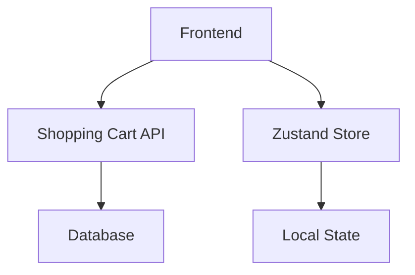

# ショッピングカート アーキテクチャ比較

## 現在の実装（フロント側状態管理）

### アーキテクチャ図



### 実装方式

- Zustandによるクライアント側状態管理
- API呼び出し後にローカル状態を更新
- LocalStorageによる永続化

### メリット

1. **即応性**: UI更新が瞬時
2. **シンプル**: 実装が分かりやすい
3. **オフライン対応**: 一時的な接続断でも動作
4. **サーバー負荷軽減**: 頻繁なサーバーアクセス不要

### デメリット

1. **状態不整合**: サーバーとクライアントのデータずれ
2. **複数タブ問題**: 同一ユーザーの複数タブ間で同期されない
3. **競合状態**: 同時操作時の問題
4. **データ信頼性**: クライアント側データの改ざん可能性

## 提案実装（サーバー側キャッシュ + イベント通知）

### 実装アーキテクチャ図

```mermaid
graph TD;
    A
[Frontend] --> B[API Gateway];
    B --> C[Shopping Cart Service];
    A --> D[WebSocket];
    B --> E[Redis Cache];
    C --> F[Database + Event Store];
```

### WebSocket 実装方式

1. **サーバー側キャッシュ**: Redisでカート状態を管理
2. **イベント駆動**: カート変更時にイベント発行
3. **リアルタイム通知**: WebSocketで変更を即座に通知
4. **楽観的更新**: UI更新後にサーバー同期

### WebSocket メリット

1. **データ整合性**: サーバー側が真実の源泉
2. **マルチクライアント同期**: 複数タブ/デバイス間で自動同期
3. **パフォーマンス**: キャッシュによる高速レスポンス
4. **拡張性**: 大量ユーザーへの対応
5. **監査可能性**: イベントストアによる操作履歴

### WebSocket デメリット

1. **複雑性**: システム全体が複雑になる
2. **インフラ要件**: Redis、WebSocket等の追加コンポーネント
3. **ネットワーク依存**: 常時接続が前提
4. **コスト**: インフラと開発コストの増加

## 推奨アプローチ：ハイブリッド実装

### フェーズ1（現在）: フロント側状態管理の改善

```typescript
interface CartState {
  cart: CartResponse | null;
  localChanges: CartChange[]; // 未同期の変更
  syncStatus: 'synced' | 'pending' | 'error';
  lastSyncTime: number;
}
```

### フェーズ2（将来）: サーバー側キャッシュ追加

```typescript
// Shopping Cart Service側
@Component
public class CartCacheService {
    @Autowired
    private RedisTemplate<String, CartResponse> redisTemplate;
    
    public CartResponse updateCart(String cartId, CartItemRequest request) {
        // 1. データベース更新
        CartResponse cart = cartRepository.addItem(cartId, request);
        
        // 2. キャッシュ更新
        redisTemplate.opsForValue().set("cart:" + cartId, cart, Duration.ofHours(24));
        
        // 3. イベント発行
        eventPublisher.publishEvent(new CartUpdatedEvent(cartId, cart));
        
        return cart;
    }
}
```

### フェーズ3（拡張）: リアルタイム同期

```typescript
// WebSocket integration
const useCartSync = () => {
  useEffect(() => {
    const ws = new WebSocket(`ws://localhost:8088/cart/${sessionId}`);
    
    ws.onmessage = (event) => {
      const cartUpdate = JSON.parse(event.data);
      useCartStore.getState().syncFromServer(cartUpdate);
    };
    
    return () => ws.close();
  }, [sessionId]);
};
```

## 実装判断基準

### 現在のプロジェクトの場合

- **プロトタイプ段階**: フロント側状態管理で十分
- **ユーザー数が少ない**: 複雑性よりシンプルさを優先
- **開発速度重視**: 迅速な機能実装が必要

### キャッシュベースが必要な場合

- **本格運用**: データ整合性が重要
- **大量ユーザー**: 性能とスケーラビリティが必要
- **マルチデバイス**: 複数デバイス間での同期が必須
- **リアルタイム性**: 即座の状態同期が求められる

## 結論

### 現段階では「フロント側状態管理の改善」を推奨

1. まず現在のZustand実装を安定化
2. 楽観的更新とエラーハンドリングを強化
3. 将来的にサーバー側キャッシュへの移行を検討

### 移行タイミング

- ユーザー数が1000人を超えた時点
- マルチデバイス対応が必要になった時点
- データ整合性の問題が頻発した時点
